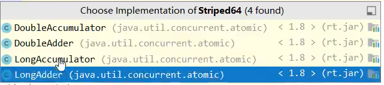
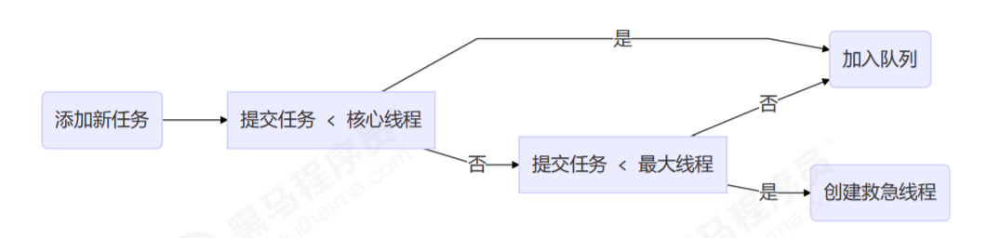
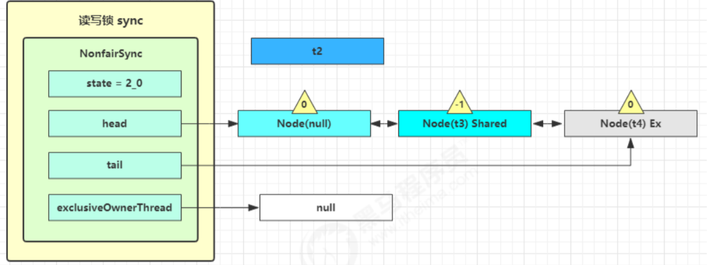

#  二、JUC简介

## 2.1 进程和线程

在 Java 中，线程部分是一个重点， JUC 也是关于线程的。JUC 就是 **java.util .concurrent 工具包的简称**。这是一个处理线程的工具包，JDK  1.5 开始出现的。

**进程（process）** 

**程序由指令和数据组成**，但这些指令要运行，数据要读写，就必须将指令加载至 CPU，数据加载至内存。在 指令运行过程中还需要用到磁盘、网络等设备。进程就是用来加载指令、管理内存、管理 IO 的 

当一个程序被运行，从磁盘加载这个程序的代码至内存，这时就开启了一个进程。 

**进程就可以视为程序的一个实例**。大部分程序可以同时运行多个实例进程（例如记事本、画图、浏览器 等），也有的程序只能启动一个实例进程（例如网易云音乐、360 安全卫士等）

**线程（thread）** 

是操作系统能够进行运算调度的最小单位。它被包含在进程之中，是进程中的实际运作单位。一条线程指的是进程中一个单一顺序的控制流， 一个进程中可以并发多个线程，每条线程并行执行不同的任务。

- 一个进程之内可以分为一到多个线程。 
- **一个线程就是一个指令流**，将指令流中的一条条指令以一定的顺序交给 CPU 执行 
- Java 中，**进程作为资源分配的最小单位，线程作为最小调度单位**。 **在 windows 中进程是不活动的，只是作为线程的容器**


**总结来说：**

进程：指在系统中正在运行的一个应用程序；程序一旦运行就是进程；**进程——资源分配的最小单位。** 

线程：系统分配处理器时间资源的基本单元，或者说进程之内独立执行的一个 单元执行流。**线程——程序执行的最小单位。**

- 进程基本上相互独立的，而线程存在于进程内，是进程的一个子集 
- 进程拥有共享的资源，如内存空间等，供其内部的线程共享 
- **进程间通信较为复杂**。同一台计算机的进程通信称为 IPC（Inter-process communication） **不同计算机之间的进程通信，需要通过网络**，并遵守共同的协议，例如 HTTP 
- 线程通信相对简单，因为它们共享进程内的内存，一个例子是多个线程可以访问同一个共享变量 
- 线程更轻量，线程上下文切换成本一般上要比进程上下文切换低


## 2.2 并行和并发

**并发（单核对多任务）**

在单核 cpu 下，线程实际还是串行执行的。操作系统中有一个组件叫做任务调度器，将 cpu 的时间片（windows下时间片最小约为 15 毫秒）分给不同的程序使用，只是由于 cpu 在线程间（时间片很短）的切换非常快，人类感觉是同时运行的 。一般会将这种线程轮流使用 CPU 的做法称为并发（concurrent）**微观串行宏观并行**

**并行（多核对多任务）**

多核 cpu下，每个核（core） 都可以调度运行线程，这时候线程可以是并行的，不同的线程同时使用不同的cpu在执行。


**二者对比**

引用 Rob Pike 的一段描述：并发（concurrent）是同一时间应对（dealing with）多件事情的能力，并行（parallel）是同一时间动手做（doing）多件事情的能力


## 2.3 同步和异步的概念

<span style ="color:red">以调用方的角度讲</span>，**如果需要等待结果返回才能继续运行的话就是同步，如果不需要等待就是异步**

1) 设计

**多线程可以使方法的执行变成异步的**，比如说读取磁盘文件时，假设读取操作花费了5秒，如果没有线程的调度机制，这么cpu只能等5秒，啥都不能做。

2) 结论

- 比如在项目中，视频文件需要转换格式等操作比较费时，这时开一个新线程处理视频转换，避免阻塞主线程
- **tomcat 的异步 servlet(servlet3.0 异步Servlet) 也是类似的目的，让用户线程处理耗时较长的操作，避免阻塞 tomcat 的工作线程**
- ui 程序中，开线程进行其他操作，避免阻塞 ui 线程


# 三、java线程

## 3.1 创建和运行线程

#### 方法一，直接使用 Thread类

```java
// 构造方法的参数是给线程指定名字，推荐给线程起个名字
Thread t1 = new Thread("t1") {	// 类的匿名实现
 	@Override
    // run 方法内实现了要执行的任务
 	public void run() {
 		log.debug("hello");
 	}
};
t1.setName("t2");
t1.start();
```


#### 方法二，使用 Runnable 接口配合 Thread

把【线程】和【任务】（要执行的代码）分开，Thread 代表线程，Runnable 可运行的任务（线程要执行的代码）Test2.java

```java
// 创建任务对象
Runnable task2 = new Runnable() {
 	@Override
 	public void run() {
 		log.debug("hello");
 	}
};
// 参数1 是任务对象; 参数2 是线程名字，推荐给线程起个名字
Thread t2 = new Thread(task2, "t2");
t2.start();

// 只有一个抽象方法的接口带有@FunctionInterface注解，可以用lambda表达式
// Runnable r = () -> {log.debug("hello");};
```

#### 小结

方法1 是把线程和任务合并在了一起，方法2 是把线程和任务分开了，用 Runnable 更容易与线程池等高级 API 配合，**用 Runnable 让任务类脱离了 Thread 继承体系，更灵活**。通过查看源码可以发现，方法二其实到底还是通过方法一(优先)执行的！

```java
// Thread类中的run方法
@Override
public void run() {
    if (target != null) {
        target.run();
    }
}
```

> 如果有Runnable对象给target属性赋值，运行target属性的run()方法，如果Thread被子类重写，运行重写的run()方法


#### 方法三，FutureTask 配合 Thread(Callable接口)

```java
public class FutureTask<V> implements RunnableFuture<V>;

public interface RunnableFuture<V> extends Runnable, Future<V>;
```

FutureTask 能够接收 Callable 类型的参数，用来处理有返回结果的情况 Test3.java

```java
    public static void main(String[] args) throws ExecutionException, InterruptedException {
        // 实现多线程的第三种方法可以返回数据
        FutureTask futureTask = new FutureTask<>(new Callable<Integer>() {
            // 要执行的任务与返回值
            @Override
            public Integer call() throws Exception {
                log.debug("多线程任务");
                Thread.sleep(100);
                return 100;
            }
        });
        // 主线程阻塞，同步等待 task 执行完毕的结果
        // FutureTask也是相当于一个任务,作为Thread的参数
        new Thread(futureTask,"我的名字").start();
        log.debug("主线程");
        // 主线程阻塞等待futureTask线程返回结果
        log.debug("{}",futureTask.get());
    }
```

Future就是对于具体的Runnable或者Callable任务的执行结果进行取消、查询是否完成、获取结果。必要时可以**通过get方法获取执行结果**，该方法会阻塞直到任务返回结果。

```java
public interface Future<V> {
    boolean cancel(boolean mayInterruptIfRunning);
    boolean isCancelled();
    boolean isDone();
    V get() throws InterruptedException, ExecutionException;
    V get(long timeout, TimeUnit unit)
        throws InterruptedException, ExecutionException, TimeoutException;
}

```

  Future提供了三种功能：   　　

1. 判断任务是否完成；   　　

2. 能够中断任务；   　　

3. 能够获取任务执行结果。   

[FutureTask是Future和Runable的实现](https://mp.weixin.qq.com/s/RX5rVuGr6Ab0SmKigmZEag)


#### 方法四，使用线程池

```java
class NumberThread implements Runnable{

    @Override
    public void run() {
        for(int i = 0;i <= 100;i++){
            if(i % 2 == 0){
                System.out.println(Thread.currentThread().getName() + ": " + i);
            }
        }
    }
}

class NumberThread1 implements Runnable{

    @Override
    public void run() {
        for(int i = 0;i <= 100;i++){
            if(i % 2 != 0){
                System.out.println(Thread.currentThread().getName() + ": " + i);
            }
        }
    }
}

public class ThreadPool {

    public static void main(String[] args) {
        //1. 提供指定线程数量的线程池
        ExecutorService service = Executors.newFixedThreadPool(10);
        ThreadPoolExecutor service1 = (ThreadPoolExecutor) service;
        //设置线程池的属性
//        System.out.println(service.getClass());
//        service1.setCorePoolSize(15);
//        service1.setKeepAliveTime();


        //2.执行指定的线程的操作。需要提供实现Runnable接口或Callable接口实现类的对象
        service.execute(new NumberThread());//适合适用于Runnable
        service.execute(new NumberThread1());//适合适用于Runnable

//        service.submit(Callable callable);//适合使用于Callable
        //3.关闭连接池
        service.shutdown();
    }

}
```


### 查看进程线程方法


   


## 3.2 线程运行原理

### 虚拟机栈与栈帧

拟机栈描述的是Java方法执行的内存模型：每个方法被执行的时候都会同时创建一个栈帧(stack frame)用于存储**局部变量表、操作数栈、动态链接、方法出口**等信息，是属于线程的私有的。当java中使用多线程时，每个线程都会维护它自己的栈帧！每个线程只能有一个活动栈帧，对应着当前正在执行的那个方法


### 线程上下文切换（Thread Context Switch）

因为以下一些原因导致 cpu 不再执行当前的线程，转而执行另一个线程的代码

- 线程的 cpu 时间片用完(每个线程轮流执行，看前面并行的概念)
- 垃圾回收（STP）
- 有更高优先级的线程需要运行
- 线程自己调用了 `sleep`、`yield`、`wait`、`join`、`park`、`synchronized`、`lock` 等方法（主动）

当 Context Switch 发生时，需要由操作系统保存当前线程的状态，并恢复另一个线程的状态，Java 中对应的概念
就是程序计数器（Program Counter Register），它的作用是记住下一条 jvm 指令的执行地址，是线程私有的

**频繁的Context Switch会影响性能（线程数超过核心数一定程度后，切换频繁，性能下降）**


## 3.3 Thread的常见方法


### 3.3.1 start 与 run

#### 调用start

```java
    public static void main(String[] args) {
        Thread thread = new Thread(){
          @Override
          public void run(){
              log.debug("我是一个新建的线程正在运行中");
              FileReader.read(fileName);
          }
        };
        thread.setName("新建线程");
        thread.start();
        log.debug("主线程");
    }
```

输出：程序在 t1 线程运行， `run()`方法里面内容的调用是异步的 Test4.java

```properties
11:59:40.711 [main] DEBUG com.concurrent.test.Test4 - 主线程
11:59:40.711 [新建线程] DEBUG com.concurrent.test.Test4 - 我是一个新建的线程正在运行中
11:59:40.732 [新建线程] DEBUG com.concurrent.test.FileReader - read [test] start ...
11:59:40.735 [新建线程] DEBUG com.concurrent.test.FileReader - read [test] end ... cost: 3 ms
```

#### 调用run

将上面代码的`thread.start();`改为 `thread.run();`输出结果如下：程序仍在 main 线程运行， `run()`方法里面内容的调用还是同步的

```properties
12:03:46.711 [main] DEBUG com.concurrent.test.Test4 - 我是一个新建的线程正在运行中
12:03:46.727 [main] DEBUG com.concurrent.test.FileReader - read [test] start ...
12:03:46.729 [main] DEBUG com.concurrent.test.FileReader - read [test] end ... cost: 2 ms
12:03:46.730 [main] DEBUG com.concurrent.test.Test4 - 主线程
```

#### 小结

**直接调用 `run()` 是在主线程中执行了 `run()`，没有启动新的线程**，还是同步执行
**使用 `start()` 是启动新的线程，通过新的线程间接执行 `run()`方法 中的代码**


### 3.3.2 sleep 与 yield

#### sleep

1. **调用 sleep 会让当前线程从 Running 进入 Timed Waiting 状态（阻塞）**

2. 其它线程可以**使用正在睡眠的线程的 interrupt 方法打断正在睡眠的线程**，那么被打断的线程这时就会抛出 `InterruptedException`异常【注意：这里打断的是正在休眠的线程，而不是其它状态的线程】

3. 睡眠结束后的线程未必会立刻得到执行(需要分配到cpu时间片)

4. 建议用 TimeUnit 的 `sleep()` 代替 Thread 的 `sleep()`来获得更好的可读性

   ```java
   // 在哪个线程中调用就使哪个线程sleep
   Thread.sleep(2000);
   TimeUnit.SECONDS.sleep(1);
   ```

#### yield(让出、谦让)

1. **调用 yield 会让当前线程从 Running 进入 Runnable 就绪状态**，然后调度执行其它线程
2. 具体的实现依赖于操作系统的任务调度器(就是**可能没有其它的线程正在执行，虽然调用了yield方法，但是也可能让不出去**)

#### 小结

yield使cpu调用其它线程，但是cpu可能会再分配时间片给该线程；而sleep需要等过了休眠时间之后才有可能被分配cpu时间片


### 3.3.3 线程优先级（1-10）

线程优先级会提示（hint）调度器优先调度该线程，但它**仅仅是一个提示，调度器可以忽略**它；**如果 cpu 比较忙，那么优先级高的线程会获得更多的时间片，但 cpu 闲时，优先级几乎没作用**


### 3.3.4 join

**在主线程中调用t1.join，则主线程会等待t1线程执行完之后再继续执行** Test10.java

```java
    private static void test1() throws InterruptedException {
        log.debug("开始");
        Thread t1 = new Thread(() -> {
            log.debug("开始");
            sleep(1);
            log.debug("结束");
            r = 10;
        },"t1");
        t1.start();
        t1.join();	// 等待t1进程结束
        log.debug("结果为:{}", r);
        log.debug("结束");
    }
```


### 3.3.5 interrupt 方法详解

#### 打断 sleep，wait，join 正在阻塞的线程

先了解一些interrupt()方法的相关知识：[博客地址](https://www.cnblogs.com/noteless/p/10372826.html#0)

 **sleep，wait，join 的线程，这几个方法都会让线程进入阻塞状态**，以 sleep 为例Test7.java

```java
    public static void main(String[] args) throws InterruptedException {
        Thread t1 = new Thread() {
            @Override
            public void run() {
                log.debug("线程任务执行");
                try {
                    Thread.sleep(10000); // wait, join
                } catch (InterruptedException e) {
                    //e.printStackTrace();
                    log.debug("被打断");
                }
            }
        };
        t1.start();
        Thread.sleep(500);
        log.debug("111是否被打断？{}",t1.isInterrupted());
        t1.interrupt();
        log.debug("222是否被打断？{}",t1.isInterrupted());
        Thread.sleep(500);
        log.debug("222是否被打断？{}",t1.isInterrupted());
        log.debug("主线程");
    }
```

输出结果：（我下面将中断和打断两个词混用）可以看到，**打断 sleep 的线程, 会清空中断状态，刚被中断(阻塞)完之后`t1.isInterrupted()`的值为`true`，后来变为`false`，即中断状态会被清除**。那么线程是否被中断过可以通过异常来判断。【同时要注意**如果打断被`join()`，`wait()` blocked的线程也是一样会被清除**，被清除(interrupt status will be cleared)的意思即中断状态设置为`false`，被设置( interrupt status will be set)的意思就是中断状态设置为`true`】

```properties
17:06:11.890 [Thread-0] DEBUG com.concurrent.test.Test7 - 线程任务执行
17:06:12.387 [main] DEBUG com.concurrent.test.Test7 - 111是否被打断？false
17:06:12.390 [Thread-0] DEBUG com.concurrent.test.Test7 - 被打断
17:06:12.390 [main] DEBUG com.concurrent.test.Test7 - 222是否被打断？true
17:06:12.890 [main] DEBUG com.concurrent.test.Test7 - 222是否被打断？false
17:06:12.890 [main] DEBUG com.concurrent.test.Test7 - 主线程
```


#### 打断正常运行的线程

**打断正常运行的线程, 线程并不会暂停，只是调用方法Thread.currentThread().isInterrupted();的返回值为true**，可以判断Thread.currentThread().isInterrupted();的值来手动停止线程

```java
    public static void main(String[] args) throws InterruptedException {
        Thread t1 = new Thread(() -> {
            while(true) {
                boolean interrupted = Thread.currentThread().isInterrupted();
                if(interrupted) {
                    log.debug("被打断了, 退出循环");
                    break;
                }
            }
        }, "t1");
        t1.start();
        Thread.sleep(1000);
        log.debug("interrupt");
        t1.interrupt();
    }
```


#### 终止模式之两阶段终止模式


Two Phase Termination，就是考虑**在一个线程T1中如何优雅地终止另一个线程T2**？这里的优雅指的是给T2一个料理后事的机会（如释放锁）。

如下所示：那么线程的`isInterrupted()`方法可以取得线程的打断标记，**如果线程在睡眠`sleep`期间被打断，打断标记是不会变的，为false，但是`sleep`期间被打断会抛出异常，我们据此手动设置打断标记为`true`；如果是在程序正常运行期间被打断的，那么打断标记就被自动设置为`true`。**处理好这两种情况那我们就可以放心地来料理后事啦！


代码实现如下：

```java
@Slf4j
public class Test11 {
    public static void main(String[] args) throws InterruptedException {
        // 在主线程中优雅地终止另一个线程
        TwoParseTermination twoParseTermination = new TwoParseTermination();
        twoParseTermination.start();
        Thread.sleep(3000);  // 让监控线程执行一会儿
        twoParseTermination.stop(); // 停止监控线程
    }
}

// 监控线程类
@Slf4j
class TwoParseTermination{
    // 监控线程
    Thread thread ;
    
    // 启动监控线程
    public void start(){
        thread = new Thread(()->{
            while(true){
                if (Thread.currentThread().isInterrupted()){
                    log.debug("线程结束。。正在料理后事中");
                    break;
                }
                try {
                    Thread.sleep(500);	// 睡眠过程中被打断
                    log.debug("正在执行监控的功能");	// 执行过程中被打断
                } catch (InterruptedException e) {
                    // 睡眠过程中被打断，清除打断标记
                    // 捕获异常，重新设置打断标记为true
                    Thread.currentThread().interrupt();
                    e.printStackTrace();
                }
            }
        });
        thread.start();
    }
    
    // 停止监控线程
    public void stop(){
        thread.interrupt();
    }
}
```


### 3.3.6 park


如果打断标记已经是true，则park会失效

主动清除打断标记，调用interrupted()方法：返回打断标记并清除


### 3.3.7 过时方法


### 3.3.8 sleep，yiled，wait，join 对比

关于join的原理和这几个方法的对比：[看这里](https://blog.csdn.net/dataiyangu/article/details/104956755)

> 补充：
>
> 1. sleep，join，yield，interrupted是Thread类中的方法
> 2. wait/notify是object中的方法
>
> sleep 不释放锁、释放cpu
> join 释放锁、抢占cpu
> yiled 不释放锁、释放cpu
> wait 释放锁、释放cpu


## 3.4 守护线程

默认情况下，java进程需要等待所有的线程结束后才会停止，但是有一种特殊的线程，叫做守护线程，**在其他线程全部结束的时候即使守护线程还未结束代码未执行完java进程也会停止**。普通线程t1可以调用`t1.setDeamon(true);` 方法变成守护线程 


> 注意
> **垃圾回收器线程**就是一种守护线程
> **Tomcat 中的 Acceptor 和 Poller 线程都是守护线程**，所以 Tomcat 接收到 shutdown 命令后，不会等待它们处理完当前请求


## 3.5 线程状态之五种状态

**五种状态的划分主要是从操作系统的层面进行划分**的

创建、就绪、运行、阻塞、终止


1. **初始状态（创建状态）**，仅仅是**在语言层面上创建了线程对象**，即`Thead thread = new Thead();`，还**未与操作系统线程关联**
2. **可运行状态，也称就绪状态**，指该线程已经被创建，与操作系统相关联，等待cpu给它分配时间片就可运行
3. **运行状态**，指线程获取了CPU时间片，正在运行
   1. 当CPU时间片用完，线程会转换至【可运行状态】，等待 CPU再次分配时间片，会导致我们前面讲到的上下文切换
4. **阻塞状态**
   1. 如果调用了阻塞API，如BIO读写文件，那么线程实际上不会用到CPU，不会分配CPU时间片，会导致上下文切换，进入【阻塞状态】
   2. 等待BIO操作完毕，会由操作系统唤醒阻塞的线程，转换至【可运行状态】
   3. 与【可运行状态】的区别是，只要操作系统一直不唤醒线程，调度器就一直不会考虑调度它们，CPU就一直不会分配时间片
5. **终止状态**，表示线程已经执行完毕，生命周期已经结束，不会再转换为其它状态


## 3.6 线程状态之六种状态

这是从 Java API 层面来描述的，我们主要研究的就是这种。状态转换详情图：[地址](https://www.jianshu.com/p/ec94ed32895f)
**根据 Thread.State 枚举，分为六种状态** Test12.java

new（创建）、runnable（就绪、运行、阻塞）、blocked、waiting、timed_waiting、terminal（终止）


1. NEW 跟五种状态里的初始状态是一个意思
2. RUNNABLE 是当调用了 `start()` 方法之后的状态，注意，**Java API 层面的 `RUNNABLE` 状态涵盖了操作系统层面的【就绪状态】、【运行状态】和【io阻塞状态】（由于 BIO 导致的线程阻塞，在 Java 里无法区分与控制，仍然认为是可运行）**
3. **`BLOCKED`（不能获得锁） ， `WAITING`（无时间的等待） ， `TIMED_WAITING`（有时间的等待） 都是 Java API 层面对【阻塞状态】的细分，后面会在状态转换一节**


# 四、共享模型之管程（Monitor）

## 4.1 线程出现问题的根本原因分析

线程出现问题的根本原因是因为线程上下文切换，导致线程里的指令没有执行完就切换执行其它线程了，下面举一个例子 Test13.java

```java
    static int count = 0;
    public static void main(String[] args) throws InterruptedException {
        Thread t1 = new Thread(()->{
            for (int i = 1;i<5000;i++){
                count++;
            }
        });
        Thread t2 =new Thread(()->{
            for (int i = 1;i<5000;i++){
                count--;
            }
        });
        t1.start();
        t2.start();
        t1.join();
        t2.join();
        log.debug("count的值是{}",count);
    }
```

我将从字节码的层面进行分析：


```java
getstatic i // 获取静态变量i的值
iconst_1 // 准备常量1
iadd // 自增
putstatic i // 将修改后的值存入静态变量i
    
getstatic i // 获取静态变量i的值
iconst_1 // 准备常量1
isub // 自减
putstatic i // 将修改后的值存入静态变量i
```

可以看到`count++` 和 `count--` 操作实际都是需要这个4个指令完成的，那么这里问题就来了！Java 的内存模型如下，完成静态变量的自增，自减需要在主存和工作内存中进行数据交换：


如果代码是正常按顺序运行的，那么count的值不会计算错


出现负数的情况：


出现正数的情况：


问题的进一步描述


### 临界区

1. 一个程序运行多线程本身是没有问题的

2. 问题出现在多个线程共享资源的时候

   1. 多个线程同时对共享资源进行读操作本身也没有问题
   2. 问题出现在对对共享资源同时进行读写操作时就有问题了 

3. 先定义一个叫做临界区的概念：**一段代码内如果存在对共享资源的多线程读写操作，那么称这段代码为临界区**

3. 临界区：对共享资源有读写操作的代码片段

   1. 如

      ```java
      static int counter = 0;
      static void increment()
      {// 临界区
       counter++;
      }
      static void decrement()
      {// 临界区
       counter--;
      }
      ```


### 竞态条件

多个线程在临界区执行，那么由于代码指令的执行不确定而导致的结果问题，称为竞态条件


## 4.2 synchronized 解决方案

为了避免临界区中的竞态条件发生，由多种手段可以达到

- **阻塞式解决方案：synchronized ，Lock**
- **非阻塞式解决方案：原子变量**

现在讨论使用synchronized来进行解决，即俗称的**对象锁**，它采用互斥的方式让同一时刻至多只有一个线程持有对象锁，其他线程如果想获取这个锁就会阻塞住，这样就能保证拥有锁的线程可以安全的执行临界区内的代码，不用担心线程上下文切换

> 注意
> 虽然 java 中互斥和同步都可以采用 synchronized 关键字来完成，但它们还是有区别的：
>
> 互斥是保证临界区的竞态条件发生，同一时刻只能有一个线程执行临界区的代码                                                                 同步是由于线程执行的先后，顺序不同但是需要一个线程等待其它线程运行到某个点。


### synchronized

```java
synchronized(对象) // 线程1获得锁， 那么线程2的状态是(blocked)
{
 临界区
}
```

上面的实例程序使用synchronized后如下，计算出的结果是正确！Test13.java

```java
static int counter = 0;
static final Object room = new Object();
public static void main(String[] args) throws InterruptedException {
     Thread t1 = new Thread(() -> {
         for (int i = 0; i < 5000; i++) {
             synchronized (room) {
             	counter++;
        	}
 		}
 	}, "t1");
     Thread t2 = new Thread(() -> {
         for (int i = 0; i < 5000; i++) {
             synchronized (room) {
             	counter--;
         	}
     }
     }, "t2");
     t1.start();
     t2.start();
     t1.join();
     t2.join();
     log.debug("{}",counter);
}

```


### synchronized原理

**synchronized实际上利用对象保证了临界区代码(一组的字节码指令)的原子性**，临界区内的代码在外界看来是不可分割的，不会被线程切换所打断

释放锁，并且唤醒被阻塞的线程


> 如果t2未加synchronized，t2线程不会获取锁，也不会被阻塞（相当于直接踹门）


上述过程以面向对象的思想改进，互斥逻辑的封装

​	


### synchronized 加在方法上

不能锁方法，锁的是this对象或者类对象

```java
    class Test{
        public synchronized void test() {

        }
    }
    //等价于
    class Test{
        public void test() {
            synchronized(this) {

            }
        }
    }
//------------------------------------------------------------------------------------------------
    class Test{
        public synchronized static void test() {
        }
    }
   // 等价于
    class Test{
        public static void test() {
            synchronized(Test.class) {

            }
        }
    }

```


## 4.3 变量的线程安全分析

### 4.3.1 成员变量和静态变量（类变量）的线程安全分析

- 如果没有变量没有在线程间共享，那么变量是安全的
- **如果变量在线程间共享**
  - 如果只有读操作，则线程安全
  - **如果有读写操作，则这段代码是临界区，需要考虑线程安全**


### 4.3.2 局部变量线程安全分析

- 局部变量【局部变量被初始化为基本数据类型】是安全的
- 局部变量引用的对象未必是安全的
  - 如果局部变量引用的对象没有引用线程共享的对象，那么是线程安全的
  - 如果局部变量引用的对象引用了一个线程共享的对象（逃离局部作用范围），那么要考虑线程安全的

#### 线程安全的情况

**局部变量【局部变量被初始化为基本数据类型】是安全的**，示例如下

```java
public static void test1() {
     int i = 10;
     i++;
}
```

**每个线程调用 test1() 方法时局部变量 i，会在每个线程的栈帧内存中被创建多份，因此不存在共享**


#### 线程不安全的情况

**如果局部变量引用的对象逃离方法的范围，那么要考虑线程安全的**，代码示例如下 Test15.java

```java
public class Test15 {
    public static void main(String[] args) {
        UnsafeTest unsafeTest = new UnsafeTest();
        for (int i =0;i<100;i++){
            new Thread(()->{
                unsafeTest.method1();
            },"线程"+i).start();
        }
    }
}
class UnsafeTest{
    ArrayList<String> arrayList = new ArrayList<>();
    public void method1(){
        for (int i = 0; i < 100; i++) {
            method2();
            method3();
        }
    }
    private void method2() {
        arrayList.add("1");
    }
    private void method3() {
        arrayList.remove(0);
    }
}
```

##### 不安全原因分析

无论哪个线程中的 method2 和method3 引用的都是同一个对象中的 list 成员变量：一个 ArrayList ，在添加一个元素的时候，它可能会有两步来完成： 

    1. 第一步，在 arrayList[Size] 的位置存放此元素； 第二步增大 Size 的值。 
    2. 在单线程运行的情况下，如果 Size = 0，添加一个元素后，此元素在位置 0，而且 Size=1；而如果是在多线程情下，比如有两个线程，线程 A 先将元素存放在位置 0。但是此时 CPU 调线程A暂停，线程 B 得到运行的机会。线程B也向此 ArrayList 添加元素，因为此时 Size 仍等于 0 （注意哦，我们假设的是添加一个元素是要两个步骤哦，而线程A仅仅完成了步骤1），所以线程B也将元素存放在位置0。然后线程A和线程B都继续运行，都增加 Size 的值。 那好，现在我们来看看 ArrayList 的情况，元素实际上只有一个，存放在位置 0，而 Size 却等于 2。这就是“线程不 安全”了。 


##### 解决方法

可以将list修改成局部变量，那么就不会有上述问题了

```java
class safeTest{
    public void method1(){
        ArrayList<String> arrayList = new ArrayList<>();
        for (int i = 0; i < 100; i++) {
        method2(arrayList);
        method3(arrayList);}
    }
    private void method2(ArrayList arrayList) {
        arrayList.add("1");
    }
    private void method3(ArrayList arrayList) {
        arrayList.remove(0);
    }
}
```

##### 思考  private 或 final的重要性

方法访问修饰符带来的思考，如果把 method2 和 method3 的方法修改为 public 会不会导致线程安全问题？

情况1：有其它线程调用 method2 和 method3；

情况2：在情况1 的基础上，为 ThreadSafe 类添加子类，子类覆盖 method2 或 method3 方法，即如下所示： 从这个例子可以看出 **private 或 public final 提供【安全】的意义所在（限制了子类不能覆盖）**，请体会开闭原则中的【闭】

```java
class ThreadSafe {
    public final void method1(int loopNumber) {
        ArrayList<String> list = new ArrayList<>();
        for (int i = 0; i < loopNumber; i++) {
            method2(list);
            method3(list);
        }
    }
    private void method2(ArrayList<String> list) {
        list.add("1");
    }
    private void method3(ArrayList<String> list) {
        list.remove(0);
    }
}
class ThreadSafeSubClass extends ThreadSafe{
    @Override
    public void method3(ArrayList<String> list) {
        new Thread(() -> {
            list.remove(0);
        }).start();
    }
}
```


### 4.3.3 常见线程安全类

1. String
2. Integer等包装类
3. StringBuffer
4. Random
5. Vector（线程安全的List实现）
6. Hashtable（线程安全的Map实现）
7. java.util.concurrent 包下的类

这里说它们是线程安全的是指，<span style ="color:red">多个线程调用它们同一个实例的某个方法时，是线程安全的</span>。也可以理解为**它们的每个方法是原子的**

```java
Hashtable table = new Hashtable();
new Thread(()->{
 	table.put("key", "value1");
}).start();
new Thread(()->{
 	table.put("key", "value2");
}).start();

```

#### 线程安全类方法的组合

**但注意它们多个方法的组合不是原子的**，见下面分析

```java
Hashtable table = new Hashtable();
// 线程1，线程2
if( table.get("key") == null) {
 table.put("key", value);
}
```


#### 不可变类的线程安全

**`String`和`Integer`类都是不可变的类**，因为其类内部属性是不可改变的，因此它们的方法都是线程安全的，有同学或许有疑问，`String` 有 `replace`，`substring` 等方法【可以】改变值啊，其实调用这些方法返回的已经是一个新创建的对象了！

```java
public class Immutable{
     private int value = 0;
     public Immutable(int value){
     this.value = value;
 	}
     public int getValue(){
         return this.value;
     }
     public Immutable add(int v){
         return new Immutable(this.value + v);
     }
}
```

#### 示例分析-是否线程安全

##### 示例一

分析线程是否安全，先对类的成员变量，类变量，局部变量进行考虑，如果变量会在各个线程之间共享，那么就得考虑线程安全问题了，如果变量A引用的是线程安全类的实例，并且只调用该线程安全类的一个方法，那么该变量A是线程安全的的。下面对实例一进行分析：此类不是线程安全的，`MyAspect`切面类只有一个实例，成员变量`start` 会被多个线程同时进行读写操作

```java
@Aspect
@Component
public class MyAspect {
        // 是否安全？
        private long start = 0L;

        @Before("execution(* *(..))")
        public void before() {
            start = System.nanoTime();
        }

        @After("execution(* *(..))")
        public void after() {
            long end = System.nanoTime();
            System.out.println("cost time:" + (end-start));
        }
    }
```

##### 示例二

此例是典型的三层模型调用，`MyServlet` `UserServiceImpl` `UserDaoImpl`类都只有一个实例，`UserDaoImpl`类中没有成员变量，`update`方法里的变量引用的对象不是线程共享的，所以是线程安全的；`UserServiceImpl`类中只有一个线程安全的`UserDaoImpl`类的实例，那么`UserServiceImpl`类也是线程安全的，同理 `MyServlet`也是线程安全的

```java
public class MyServlet extends HttpServlet {
 // 是否安全
 private UserService userService = new UserServiceImpl();

 public void doGet(HttpServletRequest request, HttpServletResponse response) {
 userService.update(...);
 }
}
public class UserServiceImpl implements UserService {
 // 是否安全
 private UserDao userDao = new UserDaoImpl();
 public void update() {
 userDao.update();
 }
}
public class UserDaoImpl implements UserDao {
 public void update() {
 String sql = "update user set password = ? where username = ?";
 // 是否安全
 try (Connection conn = DriverManager.getConnection("","","")){
 // ...
 } catch (Exception e) {
 // ...
 }
 }
}
```

##### 示例三

跟示例二大体相似，`UserDaoImpl`类中有成员变量，那么多个线程可以对成员变量`conn` 同时进行操作，故是不安全的

```java
public class MyServlet extends HttpServlet {
    // 是否安全
    private UserService userService = new UserServiceImpl();

    public void doGet(HttpServletRequest request, HttpServletResponse response) {
        userService.update(...);
    }
}
public class UserServiceImpl implements UserService {
    // 是否安全
    private UserDao userDao = new UserDaoImpl();
    public void update() {
        userDao.update();
    }
}
public class UserDaoImpl implements UserDao {
    // 是否安全
    private Connection conn = null;
    public void update() throws SQLException {
        String sql = "update user set password = ? where username = ?";
        conn = DriverManager.getConnection("","","");
        // ...
        conn.close();
    }
}
```

##### 示例四

跟示例三大体相似，`UserServiceImpl`类的update方法中 UserDao是作为局部变量存在的，所以每个线程访问的时候都会新建有一个`UserDao`对象，新建的对象是线程独有的，所以是线程安全的

```java
public class MyServlet extends HttpServlet {
    // 是否安全
    private UserService userService = new UserServiceImpl();
    public void doGet(HttpServletRequest request, HttpServletResponse response) {
        userService.update(...);
    }
}
public class UserServiceImpl implements UserService {
    public void update() {
        UserDao userDao = new UserDaoImpl();
        userDao.update();
    }
}
public class UserDaoImpl implements UserDao {
    // 是否安全
    private Connection = null;
    public void update() throws SQLException {
        String sql = "update user set password = ? where username = ?";
        conn = DriverManager.getConnection("","","");
        // ...
        conn.close();
    }
}
```

##### 示例五

```java
public abstract class Test {
    public void bar() {
        // 是否安全
        SimpleDateFormat sdf = new SimpleDateFormat("yyyy-MM-dd HH:mm:ss");
        foo(sdf);
    }
    public abstract foo(SimpleDateFormat sdf);
    public static void main(String[] args) {
        new Test().bar();
    }
}
```

其中 foo 的行为是不确定的，可能导致不安全的发生，被称之为**外星方法**，因为foo方法可以被重写，导致线程不安全。在String类中就考虑到了这一点，String类是`finally`的，子类不能重写它的方法。

```java
    public void foo(SimpleDateFormat sdf) {
        String dateStr = "1999-10-11 00:00:00";
        for (int i = 0; i < 20; i++) {
            new Thread(() -> {
                try {
                    sdf.parse(dateStr);
                } catch (ParseException e) {
                    e.printStackTrace();
                }
            }).start();
        }
    }
```


## 4.4 习题分析

> 为保证线程安全，锁住Account类对象，但是是一种效率较低的做法

```java
@Slf4j(topic = "c.ExerciseTransfer")
public class ExerciseTransfer {
    public static void main(String[] args) throws InterruptedException {
        Account a = new Account(1000);
        Account b = new Account(1000);
        Thread t1 = new Thread(() -> {
            for (int i = 0; i < 1000; i++) {
                a.transfer(b, randomAmount());
            }
        }, "t1");
        Thread t2 = new Thread(() -> {
            for (int i = 0; i < 1000; i++) {
                b.transfer(a, randomAmount());
            }
        }, "t2");
        t1.start();
        t2.start();
        t1.join();
        t2.join();
        // 查看转账2000次后的总金额
        log.debug("total:{}", (a.getMoney() + b.getMoney()));
    }

    // Random 为线程安全
    static Random random = new Random();

    // 随机 1~100
    public static int randomAmount() {
        return random.nextInt(100) + 1;
    }
}

// 账户
class Account {
    private int money;

    public Account(int money) {
        this.money = money;
    }

    public int getMoney() {
        return money;
    }

    public void setMoney(int money) {
        this.money = money;
    }

    // 转账
    public void transfer(Account target, int amount) {
        synchronized(Account.class) {
            if (this.money >= amount) {
                this.setMoney(this.getMoney() - amount);
                target.setMoney(target.getMoney() + amount);
            }
        }
    }
}
```


## 4.5 Monitor 概念

### Java 对象头

以 32 位虚拟机为例,

普通对象的对象头结构如下，其中的Klass Word为指针，指向对应的Class对象：


数组对象


其中 Mark Word 结构为以下五种情况：


所以一个对象的结构如下：


### Monitor(重量级锁)原理

操作系统提供的**Monitor对象**被翻译为监视器或者说**管程**

**每个java对象都可以关联一个Monitor，如果使用`synchronized`给对象上锁（重量级），该对象头的Mark Word中就被设置为指向Monitor对象的指针**


- 刚开始时Monitor中的Owner为null
- 当Thread-2 执行synchronized(obj){}代码时就会将Monitor的所有者Owner 设置为 Thread-2，上锁成功，**Monitor中同一时刻只能有一个Owner**
- 当Thread-2 占据锁时，如果线程Thread-3，Thread-4也来执行synchronized(obj){}代码，就会**进入EntryList中变成BLOCKED状态**
- Thread-2 执行完同步代码块的内容，然后**唤醒 EntryList 中等待的线程来竞争锁，竞争时是非公平的**
- 图中 WaitSet 中的 Thread-0，Thread-1 是之前获得过锁，但条件不满足进入 WAITING 状态的线程，后面讲wait-notify 时会分析

> 注意：synchronized 必须是进入同一个对象的 monitor 才有上述的效果
>
> 不加 synchronized 的对象不会关联监视器，不遵从以上规则


### synchronized原理

代码如下 Test17.java

```java
    static final Object lock=new Object();
    static int counter = 0;
    public static void main(String[] args) {
        synchronized (lock) {
            counter++;
        }
    }
```

反编译后的部分字节码

```properties
 # 取得lock的引用（synchronized开始了）
 0 getstatic #2 <com/concurrent/test/Test17.lock>
 # 复制操作数栈栈顶的值放入栈顶，即复制了一份lock的引用
 3 dup    
 # 操作数栈栈顶的值弹出，即将lock的引用存到局部变量表中（为了解锁使用）
 4 astore_1
 # 将lock对象的Mark Word置为指向Monitor指针
 5 monitorenter
 6 getstatic #3 <com/concurrent/test/Test17.counter>
 9 iconst_1
10 iadd
11 putstatic #3 <com/concurrent/test/Test17.counter>
# 从局部变量表中取得lock的引用，放入操作数栈栈顶
14 aload_1
# 将lock对象的Mark Word重置，唤醒EntryList
15 monitorexit
# 下面是异常处理指令，可以看到，如果出现异常，也能自动地释放锁
16 goto 24 (+8)
19 astore_2
20 aload_1
21 monitorexit
22 aload_2
23 athrow
24 return

```

> 注意：方法级别的 synchronized 不会在字节码指令中有所体现（在底层的c++实现）


### synchronized 原理进阶

#### 理解


#### 轻量级锁

轻量级锁的使用场景是：**如果一个对象虽然有多个线程要对它进行加锁，但是加锁的时间是错开的（也就是没有人可以竞争的），那么可以使用轻量级锁来进行优化**。

轻量级锁对使用者是透明的，即**语法仍然是`synchronized`**，假设有两个方法同步块，利用同一个对象加锁

```java
static final Object obj = new Object();
public static void method1() {
     synchronized( obj ) {
         // 同步块 A
         method2();
     }
}
public static void method2() {
     synchronized( obj ) {
         // 同步块 B
     }
}
```

1. （**针对于轻量级锁**）每次指向到synchronized代码块时，都会创建锁记录（Lock Record）对象，每个线程都会包括一个（方法的栈帧中）锁记录的结构，锁记录内部可以储存对象的Mark Word和对象引用reference
   
   
   
2. **让锁记录中的Object reference指向对象，并且尝试用cas(compare and sweep)替换Object对象的Mark Word ，将Mark Word 的值存入锁记录中**
   
   
   
3. 如果cas替换成功，那么对象的对象头储存的就是锁记录的地址和状态00（轻量级锁，01无锁，10重量级锁），如下所示
   
   
   
4. 如果cas失败，有两种情况
   1. 如果是其它线程已经持有了该Object的轻量级锁，那么表示有竞争，将进入锁膨胀阶段
   
   2. 如果是自己的线程已经执行了synchronized进行加锁，那么那么再添加一条 Lock Record 作为重入的计数**（synchronized锁重入，同一个线程对一个对象多次加锁）**
      
      
   
5. 当线程退出synchronized代码块的时候，**如果获取的是取值为 null 的锁记录 **，表示有重入，这时重置锁记录，表示重入计数减一（**解开一把锁**）
   
   
   
6. 当线程退出synchronized代码块的时候，**如果获取的锁记录取值不为 null，那么使用cas将Mark Word的值恢复给对象**
   1. 成功则解锁成功
   2. **失败，则说明轻量级锁进行了锁膨胀或已经升级为重量级锁**，进入重量级锁解锁流程


#### 锁膨胀

如果在尝试加轻量级锁的过程中，cas操作无法成功，这是有一种情况就是**其它线程已经为这个对象加上了轻量级锁，这是就要进行锁膨胀，将轻量级锁变成重量级锁**。

1. 当 Thread-1 进行轻量级加锁时，Thread-0 已经对该对象加了轻量级锁
   1. 
2. 这时 Thread-1 加轻量级锁失败，进入锁膨胀流程
   1. 即**为对象申请Monitor锁，让Object指向重量级锁地址，然后自己进入Monitor 的EntryList 变成BLOCKED状态，monitor的Owner指向原先轻量级锁的拥有线程**
   2. 
3. 当**Thread-0 推出synchronized同步块时，使用cas将Mark Word的值恢复给对象头，失败，那么会进入重量级锁的解锁过程**，即按照Monitor的地址找到Monitor对象，Thread-0对象头信息在Monitor中还原回去，将Owner设置为null，唤醒EntryList 中的Thread-1线程


#### 自旋优化

**重量级锁竞争的时候，还可以使用自旋（循环等待不进入阻塞）来进行优化**，如果当前线程自旋成功（即在自旋的时候持锁的线程释放了锁），那么**当前线程就可以不用进行上下文切换就获得了锁**

> 线程的阻塞唤醒需要从用户态切换到核心态，核心态改变tcb(进程控制表)切换到另外一个线程的核心态，再进入用户态，是一个重量级操作

1. 自旋重试成功的情况
   
   
   
2. 自旋重试失败的情况，自旋了一定次数还是没有等到持锁的线程释放锁
   
   

自旋会占用 CPU 时间，单核 CPU 自旋就是浪费，**多核 CPU 自旋才能发挥优势（自旋10次）**。在 Java 6 之后自旋锁是自适应的，比如对象刚刚的一次自旋操作成功过，那么认为这次自旋成功的可能性会高，就多自旋几次；反之，就少自旋甚至不自旋，总之，比较智能。Java 7 之后不能控制是否开启自旋功能


#### 偏向锁

在轻量级的锁中，我们可以发现，如果同一个线程对同一个对象进行重入锁时，也需要执行CAS操作，这是有点耗时滴

那么java6开始引入了偏向锁，**只有第一次使用CAS时将对象的Mark Word头设置为入锁线程ID，之后这个入锁线程再进行重入锁时，发现线程ID是自己的，那么就不用再进行CAS了**


 

##### 偏向状态


一个对象的创建过程

1. 如果**开启了偏向锁（默认是开启的），那么对象刚创建之后，Mark Word 最后三位的值101**，并且这是它的Thread，epoch，age都是0，在加锁的时候进行设置这些的值.

2. **偏向锁默认是延迟的**，不会在程序启动的时候立刻生效，如果想避免延迟，可以添加虚拟机参数来禁用延迟：-`XX:BiasedLockingStartupDelay=0`来禁用延迟

3. 注意：处于偏向锁的对象解锁后，线程 id 仍存储于对象头中

4. 实验Test18.java，加上虚拟机参数-XX:BiasedLockingStartupDelay=0进行测试

   ```java
   public static void main(String[] args) throws InterruptedException {
           Test1 t = new Test1();
           test.parseObjectHeader(getObjectHeader(t))；
           synchronized (t){
               test.parseObjectHeader(getObjectHeader(t));
           }
           test.parseObjectHeader(getObjectHeader(t));
       }
   ```

   输出结果如下，三次输出的状态码都为101

   ```properties
   biasedLockFlag (1bit): 1
   	LockFlag (2bit): 01
   biasedLockFlag (1bit): 1
   	LockFlag (2bit): 01
   biasedLockFlag (1bit): 1
   	LockFlag (2bit): 01
   ```


测试禁用：如果没有开启偏向锁，那么对象创建后最后三位的值为001，这时候它的		hashcode，age都为0，hashcode是第一次用到`hashcode`时才赋值的。在上面测试代码运行时在添加 **VM 参数`-XX:-UseBiasedLocking`禁用偏向锁**（禁用偏向锁则优先使用轻量级锁），退出`synchronized`状态变回001

1. 测试代码Test18.java 虚拟机参数`-XX:-UseBiasedLocking`

2. 输出结果如下，最开始状态为001，然后加轻量级锁变成00，最后恢复成001

   ```properties
   biasedLockFlag (1bit): 0
   	LockFlag (2bit): 01
   LockFlag (2bit): 00
   biasedLockFlag (1bit): 0
   	LockFlag (2bit): 01
   ```


##### 撤销偏向锁-hashcode方法

测试 `hashCode`：**当调用对象的hashcode方法的时候就会撤销这个对象的偏向锁，因为使用偏向锁时没有位置存`hashcode`的值了**（轻量级锁的hashcode存在于线程栈帧的锁记录里，重量级锁的hashcode存在于monitor对象里）

1. 测试代码如下，使用虚拟机参数`-XX:BiasedLockingStartupDelay=0`  ，确保我们的程序最开始使用了偏向锁！但是结果显示程序还是使用了轻量级锁。  Test20.java

   ```java
       public static void main(String[] args) throws InterruptedException {
           Test1 t = new Test1();
           t.hashCode();
           test.parseObjectHeader(getObjectHeader(t));
   
           synchronized (t){
               test.parseObjectHeader(getObjectHeader(t));
           }
           test.parseObjectHeader(getObjectHeader(t));
       }
   ```

2. 输出结果

   ```properties
   biasedLockFlag (1bit): 0
   	LockFlag (2bit): 01
   LockFlag (2bit): 00
   biasedLockFlag (1bit): 0
   	LockFlag (2bit): 01
   ```


##### 撤销偏向锁-其它线程使用对象

这里我们演示的是**偏向锁撤销变成轻量级锁的过程（多个线程错开使用对象）**，那么就得满足轻量级锁的使用条件，就是没有线程对同一个对象进行锁竞争，我们使用`wait` 和 `notify` 来辅助实现

1. 代码 Test19.java，虚拟机参数`-XX:BiasedLockingStartupDelay=0`确保我们的程序最开始使用了偏向锁！

2. 输出结果，最开始使用的是偏向锁，但是第二个线程尝试获取对象锁时，发现本来对象偏向的是线程一，那么偏向锁就会失效，加的就是轻量级锁

   ```properties
   biasedLockFlag (1bit): 1
   	LockFlag (2bit): 01
   biasedLockFlag (1bit): 1
   	LockFlag (2bit): 01
   biasedLockFlag (1bit): 1
   	LockFlag (2bit): 01
   biasedLockFlag (1bit): 1
   	LockFlag (2bit): 01
   LockFlag (2bit): 00
   biasedLockFlag (1bit): 0
   	LockFlag (2bit): 01
   ```

   

##### 撤销 - 调用 wait/notify

会使对象的锁变成重量级锁，因为wait/notify方法之后重量级锁才支持


##### 批量重偏向

如果对象被多个线程访问，但是没有竞争，这时候**偏向了线程一的对象又有机会重新偏向线程二，即可以不用升级为轻量级锁，重偏向会重置对象的Thread ID**

要实现重新偏向是要有条件的：**当撤销偏向锁（加上轻量级锁）阈值超过20次后，给后续对象加锁时重新偏向至加锁线程**

当一个线程关联多个锁对象（偏向锁）时，当另外一个线程使用这些锁对象造成撤销偏向锁加上轻量级锁时，超过20次，会出现批量重偏向，后续的锁对象会偏向当前线程。


##### 批量撤销

当一个线程的偏向锁如果撤销次数到达40的时候；那么JVM会把这个对象所对应的类所有的对象都撤销偏向锁；并且新实例化的对象也是不可偏向的


[(19条消息) 并发编程：批量重偏向、批量撤销_Fisher3652的博客-CSDN博客_批量重偏向](https://blog.csdn.net/qq_40977118/article/details/108578312)

> t2 0~18 轻量级，19~39 偏向 t2.
> t3 全部轻量级，38 开始批量撤销

```java
@Slf4j(topic = "c.TestBiased")
public class TestBiased {

    static Thread t1,t2,t3;

    public static void main(String[] args) throws InterruptedException {
        test4();
    }
    private static void test4() throws InterruptedException {
        Vector<Dog> list = new Vector<>();

        int loopNumber = 38;
        t1 = new Thread(() -> {
            for (int i = 0; i < loopNumber; i++) {
                Dog d = new Dog();
                list.add(d);
                synchronized (d) {
                    log.debug(i + "\t" + ClassLayout.parseInstance(d).toPrintableSimple(true));
                }
            }
            LockSupport.unpark(t2);
        }, "t1");
        t1.start();

        t2 = new Thread(() -> {
            LockSupport.park();
            log.debug("===============> ");
            for (int i = 0; i < loopNumber; i++) {
                Dog d = list.get(i);
                log.debug(i + "\t" + ClassLayout.parseInstance(d).toPrintableSimple(true));
                synchronized (d) {
                    log.debug(i + "\t" + ClassLayout.parseInstance(d).toPrintableSimple(true));
                }
                log.debug(i + "\t" + ClassLayout.parseInstance(d).toPrintableSimple(true));
            }
            LockSupport.unpark(t3);
        }, "t2");
        t2.start();

        t3 = new Thread(() -> {
            LockSupport.park();
            log.debug("===============> ");
            for (int i = 0; i < loopNumber; i++) {
                Dog d = list.get(i);
                log.debug(i + "\t" + ClassLayout.parseInstance(d).toPrintableSimple(true));
                synchronized (d) {
                    log.debug(i + "\t" + ClassLayout.parseInstance(d).toPrintableSimple(true));
                }
                log.debug(i + "\t" + ClassLayout.parseInstance(d).toPrintableSimple(true));
            }
        }, "t3");
        t3.start();

        t3.join();
        log.debug(ClassLayout.parseInstance(new Dog()).toPrintableSimple(true));
    }
}

class Dog {

}
```


### 锁粗化与锁消除

[(19条消息) Java锁消除和锁粗化_lzf的博客-CSDN博客_锁粗化](https://blog.csdn.net/qq_26222859/article/details/80546917)

**锁粗化**就是告诉我们任何事情都有个度，有些情况下我们反而希望把很多次锁的请求合并成一个请求，以降低短时间内大量锁请求、同步、释放带来的性能损耗

```java
public void doSomethingMethod(){
    synchronized(lock){
        //do some thing
    }
    //这是还有一些代码，做其它不需要同步的工作，但能很快执行完毕
    synchronized(lock){
        //do other thing
    }
    
    for(int i=0;i<size;i++){
    	synchronized(lock){
    	}
	}
}
```

```JAVA
public void doSomethingMethod(){
    //进行锁粗化：整合成一次锁请求、同步、释放
    synchronized(lock){
        //do some thing
        //做其它不需要同步但能很快执行完的工作
        //do other thing
    }
    
    synchronized(lock){
    for(int i=0;i<size;i++){
    	}
	}
}
```

**锁消除**是发生在编译器级别的一种锁优化方式。
有时候我们写的代码完全不需要加锁，却执行了加锁操作。比如，StringBuffer类的append操作：

```java
@Override
public synchronized StringBuffer append(String str) {
    toStringCache = null;
    super.append(str);
    return this;
}
```

> 通过JIT编译器将其优化，将锁消除，前提是java必须运行在server模式（server模式会比client模式作更多的优化），同时必须开启逃逸分析


## 4.6 wait和notify

**必须要获得此对象的锁（成为Owner），才能调用这几个方法，WaitSet是重量级锁中的概念**

| Object.wait()       | 让进入object监视器的线程到waitSet等待       |
| ------------------- | ------------------------------------------- |
| Object.wait(long n) | 有时限的等待，时间超过自行唤醒              |
| Object.notifyAll()  | 在object上正在waitSet等待的线程全部唤醒     |
| Object.notify()     | 在object上正在waitSet等待的线程中挑一个唤醒 |

```java
@Slf4j(topic = "c.Test18")
public class Test18 {
    static final Object lock = new Object();
    public static void main(String[] args) {

        synchronized (lock) {
            try {
                lock.wait();
            } catch (InterruptedException e) {
                e.printStackTrace();
            }
        }
    }
}
```


**sleep()和wait()的区别**


**wait()使用的常见格式**


### 4.6.1同步模式之保护性暂停

即 Guarded Suspension，用在一个线程等待另一个线程的执行结果，要点：

1. 有一个结果需要从一个线程传递到另一个线程，让他们关联同一个 GuardedObject
2. 如果有结果不断从一个线程到另一个线程那么可以使用消息队列（见生产者/消费者）
3. **JDK 中，join 的实现、Future 的实现，采用的就是此模式**
4. 因为要等待另一方的结果，因此归类到同步模式

代码：Test22.java    Test23.java这是带超时时间的


```java
class GuardedObject {
    // 结果
    private Object response;

    // 获取结果
    // timeout 表示要等待多久 2000
    public Object get(long timeout) {
        synchronized (this) {
            // 开始时间 15:00:00
            long begin = System.currentTimeMillis();
            // 经历的时间
            long passedTime = 0;
            while (response == null) {
                // 这一轮循环应该等待的时间
                long waitTime = timeout - passedTime;
                // 经历的时间超过了最大等待时间时，退出循环
                if (timeout - passedTime <= 0) {
                    break;
                }
                try {
                    this.wait(waitTime); // waitTime防止虚假唤醒
                } catch (InterruptedException e) {
                    e.printStackTrace();
                }
                // 求得经历时间
                passedTime = System.currentTimeMillis() - begin;
            }
            return response;
        }
    }

    // 产生结果
    public void complete(Object response) {
        synchronized (this) {
            // 给结果成员变量赋值
            this.response = response;
            this.notifyAll();
        }
    }
}
```

Test23.java中jiang'dao'de关于超时的增强，在join(long millis) 的源码中得到了体现：

```java
    public final synchronized void join(long millis)
    throws InterruptedException {
        long base = System.currentTimeMillis();
        long now = 0;

        if (millis < 0) {
            throw new IllegalArgumentException("timeout value is negative");
        }
		
        if (millis == 0) {
            while (isAlive()) {
                // wait方法写在哪个线程就让哪个线程阻塞
                // 这里是让调用t1.join()线程的t2线程阻塞
                wait(0);
            }
        } else {
        // join一个指定的时间
            while (isAlive()) {
                long delay = millis - now;
                if (delay <= 0) {
                    break;
                }
                wait(delay);
                now = System.currentTimeMillis() - base;
            }
        }
    }
```


多任务版 GuardedObject图中 **Future类** 就好比居民楼一层的信箱（每个信箱有房间编号），左侧的 t0，t2，t4 就好比等待邮件的居民，右侧的 t1，t3，t5 就好比邮递员

如果**需要在多个类之间使用 GuardedObject 对象**，作为参数传递不是很方便，因此设计一个用来解耦的中间类，这样不仅能够解耦【结果等待者】和【结果生产者】，还能够同时支持多个任务的管理。

和生产者消费者模式的区别就是：这个**生产者和消费者之间是一一对应的关系**，但是生产者消费者模式并不是。rpc框架的调用中就使用到了这种模式。  

Test24.java


```java
@Slf4j(topic = "c.Test20")
public class Test20 {
    public static void main(String[] args) throws InterruptedException {
        for (int i = 0; i < 3; i++) {
            new People().start();
        }
        Sleeper.sleep(1);
        for (Integer id : Mailboxes.getIds()) {
            new Postman(id, "内容" + id).start();
        }
    }
}

@Slf4j(topic = "c.People")
class People extends Thread{
    @Override
    public void run() {
        // 收信
        GuardedObject guardedObject = Mailboxes.createGuardedObject();
        log.debug("开始收信 id:{}", guardedObject.getId());
        Object mail = guardedObject.get(5000);
        log.debug("收到信 id:{}, 内容:{}", guardedObject.getId(), mail);
    }
}

@Slf4j(topic = "c.Postman")
class Postman extends Thread {
    private int id;
    private String mail;

    public Postman(int id, String mail) {
        this.id = id;
        this.mail = mail;
    }

    @Override
    public void run() {
        GuardedObject guardedObject = Mailboxes.getGuardedObject(id);
        log.debug("送信 id:{}, 内容:{}", id, mail);
        guardedObject.complete(mail);
    }
}

class Mailboxes {
    private static Map<Integer, GuardedObject> boxes = new Hashtable<>();//Hashtable线程安全

    private static int id = 1;
    // 产生唯一 id
    private static synchronized int generateId() {
        return id++;
    }

    public static GuardedObject getGuardedObject(int id) {
        return boxes.remove(id);
    }

    public static GuardedObject createGuardedObject() {
        GuardedObject go = new GuardedObject(generateId());
        boxes.put(go.getId(), go);
        return go;
    }

    public static Set<Integer> getIds() {
        return boxes.keySet();
    }
}

// 增加超时效果
class GuardedObject {

    // 标识 Guarded Object
    private int id;

    public GuardedObject(int id) {
        this.id = id;
    }

    public int getId() {
        return id;
    }

    // 结果
    private Object response;

    // 获取结果
    // timeout 表示要等待多久 2000
    public Object get(long timeout) {
        synchronized (this) {
            // 开始时间 15:00:00
            long begin = System.currentTimeMillis();
            // 经历的时间
            long passedTime = 0;
            while (response == null) {
                // 这一轮循环应该等待的时间
                long waitTime = timeout - passedTime;
                // 经历的时间超过了最大等待时间时，退出循环
                if (timeout - passedTime <= 0) {
                    break;
                }
                try {
                    this.wait(waitTime); // 虚假唤醒 15:00:01
                } catch (InterruptedException e) {
                    e.printStackTrace();
                }
                // 求得经历时间
                passedTime = System.currentTimeMillis() - begin; // 15:00:02  1s
            }
            return response;
        }
    }

    // 产生结果
    public void complete(Object response) {
        synchronized (this) {
            // 给结果成员变量赋值
            this.response = response;
            this.notifyAll();
        }
    }
}
```


### 4.6.2异步模式之生产者/消费者

要点

1. **与前面的保护性暂停中的 GuardObject 不同，不需要产生结果和消费结果的线程一一对应**
2. 消费队列可以用来平衡生产和消费的线程资源
3. 生产者仅负责产生结果数据，不关心数据该如何处理，而消费者专心处理结果数据
4. 消息队列是有容量限制的，满时不会再加入数据，空时不会再消耗数据
5. JDK 中各种[阻塞队列](https://blog.csdn.net/yanpenglei/article/details/79556591)，采用的就是这种模式

“异步”的意思就是生产者产生消息之后消息没有被立刻消费，而“同步模式”中，消息在产生之后被立刻消费了。


我们写一个**线程间通信的消息队列**，要注意区别，像**rabbit mq等消息框架是进程间通信**的。

```java
// 消息队列类 ， java 线程之间通信
@Slf4j(topic = "c.MessageQueue")
class MessageQueue {
    // 消息的队列集合（双向队列）
    private LinkedList<Message> list = new LinkedList<>();
    // 队列容量
    private int capcity;

    public MessageQueue(int capcity) {
        this.capcity = capcity;
    }

    // 获取消息
    public Message take() {
        // 检查队列是否为空
        synchronized (list) {
            while(list.isEmpty()) {
                try {
                    log.debug("队列为空, 消费者线程等待");
                    list.wait();
                } catch (InterruptedException e) {
                    e.printStackTrace();
                }
            }
            // 从队列头部获取消息并返回
            Message message = list.removeFirst();
            log.debug("已消费消息 {}", message);
            list.notifyAll();
            return message;
        }
    }

    // 存入消息
    public void put(Message message) {
        synchronized (list) {
            // 检查对象是否已满
            while(list.size() == capcity) {
                try {
                    log.debug("队列已满, 生产者线程等待");
                    list.wait();
                } catch (InterruptedException e) {
                    e.printStackTrace();
                }
            }
            // 将消息加入队列尾部
            list.addLast(message);
            log.debug("已生产消息 {}", message);
            list.notifyAll();
        }
    }
}

final class Message {
    private int id;
    private Object value;

    public Message(int id, Object value) {
        this.id = id;
        this.value = value;
    }

    public int getId() {
        return id;
    }

    public Object getValue() {
        return value;
    }

    @Override
    public String toString() {
        return "Message{" +
                "id=" + id +
                ", value=" + value +
                '}';
    }
}
```


## 4.7 park & unpack

### 4.7.1 基本使用

它们是 LockSupport 类中的方法   Test26.java

```java
// 暂停当前线程
LockSupport.park();
// 恢复某个线程的运行（可以在park()之前调用）
LockSupport.unpark(暂停线程对象);
```


### 4.7.2 park unpark 原理

每个线程都有自己的一个 Parker 对象，由三部分组成 _counter， _cond和 _mutex(互斥锁)

1. 打个比喻线程就像一个旅人，**Parker 就像他随身携带的背包，条件变量 _ cond就好比背包中的帐篷。_counter 就好比背包中的备用干粮（默认0 为耗尽，1 为充足）**

2. 调用 park 就是消耗干粮，要看需不需要停下来歇息
   1. 如果备用干粮耗尽，那么钻进帐篷歇息
   2. 如果备用干粮充足，那么不需停留，继续前进
   
3. 调用 unpark（线程1），就好比给线程1补充干粮，出帐篷
   1. 如果这时线程还在帐篷，就唤醒让他继续前进
   
   2. 如果这时线程还在运行，那么下次他调用 park 时，仅是消耗掉备用干粮，不需停留继续前进
      
      因为背包空间有限，多次调用 unpark 仅会补充一份备用干粮

可以不看例子，直接看实现过程

#### 先调用park再调用upark的过程

1.先调用park

1. 当前线程调用 Unsafe.park() 方法
2. 检查 _counter ，本情况为 0，这时，获得 _mutex 互斥锁(mutex对象有个等待队列 _cond)
3. 线程进入 _cond 条件变量阻塞
4. 设置 _counter = 0


2.调用upark

1. 调用 Unsafe.unpark(Thread_0) 方法，设置 _counter 为 1
2. 唤醒 _cond 条件变量中的 Thread_0
3. Thread_0 恢复运行
4. 设置 _counter 为 0


#### 先调用upark再调用park的过程

1. 调用 Unsafe.unpark(Thread_0) 方法，设置 _counter 为 1
2. 当前线程调用 Unsafe.park() 方法
3. 检查 _counter ，本情况为 1，这时线程无需阻塞，继续运行
4. 设置 _counter 为 0


## 4.8 线程状态转换


1. NEW --> RUNNABLE 

   t.start()方法
   
1. RUNNABLE <--> WAITING

   1. 线程用synchronized(obj)获取了对象锁后
      1. **调用obj.wait()方法**时，t 线程从RUNNABLE --> WAITING
      2. 调用obj.notify()，obj.notifyAll()，t.interrupt()时
         1. 竞争锁成功，t 线程从WAITING --> RUNNABLE
         2. 竞争锁失败，t 线程从WAITING --> BLOCKED
   2. Test27.java

2. RUNNABLE <--> WAITING

   1. **当前线程调用 LockSupport.park() 方法**会让当前线程从 RUNNABLE --> WAITING
   2. 调用 LockSupport.unpark(目标线程) 或调用了线程 的 interrupt() ，会让目标线程从 WAITING -->RUNNABLE
   
3. RUNNABLE <--> WAITING

   1. **当前线程调用 t.join() 方法时**，当前线程从 RUNNABLE --> WAITING
      **注意是当前线程在t 线程对象的监视器上等待**
   2. t 线程运行结束，或调用了当前线程的 interrupt() 时，当前线程从 WAITING --> RUNNABLE

4. RUNNABLE <--> TIMED_WAITING

   t 线程用 synchronized(obj) 获取了对象锁后

   1. 调用 obj.wait(long n) 方法时，t 线程从 RUNNABLE --> TIMED_WAITING
   2. t 线程等待时间超过了 n 毫秒，或调用 obj.notify() ， obj.notifyAll() ， t.interrupt() 时
      1. 竞争锁成功，t 线程从 TIMED_WAITING --> RUNNABLE
      2. 竞争锁失败，t 线程从 TIMED_WAITING --> BLOCKED

5. RUNNABLE <--> TIMED_WAITING

   1. 当前线程调用 t.join(long n) 方法时，当前线程从 RUNNABLE --> TIMED_WAITING
      注意是当前线程在t 线程对象的监视器上等待
   2. 当前线程等待时间超过了 n 毫秒，或t 线程运行结束，或调用了当前线程的 interrupt() 时，当前线程从
      TIMED_WAITING --> RUNNABLE

6. RUNNABLE <--> TIMED_WAITING

   1. **当前线程调用 Thread.sleep(long n)** （sleep()方法必须加等待时间），当前线程从 RUNNABLE --> TIMED_WAITING
   2. 当前线程等待时间超过了 n 毫秒或调用了线程 的 interrupt() ，当前线程从 TIMED_WAITING --> RUNNABLE

7. RUNNABLE <--> TIMED_WAITING

   1. 当前线程调用 LockSupport.parkNanos(long nanos) 或 LockSupport.parkUntil(long millis) 时，当前线
      程从 RUNNABLE --> TIMED_WAITING
   2. 调用 LockSupport.unpark(目标线程) 或调用了线程 的 interrupt() ，或是等待超时，会让目标线程从
      TIMED_WAITING--> RUNNABLE

9. RUNNABLE <--> BLOCKED

   t线程用synchronized(obj)获取对象锁时竞争失败，从RUNNABLE <--> BLOCKED

   如果再次竞争，竞争成功从BLOCKED <--> RUNNABLE

10. RUNNABLE <--> TERMINTED

   当前线程所有代码执行完毕


## 4.9 多把锁

功能互不相关的时候，只用一把锁时，并发度很低

> 将锁的粗度细分
>
> 好处是增强并发度
>
> 坏处是如果一个线程需要同时获得多把锁，容易发生死锁

```java
public class TestMultiLock {

    public static void main(String[] args) {
        BigRoom bigRoom = new BigRoom();
        new Thread(() -> {
            bigRoom.study();
        },"小南").start();
        new Thread(() -> {
            bigRoom.sleep();
        },"小女").start();
    }
}

@Slf4j(topic = "c.BigRoom")
class BigRoom {

    private final Object studyRoom = new Object();

    private final Object bedRoom = new Object();

    public void sleep() {
        synchronized (bedRoom) {
            log.debug("sleeping 2 小时");
            Sleeper.sleep(2);
        }
    }

    public void study() {
        synchronized (studyRoom) {
            log.debug("study 1 小时");
            Sleeper.sleep(1);
        }
    }

}

```


## 4.10 活跃性

活跃性相关的一系列问题都可以用ReentrantLock进行解决。


### 4.10.1 死锁

有这样的情况：一个线程需要同时获取多把锁，这时就容易发生死锁

t1 线程获得A对象锁，接下来想获取B对象的锁；

t2 线程获得B对象锁，接下来想获取A对象的锁。

```java
@Slf4j(topic = "c.TestDeadLock")
public class TestDeadLock {
    public static void main(String[] args) {
        test1();
    }

    private static void test1() {
        Object A = new Object();
        Object B = new Object();
        Thread t1 = new Thread(() -> {
            synchronized (A) {
                log.debug("lock A");
                sleep(1);
                synchronized (B) {
                    log.debug("lock B");
                    log.debug("操作...");
                }
            }
        }, "t1");

        Thread t2 = new Thread(() -> {
            synchronized (B) {
                log.debug("lock B");
                sleep(0.5);
                synchronized (A) {
                    log.debug("lock A");
                    log.debug("操作...");
                }
            }
        }, "t2");
        t1.start();
        t2.start();
    }
}
```


### 4.10.2 检测死锁

**检测死锁可以使用 jconsole工具**；

或者**使用 jps 定位进程 id，再用 jstack 定位死锁**：Test28.java

下面使用jstack工具进行演示

```
D:\我的项目\JavaLearing\java并发编程\jdk8>jps
1156 RemoteMavenServer36
20452 Test25
9156 Launcher
23544 Jps
23848
22748 Test28

D:\我的项目\JavaLearing\java并发编程\jdk8>jstack 22748
2020-07-12 18:54:44
Full thread dump Java HotSpot(TM) 64-Bit Server VM (25.211-b12 mixed mode):

"DestroyJavaVM" #14 prio=5 os_prio=0 tid=0x0000000002a03800 nid=0x5944 waiting on condition [0x0000000000000000]
   java.lang.Thread.State: RUNNABLE

//................省略了大部分内容.............//
Found one Java-level deadlock:
=============================
"线程二":
  waiting to lock monitor 0x0000000002afc0e8 (object 0x00000000db9f76d0, a java.lang.Object),
  which is held by "线程1"
"线程1":
  waiting to lock monitor 0x0000000002afe1e8 (object 0x00000000db9f76e0, a java.lang.Object),
  which is held by "线程二"

Java stack information for the threads listed above:
===================================================
"线程二":
        at com.concurrent.test.Test28.lambda$main$1(Test28.java:39)
        - waiting to lock <0x00000000db9f76d0> (a java.lang.Object)
        - locked <0x00000000db9f76e0> (a java.lang.Object)
        at com.concurrent.test.Test28$$Lambda$2/326549596.run(Unknown Source)
        at java.lang.Thread.run(Thread.java:748)
"线程1":
        at com.concurrent.test.Test28.lambda$main$0(Test28.java:23)
        - waiting to lock <0x00000000db9f76e0> (a java.lang.Object)
        - locked <0x00000000db9f76d0> (a java.lang.Object)
        at com.concurrent.test.Test28$$Lambda$1/1343441044.run(Unknown Source)
        at java.lang.Thread.run(Thread.java:748)


```


### 4.10.3 哲学家就餐问题


有五位哲学家，围坐在圆桌旁。
他们只做两件事，思考和吃饭，思考一会吃口饭，吃完饭后接着思考。
吃饭时要用两根筷子吃，桌上共有 5 根筷子，每位哲学家左右手边各有一根筷子。
如果筷子被身边的人拿着，自己就得等待  Test29.java

当每个哲学家即线程持有一根筷子时，他们都在等待另一个线程释放锁，因此造成了死锁。这种线程没有按预期结束，执行不下去的情况，归类为【活跃性】问题，**除了死锁以外，还有活锁和饥饿两种情况**

```java
public class TestDeadLock {
    public static void main(String[] args) {
        Chopstick c1 = new Chopstick("1");
        Chopstick c2 = new Chopstick("2");
        Chopstick c3 = new Chopstick("3");
        Chopstick c4 = new Chopstick("4");
        Chopstick c5 = new Chopstick("5");
        new Philosopher("苏格拉底", c1, c2).start();
        new Philosopher("柏拉图", c2, c3).start();
        new Philosopher("亚里士多德", c3, c4).start();
        new Philosopher("赫拉克利特", c4, c5).start();
        new Philosopher("阿基米德", c5, c1).start();
    }
}

@Slf4j(topic = "c.Philosopher")
class Philosopher extends Thread {
    Chopstick left;
    Chopstick right;

    public Philosopher(String name, Chopstick left, Chopstick right) {
        super(name);
        this.left = left;
        this.right = right;
    }

    @Override
    public void run() {
        while (true) {
            //　尝试获得左手筷子
            synchronized (left) {
                // 尝试获得右手筷子
                synchronized (right) {
                    eat();
                }
            }
        }
    }

    Random random = new Random();
    private void eat() {
        log.debug("eating...");
        Sleeper.sleep(0.5);
    }
}

class Chopstick {
    String name;

    public Chopstick(String name) {
        this.name = name;
    }

    @Override
    public String toString() {
        return "筷子{" + name + '}';
    }
}
```


### 4.10.4 活锁

活锁指的是 **任务或者执行者没有被阻塞，由于某些条件没有满足，导致一直重复尝试，失败，尝试，失败**。 活锁和死锁的区别在于，处于活锁的实体是在不断的改变状态，所谓的“活”， 而处于死锁的实体表现为等待；**活锁有可能自行解开，死锁则不能**。

活锁应该是一系列进程在轮询地等待某个不可能为真的条件为真。活锁的时候进程是不会blocked，这会导致耗尽CPU资源。

**为解决活锁可以引入一些随机性**，例如如果检测到冲突，那么就暂停随机的一定时间进行重试。这回大大减少碰撞的可能性。典型的例子是**以太网的CSMA/CD检测机制**。

```java
@Slf4j(topic = "c.TestLiveLock")
public class TestLiveLock {
    static volatile int count = 10;
    static final Object lock = new Object();

    public static void main(String[] args) {
        new Thread(() -> {
            // 期望减到 0 退出循环
            while (count > 0) {
                sleep(0.2);
                count--;
                log.debug("count: {}", count);
            }
        }, "t1").start();
        new Thread(() -> {
            // 期望超过 20 退出循环
            while (count < 20) {
                sleep(0.2);
                count++;
                log.debug("count: {}", count);
            }
        }, "t2").start();
    }
}
```


### 4.10.5 饥饿

很多教程中把饥饿定义为，**一个线程由于优先级太低，始终得不到 CPU 调度执行，也不能够结束**，饥饿的情况不易演示，讲读写锁时会涉及饥饿问题

```java
new Philosopher("苏格拉底", c1, c2).start();
new Philosopher("柏拉图", c2, c3).start();
new Philosopher("亚里士多德", c3, c4).start();
new Philosopher("赫拉克利特", c4, c5).start();
new Philosopher("阿基米德", c1, c5).start();
```

下面我讲一下一个线程饥饿的例子，先来看看**使用顺序加锁的方式解决之前的死锁问题**（破坏了循环条件），就是两个线程对两个不同的对象加锁的时候都使用相同的顺序进行加锁。 但是会产生饥饿问题Test29


顺序加锁的解决方案


## 4.11 ReentrantLock(可重入锁)

JUC工具包下的类

相对于 synchronized 它具备如下特点

1. 可中断（别的线程可以破坏blocking状态）
2. 可以设置超时时间
3. 可以设置为公平锁（防止饥饿）
4. 支持多个条件变量，即对与不满足条件的线程可以放到不同的集合中等待

**与 synchronized 一样，都支持可重入**

**基本语法**

```java
// 先创建reentrantLock对象
// 获取锁
reentrantLock.lock();
try {
 	// 临界区
} finally {
 	// 释放锁
 reentrantLock.unlock();
}
```


### 可重入

可重入是指同一个线程如果首次获得了这把锁，那么因为它是这把锁的拥有者，因此有权利再次获取这把锁

**同一个锁被同个线程中的不同方法获得**

如果是不可重入锁，那么第二次获得锁时，自己也会被锁挡住

```java
@Slf4j(topic = "c.TestReentrant")
public class TestReentrant {
    static ReentrantLock lock = new ReentrantLock();

    public static void main(String[] args) {
        method1();
    }

    public static void method1() {
        lock.lock();
        try {
            log.debug("execute method1");
            method2();
        } finally {
            lock.unlock();
        }
    }

    public static void method2() {
        lock.lock();
        try {
            log.debug("execute method2");
            method3();
        } finally {
            lock.unlock();
        }
    }

    public static void method3() {
        lock.lock();
        try {
            log.debug("execute method3");
        } finally {
            lock.unlock();
        }
    }
}
```


### 可打断

**被动的防止无限制的等待下去出现死锁   lockInterruptibly()**

可以被其他线程用interrupt()方法打断

```java
private static void test1() {
    ReentrantLock lock = new ReentrantLock();

    Thread t1 = new Thread(() -> {
        log.debug("启动...");
        try {
            // 如果没有竞争此方法获取到lock对象锁
            // 如果有竞争进入阻塞队列，可以被其他线程用interrupt()方法打断
            lock.lockInterruptibly();
        } catch (InterruptedException e) {
            e.printStackTrace();
            log.debug("等锁的过程中被打断");
            return;
        }
        try {
            log.debug("获得了锁");
        } finally {
            lock.unlock();
        }
    }, "t1");


    lock.lock();
    log.debug("获得了锁");
    t1.start();
    try {
        sleep(1);
        t1.interrupt();
        log.debug("执行打断t1");
    } finally {
        lock.unlock();
    }
}
```


### 锁超时

**主动的防止无限制的等待下去出现死锁    tryLock() / tryLock(int, TimeUnit.SECONDS)**

```java
private static void test1() {
    ReentrantLock lock = new ReentrantLock();
    Thread t1 = new Thread(() -> {
        log.debug("启动...");
        //if (!lock.tryLock()) {
        //    log.debug("获取立刻失败，返回");
        //    return;
        //}
        try {
            if (!lock.tryLock(1, TimeUnit.SECONDS)) {
                log.debug("获取等待 1s 后失败，返回");
                return;
            }
        } catch (InterruptedException e) {
            e.printStackTrace();
        }
        try {
            log.debug("获得了锁");
        } finally {
            lock.unlock();
        }
    }, "t1");

    lock.lock();
    log.debug("获得了锁");
    t1.start();
    try {
        sleep(2);
    } finally {
        lock.unlock();
    }
}
```

**使用锁超时解决哲学家就餐死锁问题：获取右手筷子失败后主动释放左手筷子**

```java
public class TestDeadLock {
    public static void main(String[] args) {
        Chopstick c1 = new Chopstick("1");
        Chopstick c2 = new Chopstick("2");
        Chopstick c3 = new Chopstick("3");
        Chopstick c4 = new Chopstick("4");
        Chopstick c5 = new Chopstick("5");
        new Philosopher("苏格拉底", c1, c2).start();
        new Philosopher("柏拉图", c2, c3).start();
        new Philosopher("亚里士多德", c3, c4).start();
        new Philosopher("赫拉克利特", c4, c5).start();
        new Philosopher("阿基米德", c5, c1).start();
    }
}

@Slf4j(topic = "c.Philosopher")
class Philosopher extends Thread {
    Chopstick left;
    Chopstick right;

    public Philosopher(String name, Chopstick left, Chopstick right) {
        super(name);
        this.left = left;
        this.right = right;
    }

    @Override
    public void run() {
        while (true) {
            //　尝试获得左手筷子
            if (left.tryLock()) {
                try {
                    // 尝试获得右手筷子
                    if (right.tryLock()) {
                        try {
                            eat();
                        } finally {
                            right.unlock();
                        }
                    }
                } finally {
                    left.unlock();	// 释放自己左手筷子
                }
            }
        }
    }

    private void eat() {
        log.debug("eating...");
        Sleeper.sleep(1);
    }
}


class Chopstick extends ReentrantLock {
    String name;

    public Chopstick(String name) {
        this.name = name;
    }

    @Override
    public String toString() {
        return "筷子{" + name + '}';
    }
}
```


### **公平锁**

synchronized锁中，**在entrylist等待的锁在竞争时不是按照先到先得来获取锁的**，所以说synchronized锁时**不公平**的

ReentranLock锁默认是不公平的，但是可以通过设置实现公平锁。**本意是为了解决之前提到的饥饿问题，但是公平锁一般没有必要，会降低并发度**，使用trylock也可以实现。


### 条件变量

**synchronized 中也有条件变量，就是我们讲原理时那个 waitSet 休息室**，当条件不满足时进入 waitSet 等待
**ReentrantLock 的条件变量**比 synchronized 强大之处在于，它是**支持多个条件变量**的，这就好比，**防止虚假唤醒**

1. synchronized 是那些不满足条件的线程都在一间休息室等消息
2. 而 ReentrantLock 支持多间休息室，有专门等烟的休息室、专门等早餐的休息室、唤醒时也是按休息室来唤醒

使用要点：  Test34.java

1. await 前需要获得锁
2. **await 执行后，会释放锁，进入 conditionObject 等待**
3. await 的线程被唤醒（或打断、或超时）取重新竞争 lock 锁，执行唤醒的线程也必须先获得锁
4. 竞争 lock 锁成功后，从 await 后继续执行

```java
@Slf4j(topic = "c.TestCondition")
public class TestCondition {
    static ReentrantLock lock = new ReentrantLock();
    // 创建新的条件变量
    static Condition waitCigaretteQueue = lock.newCondition();
    static Condition waitbreakfastQueue = lock.newCondition();
    static volatile boolean hasCigrette = false;
    static volatile boolean hasBreakfast = false;

    public static void main(String[] args) {
        new Thread(() -> {
            try {
                lock.lock();
                while (!hasCigrette) {
                    try {
                        // 进入该条件变量等待
                        waitCigaretteQueue.await();
                    } catch (InterruptedException e) {
                        e.printStackTrace();
                    }
                }
                log.debug("等到了它的烟");
            } finally {
                lock.unlock();
            }
        }).start();

        new Thread(() -> {
            try {
                lock.lock();
                while (!hasBreakfast) {
                    try {
                        waitbreakfastQueue.await();
                    } catch (InterruptedException e) {
                        e.printStackTrace();
                    }
                }
                log.debug("等到了它的早餐");
            } finally {
                lock.unlock();
            }
        }).start();

        sleep(1);
        sendBreakfast();
        sleep(1);
        sendCigarette();
    }

    private static void sendCigarette() {
        lock.lock();
        try {
            log.debug("送烟来了");
            hasCigrette = true;
            // 唤醒该条件变量下的线程
            waitCigaretteQueue.signal();
            // waitCigaretteQueue.signalAll();
        } finally {
            lock.unlock();
        }
    }

    private static void sendBreakfast() {
        lock.lock();
        try {
            log.debug("送早餐来了");
            hasBreakfast = true;
            waitbreakfastQueue.signal();
        } finally {
            lock.unlock();
        }
    }
}
```


### 同步模式之顺序控制

1. 固定运行顺序，比如，必须先 2 后 1 打印
   
   **wait notify 版**（join的底层就是wait和notify）或者用ReentranLock
   
   ```java
   @Slf4j(topic = "c.Test25")
   public class Test25 {
       static final Object lock = new Object();
       // 表示 t2 是否运行过
       static boolean t2runned = false;
   
       public static void main(String[] args) {
           Thread t1 = new Thread(() -> {
               synchronized (lock) {
                   while (!t2runned) {	// while循环防止if虚假唤醒(第二次唤醒if就不判断了)
                       try {
                           lock.wait();	// 释放锁
                       } catch (InterruptedException e) {
                           e.printStackTrace();
                       }
                   }
                   log.debug("1");
               }
           }, "t1");
           
           Thread t2 = new Thread(() -> {
               synchronized (lock) {
                   log.debug("2");
                   t2runned = true;
                   lock.notify();
               }
           }, "t2");
   
           t1.start();
           t2.start();
       }
   }
   ```
   
   **Park Unpark 版**
   
   ```java
   @Slf4j(topic = "c.Test26")
   public class Test26 {
       public static void main(String[] args) {
   
           Thread t1 = new Thread(() -> {
               LockSupport.park();
               log.debug("1");
           }, "t1");
           t1.start();
   
           new Thread(() -> {
               log.debug("2");
               LockSupport.unpark(t1);	// 给t1补充干粮
           },"t2").start();
       }
   }
   ```
   
   
   
2. 交替输出，线程 1 输出 a 5 次，线程 2 输出 b 5 次，线程 3 输出 c 5 次。现在要求输出 abcabcabcabcabc 怎么实现
   
   **wait notify 版**
   
   设置一个flag作为当前要打印的标记，标记不符合的时候进入wait()，标记符合的时候打印，改变flag，并且notifyAll()
   
   ```java
   @Slf4j(topic = "c.Test27")
   public class Test27 {
       public static void main(String[] args) {
           // 初始标记和循环次数
           WaitNotify wn = new WaitNotify(1, 5);
           new Thread(() -> {
               wn.print("a", 1, 2);
           }).start();
           new Thread(() -> {
               wn.print("b", 2, 3);
           }).start();
           new Thread(() -> {
               wn.print("c", 3, 1);
           }).start();
       }
   }
   
   /*
   输出内容       等待标记     下一个标记
      a           1             2
      b           2             3
      c           3             1
    */
   class WaitNotify {
       // 打印方法，打印内容、等待标记和下一个标记
       public void print(String str, int waitFlag, int nextFlag) {
           for (int i = 0; i < loopNumber; i++) {
               synchronized (this) {
                   while(flag != waitFlag) {
                       try {
                           this.wait();
                       } catch (InterruptedException e) {
                           e.printStackTrace();
                       }
                   }
                   System.out.print(str);
                   flag = nextFlag;
                   this.notifyAll();
               }
           }
       }
   
       // 公共的等待标记
       private int flag; // 2
       // 循环次数
       private int loopNumber;
   
       public WaitNotify(int flag, int loopNumber) {
           this.flag = flag;
           this.loopNumber = loopNumber;
       }
   }
   ```
   
   **ReentranLock 条件变量版**
   
   为同一个ReentranLock设置3个Condition，打印时先lock()加锁，再进入相应Condition等待await()，被唤醒后打印，再唤醒下一个顺序的Condition，最后unlock()解锁
   
   主程序中先唤醒一个，接下来就会交替执行
   
   ```java
   public class Test30 {
       public static void main(String[] args) throws InterruptedException {
           AwaitSignal awaitSignal = new AwaitSignal(5);
           Condition a = awaitSignal.newCondition();
           Condition b = awaitSignal.newCondition();
           Condition c = awaitSignal.newCondition();
           new Thread(() -> {
               awaitSignal.print("a", a, b);
           }).start();
           new Thread(() -> {
               awaitSignal.print("b", b, c);
           }).start();
           new Thread(() -> {
               awaitSignal.print("c", c, a);
           }).start();
   
           Thread.sleep(1000);
           awaitSignal.lock();
           try {
               System.out.println("开始...");
               a.signal();
           } finally {
               awaitSignal.unlock();
           }
   
       }
   }
   
   class AwaitSignal extends ReentrantLock{
       private int loopNumber;
   
       public AwaitSignal(int loopNumber) {
           this.loopNumber = loopNumber;
       }
       //            参数1 打印内容， 参数2 进入哪一间休息室, 参数3 下一间休息室
       public void print(String str, Condition current, Condition next) {
           for (int i = 0; i < loopNumber; i++) {
               lock();
               try {
                   current.await();
                   System.out.print(str);
                   next.signal();
               } catch (InterruptedException e) {
                   e.printStackTrace();
               } finally {
                   unlock();
               }
           }
       }
   }
   ```
   
   **Park Unpark 版**
   
   每个线程再执行时先park()，再执行打印，再unpark()下一个线程
   
   主程序先unpark()唤醒一个，接下来就会交替执行
   
   ```java
   @Slf4j(topic = "c.Test31")
   public class Test31 {
   
       static Thread t1;
       static Thread t2;
       static Thread t3;
       public static void main(String[] args) {
           ParkUnpark pu = new ParkUnpark(5);
           t1 = new Thread(() -> {
               pu.print("a", t2);
           });
           t2 = new Thread(() -> {
               pu.print("b", t3);
           });
           t3 = new Thread(() -> {
               pu.print("c", t1);
           });
           t1.start();
           t2.start();
           t3.start();
   
           LockSupport.unpark(t1);
       }
   }
   
   class ParkUnpark {
       public void print(String str, Thread next) {
           for (int i = 0; i < loopNumber; i++) {
               LockSupport.park();
               System.out.print(str);
               LockSupport.unpark(next);
           }
       }
   
       private int loopNumber;
   
       public ParkUnpark(int loopNumber) {
           this.loopNumber = loopNumber;
       }
   }
   ```


## 4.12 集合并发遇到的报错

[java.util.ConcurrentModificationException 异常问题详解 - snowater - 博客园 (cnblogs.com)](https://www.cnblogs.com/snowater/p/8024776.html)


## 本章小结

本章我们需要重点掌握的是

1. 分析多线程访问共享资源时，哪些代码片段属于临界区
2. 使用 synchronized 互斥解决临界区的线程安全问题
   1. 掌握 synchronized 锁对象语法
   2. 掌握 synchronzied 加载成员方法和静态方法语法
   3. 掌握 wait/notify 同步方法
3. 使用 lock 互斥解决临界区的线程安全问题
   掌握 lock 的使用细节：可打断、锁超时、公平锁、条件变量
4. 学会分析变量的线程安全性、掌握常见线程安全类的使用
5. 了解线程活跃性问题：死锁、活锁、饥饿
6. 应用方面
   1. **互斥：使用 synchronized 或 Lock 达到共享资源互斥效果，实现原子性效果，保证线程安全。**
   2. **同步：使用 wait/notify 或 Lock 的条件变量来达到线程间通信效果。**
7. 原理方面
   1. monitor、synchronized 、wait/notify 原理
   2. synchronized 进阶原理
   3. park & unpark 原理
8. 模式方面
   1. 同步模式之保护性暂停
   2. 异步模式之生产者消费者
   3. 同步模式之顺序控制


# 五. 共享模型之内存

上一章讲解的 Monitor 主要关注的是访问共享变量时，保证临界区代码的原子性。这一章我们进一步深入学习共享变量在多线程间的【可见性】问题与多条指令执行时的【有序性】问题

## 5.1 Java 内存模型

**JMM 即 Java Memory Model**，它从java层面定义了主存、工作内存抽象概念，底层对应着 CPU 寄存器、缓存、硬件内存、CPU 指令优化等。JMM 体现在以下几个方面

1. 原子性 - 保证指令不会受到线程上下文切换的影响（Monitor）
2. 可见性 - 保证指令不会受 cpu 缓存的影响
3. 有序性 - 保证指令不会受 cpu 指令并行优化的影响


## 5.2 可见性

### 退不出的循环

先来看一个现象，main 线程对 run 变量的修改对于 t 线程不可见，导致了 t 线程无法停止：Test1.java

```java
public class Test1 {
    static boolean run = true;
    public static void main(String[] args) throws InterruptedException {
        Thread t = new Thread(()->{
            while(run){
                // ....
//                System.out.println(2323);  如果加上这个代码就会停下来
            }
        });
        t.start();
        
        utils.sleep(1);
        System.out.println(3434);   
        run = false; // 线程t不会如预想的停下来
    }
}
```


为什么呢？分析一下：

1. 初始状态， t 线程刚开始从主内存（公有）读取了 run 的值到工作内存（线程拥有）。

   

2. 因为t1线程频繁地从主存中读取run的值，**jit即时编译器会将run的值缓存至自己工作内存中的高速缓存中，减少对主存中run的访问以提高效率**

   

3. 1 秒之后，main 线程修改了 run 的值，并同步至主存，而 t 是从自己工作内存中的高速缓存中读取这个变量的值，结果永远是旧值

   


### 解决方法volatile

**volatile（表示易变关键字的意思）**，它可以用来修饰成员变量和静态成员变量，他可以避免线程从自己的工作缓存中查找变量的值，必须到主存中获取它的值，线程操作 volatile 变量都是直接操作主存

```java
@Slf4j(topic = "c.Test32")
public class Test32 {
    // 易变
    static boolean run = true;

    public static void main(String[] args) throws InterruptedException {
        Thread t = new Thread(()->{
            while(true){
                    if(!run) {
                        break;
                    }
            }
        });
        t.start();

        sleep(1);
            run = false;
    }
}
```

**使用synchronized关键字**也有相同的效果，在Java内存模型中，synchronized规定，线程在加锁时， **先清空工作内存→在主内存中拷贝最新变量的副本到工作内存** →执行完代码→将更改后的共享变量的值刷新到主内存中→释放互斥锁，但是比volatile更加重量


### 可见性 vs 原子性

前面例子体现的实际就是可见性，**volatile保证的是在多个线程之间一个线程对 volatile 变量的修改对另一个线程可见， 而不能保证原子性，仅用在一个写线程，多个读线程的情况**。 上例从字节码理解是这样的：

```
getstatic run // 线程 t 获取 run true
getstatic run // 线程 t 获取 run true
getstatic run // 线程 t 获取 run true
getstatic run // 线程 t 获取 run true
putstatic run // 线程 main 修改 run 为 false， 仅此一次
getstatic run // 线程 t 获取 run false 
```

比较一下之前我们将线程安全时举的例子：两个线程一个 i++ 一个 i-- ，只能保证看到最新值，不能解决指令交错

```
// 假设i的初始值为0
getstatic i // 线程2-获取静态变量i的值 线程内i=0
getstatic i // 线程1-获取静态变量i的值 线程内i=0
iconst_1 // 线程1-准备常量1
iadd // 线程1-自增 线程内i=1
putstatic i // 线程1-将修改后的值存入静态变量i 静态变量i=1
iconst_1 // 线程2-准备常量1
isub // 线程2-自减 线程内i=-1
putstatic i // 线程2-将修改后的值存入静态变量i 静态变量i=-1 
```

> 注意 ：**synchronized 语句块既可以保证代码块的原子性，也同时保证代码块内变量的可见性**。但缺点是synchronized 是属于重量级操作，性能相对更低。
> 如果在前面示例的死循环中加入 **System.out.println() 会发现即使不加 volatile 修饰符，线程 t 也能正确看到对 run 变量的修改**了，想一想为什么？
>
> 因为**println方法里面有synchronized修饰**


### 模式之两阶段终止

使用volatile关键字来实现两阶段终止模式

Two Phase Termination，就是考虑**在一个线程T1中如何优雅地终止另一个线程T2**？这里的优雅指的是给T2一个料理后事的机会（如释放锁）

```java
@Slf4j(topic = "c.TwoPhaseTermination")
public class Test13 {
    public static void main(String[] args) throws InterruptedException {
        TwoPhaseTermination tpt = new TwoPhaseTermination();
        tpt.start();
        tpt.start();
        tpt.start();

        Thread.sleep(3500);
        log.debug("停止监控");
        tpt.stop();
    }
}

@Slf4j(topic = "c.TwoPhaseTermination")
class TwoPhaseTermination {
    // 监控线程
    private Thread monitorThread;
    // 停止标记
    private volatile boolean stop = false;

    // 启动监控线程
    public void start() {
        monitorThread = new Thread(() -> {
            while (true) {
                Thread current = Thread.currentThread();
                // 是否被打断
                if (stop) {
                    log.debug("料理后事");
                    break;
                }
                try {
                    Thread.sleep(1000);
                    log.debug("执行监控记录");
                } catch (InterruptedException e) {
                }
            }
        }, "monitor");
        monitorThread.start();
    }

    // 停止监控线程
    public void stop() {
        stop = true;
        monitorThread.interrupt();	// 保证立即停止
    }
}
```


### 模式之 Balking 

定义：**Balking （犹豫）模式**用在一个线程发现另一个线程或本线程已经做了某一件相同的事，那么本线程就无需再做了，直接结束返回。有点类**似于单例**。 

**只开启一个监控线程**

```java
@Slf4j(topic = "c.TwoPhaseTermination")
class TwoPhaseTermination {
    // 监控线程
    private Thread monitorThread;
    // 停止标记，保证stop标记可见
    private volatile boolean stop = false;
    // 判断是否执行过 start 方法，Balking （犹豫）模式
    private boolean starting = false;

    // 启动监控线程
    public void start() {
        synchronized (this) {	// 布尔变量在多线程下出现并发问题
            if (starting) { // false
                return;
            }
            starting = true;
        }
        monitorThread = new Thread(() -> {
            while (true) {
                Thread current = Thread.currentThread();
                // 是否被打断
                if (stop) {
                    log.debug("料理后事");
                    break;
                }
                try {
                    Thread.sleep(1000);
                    log.debug("执行监控记录");
                } catch (InterruptedException e) {
                }
            }
        }, "monitor");
        monitorThread.start();
    }

    // 停止监控线程
    public void stop() {
        stop = true;	// 只有一个线程对stop写，所以不会有并发问题
        monitorThread.interrupt();
    }
}
```


## 5.3 有序性

### 诡异的结果

JVM会在不影响正确性的前提下，可以调整语句的执行顺序——指令重排


```java
int num = 0;

// volatile 修饰的变量，可以禁用指令重排 volatile boolean ready = false; 可以防止变量之前的代码被重排序
boolean ready = false; 
// 线程1 执行此方法
public void actor1(I_Result r) {
     if(ready) {
 		r.r1 = num + num;
 	} 
 	else {
 		r.r1 = 1;
 	}
}
// 线程2 执行此方法
public void actor2(I_Result r) {
 	num = 2;
	ready = true;
}

```

分别执行上面两个线程

I_Result 是一个对象，有一个属性 r1 用来保存结果，问可能的结果有几种？

情况1：线程1 先执行，这时 ready = false，所以进入 else 分支结果为 1

情况2：线程2 先执行 num = 2，但没来得及执行 ready = true，线程1 执行，还是进入 else 分支，结果为1

情况3：线程2 执行到 ready = true，线程1 执行，这回进入 if 分支，结果为 4（因为 num 已经执行过了）

情况4：线程2 先执行 ready = true，切换到线程1，进入 if 分支，相加为 0，再切回线程2 执行 num = 2。

**情况4这种现象叫做指令重排，是 JIT 编译器在运行时的一些优化**，这个现象需要通过大量测试才能复现，可以使用jcstress工具进行测试。上面仅是从代码层面体现出了有序性问题，下面在讲到 double-checked locking 问题时还会从java字节码的层面了解有序性的问题。

重排序也需要遵守一定规则：

1. 重排序操作不会对存在数据依赖关系的操作进行重排序。比如：a=1;b=a; 这个指令序列，由于第二个操作依赖于第一个操作，所以在编译时和处理器运行时这两个操作不会被重排序。
2. 重排序是为了优化性能，但是**不管怎么重排序，单线程下程序的执行结果不能被改变**。比如：a=1;b=2;c=a+b这三个操作，第一步（a=1)和第二步(b=2)由于不存在数据依赖关系，所以可能会发生重排序，但是c=a+b这个操作是不会被重排序的，因为需要保证最终的结果一定是c=a+b=3。

**重排序在单线程模式下是一定会保证最终结果的正确性，但是在多线程环境下，问题就出来了。解决方法：volatile 修饰的变量，可以禁用指令重排**

> 注意：使用synchronized并不能解决有序性问题，**但是如果是该变量整个都在synchronized代码块的保护范围内，那么变量就不会被多个线程同时操作**，也不用考虑有序性问题！在这种情况下相当于解决了重排序问题！
>
> 参考double-checked locking 问题里的代码，第一个代码片段中的instance变量都在synchronized代码块中，第二个代码片段中instance不全在synchronized中所以产生了问题。   视频 P151


### volatile 原理

volatile 的底层实现原理是**内存屏障**，Memory Barrier（Memory Fence）

1. **对 volatile 变量的写指令后会加入写屏障**
2. **对 volatile 变量的读指令前会加入读屏障**


#### 如何保证可见性

写屏障（sfence）保证在该屏障之前的，对共享变量(不止volatile)的改动，都同步到主存当中

  ```java
public void actor2(I_Result r) {
     num = 2;
     ready = true; // ready是被volatile修饰的 ，赋值带写屏障
     // 写屏障
}

  ```

而读屏障（lfence）保证在该屏障之后，对共享变量的读取，加载的是主存中最新数据

```java
public void actor1(I_Result r) {
    // 读屏障
    //  ready是被volatile修饰的 ，读取值带读屏障
    if(ready) {
        r.r1 = num + num;
    } else {
        r.r1 = 1;
    }
}
```


#### 如何保证有序性

写屏障会确保指令重排序时，不会将写屏障之前的代码排在写屏障之后

```java
public void actor2(I_Result r) {
    num = 2;
    ready = true; //  ready是被volatile修饰的 ， 赋值带写屏障
    // 写屏障
}
```

读屏障会确保指令重排序时，不会将读屏障之后的代码排在读屏障之前

```java
public void actor1(I_Result r) {
    // 读屏障
    //  ready是被volatile修饰的 ，读取值带读屏障
    if(ready) {
        r.r1 = num + num;
    } else {
        r.r1 = 1;
    }
}
```


还是那句话，**volatile不能解决指令交错**：

1. 写屏障仅仅是保证之后的读能够读到最新的结果，但不能保证其它线程的读跑到它前面去
2. 而有序性的保证也只是保证了本线程内相关代码不被重排序


####  double-checked locking 问题

以著名的 double-checked locking （双重检查锁（DCL）问题）单例模式为例，这是volatile最常使用的地方。

```java
// 最开始的单例模式是这样的
    public final class Singleton {
        private Singleton() { }
        private static Singleton INSTANCE = null;
        public static Singleton getInstance() {
        // 首次访问会同步（防止创建多个）
        	synchronized(Singleton.class) {
        		if (INSTANCE == null) { // t1
        			INSTANCE = new Singleton();
            	}
        	}
            return INSTANCE;
        }
    }
// 但是上面的代码块的效率是有问题的，因为即使已经产生了单实例之后，之后调用了getInstance()方法之后还是会加锁，这会严重影响性能！

// 因此就有了模式如下double-checked locking：
    public final class Singleton {
        private Singleton() { }
        private static Singleton INSTANCE = null;
        public static Singleton getInstance() {
            if(INSTANCE == null) { // t2
                // 首次访问会同步，而之后的使用没有 synchronized
                synchronized(Singleton.class) {
                    if (INSTANCE == null) { // t1
                        INSTANCE = new Singleton();
                    }
                }
            }
            return INSTANCE;
        }
    }
// 但是上面的if(INSTANCE == null)判断代码没有在同步代码块synchronized中，不能享有synchronized保证的原子性、可见性和有序性（共享变量完全被synchronized保护）。
```

所以以上的实现特点是：

1. 懒惰实例化（推荐使用懒惰的方式）
2. **首次使用 getInstance() 才使用 synchronized 加锁，后续使用时无需加锁**
3. 有隐含的，但很关键的一点：第一个 if 使用了 INSTANCE 变量，是在同步块之外

但在多线程环境下，上面的代码是有问题的，getInstance 方法对应的字节码为：

```
0: getstatic #2 // Field INSTANCE:Lcn/itcast/n5/Singleton;
3: ifnonnull 37
// ldc是获得类对象
6: ldc #3 // class cn/itcast/n5/Singleton
// 复制操作数栈栈顶的值放入栈顶, 将类对象的引用地址复制了一份
8: dup
// 操作数栈栈顶的值弹出，即将对象的引用地址存到局部变量表中
// 将类对象的引用地址存储了一份，是为了将来解锁用
9: astore_0
10: monitorenter
11: getstatic #2 // Field INSTANCE:Lcn/itcast/n5/Singleton;
14: ifnonnull 27
// 新建一个实例
17: new #3 // class cn/itcast/n5/Singleton
// 复制了一个实例的引用
20: dup
// 通过这个复制的引用调用它的构造方法
21: invokespecial #4 // Method "<init>":()V
// 最开始的这个引用用来进行赋值操作
24: putstatic #2 // Field INSTANCE:Lcn/itcast/n5/Singleton;
27: aload_0
28: monitorexit
29: goto 37
32: astore_1
33: aload_0
34: monitorexit
35: aload_1
36: athrow
37: getstatic #2 // Field INSTANCE:Lcn/itcast/n5/Singleton;
40: areturn

```

其中

1. 17 表示创建对象，将对象引用入栈 // new Singleton
2. 20 表示复制一份对象引用 // 复制了引用地址
3. 21 表示利用一个对象引用，调用构造方法  // 根据复制的引用地址调用构造方法
4. 24 表示利用一个对象引用，赋值给 static INSTANCE

也许 jvm 会优化为：先执行 24，再执行 21。如果两个线程 t1，t2 按如下时间序列执行：


关键在于 `0: getstatic` 这行代码在 monitor 控制之外，它就像之前举例中不守规则的人，可以越过 monitor 读取INSTANCE 变量的值
这时 t1 还未完全将构造方法执行完毕，如果在构造方法中要执行很多初始化操作，那么 t2 拿到的是将是一个未初始化完毕的单例
**对 INSTANCE 使用 volatile 修饰即可，可以禁用指令重排**，但要注意在 JDK 5 以上的版本的 volatile 才会真正有效


#### double-checked locking 解决

给Singleton INSTANCE加volatile就行了

```java
    public final class Singleton {
        private Singleton() { }
        private static volatile Singleton INSTANCE = null;
        public static Singleton getInstance() {
            // 实例没创建，才会进入内部的 synchronized代码块
            if (INSTANCE == null) {
                synchronized (Singleton.class) { // t2
                    // 也许有其它线程已经创建实例，所以再判断一次
                    if (INSTANCE == null) { // t1
                        INSTANCE = new Singleton();
                    }
                }
            }
            return INSTANCE;
        }
    }

```

字节码上看不出来 volatile 指令的效果

```
// -------------------------------------> 加入对 INSTANCE 变量的读屏障
0: getstatic #2 // Field INSTANCE:Lcn/itcast/n5/Singleton;
3: ifnonnull 37
6: ldc #3 // class cn/itcast/n5/Singleton
8: dup
9: astore_0
10: monitorenter -----------------------> 保证原子性、可见性
11: getstatic #2 // Field INSTANCE:Lcn/itcast/n5/Singleton;
14: ifnonnull 27
17: new #3 // class cn/itcast/n5/Singleton
20: dup
21: invokespecial #4 // Method "<init>":()V
24: putstatic #2 // Field INSTANCE:Lcn/itcast/n5/Singleton;
// -------------------------------------> 加入对 INSTANCE 变量的写屏障
27: aload_0
28: monitorexit ------------------------> 保证原子性、可见性
29: goto 37
32: astore_1
33: aload_0
34: monitorexit
35: aload_1
36: athrow
37: getstatic #2 // Field INSTANCE:Lcn/itcast/n5/Singleton;
40: areturn
```

如上面的注释内容所示，读写 volatile 变量操作（即getstatic操作和putstatic操作）时会加入内存屏障（Memory Barrier（Memory Fence）），保证下面两点：

​	写屏障保证屏障之前的写的可靠性

​	读屏障保证屏障之后的读的可靠性

1. 可见性
   1. 写屏障（sfence）保证在该屏障之前的 t1 对共享变量的改动，都同步到主存当中
   2. 而读屏障（lfence）保证在该屏障之后 t2 对共享变量的读取，加载的是主存中最新数据
2. 有序性
   1. 写屏障会确保指令重排序时，不会将写屏障之前的代码排在写屏障之后
   2. 读屏障会确保指令重排序时，不会将读屏障之后的代码排在读屏障之前
3. 更底层是读写变量时使用 lock 指令来多核 CPU 之间的可见性与有序性


### happens-before(共享变量可见性规则)

happens-before规定了对共享变量的写操作对其他线程的读操作可见，是可见性和有序性的一套规则总结

下面说的变量都是指成员变量或静态成员变量

1. **线程解锁 m 之前对变量的写**，对于接下来对 m 加锁的其它线程对该变量的读可见

   ```java
       static int x;
       static Object m = new Object();
       new Thread(()->{
           synchronized(m) {
               x = 10;
           }
       },"t1").start();
       new Thread(()->{
           synchronized(m) {
               System.out.println(x);
           }
       },"t2").start();
        
   ```

2. **线程对 volatile 变量的写**，对接下来其它线程对该变量的读可见

   ```java
   volatile static int x;
   new Thread(()->{
    x = 10;
   },"t1").start();
   new Thread(()->{
    System.out.println(x);
   },"t2").start();
   ```

3. **线程 start 前对变量的写**，对该线程开始后对该变量的读可见

   ```java
   static int x;
   x = 10;
   new Thread(()->{
    System.out.println(x);
   },"t2").start();
   ```


4. **线程结束前对变量的写**，对其它线程得知它结束后的读可见（比如其它线程调用 t1.isAlive() 或 t1.join()等待它结束）

   ```java
   static int x;
   Thread t1 = new Thread(()->{
    x = 10;
   },"t1");
   t1.start();
   t1.join();
   System.out.println(x); 
   ```

5. **线程 t1 打断 t2（interrupt）前对变量的写**，对于其他线程得知 t2 被打断后对变量的读可见（通过t2.interrupted 或 t2.isInterrupted）

   ```java
       static int x;
       public static void main(String[] args) {
           Thread t2 = new Thread(()->{
               while(true) {
                   if(Thread.currentThread().isInterrupted()) {
                       System.out.println(x);
                       break;
                   }
               }
           },"t2");
           t2.start();
           new Thread(()->{
               sleep(1);
               x = 10;
               t2.interrupt();
           },"t1").start();
           while(!t2.isInterrupted()) {
               Thread.yield();
           }
           System.out.println(x);
       }
      
   ```

6. **对变量默认值（0，false，null）的写**，对其它线程对该变量的读可见

7. **具有传递性**，如果 x hb-> y 并且 y hb-> z 那么有 x hb-> z ，**配合 volatile 的防指令重排**，有下面的例子

   ```java
   volatile static int x;
   static int y;
   new Thread(()->{
   	y = 10;
   	x = 20;
   },"t1").start();
   new Thread(()->{
   	// x=20 对 t2 可见, 同时 y=10 也对 t2 可见
   	System.out.println(x);
   },"t2").start();
   ```

    

### 总结

**volatile主要用在一个线程改多个线程读时的来保证可见性，和double-checked locking模式中保证synchronized代码块外的共享变量的重排序问题**


## 5.4 习题

### balking 模式习题

希望 doInit() 方法仅被调用一次，下面的实现是否有问题，为什么？

**有问题，需要用synchronized保证并发性**

```java
public class TestVolatile {
    volatile boolean initialized = false;
    void init() {
        if (initialized) {
            return;
        }
        doInit();
        initialized = true;
    }
    private void doInit() {
    }
} 
```


### 线程安全单例习题

单例模式有很多实现方法，饿汉、懒汉、静态内部类、枚举类，试分析每种实现下获取单例对象（即调用getInstance）时的线程安全，并思考注释中的问题
饿汉式：类加载就会导致该单实例对象被创建
懒汉式：类加载不会导致该单实例对象被创建，而是首次使用该对象时才会创建

实现1： 饿汉式

```java
// 问题1：为什么加 final，防止子类继承后更改
// 问题2：如果实现了序列化接口, 还要做什么来防止反序列化破坏单例：如果进行反序列化的时候会生成新的对象，这样跟单例模式生成的对象是不同的，要解决直接重写readResolve()方法就行了，如下所示
public final class Singleton implements Serializable {
    // 问题3：为什么构造方法设置为私有? 放弃其它类中使用new生成新的实例；是否能防止反射创建新的实例?不能。
    private Singleton() {}
    // 问题4：这样初始化是否能保证单例对象创建时的线程安全?没有线程安全问题，这是类变量，是jvm在类加载阶段就进行了初始化，jvm保证了此操作的线程安全性
    private static final Singleton INSTANCE = new Singleton();
    // 问题5：为什么提供静态方法而不是直接将 INSTANCE 设置为 public, 说出你知道的理由。
    //1.提供更好的封装性；2.提供范型的支持
    public static Singleton getInstance() {
        return INSTANCE;
    }
    public Object readResolve() {
        return INSTANCE;
    }
}
```

实现2： 饿汉式（枚举实现）

```java
// 问题1：枚举单例是如何限制实例个数的：创建枚举类的时候就已经定义好了，**每个枚举常量其实就是枚举类的一个静态成员变量**
// 问题2：枚举单例在创建时是否有并发问题：没有，这是静态成员变量
// 问题3：枚举单例能否被反射破坏单例：不能
// 问题4：枚举单例能否被反序列化破坏单例：枚举类默认实现了序列化接口，枚举类已经考虑到此问题，无需担心破坏单例
// 问题5：枚举单例属于懒汉式还是饿汉式：饿汉式
// 问题6：枚举单例如果希望加入一些单例创建时的初始化逻辑该如何做：加构造方法就行了
enum Singleton {
 	INSTANCE;
}
```

实现3：懒汉式

```java
public final class Singleton {
    private Singleton() { }
    private static Singleton INSTANCE = null;
    // 分析这里的线程安全, 并说明有什么缺点：synchronized加载静态方法上，可以保证线程安全。缺点就是锁的范围过大
    // synchronized不能锁INSTANCE，要锁住不变的对象且不能为null
    public static synchronized Singleton getInstance() {	
        if( INSTANCE != null ){
            return INSTANCE;
        }
        INSTANCE = new Singleton();
        return INSTANCE;
    }
}

```

实现4：DCL  懒汉式

```java
public final class Singleton {
    private Singleton() { }
    // 问题1：解释为什么要加 volatile ?为了防止重排序问题
    private static volatile Singleton INSTANCE = null;

    // 问题2：对比实现3, 说出这样做的意义：提高了效率
    public static Singleton getInstance() {
        if (INSTANCE != null) {
            return INSTANCE;
        }
        synchronized (Singleton.class) {
            // 问题3：为什么还要在这里加为空判断, 之前不是判断过了吗？这是为了第一次判断时的并发问题。
            if (INSTANCE != null) { // t2
                return INSTANCE;
            }
            INSTANCE = new Singleton();
            return INSTANCE;
        }
    }
}
```

实现5：懒汉式（静态内部类的类变量，调用getInstance方法时才会执行内部类的加载）

```java
public final class Singleton {
    private Singleton() { }
    // 问题1：属于懒汉式还是饿汉式：懒汉式，这是一个静态内部类。类加载本身就是懒惰的，在没有调用getInstance方法时是没有执行LazyHolder内部类的类加载操作的。
    private static class LazyHolder {
        static final Singleton INSTANCE = new Singleton();
    }
    // 问题2：在创建时是否有并发问题，这是线程安全的，类加载时，jvm保证类加载操作的线程安全
    public static Singleton getInstance() {
        return LazyHolder.INSTANCE;
    }
}
```


## 5.5 本章小结

本章重点讲解了 JMM 中的

1. 可见性 - 由 JVM 缓存优化引起
2. 有序性 - 由 JVM 指令重排序优化引起
3. happens-before 规则
4. 原理方面
   1. volatile
5. 模式方面
   1. 两阶段终止模式的 volatile 改进
   2. 同步模式之 balking


# 六. 共享模型之无锁

**管程即monitor是阻塞式的悲观锁实现并发控制**，这章我们将通过**非阻塞式的乐观锁**的来实现并发控制

## 6.1 问题提出

有如下需求，保证account.withdraw取款方法的线程安全


### 解决思路-有锁

```java
public class Test5 {

    public static void main(String[] args) {
        Account.demo(new AccountUnsafe(10000));
    }
}

class AccountUnsafe implements Account {
    private Integer balance;
    public AccountUnsafe(Integer balance) {
        this.balance = balance;
    }
    
    @Override
    public Integer getBalance() {
        synchronized (this){
            return balance;
        }
    }
    
    @Override
    public void  withdraw(Integer amount) {
        // 通过这里加锁就可以实现线程安全，不加就会导致结果异常
        synchronized (this){
            balance -= amount;
        }
    }
}

// Account接口
interface Account {
    // 获取余额
    Integer getBalance();
    // 取款
    void withdraw(Integer amount);
    /**
     * 方法内会启动 1000 个线程，每个线程做 -10 元 的操作
     * 如果初始余额为 10000 那么正确的结果应当是 0
     */
    static void demo(Account account) {
        List<Thread> ts = new ArrayList<>();
        long start = System.nanoTime();
        for (int i = 0; i < 1000; i++) {
            ts.add(new Thread(() -> {
                account.withdraw(10);
            }));
        }
        ts.forEach(Thread::start);
        ts.forEach(t -> {
            try {
                t.join();
            } catch (InterruptedException e) {
                e.printStackTrace();
            }
        });
        long end = System.nanoTime();
        System.out.println(account.getBalance()
                + " cost: " + (end-start)/1000_000 + " ms");
    }
}
```


### 解决思路-无锁

上面的代码中可以使用synchronized加锁操作来实现线程安全，但是synchronized加锁操作太耗费资源，这里我们使用无锁来解决此问题：  Test5.java

```java
class AccountSafe implements Account{
    
    // 原子整数类型
    private AtomicInteger atomicInteger ;
    
    public AccountSafe(Integer balance){
        this.atomicInteger =  new AtomicInteger(balance);
    }
    
    @Override
    public Integer getBalance() {
        // .get()方法
        return atomicInteger.get();
    }

    @Override
    public void withdraw(Integer amount) {
        // 核心代码
        while (true){
            // 获取余额的最新值
            int pre = getBalance();
            // 要修改的余额
            int next = pre - amount;
            // 真正修改
            if (atomicInteger.compareAndSet(pre,next)){
                break;
            }
        }
        // 可以简化为下面的方法
        // balance.addAndGet(-1 * amount);
    }
}
```


## 6.2 CAS 与 volatile

### cas

前面看到的AtomicInteger的解决方法，内部并没有用锁来保护共享变量的线程安全。那么它是如何实现的呢？

```java
    @Override
    public void withdraw(Integer amount) {
        // 核心代码
        // 需要不断尝试，直到成功为止
        while (true){	// 配合compareAndSet使用
            // 比如拿到了旧值 1000
            int pre = getBalance();
            // 在这个基础上 1000-10 = 990
            int next = pre - amount;
            /*
             compareAndSet 正是做这个检查，在 set 前，先比较 prev 与当前值
             - 不一致了，next 作废，返回 false 表示失败
             比如，别的线程已经做了减法，当前值已经被减成了 990
             那么本线程的这次 990 就作废了，进入 while 下次循环重试
             - 一致，以 next 设置为新值，返回 true 表示成功
			 */
            if (atomicInteger.compareAndSet(pre,next)){
                break;
            }
        }
    }
```

其中的关键是 **compareAndSet，它的简称就是 CAS （也有 Compare And Swap 的说法），它必须是原子操作**。


### volatile

**在上面代码中的AtomicInteger，底层保存值的value属性使用了volatile** 。获取共享变量时，为了保证该变量的可见性，需要使用 volatile 修饰。

它可以用来修饰**成员变量和静态成员变量**，他可以避免线程从自己的工作缓存中查找变量的值，必须到主存中获取它的值，线程操作 volatile 变量都是直接操作主存。即一个线程对 volatile 变量的修改，对另一个线程可见。

> 再提一嘴
> volatile 仅仅保证了共享变量的可见性，让其它线程能够看到最新值，但不能解决指令交错问题（不能保证原子性）

**CAS 必须借助 volatile 才能读取到共享变量的最新值来实现【比较并交换】的效果**


### 为什么无锁效率高

1. **无锁情况下，即使重试失败，线程始终在高速运行，没有停歇，而 synchronized 会让线程在没有获得锁的时候，发生上下文切换，进入阻塞**。
1. 打个比喻：线程就好像高速跑道上的赛车，高速运行时，速度超快，一旦发生上下文切换，就好比赛车要减速、熄火，等被唤醒又得重新打火、启动、加速... 恢复到高速运行，代价比较大
2. 但无锁情况下，因为线程要保持运行，需要额外 CPU 的支持，CPU 在这里就好比高速跑道，没有额外的跑道，线程想高速运行也无从谈起，虽然不会进入阻塞，但由于没有分到时间片，仍然会进入可运行状态，还是会导致上下文切换。


### CAS 的特点

**结合 CAS 和 volatile 可以实现无锁并发，适用于线程数少、多核 CPU 的场景下**。

1. **CAS 是基于乐观锁的思想**：最乐观的估计，**不怕别的线程来修改共享变量**，就算改了也没关系，我吃亏点再重试呗。
2. **synchronized 是基于悲观锁的思想**：最悲观的估计，得**防着其它线程来修改共享变量**，我上了锁你们都别想改，我改完了解开锁，你们才有机会。
3. CAS 体现的是无锁并发、无阻塞并发，请仔细体会这两句话的意思
   1. 因为**没有使用 synchronized，所以线程不会陷入阻塞，这是效率提升的因素之一**
   2. **但如果竞争激烈(写操作多)，可以想到重试必然频繁发生，反而CAS效率会受影响**


## 6.3原子整数

java.util.concurrent.atomic并发包提供了一些并发工具类，这里把它分成五类：

1. 使用原子的方式更新基本类型

   - **AtomicInteger：整型原子类**
   - **AtomicLong：长整型原子类**
   - **AtomicBoolean ：布尔型原子类**

   上面三个类提供的方法几乎相同，所以我们将以 AtomicInteger 为例子来介绍。

2. 原子引用

3. 原子数组

4. 字段更新器

5. 原子累加器

下面先讨论原子整数类，以 AtomicInteger 为例讨论它的api接口：通过观察源码可以发现，AtomicInteger 内部都是通过cas的原理来实现的！

> compareAndSet()方法需要配合while(true)使用，以下方法都是对compareAndSet()方法的封装

```java
    public static void main(String[] args) {
        AtomicInteger i = new AtomicInteger(0);
        
        // 获取并自增（i = 0, 结果 i = 1, 返回 0），类似于 i++
        System.out.println(i.getAndIncrement());
        // 自增并获取（i = 1, 结果 i = 2, 返回 2），类似于 ++i
        System.out.println(i.incrementAndGet());
        // 自减并获取（i = 2, 结果 i = 1, 返回 1），类似于 --i
        System.out.println(i.decrementAndGet());
        // 获取并自减（i = 1, 结果 i = 0, 返回 1），类似于 i--
        System.out.println(i.getAndDecrement());
        
        // 获取并加值（i = 0, 结果 i = 5, 返回 0）
        System.out.println(i.getAndAdd(5));
        // 加值并获取（i = 5, 结果 i = 0, 返回 0）
        System.out.println(i.addAndGet(-5));
        
        // 获取并更新（i = 0, p 为 i 的当前值, 结果 i = -2, 返回 0）
        // 函数式编程接口，其中函数中的操作能保证原子，但函数需要无副作用
        System.out.println(i.getAndUpdate(p -> p - 2));
        // 更新并获取（i = -2, p 为 i 的当前值, 结果 i = 0, 返回 0）
        // 函数式编程接口，其中函数中的操作能保证原子，但函数需要无副作用
        System.out.println(i.updateAndGet(p -> p + 2));
        
        // 获取并计算（i = 0, p 为 i 的当前值, x 为参数1, 结果 i = 10, 返回 0）
        // 函数式编程接口，其中函数中的操作能保证原子，但函数需要无副作用
        // getAndUpdate 如果在 lambda 中引用了外部的局部变量，要保证该局部变量是 final 的
        // getAndAccumulate 可以通过 参数1 来引用外部的局部变量，但因为其不在 lambda 中因此不必是 final
        System.out.println(i.getAndAccumulate(10, (p, x) -> p + x));
        // 计算并获取（i = 10, p 为 i 的当前值, x 为参数1值, 结果 i = 0, 返回 0）
        // 函数式编程接口，其中函数中的操作能保证原子，但函数需要无副作用
        System.out.println(i.accumulateAndGet(-10, (p, x) -> p + x));
    }
    
```

updateAndGet()底层实现：


## 6.4 原子引用

为什么需要原子引用类型？保证引用类型的共享变量是线程安全的（确保这个原子引用没有引用过别人）。

基本类型原子类只能更新一个变量，如果需要原子更新多个变量，需要使用引用类型原子类。

- **AtomicReference**：引用类型原子类
- **AtomicStampedReference**：原子更新带有版本号的引用类型。该类将整数值与引用关联起来，可用于解决原子的更新数据和数据的版本号，可以解决使用 CAS 进行原子更新时可能出现的 ABA 问题。
- **AtomicMarkableReference** ：原子更新带有标记的引用类型。该类将 boolean 标记与引用关联起来，~~也可以解决使用 CAS 进行原子更新时可能出现的 ABA 问题。~~

使用原子引用实现BigDecimal存取款的线程安全：

下面这个是**不安全的实现过程**：

```java
class DecimalAccountUnsafe implements DecimalAccount {
    private BigDecimal balance;
    public DecimalAccountUnsafe(BigDecimal balance) {
        this.balance = balance;
    }
    
    @Override
    public BigDecimal getBalance() {
        return balance;
    }
    
    @Override
    public void withdraw(BigDecimal amount) {
        BigDecimal balance = this.getBalance();
        this.balance = balance.subtract(amount);
    }
}

```

解决代码如下：**在AtomicReference类中，存在一个value类型的变量，保存对BigDecimal对象的引用。**

```java
class DecimalAccountCas implements DecimalAccount{

    //private BigDecimal balance 改为AtomicReference + 泛型
    private AtomicReference<BigDecimal> balance ;

    public DecimalAccountCas(BigDecimal balance) {
        this.balance = new AtomicReference<>(balance);
    }

    @Override
    public BigDecimal getBalance() {
        return balance.get();
    }

    @Override
    public void withdraw(BigDecimal amount) {
        while(true){
            BigDecimal pre = balance.get();
            // 注意：这里的balance返回的是一个新的对象，即 pre!=next
            BigDecimal next = pre.subtract(amount);
            if (balance.compareAndSet(pre,next)){
                break;
            }
        }
    }
}
```


### ABA 问题及解决

ABA 问题：如下程序所示，虽然**在other方法中存在两个线程对共享变量进行了修改，但是修改之后又变成了原值，main线程中对此是不可见的**，这种操作这**对业务代码并无影响**。

```java
static AtomicReference<String> ref = new AtomicReference<>("A");

public static void main(String[] args) throws InterruptedException {
    log.debug("main start...");
    // 获取值 A
    // 这个共享变量被它线程修改
    String prev = ref.get();
    other();
    utils.sleep(1);
    // 尝试改为 C
    log.debug("change A->C {}", ref.compareAndSet(prev, "C"));
}
private static void other() {
    
    // 将A修改为B
    new Thread(() -> {
        log.debug("change A->B {}", ref.compareAndSet(ref.get(), "B"));
    }, "t1").start();
    utils.sleep(1);
    
    // 将B修改为A
    new Thread(() -> {
        // 注意：如果这里使用ref.get(), 因为new String("A") 返回的对象的引用和"A"返回的对象的引用时不同的！
        log.debug("change B->A {}", ref.compareAndSet(ref.get(), "A"));
    }, "t2").start();
}

```

**使用AtomicReference主线程仅能判断出共享变量的值与最初值 A 是否相同，不能感知到这种从 A 改为 B 又改回 A 的情况**，如果主线程希望：只要有其它线程【动过了】共享变量，那么自己的 cas 就算失败，这时，仅比较值是不够的，需要再加一个版本号。使用AtomicStampedReference来解决。


### AtomicStampedReference

AtomicStampedReference 可以给原子引用加上版本号，追踪原子引用整个的变化过程，如：A -> B -> A ->C，**通过AtomicStampedReference，我们可以知道，引用变量中途被更改了几次**。

**解决ABA问题** 

```java
// 初始版本号为0
static AtomicStampedReference<String> ref = new AtomicStampedReference<>("A",0);

public static void main(String[] args) throws InterruptedException {
    log.debug("main start...");
    // 获取版本号
    int stamp = ref.getStamp();
    log.info("{}",stamp);
    // 获取值
    String prev = ref.getReference();
    other();
    utils.sleep(1);
    // 尝试改为 C
    log.debug("change A->C {}", ref.compareAndSet(prev, "C",stamp,stamp+1));
}

private static void other() {
    
    // 将A修改为B
    new Thread(() -> {
        int stamp = ref.getStamp();
        log.info("{}",stamp);
        log.debug("change A->B {}", ref.compareAndSet(ref.getReference(), "B",stamp,stamp+1));
    }, "t1").start();
    utils.sleep(1);
    
    // 将B修改为A
    new Thread(() -> {
        int stamp = ref.getStamp();
        log.info("{}",stamp);
        log.debug("change B->A {}", ref.compareAndSet(ref.getReference(), "A",stamp,stamp+1));
    }, "t2").start();
}
```


### AtomicMarkableReference

但是有时候，并不关心引用变量更改了几次，只是**单纯的关心是否更改过，所以就有了AtomicMarkableReference，改变共享变量时先判断标记** 

```java
public class MyAtomicMarkableReference {
    // 初始化之后的标记：false
	// 初始化之后的值：tom
    static AtomicMarkableReference<String> atomicStampedReference = new AtomicMarkableReference("tom",false);
 
    public static void main(String[] args) {
        boolean oldMarked = atomicStampedReference.isMarked();
        String oldReference = atomicStampedReference.getReference();
        System.out.println("初始化之后的标记："+oldMarked);
        System.out.println("初始化之后的值："+oldReference);
 
        String newReference = "jerry";
 
        boolean b =atomicStampedReference.compareAndSet(oldReference,newReference,true,false);
        if(!b){
            System.out.println("Mark不一致，无法修改Reference的值");
        }
        
        
        b =atomicStampedReference.compareAndSet(oldReference,newReference,false,true);
        if(b){
            System.out.println("Mark一致，修改reference的值为jerry");
        }
        
        System.out.println("修改成功之后的Mark："+atomicStampedReference.isMarked());
        System.out.println("修改成功之后的值："+atomicStampedReference.getReference());
    }
}
```

初始化之后的标记：false
初始化之后的值：tom
Mark不一致，无法修改Reference的值
Mark一致，修改reference的值为jerry
修改成功之后的Mark：true
修改成功之后的值：jerry


## 6.5 原子数组

使用原子的方式更新数组里的某个元素

- **AtomicIntegerArray**：整形数组原子类
- **AtomicLongArray**：长整形数组原子类
- **AtomicReferenceArray** ：引用类型数组原子类

通用方法：

- 构造器：分为初始长度构造器和初始数组构造器，不提供无参构造器。
- get(index)：取值，具有原子性和可见性。
- set(index)：赋值，具有原子性和可见性。
- lazySet(index,newValue)：赋值，具有原子性，不具备可见性。
- getAndSet(index,newValue)：赋值并返回旧值，具有原子性和可见性。
- compareAndSet(index,expect,newValue)：如果当前是期望值则赋值并返回赋值成功与否，具有原子性和可见性。
- weakCompareAndSet(index,expect,newValuee)：与compareAndSet(index,expect,newValue)类似。

**原子类型数组的通用方法与普通原子类型的通用方法类似，唯一的区别在于多了一个参数：index(数组元素下标)**

上面三个类提供的方法几乎相同，所以我们这里以 AtomicIntegerArray 为例子来介绍。实例代码：

我们将使用函数式编程来实现（重点在函数式编程上而不在原子数组上）

```java
public static void main(String[] args) {
    demo(
        ()->new int[10],
        (array)->array.length,
        (array, index) -> array[index]++,
        array-> System.out.println(Arrays.toString(array))
    );

    demo(
        // 创建原子数组
        ()-> new AtomicIntegerArray(10),
        (array) -> array.length(),
        (array, index) -> array.getAndIncrement(index),
        array -> System.out.println(array)
    );
}

/**
     参数1，提供数组、可以是线程不安全数组或线程安全数组
     参数2，获取数组长度的方法
     参数3，自增方法，回传 array, index
     参数4，打印数组的方法
     */
// supplier 提供者 无中生有  ()->结果
// function 函数   一个参数一个结果   (参数)->结果  ,  BiFunction (参数1,参数2)->结果
// consumer 消费者 一个参数没结果  (参数)->void,      BiConsumer (参数1,参数2)->
private static <T> void demo(
    Supplier<T> arraySupplier,
    Function<T, Integer> lengthFun,
    BiConsumer<T, Integer> putConsumer,
    Consumer<T> printConsumer ) {
    
    List<Thread> ts = new ArrayList<>();
    T array = arraySupplier.get();
    
    int length = lengthFun.apply(array);
    
    for (int i = 0; i < length; i++) {
        // 每个线程对数组作 10000 次操作
        ts.add(new Thread(() -> {
            for (int j = 0; j < 10000; j++) {
                putConsumer.accept(array, j%length);
            }
        }));
    }

    ts.forEach(t -> t.start()); // 启动所有线程
    ts.forEach(t -> {
        try {
            t.join();
        } catch (InterruptedException e) {
            e.printStackTrace();
        }
    });     // 等所有线程结束
    printConsumer.accept(array);
}
```


## 6.6 字段更新器FieldUpdater

- AtomicReferenceFieldUpdater // 域 字段  
- AtomicIntegerFieldUpdater
- AtomicLongFieldUpdater

注意：**利用字段更新器，可以针对对象的某个域（Field）进行原子操作，只能配合 volatile 修饰的字段使用，否则会出现异常**


```java
@Slf4j(topic = "c.Test40")
public class Test40 {

    public static void main(String[] args) {
        Student stu = new Student();
        
        // 类类型  属性类型  属性名称
        // 构建字段更新器
        AtomicReferenceFieldUpdater updater =
                AtomicReferenceFieldUpdater.newUpdater(Student.class, String.class, "name");

        System.out.println(updater.compareAndSet(stu, null, "张三"));
        System.out.println(stu);
    }
}

class Student {
    volatile String name;

    @Override
    public String toString() {
        return "Student{" +
                "name='" + name + '\'' +
                '}';
    }
}
```


## 6.7 原子累加器



### 累加器性能比较

4 个线程，LongAdder和AtomicLong累加 50 万

```java
public static void main(String[] args) {
    // LongAdder
    for (int i = 0; i < 5; i++) {
        demo(() -> new LongAdder(), adder -> adder.increment());
    }
    // AtomicLong
    for (int i = 0; i < 5; i++) {
        demo(() -> new AtomicLong(), adder -> adder.getAndIncrement());
    }

}

private static <T> void demo(Supplier<T> adderSupplier, Consumer<T> action) {
    T adder = adderSupplier.get();
    long start = System.nanoTime();
    List<Thread> ts = new ArrayList<>();
    // 4 个线程，每人累加 50 万，多循环几次，JVM才能优化代码
    for (int i = 0; i < 40; i++) {
        ts.add(new Thread(() -> {
            for (int j = 0; j < 500000; j++) {
                action.accept(adder);
            }
        }));
    }
    ts.forEach(t -> t.start());
    ts.forEach(t -> {
        try {
            t.join();
        } catch (InterruptedException e) {
            e.printStackTrace();
        }
    });
    long end = System.nanoTime();
    System.out.println(adder + " cost:" + (end - start)/1000_000);
}
```

性能提升的原因很简单，**LongAdder就是在有竞争时，设置多个累加单元**(但不会超过cpu的核心数)，Therad-0 累加 Cell[0]，而 Thread-1 累加Cell[1]... **最后将结果汇总**。这样它们在累加时操作的不同的 Cell 变量，**因此减少了 CAS 重试失败，从而提高性能。**


### 源码之 LongAdder 

LongAdder 类有几个关键域

只需要实现Serilizable接口，将不需要序列化的属性前添加关键字transient，序列化对象的时候，这个属性就不会序列化到指定的目的地中

```java
// 有竞争时累加单元数组, **懒惰初始化**
transient volatile Cell[] cells;

// 基础值, 如果没有竞争, 则用 cas 累加这个域
transient volatile long base;

// 在 cells数组 创建或扩容时, 置为 1, 表示加锁
transient volatile int cellsBusy;
```


#### cas 锁

**使用cas实现一个自旋锁，cellsBusy底层类似这个自旋锁**

```java
// 不要用于生产实践！！！
public class LockCas {
    // 0没加锁  1加锁
    private AtomicInteger state = new AtomicInteger(0);
    
    public void lock() {
        while (true) {
            // 如果状态为0，将state改为1，上锁
            if (state.compareAndSet(0, 1)) {
                break;
            }
        }
    }
    public void unlock() {
        log.debug("unlock...");
        state.set(0);
    }
}
```

测试

```java
// 使用cas实现一个自旋锁
LockCas lock = new LockCas();

new Thread(() -> {
    log.debug("begin...");
    lock.lock();
    try {
        log.debug("lock...");
        sleep(1);
    } finally {
        lock.unlock();
    }
}).start();

new Thread(() -> {
    log.debug("begin...");
    lock.lock();
    try {
        log.debug("lock...");
    } finally {
        lock.unlock();
    }
}).start();
```


#### 原理之伪共享

其中 Cell 即为累加单元，其中有8字节的long型value

```java
// 注解防止缓存行伪共享
@sun.misc.Contended
static final class Cell {
    volatile long value;
    Cell(long x) { value = x; }
    // 最重要的方法, 用来 cas 方式进行累加, prev 表示旧值, next 表示新值
    final boolean cas(long prev, long next) {
        return UNSAFE.compareAndSwapLong(this, valueOffset, prev, next);
    }
    // 省略不重要代码
}
```

下面讨论**@sun.misc.Contended注解**的重要意义

得从缓存说起，缓存与内存的速度比较


因为 **CPU 与 内存的速度差异很大，需要靠预读数据至缓存来提升效率。缓存离cpu越近速度越快**。

而**缓存以缓存行为单位，每个缓存行对应着一块内存，一般是 64 byte字节**（8 个 long)，缓存的加入会造成数据副本的产生，即同一份数据会缓存在不同核心的缓存行中，CPU 要保证数据的一致性，**如果某个 CPU 核心更改了数据，其它 CPU 核心对应的整个缓存行必须失效**。


因为 **Cell 累加单元是数组形式，在内存中是连续存储的**，一个 Cell 为 24 字节（16 字节的对象头和 8 字节的 value），因
此缓存行可以存下 2 个的 Cell 对象。这样问题来了：

- **Core-0 要修改 Cell[0]**
- **Core-1 要修改 Cell[1]**

**无论谁修改成功，都会导致对方 Core 的缓存行失效**，比如 Core-0 中 Cell[0]=6000, Cell[1]=8000 要累加Cell[0]=6001, Cell[1]=8000 ，这时会让 Core-1 的缓存行失效

**@sun.misc.Contended** 用来解决这个问题，它的原理是**在使用此注解的对象或字段的前后各增加 128 字节大小的padding，从而让 CPU 将对象预读至缓存时占用不同的缓存行**，这样，不会造成对方缓存行的失效


#### add 方法分析

- add 流程图


再来看看**LongAdder类的累加add()方法**中又主要调用下面的方法

```java
  public void add(long x) {
        // as 为累加单元数组
        // b 为基础值
        // x 为累加值
        Cell[] as; long b, v; int m; Cell a;
        // 进入 if 的两个条件
        // 1. as 有值, 表示已经发生过竞争, 进入 if
        // 2. cas 给 base 累加时失败了, 表示 base 发生了竞争, 进入 if
        if ((as = cells) != null || !casBase(b = base, b + x)) {
            // uncontended 表示 cell 没有竞争
            boolean uncontended = true;
            if (
                // as 还没有创建
                    as == null || (m = as.length - 1) < 0 ||
                            // 当前线程对应的 cell 还没有被创建，a为当线程的cell
                            (a = as[getProbe() & m]) == null ||
       // 给当前线程的 cell 累加失败 uncontended=false ( a 为当前线程的 cell )
                            !(uncontended = a.cas(v = a.value, v + x))
            ) {
                // 进入 cell 数组创建、cell 创建的流程
                longAccumulate(x, null, uncontended);
            }
        }
    }
```

- longAccumulate()方法：创建cells

```java
  final void longAccumulate(long x, LongBinaryOperator fn,
                              boolean wasUncontended) {
        int h;
        // 当前线程还没有对应的 cell, 需要随机生成一个 h 值用来将当前线程绑定到 cell
        if ((h = getProbe()) == 0) {
            // 初始化 probe
            ThreadLocalRandom.current();
            // h 对应新的 probe 值, 用来对应 cell
            h = getProbe();
            wasUncontended = true;
        }
        // collide 为 true 表示需要扩容
        boolean collide = false;
        for (;;) {
            Cell[] as; Cell a; int n; long v;
            // 已经有了 cells
            if ((as = cells) != null && (n = as.length) > 0) {
                // 但是还没有当前线程对应的 cell
                if ((a = as[(n - 1) & h]) == null) {
                    // 为 cellsBusy 加锁, 创建 cell, cell 的初始累加值为 x
                    // 成功则 break, 否则继续 continue 循环
                    if (cellsBusy == 0) {       // Try to attach new Cell
                        Cell r = new Cell(x);   // Optimistically create
                        if (cellsBusy == 0 && casCellsBusy()) {
                            boolean created = false;
                            try {               // Recheck under lock
                                Cell[] rs; int m, j;
                                if ((rs = cells) != null &&
                                    (m = rs.length) > 0 &&
                                    // 判断槽位确实是空的
                                    rs[j = (m - 1) & h] == null) {
                                    rs[j] = r;
                                    created = true;
                                }
                            } finally {
                                cellsBusy = 0;
                            }
                            if (created)
                                break;
                            continue;           // Slot is now non-empty
                        }
                }
                // 有竞争, 改变线程对应的 cell 来重试 cas
                else if (!wasUncontended)
                    wasUncontended = true;
                    // cas 尝试累加, fn 配合 LongAccumulator 不为 null, 配合 LongAdder 为 null
                else if (a.cas(v = a.value, ((fn == null) ? v + x : fn.applyAsLong(v, x))))
                    break;
                    // 如果 cells 长度已经超过了最大长度, 或者已经扩容, 改变线程对应的 cell 来重试 cas
                else if (n >= NCPU || cells != as)
                    collide = false;
                    // 确保 collide 为 false 进入此分支, 就不会进入下面的 else if 进行扩容了
                else if (!collide)
                    collide = true;
                    // 加锁
                else if (cellsBusy == 0 && casCellsBusy()) {
                    // 加锁成功, 扩容
                    continue;
                }
                // 改变线程对应的 cell
                h = advanceProbe(h);
            }
            // 还没有 cells, cells==as是指没有其它线程修改cells，as和cells引用相同的对象，使用casCellsBusy()尝试给 cellsBusy 加锁
            else if (cellsBusy == 0 && cells == as && casCellsBusy()) {
                // 加锁成功, 初始化 cells, 最开始长度为 2, 并填充一个 cell
                // 成功则 break;
                boolean init = false;
                try {                           // Initialize table
                    if (cells == as) {
                        Cell[] rs = new Cell[2];
                        rs[h & 1] = new Cell(x);
                        cells = rs;
                        init = true;
                    }
                } finally {
                    cellsBusy = 0;
                }
                if (init)
                    break;
            }
            // 上两种情况失败, 尝试给 base 使用casBase累加
            else if (casBase(v = base, ((fn == null) ? v + x : fn.applyAsLong(v, x))))
                break;
        }
    }
```

（1）上图中的if 中代码的逻辑，里面包含线程对应的cell已经创建好和没创建好的两种情况


上图中的第一个else if 中代码的逻辑，这是**cells数组**未创建时的处理逻辑。


（2）**线程对应的cell还没创建好**，则执行的是第一个红框里的代码，逻辑如下


**线程对应的cell已经创建好**，则执行的是第二个红框里的代码，逻辑如下


#### sum 方法分析

获取最终结果**通过 sum 方法，将各个累加单元的值加起来**就得到了总的结果。

**初始值为基础累加单元，没有并发保护**

```java
    public long sum() {
        Cell[] as = cells; Cell a;
        long sum = base;
        if (as != null) {
            for (int i = 0; i < as.length; ++i) {
                if ((a = as[i]) != null)
                    sum += a.value;
            }
        }
        return sum;
    }
```


## 6.8 Unsafe

### 概述

Unsafe 对象提供了非常底层的，操作内存、线程的方法，**Unsafe 对象不能直接调用，只能通过反射获得。LockSupport的park方法，cas相关的方法底层都是通过Unsafe类来实现的**。

Unsafe指的是比较底层，直接使用不安全而不是线程不安全

```java
static Unsafe unsafe;
static {
    try {
        // Unsafe 使用了单例模式，unsafe对象是类中的一个私有的变量
        Field theUnsafe = Unsafe.class.getDeclaredField("theUnsafe");
        theUnsafe.setAccessible(true);
        unsafe = (Unsafe) theUnsafe.get(null);
    } catch (NoSuchFieldException | IllegalAccessException e) {
        throw new Error(e);
    }
}
static Unsafe getUnsafe() {
    return unsafe;
}
```


### Unsafe CAS 操作

1. 使用Unsafe 进行cas操作

   ```java
   public class TestUnsafe {
   
       public static void main(String[] args) throws NoSuchFieldException, IllegalAccessException {
           // 反射获取Unsafe对象
           Field theUnsafe = Unsafe.class.getDeclaredField("theUnsafe");
           theUnsafe.setAccessible(true);
           Unsafe unsafe = (Unsafe) theUnsafe.get(null);
   
           System.out.println(unsafe);
   
           // 1. 获取类属性的偏移地址
           long idOffset = unsafe.objectFieldOffset(Teacher.class.getDeclaredField("id"));
           long nameOffset = unsafe.objectFieldOffset(Teacher.class.getDeclaredField("name"));
   
           Teacher t = new Teacher();
           
           // 2. 执行 Unsafe对象的cas 操作
           unsafe.compareAndSwapInt(t, idOffset, 0, 1);
           unsafe.compareAndSwapObject(t, nameOffset, null, "张三");
   
           // 3. 验证
           System.out.println(t);
       }
   }
   @Data
   class Teacher {
       volatile int id;
       volatile String name;
   }
   ```

2. 使用自定义的 AtomicData 实现之前线程安全的原子整数 ，并用之前的取款实例来进行验证

   ```java
   @Slf4j(topic = "c.Test42")
   public class Test42 {
       public static void main(String[] args) {
           Account.demo(new MyAtomicInteger(10000));
       }
   }
   
   class MyAtomicInteger implements Account {
       private volatile int value;
       private static final long valueOffset;
       private static final Unsafe UNSAFE;
       // 获取value属性的偏移量
       static {
           UNSAFE = UnsafeAccessor.getUnsafe();
           try {
               valueOffset = UNSAFE.objectFieldOffset(MyAtomicInteger.class.getDeclaredField("value"));
           } catch (NoSuchFieldException e) {
               e.printStackTrace();
               throw new RuntimeException(e);
           }
       }
   
       public int getValue() {
           return value;
       }
       
       // 用Unsafe实例的cas操作实现value属性的减法
       public void decrement(int amount) {
           while(true) {
               int prev = this.value;
               int next = prev - amount;
               if (UNSAFE.compareAndSwapInt(this, valueOffset, prev, next)) {
                   break;
               }
           }
       }
   
       public MyAtomicInteger(int value) {
           this.value = value;
       }
   
       @Override
       public Integer getBalance() {
           return getValue();
       }
   
       @Override
       public void withdraw(Integer amount) {
           decrement(amount);
       }
   }
   ```


## 6.9总结

1. CAS 与 volatile
2. juc包下API
   1. 原子整数
   2. 原子引用
   3. 原子数组
   4. 字段更新器
   5. 原子累加器
3. Unsafe
4. 原理方面
   1. LongAdder 源码
   2. 伪共享


# 七. 共享模型之不可变

## 7.1 日期转换的问题 

问题提出，下面的代码在运行时，由于 **SimpleDateFormat 不是线程安全的**，有很大几率出现 `java.lang.NumberFormatException` 或者出现不正确的日期解析结果。

```java
SimpleDateFormat sdf = new SimpleDateFormat("yyyy-MM-dd");
for (int i = 0; i < 10; i++) {
    new Thread(() -> {
        try {
            log.debug("{}", sdf.parse("1951-04-21"));
        } catch (Exception e) {
            log.error("{}", e);
        }
    }).start();
}
```

思路 - 不可变对象 immutable

如果一个对象在不能够修改其内部状态（属性），那么它就是线程安全的，因为不存在并发修改啊！这样的对象在Java 中有很多，例如在 Java 8 后，提供了一个**新的日期格式化不可变类DateTimeFormatter**：

```java
DateTimeFormatter dtf = DateTimeFormatter.ofPattern("yyyy-MM-dd");
for (int i = 0; i < 10; i++) {
    new Thread(() -> {
        LocalDate date = dtf.parse("2018-10-01", LocalDate::from);
        log.debug("{}", date);
    }).start();
}
```


## 7.2 不可变设计

> 1. 更多不可变类的知识，可参考这[这里](https://www.cnblogs.com/dolphin0520/p/10693891.html)
> 2. final类的知识，参考[这里](https://www.cnblogs.com/xiaoxi/p/6392154.html)

另一个大家更为熟悉的 **String 类也是不可变的**，以它为例，说明一下不可变类**设计的要素**

```java
public final class String
    implements java.io.Serializable, Comparable<String>, CharSequence {
    /** The value is used for character storage. */
    private final char value[];
    /** Cache the hash code for the string */
    private int hash; // Default to 0	哈希私有且没有设置方法
    // ...
}
```


### final 的使用

发现**该类、类中所有属性都是 final（除hash）** 的，属性用 final 修饰保证了该**属性是只读的，不能修改，类用 final 修饰保证了该类中的方法不能被覆盖**，防止子类无意间破坏不可变性。


### 保护性拷贝

但有同学会说，使用字符串时，也有一些跟修改相关的方法啊，比如 substring 等，那么下面就看一看这些方法是如何实现的，就以 substring 为例：

```java
public String substring(int beginIndex, int endIndex) {
    if (beginIndex < 0) {
        throw new StringIndexOutOfBoundsException(beginIndex);
    }
    if (endIndex > value.length) {
        throw new StringIndexOutOfBoundsException(endIndex);
    }
    int subLen = endIndex - beginIndex;
    if (subLen < 0) {
        throw new StringIndexOutOfBoundsException(subLen);
    }
    // 上面是一些校验，下面才是真正的创建新的String对象
    return ((beginIndex == 0) && (endIndex == value.length)) ? this
        : new String(value, beginIndex, subLen);
}
```

发现**其内部是调用 String 的构造方法创建了一个新字符串**，再进入这个构造看看，是否对 final char[] value 做出了修改：结果发现也没有，**构造新字符串对象时，会生成新的 char[] value，对内容进行复制。这种通过创建副本对象来避免共享的手段称之为【保护性拷贝（defensive copy）】**

```java
public String(char value[], int offset, int count) {
    if (offset < 0) {
        throw new StringIndexOutOfBoundsException(offset);
    }
    if (count <= 0) {
        if (count < 0) {
            throw new StringIndexOutOfBoundsException(count);
        }
        if (offset <= value.length) {
            this.value = "".value;
            return;
        }
    }
    // Note: offset or count might be near -1>>>1.
    if (offset > value.length - count) {
        throw new StringIndexOutOfBoundsException(offset + count);
    }
    // 上面是一些安全性的校验，下面是给String对象的value赋值，新创建了一个数组来保存String对象的值
    this.value = Arrays.copyOfRange(value, offset, offset+count);
}
```


### 模式之享元

1. 简介定义英文名称：**Flyweight pattern**. 当**需要重用数量有限的同一类对象时（如String）**

2. 体现

   1. 在JDK中 Boolean，Byte，Short，Integer，Long，Character 等**包装类（也为不可变类）**提供了 valueOf 方法，**例如 Long 的valueOf 会缓存 -128~127 之间的 Long 对象，在这个范围之间会重用对象**，大于这个范围，才会新建 Long 对象：

      ```java
      public static Long valueOf(long l) {
           final int offset = 128;
           if (l >= -128 && l <= 127) { // will cache
           return LongCache.cache[(int)l + offset];
           }
           return new Long(l);
      }
      
      ```

      > 注意：
      > Byte, Short, Long 缓存的范围都是 -128~127
      > Character 缓存的范围是 0~127
      > Integer的默认范围是 -128~127，最小值不能变，但最大值可以通过调整虚拟机参数 `
      > "-Djava.lang.Integer.IntegerCache.high` "来改变
      > Boolean 缓存了 TRUE 和 FALSE

   2. **String 串池**（不可变类，享元模式缓存）

   3. **BigDecimal BigInteger**（不可变类，享元模式缓存）

      BigDecimal类的单独一个方法是线程安全的，但组合起来就不一定是线程安全了（如用BigDecimal作为转账变量）

3. 线程池：例如：一个线上商城应用，QPS 达到数千，如果每次都重新创建和关闭数据库连接，性能会受到极大影响。 这时预先创建好一批连接，放入连接池。一次请求到达后，从连接池获取连接，使用完毕后再还回连接池，这样既节约了连接的创建和关闭时间，也实现了连接的重用，不至于让庞大的连接数压垮数据库。

   ```java
   @Slf4j(topic = "c.Pool")
   class Pool {
       // 1. 连接池大小
       private final int poolSize;
   
       // 2. 连接对象数组
       private Connection[] connections;
   
       // 3. 连接状态数组（原子数组保证线程安全） 0 表示空闲， 1 表示繁忙
       private AtomicIntegerArray states;
   
       // 4. 构造方法初始化
       public Pool(int poolSize) {
           this.poolSize = poolSize;
           this.connections = new Connection[poolSize];
           this.states = new AtomicIntegerArray(new int[poolSize]);
           // 连接对象
           for (int i = 0; i < poolSize; i++) {
               connections[i] = new MockConnection("连接" + (i+1));
           }
       }
   
       // 5. 借连接
       public Connection borrow() {
           while(true) {	// 乐观锁机制，借不到就一直等着
               for (int i = 0; i < poolSize; i++) {
                   // 从原子数组中获取空闲连接
                   if(states.get(i) == 0) {
                       if (states.compareAndSet(i, 0, 1)) {
                           log.debug("borrow {}", connections[i]);
                           return connections[i];
                       }
                   }
               }
               // 如果没有空闲连接，当前线程进入等待，等待别人归还时唤醒
               synchronized (this) {	// wait()方法需要先获取锁，然后释放锁进入等待
                   try {
                       log.debug("wait...");
                       this.wait();
                   } catch (InterruptedException e) {
                       e.printStackTrace();
                   }
               }
           }
       }
   
       // 6. 归还连接
       public void free(Connection conn) {
           for (int i = 0; i < poolSize; i++) {
               if (connections[i] == conn) {
                   states.set(i, 0);	// 只有一个人会归还
                   synchronized (this) {	// notifyAll()方法需要获取锁
                       log.debug("free {}", conn);
                       this.notifyAll();
                   }
                   break;
               }
           }
       }
   }
   ```


### final的原理

1. 设置 final 变量的原理

   理解了 volatile 原理，再对比 final 的实现就比较简单了

   ```java
   public class TestFinal {final int a=20;}
   ```

   字节码

   ```java
   0: aload_0
   1: invokespecial #1 // Method java/lang/Object."<init>":()V
   4: aload_0
   5: bipush 20
   7: putfield #2 // Field a:I
    <-- 写屏障
   10: return
   ```
   
   **final变量的赋值操作都必须在定义时或者构造器中进行初始化赋值**，并发现 **final 变量的赋值也会通过 putfield 指令来完成**，同样在**这条指令之后也会加入写屏障**，保证在其它线程读到它的值时不会出现为 0 的情况。
   
2. 获取 final 变量的原理：从字节码的层面去理解 [视频](https://www.bilibili.com/video/BV16J411h7Rd?p=197)。


## 7.3 无状态

在web中，设计Servlet为了保护其线程安全，不为Servlet设置成员变量，这种**没有任何成员变量的类是无状态且线程安全的**


## 7.4 本章小结

1. 不可变类使用
2. 不可变类设计
3. 原理方面：final
4. 模式方面
   1. 享元模式-> 设置线程池


## 问题

1. 什么时候将导致用户态到内核态的转变？在synchroniezed进行加锁的时候。
2. final是怎么优化读取速度的？复习完jvm再看就懂了。[视频](https://www.bilibili.com/video/BV16J411h7Rd?p=197)


# 八. 共享模型之工具

## 8.1 线程池

> 池化技术相比大家已经屡见不鲜了，线程池、数据库连接池、Http 连接池等等都是对这个思想的应用。池化技术的思想主要是为了**减少每次获取资源的消耗，提高对资源的利用率**。

线程池提供了一种限制和管理资源（包括执行一个任务）。 每个线程池还维护一些基本统计信息，例如已完成任务的数量。

这里借用《Java 并发编程的艺术》提到的来说一下使用线程池的好处：

- 降低资源消耗。通过重复利用已创建的线程降低线程创建和销毁造成的消耗。
- 提高响应速度。当任务到达时，任务可以不需要的等到线程创建就能立即执行。
- 提高线程的可管理性。线程是稀缺资源，如果无限制的创建，不仅会消耗系统资源，还会降低系统的稳定性，使用线程池可以进行统一的分配，调优和监控。


### 8.1.1 自定义线程池


实例代码设计步骤：

[池化技术——自定义线程池 - 孤傲的咸鱼 - 博客园 (cnblogs.com)](https://www.cnblogs.com/xgp123/p/12348733.html#2三大方法)

1. 步骤1：自定义拒绝策略接口（**四大拒绝策略**）

2. 步骤2：自定义任务阻塞队列（最简单的可以用数组实现）

   ```java
   // 任务阻塞队列类
   @Slf4j(topic = "c.BlockingQueue")
   class BlockingQueue<T> {
       // 1. 任务队列
       // ArrayDeque 是 Java 集合中双端队列的数组实现，双端队列的链表实现（LinkedList）
       private Deque<T> queue = new ArrayDeque<>();
   
       // 2. 锁
       private ReentrantLock lock = new ReentrantLock();
   
       // 3. 生产者条件变量
       private Condition fullWaitSet = lock.newCondition();
   
       // 4. 消费者条件变量
       private Condition emptyWaitSet = lock.newCondition();
   
       // 5. 容量
       private int capcity;
   
       public BlockingQueue(int capcity) {
           this.capcity = capcity;
       }
   
       // 阻塞获取
       public T take() {
           lock.lock();
           try {
               while (queue.isEmpty()) {
                   try {
                       emptyWaitSet.await();
                   } catch (InterruptedException e) {
                       e.printStackTrace();
                   }
               }
               T t = queue.removeFirst();
               fullWaitSet.signal();
               return t;
           } finally {
               lock.unlock();
           }
       }
   
       // 带超时阻塞获取
       public T poll(long timeout, TimeUnit unit) {
           lock.lock();
           try {
               // 将 timeout 统一转换为 纳秒
               long nanos = unit.toNanos(timeout);
               while (queue.isEmpty()) {
                   try {
                       // 返回值是剩余时间，防止过度等待
                       if (nanos <= 0) {
                           return null;
                       }
                       nanos = emptyWaitSet.awaitNanos(nanos);
                   } catch (InterruptedException e) {
                       e.printStackTrace();
                   }
               }
               T t = queue.removeFirst();
               fullWaitSet.signal();
               return t;
           } finally {
               lock.unlock();
           }
       }
   
       // 阻塞添加
       public void put(T task) {
           lock.lock();
           try {
               while (queue.size() == capcity) {
                   try {
                       log.debug("等待加入任务队列 {} ...", task);
                       fullWaitSet.await();
                   } catch (InterruptedException e) {
                       e.printStackTrace();
                   }
               }
               log.debug("加入任务队列 {}", task);
               queue.addLast(task);
               emptyWaitSet.signal();
           } finally {
               lock.unlock();
           }
       }
   
       // 带超时时间阻塞添加
       public boolean offer(T task, long timeout, TimeUnit timeUnit) {
           lock.lock();
           try {
               long nanos = timeUnit.toNanos(timeout);
               while (queue.size() == capcity) {
                   try {
                       if(nanos <= 0) {
                           return false;
                       }
                       log.debug("等待加入任务队列 {} ...", task);
                       nanos = fullWaitSet.awaitNanos(nanos);
                   } catch (InterruptedException e) {
                       e.printStackTrace();
                   }
               }
               log.debug("加入任务队列 {}", task);
               queue.addLast(task);
               emptyWaitSet.signal();
               return true;
           } finally {
               lock.unlock();
           }
       }
   
       // 获取阻塞队列大小
       public int size() {
           lock.lock();
           try {
               return queue.size();
           } finally {
               lock.unlock();
           }
       }
   
       public void tryPut(RejectPolicy<T> rejectPolicy, T task) {
           lock.lock();
           try {
               // 判断队列是否满
               if(queue.size() == capcity) {
                   rejectPolicy.reject(this, task);
               } else {  // 有空闲
                   log.debug("加入任务队列 {}", task);
                   queue.addLast(task);
                   emptyWaitSet.signal();
               }
           } finally {
               lock.unlock();
           }
       }
   }
   ```

3. 步骤3：**三大方法创建线程池的弊端 / 自定义线程池（线程池7大参数）**


### 8.1.2 ThreadPoolExecutor


Executor 框架结构(主要由三大部分组成

1. **任务(`Runnable` /`Callable`)**

执行任务需要实现的 Runnable 接口 或 Callable接口。Runnable 接口或 Callable 接口 实现类都可以被 ThreadPoolExecutor 或 ScheduledThreadPoolExecutor 执行。

2. **任务的执行(`Executor`)**

如上图所示，包括任务执行机制的核心接口 Executor ，以及继承自 `Executor` 接口的 ExecutorService 接口。ThreadPoolExecutor 和 ScheduledThreadPoolExecutor 这两个关键类实现了 ExecutorService 接口。

这里提了很多底层的类关系，但是，实际上我们需要更多关注的是 ThreadPoolExecutor 这个类，这个类在我们实际使用线程池的过程中，使用频率还是非常高的。

3. **异步计算的结果(`Future`)**

Future 接口以及 `Future` 接口的实现类 FutureTask 类都可以代表异步计算的结果。

当我们把 Runnable接口 或 Callable 接口 的实现类提交给 ThreadPoolExecutor 或 ScheduledThreadPoolExecutor 执行。（调用 `submit()` 方法时会返回一个 FutureTask 对象）

4.Executor 框架的使用示意图


1. 主线程首先要创建实现 Runnable 或者 Callable 接口的任务对象。
2. 把创建完成的实现 Runnable/Callable接口的 对象直接交给 ExecutorService 执行: `ExecutorService.execute（Runnable command）`）或者也可以把 `Runnable` 对象或`Callable` 对象提交给 `ExecutorService` 执行（`ExecutorService.submit（Runnable task）`或 `ExecutorService.submit（Callable <T> task）`）。
3. 如果执行 ExecutorService.submit（…），ExecutorService 将返回一个实现Future接口的对象（我们刚刚也提到过了执行 `execute()`方法和 `submit()`方法的区别，`submit()`会返回一个 `FutureTask` 对象）。
4. 最后，主线程可以执行 FutureTask.get()方法来等待任务执行完成。主线程也可以执行 FutureTask.cancel（boolean mayInterruptIfRunning）来取消此任务的执行


#### 1) 线程池状态

ThreadPoolExecutor 使用 int 的高 3 位来表示线程池状态，低 29 位表示线程数量


从数字上比较(第一位是符号位)，TERMINATED > TIDYING > STOP > SHUTDOWN > RUNNING
这些信息存储在一个原子变量 ctl 中，目的是将**线程池状态与线程个数合二为一**，这样就可以用一次 cas 原子操作进行赋值

```java
// c 为旧值， ctlOf 返回结果为新值
ctl.compareAndSet(c, ctlOf(targetState, workerCountOf(c))));

// rs 为高 3 位代表线程池状态， wc 为低 29 位代表线程个数，ctl 是合并它们
private static int ctlOf(int rs, int wc) { return rs | wc; }
```

#### 2) 构造方法(7大参数)

下面看一下参数最多的 一个线程方法

```java
public ThreadPoolExecutor(int corePoolSize,
	int maximumPoolSize,
	long keepAliveTime,
	TimeUnit unit,
	BlockingQueue<Runnable> workQueue,
	ThreadFactory threadFactory,
	RejectedExecutionHandler handler){
}
```

1. corePoolSize 核心线程数目 (最多保留的线程数)
2. maximumPoolSize 最大线程数目(核心线程数加上救急线程数)
3. keepAliveTime 救急线程的生存时间(核心线程没有生存时间这个东西，核心线程会一直运行) 
4. unit 时间单位 - 针对救急线程
5. workQueue 阻塞队列
6. threadFactory 线程工厂 - 可以为线程创建时起个好名字
7. handler 拒绝策略


1. 线程池中刚开始没有线程，当一个任务提交给线程池后，线程池会创建一个新线程来执行任务（**懒惰创建**）。
2. 当线程数达到 **corePoolSize 并没有线程空闲**，这时再加入任务，新加的任务会被加入**workQueue 队列排队**，直到有空闲的线程。
3. 如果队列**选择了有界队列，任务超过了队列大小**时，会**创建** maximumPoolSize - corePoolSize 数目的**线程来救急**。
4. 如果**线程到达 maximumPoolSize 仍然有新任务这时会执行拒绝策略**。拒绝策略 jdk 提供了 下面的前4 种实现，其它著名框架也提供了实现
   1. ThreadPoolExecutor.AbortPolicy让调用者抛出 RejectedExecutionException 异常，这是默认策略
   2. ThreadPoolExecutor.CallerRunsPolicy 让调用者运行任务
   3. ThreadPoolExecutor.DiscardPolicy 放弃本次任务
   4. ThreadPoolExecutor.DiscardOldestPolicy 放弃队列中最早的任务，本任务取而代之
   5. Dubbo 的实现，在抛出 RejectedExecutionException 异常之前会记录日志，并 dump 线程栈信息，方便定位问题
   6. Netty 的实现，是创建一个新线程来执行任务
   7. ActiveMQ 的实现，带超时等待（60s）尝试放入队列，类似我们之前自定义的拒绝策略
   8. PinPoint 的实现，它使用了一个拒绝策略链，会逐一尝试策略链中每种拒绝策略
5. 当高峰过去后，**超过corePoolSize 的救急线程**如果一段时间没有任务做，**需要结束节省资源，这个时间由keepAliveTime 和 unit 来控制**。


根据这个构造方法，JDK Executors 类中提供了众多工厂方法来创建各种用途的线程池


#### Executors类提供的工厂方法来创建线程池

##### 3) newFixedThreadPool

这个是Executors类提供的工厂方法来创建线程池！Executors 是Executor 框架的工具类！ Test19.java

```java
public static ExecutorService newFixedThreadPool(int nThreads) {
    return new ThreadPoolExecutor(nThreads, nThreads,
                                  0L, TimeUnit.MILLISECONDS,
                                  new LinkedBlockingQueue<Runnable>());
}
```

通过源码可以看到 **new ThreadPoolExecutor(xxx)方法其实是是调用了之前说的ThreadPoolExecutor完整参数的构造方法**，使用了默认的线程工厂和拒绝策略!

```java
public ThreadPoolExecutor(int corePoolSize,
                          int maximumPoolSize,
                          long keepAliveTime,
                          TimeUnit unit,
                          BlockingQueue<Runnable> workQueue) {
    this(corePoolSize, maximumPoolSize, keepAliveTime, unit, workQueue,
         Executors.defaultThreadFactory(), defaultHandler);
}
```

特点

1. **核心线程数 == 最大线程数（固定大小Fixed）**（没有救急线程被创建），因此也无需超时时间
2. **阻塞队列是无界的**，可以放任意数量的任务
3. **适用于任务量已知，相对耗时的任务**


##### 4) newCachedThreadPool

```java
public static ExecutorService newCachedThreadPool() {
    return new ThreadPoolExecutor(0, Integer.MAX_VALUE,
    60L, TimeUnit.SECONDS,
    new SynchronousQueue<Runnable>());
}

```

特点

1. 核心线程数是 0， 最大线程数是 Integer.MAX_VALUE，救急线程的空闲生存时间是 60s，意味着
   1. **全部都是救急线程（60s 后可以回收）**
   2. **救急线程可以无限创建**
2. 队列采用了 **SynchronousQueue** 实现特点是，它**没有容量，没有线程来取是放不进去的**（一手交钱、一手交货）
3. 整个线程池表现为线程数会根据任务量不断增长，没有上限，当任务执行完毕，空闲 1分钟后释放线程。 适合**任务数比较密集，但每个任务执行时间较短**的情况


##### 5) newSingleThreadExecutor

```java
public static ExecutorService newSingleThreadExecutor() {
 return new FinalizableDelegatedExecutorService
 (new ThreadPoolExecutor(1, 1,0L, TimeUnit.MILLISECONDS,new LinkedBlockingQueue<Runnable>()));
}

```

使用场景：

1. 希望多个任务排队执行。**线程数固定为 1**，任务数多于 1 时，会放入**无界队列**排队。任务执行完毕，这唯一的线程也不会被释放。

2. 区别：
   1. **和自己创建单线程执行任务的区别：**自己创建一个单线程串行执行任务，如果任务执行失败而终止那么没有任何补救措施，而线程池还会新建一个线程，**保证池始终有一个正常的线程**
   
      
   
   2. Executors.newSingleThreadExecutor() 线程个数始终为1，**不能修改**
      
      FinalizableDelegatedExecutorService 应用的是**装饰器模式，只对外暴露了 ExecutorService 接口**，因此**不能调用 ThreadPoolExecutor 中特有的方法，不能修改池的大小**
      
   3. **和Executors.newFixedThreadPool(1) 初始时为1时的区别：**Executors.**newFixedThreadPool**(1) 初始时为1，以后还可以修改，对外暴露的是 ThreadPoolExecutor 对象，可以强转后调用 setCorePoolSize 等方法进行修改


> Executors 返回线程池对象的弊端如下：
>
> - FixedThreadPool 和 SingleThreadExecutor ： 允许请求的队列长度为 Integer.MAX_VALUE,可能堆积大量的请求，从而导致 OOM。
> - CachedThreadPool 和 ScheduledThreadPool ： 允许创建的线程数量为 Integer.MAX_VALUE ，可能会创建大量线程，从而导致 OOM。

说白了要求就是：**使用有界队列，控制线程创建数量**。

除了避免 OOM 的原因之外，不推荐使用 `Executors`提供的两种快捷的线程池的原因还有：

1. 实际使用中需要根据自己机器的性能、业务场景来手动配置线程池的参数比如核心线程数、使用的任务队列、饱和策略等等。
2. 我们应该显示地给我们的线程池命名，这样有助于我们定位问题。


#### 6) 提交任务

```java
// 执行不需要返回值的任务
void execute(Runnable command);

// 提交任务 task，用返回值 Future 获得任务执行结果，Future的原理就是利用我们之前讲到的保护性暂停模式来接受返回结果的，主线程可以执行 FutureTask.get()方法来等待任务执行完成
<T> Future<T> submit(Callable<T> task);

// 提交 tasks 中所有任务
<T> List<Future<T>> invokeAll(Collection<? extends Callable<T>> tasks)
 throws InterruptedException;

// 提交 tasks 中所有任务，带超时时间
<T> List<Future<T>> invokeAll(Collection<? extends Callable<T>> tasks,
 long timeout, TimeUnit unit)
 throws InterruptedException;

// 提交 tasks 中所有任务，哪个任务先成功执行完毕，返回此任务执行结果，其它任务取消
<T> T invokeAny(Collection<? extends Callable<T>> tasks)
 throws InterruptedException, ExecutionException;

// 提交 tasks 中所有任务，哪个任务先成功执行完毕，返回此任务执行结果，其它任务取消，带超时时间
<T> T invokeAny(Collection<? extends Callable<T>> tasks,
 long timeout, TimeUnit unit)
 throws InterruptedException, ExecutionException, TimeoutException;

```


#### 7) 关闭线程池

**shutdown**

```java
/*
线程池状态变为 SHUTDOWN
- 不会接收新任务
- 但已提交任务会执行完，包括等待队列里面的
- 此方法不会阻塞调用线程的执行
*/
void shutdown();
```

```java
    public void shutdown() {
        final ReentrantLock mainLock = this.mainLock;
        mainLock.lock();
        try {
            checkShutdownAccess();
            // 修改线程池状态
            advanceRunState(SHUTDOWN);
            // 仅会打断空闲线程
            interruptIdleWorkers();
            onShutdown(); // 扩展点 ScheduledThreadPoolExecutor
        } finally {
            mainLock.unlock();
        }
        // 尝试终结(没有运行的线程可以立刻终结)
        tryTerminate();
    }
```

**shutdownNow**

```java
/*
线程池状态变为 STOP
- 不会接收新任务
- 会将队列中的任务返回
- 并用 interrupt 的方式中断正在执行的任务
*/
List<Runnable> shutdownNow();
```

```java
    public List<Runnable> shutdownNow() {

        List<Runnable> tasks;
        final ReentrantLock mainLock = this.mainLock;
        mainLock.lock();
        try {
            checkShutdownAccess();
            // 修改线程池状态
            advanceRunState(STOP);
            // 打断所有线程
            interruptWorkers();
            // 获取队列中剩余任务
            tasks = drainQueue();
        } finally {
            mainLock.unlock();
        }
        // 尝试终结
        tryTerminate();
        return tasks;
    }

```

其它方法

```java
// 不在 RUNNING 状态的线程池，此方法就返回 true
boolean isShutdown();
// 线程池状态是否是 TERMINATED
boolean isTerminated();
// 调用 shutdown 后，由于调用使线程结束线程的方法是异步的并不会等待所有任务运行结束就返回，因此如果它想在线程池 TERMINATED 后做些其它事情，可以利用此方法等待
boolean awaitTermination(long timeout, TimeUnit unit) throws InterruptedException;

```


#### 异步模式之工作线程

1.定义

**让有限的工作线程（Worker Thread）来轮流异步处理无限多的任务**。也可以将其归类为分工模式，它的**典型实现就是线程池，也体现了经典设计模式中的享元模式**。

例如，海底捞的服务员（线程），轮流处理每位客人的点餐（任务），如果为每位客人都配一名专属的服务员，那么成本就太高了（对比另一种多线程设计模式：Thread-Per-Message）
注意，**不同任务类型应该使用不同的线程池，这样能够避免饥饿，并能提升效率**
例如，如果一个餐馆的工人既要招呼客人（任务类型A），又要到后厨做菜（任务类型B）显然效率不咋地，分成服务员（线程池A）与厨师（线程池B）更为合理，当然你能想到更细致的分工

2.饥饿
固定大小线程池会有饥饿现象   Test23.java

1. 两个工人是同一个线程池中的两个线程
2. 他们要做的事情是：为客人点餐和到后厨做菜，这是两个阶段的工作
   1. 客人点餐：必须先点完餐，等菜做好，上菜，在此期间处理点餐的工人必须等待
   2. 后厨做菜：没啥说的，做就是了
3. 比如工人A 处理了点餐任务，接下来它要等着 工人B 把菜做好，然后上菜，他俩也配合的蛮好
   但现在同时来了两个客人，这个时候工人A 和工人B 都去处理点餐了，这时没人做饭了，饥饿

解决方法可以增加线程池的大小，不过不是根本解决方案，还是前面提到的，不同的任务类型，采用不同的线程池，例如：Test24.java

创建多大的线程池合适? 

**过小会导致程序不能充分地利用系统资源、容易导致饥饿，过大会导致更多的线程上下文切换，占用更多内存**

1. **CPU 密集型运算**（做数据分析型）
   通常采用 **cpu 核数 + 1 能够实现最优的 CPU 利用率**，+1 是保证当线程由于页缺失故障（操作系统）或其它原因导致暂停时，额外的这个线程就能顶上去，保证 CPU 时钟周期不被浪费
2. **I/O 密集型运算**（web程序）
   CPU 不总是处于繁忙状态，例如，当你执行业务计算时，这时候会使用 CPU 资源，但当你**执行 I/O 操作时、远程RPC 调用时，包括进行数据库操作**时，这时候 CPU 就闲下来了，你可以利用多线程提高它的利用率。
   1. 经验公式如下：线程数 = 核数 * 期望 CPU 利用率 * 总时间(CPU计算时间+等待时间) / CPU 计算时间
      例如 4 核 CPU 计算时间是 50% ，其它等待时间是 50%，期望 cpu 被 100% 利用，套用公式
      4 * 100% * 100% / 50% = 8
      例如 4 核 CPU 计算时间是 10% ，其它等待时间是 90%，期望 cpu 被 100% 利用，套用公式
      4 * 100% * 100% / 10% = 40


#### 8) 任务调度线程池ScheduledExecutorService

在『任务调度线程池』功能加入之前java1.3，可以使用 java.util.Timer 来实现定时功能，Timer 的优点在于简单易用，但由于所有任务都是由同一个线程来调度，因此所有任务都是串行执行的，同一时间只能有一个任务在执行，前一个任务的延迟或异常都将会影响到之后的任务。Test25.java

使用 **ScheduledExecutorService** 改写：**可定时或者延时执行任务**

1. 整个线程池表现为：**线程数固定，任务数多于线程数时，会放入无界队列排队**。任务执行完毕，这些线程也不会被释放。用来执行延迟或反复执行的任务。
2. ScheduledExecutorService 中scheduleAtFixedRate方法的使用  Test27.java
3. ScheduledExecutorService 中scheduleWithFixedDelay方法的使用  Test27.java


#### 9) 正确处理执行任务异常

可以发现，**如果线程池中的线程执行任务时，如果任务抛出了异常，默认是中断执行该任务而不是抛出异常或者打印异常信息**。

方法1：**任务自己主动捉异常**

```java
ExecutorService pool = Executors.newFixedThreadPool(1);
pool.submit(() -> {
    try {
        log.debug("task1");
        int i = 1 / 0;
    } catch (Exception e) {
        log.error("error:", e);
    }
});

```

方法2：**使用 Future，错误信息都被封装进pool.submit方法的返回方法中！**

```java
ExecutorService pool = Executors.newFixedThreadPool(1);
Future<Boolean> f = pool.submit(() -> {
    log.debug("task1");
    int i = 1 / 0;
    return true;
});
log.debug("result:{}", f.get());
```


#### 10) Tomcat 线程池


1. **LimitLatch 用来限流，可以控制最大连接个数**，类似 J.U.C 中的 Semaphore 后面再讲
2. **Acceptor 只负责【接收新的 socket 连接】**
3. **Poller 只负责监听 socket channel 是否有【可读的 I/O 事件】**
4. 一旦可读，封装一个任务对象（socketProcessor），提交给 Executor 线程池处理
5. Executor 线程池中的工作线程最终负责【处理请求】

**Tomcat 线程池扩展了 ThreadPoolExecutor**，行为稍有不同

1. **如果总线程数达到 maximumPoolSize，且队列满，这时不会立刻抛 RejectedExecutionException 异常，而是再次尝试将任务放入队列，如果还失败，才抛出 RejectedExecutionException 异常**

源码 tomcat-7.0.42

```java
    public void execute(Runnable command, long timeout, TimeUnit unit) {
        submittedCount.incrementAndGet();
        try {
            super.execute(command);
        } catch (RejectedExecutionException rx) {
            if (super.getQueue() instanceof TaskQueue) {
                final TaskQueue queue = (TaskQueue)super.getQueue();
                try {
                    // 使任务从新进入阻塞队列
                    if (!queue.force(command, timeout, unit)) {
                        submittedCount.decrementAndGet();
                        throw new RejectedExecutionException("Queue capacity is full.");
                    }
                } catch (InterruptedException x) {
                    submittedCount.decrementAndGet();
                    Thread.interrupted();
                    throw new RejectedExecutionException(x);
                }
            } else {
                submittedCount.decrementAndGet();
                throw rx;
            }
        }
    }
```

TaskQueue.java

```java
    public boolean force(Runnable o, long timeout, TimeUnit unit) throws InterruptedException {
        if ( parent.isShutdown() )
            throw new RejectedExecutionException(
                    "Executor not running, can't force a command into the queue"
            );
        return super.offer(o,timeout,unit); //forces the item onto the queue, to be used if the task
        is rejected
    }
```


Connector 配置

* acceptor线程一个就够了 建立连接一般一个线程就够了 
* poller线程一般一个就够了  采用了多路多路复用的思想，一个线程就可以监听多个线程的事件
* executor配置的优先级比 connnector配置的优先级要高


Connector中的Executor 线程配置

> 守护线程的意思就是线程会随着主线程的结束而结束


下面的这张图好像有点错误，提交任务<核心线程的时候应该直接交给核心线程执行。

**无界队列还需要救急线程吗？**

**当任务数小于最大线程数，优先创建救急线程，超过了再加入队列**




### 8.1.3 Fork/Join线程池

1) 概念

1. **Fork/Join** 是 JDK 1.7 加入的新的线程池实现，**它体现的是一种分治思想，适用于能够进行任务拆分的 cpu 密集型运算**
2. 所谓的任务拆分，是将一个大任务拆分为算法上相同的小任务，直至不能拆分可以直接求解。跟递归相关的一些计算，如**归并排序、斐波那契数列**都可以用分治思想进行求解
3. **Fork/Join 在分治的基础上加入了多线程，可以把每个任务的分解和合并交给不同的线程来完成（相当于串行变并行）**，进一步提升了运算效率
4. **Fork/Join 默认会创建与 cpu 核心数大小相同的线程池**

2) 使用
   提交给 Fork/Join 线程池的任务需要继承 RecursiveTask（有返回值）或 RecursiveAction（没有返回值），例如下
   面定义了一个对 1~n 之间的整数求和的任务    Test28.java   


改进Test29.java  Test29的算法逻辑图


## 8.2 J.U.C

### 8.2.1 AQS 原理

1. 概述：全称是 **Abstract Queued Synchronizer（抽象队列同步器(抽象父类)）**，是阻塞式锁和相关的同步器工具的框架
2. 特点：
   1. **用 state 属性来表示资源的状态（分独占模式和共享模式）**，子类需要定义如何维护这个状态，控制如何获取锁和释放锁
      1. getState - 获取 state 状态
      2. setState - 设置 state 状态
      3. compareAndSetState - cas 机制设置 state 状态
      4. 独占模式是只有一个线程能够访问资源，而共享模式可以允许多个线程访问资源
   2. 提供了基于 FIFO 的等待队列，类似于 Monitor 的 EntryList
   3. 条件变量来实现等待、唤醒机制，支持多个条件变量，类似于 Monitor 的 WaitSet

子类主要实现这样一些方法（默认抛出 UnsupportedOperationException）

1. tryAcquire
2. tryRelease
3. tryAcquireShared
4. tryReleaseShared
5. isHeldExclusively

```java
//获取锁的姿势
// 如果获取锁失败
if (!tryAcquire(arg)) {
 // 入队, 可以选择阻塞当前线程 阻塞和恢复的机制用的是（park unpark）
}

//释放锁的姿势
// 如果释放锁成功
if (tryRelease(arg)) {
 // 让阻塞线程恢复运行
}
```

下面实现一个不可重入的阻塞式锁：使用AbstractQueuedSynchronizer自定义一个同步器来实现自定义锁！

```java
// 自定义锁（不可重入锁）
class MyLock implements Lock {

    // 独占锁  同步器类
    class MySync extends AbstractQueuedSynchronizer {
        
        // 获取锁
        @Override
        protected boolean tryAcquire(int arg) {
            if(compareAndSetState(0, 1)) {
                // 加上了锁，并设置 owner 为当前线程
                setExclusiveOwnerThread(Thread.currentThread());
                return true;
            }
            return false;
        }

        @Override
        protected boolean tryRelease(int arg) {
            setExclusiveOwnerThread(null);
            setState(0);	// 写屏障，将owner设置为null同步到主存
            return true;
        }

        @Override // 是否持有独占锁
        protected boolean isHeldExclusively() {
            return getState() == 1;
        }

        public Condition newCondition() {
            return new ConditionObject();
        }
    }
    
    // 同步器类实例
    private MySync sync = new MySync();

    @Override // 加锁（不成功会进入等待队列）
    public void lock() {
        sync.acquire(1);
    }

    @Override // 加锁，可打断
    public void lockInterruptibly() throws InterruptedException {
        sync.acquireInterruptibly(1);
    }

    @Override // 尝试加锁（一次）
    public boolean tryLock() {
        return sync.tryAcquire(1);
    }

    @Override // 尝试加锁，带超时
    public boolean tryLock(long time, TimeUnit unit) throws InterruptedException {
        return sync.tryAcquireNanos(1, unit.toNanos(time));
    }

    @Override // 解锁
    public void unlock() {
        sync.release(1);//h
    }

    @Override // 创建条件变量
    public Condition newCondition() {
        return sync.newCondition();
    }
}
```


### 8.2.2 ReentrantLock 原理

**可以看到ReentrantLock实现了Lock接口，提供了AQS抽象类的两个同步器，实现公平锁和非公平锁，默认是非公平锁**！


#### 1. 非公平锁实现原理

##### 图解流程

加锁解锁流程，先从构造器开始看，默认为非公平锁实现

```java
public ReentrantLock() {
    sync = new NonfairSync();
}
```

NonfairSync 继承自 AQS

没有竞争时


第一个竞争出现时，查看源码的NonfairSync的lock方法


Thread-1 执行了

1. lock方法中CAS 尝试将 state 由 0 改为 1，结果失败
2. lock方法中进一步调用acquire方法，进入 tryAcquire 逻辑，这里我们认为这时 state 已经是1，结果仍然失败   
3. 接下来进入 acquire方法的addWaiter 逻辑，构造 Node 队列
   1. 图中黄色三角表示该 Node 的 waitStatus 状态，其中 0 为默认正常状态
   2. Node 的创建是懒惰的
   3. 其中**第一个 Node 称为 Dummy（哑元）或哨兵，用来占位，并不关联线程**


当前线程进入  acquire方法的 acquireQueued 逻辑

1. acquireQueued 会在一个死循环中不断尝试获得锁，失败后进入 park 阻塞

2. 如果自己是紧邻着 head（排第二位），那么再次 tryAcquire 尝试获取锁，我们这里设置这时 state 仍为 1，失败

3. 进入 shouldParkAfterFailedAcquire 逻辑，将前驱 node，即 head 的 waitStatus 改为 -1（-1代表有义务唤醒后续节点），这次返回 false

   

4. shouldParkAfterFailedAcquire 执行完毕回到 acquireQueued ，再次 tryAcquire 尝试获取锁，当然这时state 仍为 1，失败
   
5. 当再次进入 shouldParkAfterFailedAcquire 时，这时因为其前驱 node 的 waitStatus 已经是 -1，这次返回true
   
6. 进入 parkAndCheckInterrupt， Thread-1 park（灰色表示已经阻塞）

   

再次有多个线程经历上述过程竞争失败，变成这个样子


**释放锁流程：**

Thread-0 调用unlock方法里的release方法释放锁，进入tryRelease(使用ctrl+alt+b查看tryRelease方法的具体`ReentrantLock`实现) 流程，如果成功，设置 exclusiveOwnerThread 为 null，state = 0


unlock方法里的release方法方法中，如果当前队列不为 null，并且 head 的 waitStatus = -1，进入 unparkSuccessor 流程：

unparkSuccessor中会找到队列中离 head 最近的一个 Node（没取消的），unpark 恢复其运行，本例中即为 Thread-1

回到 Thread-1 的 acquireQueued 流程


如果加锁成功（没有竞争），会设置  （acquireQueued 方法中）

1. exclusiveOwnerThread 为 Thread-1，state = 1
2. head 指向刚刚 Thread-1 所在的 Node，该 Node 清空 Thread
3. 原本的 head 因为从链表断开，而可被垃圾回收

**如果这时候有其它线程来竞争（非公平的体现）（不是等待队列全部被唤醒的那种非公平）**，例如这时有 Thread-4 来了


如果不巧又被 Thread-4 占了先

1. Thread-4 被设置为 exclusiveOwnerThread，state = 1
2. Thread-1 再次进入 acquireQueued 流程，获取锁失败，重新进入 park 阻塞


##### 加锁源码

```java
// Sync 继承自 AQS
static final class NonfairSync extends Sync {
    private static final long serialVersionUID = 7316153563782823691L;

     // 加锁实现
    final void lock() {
        // 首先用 cas 尝试（仅尝试一次）将 state 从 0 改为 1, 如果成功表示获得了独占锁
        if (compareAndSetState(0, 1))
            setExclusiveOwnerThread(Thread.currentThread());
        else
            // 如果尝试失败，进入 ㈠
            acquire(1);
    }

    // ㈠ AQS 继承过来的方法, 方便阅读, 放在此处
    public final void acquire(int arg) {
        // ㈡ tryAcquire
        if (
                !tryAcquire(arg) &&
            	// 当 tryAcquire 返回为 false 时, 先调用 addWaiter ㈣, 接着 acquireQueued ㈤
                 acquireQueued(addWaiter(Node.EXCLUSIVE), arg)
        ) {
            selfInterrupt();
        }
    }

    // ㈡ 进入 ㈢
    protected final boolean tryAcquire(int acquires) {
        return nonfairTryAcquire(acquires);
    }

    // ㈢ Sync 继承过来的方法, 方便阅读, 放在此处
    final boolean nonfairTryAcquire(int acquires) {
        final Thread current = Thread.currentThread();
        int c = getState();
        // 如果还没有获得锁
        if (c == 0) {
            // 尝试用 cas 获得, 这里体现了非公平性: 不去检查 AQS 队列
            if (compareAndSetState(0, acquires)) {
                setExclusiveOwnerThread(current);
                return true;
            }
        }
        // 如果已经获得了锁, 线程还是当前线程, 表示发生了锁重入
        else if (current == getExclusiveOwnerThread()) {
            // state++
            int nextc = c + acquires;
            if (nextc < 0) // overflow
                throw new Error("Maximum lock count exceeded");
            setState(nextc);
            return true;
        }
        // 获取失败, 回到调用处
        return false;
    }

    // ㈣ AQS 继承过来的方法, 方便阅读, 放在此处
    private Node addWaiter(Node mode) {
// 将当前线程关联到一个 Node 对象上, 模式为独占模式，新建的Node的waitstatus默认为0，因为waitstatus是成员变量，默认被初始化为0
        Node node = new Node(Thread.currentThread(), mode);
        // 如果 tail 不为 null, cas 尝试将 Node 对象加入 AQS 队列尾部
        Node pred = tail;
        if (pred != null) {
            node.prev = pred;
            if (compareAndSetTail(pred, node)) {
                // 双向链表
                pred.next = node;
                return node;
            }
        }
        //如果tail为null，尝试将 Node 加入 AQS, 进入 ㈥
        enq(node);
        return node;
    }

    // ㈥ AQS 继承过来的方法, 方便阅读, 放在此处
    private Node enq(final Node node) {
        for (;;) {
            Node t = tail;
            if (t == null) {
                // 还没有, 设置 head 为哨兵节点（不对应线程，状态为 0）
                if (compareAndSetHead(new Node())) {
                    tail = head;
                }
            } else {
                // cas 尝试将 Node 对象加入 AQS 队列尾部
                node.prev = t;
                if (compareAndSetTail(t, node)) {
                    t.next = node;
                    return t;
                }
            }
        }
    }

    // ㈤ AQS 继承过来的方法, 方便阅读, 放在此处
    final boolean acquireQueued(final Node node, int arg) {
        boolean failed = true;
        try {
            boolean interrupted = false;
            for (;;) {
                final Node p = node.predecessor();
                // 上一个节点是 head, 表示轮到自己（当前线程对应的 node）了, 尝试获取
                if (p == head && tryAcquire(arg)) {
                    // 获取成功, 设置自己（当前线程对应的 node）为 head
                    setHead(node);
                    // 上一个节点 help GC
                    p.next = null;
                    failed = false;
                    // 返回中断标记 false
                    return interrupted;
                }
                if (
                    // 判断是否应当 park, 进入 ㈦
                    shouldParkAfterFailedAcquire(p, node) &&
                    // park 等待, 此时 Node 的状态被置为 Node.SIGNAL ㈧
                    parkAndCheckInterrupt()
                ) {
                    interrupted = true;
                }
            }
        } finally {
            if (failed)
                cancelAcquire(node);
        }
    }

    // ㈦ AQS 继承过来的方法, 方便阅读, 放在此处
    private static boolean shouldParkAfterFailedAcquire(Node pred, Node node) {
        // 获取上一个节点的状态
        int ws = pred.waitStatus;
        if (ws == Node.SIGNAL) {
            // 上一个节点都在阻塞, 那么自己也阻塞好了
            return true;
        }
        // > 0 表示取消状态
        if (ws > 0) {
            // 上一个节点取消, 那么重构删除前面所有取消的节点, 返回到外层循环重试
            do {
                node.prev = pred = pred.prev;
            } while (pred.waitStatus > 0);
            pred.next = node;
        } else {
            // 这次还没有阻塞
            // 但下次如果重试不成功, 则需要阻塞，这时需要设置上一个节点状态为 Node.SIGNAL
            compareAndSetWaitStatus(pred, ws, Node.SIGNAL);
        }
        return false;
    }

    // ㈧ 阻塞当前线程
    private final boolean parkAndCheckInterrupt() {
        LockSupport.park(this);
        return Thread.interrupted();
    }
}
```


##### 解锁源码

```java
// Sync 继承自 AQS
static final class NonfairSync extends Sync {
    // 解锁实现
    public void unlock() {
        sync.release(1);
    }

    // AQS 继承过来的方法, 方便阅读, 放在此处
    public final boolean release(int arg) {
        // 尝试释放锁, 进入 ㈠
        if (tryRelease(arg)) {
            // 队列头节点 unpark
            Node h = head;
            if (
                // 队列不为 null
                h != null &&
                // waitStatus == Node.SIGNAL 才需要 unpark
                h.waitStatus != 0
            ) {
                // unpark AQS 中等待的线程, 进入 ㈡
                unparkSuccessor(h);
            }
            return true;
        }
        return false;
    }

    // ㈠ Sync 继承过来的方法, 方便阅读, 放在此处
    protected final boolean tryRelease(int releases) {
        // state--
        int c = getState() - releases;
        if (Thread.currentThread() != getExclusiveOwnerThread())
            throw new IllegalMonitorStateException();
        boolean free = false;
        // 支持锁重入, 只有 state 减为 0, 才释放成功
        if (c == 0) {
            free = true;
            setExclusiveOwnerThread(null);
        }
        setState(c);
        return free;
    }

    // ㈡ AQS 继承过来的方法, 方便阅读, 放在此处
    private void unparkSuccessor(Node node) {
        // 如果状态为 Node.SIGNAL 尝试重置状态为 0, 如果线程获取到了锁那么后来头结点会被抛弃掉
        // 不成功也可以
        int ws = node.waitStatus;
        if (ws < 0) {
            compareAndSetWaitStatus(node, ws, 0);
        }
        // 找到需要 unpark 的节点, 但本节点从 AQS 队列中脱离, 是由唤醒节点完成的
        Node s = node.next;
        // 不考虑已取消的节点, 从 AQS 队列从后至前找到队列最前面需要 unpark 的节点
        if (s == null || s.waitStatus > 0) {
            s = null;
            for (Node t = tail; t != null && t != node; t = t.prev)
                if (t.waitStatus <= 0)
                    s = t;
        }
        if (s != null)
            LockSupport.unpark(s.thread);
    }
}
```


#### 2. 可重入原理

> state变量在多次获取锁时累加，释放一次锁-1，为0时完全释放，唤醒其他线程

```java
static final class NonfairSync extends Sync {
    // ...

    // Sync 继承过来的方法, 方便阅读, 放在此处
    // 非公平锁获取锁
    final boolean nonfairTryAcquire(int acquires) {
        final Thread current = Thread.currentThread();
        int c = getState();
        if (c == 0) {
            if (compareAndSetState(0, acquires)) {
                setExclusiveOwnerThread(current);
                return true;
            }
        }
        // 如果已经获得了锁, 线程还是当前线程, 表示发生了锁重入
        else if (current == getExclusiveOwnerThread()) {
            // state++：表示获得几次锁
            int nextc = c + acquires;
            if (nextc < 0) // overflow
                throw new Error("Maximum lock count exceeded");
            setState(nextc);
            return true;
        }
        return false;
    }

    // Sync 继承过来的方法, 方便阅读, 放在此处
    protected final boolean tryRelease(int releases) {
        // state--
        int c = getState() - releases;
        if (Thread.currentThread() != getExclusiveOwnerThread())
            throw new IllegalMonitorStateException();
        boolean free = false;
        // 支持锁重入, 只有 state 减为 0, 才释放成功
        if (c == 0) {
            free = true;
            setExclusiveOwnerThread(null);
        }
        setState(c);
        return free;
    }
}

```


#### 3. 可打断原理

**不可打断模式：在此模式下，即使它被打断（打断park状态），只是重置打断标记，仍会驻留在 AQS 队列中（for循环中），一直要等到获得锁后方能得知自己被打断了**

```java
// Sync 继承自 AQS
static final class NonfairSync extends Sync {
    // ...

    private final boolean parkAndCheckInterrupt() {
        // 如果打断标记已经是 true, 则 park 会失效
        LockSupport.park(this);
        // interrupted 会清除打断标记
        return Thread.interrupted();
    }

    final boolean acquireQueued(final Node node, int arg) {
        boolean failed = true;
        try {
            boolean interrupted = false;
            for (;;) {
                final Node p = node.predecessor();
                if (p == head && tryAcquire(arg)) {
                    setHead(node);
                    p.next = null;
                    failed = false;
                    // 还是需要获得锁后, 才能返回打断状态
                    return interrupted;
                }
                if (
                    shouldParkAfterFailedAcquire(p, node) &&
                    parkAndCheckInterrupt()
                ) {
                    // 如果是因为 interrupt 被唤醒, 返回打断状态为 true
                    interrupted = true;
                }
            }
        } finally {
            if (failed)
                cancelAcquire(node);
        }
    }

    public final void acquire(int arg) {
        if (
                !tryAcquire(arg) &&
                        acquireQueued(addWaiter(Node.EXCLUSIVE), arg)
        ) {
            // 如果打断状态为 true
            selfInterrupt();
        }
    }

    static void selfInterrupt() {
        // 重新产生一次中断，这时候线程是如果正常运行的状态，那么不是出于sleep等状态，interrupt方法就不会报错
        Thread.currentThread().interrupt();
    }
}
}
```

**可打断模式：没有获得锁被park后，被interrupt打断后抛出异常，而不会再次进入 for (;;)，就可以被唤醒**

```java
static final class NonfairSync extends Sync {
    public final void acquireInterruptibly(int arg) throws InterruptedException {
        if (Thread.interrupted())
            throw new InterruptedException();
        // 如果没有获得到锁, 进入 ㈠
        if (!tryAcquire(arg))
            doAcquireInterruptibly(arg);
    }

    // ㈠ 可打断的获取锁流程
    private void doAcquireInterruptibly(int arg) throws InterruptedException {
        final Node node = addWaiter(Node.EXCLUSIVE);
        boolean failed = true;
        try {
            for (;;) {
                final Node p = node.predecessor();
                if (p == head && tryAcquire(arg)) {
                    setHead(node);
                    p.next = null; // help GC
                    failed = false;
                    return;
                }
                if (shouldParkAfterFailedAcquire(p, node) &&
                        parkAndCheckInterrupt()) {
                    // 在 park 过程中如果被 interrupt 会进入此
                    // 这时候抛出异常, 而不会再次进入 for (;;)
                    throw new InterruptedException();
                }
            }
        } finally {
            if (failed)
                cancelAcquire(node);
        }
    }
}

```


#### 4. 公平锁实现原理

> 先检查 AQS 队列中是否有前驱节点, 没有才去竞争

```java
static final class FairSync extends Sync {
    private static final long serialVersionUID = -3000897897090466540L;
    final void lock() {
        acquire(1);
    }

    // AQS 继承过来的方法, 方便阅读, 放在此处
    // 公平锁获取锁
    public final void acquire(int arg) {
        if (
                !tryAcquire(arg) &&
                        acquireQueued(addWaiter(Node.EXCLUSIVE), arg)
        ) {
            selfInterrupt();
        }
    }
    
    // 与非公平锁主要区别在于 tryAcquire 方法的实现
    protected final boolean tryAcquire(int acquires) {
        final Thread current = Thread.currentThread();
        int c = getState();
        if (c == 0) {
            // 先检查 AQS 队列中是否有前驱节点, 没有才去竞争
            if (!hasQueuedPredecessors() &&
                    compareAndSetState(0, acquires)) {
                setExclusiveOwnerThread(current);
                return true;
            }
        }
        else if (current == getExclusiveOwnerThread()) {
            int nextc = c + acquires;
            if (nextc < 0)
                throw new Error("Maximum lock count exceeded");
            setState(nextc);
            return true;
        }
        return false;
    }

    // ㈠ AQS 继承过来的方法, 方便阅读, 放在此处
    public final boolean hasQueuedPredecessors() {
        Node t = tail;
        Node h = head;
        Node s;
        // h != t 时表示队列中有 Node
        return h != t &&
                (
                        // (s = h.next) == null 表示队列中还有没有老二
                        (s = h.next) == null || // 或者队列中老二线程不是此线程
                                s.thread != Thread.currentThread()
                );
    }
}

```


#### 5. 条件变量实现原理

##### 图解流程

**每个条件变量其实就对应着一个等待队列**，其实现类是 ConditionObject

**await 流程**
开始 Thread-0 持有锁，调用 await，进入 ConditionObject 的 addConditionWaiter 流程
创建新的 Node 状态为 -2（Node.CONDITION），关联 Thread-0，加入等待队列尾部


接下来进入 AQS 的 fullyRelease 流程，释放同步器上的锁


unpark AQS 队列中的下一个节点，竞争锁，假设没有其他竞争线程，那么 Thread-1 竞争成功


park 阻塞 Thread-0


**signal 流程**

假设 Thread-1 要来唤醒 Thread-0


进入 ConditionObject 的 doSignal 流程，取得等待队列中第一个 Node，即 Thread-0 所在 Node


执行 transferForSignal 流程，将该 Node 加入 AQS 队列尾部，将 Thread-0 的 waitStatus 改为 0，Thread-3 的waitStatus 改为 -1


Thread-1 释放锁，进入 unlock 流程，略


##### 源码分析

```java
public class ConditionObject implements Condition, java.io.Serializable {
    private static final long serialVersionUID = 1173984872572414699L;

    // 第一个等待节点
    private transient Node firstWaiter;

    // 最后一个等待节点
    private transient Node lastWaiter;
    public ConditionObject() { }
    // ㈠ 添加一个 Node 至等待队列
    private Node addConditionWaiter() {
        Node t = lastWaiter;
        // 所有已取消的 Node 从队列链表删除, 见 ㈡
        if (t != null && t.waitStatus != Node.CONDITION) {
            unlinkCancelledWaiters();
            t = lastWaiter;
        }
        // 创建一个关联当前线程的新 Node, 添加至队列尾部
        Node node = new Node(Thread.currentThread(), Node.CONDITION);
        if (t == null)
            firstWaiter = node;
        else
            t.nextWaiter = node;
        lastWaiter = node;
        return node;
    }
    // 唤醒 - 将没取消的第一个节点转移至 AQS 队列
    private void doSignal(Node first) {
        do {
            // 已经是尾节点了
            if ( (firstWaiter = first.nextWaiter) == null) {
                lastWaiter = null;
            }
            first.nextWaiter = null;
        } while (
            // 将等待队列中的 Node 转移至 AQS 队列, 不成功且还有节点则继续循环 ㈢
                !transferForSignal(first) &&
                        // 队列还有节点
                        (first = firstWaiter) != null
        );
    }

    // 外部类方法, 方便阅读, 放在此处
    // ㈢ 如果节点状态是取消, 返回 false 表示转移失败, 否则转移成功
    final boolean transferForSignal(Node node) {
        // 设置当前node状态为0（因为处在队列末尾），如果状态已经不是 Node.CONDITION, 说明被取消了
        if (!compareAndSetWaitStatus(node, Node.CONDITION, 0))
            return false;
        // 加入 AQS 队列尾部
        Node p = enq(node);
        int ws = p.waitStatus;
        if (
            // 插入节点的上一个节点被取消
                ws > 0 ||
                        // 插入节点的上一个节点不能设置状态为 Node.SIGNAL
                        !compareAndSetWaitStatus(p, ws, Node.SIGNAL)
        ) {
            // unpark 取消阻塞, 让线程重新同步状态
            LockSupport.unpark(node.thread);
        }
        return true;
    }
// 全部唤醒 - 等待队列的所有节点转移至 AQS 队列
private void doSignalAll(Node first) {
    lastWaiter = firstWaiter = null;
    do {
        Node next = first.nextWaiter;
        first.nextWaiter = null;
        transferForSignal(first);
        first = next;
    } while (first != null);
}

    // ㈡
    private void unlinkCancelledWaiters() {
        // ...
    }
    // 唤醒 - 必须持有锁才能唤醒, 因此 doSignal 内无需考虑加锁
    public final void signal() {
        // 如果没有持有锁，会抛出异常
        if (!isHeldExclusively())
            throw new IllegalMonitorStateException();
        Node first = firstWaiter;
        if (first != null)
            doSignal(first);
    }
    // 全部唤醒 - 必须持有锁才能唤醒, 因此 doSignalAll 内无需考虑加锁
    public final void signalAll() {
        if (!isHeldExclusively())
            throw new IllegalMonitorStateException();
        Node first = firstWaiter;
        if (first != null)
            doSignalAll(first);
    }
    // 不可打断等待 - 直到被唤醒
    public final void awaitUninterruptibly() {
        // 添加一个 Node 至等待队列, 见 ㈠
        Node node = addConditionWaiter();
        // 释放节点持有的锁, 见 ㈣
        int savedState = fullyRelease(node);
        boolean interrupted = false;
        // 如果该节点还没有转移至 AQS 队列, 阻塞
        while (!isOnSyncQueue(node)) {
            // park 阻塞
            LockSupport.park(this);
            // 如果被打断, 仅设置打断状态
            if (Thread.interrupted())
                interrupted = true;
        }
        // 唤醒后, 尝试竞争锁, 如果失败进入 AQS 队列
        if (acquireQueued(node, savedState) || interrupted)
            selfInterrupt();
    }
    // 外部类方法, 方便阅读, 放在此处
    // ㈣ 因为某线程可能重入，需要将 state 全部释放，获取state，然后把它全部减掉，以全部释放
    final int fullyRelease(Node node) {
        boolean failed = true;
        try {
            int savedState = getState();
            // 唤醒等待队列队列中的下一个节点
            if (release(savedState)) {
                failed = false;
                return savedState;
            } else {
                throw new IllegalMonitorStateException();
            }
        } finally {
            if (failed)
                node.waitStatus = Node.CANCELLED;
        }
    }
    // 打断模式 - 在退出等待时重新设置打断状态
    private static final int REINTERRUPT = 1;
    // 打断模式 - 在退出等待时抛出异常
    private static final int THROW_IE = -1;
    // 判断打断模式
    private int checkInterruptWhileWaiting(Node node) {
        return Thread.interrupted() ?
                (transferAfterCancelledWait(node) ? THROW_IE : REINTERRUPT) :
                0;
    }
    // ㈤ 应用打断模式
    private void reportInterruptAfterWait(int interruptMode)
            throws InterruptedException {
        if (interruptMode == THROW_IE)
            throw new InterruptedException();
        else if (interruptMode == REINTERRUPT)
            selfInterrupt();
    }
    // 等待 - 直到被唤醒或打断
    public final void await() throws InterruptedException {
        if (Thread.interrupted()) {
            throw new InterruptedException();
        }
        // 添加一个 Node 至等待队列, 见 ㈠
        Node node = addConditionWaiter();
        // 释放节点持有的锁
        int savedState = fullyRelease(node);
        int interruptMode = 0;
        // 如果该节点还没有转移至 AQS 队列, 阻塞
        while (!isOnSyncQueue(node)) {
            // park 阻塞              
            LockSupport.park(this);
            // 如果被打断, 退出等待队列
            if ((interruptMode = checkInterruptWhileWaiting(node)) != 0)
                break;
        }
        // 退出等待队列后, 还需要获得 AQS 队列的锁
        if (acquireQueued(node, savedState) && interruptMode != THROW_IE)
            interruptMode = REINTERRUPT;
        // 所有已取消的 Node 从队列链表删除, 见 ㈡
        if (node.nextWaiter != null)
            unlinkCancelledWaiters();
        // 应用打断模式, 见 ㈤
        if (interruptMode != 0)
            reportInterruptAfterWait(interruptMode);
    }
    // 等待 - 直到被唤醒或打断或超时
    public final long awaitNanos(long nanosTimeout) throws InterruptedException {
        if (Thread.interrupted()) {
            throw new InterruptedException();
        }
        // 添加一个 Node 至等待队列, 见 ㈠
        Node node = addConditionWaiter();
        // 释放节点持有的锁
        int savedState = fullyRelease(node);
        // 获得最后期限
        final long deadline = System.nanoTime() + nanosTimeout;
        int interruptMode = 0;
        // 如果该节点还没有转移至 AQS 队列, 阻塞
        while (!isOnSyncQueue(node)) {
            // 已超时, 退出等待队列
            if (nanosTimeout <= 0L) {
                transferAfterCancelledWait(node);
                break;
            }
            // park 阻塞一定时间, spinForTimeoutThreshold 为 1000 ns
            if (nanosTimeout >= spinForTimeoutThreshold)
                LockSupport.parkNanos(this, nanosTimeout);
            // 如果被打断, 退出等待队列
            if ((interruptMode = checkInterruptWhileWaiting(node)) != 0)
                break;
            nanosTimeout = deadline - System.nanoTime();
        }
        // 退出等待队列后, 还需要获得 AQS 队列的锁
        if (acquireQueued(node, savedState) && interruptMode != THROW_IE)
            interruptMode = REINTERRUPT;
        // 所有已取消的 Node 从队列链表删除, 见 ㈡
        if (node.nextWaiter != null)
            unlinkCancelledWaiters();
        // 应用打断模式, 见 ㈤
        if (interruptMode != 0)
            reportInterruptAfterWait(interruptMode);
        return deadline - System.nanoTime();
    }
    // 等待 - 直到被唤醒或打断或超时, 逻辑类似于 awaitNanos
    public final boolean awaitUntil(Date deadline) throws InterruptedException {
        // ...
    }
    // 等待 - 直到被唤醒或打断或超时, 逻辑类似于 awaitNanos
    public final boolean await(long time, TimeUnit unit) throws InterruptedException {
        // ...
    }
    // 工具方法 省略 ...
}

```


### 8.2.3 读写锁

#### 1. ReentrantReadWriteLock

**当读操作远远高于写操作时，这时候使用读写锁让读-读可以并发，提高性能。读-写，写-写都是相互互斥的**！

提供一个数据容器类内部分别使用**读锁**保护数据的read()方法，**写锁**保护数据的write()方法 

> 用一个读锁和一个写锁使读读并发，读写、写写互斥。

```java
@Slf4j(topic = "c.DataContainer")
class DataContainer {
    private Object data;
    private ReentrantReadWriteLock rw = new ReentrantReadWriteLock();
    private ReentrantReadWriteLock.ReadLock r = rw.readLock();
    private ReentrantReadWriteLock.WriteLock w = rw.writeLock();

    public Object read() {
        log.debug("获取读锁...");
        r.lock();
        try {
            log.debug("读取");
            sleep(1);
            return data;
        } finally {
            log.debug("释放读锁...");
            r.unlock();
        }
    }

    public void write() {
        log.debug("获取写锁...");
        w.lock();
        try {
            log.debug("写入");
            sleep(1);
        } finally {
            log.debug("释放写锁...");
            w.unlock();
        }
    }
}
```

注意事项

1. **读锁不支持条件变量**

2. **重入时升级不支持：即持有读锁的情况下去获取写锁，会导致获取写锁永久等待**

   ```java
   r.lock();
   try {
       // ...
       w.lock();
       try {
           // ...
       } finally{
           w.unlock();
       }
   } finally{
       r.unlock();
   }
   ```

3. **重入时降级支持：即持有写锁的情况下去获取读锁**

```java
 class CachedData {
    Object data;
    // 是否有效，如果失效，需要重新计算 data
    volatile boolean cacheValid;
    final ReentrantReadWriteLock rwl = new ReentrantReadWriteLock();
    void processCachedData() {
        rwl.readLock().lock();
        if (!cacheValid) {
            // 获取写锁前必须释放读锁
            rwl.readLock().unlock();
            rwl.writeLock().lock();
            try {
                // 判断是否有其它线程已经获取了写锁、更新了缓存, 避免重复更新
                if (!cacheValid) {
                    data = ...
                    cacheValid = true;
                }
                // 降级为读锁, 释放写锁, 这样能够让其它线程读取缓存
                rwl.readLock().lock();
            } finally {

                rwl.writeLock().unlock();
            }
        }
        // 自己用完数据, 释放读锁
        try {
            use(data);
        } finally {
            rwl.readLock().unlock();
        }
    }
}

```


#### 2. 读写锁的应用：缓存

1. 缓存更新策略

更新时，是先清缓存还是先更新数据库？

先清缓存X


**先更新数据库，再清空缓存（查询时先查缓存，缓存没有则查询数据库，并备份到缓存）**


补充一种情况，假设查询线程 A 查询数据时恰好缓存数据由于时间到期失效，或是第一次查询：这种情况的出现几率非常小


2. **读写锁实现一致性缓存（A与B的读写保证原子性）**

代码实例：使用读写锁实现一个简单的按需加载缓存     Test35.java


#### 3. 读写锁原理

##### 图解流程

**读写锁用的是同一个 Sycn 同步器，因此等待队列（线程进入队列时节点有独占模式和共享模式，以此实现读-读并发，读写、写写互斥）、state （写锁低16位，读锁高16位）等也是同一个**   

下面执行：t1 w.lock，t2 r.lock

1） t1 成功上锁，流程与 ReentrantLock 加锁相比没有特殊之处，不同是**写锁状态占了 state 的低 16 位，而读锁使用的是 state 的高 16 位**


2）t2 执行 r.lock，这时进入读锁的 sync.acquireShared(1) 流程，首先会进入 tryAcquireShared 流程。如果有写锁占据，那么 tryAcquireShared 返回 -1 表示失败

> tryAcquireShared 返回值表示
>
> 1. -1 表示失败
> 2. 0 表示成功，但后继节点不会继续唤醒
> 3. 正数表示成功，而且数值是还有几个后继节点需要唤醒，我们这里的读写锁返回 1


3）这时会进入 sync.doAcquireShared(1) 流程，首先也是调用 addWaiter 添加节点，不同之处在于**节点被设置为Node.SHARED 模式（读锁）而非 Node.EXCLUSIVE 模式（写锁）**，注意此时 t2 仍处于活跃状态


4）t2 会看看自己的节点是不是老二，如果是，还会再次调用 tryAcquireShared(1) 来尝试获取锁

5）如果没有成功，在 doAcquireShared 内 for (;;) 循环一次，把前驱节点的 waitStatus 改为 -1，再 for (;;) 循环一次尝试 tryAcquireShared(1) 如果还不成功，那么在 parkAndCheckInterrupt() 处 park


**又继续执行：t3 r.lock，t4 w.lock**
这种状态下，假设又有 t3 加读锁和 t4 加写锁，这期间 t1 仍然持有锁，就变成了下面的样子


**继续执行t1 w.unlock**
这时会走到写锁的 sync.release(1) 流程，调用 sync.tryRelease(1) 成功，变成下面的样子


接下来执行唤醒流程 sync.unparkSuccessor，即让老二恢复运行，这时 t2 在 doAcquireShared 内
parkAndCheckInterrupt() 处恢复运行，图中的t2从黑色变成了蓝色（注意这里只是恢复运行而已，并没有获取到锁！）
这回再来一次 for (;;) 执行 tryAcquireShared 成功则让读锁计数加一


这时 t2 已经恢复运行，接下来 t2 调用 setHeadAndPropagate(node, 1)，它原本所在节点被置为头节点


事情还没完，在 setHeadAndPropagate 方法内还会检查下一个节点是否是 shared，如果是则调用
doReleaseShared() 将 head 的状态从 -1 改为 0 并唤醒老二，这时 t3 在 doAcquireShared 内
parkAndCheckInterrupt() 处恢复运行


这回再来一次 for (;;) 执行 tryAcquireShared 成功则让读锁计数加一



这时 t3 已经恢复运行，接下来 t3 调用 setHeadAndPropagate(node, 1)，它原本所在节点被置为头节点


下一个节点不是 shared 了，因此不会继续唤醒 t4 所在节点，**实现了读-读并发**


**再继续执行t2 r.unlock，t3 r.unlock**
t2 进入 sync.releaseShared(1) 中，调用 tryReleaseShared(1) 让计数减一，但由于计数还不为零


t3 进入 sync.releaseShared(1) 中，调用 tryReleaseShared(1) 让计数减一，这回计数为零了，进入
doReleaseShared() 将头节点从 -1 改为 0 并唤醒老二，即


之后 t4 在 acquireQueued 中 parkAndCheckInterrupt 处恢复运行，再次 for (;;) 这次自己是老二，并且没有其他
竞争，tryAcquire(1) 成功，修改头结点，流程结束


##### 源码分析

写锁上锁流程

```java
static final class NonfairSync extends Sync {
    // ... 省略无关代码

    // 外部类 WriteLock 方法, 方便阅读, 放在此处
    public void lock() {
        sync.acquire(1);
    }

    // AQS 继承过来的方法, 方便阅读, 放在此处
    public final void acquire(int arg) {
        if (
            // 尝试获得写锁失败
                !tryAcquire(arg) &&
                        // 将当前线程关联到一个 Node 对象上, 模式为独占模式
                        // 进入 AQS 队列阻塞
                        acquireQueued(addWaiter(Node.EXCLUSIVE), arg)
        ) {
            selfInterrupt();
        }
    }

    // Sync 继承过来的方法, 方便阅读, 放在此处
    protected final boolean tryAcquire(int acquires) {
        // 获得低 16 位, 代表写锁的 state 计数
        Thread current = Thread.currentThread();
        int c = getState();
        int w = exclusiveCount(c);

        if (c != 0) {
            if (
                // c != 0 and w == 0 表示有读锁返回错误，读锁不支持锁升级, 或者
                    w == 0 ||
                            // c != 0 and w == 0 表示有写，如果 exclusiveOwnerThread 不是自己
                            current != getExclusiveOwnerThread()
            ) {
                // 获得锁失败
                return false;
            }
            // 写锁计数超过低 16 位, 报异常
            if (w + exclusiveCount(acquires) > MAX_COUNT)
                throw new Error("Maximum lock count exceeded");
            // 写锁重入, 获得锁成功
            setState(c + acquires);
            return true;
        }
        if (
            // 判断写锁是否该阻塞这里返回false, 或者
                writerShouldBlock() ||
                        // 尝试更改计数失败
                        !compareAndSetState(c, c + acquires)
        ) {
            // 获得锁失败
            return false;
        }
        // 获得锁成功
        setExclusiveOwnerThread(current);
        return true;
    }

    // 非公平锁 writerShouldBlock 总是返回 false, 无需阻塞
    final boolean writerShouldBlock() {
        return false;
    }
}

```

写锁释放流程

```java
static final class NonfairSync extends Sync {
    // ... 省略无关代码

    // WriteLock 方法, 方便阅读, 放在此处
    public void unlock() {
        sync.release(1);
    }

    // AQS 继承过来的方法, 方便阅读, 放在此处
    public final boolean release(int arg) {
        // 尝试释放写锁成功
        if (tryRelease(arg)) {
            // unpark AQS 中等待的线程
            Node h = head;
            if (h != null && h.waitStatus != 0)
                unparkSuccessor(h);
            return true;
        }
        return false;
    }

    // Sync 继承过来的方法, 方便阅读, 放在此处
    protected final boolean tryRelease(int releases) {
        if (!isHeldExclusively())
            throw new IllegalMonitorStateException();
        int nextc = getState() - releases;
        // 因为可重入的原因, 写锁计数为 0, 才算释放成功
        boolean free = exclusiveCount(nextc) == 0;
        if (free) {
            setExclusiveOwnerThread(null);
        }
        setState(nextc);
        return free;
    }
}

```

读锁上锁流程

```java
static final class NonfairSync extends Sync {

    // ReadLock 方法, 方便阅读, 放在此处
    public void lock() {
        sync.acquireShared(1);
    }

    // AQS 继承过来的方法, 方便阅读, 放在此处
    public final void acquireShared(int arg) {
        // tryAcquireShared 返回负数, 表示获取读锁失败
        if (tryAcquireShared(arg) < 0) {
            doAcquireShared(arg);
        }
    }

    // Sync 继承过来的方法, 方便阅读, 放在此处
    protected final int tryAcquireShared(int unused) {
        Thread current = Thread.currentThread();
        int c = getState();
        // 如果是其它线程持有写锁, 获取读锁失败
        if (
                exclusiveCount(c) != 0 &&
                        getExclusiveOwnerThread() != current
        ) {
            return -1;
        }
        int r = sharedCount(c);
        if (
            // 读锁不该阻塞(如果老二是写锁，读锁该阻塞), 并且
                !readerShouldBlock() &&
                        // 小于读锁计数, 并且
                        r < MAX_COUNT &&
                        // 尝试增加计数成功
                        compareAndSetState(c, c + SHARED_UNIT)
        ) {
            // ... 省略不重要的代码
            return 1;
        }
        return fullTryAcquireShared(current);
    }

    // 非公平锁 readerShouldBlock 看 AQS 队列中第一个节点是否是写锁
    // true 则该阻塞, false 则不阻塞
    final boolean readerShouldBlock() {
        return apparentlyFirstQueuedIsExclusive();
    }

    // AQS 继承过来的方法, 方便阅读, 放在此处
    // 与 tryAcquireShared 功能类似, 但会不断尝试 for (;;) 获取读锁, 执行过程中无阻塞
    final int fullTryAcquireShared(Thread current) {
        HoldCounter rh = null;
        for (;;) {
            int c = getState();
            if (exclusiveCount(c) != 0) {
                if (getExclusiveOwnerThread() != current)
                    return -1;
            } else if (readerShouldBlock()) {
                // ... 省略不重要的代码
            }
            if (sharedCount(c) == MAX_COUNT)
                throw new Error("Maximum lock count exceeded");
            if (compareAndSetState(c, c + SHARED_UNIT)) {
                // ... 省略不重要的代码
                return 1;
            }
        }
    }

    // AQS 继承过来的方法, 方便阅读, 放在此处
    private void doAcquireShared(int arg) {
        // 将当前线程关联到一个 Node 对象上, 模式为共享模式
        final Node node = addWaiter(Node.SHARED);
        boolean failed = true;
        try {
            boolean interrupted = false;
            for (;;) {
                final Node p = node.predecessor();
                if (p == head) {
                    // 再一次尝试获取读锁
                    int r = tryAcquireShared(arg);
                    // 成功
                    if (r >= 0) {
                        // ㈠
						// r 表示可用资源数, 在这里总是 1 允许传播
                        //（唤醒 AQS 中下一个 Share 节点）
                        setHeadAndPropagate(node, r);
                        p.next = null; // help GC
                        if (interrupted)
                            selfInterrupt();
                        failed = false;
                        return;
                    }
                }
                if (
                    // 是否在获取读锁失败时阻塞（前一个阶段 waitStatus == Node.SIGNAL）
                        shouldParkAfterFailedAcquire(p, node) &&
                                // park 当前线程
                                parkAndCheckInterrupt()
                ) {
                    interrupted = true;
                }
            }
        } finally {
            if (failed)
                cancelAcquire(node);
        }
    }

    // ㈠ AQS 继承过来的方法, 方便阅读, 放在此处
    private void setHeadAndPropagate(Node node, int propagate) {
        Node h = head; // Record old head for check below
        // 设置自己为 head
        setHead(node);

        // propagate 表示有共享资源（例如共享读锁或信号量）
        // 原 head waitStatus == Node.SIGNAL 或 Node.PROPAGATE
        // 现在 head waitStatus == Node.SIGNAL 或 Node.PROPAGATE
        if (propagate > 0 || h == null || h.waitStatus < 0 ||
                (h = head) == null || h.waitStatus < 0) {
            Node s = node.next;
            // 如果是最后一个节点或者是等待共享读锁的节点
            if (s == null || s.isShared()) {
                // 进入 ㈡
                doReleaseShared();
            }
        }
    }

    // ㈡ AQS 继承过来的方法, 方便阅读, 放在此处
    private void doReleaseShared() {
        // 如果 head.waitStatus == Node.SIGNAL ==> 0 成功, 下一个节点 unpark
        // 如果 head.waitStatus == 0 ==> Node.PROPAGATE, 为了解决 bug, 见后面分析，参考这里：http://www.tianxiaobo.com/2018/05/01/AbstractQueuedSynchronizer-%E5%8E%9F%E7%90%86%E5%88%86%E6%9E%90-%E7%8B%AC%E5%8D%A0-%E5%85%B1%E4%BA%AB%E6%A8%A1%E5%BC%8F/#5propagate-%E7%8A%B6%E6%80%81%E5%AD%98%E5%9C%A8%E7%9A%84%E6%84%8F%E4%B9%89
        for (;;) {
            Node h = head;
            // 队列还有节点
            if (h != null && h != tail) {
                int ws = h.waitStatus;
                if (ws == Node.SIGNAL) {
                    if (!compareAndSetWaitStatus(h, Node.SIGNAL, 0))
                        continue; // loop to recheck cases
                    // 下一个节点 unpark 如果成功获取读锁
                    // 并且下下个节点还是 shared, 继续 doReleaseShared
                    unparkSuccessor(h);
                }
                else if (ws == 0 &&
                        !compareAndSetWaitStatus(h, 0, Node.PROPAGATE))
                    continue; // loop on failed CAS
            }
            if (h == head) // loop if head changed
                break;
        }
    }
}

```

读锁释放流程

```java
static final class NonfairSync extends Sync {

    // ReadLock 方法, 方便阅读, 放在此处
    public void unlock() {
        sync.releaseShared(1);
    }

    // AQS 继承过来的方法, 方便阅读, 放在此处
    public final boolean releaseShared(int arg) {
        if (tryReleaseShared(arg)) {
            doReleaseShared();
            return true;
        }
        return false;
    }

    // Sync 继承过来的方法, 方便阅读, 放在此处
    protected final boolean tryReleaseShared(int unused) {
        // ... 省略不重要的代码
        for (;;) {
            int c = getState();
            int nextc = c - SHARED_UNIT;
            if (compareAndSetState(c, nextc)) {
                // 读锁的计数不会影响其它获取读锁线程, 但会影响其它获取写锁线程
                // 计数为 0 才是真正释放
                return nextc == 0;
            }
        }
    }

    // AQS 继承过来的方法, 方便阅读, 放在此处
    private void doReleaseShared() {
        // 如果 head.waitStatus == Node.SIGNAL ==> 0 成功, 下一个节点 unpark
        // 如果 head.waitStatus == 0 ==> Node.PROPAGATE
        for (;;) {
            Node h = head;
            if (h != null && h != tail) {
                int ws = h.waitStatus;
                // 如果有其它线程也在释放读锁，那么需要将 waitStatus 先改为 0
                // 防止 unparkSuccessor 被多次执行
                if (ws == Node.SIGNAL) {
                    if (!compareAndSetWaitStatus(h, Node.SIGNAL, 0))
                        continue; // loop to recheck cases
                    unparkSuccessor(h);
                }
                // 如果已经是 0 了，改为 -3，用来解决传播性，见后文信号量 bug 分析
                else if (ws == 0 &&
                        !compareAndSetWaitStatus(h, 0, Node.PROPAGATE))
                    continue; // loop on failed CAS
            }
            if (h == head) // loop if head changed
                break;
        }
    }
}

```


#### 4. StampedLock（特殊的读写锁）

该类自 JDK 8 加入，是为了**进一步优化读性能，它的特点是在使用读锁、写锁时都必须配合【戳】使用**
加解读锁

```java
long stamp = lock.readLock();
lock.unlockRead(stamp);
```

加解写锁

```java
long stamp = lock.writeLock();
lock.unlockWrite(stamp);
```

**乐观读，StampedLock 支持 tryOptimisticRead() 方法（乐观读）**，读取完毕后需要做一次 戳校验 如果校验通过，表示这期间确实没有写操作，数据可以安全使用，如果校验没通过，**需要重新获取读锁，保证数据安全，再进行读然后返回结果**。

```java
long stamp = lock.tryOptimisticRead();
// 验戳
if(!lock.validate(stamp)){
 // 锁升级
}
```

提供一个 数据容器类 内部分别使用读锁保护数据的 read() 方法，写锁保护数据的 write() 方法   Test37.java

> StampedLock 不支持条件变量
> StampedLock 不支持可重入


### 8.2.4 Semaphore

#### 基本使用

  **信号量，用来限制能同时访问共享资源的线程上限**。


```java
public static void main(String[] args) {
        // 1. 创建 semaphore 对象（允许上限为3）
        Semaphore semaphore = new Semaphore(3);
        // 2. 10个线程同时运行
        for (int i = 0; i < 10; i++) {
            new Thread(() -> {
                // 3. 获取许可
                try {
                    semaphore.acquire();
                } catch (InterruptedException e) {
                    e.printStackTrace();
                }
                try {
                    log.debug("running...");
                    sleep(1);
                    log.debug("end...");
                } finally {
                    // 4. 释放许可
                    semaphore.release();
                }
            }).start();
        }
    }
```

#### 图解流程

**Semaphore 有点像一个停车场（共享资源），permits 就好像停车位数量**，当线程获得了 permits 就像是获得了停车位，然后停车场显示空余车位减一刚开始，permits（state）为 3，这时 5 个线程来获取资源，**对permits（state）的修改是CAS**


假设其中 Thread-1，Thread-2，Thread-4 cas 竞争成功，而 Thread-0 和 Thread-3 **竞争失败，进入 AQS 队列park 阻塞**


这时 Thread-4 释放了 permits，状态如下


接下来 Thread-0 竞争成功，permits 再次设置为 0，设置自己为 head 节点，断开原来的 head 节点，unpark 接下来的 Thread-3 节点，但由于 permits 是 0，因此 Thread-3 在尝试不成功后再次进入 park 状态


#### 源码分析

```java
static final class NonfairSync extends Sync {
    private static final long serialVersionUID = -2694183684443567898L;
    NonfairSync(int permits) {
        // permits 即 state
        super(permits);
    }

    // Semaphore 方法, 方便阅读, 放在此处
    public void acquire() throws InterruptedException {
        sync.acquireSharedInterruptibly(1);
    }
    // AQS 继承过来的方法, 方便阅读, 放在此处
    public final void acquireSharedInterruptibly(int arg)
            throws InterruptedException {
        if (Thread.interrupted())
            throw new InterruptedException();
        if (tryAcquireShared(arg) < 0)
            doAcquireSharedInterruptibly(arg);
    }

    // 尝试获得共享锁
    protected int tryAcquireShared(int acquires) {
        return nonfairTryAcquireShared(acquires);
    }

    // Sync 继承过来的方法, 方便阅读, 放在此处
    final int nonfairTryAcquireShared(int acquires) {
        for (;;) {
            int available = getState();
            int remaining = available - acquires;
            if (
                // 如果许可已经用完, 返回负数, 表示获取失败, 进入 doAcquireSharedInterruptibly
                    remaining < 0 ||
                            // 如果 cas 重试成功, 返回正数, 表示获取成功
                            compareAndSetState(available, remaining)
            ) {
                return remaining;
            }
        }
    }

    // AQS 继承过来的方法, 方便阅读, 放在此处
    private void doAcquireSharedInterruptibly(int arg) throws InterruptedException {
        final Node node = addWaiter(Node.SHARED);
        boolean failed = true;
        try {
            for (;;) {
                final Node p = node.predecessor();
                if (p == head) {
                    // 再次尝试获取许可
                    int r = tryAcquireShared(arg);
                    if (r >= 0) {
                        // 成功后本线程出队（AQS）, 所在 Node设置为 head
                        // 如果 head.waitStatus == Node.SIGNAL ==> 0 成功, 下一个节点 unpark
                        // 如果 head.waitStatus == 0 ==> Node.PROPAGATE
					  // r 表示可用资源数, 为 0 则不会继续传播
                        setHeadAndPropagate(node, r);
                        p.next = null; // help GC
                        failed = false;
                        return;
                    }
                }
                // 不成功, 设置上一个节点 waitStatus = Node.SIGNAL, 下轮进入 park 阻塞
                if (shouldParkAfterFailedAcquire(p, node) &&
                        parkAndCheckInterrupt())
                    throw new InterruptedException();
            }
        } finally {
            if (failed)
                cancelAcquire(node);
        }
    }

    // Semaphore 方法, 方便阅读, 放在此处
    public void release() {
        sync.releaseShared(1);
    }

    // AQS 继承过来的方法, 方便阅读, 放在此处
    public final boolean releaseShared(int arg) {
        if (tryReleaseShared(arg)) {
            doReleaseShared();
            return true;
        }
        return false;
    }

    // Sync 继承过来的方法, 方便阅读, 放在此处
    protected final boolean tryReleaseShared(int releases) {
        for (;;) {
            int current = getState();
            int next = current + releases;
            if (next < current) // overflow
                throw new Error("Maximum permit count exceeded");
            if (compareAndSetState(current, next))
                return true;
        }
    }
}
```


### 8.2.5 CountdownLatch倒计时锁

CountDownLatch允许 count 个线程阻塞在一个地方，直至所有线程的任务都执行完毕。

**用来进行线程同步协作，等待所有线程完成倒计时。**
其中**构造参数用来初始化等待计数值，await() 用来等待计数归零，countDown() 用来让计数减一（表示完成）** 

**应用：**

如：使用多线程读取多个文件处理，读取处理 6 个文件，这 6 个任务都是没有执行顺序依赖的任务，但是我们需要返回给用户的时候将这几个文件的处理的结果进行统计整理

如：等待多个远程调用结束

**具体方法：**

CountDownLatch是共享锁的一种实现,它**默认构造 AQS 的 state 值为 count**。

当线程使用countDown方法时,其实使用了`tryReleaseShared`方法以CAS的操作来减少state,直至state为0就代表所有的线程都调用了countDown方法。

当调用await方法的时候，如果state不为0，就代表仍然有线程没有调用countDown(完成)方法，那么就把**已经调用过countDown的线程都放入阻塞队列Park,并自旋CAS判断state  == 0**，直至最后一个线程调用了countDown，使得state == 0，于是阻塞的线程便判断成功，全部往下执行。

```java
public class CountDownLatchExample1 {
    // 处理文件的数量
    private static final int threadCount = 6;

    public static void main(String[] args) throws InterruptedException {
        // 创建一个具有固定线程数量的线程池对象（推荐使用构造方法创建）
        ExecutorService threadPool = Executors.newFixedThreadPool(10);
        final CountDownLatch countDownLatch = new CountDownLatch(threadCount);
        for (int i = 0; i < threadCount; i++) {
            final int threadnum = i;
            threadPool.execute(() -> {
                try {
                    //处理文件的业务操作
                    //......
                } catch (InterruptedException e) {
                    e.printStackTrace();
                } finally {
                    //表示一个文件已经被完成
                    countDownLatch.countDown();
                }

            });
        }
        countDownLatch.await();
        threadPool.shutdown();
        System.out.println("finish");
    }
}
```


### 8.2..6 CyclicBarri循环栅栏

**CountdownLatch不能重用，CyclicBarri可以重用**

**让一组线程到达一个屏障（也可以叫同步点）时被阻塞，直到最后一个线程到达屏障时，屏障才会开门，所有被屏障拦截的线程才会继续干活。**

CyclicBarri[ˈsaɪklɪk ˈbæriɚ] 循环栅栏，用来进行线程协作，等待线程满足某个计数。构造时设置『计数个数』，**每个线程执行到某个需要“同步”的时刻调用 await() 方法进行等待**，当等待的线程数满足『计数个数』时，继续执行。跟CountdownLatch一样，但这个可以重用

例子：重用三次

```java
ExecutorService service = Executors.newFixedThreadPool(3);
CyclicBarrier barrier = new CyclicBarrier(2, ()-> {
    log.debug("task1, task2 finish...");
});
for (int i = 0; i < 3; i++) { // task1  task2  task1
    service.submit(() -> {
        log.debug("task1 begin...");
        sleep(1);
        try {
            barrier.await(); // 2-1=1
        } catch (InterruptedException | BrokenBarrierException e) {
            e.printStackTrace();
        }
    });
    service.submit(() -> {
        log.debug("task2 begin...");
        sleep(2);
        try {
            barrier.await(); // 1-1=0
        } catch (InterruptedException | BrokenBarrierException e) {
            e.printStackTrace();
        }
    });
}
service.shutdown();
```


