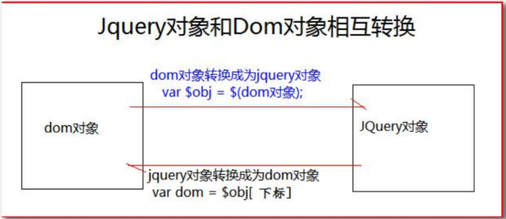
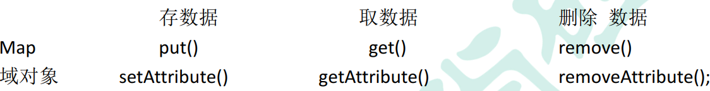
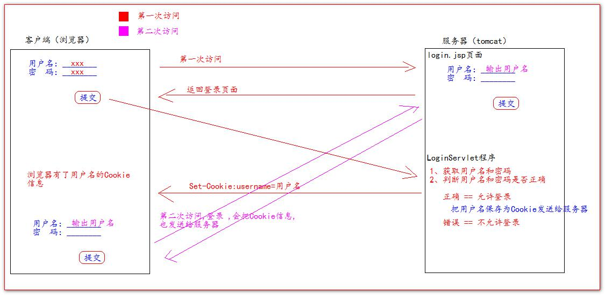

# JavaWeb基础

---

## 第1章 html&CSS

### 1.1  B/S软件的结构


### 1.2 前端开发流程


### 1.3 网页组成部分

* 内容（数据）   一般采用html技术实现
* 表现（内容在页面上展示的形式：颜色、大小、布局等） 一般采用CSS技术实现
* 行为（页面中的元素与输入设备交互的响应） 一般采用javaScript技术实现

### 1.4 html简介

​    Hyper Text Markup Language （超文本标记语言） 简写： HTML  

### 1.5 html标签介绍

* <标签名>封装的数据</标签名>
* 标签名大小写不敏感
* 标签属性
  * 基本属性    eg: bgcolor = "red "                        修改简单的样式效果
  * 事件属性    eg: onclick = "alert('你好！')"        直接设置事件响应后的代码

* 分为单标签和双标签   <p></p>  <br/>

```html
<!-- ①标签不能交叉嵌套 -->
正确： <div><span>早安， 尚硅谷</span></div>
错误： <div><span>早安， 尚硅谷</div></span>
<hr />
<!-- ②标签必须正确关闭 -->
<!-- i.有文本内容的标签： -->
正确： <div>早安， 尚硅谷</div>
错误： <div>早安， 尚硅谷
<hr />
<!-- ii.没有文本内容的标签： -->
正确： <br />
错误： <br>
<hr />
<!-- ③属性必须有值， 属性值必须加引号 -->
正确： <font color="blue">早安， 尚硅谷</font>
错误： <font color=blue>早安， 尚硅谷</font>
错误： <font color>早安， 尚硅谷</font>
<hr />
<!-- ④注释不能嵌套 -->
正确： <!-- 注释内容 --> <br/>
错误： <!-- <!-- 这是错误的 html 注释 --> -->
<hr />
```

### 1.6 常用标签

**1、font标签**

```html
<body>
	<!-- 字体标签
	 font标签是字体标签，它可以用来修改文本的字体，颜色，大小
	 color face size
	 -->
     <font color="blue" face="宋体" size="6">字体标签</font>
</body>
```

**2、特殊字符**


**3、标题标签**

```
<body>
	<!-- 标题标签
	h1 - h6 都是标题标签 h1最大
	align属性是对齐属性 left center right
	-->		
	 	<h1 align="left">标题1</h1>
		<h2 align="center">标题2</h2>
		<h3 align="right">标题3</h3>
</body>
```

**4、超连接**

```html
<body>
	<!-- 超链接
	  <a></a>
	  href属性设置标签的地址
	  target属性设置那个目标进行跳转
	              _self 表示当前页面
	              _blank 表示打开新的页面进行跳转
	-->
	<a href="http://www.baidu.com">百度</a> <br/>
	<a href="http://www.baidu.com" target="_self">百度</a><br/>
	<a href="http://www.baidu.com" target="_blank">百度</a><br/>
	<a href="http://www.baidu.com" target="_parent">百度</a><br/>
	<a href="http://www.baidu.com" target="_top">百度</a><br/>
</body>
```

**5、列表标签**

```
<body>
        <!-- 无序列表
          <ul>是无序列表
          type属性可以修改列表项前的符号
          li 列表项
        -->
        <ul type="none">
            <li>吴亦凡</li>
            <li>黄子韬</li>
            <li>鹿晗</li>
            <li>张艺兴</li>
        </ul>
</body>
```

**6、img标签**

```html
<body>
           <!--
           img
              src 属性可以设置图片的路径
              width 属性设置图片的宽度
              height 属性可以设置图片的高度
              border 属性设置图片的边框大小 1表示一个像素宽度
              alt 属性设置当指定路径找不到图片时 用来代替显示的文本内容
           在 JavaSE 中路径也分为相对路径和绝对路径.
              相对路径:从工程名开始算
              绝对路径:盘符:/目录/文件名
           在 web 中路径分为相对路径和绝对路径两种
             相对路径:
               . 表示当前文件所在的目录
               .. 表示当前文件所在的上一级目录
                 文件名 表示当前文件所在目录的文件,相当于 ./文件名 ./ 可以省略
             绝对路径:
               正确格式是: http://ip:port/工程名/资源路径
               错误格式是: 盘符:/目录/文件名
           -->
  
  
  
  
  
  
</body>
```

**7、表格标签**

```html
	<body>
	         <!--
	            <table> 标签是表格标签
			           border 设置表格框
			           width  设置表格宽度
			           height 设置表格高度
			           align  设置表格相对于页面的对齐方式
			       <tr> 是行标签
			       <th> 是表头标签
			       <td> 是单元格标签
			            align 设置单元格的对齐方式
			       <b> 是加粗标签
			           -->
		<table align="center" border="1" width="300" height="400" cellspacing="4">

			<tr>
				<td></td>
				<td></td>
				<td></td>
				<td></td>
			</tr>

			<tr>
				<td></td>
				<td></td>
				<td></td>
			</tr>

			<tr>
				<td></td>
				<td></td>
				<td></td>
			</tr>
			<tr>
				<td></td>
				<td></td>
				<td></td>
			</tr>
		</table>
	</body>
```

**8、跨行跨列表格**

```html
<body>
        <!--
          <td>
          colspan 属性设置跨列
          rowspan 属性设置跨行
        -->
        <table width="500" cellspacing="0" border="1">
            <tr>
                <td colspan="2">1.1</td>
                <!--<td>1.2</td>-->
                <td>1.3</td>
                <td>1.4</td>
                <td>1.5</td>
            </tr>

            <tr>
                <td rowspan="2">2.1</td>
                <td>2.2</td>
                <td>2.3</td>
                <td>2.4</td>
                <td>2.5</td>
            </tr>

            <tr>
                <!--<td>3.1</td>-->
                <td>3.2</td>
                <td>3.3</td>
                <td>3.4</td>
                <td>3.5</td>
            </tr>

            <tr>
                <td>4.1</td>
                <td>4.2</td>
                <td>4.3</td>
                <td colspan="2" rowspan="2">4.4</td>
                <!--<td>4.5</td>-->
            </tr>

            <tr>
                <td>5.1</td>
                <td>5.2</td>
                <td>5.3</td>
               <!-- <td>5.4</td>
                <td>5.5</td>-->
            </tr>
        </table>
```

**9、iframe框架标签**

```html
<body>
      <!--iframe 可以在页面上开辟一个小区域 显示单独的页面
          iframe和a标签组合使用的步骤
            在<iframe>中命名 name 属性如"abc"
            在<a>标签中设置target属性为"abc"
      -->
	  123456<br/>
      <iframe src="1.font标签.html" width="500" height="500" name="abc">
      </iframe>
          <ul type="none">
              <li><a href="1.font标签.html" target="abc">1.front标签.html</a></li>
              <li><a href="2.特殊字符.html">2.特殊字符.html</a></li>
              <li><a href="9.列表标签.html" target="abc">3.列表标签.html</a></li>
          </ul>
</body>
```

**10、表单标签**

```html
<body>
        <!--
           <form>  标签就是表单
              <input type="text" value="默认值"/>  文本输入框
              <input type="text" value="默认值"/>  密码输入框
              <input type="radio"/> 单选框 name属性可以进行分组 checked="checked"表示默认选中
              <input type="checkbox"/> 复选框 checked="checked"表示默认选中

              <select> 是下拉列表框
                 option是下拉列表框中的选项 selected="selected"默认选中
              <textarea>是文本输入框 默认值是其内容
                    rows 属性设置输入几行的高度
                    cols 属性设置每行可以显示几个字符宽度
              <input type="reset"/>  是重置按钮 value属性修改按钮上的文本
              <input type="submit"/> 是提交按钮 value属性修改按钮上的文本
              <input type="button"/> 是按钮    value属性修改按钮上的文本
              <input type="file"/>   是文件上传
              <input type="hidden/>  我们要发送某些信息 而这些信息不需要用户本身参与 就可以使用隐藏域（提交的时候同时发送给服务器）
        -->
        <form>
            <h1>用户注册</h1>
            <table>
                <tr>
                    <td>用户名称：</td>
                    <td><input type="text" value="默认值"> <br/></td>
                </tr>
                <tr>
                    <td>用户密码：</td>
                    <td><input type="password" ><br/></td>
                </tr>
                <tr>
                    <td> 确认密码：</td>
                    <td> <input type="password" ><br/></td>
                </tr>
                <tr>
                    <td>用户性别：</td>
                    <td><input type="radio" name="sex" checked="checked"/> 男 
                        <input type="radio" name="sex"/> 女
                    </td>
                </tr>
                <tr>
                    <td> 兴趣爱好：</td>
                    <td><input type="checkbox"/>java 
                        <input type="checkbox"/>python 
                        <input type="checkbox"/>c++
                    </td>
                </tr>
                <tr>
                    <td>用户国籍：</td>
                    <td>
                        <select>
                            <option selected="selected">中国</option><br/>
                            <option>日本</option><br/>
                            <option>美国</option><br/>
                        </select><br/>
                    </td>
                </tr>
                <tr>
                    <td>自我评价：</td>
                    <td> <textarea rows="10" cols="20" >我才是默认值</textarea></td>
                </tr>
            </table>
            <input type="reset"/>
            <input type="submit"/>
            <input type="file"/><br/>
        </form>
</body>
```

**11、表单提交细节**

```html
<body>
        <!--
           <form>  标签就是表单
              action  属性设置提交的服务器地址
              method  属性设置提交的方式GET(默认值)或POST
        【表单提交的时候 数据没有发送给服务器的三种情况】
            1、表单项没有name属性值
            2、单选、复选（下拉列表的标签）赋予 value属性
            3、表单项不在提交的form标签中
        【GET请求】
            1、浏览器地址栏中的地址是：action属性[+?+请求参数] URL?name=value&name=value
                请求的参数格式如：http://localhost:8080/ ? action=login & username=zju & password=123
            2、不安全
            3、它数据长度的限制 如果表单值包含非 ASCII 字符或者超过 100 个字符，您则必须使用 method="post"
        【POST请求】
            1、浏览器地址栏中只有action属性值
            2、相对于GET更加安全
            3、理论上没有数据长度的限制

        提交反馈如下：
        http://localhost:8080/?
        action=login
        username=zju
        password=123456
        repassword=123456
        sex=boy
        hobby=java
        hobby=python
        country=usa
        desc=good
        -->
        <form action="http://localhost:8080" method="post">
            <input type="hidden" name="action" value="login">
            <h1>用户注册</h1>
            <table>
                <tr>
                    <td>用户名称：</td>
                    <td><input type="text" name="username" value="默认值"> <br/></td>
                </tr>
                <tr>
                    <td>用户密码：</td>
                    <td><input type="password" name="password" ><br/></td>
                </tr>
                <tr>
                    <td> 确认密码：</td>
                    <td> <input type="password" name="repassword" ><br/></td>
                </tr>
                <tr>
                    <td>用户性别：</td>
                    <td><input type="radio" name="sex" value="boy"/> 男 <input type="radio" name="sex" value="girl"/> 女</td>
                </tr>
                <tr>
                    <td> 兴趣爱好：</td>
                    <td><input type="checkbox" name="hobby" value="java"/>java <input type="checkbox"name="hobby" value="python"/>python <input type="checkbox"name="hobby" value="c++"/>c++</td>
                </tr>
                <tr>
                    <td>用户国籍：</td>
                    <td>
                        <select name="country">
                            <option selected="selected" value="cn">中国</option><br/>
                            <option value="jp">日本</option><br/>
                            <option value="usa">美国</option><br/>
                        </select><br/>
                    </td>
                </tr>
                <tr>
                    <td>自我评价：</td>
                    <td> <textarea rows="10" cols="20" name="desc">我才是默认值</textarea></td>
                </tr>
            </table>
            <input type="reset"/>
            <input type="submit"/>
            <input type="file"/><br/>
        </form>
</body>
```

**12、其他标签**

```html
<body>
         <!--需求div span p 标签的演示
         <div>  默认独占一行
         <span> 它的长度是封装数据的长度
         <p>    段落标签 默认会在段落的上方和下方空出一行
         -->
        <div>213</div>
        <span>3435</span>
        <p>456e46</p>
        <p>456e46</p>
</body>
```

### 1.7  CSS技术介绍

**1、定义**

CSS 是「层叠样式表单」 。 是用于(增强)控制网页样式并允许将样式信息与网页内容分离的一种标记性语言。

**2、CSS语法规则**


​       **CSS 注释： /*注释内容*/**  

**3、CSS 和 HTML 的结合方式**  

      * 第一种结合方式

```html
<!DOCTYPE html>
<html lang="en">
<head>
<meta charset="UTF-8">
<title>Title</title>
</head>
<body>
<!--需求 1： 分别定义两个 div、 span 标签， 分别修改每个 div 标签的样式为： 边框 1 个像素， 实线， 红色。 -->
<div style="border: 1px solid red;">div 标签 1</div>
<div style="border: 1px solid red;">div 标签 2</div>
<span style="border: 1px solid red;">span 标签 1</span>
<span style="border: 1px solid red;">span 标签 2</span>
</body>
</html>
```

* 第二种结合方式

```html
<!DOCTYPE html>
<html lang="en">
<head>
<meta charset="UTF-8">
<title>Title</title>
<!--style 标签专门用来定义 css 样式代码-->
   <style type="text/css">
 /* 需求 1： 分别定义两个 div、 span 标签， 分别修改每个 div 标签的样式为： 边框 1 个像素， 实线， 红色。 */
    div{
        border: 1px solid red;
       } 
    span{
        border: 1px solid red;
        }
   </style>
</head>
<body>
	<div>div 标签 1</div>
	<div>div 标签 2</div>
	<span>span 标签 1</span>
	<span>span 标签 2</span>
</body>
</html>
```

* 第三种结合方式

​       把 css 样式写成一个单独的 css 文件， 再通过 link 标签引入即可复用  

​    1、css文件

```
div{
	border: 1px solid yellow;
} 
span{
	border: 1px solid red;
}
```

   2、html文件

```html
<!DOCTYPE html>
<html lang="en">
<head>
               <!--css 与html结合使用方式三-->
    <meta charset="UTF-8">
    <title>Title</title>
    link 标签专门用来引进css代码
    <link rel="stylesheet" type="text/css" href="1.css">
</head>
<body>
         <div>标签1</div>
         <div>标签2</div>
         <div>标签3</div>
         <span>标签4</span>
         <p>标签5</p>

</body>
</html>
```

**3、CSS选择器**  

1. 标签名选择器

```text
标签名选择器的格式是：标签名{
                        属性： 值;
                        } 
标签名选择器， 可以决定哪些标签被动的使用这个样式  
```
  2.#id选择器

```
选择器的格式是：
         #id 属性值{
                 属性： 值;
                  } 
         id选择器， 可以让我们通过 id 属性选择性的去使用这个样式
```

```html
<!DOCTYPE html>
<html>
<head>
<meta charset="UTF-8">
<title>ID 选择器</title>
<style type="text/css">
#id001{
		color: blue;
		font-size: 30px;
		border: 1px yellow solid;} #
id002{
		color: red;
		font-size: 20px;
		border: 5px blue dotted ;
}
</style>
</head>
<body>
<div id="id002">div 标签 1</div>
<div id="id001">div 标签 2</div>
</body>
</html>
```

3. (.class选择器)

```html
<!DOCTYPE html>
<html>
<head>
<meta charset="UTF-8">
<title>class 类型选择器</title>
<style type="text/css">
.class01{
		color: blue;
		font-size: 30px;
		border: 1px solid yellow;
} .
class02{
		color: grey;
		font-size: 26px;
		border: 1px solid red;
}
</style>
</head>
<body>
<!--
需求 1： 修改 class 属性值为 class01 的 span 或 div 标签， 字体颜色为蓝色， 字体大小 30 个像素。 边框为 1 像素黄色实线。
需求 2： 修改 class 属性值为 class02 的 div 标签， 字体颜色为灰色， 字体大小 26 个像素。 边框为 1 像素红色实线。
-->
<div class="class02">div 标签 class01</div>
<div class="class02">div 标签</div>
<span class="class02">span 标签 class01</span>
<span>span 标签 2</span>
</body>
</html>
```

  4.组合选择器

```html
<!DOCTYPE html>
<html>
<head>
<meta charset="UTF-8">
<title>class 类型选择器</title>
<style type="text/css">
.class01 , #id01{
			color: blue;
			font-size: 20px;
			border: 1px yellow solid;
}
</style>
</head>
<body>
<!--
需求 1： 修改 class="class01" 的 div 标签 和 id="id01" 所有的 span 标签，
字体颜色为蓝色， 字体大小 20 个像素。 边框为 1 像素黄色实线。
-->
<div id="id01">div 标签 class01</div> <br />
<span >span 标签</span> <br />
<div>div 标签</div> <br />
<div>div 标签 id01</div> <br />
</body>
</html>
```

**4、常用样式**  

color width height border 。。。。。

---

## 第2章JavaScript

### 2.1 介绍

​        Javascript 语言诞生主要是完成页面的数据验证。 因此它运行在客户端， 需要运行浏览器来解析执行 JavaScript 代码。
​        JS 是弱类型， Java 是强类型。
​		特点：

		1. 交互性（它可以做的就是信息的动态交互）
		2. 安全性（不允许直接访问本地硬盘）
		3. 跨平台性（只要是可以解释 JS 的浏览器都可以执行， 和平台无关）  

### 2.2 js 和 html 结合方式  

​         方式一：在 head 标签中， 或者在 body 标签中， 使用 script 标签 来书写 JavaScript 代码  

​         方式二：使用 script 标签引入 单独的 JavaScript 代码文件  

### 2.3 变量

**1、JavaScript 的变量类型：**

|  数值类型  |  number  |
| :--------: | :------: |
| 字符串类型 |  String  |
|  对象类型  |  Object  |
|  布尔类型  | bollean  |
|  函数类型  | function |

JavaScript 里特殊的值：
         **undefined**  未定义， 所有 js 变量未赋于初始值的时候， 默认值都是 undefined.
         **null**              空值
         **NaN** 全称是： Not a Number。 非数字。 非数值。
JS 中的定义变量格式：
         var 变量名;
         var 变量名 = 值;

**2、比较与逻辑运算**

​     等于  == （做字面数值比较）

​     全等于 ===（做字面数值比较和变量的数值类型）

​     且运算： &&

​     或运算： ||
​     取反运算： !

**3、特殊规定**

​     **在 JavaScript 语言中， 所有的变量， 都可以做为一个 boolean 类型的变量去使用。**
​     **0 、 null、 undefined、 ””(空串) 都认为是 false**  

### 2.4 数组

​    格式：
​    var 数组名 = []; // 空数组
​    var 数组名 = [1 , ’abc’ , true]; // 定义数组同时赋值元素  

### 2.5 函数 ***

​        函数定义方式一：

       function 函数名(形参列表){
       函数体
        } 
        在JavaScript 语言中， 如何定义带有返回值的函数？
        只需要在函数体内直接使用 return 语句返回值即可
​       函数定义方式二：

```
  var 函数名 = function(形参列表) { 函数体 }  
```

**在 Java 中函数允许重载。 但是在 JS 中函数的重载会直接覆盖掉上一次的定义**  

【**arguments 隐形参数（只在 function 函数内)**】

```html
<script type="text/javascript">
       function  func1(a){
           alert(arguments.length);
           alert(arguments[0]);
           alert(arguments[1]);
           alert(arguments[2]);

           alert("a="+a);

           for (var i =0;i<arguments.length;i++){
               alert(arguments[i]);
           }
       }
       alert(func1(12,45,51));
       /*编写一个函数 用于计算所有参数的和并返回*/
       function  sum(num1,num2){
           var result = 0;
           for (var i =0;i<arguments.length;i++){
               if(typeof(arguments[i]) == "number"){
                   result+=arguments[i];
               }
           }
           return result;
       }
       alert(sum(1,2,3,"gh"));
</script>
```

### 2.6 自定义对象

方式一

```html
 <script type="text/javascript">
       /* Object形式定义对象*/
        var obj = new Object();
        obj.name="carry";
        obj.age=23;
        obj.fun = function (){
            alert("姓名："+this.name+" 年龄："+this.age)
        }
        obj.fun();
 </script>
```

方式二

```html
  <script type="text/javascript">
        /*{}形式定义对象*/
        var obj  = {
            name:"carry",
            age:23,
            fun:function (){
                alert("姓名："+this.name+" 年龄："+this.age)

            }
        }
        alert(obj.name);
        obj.fun();
  </script>
```

### 2.7 事件***

【**事件是电脑输入设备与页面进行交互的响应**】

 常用事件：

1. onload 加载完成事件： 页面加载完成之后， 常用于做页面 js 代码初始化操作
2. onclick 单击事件： 常用于按钮的点击响应操作
3. onblur 失去焦点事件： 常用用于输入框失去焦点后验证其输入内容是否合法
4. onchange 内容发生改变事件： 常用于下拉列表和输入框内容发生改变后操作
5. onsubmit 表单提交事件： 常用于表单提交前， 验证所有表单项是否合法

 事件注册：

1. 静态注册
2. 动态注册 （第一步：获取标签对象 第二步：标签对象.事件名 = fucntion(){} ）

#### 2.7.1 onload加载完成事件

```html
<!DOCTYPE html>
<html lang="en">
<head>
    <meta charset="UTF-8">
    <title>Title</title>
    <script type="text/javascript">
        //onload 事件方法
        function onload(){
            alert("静态注册Onload的所有事件");
        }
        //onload事件动态注册方法 固定写法
        window.onload = function (){
            alert("动态注册Onload的所有方法");
        }
    </script>
</head>
      <!--静态注册onload事件:onload 事件是浏览器解析完页面后就会自动刷新触发的事件-->
<body onload="onload()">
</body>
</html>
```

#### 2.7.2 onclick 单击事件

```html
<!DOCTYPE html>
<html lang="en">
<head>
    <meta charset="UTF-8">
    <title>Title</title>
    <script type="text/javascript">
        function onclick(){
            alert("静态注册onclick事件");
        }
        //动态注册onclick事件
        window.onload = function () {
            var btnobj= document.getElementById("btn01");
            btnobj.onclick=function () {
                alert("动态注册onclick事件")
            }
        }
    </script>
</head>
<body>
    <button onclick="onclick()">按钮一</button>;
    <button id="btn01">按钮二</button>;
</body>
</html>
```

#### 2.7.3 onblur 失去焦点事件

```html
<!DOCTYPE html>
<html lang="en">
<head>
    <meta charset="UTF-8">
    <title>Title</title>
    <script type="text/javascript">
        // 静态注册失去焦点事件
        function onblurFun() {
		// console 是控制台对象， 是由 JavaScript 语言提供， 专门用来向浏览器的控制器打印输出， 用于测试使用
		// log() 是打印的方法
            console.log("静态注册失去焦点事件");
        } //
   	   /*  动态注册 onblur 事件*/
        window.onload = function () {
		//1 获取标签对象
            var passwordObj = document.getElementById("password");
		// alert(passwordObj);
		//2 通过标签对象.事件名 = function(){};
            passwordObj.onblur = function () {
                console.log("动态注册失去焦点事件");
            }
        }
    </script>
</head>
<body>
用户名:<input type="text" onblur="onblurFun();"><br/>
密码:<input id="password" type="text" ><br/>
</body>
</html>
```

#### 2.7.4 onchange 事件

```html
<!DOCTYPE html>
<html lang="en">
<head>
    <meta charset="UTF-8">
    <title>Title</title>
    <script type="text/javascript">
        function onchangeFun() {
            alert("女神已经改变了");
        }
        window.onload = function () {
		//1 获取标签对象
        var selObj = document.getElementById("sel01");
		// alert( selObj );
		//2 通过标签对象.事件名 = function(){}
            selObj.onchange = function () {
                alert("男神已经改变了");
            }
        }
    </script>
</head>
<body>
请选择你心中的女神：
<!--静态注册 onchange 事件-->
<select onchange="onchangeFun();">
    <option>--女神--</option>
    <option>芳芳</option>
    <option>佳佳</option>
    <option>娘娘</option>
</select>
请选择你心中的男神：
<select id="sel01">
    <option>--男神--</option>
    <option>国哥</option>
    <option>华仔</option>
    <option>富城</option>
</select>
</body>
</html>
```

#### 2.7.5 onsubmit 表单提交事件

```html
<!DOCTYPE html>
<html lang="en">
<head>
    <meta charset="UTF-8">
    <title>Title</title>
    <script type="text/javascript" >
        // 静态注册表单提交事务
        function onsubmitFun(){
		// 要验证所有表单项是否合法， 如果， 有一个不合法就阻止表单提交
            alert("静态注册表单提交事件----发现不合法");
            return flase;
        }
        window.onload = function () {
		//1 获取标签对象
            var formObj = document.getElementById("form01");
		//2 通过标签对象.事件名 = function(){}
            formObj.onsubmit = function () {
		// 要验证所有表单项是否合法， 如果， 有一个不合法就阻止表单提交
                alert("动态注册表单提交事件----发现不合法");
                return false;
            }
        }
    </script>
</head>
<body>
<!--return false 可以阻止 表单提交 -->
<form action="http://localhost:8080" method="get" onsubmit="return onsubmitFun();">
    <input type="submit" value="静态注册"/>
</form>
<form action="http://localhost:8080" id="form01">
    <input type="submit" value="动态注册"/>
</form>
</body>
</html>
```

### 2.8 DOM模型***

【 **Document Object Model 文档对象模型**】

#### 2.8.1 Document对象


Document对象的理解

1. 第一点： Document 它管理了所有的 HTML 文档内容
2. 第二点： document 它是一种树结构的文档。 有层级关系
3. 第三点： 它让我们把所有的标签 都 对象化
4. 第四点： 我们可以通过 document 访问所有的标签对象

#### 2.8.2 Document对象常用方法

1、document.getElementById(elementId)    通过标签的 id 属性查找标签 dom 对象， elementId 是标签的 id 属性值  

```html
<!DOCTYPE html>
<html lang="en">
<head>
    <meta charset="UTF-8">
    <title>Title</title>
    <script type="text/javascript">
        function  onclickFun(){
            //1 获取标签对象
            var userNameobj = document.getElementById("username");
            //2 获取输入框内容
            var usernameText=userNameobj.value;
            //3 验证字符串是否符合某些规则 正则表达式
            var patt = /^\w{5,12}$/; //表示字母 数字 下划线
            //4 patt的test方法验证某个字符串是否符合这种规则

            var userspan = document.getElementById("userspan");

            if(patt.test(usernameText)){
                userspan.innerHTML= "";
            }else{
                userspan.innerHTML= "";
            }

        }
    </script>
</head>
<body>
        用户名：<input type="text" id="username"/>
        <span id="userspan">
        </span>
        <button onclick="onclickFun()">校验</button>
</body>
</html>
```

2、document.getElementsByName(elementName)  通过标签的 name 属性查找标签 dom 对象， elementName 标签的 name 属性值  

```html
<!DOCTYPE html>
<html lang="en">
<head>
    <meta charset="UTF-8">
    <title>Title</title>
</head>
          <!--实现复选框全选 全不选 反选的操作-->
        <script type="text/javascript">
             function checkAll(){
                   var hobbies = document.getElementsByName("hobby");//返回一个集合 每个元素都是一个dom对象
                   for (var i = 0;i<hobbies.length;i++){
                       hobbies[i].checked=true;
                   }
             }
             function checkNone(){
                 var hobbies = document.getElementsByName("hobby");//返回一个集合 每个元素都是一个dom对象
                 for (var i = 0;i<hobbies.length;i++){
                     hobbies[i].checked=false;
                 }
             }
             function checkReverse(){
                 var hobbies = document.getElementsByName("hobby");//返回一个集合 每个元素都是一个dom对象
                 for (var i = 0;i<hobbies.length;i++){
                     hobbies[i].checked=!(hobbies[i].checked);
                 }
             }
        </script>
<body>
      兴趣爱好：
      <input type="checkbox" name="hobby" value="cpp">C++
      <input type="checkbox" name="hobby" value="Java">Java
      <input type="checkbox" name="hobby" value="js">js
      <br/>
      <button onclick="checkAll()">全选</button>
      <button onclick="checkNone()">全不选</button>
      <button onclick="checkReverse()">反选</button>
</body>
</html>
```

3、document.getElementsByTagName(tagname)  通过标签名查找标签 dom 对象。 tagname 是标签名  

```html
<!DOCTYPE html>
<html lang="en">
<head>
    <meta charset="UTF-8">
    <title>Title</title>
    <script type="text/javascript">
        function  checkAll(){
            //select all
            var inputs = document.getElementsByTagName("input");//按照指定标签查询并返回集合
            for(var i = 0;i<inputs.length;i++){
                inputs[i].checked=true;
            }
        }
        function checkNone(){
            var inputs = document.getElementsByTagName("input");//按照指定标签查询并返回集合
            for(var i = 0;i<inputs.length;i++){
                inputs[i].checked=false;
            }
        }
        function checkReverse(){
            var inputs = document.getElementsByTagName("input");//按照指定标签查询并返回集合
            for(var i = 0;i<inputs.length;i++){
                inputs[i].checked=!inputs[i].checked;
            }
        }
    </script>
</head>
<body>
兴趣爱好：
<input type="checkbox"  value="cpp">C++
<input type="checkbox"  value="Java">Java
<input type="checkbox"  value="js">js
<br/>
<button onclick="checkAll()">全选</button>
<button onclick="checkNone()">全不选</button>
<button onclick="checkReverse()">反选</button>
</body>
</html>
```

4、document.createElement( tagName)方法， 通过给定的标签名， 创建一个标签对象。 tagName 是要创建的标签名  

```html
<!DOCTYPE html>
<html lang="en">
<head>
    <meta charset="UTF-8">
    <title>Title</title>
    <script type="text/javascript">
        window.onload = function () {
            var divobj = document.createElement("div");
            divobj.innerHTML = "young";
            document.body.appendChild(divobj);
        }
    </script>
</head>
<body>
</body>
</html>
```

5、总结

```
document 对象的三个查询方法， 如果有 id 属性， 优先使用 getElementById 方法来进行查询
如果没有 id 属性， 则优先使用 getElementsByName 方法来进行查询
如果 id 属性和 name 属性都没有最后再按标签名查 getElementsByTagName
以上三个方法， 一定要在页面加载完成之后执行， 才能查询到标签对象
```

#### 2.8.3 节点的常用属性和方法

【节点就是标签对象】

常用方法：

     1、通过具体的元素节点调用getElementsByTagName()方法， 获取当前节点的指定标签名孩子节点  
     2、 appendChild( oChildNode )方法， 可以添加一个子节点， oChildNode 是要添加的孩子节点
常见属性：

```
childNodes属性， 获取当前节点的所有子节点
firstChild属性， 获取当前节点的第一个子节点
lastChild属性， 获取当前节点的最后一个子节点
parentNode属性， 获取当前节点的父节点
nextSibling属性， 获取当前节点的下一个节点
previousSibling属性， 获取当前节点的上一个节点
className用于获取或设置标签的 class 属性值
innerHTML属性， 表示获取/设置起始标签和结束标签中的内容
innerText属性， 表示获取/设置起始标签和结束标签中的文本
```

练习：

```

```

---

## 第3章 jQuery

### 3.1 介绍

jQuery，就是 JavaScript 和查询（Query） ， 它就是辅助 JavaScript 开发的 js 类库  ；

它的核心思想是 **write less,do more** ， 所以它实现了很多浏览器的兼容问题  ；

### 3.2 jQuery 单击事件

```html
	<script type="text/javascript">
	/*	window.onload = function () {
			var btnobj = document.getElementById("btnId");
			btnobj.onclick = function () {
				alert("js原生单击事件");
			}
		} */
	$(function () {//表示页面加载完成后 相当于onload 事件
		var $btnObj=$("#btnId");//表示按id查询标签对象 得到一个jQuery对象
		$btnObj.click(function () {//绑定单击事件
			alert("jQuery的单击事件");
		});
	})
	</script>
</head>
<body>
	<button id="btnId">SayHello</button>
</body>
```

### 3.3 jQuery核心函数

$ 是 jQuery 的核心函数， 能完成 jQuery 的很多功能。 $()就是调用$这个函数  

```
1、 传入参数为 [ 函数 ] 时：表示页面加载完成之后。 相当于 window.onload = function(){}

2、 传入参数为 [ HTML 字符串 ] 时：会对我们创建这个 html 标签对象

3、 传入参数为 [ 选择器字符串 ] 时：
       $(“#id 属性值”); id 选择器， 根据 id 查询标签对象
       $(“标签名”); 标签名选择器， 根据指定的标签名查询标签对象
       $(“.class 属性值”); 类型选择器， 可以根据 class 属性查询标签对象
4、 传入参数为 [ DOM 对象 ] 时：
       会把这个 dom 对象转换为 jQuery 对象
```

### 3.4 jQuery对象和dom对象

```
Dom 对象
	1.通过 getElementById()查询出来的标签对象是 Dom 对象
	2.通过 getElementsByName()查询出来的标签对象是 Dom 对象
	3.通过 getElementsByTagName()查询出来的标签对象是 Dom 对象
	4.通过 createElement() 方法创建的对象， 是 Dom 对象
	DOM 对象 Alert 出来的效果是： [object HTML 标签名 Element]
jQuery 对象
	5.通过 JQuery 提供的 API 创建的对象， 是 JQuery 对象
	6.通过 JQuery 包装的 Dom 对象， 也是 JQuery 对象
	7.通过 JQuery 提供的 API 查询到的对象， 是 JQuery 对象
	jQuery 对象 Alert 出来的效果是： [object Object]
	
jQuery 对象是 dom 对象的数组 + jQuery 提供的一系列功能函数

二者使用区别：
      jQuery 对象不能使用 DOM 对象的属性和方法
      DOM 对象也不能使用 jQuery 对象的属性和方法
```

【**Dom 对象和 jQuery 对象互转**】  



### 3.5 jQuery选择器***

#### 3.5.1 基本选择器

```html
#ID 选择器： 根据 id 查找标签对象
.class 选择器： 根据 class 查找标签对象
element 选择器： 根据标签名查找标签对象
* 选择器： 表示任意的， 所有的元素
selector1， selector2 组合选择器： 合并选择器 1， 选择器 2 的结果并返回

<script type="text/javascript" src="../script/jquery-1.7.2.js"></script>
		<script type="text/javascript">
				//1.选择 id 为 one 的元素 "background-color","#bbffaa"
				$(function () {
					$("#btn1").click(function () {
						//css方法可以设置和获取样式
						$("#one").css("background-color","#bbffaa");
					});
				});
				//2.选择 class 为 mini 的所有元素
				$(function () {
					$("#btn2").click(function () {
						$(".mini").css("background-color","#bbffaa");
					});
				});

				//3.选择 元素名是 div 的所有元素 
				$(function () {
					$("#btn3").click(function () {
						$("div").css("background-color","#bbffaa");
					});
				});

				//4.选择所有的元素 
				$(function () {
					$("#btn4").click(function () {
						$("*").css("background-color","#bbffaa");
					});
				});

				//5.选择所有的 span 元素和id为two的元素   
				$(function () {
					$("#btn5").click(function () {
						$("span,#two").css("background-color","#bbffaa");
					});
				});
		</script>
```

#### 3.5.2 层次选择器

```html
ancestor descendant 后代选择器 ：        在给定的祖先元素下匹配所有的后代元素
parent > child     子元素选择器：        在给定的父元素下匹配所有的子元素
prev + next        相邻元素选择器：       匹配所有紧接在 prev 元素后的 next 元素
prev ~ sibings     之后的兄弟元素选择器：  匹配 prev 元素之后的所有 siblings 元素

<script type="text/javascript" src="../script/jquery-1.7.2.js"></script>
		<script type="text/javascript">
			$(document).ready(function(){
				//1.选择 body 内的所有 div 元素 
				$("#btn1").click(function(){
					$("body div").css("background", "#bbffaa");
				});

				//2.在 body 内, 选择div子元素  
				$("#btn2").click(function(){
					$("body > div").css("background", "#bbffaa");
				});

				//3.选择 id 为 one 的下一个 div 元素 
				$("#btn3").click(function(){
					$("#one + div").css("background", "#bbffaa");
				});

				//4.选择 id 为 two 的元素后面的所有 div 兄弟元素
				$("#btn4").click(function(){
					$("#two~div").css("background", "#bbffaa");
				});
			});
		</script>
```

#### 3.5.3 过滤选择器

【**基本过滤器**】

```html
:first 获取第一个元素
:last 获取最后个元素
:not(selector) 去除所有与给定选择器匹配的元素
:even 匹配所有索引值为偶数的元素， 从 0 开始计数
:odd 匹配所有索引值为奇数的元素， 从 0 开始计数
:eq(index) 匹配一个给定索引值的元素
:gt(index) 匹配所有大于给定索引值的元素
:lt(index) 匹配所有小于给定索引值的元素
:header 匹配如 h1, h2, h3 之类的标题元素
:animated 匹配所有正在执行动画效果的元素
<script type="text/javascript">
$(document).ready(function(){
				//1.选择第一个 div 元素  
				$("#btn1").click(function(){
					$("div:first").css("background", "#bbffaa");
				});

				//2.选择最后一个 div 元素
				$("#btn2").click(function(){
					$("div:last").css("background", "#bbffaa");
				});

				//3.选择class不为 one 的所有 div 元素
				$("#btn3").click(function(){
					$("div,.class:not one ").css("background", "#bbffaa");
				});

				//4.选择索引值为偶数的 div 元素
				$("#btn4").click(function(){
					$("div:even").css("background", "#bbffaa");
				});

				//5.选择索引值为奇数的 div 元素
				$("#btn5").click(function(){
					$("div:odd").css("background", "#bbffaa");
				});

				//6.选择索引值为大于 3 的 div 元素
				$("#btn6").click(function(){
					$("div:gt(3)").css("background", "#bbffaa");
				});

				//7.选择索引值为等于 3 的 div 元素
				$("#btn7").click(function(){
					$("div:eq(3)").css("background", "#bbffaa");
				});

				//8.选择索引值为小于 3 的 div 元素
				$("#btn8").click(function(){
					$("div:lt(3)").css("background", "#bbffaa");
				});

				//9.选择所有的标题元素
				$("#btn9").click(function(){
					$(":header").css("background", "#bbffaa");
				});

				//10.选择当前正在执行动画的所有元素
				$("#btn10").click(function(){
					$(":animated").css("background", "#bbffaa");
				});
				//11.选择没有执行动画的最后一个div
				$("#btn11").click(function(){
					$("div:not(:animated):last").css("background", "#bbffaa");
				});
			});
</script>
```

【**内容过滤器**】

```html
:contains(text) 匹配包含给定文本的元素
:empty 匹配所有不包含子元素或者文本的空元素
:parent 匹配含有子元素或者文本的元素
:has(selector) 匹配含有选择器所匹配的元素的元素
<script type="text/javascript">
$(document).ready(function(){
				//1.选择 含有文本 'di' 的 div 元素
				$("#btn1").click(function(){
					$("div:contains(di)").css("background", "#bbffaa");
				});

				//2.选择不包含子元素(或者文本元素) 的 div 空元素
				$("#btn2").click(function(){
					$("div:empty").css("background", "#bbffaa");
				});

				//3.选择含有 class 为 mini 元素的 div 元素
				$("#btn3").click(function(){
					$("div:has(.mini)").css("background", "#bbffaa");
				});

				//4.选择含有子元素(或者文本元素)的div元素
				$("#btn4").click(function(){
					$("div:parent").css("background", "#bbffaa");
				});
			});
<script>
```

【**属性过滤器**】

```html
[attribute] 匹配包含给定属性的元素。
[attribute=value] 匹配给定的属性是某个特定值的元素
[attribute!=value] 匹配所有不含有指定的属性， 或者属性不等于特定值的元素。
[attribute^=value] 匹配给定的属性是以某些值开始的元素
[attribute$=value] 匹配给定的属性是以某些值结尾的元素
[attribute*=value] 匹配给定的属性是以包含某些值的元素
[attrSel1][attrSel2][attrSelN] 复合属性选择器， 需要同时满足多个条件时使用
<script type="text/javascript">
$(function() {
		//1.选取含有 属性title 的div元素
		$("#btn1").click(function() {
			$("div[title]").css("background", "#bbffaa");
		});
		//2.选取 属性title值等于'test'的div元素
		$("#btn2").click(function() {
			$("div[title='test']").css("background", "#bbffaa");
		});
		//3.选取 属性title值不等于'test'的div元素(*没有属性title的也将被选中)
		$("#btn3").click(function() {
			$("div[title!='test']").css("background", "#bbffaa");
		});
		//4.选取 属性title值 以'te'开始 的div元素
		$("#btn4").click(function() {
			$("div[title^='te']").css("background", "#bbffaa");
		});
		//5.选取 属性title值 以'est'结束 的div元素
		$("#btn5").click(function() {
			$("div[title$='est']").css("background", "#bbffaa");
		});
		//6.选取 属性title值 含有'es'的div元素
		$("#btn6").click(function() {
			$("div[title*='es']").css("background", "#bbffaa");
		});
		
		//7.首先选取有属性id的div元素，然后在结果中 选取属性title值 含有'es'的 div 元素
		$("#btn7").click(function() {
			$("div[id][title*='es']").css("background", "#bbffaa");
		});
		//8.选取 含有 title 属性值, 且title 属性值不等于 test 的 div 元素
		$("#btn8").click(function() {
			$("div[title][title!='test']").css("background", "#bbffaa");
		});
	});
<script>
```

【**表单对象属性过滤器**】

```html
:input 匹配所有 input, textarea, select 和 button 元素
:text 匹配所有 文本输入框
:password 匹配所有的密码输入框
:radio 匹配所有的单选框
:checkbox 匹配所有的复选框
:submit 匹配所有提交按钮
:image 匹配所有 img 标签
:reset 匹配所有重置按钮
:button 匹配所有 input type=button <button>按钮
:file 匹配所有 input type=file 文件上传
:hidden 匹配所有不可见元素 display:none 或 input type=hidden
<script type="text/javascript">
             //1.对表单内 可用input 赋值操作
				$("#btn1").click(function(){
					$("input:enabled").val("New Value");
				});
				//2.对表单内 不可用input 赋值操作
				$("#btn2").click(function(){
					$("input:disabled").val("New Value Too");
				});
				//3.获取多选框选中的个数  使用size()方法获取选取到的元素集合的元素个数
				$("#btn3").click(function(){
					alert($(":checkbox:checked").size())
				});
				//4.获取多选框，每个选中的value值
				$("#btn4").click(function(){
					var str = "";
					var eles = $(":checkbox:checked");
					//jQuery对象提供遍历的方法each
					eles.each(function () {
						str+="["+this.value+"] "
					});
					alert(str);
				});
				//5.获取下拉框选中的内容  
				$("#btn5").click(function(){
					var str = "";
					//注意这个选择器的特殊，因为select里面的option是真正的被选择项，
					//所以 :selected 选择器和 select[name='test']选择器的关系是子父关系
					//必须按照基本选择器选择后代的方法选
					var els = $(":selected:selected");
					els.each(function () {
						str+="["+this.innerHTML+"] "
					});
					alert(str);
				});
   <script>
```

【**元素筛选方法**】

```html
eq() 获取给定索引的元素 功能跟 :eq() 一样
first() 获取第一个元素 功能跟 :first 一样
last() 获取最后一个元素 功能跟 :last 一样
filter(exp) 留下匹配的元素
is(exp) 判断是否匹配给定的选择器， 只要有一个匹配就返回， true
has(exp) 返回包含有匹配选择器的元素的元素 功能跟 :has 一样
not(exp) 删除匹配选择器的元素 功能跟 :not 一样
children(exp) 返回匹配给定选择器的子元素 功能跟 parent>child 一样
find(exp) 返回匹配给定选择器的后代元素 功能跟 ancestor descendant 一样
next() 返回当前元素的下一个兄弟元素 功能跟 prev + next 功能一样
nextAll() 返回当前元素后面所有的兄弟元素 功能跟 prev ~ siblings 功能一样
nextUntil() 返回当前元素到指定匹配的元素为止的后面元素
parent() 返回父元素
prev(exp) 返回当前元素的上一个兄弟元素
prevAll() 返回当前元素前面所有的兄弟元素
prevUnit(exp) 返回当前元素到指定匹配的元素为止的前面元素
siblings(exp) 返回所有兄弟元素
add() 把 add 匹配的选择器的元素添加到当前 jquery 对象中

<script type="text/javascript">
                 /(1)eq()  选择索引值为等于 3 的 div 元素
				$("#btn1").click(function(){
					$("div").eq(3).css("background-color","#bfa");
				});
				//(2)first()选择第一个 div 元素
				 $("#btn2").click(function(){
					 //first()   选取第一个元素
					$("div").first().css("background-color","#bfa");
				});
				//(3)last()选择最后一个 div 元素
				$("#btn3").click(function(){
					//last()  选取最后一个元素
					$("div").last().css("background-color","#bfa");
				});
				//(4)filter()在div中选择索引为偶数的
				$("#btn4").click(function(){
					//filter()  过滤   传入的是选择器字符串
					$("div").filter(":even").css("background-color","#bfa");
				});
				 //(5)is()判断#one是否为:empty或:parent
				//is用来检测jq对象是否符合指定的选择器
				$("#btn5").click(function(){
					alert($("#one").is(":empty"));
				});
				
				//(6)has()选择div中包含.mini的
				$("#btn6").click(function(){
					//has(selector)  选择器字符串    是否包含selector
					$("div").has('.mini').css("background-color","#bfa");
				});
				//(7)not()选择div中class不为one的
				$("#btn7").click(function(){
					//not(selector)  选择不是selector的元素
					$("div").not('.one').css("background-color","#bfa");
				});
				//(8)children()在body中选择所有class为one的div子元素
				$("#btn8").click(function(){
					//children()  选出所有的子元素
					$("body").children('div.one').css("background-color","#bfa");
				});
				//(9)find()在body中选择所有class为mini的div元素
				$("#btn9").click(function(){
					//find()  选出所有的后代元素
					$("body").find("div.mini").css("background-color","#bfa");
				});
				//(10)next() #one的下一个div
				$("#btn10").click(function(){
					//next()  选择下一个兄弟元素
					$("#one").next("div").css("background-color","#bfa");
				});
				//(11)nextAll() #one后面所有的span元素
				$("#btn11").click(function(){
					//nextAll()   选出后面所有的元素
					$("#one").nextAll("span").css("background-color","#bfa");
				});
				//(12)nextUntil() #one和span之间的元素
				$("#btn12").click(function(){
					//
					$("#one").nextUntil("span").css("background-color","#bfa")
				});
				//(13)parent() .mini的父元素
				$("#btn13").click(function(){
					$(".mini").parent().css("background-color","#bfa");
				});
				//(14)prev() #two的上一个div
				$("#btn14").click(function(){
					//prev()  
					$("#two").prev("div").css("background-color","#bfa")
				});
				//(15)prevAll() span前面所有的div
				$("#btn15").click(function(){
					//prevAll()   选出前面所有的元素
					$("span").prevAll("div").css("background-color","#bfa")
				});
				//(16)prevUntil() span向前直到#one的元素
				$("#btn16").click(function(){
					//prevUntil(exp)   找到之前所有的兄弟元素直到找到exp停止
					$().css("background-color","#bfa")
				});
				//(17)siblings() #two的所有兄弟元素
				$("#btn17").click(function(){
					//siblings()    找到所有的兄弟元素，包括前面的和后面的
					$("#two").siblings().css("background-color","#bfa")
				});
				
				//(18)add()选择所有的 span 元素和id为two的元素
				$("#btn18").click(function(){
	
					//   $("span,#two,.mini,#one")
					$("span").add("#two")
							.add(".mini").add("#one").css("background-color","#bfa");
				});
```

### 3.6 jQuery属性操作

| html() | 它可以设置和获取起始标签和结束标签中的内容 | 跟 dom 属性 innerHTML 一样 |
| :----: | :----------------------------------------: | :------------------------: |
| text() | 它可以设置和获取起始标签和结束标签中的文本 | 跟 dom 属性 innerText 一样 |
| val()  |   它可以设置和获取表单项的 value 属性值    |   跟 dom 属性 value 一样   |

```html
<script type="text/javascript" src="../script/jquery-1.7.2.js"></script>
    <!--val方法同时设置多个表单项的选中状态-->
    <script type="text/javascript">
        $(function () {//表示页面加载完成后 相当于onload 事件
          $("#03").click(function () {
              alert($("#01").html());          //不带参数：查询标签内容
              $("#01").html("<h1>title1</h1>");//带参数 设置标签内容
          });

          $("#02").text();                     //不带参数：查询标签文本
          $("#02").text("carry");              //带参数 设置标签文本

        });
    </script>
```

| attr() | 可以设置和获取属性的值， 不推荐操作 checked、 readOnly、 selected、 disabled 等等,attr 方法还可以操作非标准的属性 |
| ------ | ------------------------------------------------------------ |
| prop() | 可以设置和获取属性的值,只推荐操作 checked、 readOnly、 selected、 disabled 等等 |

```
       //代码摘自复选框 全选 全部选练习
       //全选按钮绑定单击事件
		$("#checkedAllBtn").click(function () {
			$(":checkbox").prop("checked",true);
		});
		//全部选按钮绑定单击事件
		$("#checkedNoBtn").click(function () {
			$(":checkbox").prop("checked",false);
		});
		// 查询全部的球类的复选框
		$(":checkbox[name='items']").each(function () {
		// 在 each 遍历的 function 函数中， 有一个 this 对象。 这个 this 对象是当前正在遍历到的 dom 对象
		this.checked = !this.checked;
		});
```

### 3.7 Dom的增删改

| appendTo()     | a.appendTo(b)     | 把 a 插入到 b 子元素末尾， 成为最后一个子元素 |
| -------------- | ----------------- | --------------------------------------------- |
| prependTo()    | a.prependTo(b)    | 把 a 插到 b 所有子元素前面， 成为第一个子元素 |
| insertAfter()  | a.insertAfter(b)  | 得到 ba                                       |
| insertBefore() | a.insertBefore(b) | 得到 ab                                       |
| replaceWith()  | a.replaceWith(b)  | 用 b 替换掉 a                                 |
| replaceAll()   | a.replaceAll(b)   | 用 a 替换掉所有 b                             |
| remove()       | a.remove()        | 删除 a 标签                                   |
| empty()        | a.empty()         | 清空 a 标签里的内容                           |

### 3.8 CSS样式操作

| addClass()    | 添加样式                  |
| ------------- | ------------------------- |
| removeClass() | 删除样式                  |
| toggleClass() | 有就删除， 没有就添加样式 |
| offset()      | 获取和设置元素的坐标      |

### 3.9 jQuery动画

| show()       | 将隐藏的元素显示                                             |
| ------------ | ------------------------------------------------------------ |
| hide()       | 将显示的元素隐藏                                             |
| toggle()     | 切换显示/隐藏的状态                                          |
| fadeIn()     | 淡入                                                         |
| fadeOut()    | 淡出                                                         |
| fadeTo()     | 在指定时长内慢慢的将透明度修改到指定的值。 0 透明， 1 完成可见， 0.5 半透明 |
| fadeToggle() | 淡入/淡出 切换                                               |

### 3.10 jQuery事件操作

1、**$( function(){} );和window.onload = function(){}的区别**？  

​       【在什么时候触发？】

* jQuery 的页面加载完成之后是浏览器的内核解析完页面的标签创建好 DOM 对象之后就会马上执行。
* 原生 js 的页面加载完成之后， 除了要等浏览器内核解析完标签创建好 DOM 对象， 还要等标签显示时需要的内容加载
  完成。  

​       【他们触发的顺序？  】

* jQuery 页面加载完成之后先执行  
* 原生 js 的页面加载完成之后  

​       【他们执行的次数？    】

* 原生 js 的页面加载完成之后， 只会执行最后一次的赋值函数  
* jQuery 的页面加载完成之后是全部把注册的 function 函数， 依次顺序全部执行  

2、**jQuery 中其他的事件处理方法**  

| click()     | 它可以绑定单击事件， 以及触发单击事件                        |
| ----------- | ------------------------------------------------------------ |
| mouseover() | 鼠标移入事件                                                 |
| mouseout()  | 鼠标移出事件                                                 |
| bind()      | 可以给元素一次性绑定一个或多个事件                           |
| one()       | 使用上跟 bind 一样。 但是 one 方法绑定的事件只会响应一次     |
| unbind()    | 跟 bind 方法相反的操作， 解除事件的绑定                      |
| live()      | 也是用来绑定事件。 它可以用来绑定选择器匹配的所有元素的事件。 哪怕这个元素是后面动态创建出 来的也有效 |

3、事件的冒泡

**什么是事件的冒泡？**
		事件的冒泡是指， 父子元素同时监听同一个事件。 当触发子元素的事件的时候， 同一个事件也被传递到了父元素的事件里去
响应。
**那么如何阻止事件冒泡呢？**
		在子元素事件函数体内， return false; 可以阻止事件的冒泡传递  

4、javaScript 事件对象  

​		在给元素绑定事件的时候， 在事件的 function( event ) 参数列表中添加一个参数， 这个参数名， 我们习惯取名为 event。
这个 event 就是 javascript 传递参事件处理函数的事件对象  

```html
//代码摘录自图片跟随练习
<script type="text/javascript">
	$(function(){
		$("#small").bind("mouseover mouseout mousemove ",function (event) {
			console.log(event);
			if(event.type=="mouseover"){
				$("#showBig").show();
			}else if(event.type=="mouseout"){
				$("#showBig").hide();
			}else if(event.type=="mousemove"){
				$("#showBig").offset({
					left:event.pageX+10,
					top:event.pageY+10
				});
			}
		});
	});
</script>
```

---


## 第四章  XML

###  4.1 xml简介

​      **xml 是可扩展的标记性语言** 。 

**作用：**

* 用来保存数据， 而且这些数据具有自我描述性  
* 它还可以做为项目或者模块的配置文件  
* 还可以做为网络传输数据的格式（现在 JSON 为主）  

###  4.2 xml语法

【文档声明】

```xml
<?xml version="1.0" encoding="UTF-8"?>
<!-- xml 声明 version 是版本的意思 encoding 是编码 -->
```

【注释】

  html 和 XML 注释 一样 : <!-- html 注释 -->  

【元素（标签）】

  		元素是指从开始标签到结束标签的内容。
  		例如： <title>java 编程思想</title>  
  	
  		元素 我们可以简单的理解为是 标签。 Element 翻译 元素  

【XML命名规则】

​      元素命名规则:

* 名称可以含字母、 数字以及其他的字符  
* 名称不能以数字或者标点符号开始  
* 名称不能包含空格  

 【xml 中的元素（ 标签） 也 分成 单标签和双标签】

### 4.3 xml属性

​        xml 的标签**属性（attribute**）和 html 的标签属性是非常类似的， 属性可以提供元素的额外信息在标签上可以书写属性：
一个标签上可以书写多个属性。 每个属性的值必须使用 **引号** 引起来。的规则和标签的书写规则一致。

### 4.4 语法规则

* 所有 XML 元素都须有关闭标签（也就是闭合）  

* XML 标签对大小写敏感  

* XML 必须正确地嵌套  

* XML 文档必须有根元素   

* XML 的属性值须加引号  

* XML 中的特殊字符    >  &gt     <  &lt

* 文本区域CDATA区    **<![CDATA[ 这里可以把你输入的字符原样显示， 不会解析 xml ]]>**  

  ```xml
  <?xml version="1.0" encoding="UTF-8" ?>
  <!--version 版本 encoding 文件本身的编码-->
  <books>
      <book sn="SN0001"> <!--sn 表示图书序列号-->
              <name>时间简史</name>
              <author>霍金</author>
              <price>75</price>
      </book>
      <book sn="SN0002"> <!--sn 表示图书序列号-->
          <name>秘密</name>
          <author>东野圭吾</author>
          <price>65</price>
      </book>
      <book sn="SN0003" name="西游记" author="吴承恩" price="60"/><!--单标签-->
      <book>
          <![CDATA[
             这里面的内容xml语法不会解析 特殊字符随便写
          ]]>
      </book>
  </books>
  
  ```

  

### 4.5 xml解析技术简介

xml 可扩展的标记语言。不管是 html 文件还是 xml 文件它们都是标记型文档， 都可以使用 w3c 组织制定的 dom 技术来解析 。

* 早期 JDK 为我们提供了两种 xml 解析技术 DOM 和 Sax  
  * dom 解析技术是 W3C 组织制定的， 而所有的编程语言都对这个解析技术使用了自己语言的特点进行实现。
    Java 对 dom 技术解析标记也做了实现  
  * sun 公司在 JDK5 版本对 dom 解析技术进行升级： SAX（ Simple API for XML ）
    SAX 解析， 它跟 W3C 制定的解析不太一样，性能优于 Dom 解析   。 

* 第三方解析
  * jdom 在 dom 基础上进行了封装  
  * dom4j 又对 jdom 进行了封装。  
  * pull 主要用在 Android 手机开发， 是在跟 sax 非常类似都是事件机制解析 xml 文件  

### 4.6 dom4j 解析技术 

介绍与使用文档：[D:\研究生期间学习资料\JAVA资料\JAVAWeb\05-XML & Tomcat\笔记\dom4j-1.6.1\docs\guide.html]()

```java
 @Test
   public void test2() throws Exception{
        //创建一个saxreader 输入流 读取xml配置文件 生成document对象
        SAXReader saxReader = new SAXReader();
        Document doc = saxReader.read("src/books.xml");
        //通过document对象获取根元素
        Element rootElement = doc.getRootElement();
        //通过根元素获取指定名称的子元素集合
        List<Element> books = rootElement.elements("book");
        //循环遍历得到子元素的信息
        for(Element book:books){
            Element nameEle = book.element("name");
            //getText()获取标签文本内容
            String name = nameEle.getText();
            //asXml()把标签对象转化为标签文本
            String str = nameEle.asXML();
            //elementText()直接获取指定标签名的内容
            String price = book.elementText("price");
            String author = book.elementText("author");
            //attributeValue()得到属性的值
            String sn = book.attributeValue("sn");

            System.out.println(new book(sn,name,Double.parseDouble(price),author));
        }
    }
```

---

## 第五章 Tomcat

### 5.1 JAVA web概念

* JavaWeb 是指， 所有通过 Java 语言编写可以通过浏览器访问的程序的总称，JavaWeb 是基于请求和响应来开发的 。
* 请求是指客户端给服务器发送数据， 叫请求 Request  
* 响应是指服务器给客户端回传数据， 叫响应 Response  
* 请求和响应是成对出现的， 有请求就有响应  

### 5.2 Web资源的分类

* 静态资源： html、 css、 js、 txt、 mp4 视频 , jpg 图片  
* 动态资源： jsp 页面、 Servlet 程序  

### 5.3 常用的 Web 服务器  

* Tomcat ：由 Apache 组织提供的一种 Web 服务器， 提供对 jsp 和 Servlet 的支持。 它是一种轻量级的 javaWeb 容器（服务
  器） ， 也是当前应用最广的 JavaWeb 服务器（免费）   
* Jboss： 是一个遵从 JavaEE 规范的、 开放源代码的、 纯 Java 的 EJB 服务器， 它支持所有的 JavaEE 规范（免费）  
* GlassFish： 由 Oracle 公司开发的一款 JavaWeb 服务器， 是一款强健的商业服务器， 达到产品级质量（应用很少）  
* Resin： 是 CAUCHO 公司的产品， 是一个非常流行的服务器， 对 servlet 和 JSP 提供了良好的支持，
  性能也比较优良， resin 自身采用 JAVA 语言开发（收费， 应用比较多）   
* WebLogic： 是 Oracle 公司的产品， 是目前应用最广泛的 Web 服务器， 支持 JavaEE 规范，
  而且不断的完善以适应新的开发要求， 适合大型项目（收费， 用的不多， 适合大公司）

### 5.4 Tomcat 和 Servlet 版本


### 5.5 Tomcat介绍

#### 5.5.1 目录介绍


#### 5.5.2 启动与停止Tomcat服务器

找到 Tomcat 目录下的 bin 目录下的 startup.bat 文件， 双击， 就可以启动 Tomcat 服务器  

打开浏览器， 在浏览器地址栏中输入以下地址测试：
1、 http://localhost:8080
2、 http://127.0.0.1:8080
3、 http://真实 ip:8080  

点击 tomcat 服务器窗口的 x 关闭按钮  就关闭服务器

#### 5.5.3 修改端口号

找到 Tomcat 目录下的 conf 目录， 找到 server.xml 配置文件  


#### 5.5.4 部暑 web 工程到 Tomcat 中  

【方法一】

​           把工程文件放到webapps文件夹下

​           http://ip:port/工程名/目录下/文件名  进行访问

【方法二】

* 找到 Tomcat 下的 conf 目录\Catalina\localhost\ 下,创建如下的配置文件 abc.xml

  ```
  <!-- Context 表示一个工程上下文
  path 表示工程的访问路径:/abc
  docBase 表示你的工程目录在哪里
  -->
  <Context path="/abc" docBase="E:\book" />
  ```

   访问这个工程的路径如下:http://ip:port/abc/ 就表示访问 E:\book 目录  			

#### 5.5.5 手托访问html与地址访问的区别

【方式一：手托 html 页面的原理  】


【方式二：输入访问地址访问 】


#### 5.5.6 ROOT工程的访问

* 当我们在浏览器地址栏中输入访问地址如下：
  http://ip:port/ ====>>>> 没有工程名的时候， 默认访问的是 ROOT 工程  
* 当我们在浏览器地址栏中输入的访问地址如下：
  http://ip:port/工程名/ ====>>>> 没有资源名， 默认访问 index.html 页面  

### 5.6 IDEA整合Tomcat

1、File | Settings | Build, Execution, Deployment | Application Servers  

2、添加Tomcat Server并配置Tomcat安装目录

### 5.7 IDEA中动态创建web工程

1、正常创建一个Java模块

2、右击模块--->add framewok support--->选中web Application

3、打开Run/debug Configuration--->添加Tomcat server 实例--->检查默认访问地址、JRE版本--->检查deployment相关的web工程

4、修改默认访问地址：tomcat实例下的Deployment栏的 Application context

5、修改端口号：tomcat实例下的 server栏--->HTTP port

6、修改运行时使用的浏览器 tomcat实例下的 server栏

7、配置热部署：tomcat实例下的 on frame deactivation:Update classes and Resourses 这样刷新网页时能实时刷新做出的修改 

---

### 第六章 Servlet

### 6.1 Servlet技术

#### 6.1.1 Servlet技术简介

* Servlet 是 JavaEE 规范之一。 规范就是接口  
* Servlet 就 JavaWeb 三大组件之一。 三大组件分别是： Servlet 程序、 Filter 过滤器、 Listener 监听器  
* Servlet 是运行在服务器上的一个 java 小程序， 它可以接收客户端发送过来的请求， 并响应数据给客户端  

#### 6.1.2 手动实现Servlet程序

* 在对应布署了Tomcat服务器的web模块下编写一个类去实现 Servlet 接口  
* 实现 service 方法， 处理请求， 并响应数据  
* 到 web.xml 中去配置 servlet 程序的访问地址  
* 在IDEA中使用Servlet 需要导入servlet-api.jar（Tomcat安装目录的lib文件夹下面有）

```java
public class HelloServlet implements Servlet {
/**
* service 方法是专门用来处理请求和响应的
*/
@Override
public void service(ServletRequest servletRequest, ServletResponse servletResponse) throws
ServletException, IOException {
System.out.println("Hello Servlet 被访问了");
}
}
```

```xml
<?xml version="1.0" encoding="UTF-8"?>
<web-app xmlns="http://xmlns.jcp.org/xml/ns/javaee"
xmlns:xsi="http://www.w3.org/2001/XMLSchema-instance"
xsi:schemaLocation="http://xmlns.jcp.org/xml/ns/javaee
http://xmlns.jcp.org/xml/ns/javaee/web-app_4_0.xsd"
version="4.0">
		<!-- servlet 标签给 Tomcat 配置 Servlet 程序 -->
		<servlet>
		<!--servlet-name 标签 Servlet 程序起一个别名（一般是类名） -->
			<servlet-name>HelloServlet</servlet-name>
		<!--servlet-class 是 Servlet 程序的全类名-->
			<servlet-class>com.atguigu.servlet.HelloServlet</servlet-class>
		</servlet>
		<!--servlet-mapping 标签给 servlet 程序配置访问地址-->
		<servlet-mapping>
		<!--servlet-name 标签的作用是告诉服务器， 我当前配置的地址给哪个 Servlet 程序使用-->
			<servlet-name>HelloServlet</servlet-name>
		<!--url-pattern 标签配置访问地址 <br/>
		/ 斜杠在服务器解析的时候， 表示地址为： http://ip:port/工程路径 <br/>
		/hello 表示地址为： http://ip:port/工程路径/hello <br/>
		-->
			<url-pattern>/hello</url-pattern>
</servlet-mapping>
</web-app>
```

#### 6.1.3 url 地址到 Servlet 程序的访问  


#### 6.1.4 Servlet 的生命周期  

1、 执行 Servlet 构造器方法
2、 执行 init 初始化方法
       第一、 二步， 是在第一次访问， 的时候创建 Servlet 程序会调用。
3、 执行 service 方法
       第三步， 每次访问都会调用。
4、 执行 destroy 销毁方法
      第四步， 在 web 工程停止的时候调用  

#### 6.1.5 通过继承 HttpServlet 实现 Servlet 程序  

【**一般在实际项目开发中， 都是使用继承 HttpServlet 类的方式去实现 Servlet 程序**  】

* 编写一个类去继承 HttpServlet 类  
* 根据业务需要重写 doGet 或 doPost 方法  
* 到 web.xml 中的配置 Servlet 程序的访问地址  

【**使用IDEA直接创建Servlet类**】

```java
public class ContextServlet extends HttpServlet {
	@Override
    protected void doGet(HttpServletRequest request, HttpServletResponse response) throws ServletException, IOException {}
     @Override
    protected void doPost(HttpServletRequest request, HttpServletResponse response) throws ServletException, IOException {
    }
}
```

#### **6.1.6 Servlet继承体系**


### 6.2 ServletConfig 类  

#### 6.2.1 介绍

* ServletConfig 类从类名上来看， 就知道是 Servlet 程序的配置信息类
* Servlet 程序和 ServletConfig 对象都是由 Tomcat 负责创建， 我们负责使用  
* Servlet 程序默认是第一次访问的时候创建， ServletConfig 是每个 Servlet 程序创建时， 就创建一个对应的 ServletConfig 对
  象  

#### 6.2.2 ServlatConfig三大作用

* 可以获取 Servlet 程序的别名 servlet-name 的值  
* 获取初始化参数 init-param  
* 获取 ServletContext 对象  

【**在web.xml文件中配置init-param**】

```xml
 <!--init-param 是初始化参数-->
        <init-param>
            <!--是参数名-->
            <param-name>username</param-name>
            <!--是参数值-->
            <param-value>root</param-value>
        </init-param>
        <!--init-param 是初始化参数-->
        <init-param>
            <!--是参数名-->
            <param-name>url</param-name>
            <!--是参数值-->
            <param-value>jdbc:mysql://localhost:3306/test</param-value>
        </init-param>
```

【在Servlet的init方法中实现三大作用】

```java
@Override
public void init(ServletConfig servletConfig) throws ServletException {
	System.out.println("2 init 初始化方法");
	// 1、 可以获取 Servlet 程序的别名 servlet-name 的值
	System.out.println("HelloServlet 程序的别名是:" + servletConfig.getServletName());
	// 2、 获取初始化参数 init-param
	System.out.println("初始化参数 username 的值是;" + servletConfig.getInitParameter("username"));
	System.out.println("初始化参数 url 的值是;" + servletConfig.getInitParameter("url"));
	// 3、 获取 ServletContext 对象
	System.out.println(servletConfig.getServletContext());
}
```

注意点：


### 6.3 ServletContext 类  

#### 6.3.1 介绍

* ServletContext 是一个接口， 它表示 Servlet 上下文对象  
* 一个 web 工程， 只有一个 ServletContext 对象实例  
* ServletContext 对象是一个域对象  
* ServletContext 是在 web 工程部署启动的时候创建。 在 web 工程停止的时候销毁  

【**域对象**】

​     域对象， 是可以像 Map 一样存取数据的对象， 叫域对象。
​     这里的域指的是存取数据的操作范围， 整个 web 工程  



#### 6.3.2 ServletContext 类的四个作用  

* 获取 web.xml 中配置的上下文参数 context-param  
* 获取当前的工程路径， 格式: /工程路径  
* 获取工程部署后在服务器硬盘上的绝对路径  
* 像 Map 一样存取数据  

【在web.xml中配置context-param】

```xml
<!--context-param 是上下文参数(它属于整个 web 工程)-->
    <context-param>
        <param-name>username</param-name>
        <param-value>context</param-value>
    </context-param>
    <!--context-param 是上下文参数(它属于整个 web 工程)-->
    <context-param>
        <param-name>password</param-name>
        <param-value>root</param-value>
    </context-param>
```

```java
public class ContextServlet extends HttpServlet {
    @Override
    protected void doGet(HttpServletRequest request, HttpServletResponse response) throws ServletException, IOException {
        /*1、 获取 web.xml 中配置的上下文参数 context-param*/
        ServletContext context = getServletContext(); //获取ServletContext对象
        String username = context.getInitParameter("username");
        System.out.println("context-param 参数 username 的值是:" + username);
        System.out.println("context-param 参数 password 的值是:" +
                context.getInitParameter("password"));
        /*2、 获取当前的工程路径， 格式: /工程路径*/
        System.out.println( "当前工程路径:" + context.getContextPath() );
        // 3、 获取工程部署后在服务器硬盘上的绝对路径
    /**
     * / 斜杠被服务器解析地址为:http://ip:port/工程名/ 映射到 IDEA 代码的 web 目录<br/>
    */
        System.out.println("工程部署的路径是:" + context.getRealPath("/"));
        System.out.println("工程下 css 目录的绝对路径是:" + context.getRealPath("/css"));
        System.out.println("工程下 imgs 目录 1.jpg 的绝对路径是:" + context.getRealPath("/imgs/0.jpg"));
    }

    @Override
    protected void doPost(HttpServletRequest request, HttpServletResponse response) throws ServletException, IOException {

    }
}
```

**注意细节**

【/ 斜杠被服务器解析地址为:http://ip:port/工程名/  映射到 IDEA 代码的 web 目录】

在IDEA相关目录下存在文件 工程名.xml文件 其中：

工程的绝对路径 被配置为 /06_servlet

```xml
<Context path="/06_servlet" docBase="D:\software\IDEA\JavaWeb\out\artifacts\06_servlet_war_exploded" />
```

【**ServletContext 像 Map 一样存取数据** 】

```java
@Override
//测试ServletContext的map存储功能
protected void doGet(HttpServletRequest request, HttpServletResponse response) throws ServletException, IOException {
    ServletContext context = getServletContext();
    context.setAttribute("key1", "value");
    System.out.println("context1中获取key1的值为："+context.getAttribute("key1"));
}
```

**注意细节**

一个 web 工程， 只有一个 ServletContext 对象实例 ，ServletContext 是在 web 工程部署启动的时候创建。 在 web 工程停止的时候销毁，在此期间通过context.getAttribute(String)方法获取的对应键值对的值相同

### 6.4  HTTP协议

#### 6.4.1 介绍

 	HTTP 协议， 就是指， 客户端和服务器之间通信时， 发送的数据， 需要遵守的规则， 叫 HTTP 协议。HTTP 协议中的数据又叫报文

#### 6.4.2 请求的 HTTP 协议格式  

* 客户端给服务器发送数据叫请求  
* 服务器给客户端回传数据叫响应  
* 请求又分为 GET 请求， 和 POST 请求两种  

【**GET请求**】

* 1、请求行
  * 请求的方式   GET
  * 请求的资源路径[+?+请求参数]  
  * 请求的协议的版本号 HTTP/1.1  
* 2、请求头
  * key : value 组成 不同的键值对， 表示不同的含义  


【**POST请求**】

* 1、请求行
  * 请求的方式   	POST	
  * 请求的资源路径[+?+请求参数]  
  * 请求的协议的版本号 HTTP/1.1  
* 2、请求头
  * key : value 组成 不同的键值对， 表示不同的含义  
* 3、请求体：就是发送给服务器的数据  


【**常用请求头的说明**】

 Accept: 	表示客户端可以接收的数据类型
 Accpet-Languege: 表示客户端可以接收的语言类型
 User-Agent: 表示客户端浏览器的信息
 Host： 	表示请求时的服务器 ip 和端口号  

【‘**哪些是 GET 请求， 哪些是 POST 请求**】

GET 请求有哪些：
	1、 form 标签 method=get
	2、 a 标签
	3、 link 标签引入 css
	4、 Script 标签引入 js 文件
	5、 img 标签引入图片
	6、 iframe 引入 html 页面
	7、 在浏览器地址栏中输入地址后敲回车
POST 请求有哪些：
	8、 form 标签 method=post  

#### 6.4.3 响应的HTTP协议格式

* 1、响应行
  * 响应的协议和版本号  
  * 响应状态码  
  * 响应的状态描述符
* 2、响应头 ： key : value 不同的响应头，有其不同的含义
* 3、响应体： 回传给客户端的数据


【**常用的响应码的说明**】

​	200 表示请求成功
​	302 表示请求重定向（明天讲）
​	404 表示请求服务器已经收到了， 但是你要的数据不存在（请求地址错误）
​	500 表示服务器已经收到请求， 但是服务器内部错误（代码错误）  

【**MIME 类型说明**】

​     MIME 是 HTTP 协议中数据类型 ，MIME 的英文全称是"Multipurpose Internet Mail Extensions" 多功能 Internet 邮件扩充服务。 MIME 类型的格式是“大类型/小类型” ， 并与某一种文件的扩展名相对应 。

【**谷歌浏览器查看http协**议】


### 6.5 HttpServletRequest类

​		每次只要有请求进入 Tomcat 服务器， Tomcat 服务器就会把请求过来的 HTTP 协议信息解析好封装到 Request 对象中。
然后传递到 service 方法（ doGet 和 doPost） 中给我们使用。

​		**我们可以通过 HttpServletRequest 对象， 获取到所有请求的信息** 

#### 6.5.1 常用方法  


#### 6.5.2 获取请求参数

【在html文件中创建表单】：

```html
<body>
<form action="http://localhost:8080/07_servlet/parameterServlet" method="get">
	用户名： <input type="text" name="username"><br/>
	密码： <input type="password" name="password"><br/>
	兴趣爱好： <input type="checkbox" name="hobby" value="cpp">C++
	<input type="checkbox" name="hobby" value="java">Java
	<input type="checkbox" name="hobby" value="js">JavaScript<br/>
	<input type="submit">
	</form>
</body>
```

【常用方法与获取请求参数测试】：

```java
@Override
    protected void doGet(HttpServletRequest request, HttpServletResponse response) throws ServletException, IOException {
        System.out.println("-------------doGet------------");
        String requestURI = request.getRequestURI();
        StringBuffer requestURL = request.getRequestURL();
        String remoteHost = request.getRemoteHost();
        String header = request.getHeader("User-Agent");
        String method = request.getMethod();
        System.out.println("URI为 "+requestURI);
        System.out.println("URL为 "+requestURL);
        System.out.println("客户端ip地址为 "+remoteHost);
        /**
         * 在 IDEA 中， 使用 localhost 访问时， 得到的客户端 ip 地址是 ===>>> 127.0.0.1<br/>
         * 在 IDEA 中， 使用 127.0.0.1 访问时， 得到的客户端 ip 地址是 ===>>> 127.0.0.1<br/>
         * 在 IDEA 中， 使用 真实 ip 访问时， 得到的客户端 ip 地址是 ===>>> 真实的客户端 ip 地址<br/>
         */
        System.out.println("请求头 User-Agent为  "+header);
        System.out.println("请求的方式为  "+method);

        // 获取请求参数
        String username = request.getParameter("username");
        String password = request.getParameter("password");
        String[] hobby = request.getParameterValues("hobby");//有多个值的时候使用
        System.out.println("用户名： " + username);
        System.out.println("密码： " + password);
        System.out.println("兴趣爱好： " + Arrays.asList(hobby));

    }
```

#### 6.5.3 请求中文乱码的解决方法

【Get 请求的中文乱码解决：】

```java
// 获取请求参数
String username = req.getParameter("username");
//1 先以 iso8859-1 进行编码
//2 再以 utf-8 进行解码
username = new String(username.getBytes("iso-8859-1"), "UTF-8");
```

【POST 请求的中文乱码解决:  】

```java
// 设置请求体的字符集为 UTF-8， 从而解决 post 请求的中文乱码问题
req.setCharacterEncoding("UTF-8");
```

#### 6.5.4 请求的转发

【**请求转发是指， 服务器收到请求后， 从一次资源跳转到另一个资源的操作叫请求转发**】。  


【创建两个Servlet来测试请求的转发功能】

```java
//Servlet1
public class Servlet1 extends HttpServlet {
    @Override
    protected void doGet(HttpServletRequest request, HttpServletResponse response) throws ServletException, IOException {
        //获取请求的参数
        String username = request.getParameter("username");
        System.out.println("在servlet1中查看参数： "+username);
        //标记一个数据 传递到servlet2
        request.setAttribute("key", "来自servlet1中的标记");
        //前往servlet2
        //请求转发必须要以斜杠打头， / 斜杠表示地址为： http://ip:port/工程名/ ,
        //映射到 IDEA 代码的 web 目录
        RequestDispatcher requestDispatcher = request.getRequestDispatcher("/servlet2");
        requestDispatcher.forward(request,response);
        System.out.println(getServletContext().getRealPath("/"));
    }

    @Override
    protected void doPost(HttpServletRequest request, HttpServletResponse response) throws ServletException, IOException {

    }
}
```

```java
//Servlet2
public class Servlet2 extends HttpServlet {
    @Override
    protected void doGet(HttpServletRequest request, HttpServletResponse response) throws ServletException, IOException {
        // 获取请求的参数（办事的材料） 查看
        String username = request.getParameter("username");
        System.out.println("在Servlet2 中查看参数： " + username);
       // 查看 柜台 1 是否有盖章
        Object key = request.getAttribute("key");
        System.out.println("来自servlet1中的标记： " + key);
       // 处理自己的业务
        System.out.println("Servlet2 处理自己的业务 ");
    }

    @Override
    protected void doPost(HttpServletRequest request, HttpServletResponse response) throws ServletException, IOException {

    }
}
```

#### 6.6.5 base 标签的作用


【base标签写在html的头标签中】

```html
<!DOCTYPE html>
<html lang="zh_CN">
<head>
	<meta charset="UTF-8">
	<title>Title</title>
		<!--base 标签设置页面相对路径工作时参照的地址
			href 属性就是参数的地址值
			-->
	<base href="http://localhost:8080/07_servlet/a/b/">
</head>
<body>
	这是 a 下的 b 下的 c.html 页面<br/>
	<a href="../../index.html">跳回首页</a><br/>
</body>
</html>
```

#### 6.6.6 web中的路径解释

【Web 中的相对路径和绝对路径 】

在 javaWeb 中， 路径分为相对路径和绝对路径两种：

* 相对路径是：

​					.  			表示当前路径

​                   ..             表示上一级目录

​                 资源名       表示当前目录/资源名

* 绝对路径：
  				http://ip:port/工程路径/资源路径

在实际开发中， 路径都使用绝对路径， 而不简单的使用相对路径。
	1、 绝对路径
	2、 base+相对

【web 中 /的不同意义】

**在 web 中 / 斜杠 是一种绝对路径**  

* / 斜杠 如果被浏览器解析， 得到的地址是： http://ip:port/  

   <a href="/">斜杠</a>

* 斜杠 如果被服务器解析， 得到的地址是： http://ip:port/工程路径  

  * <url-pattern>/servlet1</url-pattern>  
  * servletContext.getRealPath(“/”)
  * request.getRequestDispatcher(“/”)  

**特殊情况**： response.sendRediect(“/”); 把斜杠发送给浏览器解析。 得到 http://ip:port/  


### 6.6 HttpServletResponse 类  

​		HttpServletResponse 类和 HttpServletRequest 类一样。 每次请求进来， Tomcat 服务器都会创建一个 Response 对象传
递给 Servlet 程序去使用。 HttpServletRequest 表示请求过来的信息， HttpServletResponse 表示所有响应的信息  

​		**我们如果需要设置返回给客户端的信息， 都可以通过 HttpServletResponse 对象来进行设置**  

#### 6.6.1 两个输出流的说明

| 字节流 | getOutputStream(); | 常用于下载（传递二进制数据） |
| ------ | ------------------ | ---------------------------- |
| 字符流 | getWriter();       | 常用于回传字符串（常用）     |

**两个流同时只能使用一个。使用了字节流， 就不能再使用字符流， 反之亦然， 否则就会报错**  

#### 6.6.2 往客户端回传数据

```java
public class ResponseIOServlet extends HttpServlet {
@Override
	protected void doGet(HttpServletRequest req, HttpServletResponse resp) throws ServletException,
IOException {
	// 要求 ： 往客户端回传 字符串 数据。
	PrintWriter writer = resp.getWriter();
	writer.write("response's content!!!");
	}
}
```


#### 6.6.3 响应的乱码解决  

【方式一】不推荐使用

```java
// 设置服务器字符集为 UTF-8
resp.setCharacterEncoding("UTF-8");
// 通过响应头， 设置浏览器也使用 UTF-8 字符集
resp.setHeader("Content-Type", "text/html; charset=UTF-8");
```

【方式二】推荐使用

```JAVA
// 它会同时设置服务器和客户端都使用 UTF-8 字符集， 还设置了响应头
// 此方法一定要在获取流对象之前调用才有效
resp.setContentType("text/html; charset=UTF-8");
```

#### 6.6.4 请求重定向

​		请求重定向， 是指客户端给服务器发请求， 然后服务器告诉客户端说。 我给你一些地址。 你去新地址访问。 叫请求
重定向（因为之前的地址可能已经被废弃）  


【创建两个Servlet测试请求重定向功能】

```java
public class Response1 extends HttpServlet {
    @Override
    protected void doGet(HttpServletRequest req, HttpServletResponse resp) throws ServletException, IOException {
        resp.setContentType("text/html;charset=UTF-8");
        PrintWriter writer = resp.getWriter();
        writer.write("美剧天堂这个地址已经失效");
        //第一种重定向实现方法
        //设置响应码
        //resp.setStatus(302);
        //设置响应头 说明新的地址在哪
        //resp.setHeader("Location", "http://localhost:8080/07_servlet/response2");

        //第二种实现重定向的方法  简便推荐使用
        resp.sendRedirect("http://localhost:8080/07_servlet/response2");

    }
}
```

```java
public class Response2 extends HttpServlet {
    @Override
    protected void doGet(HttpServletRequest req, HttpServletResponse resp) throws ServletException, IOException {
        resp.setContentType("text/html;charset=UTF-8");
        PrintWriter writer = resp.getWriter();
        writer.write("这是美剧天堂的新地址!");
        writer.write("给你资源拿去吧你狗日的");
    }
}
```

---

## 第七章  JSP

### 7.1 介绍

* jsp 的全称是 java server pages。 Java 的服务器页面  
* jsp 的主要作用是代替 Servlet 程序回传 html 页面的数据  
* 因为 Servlet 程序回传 html 页面数据是一件非常繁锁的事情。 开发成本和维护成本都极高  

### 7.2 JSP的本质

【**jsp 页面本质上是一个 Servlet 程序**】

​		当我们第一次访问 jsp 页面的时候。 Tomcat 服务器会帮我们把 jsp 页面翻译成为一个 java 源文件。 并且对它进行编译成
为.class 字节码程序。

​		     					  

​		跟踪原代码发现， HttpJspBase 类。 它直接地继承了 HttpServlet 类。 也就是说。 jsp 翻译出来的 java 类， 它间接了继
承了 HttpServlet 类。 也就是说， 翻译出来的是一个 Servlet 程序 。


**总结**： 通过翻译的 java 源代码我们就可以得到结果： jsp 就是 Servlet 程序  

### 7.3 JSP三种语法

#### 7.3.1 jsp头部的page指令

```
<%@ page contentType="text/html;charset=UTF-8" language="java" %>  
```

【**jsp 的 page 指令可以修改 jsp 页面中一些重要的属性， 或者行为**】  

* 1、language属性					表示jsp翻译之后是什么语言文件，暂时只支持java

* 2、contentType属性              表示 jsp 返回的数据类型是什么。 也是源码中 response.setContentType()参数值

* 3、pageEncoding 属性          表示当前 jsp 页面文件本身的字符集

* 4、import 属性                       跟 java 源代码中一样。 用于导包， 导类

* 5、autoFlush 属性                 设置当 out 输出流缓冲区满了之后， 是否自动刷新冲级区。 默认值是 true  

* 6、buffer 属性                        设置 out 缓冲区的大小。 默认是 8kb  

* 7、errorPage 属性                 设置当 jsp 页面运行时出错， 自动跳转去的错误页面路径  

  errorPage 表示错误后自动跳转去的路径 <br/>
  这个路径一般都是以斜杠打头， 它表示请求地址为 http://ip:port/工程路径/映射到代码的 Web 目录  

* 8、isErrorPage 属性              设置当前 jsp 页面是否是错误信息页面。 默认是 false。 如果是 true 可以获取异常信息  

* 9、session 属性                     设置访问当前 jsp 页面， 是否会创建 HttpSession 对象。 默认是 true  

* 10、extends 属性                  设置 jsp 翻译出来的 java 类默认继承谁  

#### 7.3.2 jsp中的常用脚本

【**声明脚本**】：极少使用

​                        声明脚本的格式是： <%! 声明 java 代码 %>  

​                        作用： 可以给 jsp 翻译出来的 java 类定义属性和方法甚至是静态代码块。 内部类等  

```jsp
 <%--声明类属性--%>
        <%!
            private String name;
            private Integer id;
            private static Map<String,Object> map;
        %>
        <%--声明static静态代码块--%>
        <%!
            static {
                map = new HashMap<String,Object>();
                map.put("key1","value1");
                map.put("key2","value2");
                map.put("key3","value3");
            }
        %>
        <%--声明方法--%>
        <%!
            public int dao(){
                return 12;

        }
        %>
        <%--声明内部类--%>
        <%!
            private static class A{
                private String name;
                private Integer id;
            }
        %>
```

【**表达式脚本**】：常用

表达式脚本的格式是： <%=表达式%>  

表达式脚本的作用是： 的 jsp 页面上输出数据  

表达式脚本的特点：  

* 所有的表达式脚本都会被翻译到_jspService() 方法中  
* 表达式脚本都会被翻译成为 out.print()输出到页面上  
* 由于表达式脚本翻译的内容都在_jspService() 方法中,所以_jspService()方法中的对象都可以直接使用  
* 表达式脚本中的表达式不能以分号结束  

```jsp
<%=12 %> <br>
<%=12.12 %> <br>
<%="我是字符串" %> <br>
<%=map%> <br>
<%=request.getParameter("username")%>
```

【**代码脚本**】

代码脚本的格式是：  <% java 语句 %>

代码脚本的作用是： 可以在 jsp 页面中， 编写我们自己需要的功能（写的是 java 语句）  

代码脚本的特点：

* 代码脚本翻译之后都在_jspService 方法中  
* 代码脚本由于翻译到_jspService()方法中， 所以在_jspService()方法中的现有对象都可以直接使用  
* 还可以由多个代码脚本块组合完成一个完整的 java 语句  
* 代码脚本还可以和表达式脚本一起组合使用， 在 jsp 页面上输出数据  

#### 7.3.3 jsp中的三种注释

【**html注释**】：<!-- 这是 html 注释 -->  

【**java注释**】：

                        // 单行 java 注释
                        /* 多行 java 注释 */  

【**jsp 注释**】：<%-- 这是 jsp 注释 --%>  


### 7.4  jsp九大内置对象

   jsp 中的内置对象， 是指 Tomcat 在翻译 jsp 页面成为 Servlet 源代码后， 内部提供的九大对象， 叫内置对象 

 

### 7.5 jsp四大域对象

|               四个域对象               | 作用域                                                      |
| :------------------------------------: | ----------------------------------------------------------- |
| pageContext       (PageContextImpl类)  | 当前 jsp 页面范围内有效                                     |
| request       (HttpServletRequest 类)  | 一次请求内有效                                              |
|     session       (HttpSession 类)     | 一个会话范围内有效（打开浏览器访问服务器， 直到关闭浏览器） |
| application        (ServletContext 类) | 整个 web 工程范围内都有效（只要 web 工程不停止， 数据都在） |

**域对象是可以像 Map 一样存取数据的对象**  

四个域在使用的时候， 优先顺序分别是， 他们从小到大的范围的顺序  :

pageContext ====>>> request ====>>> session ====>>> application  

```jsp
 <%
     /*往四个域名中添加数据*/
     pageContext.setAttribute("key", "pageContext");
     request.setAttribute("key", "request");
     session.setAttribute("key", "session");
     application.setAttribute("key", "application");
    %>
    pageContext的域值：<%=pageContext.getAttribute("key")%>
    request的域值：<%=request.getAttribute("key")%>
    session的域值：<%=session.getAttribute("key")%>
    application的域值：<%=application.getAttribute("key")%>
```


### 7.6 out输出与response.getWriter

response 中表示响应， 我们经常用于设置返回给客户端的内容（输出）,out 也是给用户做输出使用的。  


**注意**：

1、由于 jsp 翻译之后， 底层源代码都是使用 out 来进行输出， 所以一般情况下。 我们在 jsp 页面中统一使用 out 来进行输出。 避免打乱页面输出内容的顺序  

2、out.write() 输出字符串没有问题  

3、out.print() 输出任意数据都没有问题（都转换成为字符串后调用的 write 输出）  

【**在 jsp 页面中， 可以统一使用 out.print()来进行输出**  】

 

### 7.7 jsp的常用标签

#### 7.7.1 静态与动态包含

```jsp
<%@ page contentType="text/html;charset=UTF-8" language="java" %>
<html>
<head>
    <title>Title</title>
</head>
<body>

      <%--  <%@ include file=""%> 就是静态包含
        file 属性指定你要包含的 jsp 页面的路径
        地址中第一个斜杠 / 表示为 http://ip:port/工程路径/ 映射到代码的 web 目录
        静态包含的特点：
        1、 静态包含不会翻译被包含的 jsp 页面。
        2、 静态包含其实是把被包含的 jsp 页面的代码拷贝到包含的位置执行输出--%>
     头部信息<br/>
     主体内容<br/>
    <%--
     <%@include file="foot.jsp"%> 这是静态包含  目前开发中一般用静态包含
    --%>

      <%--
        <jsp:include page=""></jsp:include> 这是动态包含
        page 属性是指定你要包含的 jsp 页面的路径
        动态包含也可以像静态包含一样。 把被包含的内容执行输出到包含位置
        动态包含的特点：
        1、 动态包含会把包含的 jsp 页面也翻译成为 java 代码
        2、 动态包含底层代码使用如下代码去调用被包含的 jsp 页面执行输出。
        JspRuntimeLibrary.include(request, response, "/include/footer.jsp", out, false);
        3、 动态包含， 还可以传递参数
      --%>

    <jsp:include page="foot.jsp">
        <jsp:param name="username" value="000328"/>
    </jsp:include>
</body>
</html>
```

【 **目前开发中一般用静态包含**】

#### 7.7.2 jsp标签转发

```jsp
<%--
<jsp:forward page=""></jsp:forward> 是请求转发标签， 它的功能就是请求转发
page 属性设置请求转发的路径
--%>
<jsp:forward page="/scope2.jsp"></jsp:forward>
```


### 7.8  listener监听器

#### 7.8.1 介绍

* Listener 监听器它是 JavaWeb 的三大组件之一。 JavaWeb 的三大组件分别是： Servlet 程序、 Filter 过滤器、 Listener 监听器  
* Listener 它是 JavaEE 的规范， 就是接口  
* 监听器的作用是， 监听某种事物的变化。 然后通过回调函数， 反馈给客户（程序） 去做一些相应的处理  

#### 7.8.2  ServletContextListener 监听器

*  ServletContextListener 它可以监听 ServletContext 对象的创建和销毁  
* ServletContext 对象在 web 工程启动的时候创建， 在 web 工程停止的时候销毁  
* 监听到创建和销毁之后都会分别调用 ServletContextListener 监听器的方法反馈  

【如何使用ServletContextListener 监听器监听 ServletContext 对象 】

* 编写一个类去实现 ServletContextListener  
* 实现其两个回调方法  
* 到 web.xml 中去配置监听器  

监听器实现类：

```java
public class MyServletContextListenerImpl implements ServletContextListener {
@Override
public void contextInitialized(ServletContextEvent sce) {
		System.out.println("ServletContext 对象被创建了");
} 
@Override
public void contextDestroyed(ServletContextEvent sce) {
		System.out.println("ServletContext 对象被销毁了");
 }
}
```

web.xml中的配置：

```xml
<!--配置监听器-->
<listener>
		<listener-class>com.atguigu.listener.MyServletContextListenerImpl</listener-class>
</listener>
```

---


## 第八章   EL&JSTL

### 8.1 EL表达

【**EL表达式介绍**】

* EL 表达式的全称是： Expression Language  是表达式语言

* EL 表达式的作用：  EL 表达式主要是代替 jsp 页面中的表达式脚本在 jsp 页面中进行数据的输出  

* EL 表达式的格式是： ${表达式}  

* EL 表达式在输出 null 值的时候， 输出的是空串。 jsp 表达式脚本输出 null 值的时候， 输出的是 null 字符串  

  

  ```html
  <body>
  	<%
  	   request.setAttribute("key","值");
  	%>
          表达式脚本输出 key 的值是：
  	<%=request.getAttribute("key1")==null?"":request.getAttribute("key1")%><br/>
  	EL 表达式输出 key 的值是： ${key1}
  </body>【**EL表达式介绍**】
  ```

【**EL表达式搜索域数据的顺序** 】

* EL 表达式主要是在 jsp 页面中输出数据。主要是输出域对象中的数据  
* 当四个域中都有相同的 key 的数据的时候， EL 表达式会按照四个域的从小到大的顺序去进行搜索， 找到就输出  

```jsp
<body>
<%
//往四个域中都保存了相同的 key 的数据。
	request.setAttribute("key", "request");
    session.setAttribute("key", "session");
	application.setAttribute("key", "application");
	pageContext.setAttribute("key", "pageContext");
%>
	${ key }
</body>
```

【**EL 表达式输出 Bean 的普通属性， 数组属性。 List 集合属性， map 集合属性** 】

```jsp
输出 Person： ${ p }<br/>
输出 Person 的 name 属性： ${p.name} <br>
输出 Person 的 pnones 数组属性值： ${p.phones[2]} <br>
输出 Person 的 cities 集合中的元素值： ${p.cities} <br>
输出 Person 的 List 集合中个别元素值： ${p.cities[2]} <br>
输出 Person 的 Map 集合: ${p.map} <br>
输出 Person 的 Map 集合中某个 key 的值: ${p.map.key3} <br>
输出 Person 的 age 属性： ${p.age} <br>
```

【**EL 表达式——运算**  】

1、关系运算


2、逻辑运算


3、算术运算


4、**empty运算**


5、**三元运算**

表达式 1？ 表达式 2： 表达式 3
如果表达式 1 的值为真， 返回表达式 2 的值， 如果表达式 1 的值为假， 返回表达式 3 的值  

${a > b?   a:b}

6、**“.”点运算 和 [] 中括号运算符**  

.点运算， 可以输出 Bean 对象中某个属性的值。
[]中括号运算， 可以输出有序集合中某个元素的值。
并且[]中括号运算， 还可以输出 map 集合中 key 里含有特殊字符的 key 的值  

```
<body>
<%
	Map<String,Object> map = new HashMap<String, Object>();
	map.put("a.a.a", "aaaValue");
	map.put("b+b+b", "bbbValue");
	map.put("c-c-c", "cccValue");
	request.setAttribute("map", map);
%>
	${ map['a.a.a'] } <br>
	${ map["b+b+b"] } <br>
	${ map['c-c-c'] } <br>
</body>
```

【**EL表达式的11个隐含对象**】


**1、EL 获取四个特定域中的属性**  


**2、pagecontext对象的使用**

\1. 协议：
\2. 服务器 ip：
\3. 服务器端口：
\4. 获取工程路径：
\5. 获取请求方法：
\6. 获取客户端 ip 地址：
\7. 获取会话的 id 编号  

```
<body>
<%--
request.getScheme() 它可以获取请求的协议
request.getServerName() 获取请求的服务器 ip 或域名
request.getServerPort() 获取请求的服务器端口号
getContextPath() 获取当前工程路径
request.getMethod() 获取请求的方式（GET 或 POST）
request.getRemoteHost() 获取客户端的 ip 地址
session.getId() 获取会话的唯一标识
--%>
<%
pageContext.setAttribute("req", request);
%>
<%=request.getScheme() %> <br>1.协议： ${ req.scheme }<br>
2.服务器 ip： ${ pageContext.request.serverName }<br>
3.服务器端口： ${ pageContext.request.serverPort }<br>
4.获取工程路径： ${ pageContext.request.contextPath }<br>
5.获取请求方法： ${ pageContext.request.method }<br>
6.获取客户端 ip 地址： ${ pageContext.request.remoteHost }<br>
7.获取会话的 id 编号： ${ pageContext.session.id }<br>
</body>
```

**3、EL 表达式其他隐含对象的使用**  


```
输出请求参数 username 的值： ${ param.username } <br>
输出请求参数 password 的值： ${ param.password } <br>
输出请求参数 username 的值： ${ paramValues.username[0] } <br>
输出请求参数 hobby 的值： ${ paramValues.hobby[0] } <br>
输出请求参数 hobby 的值： ${ paramValues.hobby[1] } <br>
```


```
输出请求头【User-Agent】 的值： ${ header['User-Agent'] } <br>
输出请求头【Connection】 的值： ${ header.Connection } <br>
输出请求头【User-Agent】 的值： ${ headerValues['User-Agent'][0] } <br>
```


```
获取 Cookie 的名称： ${ cookie.JSESSIONID.name } <br>
获取 Cookie 的值： ${ cookie.JSESSIONID.value } <br>
```


```
输出&lt;Context-param&gt;username 的值： ${ initParam.username } <br>
输出&lt;Context-param&gt;url 的值： ${ initParam.url } <br>
```


### 8.2 JSTL标签库

* JSTL 标签库 全称是指 JSP Standard Tag Library JSP 标准标签库。 是一个不断完善的开放源代码的 JSP 标签库。
* EL 表达式主要是为了替换 jsp 中的表达式脚本， 而标签库则是为了替换代码脚本。 这样使得整个 jsp 页面变得更佳简洁  


```html
在 jsp 标签库中使用 taglib 指令引入标签库
CORE 标签库
<%@ taglib prefix="c" uri="http://java.sun.com/jsp/jstl/core" %>
XML 标签库<%@ taglib prefix="x" uri="http://java.sun.com/jsp/jstl/xml" %>
FMT 标签库
<%@ taglib prefix="fmt" uri="http://java.sun.com/jsp/jstl/fmt" %>
SQL 标签库
<%@ taglib prefix="sql" uri="http://java.sun.com/jsp/jstl/sql" %>
FUNCTIONS 标签库
<%@ taglib prefix="fn" uri="http://java.sun.com/jsp/jstl/functions" %>
```

【**JSTL标签库使用步骤**】

1、 先导入 jstl 标签库的 jar 包。
taglibs-standard-impl-1.2.1.jar
taglibs-standard-spec-1.2.1.jar  

2、第二步， 使用 taglib 指令引入标签库  

【core 核心库使用  】

* <c:set/>  使用较少 可以往域中保存数据

```
<%--
i.<c:set />
作用： set 标签可以往域中保存数据
域对象.setAttribute(key,value);
scope 属性设置保存到哪个域
page 表示 PageContext 域（默认值）
request 表示 Request 域
session 表示 Session 域
application 表示 ServletContext 域
var 属性设置 key 是多少
value 属性设置值
--%>
保存之前： ${ sessionScope.abc } <br>
<c:set scope="session" var="abc" value="abcValue"/>
保存之后： ${ sessionScope.abc } <br>
```

* <c:if />  做if判断

```
<%--
ii.<c:if />
if 标签用来做 if 判断。
test 属性表示判断的条件（使用 EL 表达式输出）
--%>
<c:if test="${ 12 == 12 }">
	<h1>12 等于 12</h1>
</c:if>
<c:if test="${ 12 != 12 }">
	<h1>12 不等于 12</h1>
</c:if>
```

* <c:choose> <c:when> <c:otherwise>标签  

```jsp
 <%--
        iii.<c:choose> <c:when> <c:otherwise>标签作用： 多路判断。 跟 switch ... case .... default 非常接近
        choose 标签开始选择判断
        when 标签表示每一种判断情况
        test 属性表示当前这种判断情况的值
        otherwise 标签表示剩下的情况
        <c:choose> <c:when> <c:otherwise>标签使用时需要注意的点：
        1、 标签里不能使用 html 注释， 要使用 jsp 注释
        2、 when 标签的父标签一定要是 choose 标签
        --%>
        <%
            request.setAttribute("height",162);
        %>
        <c:choose>
            <%--这是html注释--%>
            <c:when test="${ requestScope.height > 199}">
                <h2>小巨人</h2>
            </c:when>
            <c:when test="${ requestScope.height > 180}">
                <h2>很高</h2>
            </c:when>
            <c:when test="${requestScope.height > 170}">
                <h2>还可以</h2>
            </c:when>
            <c:otherwise>
                <c:choose>
                    <c:when test="${requestScope.height>160}">
                        <h2>矮个</h2>
                    </c:when>
                    <c:when test="${requestScope.height>150}">
                        <h2>超级小矮个</h2>
                    </c:when>
                </c:choose>
            </c:otherwise>
        </c:choose>
```

* <c:forEach />  

```jsp
<%--1.遍历 1 到 10， 输出
begin 属性设置开始的索引
end 属性设置结束的索引
var 属性表示循环的变量(也是当前正在遍历到的数据)
for (int i = 1; i < 10; i++)
--%>
<table border="1">
    <c:forEach begin="1" end="10" var="i">
        <tr>
            <td>第${i}行</td>
        </tr>
    </c:forEach>
</table>

 <%-- 2.遍历 Object 数组
        for (Object item: arr)
        items 表示遍历的数据源（遍历的集合）
        var 表示当前遍历到的数据
           --%>
        <%
            request.setAttribute("arr", new String[]{"18610541354","18688886666","18699998888"});
        %>
        <c:forEach items="${ requestScope.arr }" var="item">
            ${ item } <br>
        </c:forEach>

 <%--3.遍历map--%>
        <%
            Map<String,Object> map = new HashMap<String, Object>();
            map.put("key1", "value1");
            map.put("key2", "value2");
            map.put("key3", "value3");
            // for ( Map.Entry<String,Object> entry : map.entrySet()) {
            // }
            request.setAttribute("map", map);
        %>
        <c:forEach items="${ requestScope.map }" var="entry">
            <h1>${entry.key} = ${entry.value}</h1>
        </c:forEach>
        <%--遍历List类--%>
        <%
            List<Student> studentList = new ArrayList<Student>();
            for(int i =0;i<10;i++){
                studentList.add(new Student(i,"username "+i,"password"+i,10+i,"phone"+i));
            }
            request.setAttribute("stus",studentList);
        %>
<%--4.遍历 List 集合---list 中存放 Student 类， 有属性： 编号， 用户名， 密码， 年龄， 电话信息--%>
 <table>
            <tr>
                <th>编号</th>
                <th>用户名</th>
                <th>密码</th>
                <th>年龄</th>
                <th>电话</th>
                <th>操作</th>
            </tr>
            <%--
            items 表示遍历的集合
            var 表示遍历到的数据
            begin 表示遍历的开始索引值
            end 表示结束的索引值
            step 属性表示遍历的步长值
            varStatus 属性表示当前遍历到的数据的状态
            for（int i = 1; i < 10; i+=2）
            --%>
        <c:forEach begin="2" end="8" items="${requestScope.stus}" var="item" step="2">
            <tr>
                <td>${item.id}</td>
                <td>${item.user}</td>
                <td>${item.password}</td>
                <td>${item.age}</td>
                <td>${item.phone}</td>
            </tr>
        </c:forEach>
    </table>
```

---

## 第九章 文件的上传和下载

### 9.1 文件上传的介绍

1、 要有一个 form 标签， method=post 请求
2、 form 标签的 encType 属性值必须为 multipart/form-data 值
3、 在 form 标签中使用 input type=file 添加上传的文件
4、 编写服务器代码（Servlet 程序） 接收， 处理上传的数据  

​		encType=multipart/form-data 表示提交的数据， 以多段（每一个表单项一个数据段） 的形式进行拼
接， 然后以二进制流的形式发送给服务器  


### 9.2 文件上传HTTP协议说明


### **9.3 commons-fileupload.jar**  

**commons-fileupload.jar 需要依赖 commons-io.jar 这个包， 所以两个包我们都要引入**  

第一步：就是需要导入两个 jar 包：
				commons-fileupload-1.2.1.jar
				commons-io-1.4.jar  

ServletFileUpload 类， 	用于解析上传的数据。
FileItem 类， 					表示每一个表单项。
boolean ServletFileUpload.isMultipartContent(HttpServletRequest request);
											判断当前上传的数据格式是否是多段的格式。
public List<FileItem> parseRequest(HttpServletRequest request)
											解析上传的数据
boolean FileItem.isFormField()
											判断当前这个表单项， 是否是普通的表单项。 还是上传的文件类型。
											true 表示普通类型的表单项
											false 表示上传的文件类型
String FileItem.getFieldName()
											获取表单项的 name 属性值
String FileItem.getString()
											获取当前表单项的值。
String FileItem.getName();
											获取上传的文件名
void FileItem.write( file );
											将上传的文件写到 参数 file 所指向抽硬盘位置  

### 9.4 fileupload 类库的使用  

上传的表单

```html
<form action="http://192.168.31.74:8080/09_EL_JSTL/uploadServlet" method="post"
	enctype="multipart/form-data">
	用户名： <input type="text" name="username" /> <br>
	头像： <input type="file" name="photo" > <br>
<input type="submit" value="上传">
</form>
```

```java
public class uploadServlet extends HttpServlet {
    @Override
    protected void doPost(HttpServletRequest req, HttpServletResponse resp) throws ServletException, IOException {
        /*System.out.println("文件上传成功啦!");*/
      /*  ServletInputStream inputStream = req.getInputStream();

        byte[] buffer = new byte[1024];
        int read = inputStream.read(buffer);
        System.out.println(new String(buffer,0,read));*/
        //1 先判断上传的数据是否多段数据（只有是多段的数据， 才是文件上传的）
        if (ServletFileUpload.isMultipartContent(req)) {
            // 创建 FileItemFactory 工厂实现类
            FileItemFactory fileItemFactory = new DiskFileItemFactory();
            // 创建用于解析上传数据的工具类 ServletFileUpload 类
            ServletFileUpload servletFileUpload = new ServletFileUpload(fileItemFactory);
            try {
                // 解析上传的数据， 得到每一个表单项 FileItem
                List<FileItem> list = servletFileUpload.parseRequest(req);
                // 循环判断， 每一个表单项， 是普通类型， 还是上传的文件
                for (FileItem fileItem : list) {
                    if (fileItem.isFormField()) {
                        // 普通表单项
                        System.out.println("表单项的 name 属性值： " + fileItem.getFieldName());
                        // 参数 UTF-8.解决乱码问题
                        System.out.println("表单项的 value 属性值： " + fileItem.getString("UTF-8"));
                    } else {
                        // 上传的文件
                        System.out.println("表单项的 name 属性值： " + fileItem.getFieldName());
                        System.out.println("上传的文件名： " + fileItem.getName());
                        fileItem.write(new File("d:\\" + fileItem.getName()));
                    }
                }
            } catch (Exception e) {
                e.printStackTrace();
            }
        }
    }
}
```

### 9.5 文件的下载

**下载的常用 API 说明**：
response.getOutputStream();
servletContext.getResourceAsStream();
servletContext.getMimeType();
response.setContentType();  

**在响应头中， 不能包含有中文字符， 只能包含 ASCII 码**  

```java
public class Download extends HttpServlet {
    @Override
    protected void doGet(HttpServletRequest req, HttpServletResponse resp) throws ServletException, IOException {
          //1、获取要下载的文件名
            String downloadFileName = "22.jpg";
          //2、读取要下载的文件内容(通过ServletContext对象可以获取)
            ServletContext servletContext = getServletContext();
            //获取要下载的文件类型
            String mimeType = servletContext.getMimeType("/imag/" + downloadFileName);
            System.out.println(mimeType);
            //4、回传前 通过响应头告诉客户端返回的数据类型
            resp.setContentType(mimeType);
            //5、还要告诉客户端收到的数据是用于下载使用(还是用于响应头)
            //Context-Disposition:表示收到的数据怎么处理
            //attachment 表示附件
            //filename 指定下载的文件名
            resp.setHeader("Context-Disposition","attachment; filename="+downloadFileName);
            InputStream resourceAsStream = servletContext.getResourceAsStream("/imag/" + downloadFileName);
            //获取响应的输出流
            OutputStream outputStream =resp.getOutputStream();
           //3、把下载的文件内容回传给客户端
           //读取流中全部的数据 复制给输出流，输出给客户端
           IOUtils.copy(resourceAsStream,outputStream);
    }
}
```

---

## 第十章 Cookie 和 Session

### 10.1 Cookie

【**Cookie介绍**】

1、 Cookie 是服务器通知客户端保存键值对的一种技术。
2、 客户端有了 Cookie 后， 每次请求都发送给服务器。
3、 每个 Cookie 的大小不能超过 4kb  

【**创建 Cookie**  】


```java
protected void creatCookie(HttpServletRequest req, HttpServletResponse resp) throws ServletException, IOException {
        //创建Cookie对象
        Cookie cookie = new Cookie("key1", "value1");
        //通知客户端保存Cookie
        resp.addCookie(cookie);
        //创建Cookie对象
        Cookie cookie1 = new Cookie("key2", "value2");
        //通知客户端保存Cookie
        resp.addCookie(cookie1);
        //
        resp.getWriter().write("Cookie创建成功");
    }
```

【**服务器获取 Cookie** 】


```java
  protected void getCookie(HttpServletRequest req, HttpServletResponse resp) throws ServletException, IOException {
        Cookie[] cookies = req.getCookies();
        for (Cookie cookie : cookies) {
            resp.getWriter().write(cookie.getName()+"="+cookie.getValue()+"<br/>");
        }
    }
```

【**Cookie 值的修改**  】

1、 先查找到需要修改的 Cookie 对象
2、 调用 setValue()方法赋于新的 Cookie 值。
3、 调用 response.addCookie()通知客户端保存修改  

```java
//cookie工具类
public class CookieUtils {
    public static Cookie findCookie(String name , Cookie[] cookies){
        if (name == null || cookies == null || cookies.length == 0) {
            return null;
        }
        for (Cookie cookie : cookies) {
            if (name.equals(cookie.getName())) {
                return cookie;}
        }
        return null;
    }
}
```

```java
protected void updateCookie(HttpServletRequest req, HttpServletResponse resp) throws ServletException, IOException {
        Cookie[] cookies = req.getCookies();
        Cookie cookie = CookieUtils.findCookie("key1", cookies);
        if(cookie!=null){
            cookie.setValue("newValue2");
            resp.addCookie(cookie);
        }
    }
```

【**浏览器查看Cookie**】


【**Cookie 生命控制**  】

Cookie 的生命控制指的是如何管理 Cookie 什么时候被销毁（删除）
setMaxAge()
		正数， 表示在指定的秒数后过期
		负数， 表示浏览器一关， Cookie 就会被删除（默认值是-1）
		零， 表示马上删除 Cookie  

 

```java
protected void life3600(HttpServletRequest req, HttpServletResponse resp) throws ServletException,
IOException {
	Cookie cookie = new Cookie("life3600", "life3600");
	cookie.setMaxAge(60 * 60); // 设置 Cookie 一小时之后被删除。 无效
	resp.addCookie(cookie);
	resp.getWriter().write("已经创建了一个存活一小时的 Cookie");
}

protected void deleteNow(HttpServletRequest req, HttpServletResponse resp) throws ServletException,
IOException {// 先找到你要删除的 Cookie 对象
		Cookie cookie = CookieUtils.findCookie("key4", req.getCookies());
		if (cookie != null) {
		// 调用 setMaxAge(0);
		cookie.setMaxAge(0); // 表示马上删除， 都不需要等待浏览器关闭
		// 调用 response.addCookie(cookie);
		resp.addCookie(cookie);
		resp.getWriter().write("key4 的 Cookie 已经被删除");
	}
}

//默认会话级别的Cookie
protected void defaultLife(HttpServletRequest req, HttpServletResponse resp) throws ServletException,
IOException {
        Cookie cookie = new Cookie("defalutLife","defaultLife");
		cookie.setMaxAge(-1);//设置存活时间
		resp.addCookie(cookie);
}
```

【**Cookie 有效路径 Path 的设置** 】

Cookie 的 path 属性可以有效的过滤哪些 Cookie 可以发送给服务器。 哪些不发。
path 属性是通过请求的地址来进行有效的过滤  

| CookieA | path=/工程路径     |
| ------- | ------------------ |
| CookieB | path=/工程路径/abc |

请求地址如下：
http://ip:port/工程路径/a.html
CookieA 发送
CookieB 不发送
http://ip:port/工程路径/abc/a.html
CookieA 发送
CookieB 发送  

```java
  protected void testPath(HttpServletRequest req, HttpServletResponse resp) throws ServletException, IOException {
        Cookie cookie = new Cookie("path1", "path1");
        cookie.setPath(req.getContextPath()+"/abc");
        resp.addCookie(cookie);
        resp.getWriter().write("创建了一个带有path路径的cookie");
    }
```

【**Cookie 练习---免输入用户名登录**  】



```jsp
<form action="http://localhost:8080/13_cookie_session/loginServlet" method="get">
	用户名： <input type="text" name="username" value="${cookie.username.value}"> <br>
	密码：   <input type="password" name="password"> <br>
			<input type="submit" value="登录">
</form>
```

```java
public class LoginServlet extends BaseServlet{
    protected void doGet(HttpServletRequest req, HttpServletResponse resp) throws ServletException, IOException {
        String username = req.getParameter("username");
        String password = req.getParameter("password");
        if ("wzg168".equals(username) && "123456".equals(password)) {
                //登录 成功
            Cookie cookie = new Cookie("username", username);
            cookie.setMaxAge(60 * 60 * 24 * 7);//当前 Cookie 一周内有效
            resp.addCookie(cookie);
            System.out.println("登录 成功");
        } else {
        // 登录 失败
            System.out.println("登录 失败");
        }
    }
}
```

### 10.2 Session 会话

* Session 就一个接口（HttpSession）   
* Session 就是会话。 它是用来维护一个客户端和服务器之间关联的一种技术  
* 每个客户端都有自己的一个 Session 会话  
* Session 会话中， 我们经常用来保存用户登录之后的信息  

【**创建和获取Session**】

**创建和获取 Session。 它们的 API 是一样的** 

* request.getSession()  :第一次调用是： 创建 Session 会话   之后调用都是： 获取前面创建好的 Session 会话对象  
* isNew(); 判断到底是不是刚创建出来的（新的）  true 表示刚创建   false 表示获取之前创建  
* 每个会话都有一个身份证号。 也就是 ID 值。 而且这个 ID 是唯一的。getId() 得到 Session 的会话 id 值  

【**Session域数据的获取**】

```java
/**
* 往 Session 中保存数据
* @param req* @param resp
* @throws ServletException
* @throws IOException
*/
protected void setAttribute(HttpServletRequest req, HttpServletResponse resp) throws ServletException,
IOException {
		req.getSession().setAttribute("key1", "value1");
		resp.getWriter().write("已经往 Session 中保存了数据");
} 
/**
* 获取 Session 域中的数据
* @param req
* @param resp
* @throws ServletException
* @throws IOException
*/
protected void getAttribute(HttpServletRequest req, HttpServletResponse resp) throws ServletException,
IOException {
		Object attribute = req.getSession().getAttribute("key1");
		resp.getWriter().write("从 Session 中获取出 key1 的数据是： " + attribute);
}
```

【**Session 生命周期控制** 】

* public void setMaxInactiveInterval(int interval)  设置Session超时时间 超过指定时常 Session就会被销毁

​          1、值为正数的时候， 设定 Session 的超时时长  

​          2、负数表示永不超时（极少使用）  

* public int getMaxInactiveInterval()		获取 Session 的超时时间  
* public void invalidate() 		                   让当前 Session 会话马上超时无效  
* Session 默认的超时时间长为 30 分钟  

```
在 Tomcat 服务器的配置文件 web.xml
<session-config>
	<session-timeout>30</session-timeout>
</session-config>
```


```java
protected void sessionLife(HttpServletRequest req, HttpServletResponse resp) throws ServletException, IOException {
        // 先获取 Session 对象
        HttpSession session = req.getSession();
        // 设置当前 Session3 秒后超时
        session.setMaxInactiveInterval(3);
        resp.getWriter().write("当前 Session 已经设置为 3 秒后超时");
    }
    protected void deleteNow(HttpServletRequest req, HttpServletResponse resp) throws ServletException, IOException {
        // 先获取 Session 对象
        HttpSession session = req.getSession();
        // 让 Session 会话马上超时
        session.invalidate();
        resp.getWriter().write("Session 已经设置为超时（无效） ");
    }
```

【**浏览器和 Session 之间关联的技术内幕** 】


---

## 第十一章 Filter过滤器

### 11.1  Filter介绍

* Filter 过滤器它是 JavaWeb 的三大组件之一。 三大组件分别是： Servlet 程序、 Listener 监听器、 Filter 过滤器  
* Filter 过滤器它是 JavaEE 的规范。 也就是接口  
* Filter 过滤器它的作用是： 拦截请求， 过滤响应  

### 11.2 Filter工作流程


### 11.3 Filter使用示例

要求：在你的 web 工程下， 有一个 admin 目录。 这个 admin 目录下的所有资源（html 页面、 jpg 图片、 jsp 文件、 等等） 都必
须是用户登录之后才允许访 问

```
public class AdminFilter implements Filter {
    @Override
    public void doFilter(ServletRequest servletRequest, ServletResponse servletResponse, FilterChain filterChain) throws IOException, ServletException {
        HttpServletRequest httpServletRequest = (HttpServletRequest) servletRequest;
        HttpSession session = httpServletRequest.getSession();
        Object user = session.getAttribute("user");
        // 如果等于 null， 说明还没有登录
        if (user == null) {
            servletRequest.getRequestDispatcher("/login.jsp").forward(servletRequest,servletResponse);
            return;
        } else {
        // 让程序继续往下访问用户的目标资源
            filterChain.doFilter(servletRequest,servletResponse);
        }
    }
}
```

```xml
web.xml中的配置
<!--filter 标签用于配置一个 Filter 过滤器-->
<filter>
		<!--给 filter 起一个别名-->
		<filter-name>AdminFilter</filter-name>
		<!--配置 filter 的全类名-->
        <filter-class>com.atguigu.filter.AdminFilter</filter-class>
</filter>
<!--filter-mapping 配置 Filter 过滤器的拦截路径-->
<filter-mapping>
		<!--filter-name 表示当前的拦截路径给哪个 filter 使用-->
		<filter-name>AdminFilter</filter-name>
		<!--url-pattern 配置拦截路径
		/ 表示请求地址为： http://ip:port/工程路径/ 映射到 IDEA 的 web 目录
		/admin/* 表示请求地址为： http://ip:port/工程路径/admin/*
		-->
		<url-pattern>/admin/*</url-pattern>
</filter-mapping>
```

**Filter 过滤器的使用步骤**：
1、 编写一个类去实现 Filter 接口
2、 实现过滤方法 doFilter()
3、 到 web.xml 中去配置 Filter 的拦截路径  

### 11.4 Filter 生命周期

Filter 的生命周期包含几个方法
1、 构造器方法
2、 init 初始化方法
        第 1， 2 步， 在 web 工程启动的时候执行（Filter 已经创建）
3、 doFilter 过滤方法
       第 3 步， 每次拦截到请求， 就会执行
4、 destroy 销毁
      第 4 步， 停止 web 工程的时候， 就会执行（停止 web 工程， 也会销毁 Filter 过滤器）  

### 11.5 FilterConfig 类  

FilterConfig 类见名知义， 它是 Filter 过滤器的配置文件类。
Tomcat 每次创建 Filter 的时候， 也会同时创建一个 FilterConfig 类， **这里包含了 Filter 配置文件的配置信息** 

 **FilterConfig 类的作用是获取 filter 过滤器的配置内容** 

* 获取 Filter 的名称 filter-name 的内容  
* 获取在 Filter 中配置的 init-param 初始化参数  
* 获取 ServletContext 对象  

```java
@Override
public void init(FilterConfig filterConfig) throws ServletException {
	System.out.println("2.Filter 的 init(FilterConfig filterConfig)初始化");
	// 1、 获取 Filter 的名称 filter-name 的内容
	System.out.println("filter-name 的值是： " + filterConfig.getFilterName());
	// 2、 获取在 web.xml 中配置的 init-param 初始化参数
	System.out.println("初始化参数 username 的值是： " + filterConfig.getInitParameter("username"));
	System.out.println("初始化参数 url 的值是： " + filterConfig.getInitParameter("url"));
	// 3、 获取 ServletContext 对象
	System.out.println(filterConfig.getServletContext());
}
```

```xml
<!--filter 标签用于配置一个 Filter 过滤器-->
<filter>
	<!--给 filter 起一个别名-->
	<filter-name>AdminFilter</filter-name>
	<!--配置 filter 的全类名--><filter-class>com.atguigu.filter.AdminFilter</filter-class>
	<init-param>
   		<param-name>username</param-name>
		<param-value>root</param-value>
	</init-param>
	<init-param>
		<param-name>url</param-name>
		<param-value>jdbc:mysql://localhost3306/test</param-value>
	</init-param>
</filter>
```

### 11.6 FilterChain 过滤器链  


### 11.7 Filter 的拦截路径  

--精确匹配
<url-pattern>/target.jsp</url-pattern>
以上配置的路径， 表示请求地址必须为： http://ip:port/工程路径/target.jsp  


--目录匹配
<url-pattern>/admin/*</url-pattern>
以上配置的路径， 表示请求地址必须为： http://ip:port/工程路径/admin/* *


--后缀名匹配
<url-pattern>*.html</url-pattern>
以上配置的路径， 表示请求地址必须以.html 结尾才会拦截到
<url-pattern>*.do</url-pattern>
以上配置的路径， 表示请求地址必须以.do 结尾才会拦截到
<url-pattern>*.action</url-pattern>
以上配置的路径， 表示请求地址必须以.action 结尾才会拦截到  

**Filter 过滤器它只关心请求的地址是否匹配， 不关心请求的资源是否存在！ ！**   

## 第十二章

