## 一、JavaEE项目三层架构与MVC

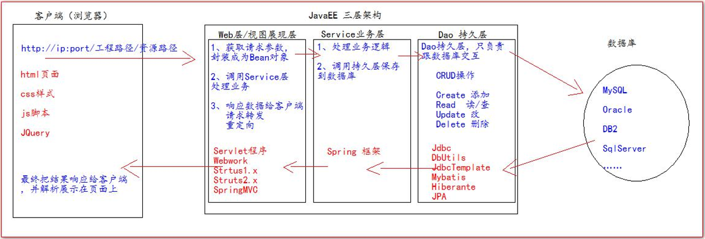

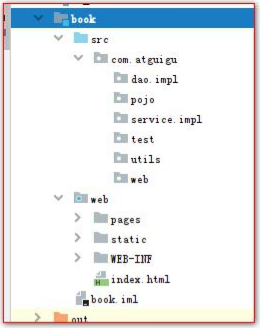

| web层        | com.atguigu.web/servlet/controller  |                    |
| ------------ | ----------------------------------- | ------------------ |
| service层    | com.atguigu.service                 | Service 接口包     |
|              | com.atguigu.service.impl            | Service 接口实现类 |
| dao持久层    | com.atguigu.dao                     | Dao 接口包         |
|              | com.atguigu.dao.impl                | Dao 接口实现类     |
| 实体bean对象 | com.atguigu.pojo/entity/domain/bean | JavaBean 类        |
| 测试包       | com.atguigu.test/junit              |                    |
| 工具类       | com.atguigu.utils                   |                    |

MVC 全称：Model 模型、 View 视图、 Controller 控制器。

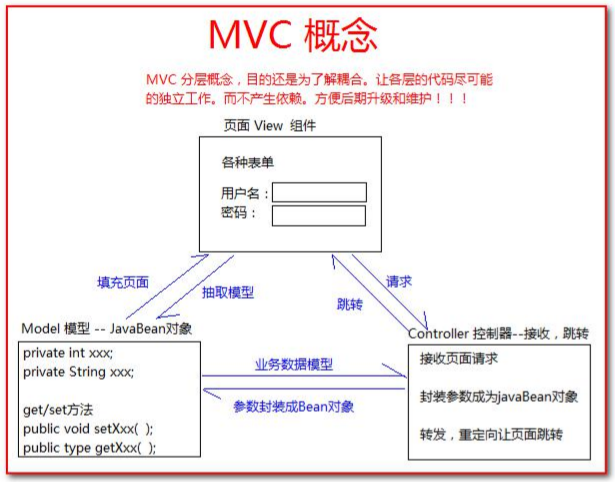


## 二、注册表单验证

- 验证用户名：必须由字母，数字下划线组成，并且长度为 5 到 12 位 
- 验证密码：必须由字母，数字下划线组成，并且长度为 5 到 12 位 
- 验证确认密码：和密码相同 
- 邮箱验证：xxxxx@xxx.com（正则表达式）
- 验证码：验证用户已输入

```jsp
<%--regist.jsp--%>
<script type="text/javascript">
   $(function () {
      //给注册按钮绑定单击事件
      $("#sub_btn").click(function () {
         // 验证用户名：必须由字母，数字下划线组成，并且长度为5到12位
         // 1.获取输入框内容（id选择器） 2.创建正则表达式对象 3.使用test方法验证 4.提示结果
         var username = $("#username").val();
         var usernamePatt = /^\w{5,12}$/;
         if (!usernamePatt.test(username)) {
            $("span.errorMsg").text("用户名不合法！");
            //阻止表单提交
            return false;
         }

         // 验证密码：必须由字母，数字下划线组成，并且长度为5到12位
         var password = $("#password").val();
         var passwordPatt = /^\w{5,12}$/;
         if (!passwordPatt.test(password)) {
            $("span.errorMsg").text("密码不合法！");

            return false;
         }

         // 验证确认密码：和密码相同
         if ($("#repwd").val() != $("#password").val()) {
            $("span.errorMsg").text("两次输入密码不同！");

            return false;
         }

         // 邮箱验证：xxxxx@xxx.com
         var email = $("#email").val();
         var emailPatt = /^[a-z\d]+(\.[a-z\d]+)*@([\da-z](-[\da-z])?)+(\.{1,2}[a-z]+)+$/;
         if (!emailPatt.test(email)) {
            $("span.errorMsg").text("邮箱不合法！");

            return false;
         }

         // 验证码：现在只需要验证用户已输入。因为还没讲到服务器。验证码生成。
         var code = $("#code").val();
         if (code == null || code == "") {
            $("span.errorMsg").text("验证码不能为空！");

            return false;
         }


         //合法了把错误信息去掉
         $("span.errorMsg").text("");
      });
   });


</script>
```


## 三、用户模块(注册与登录)

### 3.1 用户模块所需数据库与表

```sql
drop database if exists book;

create database book;

use book;

create table t_user( 
    `id` int primary key auto_increment, 
    `username` varchar(20) not null unique, 
    `password` varchar(32) not null, 
    `email` varchar(200) );
insert into t_user
	(`username`,`password`,`email`) 
	values('admin','admin','admin@atguigu.com');
	
select * from t_user;

```


### 3.2 用户模块JavaBean对象

**注意变量名与数据库中对应，若不对应注意在Dao实现类中的sql语句中给变量起别名。**

```java
public class User { 
    //使用Integer是为了防止空指针
    private Integer id; 
    private String username; 
    private String password; 
    private String email;
    //...
}
```


### 3.3 工具类JdbcUtils

JdbcUtils负责封装**从数据库连接池获取连接**以及**释放连接放回数据库连接池**。

使用druid-1.1.9.jar 与mysql-connector-java-5.1.7-bin.jar

- 在 src 源码目录下编写 jdbc.properties 属性配置文件：

```properties
username=root 
password=root 
url=jdbc:mysql://localhost:3306/book 
driverClassName=com.mysql.jdbc.Driver 
initialSize=5 
maxActive=10
```

- 编写 JdbcUtils 工具类：

```java
public class JDBCUtils {

    private static DataSource dataSource;

    static {
        try {
            //读取配置文件
            Properties properties = new Properties();
            properties.load(JDBCUtils.class.getClassLoader().getResourceAsStream("jdbc.properties"));
            //创建数据库连接池
            dataSource = DruidDataSourceFactory.createDataSource(properties);

        } catch (Exception e) {
            e.printStackTrace();
        }
    }


    /**
     * @param :
     * @return java.sql.Connection:如果返回null说明获取连接失败<br/>有值获取成功
     * @Description: 获取连接
     */
    public static Connection getConnection() {

        Connection conn = null;
        try {
            conn = dataSource.getConnection();
        } catch (SQLException throwables) {
            throwables.printStackTrace();
        }

        return conn;
    }

    /**
     * @param conn:
     * @return void:
     * @Description: 关闭连接，放回数据库连接池
     */
    public static void close(Connection conn) {
        if (conn != null) {
            try {
                conn.close();
            } catch (SQLException throwables) {
                throwables.printStackTrace();
            }
        }

    }
}
```


### 3.4 数据库表BaseDao类

BaseDao抽象类实现与数据库交互的基本方法，使用commons-dbutils-1.3.jar

```java
public abstract class BaseDao {

    //使用DBUtils操作数据库
    private QueryRunner queryRunner = new QueryRunner();


    /**
     * @param sql:
     * @param args:
     * @return int: 返回-1表示执行失败<br/>返回其他表示影响的行数
     * @Description: 用来执行Insert、Update、Delete
     */
    public int update(String sql, Object... args) {

        Connection conn = JDBCUtils.getConnection();
        try {
            return queryRunner.update(conn, sql, args);
        } catch (SQLException throwables) {
            throwables.printStackTrace();
        } finally {
          JDBCUtils.close(conn);
        }
        return -1;
    }


    /**
     * @param type:
     * @param sql:
     * @param args:
     * @return java.lang.Object: 返回一个JavaBean
     * @Description:
     */
    public <T> T queryForOne(Class<T> type, String sql, Object... args) {

        Connection conn = JDBCUtils.getConnection();
        try {
            return queryRunner.query(conn, sql, new BeanHandler<T>(type), args);
        } catch (SQLException throwables) {
            throwables.printStackTrace();
        } finally {
            JDBCUtils.close(conn);
        }
        return null;
    }


    /**
     * @param type: 
     * @param sql: 
     * @param args: 
     * @return java.util.List<T>: 返回多个JavaBean
     * @Description: 
     */
    public <T> List<T> queryForList(Class<T> type, String sql, Object... args) {

        Connection conn = JDBCUtils.getConnection();
        try {
            return queryRunner.query(conn, sql, new BeanListHandler<T>(type), args);
        } catch (SQLException throwables) {
            throwables.printStackTrace();
        } finally {
            JDBCUtils.close(conn);
        }
        return null;
    }

    /**
     * @param sql:
     * @param args:
     * @return java.lang.Object: 返回一行一列的查询
     * @Description:
     */
    public Object queryForSingleValue(String sql, Object... args) {

        Connection conn = JDBCUtils.getConnection();
        try {
            return queryRunner.query(conn, sql, new ScalarHandler(), args);
        } catch (Exception e) {
            e.printStackTrace();
        } finally {
            JDBCUtils.close(conn);
        }
        return null;
    }
}
```


### 3.5 UserDao接口及其实现类

对于User这个JavaBean一些较具体的方法，如：

1. 根据用户名查询用户信息
2. 保存用户信息
3. 根据用户名和密码查询用户信息

- **UserDao接口：**

```java
public interface UserDao {

    /**
     * Description: 根据用户名查询用户信息(注册用户时看存不存在)
     * @param username:
     * @return com.pojo.User: 如果返回null，则用户不存在
     */
    public User queryUserByUsername(String username);

    /**
     * Description: 保存用户信息
     * @param user:
     * @return int:
     */
    public int SaveUser(User user);

    /**
     * Description: 根据用户名和密码查询用户信息（登录时验证）
     * @param username:
     * @param password:
     * @return com.pojo.User: 如果返回null，则用户不存在
     */
    public User queryUserByUsernameAndPassword(String username,String password);
}
```

- **UserDaoImpl实现类（继承BaseDao实现UserDao接口）：**

```java
public class UserDaoImpl extends BaseDao implements UserDao {

    @Override
    public User queryUserByUsername(String username) {
        String sql = "select id,username,`password`,email from t_user where username = ?";
        return queryForOne(User.class, sql, username);
    }

    @Override
    public int SaveUser(User user) {
        String sql = "insert into t_user (username, `password`, email) values(?,?,?)";
        return update(sql, user.getUsername(), user.getPassword(), user.getEmail());
    }

    @Override
    public User queryUserByUsernameAndPassword(String username, String password) {
        String sql = "select id,username,`password`,email from t_user where username = ? and `password` = ?";
        return queryForOne(User.class, sql, username, password);
    }
}
```

### 3.6 UserService接口及其实现类

对于User这个JavaBean比UserDao更加具体的方法，如：注册用户、登录、检查用户名是否可用（重复）

- **UserService：**

```java
public interface UserService {

    /**
     * Description: 注册用户
     * @param user:
     * @return void: 
     */
    public void registUser(User user);

    /**
     * Description: 登录
     * @param user:
     * @return com.pojo.User: null-登录失败<br/>User对象-登录成功
     */
    public User login(User user);

    /**
     * Description: 检查用户名是否可用
     * @param name:
     * @return boolean: true-用户名已存在<br/>false-用户名可用
     */
    public boolean existsUsername(String name);
}
```

- **UserServiceImpl（创建一个UserDao接口实现类实例）：**

```java
public class UserServiceImpl implements UserService {

    private UserDao userDao = new UserDaoImpl();

    @Override
    public void registUser(User user) {
        userDao.SaveUser(user);
    }

    @Override
    public User login(User user) {
        return userDao.queryUserByUsernameAndPassword(user.getUsername(), user.getPassword());
    }

    @Override
    public boolean existsUsername(String name) {
        if (userDao.queryUserByUsername(name) == null) {
            return false;
        } else {
            return true;
        }
    }
}
```


### 3.7 Web层

#### a）用户注册流程

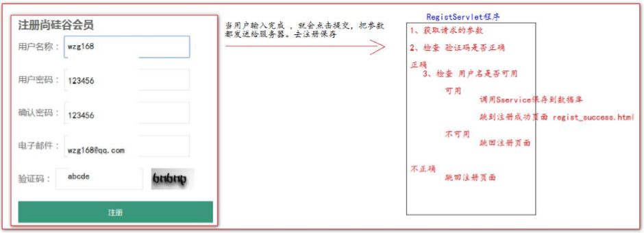

#### b）修改regist.html 和 regist_success.html 页面

- 添加 base 标签并修改路径（浏览器 F12报红）

  ```html
  <!-写 base标 签 ， 永 远 固 定 相 对 路 径 跳 转 的 结 果 --> 
  <base href="http://localhost:8080/book/">
  ```

- 修改注册表单的提交地址和请求方式(**post方法数据安全**)

  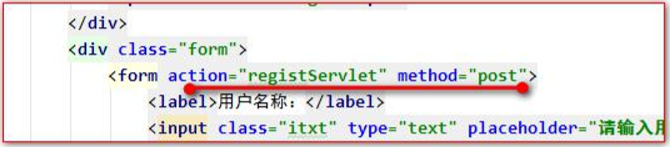

#### c）编写 RegistServlet 程序

创建一个UserService接口实现类实例

```java
private UserService userService = new UserServiceImpl();
protected void regist(HttpServletRequest request, HttpServletResponse response) throws ServletException, IOException {
        //1.获取请求的参数
        String username = request.getParameter("username");
        String password = request.getParameter("password");
        String email = request.getParameter("email");
        String code = request.getParameter("code");
        //2.检查验证码是否正确(要求验证码为abcde)
        if ("abcde".equalsIgnoreCase(code)) {
            //3.检查用户名是否可用
            if (userService.existsUsername(username)) {
                //不可用
                System.out.println("用户名[" + username + "]不可用！");
                //把回显信息保存到Request域中
                request.setAttribute("msg","用户名已存在！");
                request.setAttribute("username",username);
                request.setAttribute("email",email);
                request.getRequestDispatcher("/pages/user/regist.jsp").forward(request, response);
            } else {
                //可用
                //4.保存到数据库，跳转到成功注册页面
                userService.registUser(new User(null, username, password, email));
                request.getRequestDispatcher("/pages/user/regist_success.jsp").forward(request, response);
            }
        } else {
            //把回显信息保存到Request域中
            request.setAttribute("msg","验证码错误！");
            request.setAttribute("username",username);
            request.setAttribute("email",email);
            //请求转发,跳回注册页面
            System.out.println("验证码[" + code + "]错误！");
            request.getRequestDispatcher("/pages/user/regist.jsp").forward(request, response);
        }
}

```

#### d）用户登录流程

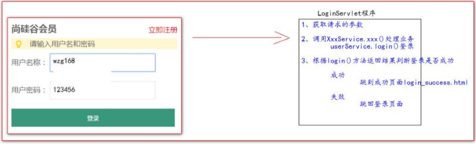

#### e）修改 login.html 页面和 login_success.html 页面

同b

#### f） 编写LoginServlet 程序

```java
private UserService userService = new UserServiceImpl();

protected void dopost(HttpServletRequest request, HttpServletResponse response) throws ServletException, IOException {
    //1.获取请求的参数
    String username = request.getParameter("username");
    String password = request.getParameter("password");
    //2.调用UserService处理业务
    User login = userService.login(new User(null, username, password, null));
    //3.根据login方法返回结果判断登录是否成功
    if (login != null) {
        //成功，login_success.jsp
        System.out.println("用户[" + username + "]登录成功！");
        request.getRequestDispatcher("/pages/user/login_success.jsp").forward(request, response);
    } else {
        //不成功,跳回登录页面
        //把错误信息和回显得表单保存到Request域中
        request.setAttribute("msg","用户名或密码错误!");
        request.setAttribute("username", username);
        System.out.println("用户[" + username + "]与密码不匹配！");
        request.getRequestDispatcher("/pages/user/login.jsp").forward(request, response);
    }
}
```


## 四、项目改进

### 4.1 页面 jsp 动态化

1. 在 html 页面顶行添加 page 指令。 
2. 修改文件后缀名为：.jsp 
3. 使用 IDEA 搜索替换代码中的.html 为.jsp(快捷键：Ctrl+Shift+R)


### 4.2 抽取页面相同内容

- head 中 css、jquery、base 标签

  common.head.jsp：

  ```jsp
  <%--动态服务器地址--%>
  <%--http://localhost:8080/book/--%>
  <%
      String basePath = request.getScheme()
              + "://"
              + request.getServerName()
              + ":"
              + request.getServerPort()
              + request.getContextPath()
              + "/";
      //pageContext对象在当前 jsp 页面范围内有效
      pageContext.setAttribute("basePath", basePath);
  %>
  <!--固定相对路径结果-->
  <base href="<%=basePath%>">
  <link type="text/css" rel="stylesheet" href="static/css/style.css" >
  <script type="text/javascript" src="static/script/jquery-1.7.2.js"></script>
  ```

  其他jsp页面包含head.jsp：

  ```jsp
  <%--静态包含base标签，css样式，jquery文件--%>
  <%@include file="/pages/common/head.jsp"%>
  ```

- 页面的页脚

- 登录成功后的菜单

- manager 模块的菜单

### 4.3 登录、注册错误提示及表单回显

如登录时，Servlet 程序端需要添加回显信息到 Request 域中然后在该jsp页面显示

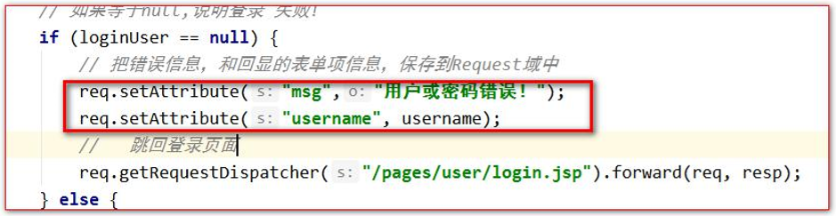

jsp 页面，需要输出回显信息

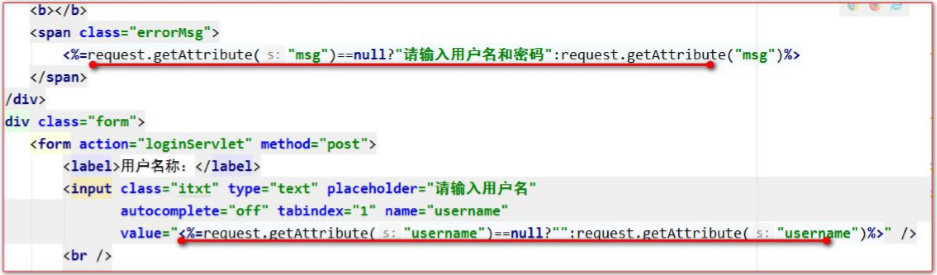


### 4.4 抽取BaseServlet

在实际的项目开发中，一个模块，一般只使用一个 Servlet 程序。

- 将regist和login的Servlet程序合成一个Servlet，方法名从doPost改为regist和login

- 对应的jsp页面**跳转地址添加?action=方法名**或**表单提交添加隐藏域action**

  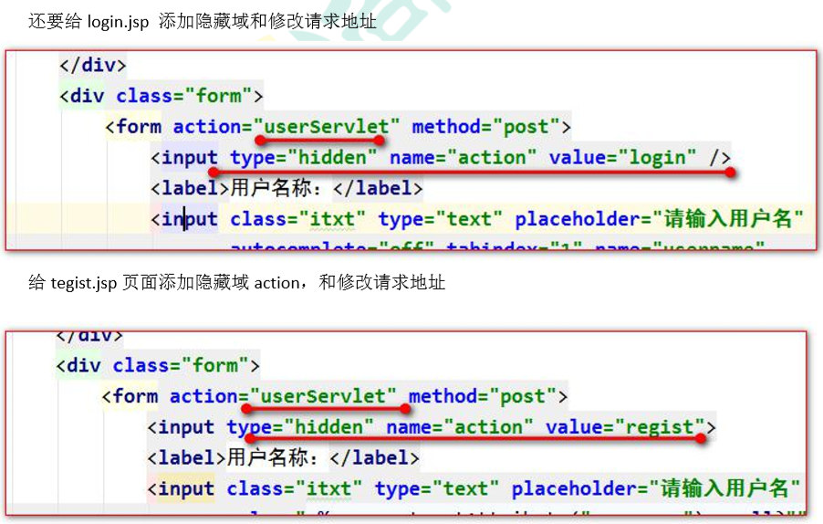

- 抽取 BaseServlet 程序

  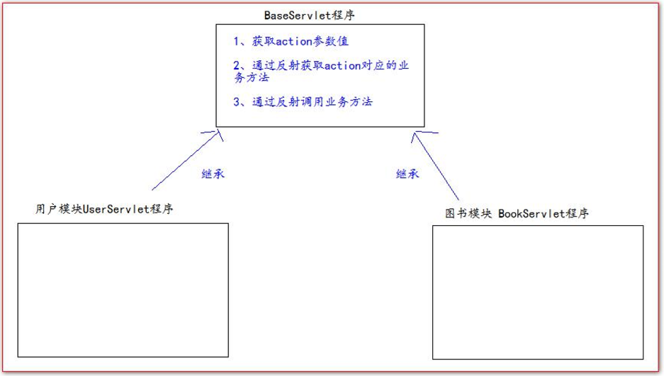

  BaseServlet 程序：

  ```java
  public abstract class BaseServlet extends HttpServlet {
  
      protected void doGet(HttpServletRequest request, HttpServletResponse response) throws ServletException, IOException {
          doPost(request,response);
      }
  
  
      @Override
      protected void doPost(HttpServletRequest request, HttpServletResponse response) throws ServletException, IOException {
          String action = request.getParameter("action");
  
          try {
              //获取action字符串鉴别业务，获取相应的业务方法反射对象
              Method method = this.getClass().getDeclaredMethod(action, HttpServletRequest.class, HttpServletResponse.class);
              //调用目标业务方法
              method.invoke(this, request, response);
          } catch (Exception e) {
              e.printStackTrace();
          }
      }
  }
  ```

-  UserServlet 程序继承 BaseServlet 程序


### 4.5 数据的封装与抽取

- BeanUtils 工具类，它可以**一次性的把所有请求(一个Map)的参数注入到 JavaBean 中**
- 使用commons-beanutils-1.8.0.jar与commons-logging-1.1.1.jar

- WebUtils 工具类：

```java
//传入map而不是传入Request再getMap是为了减少依赖和耦合度
public  static <T> T copyParamToBean(Map value, T bean) {
    try {
        //注入Bean
        BeanUtils.populate(bean,value);
    } catch (Exception e) {
        e.printStackTrace();
    }
    return bean;
}
```


### 4.6 用EL表达式修改表单回显

以登录为例：

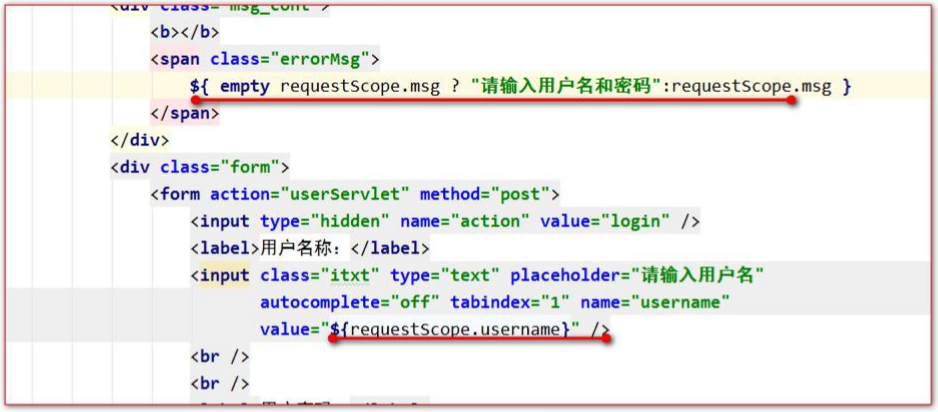


## 五、图书模块

### 5.1 图书模块所需数据库表

```sql
create table t_book( 
	`id` int primary key auto_increment, 
	`name` varchar(100), 
	`price` decimal(11,2), 
	`author` varchar(100), 
    `sales` int, `stock` int, 
    `img_path` varchar(200) 
);
```


### 5.2 图书模块JavaBean

```java
public class Book { 
    private Integer id; 
    private String name; 
    private String author;
    //与Integer类似作用，防止空指针
    private BigDecimal price; 
    private Integer sales; 
    private Integer stock; 
    private String imgPath = "static/img/default.jpg";
    //...
}
```


### 5.3 BookDao接口及其实现类

BookDao接口：

```java
public interface BookDao {
	public int addBook(Book book);
	public int deleteBookById(Integer id);
	public int updateBook(Book book);
	public Book queryBookById(Integer id);
	public List<Book> queryBooks();
}
```

BookDaoImpl 实现类：

```java
public class BookDaoImpl extends BaseDao implements BookDao { 
    @Override 
    public int addBook(Book book) {

    	String sql = "insert into t_book(`name`,`author`,`price`,`sales`,`stock`,`img_path`) values(?,?,?,?,?,?)";
		return update(sql, book.getName(),book.getAuthor(),book.getPrice(),book.getSales(),book.getStock(),book.getImgPath());        
}
    
	@Override 
    public int deleteBookById(Integer id) { 
        String sql = "delete from t_book where id = ?"; return update(sql, id); 
    }
    
	@Override 
    public int updateBook(Book book) { 
        String sql = "update t_book set `name`=?,`author`=?,`price`=?,`sales`=?,`stock`=?,`img_path`=? where id = ?"; 
        return update(sql,book.getName(),book.getAuthor(),book.getPrice(),book.getSales(),book.getStock(),book.ge tImgPath(),book.getId()); 
    }
    
	@Override 
    public Book queryBookById(Integer id) { 
        String sql = "select `id` , `name` , `author` , `price` , `sales` , `stock` , `img_path` imgPath from t_book where id = ?"; 
        return queryForOne(Book.class, sql,id); 
    }
    
	@Override 
    public List<Book> queryBooks() { 
        String sql = "select `id` , `name` , `author` , `price` , `sales` , `stock` , `img_path` imgPath from t_book"; 
        return queryForList(Book.class, sql); 
    } 
}

```


### 5.4 BookService接口及其实现类

BookService 接口：

```java
public interface BookService {
	public void addBook(Book book);
	public void deleteBookById(Integer id);
	public void updateBook(Book book);
	public Book queryBookById(Integer id);
	public List<Book> queryBooks();
}
```

BookServiceImpl 实现类：

```java
public class BookServiceImpl implements BookService {
	private BookDao bookDao = new BookDaoImpl();
	@Override 
    public void addBook(Book book) { bookDao.addBook(book); }
	@Override 
    public void deleteBookById(Integer id) { bookDao.deleteBookById(id); }
	@Override 
    public void updateBook(Book book) { bookDao.updateBook(book); }
	@Override 
    public Book queryBookById(Integer id) { return bookDao.queryBookById(id); }
	@Override 
    public List<Book> queryBooks() { return bookDao.queryBooks(); }
}
```

 

### 5.5 图书列表显示

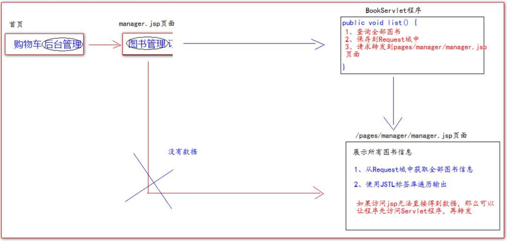

- **BookServlet 程序中添加 list 方法**：

```java
protected void list(HttpServletRequest req, HttpServletResponse resp) throws ServletException, IOException { 
    //1 通 过 BookService 查 询 全 部 图 书 
    List<Book> books = bookService.queryBooks(); 
    //2 把 全 部 图 书 保 存 到 Request 域 中 
    req.setAttribute("books", books); 
    //3 、 请 求 转 发 到 /pages/manager/book_manager.jsp 页 面 
    req.getRequestDispatcher("/pages/manager/book_manager.jsp").forward(req,resp); 
}
```

- **修改【图书管理】请求地址**：

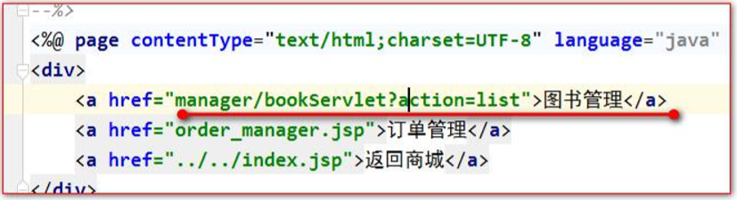

- **修改 pages/manager/book_manager.jsp 页面的数据遍历输出：（JSTL标签）**

```jsp
<c:forEach items="${requestScope.books}" var="book"> 
    <tr> 
        <td>${book.name}</td> 
        <td>${book.price}</td> 
        <td>${book.author}</td> 
        <td>${book.sales}</td> 
        <td>${book.stock}</td> 
        <td><a href="book_edit.jsp">修改</a></td> 
        <td><a href="#">删除</a></td>
    </tr> 
</c:forEach>
```


### 5.6 添加图书

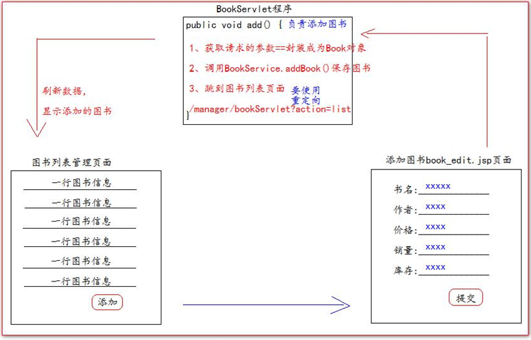

BookServlet程序：

```java
protected void add(HttpServletRequest request, HttpServletResponse response) throws ServletException, IOException {
    int pageNo = WebUtils.parseInt(request.getParameter("pageNo"), 0);
    //1.获取请求的参数，封装成为Book对象
    Book book = WebUtils.copyParamToBean(request.getParameterMap(), new Book());
    //2.调用bookService.addBook()保存图书
    bookService.addBook(book);
    //3.跳回到图书管理页面
    //请求转发会导致重复提交表单的问题(F5刷新时)
    //使用重定向
    response.sendRedirect(req.getContextPath() + "/manager/bookServlet?action=list");
}
```

book_edit.jsp：


### 5.7 删除图书


```java
protected void delete(HttpServletRequest req, HttpServletResponse resp) throws ServletException,IOException {
	// 1、获取请求的参数 id，图书编程
	int id = WebUtils.parseInt(req.getParameter("id"), 0);
	// 2、调用 bookService.deleteBookById();删除图书
	bookService.deleteBookById(id);
	// 3、重定向回图书列表管理页面
	// /book/manager/bookServlet?action=list
	resp.sendRedirect(req.getContextPath() + "/manager/bookServlet?action=list");
}
```

- 删除的请求地址：


- 给删除增加确认提示（给删除的 a 标签绑定单击事件，用于删除的确认提示操作）：

```jsp
<script type="text/javascript">
	$(function () {
        // 给删除的 a 标签绑定单击事件，用于删除的确认提示操作
		$("a.deleteClass").click(function () {
		// 在事件的 function 函数中，有一个 this 对象。这个 this 对象，是当前正在响应事件的 dom 对象。
		/**
		* confirm 是确认提示框函数
		* 参数是它的提示内容
		* 它有两个按钮，一个确认，一个是取消。
		* 返回 true 表示点击了，确认，返回 false 表示点击取消。
		*/
		return confirm("你确定要删除【" + $(this).parent().parent().find("td:first").text() + "】?");
		// return false// 阻止元素的默认行为===不提交请求
		});
	});
</script>
```


### 5.8添加转换 int 类型的工具方法

- 作用是简化req.getParameter()方法时字符串向整形转化的过程
- 同时可以起到**设置默认值**的作用

```java
/**
* 将字符串转换成为 int 类型的数据
* @param strInt
* @param defaultValue
* @return
*/
public static int parseInt(String strInt,int defaultValue) {
	try {
		return Integer.parseInt(strInt);
	} catch (Exception e) {
		e.printStackTrace();
	}
	return defaultValue;
}
```


### 5.9 修改图书


- 修改的请求地址：


- BookServlet 程序中添加 getBook 方法：

```java
protected void getBook(HttpServletRequest req, HttpServletResponse resp) throws ServletException,IOException {
	//1 获取请求的参数图书编号
	int id = WebUtils.parseInt(req.getParameter("id"), 0);
	//2 调用 bookService.queryBookById 查询图书
	Book book = bookService.queryBookById(id);
	//3 保存到图书到 Request 域中
	req.setAttribute("book", book) ;
	//4 请求转发到pages/manager/book_edit.jsp 页面
	req.getRequestDispatcher("/pages/manager/book_edit.jsp").forward(req,resp);
}
```

- 在 book_edit.jsp 页面中显示修改的数据：

```jsp
<div id="main">
	<form action="manager/bookServlet" method="get">
		<input type="hidden" name="action" value="add" />
		<table>
			<tr>
				<td>名称</td>
				<td>价格</td>
				<td>作者</td>
				<td>销量</td>
				<td>库存</td>
				<td colspan="2">操作</td>
			</tr>
			<tr>
				<td><input name="name" type="text" value="${requestScope.book.name}"/></td>
				<td><input name="price" type="text" value="${requestScope.book.price}"/></td>
				<td><input name="author" type="text" value="${requestScope.book.author}"/></td>
				<td><input name="sales" type="text" value="${requestScope.book.sales}"/></td>
				<td><input name="stock" type="text" value="${requestScope.book.stock}"/>				</td><td><input type="submit" value="提交"/></td>
			</tr>
		</table>
	</form>
</div>
```

- 在 BookServlet 程序中添加 update 方法：

```Java
protected void update(HttpServletRequest req, HttpServletResponse resp) throws ServletException, IOException {
	// 1、获取请求的参数==封装成为 Book 对象
	Book book = WebUtils.copyParamToBean(req.getParameterMap(),new Book());
	// 2、调用 BookService.updateBook( book );修改图书
	bookService.updateBook(book);
	// 3、重定向回图书列表管理页面
	// 地址：/工程名/manager/bookServlet?action=list
	resp.sendRedirect(req.getContextPath() + "/manager/bookServlet?action=list");
}
```

- 解决 book_edit.jsp 页面，同时实现添加与修改操作：


​	解决方案二示例：


## 六、分页模块

### 6.1 分页模块分析


### 6.2 分页模型Page的抽取

```java
/**
* Page 是分页的模型对象
* @param <T> 是具体的模块的 javaBean 类
*/
public class Page<T> {
    
	public static final Integer PAGE_SIZE = 4;
	// 当前页码
	private Integer pageNo;
	// 总页码
	private Integer pageTotal;
	// 当前页显示数量
	private Integer pageSize = PAGE_SIZE;
	// 总记录数
	private Integer pageTotalCount;
	// 当前页数据
	private List<T> items
}
```


### 6.3 分页的实现

#### a）初步实现

- BookDao 代码：

```java
@Override
public Integer queryForPageTotalCount() {
	String sql = "select count(*) from t_book";
	Number count = (Number) queryForSingleValue(sql);
	return count.intValue();
}
@Override
public List<Book> queryForPageItems(int begin, int pageSize) {
	String sql = "select `id` , `name` , `author` , `price` , `sales` , `stock` , `img_path` imgPath
	from t_book limit ?,?";
	return queryForList(Book.class,sql,begin,pageSize);
}
```

- BookService 代码：

```java
@Override
public Page<Book> page(int pageNo, int pageSize) {
    
	Page<Book> page = new Page<Book>();
	// 设置当前页码
	page.setPageNo(pageNo);
	// 设置每页显示的数量
	page.setPageSize(pageSize);
	// 求总记录数
	Integer pageTotalCount = bookDao.queryForPageTotalCount();
	// 设置总记录数
    page.setPageTotalCount(pageTotalCount);
	// 求总页码
	Integer pageTotal = pageTotalCount / pageSize;
	if (pageTotalCount % pageSize > 0) {
		pageTotal+=1;
	}
	// 设置总页码
	page.setPageTotal(pageTotal);
	// 求当前页数据的开始索引
	int begin = (page.getPageNo() - 1) * pageSize;
	// 求当前页数据
	List<Book> items = bookDao.queryForPageItems(begin,pageSize);
	// 设置当前页数据
	page.setItems(items);
	return page;
}
```

- BookServlet 程序的代码：

```java
protected void page(HttpServletRequest req, HttpServletResponse resp) throws ServletException,IOException {
	//1 获取请求的参数 pageNo 和 pageSize
	int pageNo = WebUtils.parseInt(req.getParameter("pageNo"), 1);
	int pageSize = WebUtils.parseInt(req.getParameter("pageSize"), Page.PAGE_SIZE);
	//2 调用 BookService.page(pageNo，pageSize)：Page 对象
	Page<Book> page = bookService.page(pageNo,pageSize);
	//3 保存 Page 对象到 Request 域中
	req.setAttribute("page",page);
	//4 请求转发到 pages/manager/book_manager.jsp 页面
	req.getRequestDispatcher("/pages/manager/book_manager.jsp").forward(req,resp);
}
```

- manager_menu.jsp 中【图书管理】请求地址的修改：


- book_manager.jsp 修改：


#### b）首页、上一页、下一页、末页的实现

对book_manager.jsp 的修改

```jsp
<div id="page_nav">
	<%--大于首页，才显示--%>
	<c:if test="${requestScope.page.pageNo > 1}">
		<a href="manager/bookServlet?action=page&pageNo=1">首页</a>
		<a href="manager/bookServlet?action=page&pageNo=${requestScope.page.pageNo-1}">上一页</a>
	</c:if>
    
	<a href="#">3</a>
	【${ requestScope.page.pageNo }】
	<a href="#">5</a>
    
	<%-- 如果已经 是最后一页，则不显示下一页，末页 --%>
	<c:if test="${requestScope.page.pageNo < requestScope.page.pageTotal}">
		<a href="manager/bookServlet?action=page&pageNo=${requestScope.page.pageNo+1}">下一页</a>
		<a href="manager/bookServlet?action=page&pageNo=${requestScope.page.pageTotal}">末页</a>
	</c:if>
    
	共${ requestScope.page.pageTotal }页，${ requestScope.page.pageTotalCount }条记录
	到第<input value="4" name="pn" id="pn_input"/>页
	<input type="button" value="确定">
</div>
```

#### c）跳转到指定页数的实现

- book_manager.jsp 修改：

```java
<div id="page_nav">
	<%--大于首页，才显示--%>
	<c:if test="${requestScope.page.pageNo > 1}">
		<a href="manager/bookServlet?action=page&pageNo=1">首页</a>
		<a href="manager/bookServlet?action=page&pageNo=${requestScope.page.pageNo-1}">上一页</a>
	</c:if>
        
    <a href="#">3</a>
	【${ requestScope.page.pageNo }】
	<a href="#">5</a>
        
	<%-- 如果已经 是最后一页，则不显示下一页，末页 --%>
	<c:if test="${requestScope.page.pageNo < requestScope.page.pageTotal}">
		<a href="manager/bookServlet?action=page&pageNo=${requestScope.page.pageNo+1}">下一页</a>
		<a href="manager/bookServlet?action=page&pageNo=${requestScope.page.pageTotal}">末页</a>
	</c:if>
        
	共${ requestScope.page.pageTotal }页，${ requestScope.page.pageTotalCount }条记录
	到第<input value="${param.pageNo}" name="pn" id="pn_input"/>页
	<input id="searchPageBtn" type="button" value="确定">
        
	<script type="text/javascript">
		$(function () {
			// 跳到指定的页码
			$("#searchPageBtn").click(function () {
				var pageNo = $("#pn_input").val();
				<%--var pageTotal = ${requestScope.page.pageTotal};--%>
				<%--alert(pageTotal);--%>
				// javaScript 语言中提供了一个 location 地址栏对象
				// 它有一个属性叫 href.它可以获取浏览器地址栏中的地址
				// href 属性可读，可写，写就是访问该地址
				location.href = "${pageScope.basePath}manager/bookServlet?action=page&pageNo=" +pageNo;
			});
		});

	</script>
</div>
```

- Page 对象中的修改：

```java
public void setPageNo(Integer pageNo) {
	/* 数据边界的有效检查 */
	if (pageNo < 1) {
		pageNo = 1;
	}
	if (pageNo > pageTotal) {
		pageNo = pageTotal;
	}
	this.pageNo = pageNo;
}
```

- BookService 中 page 方法的修改：

```java
@Override
public Page<Book> page(int pageNo, int pageSize) {
	Page<Book> page = new Page<Book>();
	// 设置每页显示的数量
	page.setPageSize(pageSize);
	// 求总记录数
	Integer pageTotalCount = bookDao.queryForPageTotalCount();
	// 设置总记录数
	page.setPageTotalCount(pageTotalCount);
	// 求总页码
	Integer pageTotal = pageTotalCount / pageSize;
	if (pageTotalCount % pageSize > 0) {
		pageTotal+=1;
	}
	// 设置总页码
	page.setPageTotal(pageTotal);
	// 设置当前页码
	page.setPageNo(pageNo);
    
    //当前页数据(pageNo可能超出边界修改了，重新获取)
	// 求当前页数据的开始索引
	int begin = (page.getPageNo() - 1) * pageSize;
	// 求当前页数据
	List<Book> items = bookDao.queryForPageItems(begin,pageSize);
	// 设置当前页数据
	page.setItems(items);
    
	return page
}
```

#### d）临近页码跳转的实现

需求：显示 5 个连续的页码，而且当前页码在中间。除了当前页码之外，每个页码都可以点击跳到指定页

```
情况 1：如果总页码小于等于 5 的情况，页码的范围是：1-总页码
1 页 1
2 页 1，2
3 页 1，2，3
4 页 1，2，3，4
5 页 1，2，3，4，5

情况 2：总页码大于 5 的情况。假设一共 10 页
	小情况 1：当前页码为前面 3 个：1，2，3 的情况，页码范围是：1-5. 【1】2，3，4，5
	1【2】3，4，5
	1，2【3】4，5
	小情况 2：当前页码为最后 3 个，8，9，10，页码范围是：总页码减 4 - 总页码
	6，7【8】9，10
	6，7，8【9】10
	6，7，8，9【10】
	小情况 3：4，5，6，7，页码范围是：当前页码减 2 - 当前页码加 2
	2，3，4，5，6
	3，4，5，6，7
	4，5，6，7，8
	5，6，7，8，9
```

- 修改book_manager.jsp：

```jsp
<%--页码输出的开始--%>
<c:choose>
    <%--情况 1：如果总页码小于等于 5 的情况，页码的范围是：1-总页码--%>
    <c:when test="${ requestScope.page.pageTotal <= 5 }">
        <c:set var="begin" value="1"/>
        <c:set var="end" value="${requestScope.page.pageTotal}"/>
    </c:when>
    <%--情况 2：总页码大于 5 的情况--%>
    <c:when test="${requestScope.page.pageTotal > 5}">
        <c:choose>
            <%--小情况 1：当前页码为前面 3 个：1，2，3 的情况，页码范围是：1-5.--%>
            <c:when test="${requestScope.page.pageNo <= 3}">
                <c:set var="begin" value="1"/>
                <c:set var="end" value="5"/>
            </c:when>
            <%--小情况 2：当前页码为最后 3 个，8，9，10，页码范围是：总页码减 4 - 总页码--%>
            <c:when test="${requestScope.page.pageNo > requestScope.page.pageTotal-3}">
                <c:set var="begin" value="${requestScope.page.pageTotal-4}"/>
                <c:set var="end" value="${requestScope.page.pageTotal}"/>
            </c:when>
            <%--小情况 3：4，5，6，7，页码范围是：当前页码减 2 - 当前页码加 2--%>
            <c:otherwise><c:set var="begin" value="${requestScope.page.pageNo-2}"/>
                <c:set var="end" value="${requestScope.page.pageNo+2}"/>
            </c:otherwise>
        </c:choose>
    </c:when>
</c:choose>

<c:forEach begin="${begin}" end="${end}" var="i">
    <c:if test="${i == requestScope.page.pageNo}">
        【${i}】
    </c:if>
    <c:if test="${i != requestScope.page.pageNo}">
        <a href="${ requestScope.page.url }&pageNo=${i}">${i}</a>
    </c:if>
</c:forEach>

<%--页码输出的结束--%>
```

#### e）分页后，增删改图书信息的回显

以修改为例：

- 在修改的请求地址上追加当前页码参数：


- 在 book_edit.jsp 页面中使用隐藏域记录下 pageNo 参数：


- 在服务器重定向的时候，获取当前页码追加上进行跳转：

```java
protected void update(HttpServletRequest req, HttpServletResponse resp) throws ServletException, IOException {
	// 1、获取请求的参数==封装成为 Book 对象
	Book book = WebUtils.copyParamToBean(req.getParameterMap(),new Book());
	// 2、调用 BookService.updateBook( book );修改图书
	bookService.updateBook(book);// 3、重定向回图书列表管理页面
	// 地址：/工程名/manager/bookServlet?action=list
	resp.sendRedirect(req.getContextPath() + "/manager/bookServlet?action=page&pageNo=" +
	req.getParameter("pageNo"));
}
```


### 6.4 首页index.jsp的跳转


- web目录下的index.jsp：

```jsp
<%--这个目录下的index.jsp只请求转发到servlet程序，再转发到原index.jsp--%>
<jsp:forward page="/client/bookServlet?action=page"></jsp:forward>
```

- ClientBookServlet程序下移植BookServlet下的page、pageByPrice等方法，目的是防止直接访问index.jsp时无法使用分页、搜索等功能


### 6.5 分页条的抽取

在图书管理、订单管理等界面使用，需要把图书信息抽取出来变成公共的jsp页面

- 在 page   JavaBean对象中添加 url 属性：

  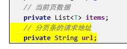

- 在 所有Servlet 程序（包括BookServlet、ClientBookServlet）的 page 分页方法中设置 url 的分页请求地址：

  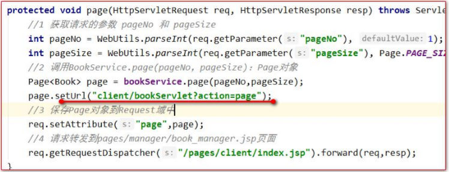

- 修改分页条中请求地址为 url 变量输出,并抽取一个单独的 jsp 页面：

  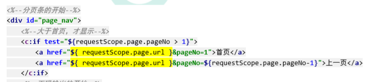


### 6.6 首页价格搜索

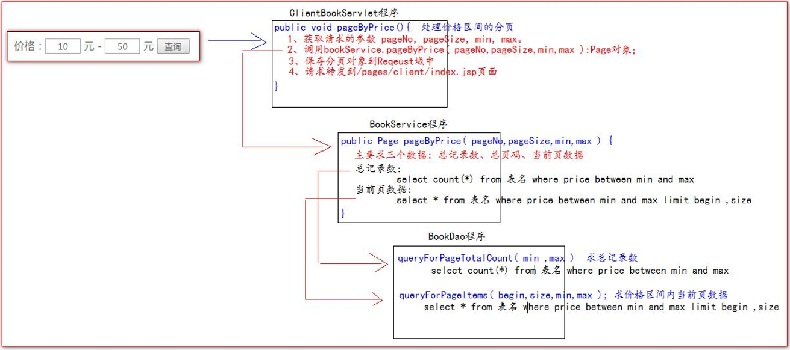

- index.jsp页面的修改：

  ```jsp
  <div class="book_cond">
  	<form action="client/bookServlet" method="get">
  		<input type="hidden" name="action" value="pageByPrice">
  		<%--回显搜索价格--%>
  		价格：<input id="min" type="text" name="min" value="${param.min}"> 元 -
  		<input id="max" type="text" name="max" value="${param.max}"> 元
  		<input type="submit" value="查询" />
  	</form>
  </div>
  ```

- 在ClientBookServlet程序中添加pageByPrice()方法：

  ```java
  protected void pageByPrice(HttpServletRequest request, HttpServletResponse response) throws ServletException, IOException {
          //1.获取请求的参数 pageNo和pageSize,价格min，max
          //用户没有点击第几分页默认第1页,默认每页页数为Page.PAGE_SIZE
          int pageNo = WebUtils.parseInt(request.getParameter("pageNo"), 1);
          int pageSize = WebUtils.parseInt(request.getParameter("pageSize"), Page.PAGE_SIZE);
          int min = WebUtils.parseInt(request.getParameter("min"), 0);
          int max = WebUtils.parseInt(request.getParameter("max"), Integer.MAX_VALUE);
          //2.调用BookService.pageByPrice方法返回符合价格区间page对象
      	//其本质与按下查询按钮一样都是访问"client/bookServlet"后加pageNo、pageSize、min、max
          Page<Book> page = bookService.pageByPrice(pageNo, pageSize,min,max);
          StringBuilder sb = new StringBuilder("client/bookServlet?action=pageByPrice");
          //如果有最小、最大价格(追加到url)，用于搜索价格区间后的翻页
          if (request.getParameter("min") != null) {
              sb.append("&min=").append(request.getParameter("min"));
          }
          if (request.getParameter("max") != null) {
              sb.append("&max=").append(request.getParameter("max"));
          }
          page.setUrl(sb.toString());
          //3.保存page对象到Request域中
          request.setAttribute("page", page);
          //4.请求转发到client/index.jsp页面
          request.getRequestDispatcher("/pages/client/index.jsp").forward(request, response);
  
      }
  ```

- 在BookService程序中添加pageByPrice()方法：

  ```java
  @Override
  public Page<Book> pageByPrice(int pageNo, int pageSize, int min, int max) {
      Page<Book> page = new Page<>();
      //每页记录数
      page.setPageSize(pageSize);
      //求总记录数
      Integer pageTotalCount = bookDao.queryForPageTotalCountByPrice(min, max);
      page.setPageTotalCount(pageTotalCount);
      //总页码
      int pageTotal = ((pageTotalCount - 1) / pageSize) + 1;
      page.setPageTotal(pageTotal);
      //当前页码数
      page.setPageNo(pageNo);
      //当前页数据(pageNo可能超出边界修改了，重新获取)
      int begin = (page.getPageNo() - 1) * pageSize;
      List<Book> items = bookDao.queryForPageItemsByPrice(begin, pageSize, min, max);
      page.setItems(items);
  
      return page;
  }
  ```

- 在BookDao程序中添加queryForPageTotalCountByPrice()与queryForPageItemsByPrice方法：

  ```java
  @Override
  public Integer queryForPageTotalCountByPrice(int min, int max) {
      String sql = "select count(*) from t_book where `price` between ? and ?";
      //return (Integer) queryForSingleValue(sql);
      Number count = (Number) queryForSingleValue(sql, min, max);
      return count.intValue();
  }
  
  @Override
  public List<Book> queryForPageItemsByPrice(int begin, int pageSize, int min, int max) {
      String sql = "select `id`,`name`,`author`,`price`,`sales`,`stock`,`img_path` imgPath " +
              "from t_book where `price` between ? and ? limit ?,?";
      return queryForList(Book.class, sql, min, max, begin, pageSize);
  }
  ```


## 七、登录功能改进

### 7.1 登录显示用户名

- UserServlet中login()中保存用户登录的信息：

```java
//保存用户登录成功之后的信息到Session域中，（在整个会话期间有效）
request.getSession().setAttribute("user",login);
```

- 修改 login_succuess_menu.jsp与 index.jsp等：

```jsp
<span>欢迎<span class="um_span">${sessionScope.user.username}</span>光临尚硅谷书城</span>
```

```jsp
<%--如果用户还没有登录，显示登录和注册菜单--%>
<c:if test="${empty sessionScope.user}">
   <a href="pages/user/login.jsp">登录</a> |
   <a href="pages/user/regist.jsp">注册</a> &nbsp;&nbsp;
</c:if>
<%--如果用户已登录，显示登录成功信息--%>
<c:if test="${not empty sessionScope.user}">
   <span>欢迎<span class="um_span">${sessionScope.user.username}</span>光临尚硅谷书城</span>
   <a href="pages/order/order.jsp">我的订单</a>
   <a href="userServlet?action=logout">注销</a>&nbsp;&nbsp;
</c:if>
```


### 7.2 注销用户

- 销毁 Session（或者销毁 Session中用户登录的信息）

```java
protected void logout(HttpServletRequest request, HttpServletResponse response) throws ServletException, IOException {
    //1.销毁Session中用户登录的信息（或者销毁Session）
    request.getSession().invalidate();
    //2.重定向到首页（或登录页面）
    response.sendRedirect(request.getContextPath());
}
```

- 重定向到首页（或登录页面）

```jsp
<a href="userServlet?action=logout">注销</a>
```


### 7.3 表单重复提交

表单重复提交有三种常见的情况： 

一：提交完表单。服务器使用请求转来进行页面跳转。这个时候，用户按下功能键 F5，就会发起最后一次的请求。 造成表单重复提交问题。

解决方法：使用重定向来进行跳转 

二：用户正常提交服务器，但是由于网络延迟等原因，迟迟未收到服务器的响应，这个时候，用户以为提交失败， 就会着急，然后多点了几次提交操作，也会造成表单重复提交。 

三：用户正常提交服务器。服务器也没有延迟，但是提交完成后，用户回退浏览器。重新提交。也会造成表单重复 提交。

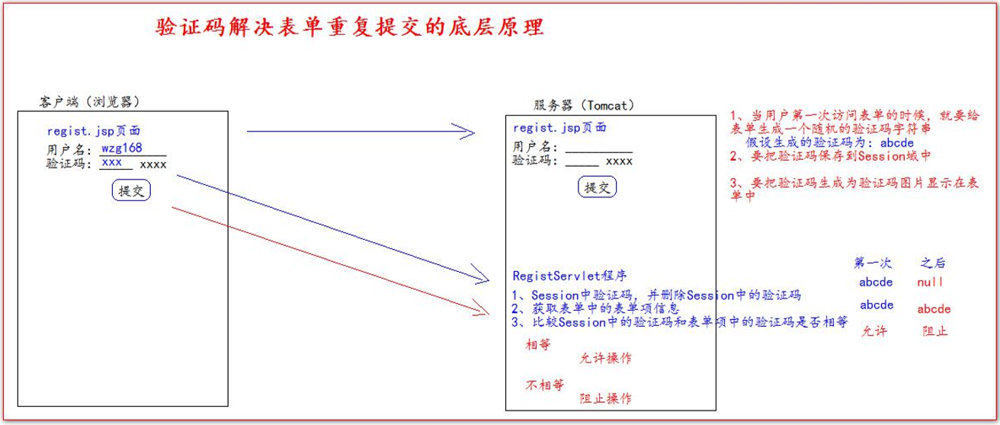


### 7.4 验证码的使用

- 导入谷歌验证码的 jar 包 kaptcha-2.3.2.jar

  该jar包中有自带的Servlet程序，作用是返回验证码图片并将对应的值以KAPTCHA_SESSION_KEY键保存到Session域中。

- 在 web.xml 中去配置用于生成验证码的 Servlet 程序

  /kaptcha.jpg路径实际上是在访问kaptcha-2.3.2.jar的Servlet程序

```xml
<servlet> 
    <servlet-name>KaptchaServlet</servlet-name> 
    <servlet-class>com.google.code.kaptcha.servlet.KaptchaServlet</servlet-class> </servlet> 
<servlet-mapping> 
    <servlet-name>KaptchaServlet</servlet-name> 
    <url-pattern>/kaptcha.jpg</url-pattern> 
</servlet-mapping>
```

- 修改login.jsp中验证码图片的路径

```jsp

```

- 在UserServlet中的regist()中获取谷歌生成的验证码和客户端发送过来的验证码比较使用

```java
protected void regist(HttpServletRequest request, HttpServletResponse response) throws ServletException, IOException {
    //获取Session中的验证码
    String token = (String) request.getSession().getAttribute(KAPTCHA_SESSION_KEY);
    //删除Session中的验证码
    request.getSession().removeAttribute(KAPTCHA_SESSION_KEY);

    //1.获取请求的参数
    String username = request.getParameter("username");
    String password = request.getParameter("password");
    String email = request.getParameter("email");
    String code = request.getParameter("code");
    //2.检查验证码是否正确(要求验证码为abcde)
    if (token != null && token.equalsIgnoreCase(code)) {
        //3.检查用户名是否可用
        if (userService.existsUsername(username)) {
            //不可用
            System.out.println("用户名[" + username + "]不可用！");
            //把回显信息保存到Request域中
            request.setAttribute("msg", "用户名已存在！");
            request.setAttribute("username", username);
            request.setAttribute("email", email);
            request.getRequestDispatcher("/pages/user/regist.jsp").forward(request, response);
        } else {
            //可用
            //4.保存到数据库，跳转到成功注册页面
            userService.registUser(new User(null, username, password, email));
            request.getRequestDispatcher("/pages/user/regist_success.jsp").forward(request, response);
        }
    } else {
        //把回显信息保存到Request域中
        request.setAttribute("msg", "验证码错误！");
        request.setAttribute("username", username);
        request.setAttribute("email", email);
        //请求转发,跳回注册页面
        System.out.println("验证码[" + code + "]错误！");
        request.getRequestDispatcher("/pages/user/regist.jsp").forward(request, response);
    }
```

- 点击验证码图片刷新图片的实现

```js
//给验证码的图片绑定单击事件
//this是当前响应事件的dom对象
//
//src属性表示验证码的图片路径，可读可写
$("#code_img").click(function () {
   //加Date后缀是为了绕过缓存，无具体含义
   this.src = "${basePath}/kaptcha.jpg?d=" + new Date();
});
```


## 八、购物车模块

### 8.1 购物车模块分析

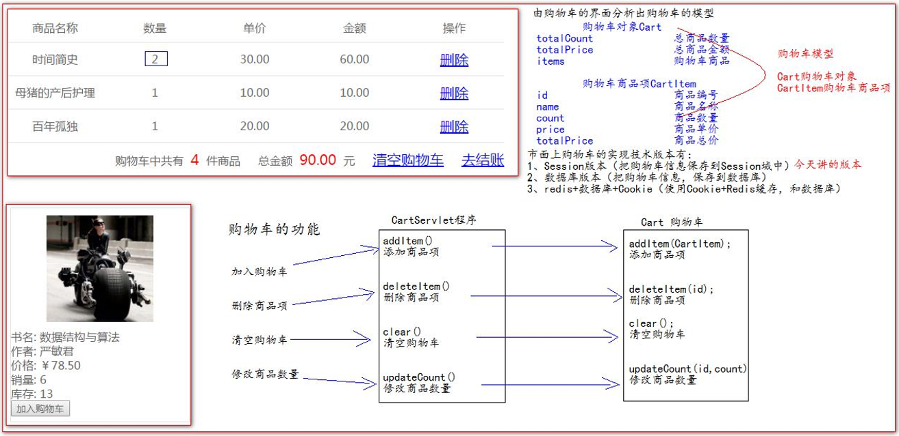


### 8.2 购物车模型(Session版)

- CartItem类（JavaBean）：

```java
public class CartItem {
    private Integer id;
    //商品名
    private String name;
    //数量
    private Integer count;
    //单价
    private BigDecimal price;
    //总金额
    private BigDecimal totalPrice;
}
```

- Cart类（包括实现Dao、Service层的功能）：

  添加商品项、删除商品项、清空购物车、修改商品数量

```java
public class Cart {
    //以下两个属性无set()方法，直接由get()获取，所以可以不定义属性
    //商品总数
    //private Integer totalCount;
    //商品总价
    //private BigDecimal totalPrice;
    
    //key是商品编号(唯一)，value是商品信息(id,商品名，数量，单价，总金额)
    private Map<Integer, CartItem> items = new LinkedHashMap<>();

    /**
     * Description: 添加商品项
     * @param cartItem:
     * @return void:
     */
    public void addItem(CartItem cartItem) {
        //先查看购物车中是否有该商品，如果有，数量增加，总金额更新
        CartItem item = items.get(cartItem.getId());
        if (item == null) {
            //之前没添加过
            items.put(cartItem.getId(), cartItem);
        } else {
            item.setCount(item.getCount() + 1);
            item.setTotalPrice(item.getPrice().multiply(new BigDecimal(item.getCount())));
        }
    }

    /**
     * Description: 删除商品项
     * @param id:
     * @return void:
     */
    public void deleteItem(Integer id) {
        items.remove(id);
    }

    /**
     * Description: 清空购物车
     * @param :
     * @return void:
     */
    public void clear() {
        items.clear();
    }

    /**
     * Description: 修改商品数量
     * @param id:
     * @param count:
     * @return void:
     */
    public void updateCount(Integer id, Integer count) {
        //先查看购物车中是否有此商品
        CartItem cartItem = items.get(id);
        if (cartItem != null) {
            //修改商品数量，更新总金额
            cartItem.setCount(count);
            cartItem.setTotalPrice(cartItem.getPrice().multiply(new BigDecimal(cartItem.getCount())));
        }
    }

    @Override
    public String toString() {
        return "Cart{" +
                "totalCount=" + getTotalCount() +
                ", totalPrice=" + getTotalPrice() +
                ", items=" + items +
                '}';
    }

    public Integer getTotalCount() {
        Integer totalCount = 0;
        for (Map.Entry<Integer, CartItem> entry : items.entrySet()) {
            totalCount += entry.getValue().getCount();
        }
        return totalCount;
    }


    public BigDecimal getTotalPrice() {
        BigDecimal totalPrice = new BigDecimal(0);
        for (Map.Entry<Integer, CartItem> entry : items.entrySet()) {
            totalPrice = totalPrice.add(entry.getValue().getTotalPrice());
        }
        return totalPrice;
    }

    public Map<Integer, CartItem> getItems() {
        return items;
    }

    public void setItems(Map<Integer, CartItem> items) {
        this.items = items;
    }
}
```


### 8.3 加入购物车

- CartServlet：

```java
protected void addItem(HttpServletRequest request, HttpServletResponse response) throws ServletException, IOException {
    //获取请求的参数：商品编号
    int id = WebUtils.parseInt(request.getParameter("id"), 0);
    //调用bookService.queryBookById()得到Book对象
    Book book = bookService.queryBookById(id);
    //把Book对象转化为CartItem对象
    CartItem cartItem = new CartItem(book.getId(), book.getName(), 1, book.getPrice(), book.getPrice());
    //调用Cart.addItem()添加商品
    Cart cart = (Cart) request.getSession().getAttribute("cart");
    if (cart == null) {
        cart = new Cart();
        request.getSession().setAttribute("cart", cart);
    }
    cart.addItem(cartItem);
    //回显最后一个添加的商品名称
    request.getSession().setAttribute("lastName", cartItem.getName());
    //重定向回原来的商品列表页面（包括分页）
    response.sendRedirect(request.getHeader("Referer"));
}
```

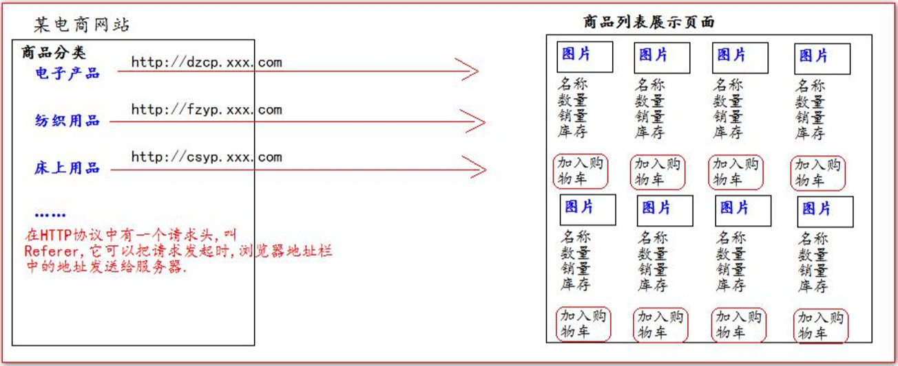

- index.jsp中增加class属性与自定义属性bookId，并给按钮绑上单击事件：

```jsp
<div class="book_add">
   <button bookId="${book.id}" class="addToCart">加入购物车</button>
</div>
```

```jsp
<script type="text/javascript">
   $(function () {
      //给加入购物车按钮绑定单击事件
      $("button.addToCart").click(function () {
         //this对象是当前正在响应事件的dom对象
         var bookId = $(this).attr("bookId");
         location.href = "${pageScope.basePath}cartServlet?action=addItem&id=" + bookId;
      })
   });
</script>
```


### 8.4 购物车展示

```jsp
<body>

   <div id="header">
         
         <span class="wel_word">购物车</span>
      <%--静态包含，登录成功之后的菜单--%>
      <%@include file="/pages/common/login_success_menu.jsp"%>
   </div>

   <div id="main">

      <table>

         <tr>
            <td>商品名称</td>
            <td>数量</td>
            <td>单价</td>
            <td>金额</td>
            <td>操作</td>
         </tr>
         <c:if test="${empty sessionScope.cart.items}">
            <tr>
               <td colspan="5"><a href="index.jsp">当前购物车为空！快去加购商品吧！</a></td>
            </tr>
         </c:if>
         <c:if test="${not empty sessionScope.cart.items}">
            <c:forEach items="${sessionScope.cart.items}" var="entry">
            <tr>
               <td>${entry.value.name}</td>
               <td>
                  <%--bookId是自定义属性--%>
                  <input class="updateCount" style="width: 80px"
                        bookId="${entry.value.id}"
                        type="text" value="${entry.value.count}">
               </td>
               <td>${entry.value.price}</td>
               <td>${entry.value.totalPrice}</td>
               <td><a class="deleteItemClass" href="cartServlet?action=deleteItem&id=${entry.value.id}">删除</a></td>
            </tr>
            </c:forEach>
         </c:if>

      </table>

      <c:if test="${not empty sessionScope.cart.items}">
      <div class="cart_info">
         <span class="cart_span">购物车中共有<span class="b_count">${sessionScope.cart.totalCount}</span>件商品</span>
         <span class="cart_span">总金额<span class="b_price">${sessionScope.cart.totalPrice}</span>元</span>
         <span class="cart_span"><a class="clearCartClass" href="cartServlet?action=clear">清空购物车</a></span>
         <span class="cart_span"><a href="pages/cart/checkout.jsp">去结账</a></span>
      </div>
      </c:if>

   </div>

   <%--静态包含页脚--%>
   <%@include file="/pages/common/foot.jsp"%>
</body>
```


### 8.5 删除购物车商品项

- CartServlet：

```java
protected void deleteItem(HttpServletRequest request, HttpServletResponse response) throws ServletException, IOException {
    //获取商品编号
    int id = WebUtils.parseInt(request.getParameter("id"), 0);
    //获取购物车对象
    Cart cart = (Cart) request.getSession().getAttribute("cart");
    if (cart != null) {
        //删除商品项
        cart.deleteItem(id);
    }
    //重定向回原来购物车展示页面
    response.sendRedirect(request.getHeader("Referer"));
}
```

- cart.jsp中增加class属性(多个删除在循环内)，并给链接绑上单击事件（确认删除）：

```jsp
<td><a class="deleteItemClass" href="cartServlet?action=deleteItem&id=${entry.value.id}">删除</a></td>
```

```js
//给删除商品绑上单击事件
$("a.deleteItemClass").click(function () {
   return confirm("你确定要删除【" + $(this).parent().parent().find("td:first").text() + "】吗？");
})
```


### 8.6 清空购物车

- CartServlet：

```java
protected void clear(HttpServletRequest request, HttpServletResponse response) throws ServletException, IOException {
    //获取购物车对象
    Cart cart = (Cart) request.getSession().getAttribute("cart");
    if (cart != null) {
        //清空购物车
        cart.clear();
    }
    //重定向回原来购物车展示页面
    response.sendRedirect(request.getHeader("Referer"));
}
```

- cart.jsp中增加id属性(一个清空购物车)，并给链接绑上单击事件（确认清空）：

```jsp
<span class="cart_span"><a class="clearCartClass" href="cartServlet?action=clear">清空购物车</a></span>
```

```js
//给清空购物车绑上单击事件
$("a.clearCartClass").click(function () {
   return confirm("你确定要清空购物车吗？");
})
```


### 8.7 修改购物车商品数量

- CartServlet：

```java
protected void updateCount(HttpServletRequest request, HttpServletResponse response) throws ServletException, IOException {
    //获取请求的参数：商品编号和商品数量
    int id = WebUtils.parseInt(request.getParameter("id"), 0);
    int count = WebUtils.parseInt(request.getParameter("count"), 1);
    //获取购物车对象
    Cart cart = (Cart) request.getSession().getAttribute("cart");
    if (cart != null) {
        //修改商品数量
        cart.updateCount(id, count);
    }
    //重定向回原来购物车展示页面
    response.sendRedirect(request.getHeader("Referer"));
}
```

- cart.jsp中增加class属性(多个课修改)，并给输入框绑上内容发生改变事件（文本变化）：

```jsp
<td>
   <%--bookId是自定义属性--%>
   <input class="updateCount" style="width: 80px"
         bookId="${entry.value.id}"
         type="text" value="${entry.value.count}">
</td>
```

```js
//给更改商品数量绑上onchange内容发生改变事件
$(".updateCount").change(function () {
   var name = $(this).parent().parent().find("td:first").text();
   var count = this.value;
   var id = $(this).attr(bookId);
   if (confirm("你确定要将【" + name + "】商品修改数量为：" + count + "吗？")) {
      //确认更改，发起请求给服务器保存修改
      location.href = "${pageScope.basePath}cartServlet?action=updateCount$count=" + count + "&id=" + id;
   } else {
      //取消更改输入框恢复原来的数量
      //defaultValue属性是表单项Dom对象的属性，表示默认的value属性值
      this.value = this.defaultValue;
   }
})
```


### 8.8 首页与购物车数据回显

- 在添加商品到购物车的时候，保存最后一个添加的商品名称（CartServlet中的addItem()）：

```java
//回显最后一个添加的商品名称
request.getSession().setAttribute("lastName", cartItem.getName());
```

```jsp
<div style="text-align: center">
   <%--如果购物车为空--%>
   <c:if test="${empty sessionScope.cart.items}">
      <span>欢迎您挑选商品...</span>
      <div>
         <span style="color: red">当前购物车为空！</span>
      </div>
   </c:if>
   <%--如果购物车不为空--%>
   <c:if test="${not empty sessionScope.cart.items}">
      <span>您的购物车中有${sessionScope.cart.totalCount}件商品</span>
      <div>
         您刚刚将<span style="color: red">${sessionScope.lastName}</span>加入到了购物车中
      </div>
   </c:if>
</div>
```


## 九、订单模块

### 9.1 订单模块分析

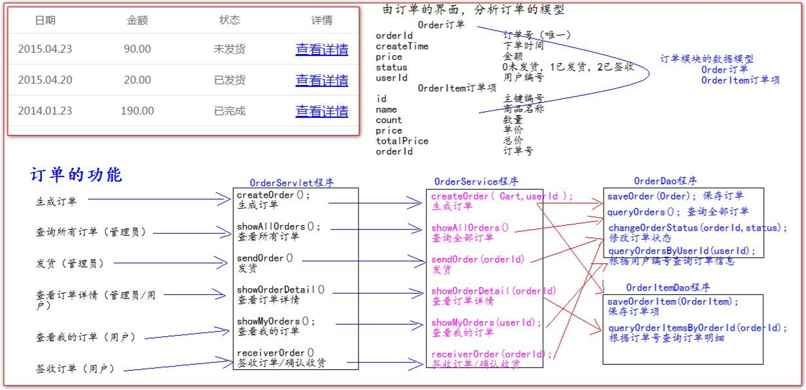


### 9.2 订单模块数据库表

```sql
use book;

create table t_order( 
    `order_id` varchar(50) primary key, 
    `create_time` datetime, 
    `price` decimal(11,2), `status` int, 
    `user_id` int, 
    foreign key(`user_id`) references t_user(`id`) 
);

create table t_order_item( 
    `id` int primary key auto_increment, 
    `name` varchar(100), 
    `count` int, 
    `price` decimal(11,2), 
    `total_price` decimal(11,2),
	`order_id` varchar(50), 
    foreign key(`order_id`) references t_order(`order_id`)
);

```


### 9.3 订单模块数据模型

```java
/** * 订 单 */ 
public class Order { 
    private String orderId; 
    private Date createTime; 
    private BigDecimal price; 
    // 0 未 发 货 ， 1 已 发 货 ， 2 表 示 已 签 收 
    private Integer status = 0; private Integer userId;
    //...
}

/** * 订 单 项 */ 
public class OrderItem { 
    private Integer id; 
    private String name; 
    private Integer count; 
    private BigDecimal price; 
    private BigDecimal totalPrice; 
    private String orderId;
    //...
}
```


### 9.4 订单模块Dao程序

以生成订单为例：

**OrderDao：**

```java
public interface OrderDao { public int saveOrder(Order order); }
```

**OrderDaoImpl：**

```java
public class OrderDaoImpl extends BaseDao implements OrderDao { 
    @Override 
    public int saveOrder(Order order) { 
        String sql = "insert into t_order(`order_id`,`create_time`,`price`,`status`,`user_id`) values(?,?,?,?,?)";

        return update(sql,order.getOrderId(),order.getCreateTime(),order.getPrice(),order.getStatus(),order.getUs erId()); 
    } 
}
```

**OrderItemDao：**

```java
public interface OrderItemDao { public int saveOrderItem(OrderItem orderItem); }
```

**OrderItemDaoImpl：**

```java
public class OrderItemDaoImpl extends BaseDao implements OrderItemDao {
    @Override
    public int saveOrderItem(OrderItem orderItem) {
        String sql = "insert into t_order_item(`name`,`count`,`price`,`total_price`,`order_id`) values(?,?,?,?,?)";
        return update(sql, orderItem.getName(), orderItem.getCount(), orderItem.getPrice(), orderItem.getTotalPrice(), orderItem.getOrderId());
    }
}
```


### 9.5 订单模块Service程序

以生成订单为例：

**OrderService：**

```java
public interface OrderService { public String createOrder(Cart cart, Integer userId); }
```

**OrderServiceImpl：**

```java
public class OrderServiceImpl implements OrderService {

    private OrderDao orderDao = new OrderDaoImpl();
    private OrderItemDao orderItemDao = new OrderItemDaoImpl();
    private BookDao bookDao = new BookDaoImpl();

    @Override
    public String createOrder(Cart cart, Integer userId) {
        //订单号的生成(唯一性 时间戳+用户id)
        String orderId = System.currentTimeMillis() + "" + userId;
        Order order = new Order(orderId, new Date(), cart.getTotalPrice(), 0, userId);
        //保存订单到数据库
        orderDao.saveOrder(order);
        //遍历购物车把每一个商品项转换为订单项保存到数据库
        for (Map.Entry<Integer, CartItem> entry : cart.getItems().entrySet()) {
            CartItem cartItem = entry.getValue();
            OrderItem orderItem = new OrderItem(null, cartItem.getName(), cartItem.getCount(), cartItem.getPrice(), cartItem.getTotalPrice(), orderId);
            orderItemDao.saveOrderItem(orderItem);
            //同时修改图书的销量与库存
            Book book = bookDao.queryBookById(cart.getTotalCount());
            book.setSales(book.getSales() + cartItem.getCount());
            book.setStock(book.getStock() - cartItem.getCount());
            bookDao.updateBook(book);
        }
        //生产订单后清空购物车
        cart.clear();
        //返回订单号
        return orderId;
    }
}
```

### 9.6 订单模块web层

以生成订单为例：

**OrderServlet：**

```java
public class OrderServlet extends BaseServlet {

    OrderService orderService = new OrderServiceImpl();

    /**
     * Description: 生产订单
     * @param request:
     * @param response:
     * @return void:
     */
    protected void createOrder(HttpServletRequest request, HttpServletResponse response) throws ServletException, IOException {
        //先获取Cart购物车对象
        Cart cart = (Cart) request.getSession().getAttribute("cart");
        //获取userId对象
        User user = (User) request.getSession().getAttribute("user");
        //检查是否登录
        if (user == null) {
            request.getRequestDispatcher("/pages/user/login.jsp").forward(request, response);
            return;
        }
        //调用createOrder方法（Cart，userId）
        String orderId = orderService.createOrder(cart, user.getId());
        //把订单号保存到session域中(请求转发才能保存到request域中)
        request.getSession().setAttribute("orderId", orderId);
        //重定向防止重复提交
        response.sendRedirect(request.getContextPath()+"/pages/cart/checkout.jsp");
    }
}
```

**修改 pages/cart/cart.jsp 页面，结账的请求地址：**

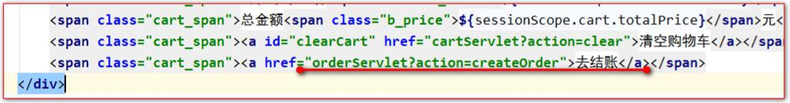

**修改 pages/cart/checkout.jsp 页面，输出订单号：**

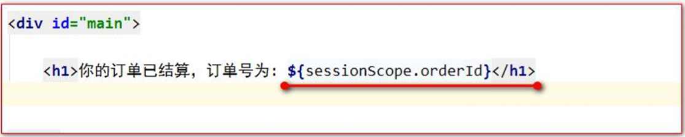


## 十、Filter过滤器和Ajax请求的应用

### 10.1 使用 Filter过滤器实现权限检查

使用 Filter 过滤器拦截/pages/manager/所有内容，实现权限检查，登录后才能访问

**Filter 代码：**

```java
public class ManagerFilter implements Filter {

    @Override
    public void init(FilterConfig filterConfig) throws ServletException {

    }

    @Override
    public void doFilter(ServletRequest servletRequest, ServletResponse servletResponse, FilterChain filterChain) throws IOException, ServletException {
        HttpServletRequest httpServletRequest = (HttpServletRequest) servletRequest;
        HttpSession session = httpServletRequest.getSession();
        Object user = session.getAttribute("user");
        // 如果等于 null，说明还没有登录
        if (user == null) {
            servletRequest.getRequestDispatcher("pages/user/login.jsp").forward(servletRequest,servletResponse);
            return;
        } else {
            // 让程序继续往下访问用户的目标资源
            filterChain.doFilter(servletRequest,servletResponse);
        }
    }

    @Override
    public void destroy() {

    }
}
```

**web.xml 中的配置：**

```xml
<filter> 
    <filter-name>ManagerFilter</filter-name> 
    <filter-class>com.atguigu.filter.ManagerFilter</filter-class> 
</filter> 
<filter-mapping> 
    <filter-name>ManagerFilter</filter-name> 
    <url-pattern>/pages/manager/*</url-pattern>
	<url-pattern>/manager/bookServlet</url-pattern> 
</filter-mapping>
```


### 10.2 使用 Filter 和 ThreadLocal 组合管理事务

使用 ThreadLocal 来确保所有 dao 操作都在同一个 Connection 连接对象中完成

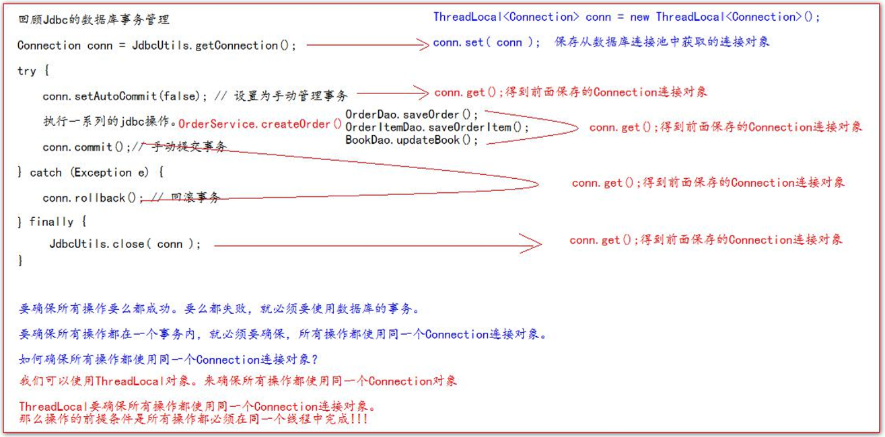

JdbcUtils 工具类的修改（）：

- 1.在获取连接时将连接保存到ThreadLocal对象中，供后面的jdbc操作使用（**保证所有 dao 操作都在同一个 Connection 连接对象中完成**），同时设置为手动管理事务

- 2.用提交事务并关闭连接和回滚事务并释放连接来替代之前的关闭连接

```java
public class JDBCUtils {

    private static DataSource dataSource;
    public static ThreadLocal<Connection> conns = new ThreadLocal<>();

    static {
        try {
            //读取配置文件
            Properties properties = new Properties();
            properties.load(JDBCUtils.class.getClassLoader().getResourceAsStream("jdbc.properties"));
            //创建数据库连接池
            dataSource = DruidDataSourceFactory.createDataSource(properties);

        } catch (Exception e) {
            e.printStackTrace();
        }
    }


    /**
     * @param :
     * @return java.sql.Connection:如果返回null说明获取连接失败<br/>有值获取成功
     * @Description: 获取连接
     */
    public static Connection getConnection() {

        Connection conn = conns.get();
        if (conn == null) {
            try {
                //从数据库连接池获取连接
                conn = dataSource.getConnection();
                //保存到ThreadLocal对象中，供后面的jdbc操作使用
                conns.set(conn);
                //设置为手动管理事务
                conn.setAutoCommit(false);
            } catch (SQLException throwables) {
                throwables.printStackTrace();
            }
        }


        return conn;
    }

    /**
     * Description: 提交事务并关闭连接
     * @param :
     * @return void:
     */
    public static void commitAndClose() {
        Connection connection = conns.get();
        if (connection != null) {
            //不为空，之前使用过连接
            try {
                //提交事务
                connection.commit();
            } catch (SQLException throwables) {
                throwables.printStackTrace();
            } finally {
                try {
                    //关闭连接
                    connection.close();
                } catch (SQLException throwables) {
                    throwables.printStackTrace();
                }
            }
        }
        //一定要执行remove操作（Tomcat底层使用了线程池技术）
        conns.remove();
    }

    /**
     * Description: 回滚事务并释放连接
     * @param :
     * @return void:
     */
    public static void rollbackAndClose() {
        Connection connection = conns.get();
        if (connection != null) {
            //不为空，之前使用过连接
            try {
                //回滚事务
                connection.rollback();
            } catch (SQLException throwables) {
                throwables.printStackTrace();
            } finally {
                try {
                    //关闭连接
                    connection.close();
                } catch (SQLException throwables) {
                    throwables.printStackTrace();
                }
            }
        }
        //一定要执行remove操作（Tomcat底层使用了线程池技术）
        conns.remove();
    }

    /**
     * @param conn:
     * @return void:
     * @Description: 关闭连接，放回数据库连接池
     */
/*    public static void close(Connection conn) {
        if (conn != null) {
            try {
                conn.close();
            } catch (SQLException throwables) {
                throwables.printStackTrace();
            }
        }

    }*/
}
```

修改 BaseDao，把异常层层外抛（—Service层—Servlet层）直到Filter过滤器 ：

```java
public abstract class BaseDao {

    //使用DBUtils操作数据库
    private QueryRunner queryRunner = new QueryRunner();


    /**
     * @param sql:
     * @param args:
     * @return int: 返回-1表示执行失败<br/>返回其他表示影响的行数
     * @Description: 用来执行Insert、Update、Delete
     */
    public int update(String sql, Object... args) {

        Connection conn = JDBCUtils.getConnection();
        try {
            return queryRunner.update(conn, sql, args);
        } catch (SQLException throwables) {
            throwables.printStackTrace();
            //把异常抛给Filter过滤器
            throw new RuntimeException(throwables);
        }
    }


    /**
     * @param type:
     * @param sql:
     * @param args:
     * @return java.lang.Object: 返回一个JavaBean
     * @Description:
     */
    public <T> T queryForOne(Class<T> type, String sql, Object... args) {

        Connection conn = JDBCUtils.getConnection();
        try {
            return queryRunner.query(conn, sql, new BeanHandler<T>(type), args);
        } catch (SQLException throwables) {
            throwables.printStackTrace();
            throw new RuntimeException(throwables);
        }
    }


    /**
     * @param type: 
     * @param sql: 
     * @param args: 
     * @return java.util.List<T>: 返回多个JavaBean
     * @Description: 
     */
    public <T> List<T> queryForList(Class<T> type, String sql, Object... args) {

        Connection conn = JDBCUtils.getConnection();
        try {
            return queryRunner.query(conn, sql, new BeanListHandler<T>(type), args);
        } catch (SQLException throwables) {
            throwables.printStackTrace();
            throw new RuntimeException(throwables);
        }
    }

    /**
     * @param sql:
     * @param args:
     * @return java.lang.Object: 返回一行一列的查询
     * @Description:
     */
    public Object queryForSingleValue(String sql, Object... args) {

        Connection conn = JDBCUtils.getConnection();
        try {
            return queryRunner.query(conn, sql, new ScalarHandler(), args);
        } catch (Exception e) {
            e.printStackTrace();
            throw new RuntimeException(e);
        }
    }
}
```

使用 Filter 过滤器统一给所有的 Service 方法都加上 try-catch：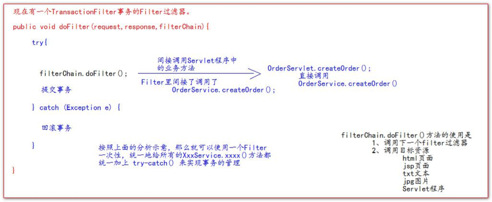

```java
public class TransactionFilter implements Filter {
    @Override
    public void init(FilterConfig filterConfig) throws ServletException {

    }

    @Override
    public void doFilter(ServletRequest servletRequest, ServletResponse servletResponse, FilterChain filterChain) throws IOException, ServletException {
        try {
            //
            filterChain.doFilter(servletRequest, servletResponse);
            //提交事务
            JDBCUtils.commitAndClose();
        } catch (Exception e) {
            //回滚事务
            JDBCUtils.rollbackAndClose();
            e.printStackTrace();
            //最终把异常抛给Tomcat服务器
            throw new RuntimeException(e);
        }
    }

    @Override
    public void destroy() {

    }
}
```

Filter 过滤器在 web.xml 中的配置： 

```xml
<!--filter 标签用于配置一个 Filter 过滤器-->
<filter>
    <!--给 filter 起一个别名-->
    <filter-name>TransactionFilter</filter-name>
    <!--配置 filter 的全类名-->
    <filter-class>com.filter.TransactionFilter</filter-class>
</filter>
<!--filter-mapping 配置 Filter 过滤器的拦截路径-->
<filter-mapping>
    <!--filter-name 表示当前的拦截路径给哪个 filter 使用-->
    <filter-name>TransactionFilter</filter-name>
    <!--/*表示工程下的所有请求-->
    <url-pattern>/*</url-pattern>
</filter-mapping>
```

 BaseServlet 中的异常往外抛给 Filter 过滤器，Filter过滤器再抛给Tomcat服务器：

```java
public abstract class BaseServlet extends HttpServlet {

    protected void doGet(HttpServletRequest request, HttpServletResponse response) throws ServletException, IOException {
        doPost(request,response);
    }


    @Override
    protected void doPost(HttpServletRequest request, HttpServletResponse response) throws ServletException, IOException {
        request.setCharacterEncoding("UTF-8");
        response.setContentType("text/html; charset=UTF-8");

        String action = request.getParameter("action");

        try {
            //获取action字符串鉴别业务，获取相应的业务方法反射对象
            Method method = this.getClass().getDeclaredMethod(action, HttpServletRequest.class, HttpServletResponse.class);
            //调用目标业务方法
            method.invoke(this, request, response);
        } catch (Exception e) {
            e.printStackTrace();
            //把异常抛给Filter过滤器
            throw new RuntimeException(e);
        }
    }
}
```

将所有异常都统一交给 Tomcat，让 Tomcat 展示友好的错误信息页面，在web.xml中配置：

```xml
<!--error-page 标签配置，服务器出错之后，自动跳转的页面-->
<error-page>
    <!--error-code 是错误类型-->
    <error-code>500</error-code>
    <!--location 标签表示。要跳转去的页面路径-->
    <location>/pages/error/error500.jsp</location>
</error-page>
<!--error-page 标签配置，服务器出错之后，自动跳转的页面-->
<error-page>
    <!--error-code 是错误类型-->
    <error-code>404</error-code>
    <!--location 标签表示。要跳转去的页面路径-->
    <location>/pages/error/error404.jsp</location>
</error-page>
```


### 10.3 使用 AJAX 验证用户名是否可用

- 用于取代点击注册按钮后在Servlet程序中判断用户名是否可用

- 使用 AJAX 验证用户名是否可用可以在username输入框失去焦点事件后，通过Ajax请求来进行用户名是否可用提示的局部更新

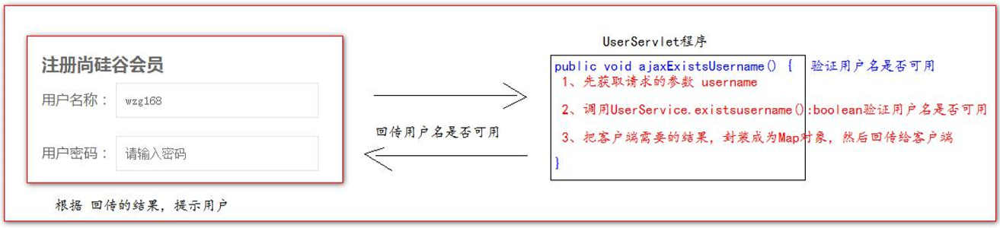

regist.jsp 页面中的代码：

```javascript
//使用 AJAX 验证用户名是否可用（比loginServlet更好）
//失去焦点事件
$("#username").blur(function () {
   //1 用户名
   var username = this.value;
   $.getJSON("${basePath}userServlet", "action=ajaxExistsUsername&username=" + username, function (data) {
      if (data.existsUsername) {
         $("span.errorMsg").text("用户名已存在！");
      } else {
         $("span.errorMsg").text("用户名可用！");
      }
   });
});
```

UserServlet 程序中 ajaxExistsUsername 方法：

```java
protected void ajaxExistsUsername(HttpServletRequest request, HttpServletResponse response) throws ServletException, IOException {
    //获取请求的参数
    String username = request.getParameter("username");
    //判断用户名是否可用
    boolean existsUsername = userService.existsUsername(username);
    //把返回的结果封装为Map对象
    Map<String, Object> resultMap = new HashMap<>();
    resultMap.put("existsUsername", existsUsername);
    //转化为json对象
    Gson gson = new Gson();
    String json = gson.toJson(resultMap);
    //把结果发送给客户端
    response.getWriter().write(json);
}
```


### 10.4 使用 AJAX 修改把商品添加到购物车

在点击加入购物车按钮后，通过Ajax请求来进行购物车商品数量和最后添加的商品名称的局部更新

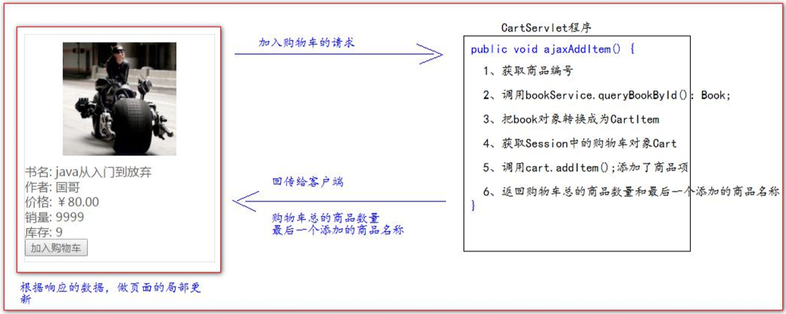

jsp页面的javaScript 代码：

```JavaScript
<Script type="text/javascript"> 
    $(function () { 
    	// 给 加 入 购 物 车 按 钮 绑 定 单 击 事 件 
    	$("button.addToCart").click(function () { 
            //在 事 件 响 应 的 function 函 数 中 ， 有 一 个 this对 象 ， 这 个 this对 象 ，是 当 前 正 在 响 应 事 件 的 dom对 象
            var bookId = $(this).attr("bookId"); 
            // location.href = "http://localhost:8080/book/cartServlet?action=addItem&id=" + bookId;
			//发 ajax请 求 ， 添 加 商 品 到 购 物 车
            $.getJSON("http://localhost:8080/book/cartServlet","action=ajaxAddItem&id=" + bookId,function (data) { 
                $("#cartTotalCount").text("您的购物车中有 " + data.totalCount + " 件商品"); 
                $("#cartLastName").text(data.lastName); 
            }) 
        }); 
	}); 
</Script>
```

CartServlet 程序：

```java
protected void ajaxAddItem(HttpServletRequest request, HttpServletResponse response) throws ServletException, IOException {
    //获取请求的参数：商品编号
    int id = WebUtils.parseInt(request.getParameter("id"), 0);
    //调用bookService.queryBookById()得到Book对象
    Book book = bookService.queryBookById(id);
    //把Book对象转化为CartItem对象
    CartItem cartItem = new CartItem(book.getId(), book.getName(), 1, book.getPrice(), book.getPrice());
    //调用Cart.addItem()添加商品
    Cart cart = (Cart) request.getSession().getAttribute("cart");
    if (cart == null) {
        cart = new Cart();
        request.getSession().setAttribute("cart", cart);
    }
    cart.addItem(cartItem);
    //JSON返回购物车商品数量和最后一个添加的商品名称
    Map<String, Object> resultMap = new HashMap<>();
    resultMap.put("totalCount", cart.getTotalCount());
    resultMap.put("lastName", cartItem.getName());
    Gson gson = new Gson();
    String toJson = gson.toJson(resultMap);
    response.getWriter().write(toJson);
}
```

pages/client/index.jsp ：

```jsp
<div style="text-align: center"> 
    <c:if test="${empty sessionScope.cart.items}"> 
        <%-购 物 车 为 空 的 输 出 --%> 
        <span id="cartTotalCount"> </span> 
        <div> 
            <span style="color: red" id="cartLastName">当前购物车为空</span> 
        </div> 
    </c:if> 
    <c:if test="${not empty sessionScope.cart.items}"> 
        <%-购 物 车 非 空 的 输 出 --%> 
        <span id="cartTotalCount">
            您的购物车中有 ${sessionScope.cart.totalCount} 件商品
        </span> 
        <div> 
            您刚刚将<span style="color: red" id="cartLastName">
            ${sessionScope.lastName}
            </span>加入到了购 物车中 
        </div> 
    </c:if> 
</div>

```

