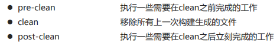

## 一、Maven简介与基础概念

### 1.1 简介

Maven本质是一个项目管理工具，将项目开发和管理过程抽象为一个项目对象模型（POM-Project Object Model）。


- 作用：
  - 项目构建：提供标准的、跨平台的自动化项目构建方式
  - 依赖管理：方便快捷的管理项目依赖的资源（jar包），避免资源间的版本冲突问题
  - 统一开发结构：提供标准的、统一的项目结构


### 1.2 下载安装

- 属于绿色版软件，解压即安装
- 环境变量（系统变量）配置：
  - 依赖Java，需要配置 JAVA—HOME
    - E:\Program Files\Java\jdk1.8.0_281
    - %JAVA_HOME%\bin
  - 设置MAVEN自身的运行环境，需要配置MAVEN_HOME和path
    - E:\Program Files\Java\apache-maven-3.6.1
    - %MAVEN_HOME%\bin
  - 测试环境配置结果：DOS命令行输入MVN


### 1.3 基础概念

#### 1.3.1 仓库

用于存储资源，包含各种jar包仓库分类

- 本地仓库：自己电脑上存储资源的仓库，连接远程仓库获取资源远程仓库：非本机电脑上的仓库，为本地仓库提供资源
- 中央仓库：Maven团队维护，存储所有资源的仓库
- 私服：部门／公司范围内存储资源的仓库，从中央仓库获取资源：
  - 保存具有版权的资源，包含购买或自主研发的jar
  - 中央仓库中的jar都是开源的，不能存储具有版权的资源
  - 一定范围内共享资源，仅对内部开放，不对外共享


#### 1.3.2 坐标

Maven中的坐标用于描述仓库中资源的位置（https://repo1.maven.org/maven2/）

- Maven坐标主要组成
  - groupld：定义当前Maven项目隶属组织名称（通常是域名反写，例如：org.mybatis） 
  - artifactld：定义当前Maven项目名称（通常是模块名称，例如CRM、SMS）
  - version：定义当前项目版本号
  - ***packaging：定义该项目的打包方式
- Maven坐标的作用：
  - 使用唯一标识，唯一性定位资源位置，通过该标识可以将资源的识别与下载工作交由机器完成


#### 1.3.3 仓库与项目属性配置

- 本地仓库配置（资源下到哪）—在Maven的settings.xml文件中配置：

  - 默认位置—为登录用户名所在目录下的.m2文件夹：

    ```xml
    <localRepository>${user.home}/.m2/repository</localRepository>
    ```

  - 自定义位置—在Maven的settings.xml文件中配置：

    ```xml
    <localRepository>E:\OneDrive - zju.edu.cn\Java\00_maven_repository</localRepository>
    ```

- 远程仓库配置（Maven默认连接的仓库位置）：

  ```xml
  <repositories>
  	<repository>
  		<id>central</id>
  		<name>Central Repository</name>
  		<url>https://repo.maven.apache.org/maven2</url>
  		<layout>default</layout>
  		<snapshots>
  			<enabled>false</enabled>
  		</snapshots>
  	</repository>
  </repositories>
  ```

- 镜像仓库配置（资源从哪来）—在Maven的settings.xml文件中配置阿里云镜像仓库：

  ```xml
  <mirrors>
  	<mirror>
        <!--镜像的唯一标识符-->
        <id>nexus-aliyun</id>
        <!--对central仓库镜像镜像-->
        <mirrorOf>central</mirrorOf>
        <!--镜像名称-->
        <name>Nexus aliyun</name>
        <!--镜像URL-->
        <url>http://maven.aliyun.com/nexus/content/groups/public</url>
      </mirror>
  </mirrors>
  ```

- Maven项目属性配置—在Maven的settings.xml文件中配置：

  ```xml
  <!-- 让idea的maven项目-pom.xml文件变成jdk1.8的配置 -->
  <profile>
    <id>jdk-1.8</id>
    <activation>
      <activeByDefault>true</activeByDefault>
      <jdk>1.8</jdk>
    </activation>
    <properties>
      <maven.compiler.source>1.8</maven.compiler.source>
      <maven.compiler.target>1.8</maven.compiler.target>
      <maven.compiler.compilerVersion>1.8</maven.compiler.compilerVersion>
      <!--项目统一字符集编码-->
      <project.build.sourceEncoding>UTF-8</project.build.sourceEncoding>
    </properties>
  </profile>
  ```


## 二、IDEA生成Maven项目

### 2.1 Maven工程目录结构与配置

- Maven工程目录结构（web和java工程）：


- 配置Maven：

  


### 2.2 创建项目

- 手工创建：


- 原型创建Java项目：


- 原型创建Web工程：


### 2.3 Maven项目构建命令与插件


tomcat7插件在pom.xml中的配置：

```xml
<!--构建-->
<build>
  <!--设置插件-->
  <plugins>
    <!--具体的插件-->
    <plugin>
      <groupId>org.apache.tomcat.maven</groupId>
      <artifactId>tomcat7-maven-plugin</artifactId>
      <version>2.1</version>
      <configuration>
        <port>80</port>
        <path>/web0101</path>
      </configuration>
    </plugin>
  </plugins>
</build>
```


## 三、依赖管理

### 3.1 依赖配置

依赖指当前项目运行所需的jar包，在pom.xml文件中的配置为：

```xml
<!--设置当前工程的所有依赖-->
<dependencies>
  <!--具体的依赖-->
  <dependency>
    <!--依赖所属群组ID-->
    <groupId>junit</groupId>
    <!--依赖所属项目ID-->
    <artifactId>junit</artifactId>
    <!--依赖版本号-->
    <version>4.11</version>
  </dependency>

  <dependency>
    <groupId>log4j</groupId>
    <artifactId>log4j</artifactId>
    <version>1.2.12</version>
  </dependency>
</dependencies>
```


### 3.2 依赖传递

- 依赖具有传递性：如当前Module可以把其他Module当作资源建立依赖关系

  （都有<groupId>、<artifactId>、<version>三个属性）

  - 直接依赖：在当前项目中通过依赖配置建立的依赖关系
  - 间接依赖：被依赖的资源如果依赖其他资源，当前项目间接依赖其他资源

- 依赖传递冲突问题

  - 路径优先:当依赖中现相同的资源时，层级越深，优先级越低，层级越浅，优先级越高
  - 声明优先:当资源在相同层级被依赖时，配置顺序靠前的覆盖配置顺序靠后的
  - 特殊优先:当同级配置了相同资源的不同版本，后配置的覆盖先配置的

  


### 3.3 可选依赖

可选依赖指对外隐藏当前所依赖的资源——不透明

<optional>true</optional>

```xml
<dependency>
	<groupId>junit</groupId>
	<artifactId>junit</artifactId>
	<version>4.12</version>
	<optional>true</optional>
</dependency>
```


### 3.4 排除依赖

排除依赖指主动断开依赖的资源——不需要

<exclusions></exclusions>

```xml
<dependency>
	<groupId>junit</groupId>
	<artifactId>junit</artifactId>
	<version>4.12</version>
	<exclusions>
		<exclusion>
			<groupId>org.hamcrest</groupId>
			<artifactId>hamcrest-core</artifactId>
		</exclusion>
	</exclusions>
</dependency>
```


### 3.5 依赖范围

依赖的jar包默认情况可以在任何地方使用，可以通过 Scope标签设定其作用范围

作用范围：

- 主程序范围有效(main文件夹范围内)
- 测试程序范有效(tes文件夹范围内)
- 是否参与打包( package指令范围内)

```xml
<dependency>
	<groupId>junit</groupId>
	<artifactId>junit</artifactId>
	<version>4.12</version>
	<scope>test</scope>
</dependency>
```


- 依赖范围传递性：


## 四、生命周期与插件

- Maven构建生命周期描述的是一次构建过程经历的事件：


- Maven对项目构建的生命周期分为三套，各个阶段是有先后顺序的，后一个阶段任务的执行依赖于前一个阶段任务已经完成：

  - clean：清理工作

  

  - default：核心工作，例如编译、测试、打包、部署等

  

  - site：产生报告，发布站点等

  

- 插件：

  - Maven的生命周期是抽象的，各阶段的工作实际是通过Maven插件去执行完成的。在一个Maven插件中，其可以具备多个功能

  - 插件与生命周期內的阶段绑定，在执行到对应生命周期时执行对应的插件功能

  - 默认 Maven在各个生命周期上绑定有预设的功能

    

  - 通过插件可以自定义其他功能

    例如配置一个任务，将maven-source-plugin插件的目标 jar（打包成jar包，web工程则应该打包成war）与default生命周期的generate-test-resources阶段进行绑定。

    多个插件目标被绑定到生命周期的同一个阶段时，其执行顺序将由其插件目标的声明顺序决定。

    ```xml
    <build>
    	<plugins>
    		<plugin>
    			<groupId>org.apache.maven.plugins</groupId>
    			<artifactId>maven-source-plugin</artifactId>
    			<version>2.2.1</version>
    			<executions>
    				<execution>
    					<goals>
    						<goal>jar</goal>
    					</goals>
    					<phase>generate-test-resources</phase>
    				</execution>
    			</executions>
    		</plugin>
    	</plugins>
    </build>
    ```

  

  

