## 一、Spring

### 1.1 Spring简介

#### 1.1.1 Spring是什么

- Spring是分层的 Java SE/EE应用 full-stack 轻量级开源框架，以 **IoC（Inverse Of Control：反转控制）**和 **AOP（Aspect Oriented Programming：面向切面编程）**为内核。
- 控制反转是把传统上由程序代码直接操控的对象的调用权交给容器，通过容器来实现对象组件的装配和管理。所谓的"控制反转"就是对组件对象控制权的转移，从程序代码本身转移到了外部容器，由容器来创建对象并管理对象之间的依赖关系。
- DI（Dependency Injection）叫依赖注入，是对IoC更简单的诠释。依赖注入的基本原则是应用组件不应该负责查找资源或者其他依赖的协作对象。配置对象的工作应该由容器负责，查找资源的逻辑应该从应用组件的代码中抽取出来，交给容器来完成。即**组件之间的依赖关系由容器在运行期决定**。
- 提供了**展现层 SpringMVC** 和**持久层 Spring JDBCTemplate** 以及**业务层事务管理**等众多的企业级应用技术，还能整合开源世界众多著名的第三方框架和类库，逐渐成为使用最多的Java EE 企业应用开源框架。
- 2017  年 9 月份发布了 Spring 的最新版本 Spring5.0 通用版（GA）


#### 1.1.2 Spring的优势

1）方便解耦，简化开发
     通过 Spring 提供的 IoC容器，可以将对象间的依赖关系交由 Spring 进行控制，避免硬编码所造成的过度耦合。
     用户也不必再为单例模式类、属性文件解析等这些很底层的需求编写代码，可以更专注于上层的应用。

2）AOP 编程的支持
     通过 Spring的 AOP 功能，方便进行面向切面编程，许多不容易用传统 OOP 实现的功能可以通过 AOP 轻松实现。

3）声明式事务的支持
     可以将我们从单调烦闷的事务管理代码中解脱出来，通过声明式方式灵活的进行事务管理，提高开发效率和质量。

4）方便程序的测试
     可以用非容器依赖的编程方式进行几乎所有的测试工作，测试不再是昂贵的操作，而是随手可做的事情。

5）方便集成各种优秀框架
     Spring对各种优秀框架（Struts、Hibernate、Hessian、Quartz等）的支持。

6）降低 JavaEE API 的使用难度
     Spring对 JavaEE API（如 JDBC、JavaMail、远程调用等）进行了薄薄的封装层，使这些 API 的使用难度大为降低。

7）Java 源码是经典学习范例
     Spring的源代码设计精妙、结构清晰、匠心独用，处处体现着大师对Java 设计模式灵活运用以及对 Java技术的高深造诣。它的源代码无意是 Java 技术的最佳实践的范例。


#### 1.1.3 Spring的体系结构

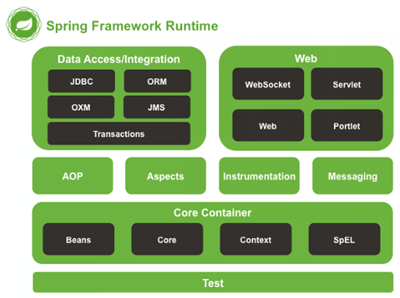


### 1.2 Spring快速入门

#### 1.2.1 Spring的开发步骤

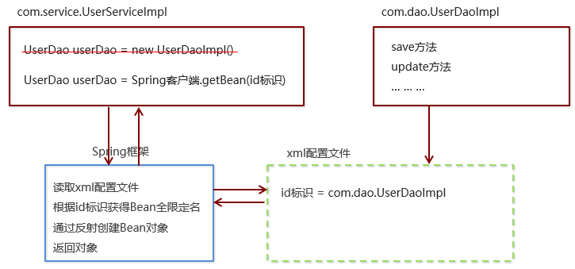

- ①导入 Spring 开发的基本包坐标
- ②编写 Dao 接口和实现类
- ③创建 Spring 核心配置文件并在配置文件中配置 UserDaoImpl
- ④使用 Spring 的 API 获得 Bean 实例


#### 1.2.2 导入Spring开发的基本包坐标

在pom.xml文件中：

```xml
<dependencies>
    <dependency>
      <groupId>org.springframework</groupId>
      <artifactId>spring-context</artifactId>
      <version>5.0.5.RELEASE</version>
    </dependency>
</dependencies>
```


#### 1.2.3 编写Dao接口和实现类

```java
public interface UserDao {   
    public void save();
}

public class UserDaoImpl implements UserDao {    
    @Override   
    public void save() {     
        System.out.println("UserDao save method running...."); 
    }
}
```


#### 1.2.4 创建Spring核心配置文件

在类路径下（resources）创建applicationContext.xml配置文件并配置配置UserDaoImpl

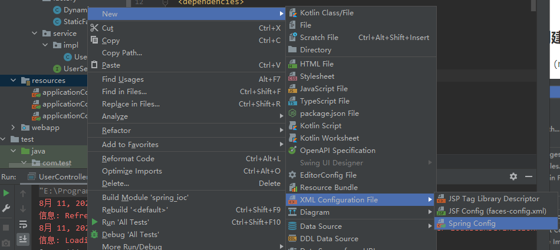

```xml
<!--applicationContext.xml-->
<?xml version="1.0" encoding="UTF-8" ?>
<beans xmlns="http://www.springframework.org/schema/beans"         		
       xmlns:xsi="http://www.w3.org/2001/XMLSchema-instance"           
       xsi:schemaLocation="
                 http://www.springframework.org/schema/beans  
                 http://www.springframework.org/schema/beans/spring-beans.xsd"> 
    
    <bean id="userDao" class="com.dao.impl.UserDaoImpl"></bean>

</beans>
```


#### 1.2.5 使用Spring的API获得Bean实例

```java
@Test
public void test1() {
    ApplicationContext app = new 		ClassPathXmlApplicationContext("applicationContext.xml");
    //getBean(id)/参数是在xml配置文件中的id，唯一标识
    UserDao userDao = (UserDao) app.getBean("userDao");
    userDao.save();
}
```


### 1.3 Spring配置文件

#### 1.3.1 Bean标签基本配置

- 用于配置对象交由**Spring** 来创建。默认情况下它调用的是类中的**无参构造函数**，如果没有无参构造函数则不能创建成功。

- 基本属性：

  - ```xml
    <bean id="userDao" class="com.dao.impl.UserDaoImpl"></bean>
    ```

  - **id**：Bean实例在Spring容器中的唯一标识

  - **class**：Bean的全限定名称


#### 1.3.2 Bean标签范围配置 

- scope：指对象的作用范围，取值如下： 

| **取值范围**   | **说明**                                                     |
| -------------- | ------------------------------------------------------------ |
| **singleton**  | **默认值，单例的**                                           |
| **prototype**  | **多例的**                                                   |
| request        | WEB  项目中，Spring  创建一个  Bean  的对象，将对象存入到  request  域中 |
| session        | WEB  项目中，Spring  创建一个  Bean  的对象，将对象存入到  session  域中 |
| global session | WEB  项目中，应用在  Portlet  环境，如果没有  Portlet  环境那么globalSession  相当于  session |

- 1）当scope的取值为singleton（**默认**）时
  - Bean的实例化个数：1个
  - Bean的实例化时机：当Spring核心文件被加载时(即创建ApplicationContext对象时)，实例化配置的Bean实例
  - Bean的生命周期：
    - 对象创建：当应用加载，创建容器时，对象就被创建了
    - 对象运行：只要容器在，对象一直活着
    - 对象销毁：当应用卸载，销毁容器时，对象就被销毁了

```xml
<bean id="userDao" class="com.dao.impl.UserDaoImpl" scope="singleton"></bean>
```

- 2）当scope的取值为prototype时
  - Bean的实例化个数：多个
  - Bean的实例化时机：当调用getBean()方法时实例化Bean
  - Bean的生命周期：
    - 对象创建：当使用对象时，创建新的对象实例
    - 对象运行：只要对象在使用中，就一直活着
    - 对象销毁：当对象长时间不用时，被 Java 的垃圾回收器回收了

```xml
<bean id="UserDao" class="com.dao.impl.UserDaoImpl" scope="prototype"></bean>
```


#### 1.3.3 Bean生命周期配置

- **init-method**：指定类UserDaoImpl中的初始化方法名称，当Bean实例化时，调用类UserDaoImpl中的名为init的方法

```xml
<bean id="userDao" class="com.dao.impl.UserDaoImpl" init-method="init"></bean>
```

- **destroy-method**：指定类UserDaoImpl中销毁方法名称，当Bean实例化时，调用类UserDaoImpl中的名为destroy的方法

```xml
<bean id="userDao" class="com.dao.impl.UserDaoImpl" init-method="destroy"></bean>
```


#### 1.3.4 Bean实例化三种方式

- 无参**构造**方法实例化

  它会根据默认无参构造方法来创建类对象，如果bean(UserDaoImpl)中没有默认无参构造函数，将会创建失败

```xml
<bean id="userDao" class="com.dao.impl.UserDaoImpl"></bean>
```

- 工厂**静态**方法实例化

  工厂的静态方法返回Bean实例

```java
//com.factory.StaticFactoryBean类
public class StaticFactoryBean {
    public static UserDao createUserDao(){
        return new UserDaoImpl();
    }
}
```

```xml
<bean id="userDao" class="com.factory.StaticFactoryBean" 
      factory-method="createUserDao" />
```

- 工厂**实例**方法实例化 

  工厂的非静态方法返回Bean实例

```java
//com.factory.DynamicFactoryBean类
public class DynamicFactoryBean {
    public UserDao createUserDao(){
        return new UserDaoImpl();
    }
}
```

```xml
<bean id="factoryBean" class="com.factory.DynamicFactoryBean"/>
<bean id="userDao" factory-bean="factoryBean" factory-method="createUserDao"/>
```


#### 1.3.5 Bean的依赖注入概念

- 目前UserService实例和UserDao实例都存在与Spring容器中，当前的做法是在容器外部获得UserService实例和UserDao实例，然后在程序中进行结合。

  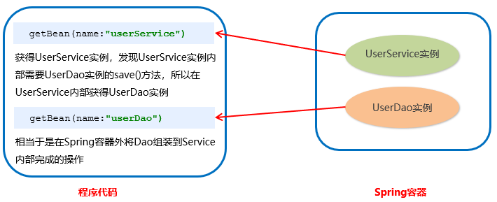

- 因为UserService和UserDao都在Spring容器中，而最终程序直接使用的是UserService，所以可以在Spring容器中，将UserDao设置到UserService内部。

  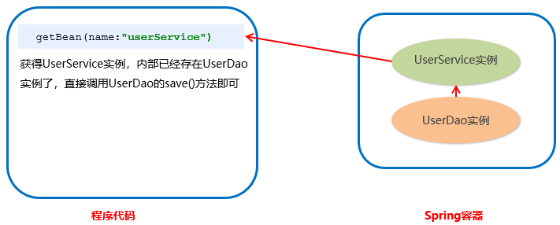

- 注入依赖分析
  - 依赖注入（**Dependency Injection**）：它是 Spring 框架核心 IOC 的具体实现。
  - 在编写程序时，通过控制反转，把对象的创建交给了 Spring，但是代码中不可能出现没有依赖的情况。IOC 解耦只是降低他们的依赖关系，但不会消除。例如：业务层仍会调用持久层的方法。
  - 那这种业务层和持久层的依赖关系，在使用 Spring 之后，就让 Spring 来维护了。简单的说，就是坐等框架把持久层对象传入业务层，而不用我们自己去获取。
  - **在UserServiceImpl中添加私有属性：UserDao的实现类（引用数据类型），但并不实例化，而在applicationContext.xml中以set方法或者构造器方法把userDao这个Bean注入到userService这个Bean中，同理，在UserServiceImpl中添加私有属性普通数据类型或者集合类型，都可以同样方式进行依赖注入。**


#### 1.3.6 Bean的依赖注入方式

- set方法注入：

  - 在UserServiceImpl中添加setUserDao方法

  ```java
  public class UserServiceImpl implements UserService {
      
      //之前此处是直接new一个UserDao对象
      //或者调用getBean(userDao)
      private UserDao userDao;   
      
      public void setUserDao(UserDao userDao) {        
          this.userDao = userDao;    
      } 
      
      @Override    
      public void save() {        
          userDao.save();    
      }
  }
  ```
  - 配置Spring容器调用set方法进行注入

  ```xml
  <bean id="userDao" class="com.dao.impl.UserDaoImpl"/>
  
  <bean id="userService" class="com.service.impl.UserServiceImpl">
      <!--name指的是UserServiceImpl类中(set)UserDao(这个属性)方法首字母改小写，ref指的是Spring容器中的userDao-->
      <property name="userDao" ref="userDao"/>
  </bean>
  ```

  - P命名空间注入本质也是set方法注入，但比起上述的set方法注入更加方便，主要体现在配置文件中

  ```xml
  <!--首先，需要引入P命名空间-->
  xmlns:p="http://www.springframework.org/schema/p"
  <!--其次，需要修改注入方式-->
  <bean id="userService" class="com.service.impl.UserServiceImpl" p:userDao-
   ref="userDao"/>
  ```

- 构造方法注入

  - 创建有参构造

  ```java
  public class UserServiceImpl implements UserService {
  
      private UserDao userDao;
  
      public UserServiceImpl() {
      }
  
      public UserServiceImpl(UserDao userDao) {
          this.userDao = userDao;
      }
  
  }
  ```

  - 配置Spring容器调用有参构造时进行注入

  ```xml
  <bean id="userDao" class="com.dao.impl.UserDaoImpl"/>
  
  <bean id="userService" class="com.itheima.service.impl.UserServiceImpl">
      <!--name指的是UserServiceImpl类中userDao属性(构造器构造)，ref指的是Spring容器中的userDao-->
      <constructor-arg name="userDao" ref="userDao"></constructor-arg>
  </bean>
  ```

  

#### 1.3.7 Bean的依赖注入的数据类型

- **普通数据类型**(set方法注入为例)

  ```java
  public class UserDaoImpl implements UserDao {    
      private String company;    
      private int age;    
      
      public void setCompany(String company) {        
          this.company = company;    
      }    
      
      public void setAge(int age) {        
          this.age = age;    
      }    
      
      public void save() {        
          System.out.println(company+"==="+age);        
          System.out.println("UserDao save method running....");    
      }
  }
  ```

  ```xml
  <bean id="userDao" class="com.dao.impl.UserDaoImpl">
      <property name="company" value="传智播客"></property>
      <property name="age" value="15"></property>
  </bean>
  ```

- **引用数据类型**

  如上文UserDao注入UserService

- **集合数据类型(set方法注入为例)**

  - 集合数据类型`List<String>`的注入

  ```java
  public class UserDaoImpl implements UserDao {    
      private List<String> strList;
      public void setStrList(List<String> strList) {        
          this.strList = strList;    
      }    
      
      
      public void save() {        
          System.out.println(strList);
          System.out.println("UserDao save method running....");    
      }
  }
  ```
  
  ```xml
  <bean id="userDao" class="com.dao.impl.UserDaoImpl">
      <property name="strList">
          <list>
              <value>aaa</value>
              <value>bbb</value>
              <value>ccc</value>
          </list>
      </property>
  </bean>
  
  ```
  - 集合数据类型`List<User>`的注入

  ```java
  public class UserDaoImpl implements UserDao {
  	private List<User> userList;
  	public void setUserList(List<User> userList) {
  	this.userList = userList;
  	}
      
      public void save() {
          System.out.println(userList);
          System.out.println("UserDao save method running....");
      }
  }
  ```

  ```xml
  <bean id="u1" class="com.itheima.domain.User"/>
  <bean id="u2" class="com.itheima.domain.User"/>
  <bean id="userDao" class="com.itheima.dao.impl.UserDaoImpl">
      <property name="userList">
          <list>
              <bean class="com.itheima.domain.User"/>
              <bean class="com.itheima.domain.User"/>
              <ref bean="u1"/>
              <ref bean="u2"/>
          </list>
      </property>
  </bean>
  ```
  - 集合数据类型`Map<String,User>`的注入

  ```java
  public class UserDaoImpl implements UserDao {
      private Map<String,User> userMap;
      public void setUserMap(Map<String, User> userMap) {
          this.userMap = userMap;
      }
      public void save() {
          System.out.println(userMap);
          System.out.println("UserDao save method running....");
      }
  }
  ```

  ```xml
  <bean id="u1" class="com.itheima.domain.User"/>
  <bean id="u2" class="com.itheima.domain.User"/>
  <bean id="userDao" class="com.itheima.dao.impl.UserDaoImpl">
      <property name="userMap">
          <map>
              <entry key="user1" value-ref="u1"/>
              <entry key="user2" value-ref="u2"/>
          </map>
      </property>
  </bean>
  ```
  - 集合数据类型`Properties`的注入

  ```java
  public class UserDaoImpl implements UserDao {
      private Properties properties;
      public void setProperties(Properties properties) {
          this.properties = properties;
      }
      public void save() {
          System.out.println(properties);
          System.out.println("UserDao save method running....");
      }
  }
  
  ```

  ```xml
  <bean id="userDao" class="com.itheima.dao.impl.UserDaoImpl">
      <property name="properties">
          <props>
              <prop key="p1">aaa</prop>
              <prop key="p2">bbb</prop>
              <prop key="p3">ccc</prop>
          </props>
      </property>
  </bean>
  ```


#### 1.3.8 引入其他配置文件（分模块开发）

可以将部分配置拆解到其他配置文件中，而在Spring主配置文件通过import标签进行加载

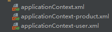

```xml
<import resource="applicationContext-product.xml"></import>
<import resource="applicationContext-user.xml"></import>
```


#### 1.3.9 Spring的重点配置

```
<bean>标签
    id属性:在容器中Bean实例的唯一标识，不允许重复
    class属性:要实例化的Bean的全限定名
    scope属性:Bean的作用范围，常用是Singleton(默认)和prototype
    <property>标签：属性注入
        name属性：属性名称
        value属性：注入的普通属性值
        ref属性：注入的对象引用值
        <list>标签
        <map>标签
        <properties>标签
    <constructor-arg>标签
<import>标签:导入其他的Spring的分文件
```


### 1.4 Spring相关API

#### 1.4.1 ApplicationContext的继承体系

**applicationContext**：接口类型，代表应用上下文，可以通过其实例获得 Spring 容器中的 Bean 对象

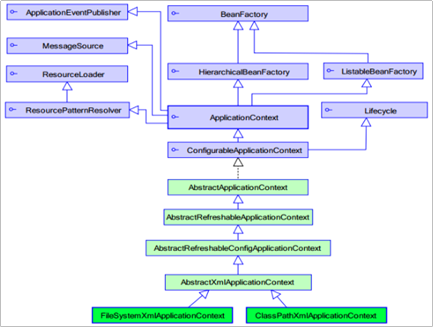


#### 1.4.2 ApplicationContext的实现类

- 1）ClassPathXmlApplicationContext 
        它是从类的根路径下加载配置文件 推荐使用这种
- 2）FileSystemXmlApplicationContext 
        它是从磁盘路径上加载配置文件，配置文件可以在磁盘的任意位置。
- 3）AnnotationConfigApplicationContext
        当使用注解配置容器对象时，需要使用此类来创建 spring 容器。它用来读取注解。


#### 1.4.3 getBean()方法使用

源码：

```java
public Object getBean(String name) throws BeansException {
    assertBeanFactoryActive();
    return getBeanFactory().getBean(name);
}

public <T> T getBean(Class<T> requiredType) throws BeansException {
    assertBeanFactoryActive();
    return getBeanFactory().getBean(requiredType);
}
```

使用：

```java
ApplicationContext applicationContext = new 
            ClassPathXmlApplicationContext("applicationContext.xml");

//参数为xml配置中的id值
UserService userService1 = (UserService) applicationContext.getBean("userService");
//参数为类的Class对象
UserService userService2 = applicationContext.getBean(UserService.class);
```


### 1.5 Spring配置数据源

#### 1.5.1 数据源（连接池）的作用

- 数据源(连接池)是提高程序性能如出现的
- 事先实例化数据源，初始化部分连接资源
- 使用连接资源时从数据源中获取
- 使用完毕后将连接资源归还给数据源
- 常见的数据源(连接池)：DBCP、C3P0、BoneCP、Druid等


#### 1.5.2 数据源的手动创建

1. 导入c3p0、druid和mysql数据库驱动的坐标（pom.xml）

   ```xml
   <dependency>
     <groupId>mysql</groupId>
     <artifactId>mysql-connector-java</artifactId>
     <version>5.1.32</version>
   </dependency>
   <dependency>
     <groupId>c3p0</groupId>
     <artifactId>c3p0</artifactId>
     <version>0.9.1.2</version>
   </dependency>
   <dependency>
     <groupId>com.alibaba</groupId>
     <artifactId>druid</artifactId>
     <version>1.1.10</version>
   </dependency>
   ```

2. 提取jdbc.properties配置文件

   ```properties
   jdbc.driver=com.mysql.jdbc.Driver
   jdbc.url=jdbc:mysql://localhost:3306/test
   jdbc.username=root
   jdbc.password=123456
   ```

3. 读取jdbc.properties配置文件创建连接池

   ```java
   @Test
   //测试手动创建c3p0数据源(加载配置文件形式)
   public void test3() throws Exception {
       //读取配置文件
       ResourceBundle rb = ResourceBundle.getBundle("jdbc");
       String driver = rb.getString("jdbc.driver");
       String url = rb.getString("jdbc.url");
       String username = rb.getString("jdbc.username");
       String password = rb.getString("jdbc.password");
   
       ComboPooledDataSource dataSource = new ComboPooledDataSource();
       dataSource.setDriverClass(driver);
       dataSource.setJdbcUrl(url);
       dataSource.setUser(username);
       dataSource.setPassword(password);
   
       Connection connection = dataSource.getConnection();
       System.out.println(connection);
       connection.close();
   }
   ```


#### 1.5.3 Spring配置数据源

配置数据源也是创建一个DataSource对象，可以将DataSource的创建权交由Spring容器去完成

- DataSource有自带的无参构造方法，而Spring默认就是通过无参构造方法实例化对象的
- DataSource要想使用需要通过**set方法设置数据库连接信息**，而Spring可以**通过set方法进行字符串注入**

applicationContext.xml文件：

```xml
<bean id="dataSource" class="com.mchange.v2.c3p0.ComboPooledDataSource">
    <property name="driverClass" value="com.mysql.jdbc.Driver"></property>
    <property name="jdbcUrl" value="jdbc:mysql://localhost:3306/test"></property>
    <property name="user" value="root"></property>
    <property name="password" value="123456"></property>
</bean>
```

测试类：

```java
@Test
//测试Spring容器产生数据源对象
public void test4() throws Exception {
    ApplicationContext app = new ClassPathXmlApplicationContext("applicationContext.xml");
    DataSource dataSource = app.getBean(DataSource.class);
    Connection connection = dataSource.getConnection();
    System.out.println(connection);
    connection.close();
}
```


#### 1.5.4 抽取Spring配置数据源的jdbc配置文件

applicationContext.xml加载jdbc.properties配置文件获得连接信息。

- 首先，需要引入context命名空间和约束路径：

  - 命名空间：xmlns:context="http://www.springframework.org/schema/context"

  - 约束路径：http://www.springframework.org/schema/context

    http://www.springframework.org/schema/context/spring-context.xsd

- Spring容器加载properties文件(applicationContext.xml)：

  ```xml
  <!--加载外部的properties文件-->
  <context:property-placeholder location="classpath:jdbc.properties"/>
  ```

- 修改applicationContext.xml文件：

  ```xml
  <bean id="dataSource" class="com.mchange.v2.c3p0.ComboPooledDataSource">
      <property name="driverClass" value="${jdbc.driver}"/>
      <property name="jdbcUrl" value="${jdbc.url}"/>
      <property name="user" value="${jdbc.username}"/>
      <property name="password" value="${jdbc.password}"/>
  </bean>
  ```


### 1.6 Spring注解开发

#### 1.6.1 Sring原始注解

- Spring是**轻代码而重配置**的框架，配置比较繁重，影响开发效率，所以注解开发是一种趋势，**注解代替xml配置文件**可以简化配置，提高开发效率。 

- Spring原始注解主要是替代\<Bean>的配置：

  | **注解**       | **说明**                                                     |
  | -------------- | ------------------------------------------------------------ |
  | @Component     | 使用在类上用于实例化Bean                                     |
  | @Controller    | 使用在web层类上用于实例化Bean                                |
  | @Service       | 使用在service层类上用于实例化Bean                            |
  | @Repository    | 使用在dao层类上用于实例化Bean                                |
  | @Autowired     | 使用在字段上用于根据类型依赖注入,按照数据类型从Spring容器中进行匹配**（只有一个该类型的bean）** |
  | @Qualifier     | 结合@Autowired一起使用用于根据名称进行依赖注入               |
  | @Resource      | 相当于@Autowired+@Qualifier，按照名称进行注入                |
  | @Value         | 注入普通属性**（可以用EL表达式从Spring容器获取数据）**       |
  | @Scope         | 标注Bean的作用范围                                           |
  | @PostConstruct | 使用在方法上标注该方法是Bean的初始化方法                     |
  | @PreDestroy    | 使用在方法上标注该方法是Bean的销毁方法                       |

- 使用注解进行开发时，需要在applicationContext.xml中配置组件扫描，作用是指定哪个包及其子包下的Bean需要进行扫描以便识别使用注解配置的类、字段和方法。

  ```xml
  <!--注解的组件扫描（com文件夹下的所有文件）-->
  <context:component-scan base-package="com"></context:component-scan>
  ```

- 原始注解举例：

  - 使用@Compont或@Repository标识UserDaoImpl需要Spring进行实例化（**加载到容器中**）

    ```java
    //@Component("userDao")
    @Repository("userDao")
    public class UserDaoImpl implements UserDao {
        @Override
        public void save() {
            System.out.println("save running... ...");
        }
    }
    ```

  - 使用@Compont或@Service标识UserServiceImpl需要Spring进行实例化

  - 使用@Autowired或者@Autowired+@Qulifier或者@Resource进行userDao的注入

    ```java
    //@Component("userService")
    @Service("userService")
    public class UserServiceImpl implements UserService {
        
        /*@Autowired
        @Qualifier("userDao")*/
        @Resource(name="userDao")
        private UserDao userDao;
        
        @Override
        public void save() {
            userDao.save();
        }
    }
    ```

  - 使用@Value进行字符串的注入（**EL表达式**）

    ```java
    @Repository("userDao")
    public class UserDaoImpl implements UserDao {
        @Value("str字符串内容")
        private String str;
        @Value("${jdbc.driver}")
        private String driver;
        @Override
        public void save() {
            System.out.println(str);
            System.out.println(driver);
            System.out.println("save running... ...");
        }
    }
    ```

  - 使用@Scope标注Bean的范围

    ```java
    @Component("userDaoImpl")
    //@Scope("prototype")
    @Scope("singleton")
    public class UserDaoImpl implements UserDao {
    }
    ```

  - 使用@PostConstruct标注初始化方法，使用@PreDestroy标注销毁方法

    ```java
    @PostConstruct
    public void init(){
        System.out.println("初始化方法....");
    }
    
    @PreDestroy
    public void destroy(){
        System.out.println("销毁方法.....");
    }
    
    ```


#### 1.6.2 Spring新注解

- 使用上面的注解还不能**全部替代xml配置文件**，还需要使用注解替代的配置如下：

  - 非自定义的Bean的配置：\<bean>
  - 加载properties文件的配置：\<context:property-placeholder>
  - 组件扫描的配置：\<context:component-scan>
  - 引入其他文件：\<import>

  | **注解**        | **说明**                                                     |
  | --------------- | ------------------------------------------------------------ |
  | @Configuration  | 用于指定当前类是一个 Spring  配置类，当创建容器时会从该类上加载注解 |
  | @ComponentScan  | 用于指定 Spring  在初始化容器时要扫描的包。  作用和在 Spring  的 xml 配置文件中的  <context:component-scan  base-package="com.itheima"/>一样 |
  | @Bean           | 使用在方法上，标注将该方法的返回值存储到  Spring  容器中     |
  | @PropertySource | 用于加载.properties  文件中的配置                            |
  | @Import         | 用于导入其他配置类                                           |

- 新注解使用配置类来取代xml配置文件

  SpringConfiguration配置类：（核心配置类）

  ```java
  //标志该类是Spring的核心配置类
  @Configuration
  
  //<!--配置组件扫描-->
  //<context:component-scan base-package="com"/>
  @ComponentScan("com")
  
  //<import resource=""/>
  //导入DataSourceConfiguration配置类，多个配置类为数组形式  
  @Import({DataSourceConfiguration.class})
  
  public class SpringConfiguration {
      
  }
  ```

  DataSourceConfiguration配置类：（专门存放数据源）

  ```java
  //<!--加载外部的properties文件-->
  //<context:property-placeholder location="classpath:jdbc.properties"/>
  @PropertySource("classpath:jdbc.properties")
  
  public class DataSourceConfiguration {
      @Value("${jdbc.driver}")
      private String driver;
      @Value("${jdbc.url}")
      private String url;
      @Value("${jdbc.username}")
      private String username;
      @Value("${jdbc.password}")
      private String password;
  
      @Bean("dataSource") //Spring会将当前方法的返回值以指定名称存储到Spring容器中
      public DataSource getDataSource() throws PropertyVetoException {
          ComboPooledDataSource dataSource = new ComboPooledDataSource();
          dataSource.setDriverClass(driver);
          dataSource.setJdbcUrl(url);
          dataSource.setUser(username);
          dataSource.setPassword(password);
  
          return dataSource;
      }
  }
  ```

- 测试加载核心配置类创建Spring容器

  ```java
  public class UserController {
      public static void main(String[] args) {
          //ApplicationContext app = new ClassPathXmlApplicationContext("applicationContext.xml");
          ApplicationContext app = new AnnotationConfigApplicationContext(SpringConfiguration.class);
          UserService userService = app.getBean(UserService.class);
          userService.save();
      }
  }
  ```


### 1.7 Spring整合Junit

#### 1.7.1 原始Junit测试Spring的问题

在测试类中，每个测试方法都有以下两行代码，作用是获取容器，如果不写的话，直接会提示空指针异常。所以又不能轻易删掉。

```java
ApplicationContext ac = new ClassPathXmlApplicationContext("bean.xml");
IAccountService as = ac.getBean("accountService",IAccountService.class);
```


#### 1.7.2 Spring集成Junit步骤与代码实现

- ①导入spring集成Junit的坐标

  ```xml
  <dependency>
    <groupId>org.springframework</groupId>
    <artifactId>spring-test</artifactId>
    <version>5.0.5.RELEASE</version>
  </dependency>
  <dependency>
        <groupId>junit</groupId>
        <artifactId>junit</artifactId>
        <version>4.12</version>
        <scope>test</scope>
  </dependency>
  ```

- ②使用@Runwith注解替换原来的运行期

- ③使用@ContextConfiguration指定**配置文件或配置类**

- ④使用@Autowired注入需要测试的对象

- ⑤创建测试方法进行测试

  ```java
  @RunWith(SpringJUnit4ClassRunner.class)
  //配置文件方式
  //@ContextConfiguration("classpath:applicationContext.xml")
  //全注解方式(参数是一个数组)
  @ContextConfiguration(classes = {SpringConfiguration.class})
  
  public class SpringJunitTest {
  
      @Autowired
      private UserService userService;
  
      @Test
      public void test() {
          userService.save();
      }
  }
  ```


### 1.8 Spring与Web环境集成

#### 1.8.1 ApplicationContext应用上下文获取方式

- 弊端：

  应用上下文对象是通过**new ClasspathXmlApplicationContext(spring配置文件)** 方式或者**new AnnotationConfigApplicationContext(spring配置类)**获取的，但是每次从容器中获得Bean时都要编写 ，这样的弊端是配置文件加载多次，应用上下文对象创建多次。

- 改进思路：

  在Web项目中，可以使用**ServletContextListener**监听Web应用的启动，在Web应用启动时，就加载Spring的配置文件，创建应用上下文对象**ApplicationContext**，在将其存储到最大的域**servletContext**域中，这样就可以在任意位置从域中获得应用上下文**ApplicationContext**对象了。


#### 1.8.2 Spring提供获取应用上下文的工具

Spring提供了一个监听器**ContextLoaderListener**就是对上述功能的封装，该监听器**内部加载Spring配置文件**（需要在web.xml中配置全局初始化参数），创建应用上下文对象，并存储到**ServletContext**域中，提供了一个客户端工具类**WebApplicationContextUtils**供使用者获得应用上下文对象。

具体步骤如下：

- 导入Spring-web的坐标和Servlet相关坐标

  ```xml
  <!--Spring坐标-->
  <dependency>
      <groupId>org.springframework</groupId>
      <artifactId>spring-context</artifactId>
      <version>5.0.5.RELEASE</version>
  </dependency>
  <!--Spring-web坐标-->
  <dependency>
    <groupId>org.springframework</groupId>
    <artifactId>spring-web</artifactId>
    <version>5.0.5.RELEASE</version>
  </dependency>
  <!--Servlet坐标-->
  <dependency>
        <groupId>javax.servlet</groupId>
        <artifactId>javax.servlet-api</artifactId>
        <version>3.0.1</version>
        <scope>provided</scope>
  </dependency>
  <!--Jsp坐标-->
  <dependency>
        <groupId>javax.servlet.jsp</groupId>
        <artifactId>javax.servlet.jsp-api</artifactId>
        <version>2.2.1</version>
        <scope>provided</scope>
  </dependency>
  ```

- 在**web.xml**中配置**ContextLoaderListener**监听器

  ```xml
  <!--全局初始化参数-->
  <!--ContextLoaderListener内部会读取web.xml的全局初始化参数contextConfigLocation，用于获取spring的应用上下文对象-->
  <context-param>
      <param-name>contextConfigLocation</param-name>
      <param-value>classpath:applicationContext.xml</param-value>
  </context-param>
  <!--配置监听器-->
  <listener>
      <listener-class>org.springframework.web.context.ContextLoaderListener</listener-class>
  </listener>
  ```

- 使用**WebApplicationContextUtils**获得应用上下文对象**ApplicationContext**

  ```java
  public class UserServlet extends HttpServlet {
  
      @Override
      protected void doGet(HttpServletRequest req, HttpServletResponse resp) throws ServletException, IOException {
          //获取Servlet上下文对象，从中获取spring应用上下文对象
          ServletContext servletContext = this.getServletContext();
          ApplicationContext app = WebApplicationContextUtils.getWebApplicationContext(servletContext);
          UserService userService = app.getBean(UserService.class);
          userService.save();
      }
  }
  ```


### 1.9 Spring JdbcTemplate

#### 1.9.1 JdbcTemplate概述

它是spring框架中提供的一个对象，是对原始繁琐的Jdbc API对象的简单封装。spring框架为我们提供了很多的操作模板类。例如：操作关系型数据的JdbcTemplate和HibernateTemplate，操作nosql数据库的RedisTemplate，操作消息队列的JmsTemplate等等。


#### 1.9.2 JdbcTemplate开发步骤

①导入spring-jdbc和spring-tx坐标

```xml
<dependency>
  <groupId>org.springframework</groupId>
  <artifactId>spring-jdbc</artifactId>
  <version>5.0.5.RELEASE</version>
</dependency>
<dependency>
  <groupId>org.springframework</groupId>
  <artifactId>spring-tx</artifactId>
  <version>5.0.5.RELEASE</version>
</dependency>
```

②创建数据库表和实体

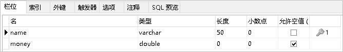

```java
public class Account {
    private String name;
    private double money;
    ...
}

```

③创建JdbcTemplate对象并执行数据库操作

```java
@Test
//测试JDBCTemplate开发步骤
public void test() throws PropertyVetoException {
    //创建数据源对象
    ComboPooledDataSource dataSource = new ComboPooledDataSource();
    dataSource.setDriverClass("com.mysql.jdbc.Driver");
    dataSource.setJdbcUrl("jdbc:mysql://localhost:3306/test");
    dataSource.setUser("root");
    dataSource.setPassword("123456");

    JdbcTemplate jdbcTemplate = new JdbcTemplate();
    //设置数据源（数据库连接）
    jdbcTemplate.setDataSource(dataSource);
    //执行操作
    int row = jdbcTemplate.update("insert into account values (?,?)", "Tom", 5000);
    System.out.println(row);    //影响行数

}
```


#### 1.9.3 Spring产生JdbcTemplate对象

可以将JdbcTemplate的创建权交给Spring，将数据源DataSource的创建权也交给Spring，在Spring容器内部将数据源DataSource注入到JdbcTemplate模版对象中

applicationContext.xml：

```xml
<!--加载jdbc.properties-->
<context:property-placeholder location="classpath:jdbc.properties"/>

<!--数据源对象-->
<bean id="dataSource" class="com.mchange.v2.c3p0.ComboPooledDataSource">
    <property name="driverClass" value="${jdbc.driver}"/>
    <property name="jdbcUrl" value="${jdbc.url}"/>
    <property name="user" value="${jdbc.username}"/>
    <property name="password" value="${jdbc.password}"/>
</bean>

<!--jdbc模板对象，将数据源对象注入其中-->
<bean id="jdbcTemplate" class="org.springframework.jdbc.core.JdbcTemplate">
    <property name="dataSource" ref="dataSource"/>
</bean>
```

```java
@Test
//测试Spring产生JdbcTemplate对象
public void test1() {
    ApplicationContext app = new ClassPathXmlApplicationContext("applicationContext.xml");
    JdbcTemplate jdbcTemplate = app.getBean(JdbcTemplate.class);
    int row = jdbcTemplate.update("insert into account values (?,?)", "Bob", 4000);
    System.out.println(row);    //影响行数
}
```


#### 1.9.4 JdbcTemplate的常用操作

```java
@RunWith(SpringJUnit4ClassRunner.class) //Spring集成Junit测试
@ContextConfiguration("classpath:applicationContext.xml")   //配置文件
public class JdbcTemplateCRUDTest {

    @Autowired  //自动注入
    private JdbcTemplate jdbcTemplate;

    @Test
    public void testQueryCount(){
        Long count = jdbcTemplate.queryForObject("select count(*) from account", Long.class);
        System.out.println(count);
    }

    @Test
    public void testQueryOne(){
        Account account = jdbcTemplate.queryForObject("select * from account where name=?", new BeanPropertyRowMapper<Account>(Account.class), "Tom");
        System.out.println(account);
    }

    @Test
    public void testQueryAll(){
        List<Account> accountList = jdbcTemplate.query("select * from account", new BeanPropertyRowMapper<Account>(Account.class));
        System.out.println(accountList);
    }

    @Test
    public void testUpdate(){
        jdbcTemplate.update("update account set money=? where name=?",10000,"Tom");
    }

    @Test
    public void testDelete(){
        jdbcTemplate.update("delete from account where name=?","Tom");
    }

}
```


#### 1.9.5 获取数据库自动生成的id

```java
public Long save(User user) {
    //jdbcTemplate.update("insert into sys_user values (?,?,?,?,?)", null, user.getUsername(), user.getEmail(), user.getPassword(), user.getPhoneNum());
    //创建PreparedStatementCreator
    PreparedStatementCreator creator = new PreparedStatementCreator() {
        public PreparedStatement createPreparedStatement(Connection connection) throws SQLException {
            //使用原始jdbc完成有个PreparedStatement的组建
            PreparedStatement preparedStatement = connection.prepareStatement("insert into sys_user values(?,?,?,?,?)", PreparedStatement.RETURN_GENERATED_KEYS);
            preparedStatement.setObject(1,null);
            preparedStatement.setString(2,user.getUsername());
            preparedStatement.setString(3,user.getEmail());
            preparedStatement.setString(4,user.getPassword());
            preparedStatement.setString(5,user.getPhoneNum());
            return preparedStatement;
        }
    };
    //创建keyHolder
    GeneratedKeyHolder keyHolder = new GeneratedKeyHolder();
    jdbcTemplate.update(creator,keyHolder);
    //获得生成的主键
    long userId = keyHolder.getKey().longValue();
    return userId; //返回当前保存用户的id 该id是数据库自动生成的
}
```


### 1.10 面向切面编程AOP

#### 1.10.1 Spring 的 AOP

##### (1) AOP简介

- **AOP** 为 **A**spect **O**riented **P**rogramming 的缩写，意思为面向切面编程，是通过**预编译方式**和**运行期动态代理**实现程序功能的统一维护的一种技术。
- AOP 是 OOP 的延续，是软件开发中的一个热点，也是Spring框架中的一个重要内容，是函数式编程的一种衍生范型。利用AOP可以对业务逻辑的各个部分进行隔离，从而使得业务逻辑各部分之间的**耦合度降低**，提高程序的可重用性，同时提高了开发的效率。
- 作用：在程序运行期间，在不修改源码的情况下对方法进行功能增强
- 优势：减少重复代码，提高开发效率，并且便于维护
- 底层实现：AOP 的底层是通过 **Spring 提供的的动态代理技术**实现的。在运行期间，Spring通过动态代理技术动态的生成代理对象，代理对象方法执行时进行增强功能的介入，在去调用目标对象的方法，从而完成功能的增强。

##### (2)  JDK动态代理

JDK 代理 : 基于接口的动态代理技术

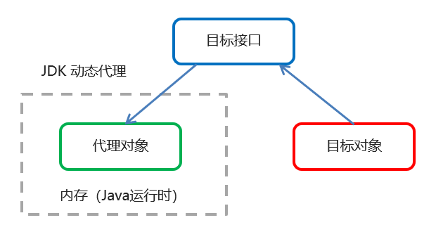

目标类接口：

```java
public interface TargetInterface {
    public void save();
}
```

目标类：

```java
public class Target implements TargetInterface{
    @Override
    public void save() {
        System.out.println("save running...");
    }
}
```

增强类：

```java
public class Advice {
    public void before() {
        System.out.println("前置增强...");
    }

    public void afterReturning() {
        System.out.println("后置增强...");
    }
}
```

动态代理：

```java
public class ProxyTest {
    public static void main(String[] args) {

        //目标对象
        final Target target = new Target();

        //增强对象
        Advice advice = new Advice();

        //动态生成的代理对象（与目标对象都继承了对应接口）
        TargetInterface proxy = (TargetInterface) Proxy.newProxyInstance(
                target.getClass().getClassLoader(),//目标对象的类加载器
                target.getClass().getInterfaces(),//目标对象相同的接口字节码对象数组
                new InvocationHandler() {
                    //调用代理对象的任何方法，实质都是执行的都是invoke对象
                    @Override
                    public Object invoke(Object proxy, Method method, Object[] args) throws Throwable {
                        //前置增强
                        advice.before();

                        //执行目标对象方法
                        Object invoke = method.invoke(target, args);

                        //后置增强
                        advice.afterReturning();

                        return invoke;
                    }
                }
        );

        //调用代理对象的方法
        proxy.save();
    }
}
```

##### (3) cglib动态代理

cglib动态代理：基于父类的动态代理技术

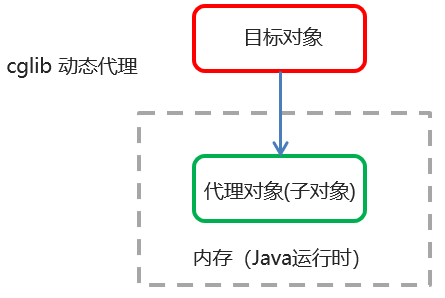

目标类与增强类与上同。

动态代理：

```java
public class ProxyTest {
    public static void main(String[] args) {

        //目标对象
        final Target target = new Target();

        //增强对象
        Advice advice = new Advice();

        //基于cglib的动态生成的代理对象
        //1.创建增强器
        Enhancer enhancer = new Enhancer();
        //2.设置父类（目标对象的类）
        enhancer.setSuperclass(Target.class);
        //3.设置回调
        enhancer.setCallback(new MethodInterceptor() {
            @Override
            public Object intercept(Object o, Method method, Object[] objects, MethodProxy methodProxy) throws Throwable {
                //前置增强
                advice.before();

                //执行目标对象方法
                Object invoke = method.invoke(target, args);

                //后置增强
                advice.afterReturning();

                return invoke;
            }
        });
        //4.生成代理对象
        Target proxy = (Target) enhancer.create();

        proxy.save();

    }
}
```

##### (4) AOP相关概念

- Spring 的 AOP 实现底层就是对上面的动态代理的代码进行了封装，封装后我们只需要对需要关注的部分进行代码编写，并通过配置的方式完成指定目标的方法增强。**在 spring 中，框架会根据目标类是否实现了接口来决定采用哪种动态代理的方式。**

- 相关术语：

  Target（目标对象）：代理的目标对象

  Proxy （代理）：一个类被 AOP 织入增强后，就产生一个结果代理类

  Joinpoint（连接点）：所谓连接点是指那些被拦截到的点。在spring中,这些点指的是方法，因为spring只支持方法类型的连接点（可以被增强的方法）

  **Pointcut（切入点）**：所谓切入点是指我们要对哪些 Joinpoint 进行拦截的定义（要被增强的方法/目标方法）

  **Advice（通知/ 增强）**：所谓通知是指拦截到 Joinpoint 之后所要做的事情就是通知

  **Aspect（切面）**：是切入点和通知（引介）的结合（目标方法+增强）

  **Weaving（织入）**：是指把增强应用到目标对象来创建新的代理对象的过程。spring采用动态代理织入，而AspectJ采用编译期织入和类装载期织入（配置的过程）

- **Spring 框架监控切入点方法的执行。一旦监控到切入点方法被运行，使用代理机制，动态创建目标对象的代理对象，根据通知类别，在代理对象的对应位置，将通知对应的功能织入，完成完整的代码逻辑运行。**


#### 1.10.2 基于 XML 的 AOP 开发

①导入 AOP 相关坐标

```xml
<dependency>
  <groupId>org.aspectj</groupId>
  <artifactId>aspectjweaver</artifactId>
  <version>1.8.4</version>
</dependency>
```

②创建目标接口和目标类（内部有切点）

```java
public interface TargetInterface {
    public void save();
}
```

```java
public class Target implements TargetInterface {
    @Override
    public void save() {
        System.out.println("save running...");
    }
}
```

③创建切面类（内部有增强方法）

```java
public class MyAspect {
    public void before() {
        System.out.println("前置增强...");
    }

    public void afterReturning() {
        System.out.println("后置增强...");
    }

    //正在执行的连接点（切点）
    public Object around(ProceedingJoinPoint pjp) throws Throwable {
        System.out.println("环绕前增强...");
        Object proceed = pjp.proceed();
        System.out.println("环绕后增强...");
        return proceed;
    }

    public void afterThrowing() {
        System.out.println("异常抛出异常...");
    }

    public void after() {
        System.out.println("最终执行增强...");
    }
}
```

④在applicationContext.xml 将目标类和切面类的对象创建权交给 spring并配置织入关系

```xml
<?xml version="1.0" encoding="UTF-8"?>
<beans xmlns="http://www.springframework.org/schema/beans"
       xmlns:xsi="http://www.w3.org/2001/XMLSchema-instance"
       xmlns:aop="http://www.springframework.org/schema/aop"
       xsi:schemaLocation="http://www.springframework.org/schema/beans http://www.springframework.org/schema/beans/spring-beans.xsd
                        http://www.springframework.org/schema/aop http://www.springframework.org/schema/aop/spring-aop.xsd">

        <!--配置目标对象-->
        <bean id="target" class="com.kiki.aop.Target"></bean>

        <!--配置切面对象-->
        <bean id="myAspect" class="com.kiki.aop.MyAspect"></bean>

        <!--配置织入，告诉spring框架，哪些方法（切点）需要进行哪些增强-->
        <aop:config>
                <!--声明切面-->
                <aop:aspect ref="myAspect">
                        <!--通知+切点-->
                        <aop:before method="before" pointcut="execution(public void com.kiki.aop.Target.save())"></aop:before>
                        <aop:after method="afterReturning" pointcut="execution(* com.kiki.aop.Target.*(..))"></aop:after>
                        <aop:around method="around" pointcut="execution(* com.kiki.aop.Target.*(..))"></aop:around>
                        <aop:after-throwing method="afterThrowing" pointcut="execution(* com.kiki.aop.Target.*(..))"></aop:after-throwing>
                        <aop:after method="after" pointcut="execution(* com.kiki.aop.Target.*(..))"></aop:after>
                        <!--抽取切点表达式-->
                        <aop:pointcut id="myPointcut" expression="execution(* com.kiki.aop.Target.*(..))"/>
                        <aop:before method="before" pointcut-ref="myPointcut"/>
                </aop:aspect>
        </aop:config>
</beans>
```

- 切点表达式的写法：

  表达式语法：execution([修饰符] 返回值类型 包名.类名.方法名(参数))

  ​	访问修饰符可以省略

  ​	返回值类型、包名、类名、方法名可以使用星号* 代表任意

  ​	包名与类名之间一个点 . 代表当前包下的类，两个点 .. 表示当前包及其子包下的类

  ​	参数列表可以使用两个点 .. 表示任意个数，任意类型的参数列表

- 通知的类型：

  通知的配置语法：<aop:通知类型 method=“切面类中方法名” pointcut=“切点表达式">\</aop:通知类型>

  | **名称**     | **标签**                | **说明**                                                     |
  | ------------ | ----------------------- | ------------------------------------------------------------ |
  | 前置通知     | \<aop:before>           | 用于配置前置通知。指定增强的方法在切入点方法之前执行         |
  | 后置通知     | \ <aop:after-returning> | 用于配置后置通知。指定增强的方法在切入点方法之后执行         |
  | 环绕通知     | \<aop:around>           | 用于配置环绕通知。指定增强的方法在切入点方法之前和之后都执行 |
  | 异常抛出通知 | \<aop:throwing>         | 用于配置异常抛出通知。指定增强的方法在出现异常时执行         |
  | 最终通知     | \<aop:after>            | 用于配置最终通知。无论增强方式执行是否有异常都会执行         |

- 切点表达式的抽取：

  当多个增强的切点表达式相同时，可以将切点表达式进行抽取，在增强中使用 pointcut-ref 属性代替 pointcut 属性来引用抽取后的切点表达式。

  ```xml
  <aop:config>
  	<!--声明切面-->
  	<aop:aspect ref="myAspect">
  		<!--抽取切点表达式-->
  		<aop:pointcut id="myPointcut" expression="execution(* com.kiki.aop.Target.*(..))"/>
  		<aop:before method="before" pointcut-ref="myPointcut"/>
  	</aop:aspect>
  </aop:config>
  ```

  

#### 1.10.3 基于注解的 AOP 开发

①创建目标接口和目标类（内部有切点）并把对象创建权交给 spring

```java
public interface TargetInterface {
    public void save();
}
```

```java
@Component("target")
public class Target implements TargetInterface {
    @Override
    public void save() {
        System.out.println("save running...");
    }
}
```

②在切面类中使用注解配置织入关系

```java
@Component("myAspect")
@Aspect //标注当前类是一个切面类
public class MyAspect {

    //配置前置通知（增强）
    @Before(value = "execution(public void com.kiki.anno.Target.save())")
    public void before() {
        System.out.println("前置增强...");
    }

    //定义切点表达式
    @Pointcut("execution(* com.kiki.anno.Target.*(..))")
    public void pointcut() {

    }

    //后置增强
    @AfterReturning("pointcut()")
    public void afterReturning() {
        System.out.println("后置增强...");
    }

}
```

③在配置文件applicationContext.xml中开启组件扫描和 AOP 的自动代理

```xml
<!--组件扫描-->
<context:component-scan base-package="com.kiki.anno"/>

<!--aop自动代理-->
<aop:aspectj-autoproxy/>
```

通知的配置语法：@通知注解(“切点表达式")：

| **名称**     | **注解**        | **说明**                                                     |
| ------------ | --------------- | ------------------------------------------------------------ |
| 前置通知     | @Before         | 用于配置前置通知。指定增强的方法在切入点方法之前执行         |
| 后置通知     | @AfterReturning | 用于配置后置通知。指定增强的方法在切入点方法之后执行         |
| 环绕通知     | @Around         | 用于配置环绕通知。指定增强的方法在切入点方法之前和之后都执行 |
| 异常抛出通知 | @AfterThrowing  | 用于配置异常抛出通知。指定增强的方法在出现异常时执行         |
| 最终通知     | @After          | 用于配置最终通知。无论增强方式执行是否有异常都会执行         |


### 1.11 声明式事务控制

#### 1.11.1 编程式事务控制相关对象

#### (1) PlatformTransactionManager 

PlatformTransactionManager 接口是 spring 的**事务管理器**，它里面提供了我们常用的操作事务的方法。

| **方法**                                                     | **说明**           |
| ------------------------------------------------------------ | ------------------ |
| TransactionStatus  getTransaction(TransactionDefination defination) | 获取事务的状态信息 |
| void  commit(TransactionStatus status)                       | 提交事务           |
| void  rollback(TransactionStatus status)                     | 回滚事务           |

PlatformTransactionManager 是接口类型，**不同的 Dao 层技术则有不同的实现类**，

例如：**Dao 层技术是jdbc 或 MyBatis 时**：org.springframework.jdbc.datasource.**DataSourceTransactionManager** 

Dao 层技术是hibernate时：org.springframework.orm.hibernate5.HibernateTransactionManager

#### (2) TransactionDefinition

TransactionDefinition 是事务的定义信息对象，里面有如下方法：

| **方法**                      | **说明**           |
| ----------------------------- | ------------------ |
| int  getIsolationLevel()      | 获得事务的隔离级别 |
| int  getPropogationBehavior() | 获得事务的传播行为 |
| int  getTimeout()             | 获得超时时间       |
| boolean  isReadOnly()         | 是否只读           |

- 事务隔离级别：设置隔离级别，可以解决事务并发产生的问题，如脏读、不可重复读和虚读：

  ISOLATION_DEFAULT

  ISOLATION_READ_UNCOMMITTED

  ISOLATION_READ_COMMITTED

  ISOLATION_REPEATABLE_READ(MySql默认)

  ISOLATION_SERIALIZABLE

- 事务传播行为：解决调用业务方法时事务的统一性（如A业务方法调用B业务方法）：

   **REQUIRED：如果B看A当前没有事务，就新建一个事务，如果A已经存在一个事务中，加入到这个事务中。一般的选择（默认值）**

   **SUPPORTS：B支持A当前事务，如果B看A当前没有事务，就以非事务方式执行（没有事务）**

   MANDATORY：使用当前的事务，如果当前没有事务，就抛出异常

   REQUERS_NEW：新建事务，如果当前在事务中，把当前事务挂起。

   NOT_SUPPORTED：以非事务方式执行操作，如果当前存在事务，就把当前事务挂起

   NEVER：以非事务方式运行，如果当前存在事务，抛出异常

   NESTED：如果当前存在事务，则在嵌套事务内执行。如果当前没有事务，则执行 REQUIRED 类似的操作

   超时时间：默认值是-1，没有超时限制。如果有，以秒为单位进行设置

   是否只读：建议查询时设置为只读

#### (3) TransactionStatus

TransactionStatus 接口提供的是事务具体的运行状态，方法介绍如下：

| **方法**                    | **说明**       |
| --------------------------- | -------------- |
| boolean  hasSavepoint()     | 是否存储回滚点 |
| boolean  isCompleted()      | 事务是否完成   |
| boolean  isNewTransaction() | 是否是新事务   |
| boolean  isRollbackOnly()   | 事务是否回滚   |


#### 1.11.2 基于 XML 的声明式事务控制

- Spring 的声明式事务顾名思义就是采用声明的方式来处理事务。这里所说的声明，就是指在配置文件中声明，**用在 Spring 配置文件中声明式的处理事务来代替代码式的处理事务。**

- 事务管理不侵入开发的组件（**解耦**）。具体来说，业务逻辑对象就不会意识到正在事务管理之中，事实上也应该如此，因为事务管理是**属于系统层面的服务，而不是业务逻辑的一部分**，如果想要改变事务管理策划的话，也只需要在定义文件中重新配置即可

- 在不需要事务管理的时候，只要在设定文件上修改一下，即可移去事务管理服务，无需改变代码重新编译，这样维护起来极其方便

- **Spring 声明式事务控制底层就是AOP。**

具体做法：**引入tx命名空间并配置事务增强与AOP织入**（给AccountServiceImpl实现类的方法配置事务）

```xml
<?xml version="1.0" encoding="UTF-8"?>
<beans xmlns="http://www.springframework.org/schema/beans"
       xmlns:xsi="http://www.w3.org/2001/XMLSchema-instance"
       xmlns:aop="http://www.springframework.org/schema/aop"
       xmlns:tx="http://www.springframework.org/schema/tx"
       xsi:schemaLocation="
       http://www.springframework.org/schema/beans http://www.springframework.org/schema/beans/spring-beans.xsd
       http://www.springframework.org/schema/aop http://www.springframework.org/schema/aop/spring-aop.xsd
       http://www.springframework.org/schema/tx http://www.springframework.org/schema/tx/spring-tx.xsd
">

    <bean id="dataSource" class="com.mchange.v2.c3p0.ComboPooledDataSource">
        <property name="driverClass" value="com.mysql.jdbc.Driver"/>
        <property name="jdbcUrl" value="jdbc:mysql://localhost:3306/test"/>
        <property name="user" value="root"/>
        <property name="password" value="123456"/>
    </bean>

    <bean id="jdbcTemplate" class="org.springframework.jdbc.core.JdbcTemplate">
        <property name="dataSource" ref="dataSource"/>
    </bean>

    <bean id="accountDao" class="com.itheima.dao.impl.AccountDaoImpl">
        <property name="jdbcTemplate" ref="jdbcTemplate"/>
    </bean>

    <!--目标对象  内部的方法就是切点-->
    <bean id="accountService" class="com.itheima.service.impl.AccountServiceImpl">
        <property name="accountDao" ref="accountDao"/>
    </bean>

    <!--配置平台事务管理器DataSourceTransactionManager(jdbc\MyBatis)-->
    <bean id="transactionManager" class="org.springframework.jdbc.datasource.DataSourceTransactionManager">
        <!--注入数据源-->
        <property name="dataSource" ref="dataSource"/>
    </bean>

    <!--通知，即事务的增强,需要一个平台事务管理器-->
    <tx:advice id="txAdvice" transaction-manager="transactionManager">
        <!--设置方法的事务的属性信息,类似TransactionDefinition-->
        <tx:attributes>
            <!--切点的方法名称  隔离级别  传播行为  是否只读-->
            <tx:method name="transfer" isolation="REPEATABLE_READ" propagation="REQUIRED" read-only="false"/>
            <tx:method name="save" isolation="REPEATABLE_READ" propagation="REQUIRED" read-only="false"/>
            <tx:method name="find*" isolation="REPEATABLE_READ" propagation="REQUIRED" read-only="false"/>
        </tx:attributes>
    </tx:advice>

    <!--配置事务的aop织入，将切点和通知（增强）结合起来-->
    <aop:config>
        <aop:advisor advice-ref="txAdvice" pointcut="execution(* com.itheima.service.impl.*.*(..))"/>
    </aop:config>
    
</beans>
```

其中，\<tx:method> 代表切点方法的事务参数的配置，例如：

```xml
<tx:method name="transfer" isolation="REPEATABLE_READ" propagation="REQUIRED" timeout="-1" read-only="false"/>
```

name：切点方法名称
isolation:事务的隔离级别
propogation：事务的传播行为
timeout：超时时间
read-only：是否只读


#### 1.11.3 基于注解的声明式事务控制

AccountServiceImpl.java：

```java
@Service("accountService")	//使用在service层类上用于实例化Bean
//当前类下所有方法共有的事务控制参数
@Transactional(isolation = Isolation.REPEATABLE_READ)
public class AccountServiceImpl implements AccountService {

    @Autowired
    private AccountDao accountDao;

    //配置切点的事务控制参数（隔离级别，传播行为等等），遵循就近原则
    @Transactional(isolation = Isolation.READ_COMMITTED,propagation = Propagation.REQUIRED)
    public void transfer(String outMan, String inMan, double money) {
        accountDao.out(outMan,money);
        int i = 1/0;
        accountDao.in(inMan,money);
    }

    //@Transactional(isolation = Isolation.DEFAULT)
    public void xxx(){}
}
```

applicationContext.xml 配置文件：

```xml
<?xml version="1.0" encoding="UTF-8"?>
<beans xmlns="http://www.springframework.org/schema/beans"
       xmlns:xsi="http://www.w3.org/2001/XMLSchema-instance"
       xmlns:aop="http://www.springframework.org/schema/aop"
       xmlns:context="http://www.springframework.org/schema/context"
       xmlns:tx="http://www.springframework.org/schema/tx"
       xsi:schemaLocation="
       http://www.springframework.org/schema/beans http://www.springframework.org/schema/beans/spring-beans.xsd
       http://www.springframework.org/schema/aop http://www.springframework.org/schema/aop/spring-aop.xsd
       http://www.springframework.org/schema/tx http://www.springframework.org/schema/tx/spring-tx.xsd
       http://www.springframework.org/schema/context http://www.springframework.org/schema/context/spring-context.xsd
">

    <!--组件扫描-->
    <context:component-scan base-package="com.itheima"/>

    <bean id="dataSource" class="com.mchange.v2.c3p0.ComboPooledDataSource">
        <property name="driverClass" value="com.mysql.jdbc.Driver"/>
        <property name="jdbcUrl" value="jdbc:mysql://localhost:3306/test"/>
        <property name="user" value="root"/>
        <property name="password" value="123456"/>
    </bean>

    <bean id="jdbcTemplate" class="org.springframework.jdbc.core.JdbcTemplate">
        <property name="dataSource" ref="dataSource"/>
    </bean>

    <!--配置平台事务管理器-->
    <bean id="transactionManager" class="org.springframework.jdbc.datasource.DataSourceTransactionManager">
        <property name="dataSource" ref="dataSource"/>
    </bean>

    <!--事务的注解驱动-->
    <tx:annotation-driven transaction-manager="transactionManager"/>

</beans>
```

- 注解配置声明式事务控制解析：

  使用 @Transactional 在需要进行事务控制的类或是方法上修饰，注解可用的属性同 xml 配置方式，例如隔离级别、传播行为等。

  注解使用在类上，那么该类下的所有方法都使用同一套注解参数配置。

  使用在方法上，不同的方法可以采用不同的事务参数配置。

  Xml配置文件中要开启事务的注解驱动<tx:annotation-driven />


## 二、SpringMVC

### 2.1 SpringMVC简介

#### 2.1.1 SpringMVC概述

**SpringMVC** 是一种基于 Java 的实现 **MVC** **设计模型**的请求驱动类型的轻量级 **Web** **框架**，属于**SpringFrameWork** 的后续产品，已经融合在 Spring Web Flow 中。

SpringMVC 已经成为目前最主流的MVC框架之一，通过一套注解，让一个简单的 Java 类成为处理请求的控制器，而无须实现任何接口。同时它还支持 **RESTful** 编程风格的请求。


#### 2.1.2 SpringMVC快速入门

客户端发起请求，服务器端接收请求，执行逻辑并进行视图跳转。

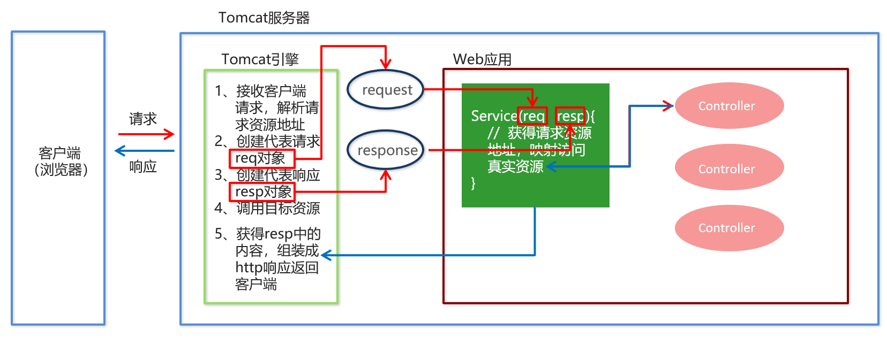

1. 导入SpringMVC相关坐标

   ```xml
   <!--Spring坐标-->
   <dependency>
       <groupId>org.springframework</groupId>
       <artifactId>spring-context</artifactId>
       <version>5.0.5.RELEASE</version>
   </dependency>
   <!--SpringMVC坐标-->
   <dependency>
       <groupId>org.springframework</groupId>
       <artifactId>spring-webmvc</artifactId>
       <version>5.0.5.RELEASE</version>
   </dependency>
   <!--Servlet坐标-->
   <dependency>
         <groupId>javax.servlet</groupId>
         <artifactId>javax.servlet-api</artifactId>
         <version>3.0.1</version>
         <scope>provided</scope>
   </dependency>
   <!--Jsp坐标-->
   <dependency>
         <groupId>javax.servlet.jsp</groupId>
         <artifactId>javax.servlet.jsp-api</artifactId>
         <version>2.2.1</version>
         <scope>provided</scope>
   </dependency>
   ```

2. 在web.xml中配置SpringMVC核心控制器DispathcerServlet

   ```xml
   <!--配置MVC前端控制器-->
   <servlet>
       <servlet-name>DispatcherServlet</servlet-name>
       <servlet-class>org.springframework.web.servlet.DispatcherServlet</servlet-class>
       <!--初始化参数-->
       <init-param>
           <param-name>contextConfigLocation</param-name>
           <param-value>classpath:spring-mvc.xml</param-value>
       </init-param>
       <!--服务器启动时就创建对象，不配置默认第一次访问时再创建-->
       <load-on-startup>1</load-on-startup>
   </servlet>
   <servlet-mapping>
       <servlet-name>DispatcherServlet</servlet-name>
       <url-pattern>/</url-pattern>
   </servlet-mapping>
   ```

3. 创建Controller类和视图页面

   ```java
   @Controller
   public class QuickController {
       @RequestMapping("/quick")
       public String quickMethod(){
           System.out.println("quickMethod running.....");
           return "/index.jsp";
       }
   }
   ```

4. 使用注解配置Controller类中业务方法的映射地址

   ```jsp
   <html>
       <body>
           <h2>Hello SpringMVC!</h2>
       </body>
   </html>
   ```

5. 配置SpringMVC核心文件 spring-mvc.xml

   ```xml
   <?xml version="1.0" encoding="UTF-8"?>
   <beans xmlns="http://www.springframework.org/schema/beans"
          xmlns:xsi="http://www.w3.org/2001/XMLSchema-instance"
          xmlns:context="http://www.springframework.org/schema/context" xmlns:mvc="http://www.alibaba.com/schema/stat"
          xsi:schemaLocation="http://www.springframework.org/schema/beans http://www.springframework.org/schema/beans/spring-beans.xsd
                           http://www.springframework.org/schema/context http://www.springframework.org/schema/context/spring-context.xsd http://www.alibaba.com/schema/stat http://www.alibaba.com/schema/stat.xsd">
   
       <!--Controller的组件扫描-->
       <context:component-scan base-package="com.itheima.controller"/>
   
   </beans>
   ```

6. 客户端发起请求测试

   http://localhost:8080/spring_mvc/quick


### 2.2 SpringMVC的解析

#### 2.2.1 SpringMVC的执行流程

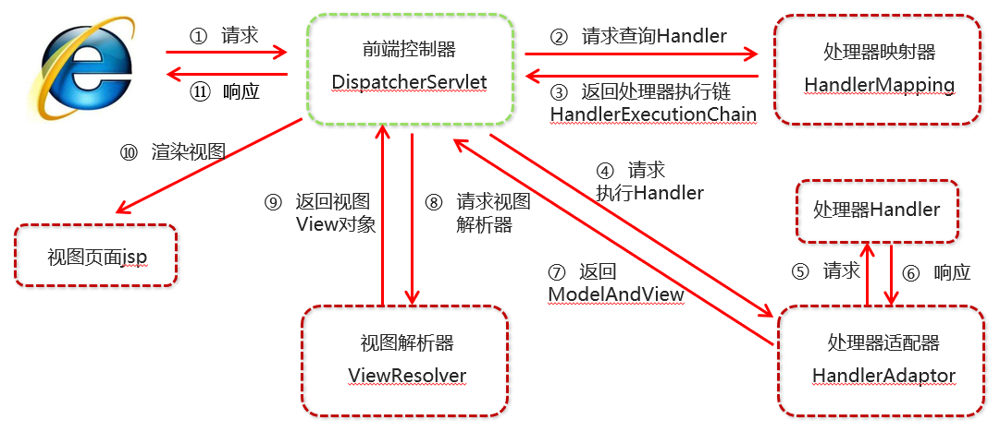

①用户发送请求至前端控制器DispatcherServlet。

②DispatcherServlet收到请求调用HandlerMapping处理器映射器。

③处理器映射器找到具体的处理器(可以根据xml配置、注解进行查找)，生成处理器对象及处理器拦截器(如果有则生成)一并返回给DispatcherServlet。

④DispatcherServlet调用HandlerAdapter处理器适配器。

⑤HandlerAdapter经过适配调用具体的处理器(Controller，也叫后端控制器)。

⑥Controller执行完成返回ModelAndView。

⑦HandlerAdapter将controller执行结果ModelAndView返回给DispatcherServlet。

⑧DispatcherServlet将ModelAndView传给ViewReslover视图解析器。

⑨ViewReslover解析后返回具体View。

⑩DispatcherServlet根据View进行渲染视图（即将模型数据填充至视图中）。DispatcherServlet响应用户。


#### 2.2.2 SpringMVC组件解析

**1.** **前端控制器：**DispatcherServlet

  用户请求到达前端控制器，它就相当于 MVC 模式中的 C，DispatcherServlet 是整个流程控制的中心，由它调用其它组件处理用户的请求，DispatcherServlet 的存在降低了组件之间的耦合性。

**2.** **处理器映射器：**HandlerMapping

  HandlerMapping 负责根据用户请求找到 Handler 即处理器，SpringMVC 提供了不同的映射器实现不同的映射方式，例如：配置文件方式，实现接口方式，注解方式等。

**3.** **处理器适配器：**HandlerAdapter

  通过 HandlerAdapter 对处理器进行执行，这是适配器模式的应用，通过扩展适配器可以对更多类型的处理器进行执行。

**4.** **处理器：**Handler

  它就是我们开发中要编写的具体业务控制器。由 DispatcherServlet 把用户请求转发到 Handler。由Handler 对具体的用户请求进行处理。

**5.** **视图解析器：**View Resolver

  View Resolver 负责将处理结果生成 View 视图，View Resolver 首先根据逻辑视图名解析成物理视图名，即具体的页面地址，再生成 View 视图对象，最后对 View 进行渲染将处理结果通过页面展示给用户。

**6.** **视图：**View

  SpringMVC 框架提供了很多的 View 视图类型的支持，包括：jstlView、freemarkerView、pdfView等。最常用的视图就是 jsp。一般情况下需要通过页面标签或页面模版技术将模型数据通过页面展示给用户，需要由程序员根据业务需求开发具体的页面


#### 2.2.3 SpringMVC注解解析

```java
@Controller //使用在web层类上用于实例化Bean
@RequestMapping("/user") //映射web工程下的地址
public class UserController {
    // 请求地址  http://localhost:8080/user/quick
    @RequestMapping(value = "/quick", method = RequestMethod.GET, params = {"username"})
    public String save() {
        System.out.println("Controller save running....");
        //forward:相当于请求转发(默认)，redirect:重定向，‘/’代表当前工程目录下
        //return "forward:/jsp/success.jsp";
        //return "redirect:/jsp/success.jsp";
        //加上内部资源视图解析器
        return "success";
    }
}
```

**@**RequestMapping

- 作用：用于建立请求 URL 和处理请求方法之间的对应关系
- 位置：
  - 类上，请求URL 的第一级访问目录。此处不写的话，就相当于应用的根目录
  - 方法上，请求 URL 的第二级访问目录，与类上的使用@ReqquestMapping标注的一级目录一起组成访问虚拟路径

- 属性：
  - **value**：用于指定请求的URL。它和path属性的作用是一样的
  - **method**：用于指定请求的方式
  - **params**：用于指定限制请求参数的条件。它支持简单的表达式。要求请求参数的key和value必须和配置的一模一样
  - 例如：
    - params = {"accountName"}，表示请求参数必须有accountName
    - params= {"moeny!100"}，表示请求参数中money不能是100


#### 2.2.4 SpringMVC的XML配置解析

1. **mvc命名空间引入**
命名空间：xmlns:context="http://www.springframework.org/schema/context"
                xmlns:mvc="http://www.springframework.org/schema/mvc"
约束地址：http://www.springframework.org/schema/context
         http://www.springframework.org/schema/context/spring-context.xsd
         http://www.springframework.org/schema/mvc 
         http://www.springframework.org/schema/mvc/spring-mvc.xsd

2. **组件扫描**
    SpringMVC基于Spring容器，所以在进行SpringMVC操作时，需要将Controller存储到Spring容器中，如果使用@Controller注解标注的话，就需要使用<context:component-scan base-package=“com.itheima.controller"/>进行组件扫描。

3. **视图解析器**

  SpringMVC有默认组件配置，默认组件都是**DispatcherServlet.properties**配置文件中配置的，该配置文件地址org/springframework/web/servlet/DispatcherServlet.properties，该文件中配置了默认的视图解析器，如下：

  ```java
  org.springframework.web.servlet.ViewResolver = org.springframework.web.servlet.view.InternalResourceViewResolver
  ```

  翻看该解析器源码，可以看到该解析器的默认设置，如下：

  ```java
  REDIRECT_URL_PREFIX = "redirect:"  --重定向前缀
  FORWARD_URL_PREFIX = "forward:"    --转发前缀（默认值）
  prefix = "";     --视图名称前缀
  suffix = "";     --视图名称后缀
  ```

  可以通过属性注入的方式修改视图的的前后缀。

spring-mvc.xml配置如下：

```xml
<?xml version="1.0" encoding="UTF-8"?>
<beans xmlns="http://www.springframework.org/schema/beans"
       xmlns:xsi="http://www.w3.org/2001/XMLSchema-instance"
       xmlns:context="http://www.springframework.org/schema/context" xmlns:mvc="http://www.springframework.org/schema/mvc"
       xsi:schemaLocation="http://www.springframework.org/schema/beans http://www.springframework.org/schema/beans/spring-beans.xsd
                        http://www.springframework.org/schema/context http://www.springframework.org/schema/context/spring-context.xsd
                           http://www.springframework.org/schema/mvc http://www.springframework.org/schema/mvc/spring-mvc.xsd">

    <!--Controller的组件扫描，(include)扫com.itheima包下的Controller注解-->
<!--    <context:component-scan base-package="com.itheima.controller"/>-->
    <context:component-scan base-package="com.itheima">
        <context:include-filter type="annotation" expression="org.springframework.stereotype.Controller"/>
    </context:component-scan>

    <!--配置内部资源视图解析器-->
    <bean id="viewResolver" class="org.springframework.web.servlet.view.InternalResourceViewResolver">
        <!--  /jsp/success.jsp  -->
        <property name="prefix" value="/jsp/"></property>
        <property name="suffix" value=".jsp"></property>
    </bean>

</beans>
```


### 2.3 SpringMVC的数据响应

#### 2.3.1 页面跳转

- 返回字符串形式：会将返回的字符串与视图解析器的前后缀拼接后跳转。(**见SpringMVC注解解析**)

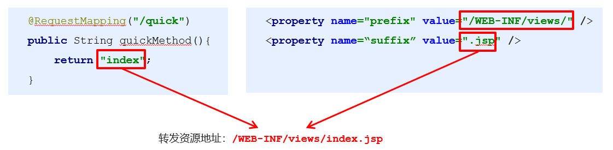

- 返回ModelAndView对象：

  ```java
  @RequestMapping(value = "/quick2")
  public ModelAndView save2() {
      System.out.println("Controller save running....");
      /*
      * Model:模型 封装数据
      * View:视图  展示数据
      * */
      ModelAndView modelAndView = new ModelAndView();
      //设置模型数据
      modelAndView.addObject("name", "itcast");
      //设置视图名(路径加上内部资源视图解析器)
      modelAndView.setViewName("success");
      return modelAndView;
  }
  
  @RequestMapping(value = "/quick3")
  //SpringMVC框架注入的ModelAndView对象
  public ModelAndView save3(ModelAndView modelAndView) {
      System.out.println("Controller save running....");
      //设置模型数据
      modelAndView.addObject("name", "itsave3");
      //设置视图名(路径)
      modelAndView.setViewName("success");
      return modelAndView;
  }
  ```

- 向request域存储数据：

  /jsp/success.jsp：

  ```jsp
  %@ page contentType="text/html;charset=UTF-8" language="java" %>
  <html>
  <head>
      <title>Title</title>
  </head>
  <body>
      success!${name}
  </body>
  </html>
  ```

  - 通过SpringMVC框架注入的request对象setAttribute()方法设置：

    ```java
    @RequestMapping(value = "/quick5")
    public String save5(HttpServletRequest request) {
        System.out.println("Controller save running....");
        request.setAttribute("name", "itsave5");
        return "success";
    }
    ```

  - 通过ModelAndView的addObject()方法设置：

    ```java
    @RequestMapping(value = "/quick4")
    public String save4(Model model) {
        System.out.println("Controller save running....");
        //设置模型数据
        model.addAttribute("name", "itsave4");
        return "success";
    }
    
    @RequestMapping(value = "/quick3")
    public ModelAndView save3(ModelAndView modelAndView) {
        System.out.println("Controller save running....");
        //设置模型数据
        modelAndView.addObject("name", "itsave3");
        //设置视图名(路径)
        modelAndView.setViewName("success");
        return modelAndView;
    }
    ```


#### 2.3.2 回写数据

- 直接返回字符串：

  ```JAVA
  @RequestMapping(value = "/quick6")
  public void save6(HttpServletResponse response) throws IOException {
      System.out.println("Controller save running....");
      response.getWriter().write("helloquick6");
  }
  
  //将需要回写的字符串直接返回，但此时需要通过@ResponseBody注解告知SpringMVC框架
  @RequestMapping(value = "/quick7")
  @ResponseBody   //告知SpringMVC框架，不进行视图跳转，直接进行数据响应
  public String save7() {
      System.out.println("Controller save running....");
      return "helloquick7";
  }
  ```

- 返回JSON格式字符串：

  用json转换工具jackson进行转换，导入jackson坐标。

  ```xml
  <dependency>
    <groupId>com.fasterxml.jackson.core</groupId>
    <artifactId>jackson-core</artifactId>
    <version>2.9.0</version>
  </dependency>
  <dependency>
    <groupId>com.fasterxml.jackson.core</groupId>
    <artifactId>jackson-databind</artifactId>
    <version>2.9.0</version>
  </dependency>
  <dependency>
    <groupId>com.fasterxml.jackson.core</groupId>
    <artifactId>jackson-annotations</artifactId>
    <version>2.9.0</version>
  </dependency>
  ```

  ```java
  @RequestMapping(value = "/quick8")
  @ResponseBody   //告知SpringMVC框架，不进行视图跳转，直接进行数据响应
  public String save8() throws JsonProcessingException {
      User user = new User("asda8", 18);
      //使用json转换工具将对象转化为JSON字符串再返回
      ObjectMapper objectMapper = new ObjectMapper();
      String json = objectMapper.writeValueAsString(user);
      //本质上还是字符串
      return json;
  }
  ```

- 返回对象或集合：

  通过SpringMVC帮助我们对对象或集合进行json字符串的转换并回写，为处理器适配器配置消息转换参数，指定使用jackson进行对象或集合的转换，因此需要在spring-mvc.xml中进行如下配置：

  ```xml
  <!--配置处理器适配器-->
  <bean id="mappingHandlerAdapter" class="org.springframework.web.servlet.mvc.method.annotation.RequestMappingHandlerAdapter">
      <!--将返回的对象或者集合转化为json字符串-->
      <property name="messageConverters">
          <list>
              <bean class="org.springframework.http.converter.json.MappingJackson2HttpMessageConverter"/>
          </list>
      </property>
  </bean>
  ```

  ```java
  @RequestMapping(value = "/quick9")
  @ResponseBody   //告知SpringMVC框架，不进行视图跳转，直接进行数据响应
  //SpringMVC将User转化为json字符串
  public User save9() {
      User user = new User("asda9", 18);
      return user;
  }
  ```

  **可以使用mvc的注解驱动代替上述配置：**

  ```xml
  <!--mvc的注解驱动-->
  <mvc:annotation-driven/>
  ```

  在 SpringMVC 的各个组件中，**处理器映射器、处理器适配器、视图解析器**称为 SpringMVC 的三大组件。
  使用\<mvc:annotation-driven>自动加载 RequestMappingHandlerMapping（处理映射器）和RequestMappingHandlerAdapter（ 处 理 适 配 器 ），可用在Spring-xml.xml配置文件中**使用\<mvc:annotation-driven>替代注解处理器和适配器的配置**。同时使用**\<mvc:annotation-driven>默认底层就会集成jackson进行对象或集合的json格式字符串的转换。**


### 2.4 SpringMVC获得请求数据

#### 2.4.1 基本类型参数

Controller中的业务方法的**参数名称要与请求参数**的name**一致**，参数值会**自动映射匹配**。

```java
@RequestMapping(value = "/quick10")
@ResponseBody
//http://localhost:8080/spring_mvc/user/quick10?name=xiao&age=18
public void save10(String name, int age) {
    System.out.println(name);
    System.out.println(age);
}
```


#### 2.4.2 POJO类型参数

Controller中的业务方法的POJO参数的属性名与请求参数的name一致，参数值会自动映射匹配。

```java
public class User {
    private String name;
    private int age;
    ...
}
```

```java
@RequestMapping(value = "/quick11")
@ResponseBody
//http://localhost:8080/spring_mvc/user/quick11?name=xiao&age=18
public void save11(User user) {
    System.out.println(user);
}
```


#### 2.4.3 数组类型参数

Controller中的业务方法数组名称与请求参数的name一致，参数值会自动映射匹配。

```java
@RequestMapping(value = "/quick12")
@ResponseBody
//http://localhost:8080/spring_mvc/user/quick12?strs=11&strs=22&strs=33
public void save12(String[] strs) {
    System.out.println(Arrays.toString(strs));
}
```


#### 2.4.4 集合类型参数

- 获得集合参数时，要将集合参数包装到一个POJO中才可以：

  ```java
  public class VO {
      private List<User> userList;
      ...
  }
  ```

  form.jsp：

  ```jsp
  <%@ page contentType="text/html;charset=UTF-8" language="java" %>
  <html>
  <head>
      <title>Title</title>
  </head>
  <body>
  <form action="${pageContext.request.contextPath}/user/quick13" method="post">
      <input type="text" name="userList[0].name"><br/>
      <input type="text" name="userList[0].age"><br/>
      <input type="text" name="userList[1].name"><br/>
      <input type="text" name="userList[1].age"><br/>
      <input type="submit" name="提交">
  </form>
  </body>
  </html>
  ```

  UseController：

  ```java
  @RequestMapping(value = "/quick13")
  @ResponseBody
  //http://localhost:8080/spring_mvc/form.jsp
  public void save13(VO vo) {
  	System.out.println(vo);
  }
  ```

- 当使用ajax提交时，可以指定contentType为json形式，那么在方法参数位置使用@RequestBody可以直接接收集合数据而无需使用POJO进行包装：

  ajax.jsp：

  ```jsp
  <%@ page contentType="text/html;charset=UTF-8" language="java" %>
  <html>
  <head>
      <title>Title</title>
      <%--若无映射地址，SpringMVC找不到对应的资源--%>
      <script src="${pageContext.request.contextPath}/js/jquery-3.3.1.js"></script>
      <script>
          var userlist = new Array();
          userlist.push({name:"asda", age: 18});
          userlist.push({name:"asdma", age: 20});
  
          $.ajax({
              type: "POST",
              url: "${pageContext.request.contextPath}/user/quick14",
              data: JSON.stringify(userlist),
              contentType: "application/json;charset=utf-8"
          });
      </script>
  </head>
  <body>
  gfdsgsdgs
  </body>
  </html>
  ```

  UseController：

  ```java
  @RequestMapping(value = "/quick14")
  @ResponseBody
  //http://localhost:8080/spring_mvc/ajax.jsp
  public void save14(@RequestBody List<User> userList) {
      System.out.println(userList);
  }
  ```


#### 2.4.5 放行静态资源

SpringMVC的**前端控制器DispatcherServlet的url-pattern配置的是/**，代表**对所有的资源都进行过滤操作**，

```js
<%--controller等能访问是因为注解配置了映射地址--%>
<%--若无映射地址，SpringMVC找不到对应的资源jquery--%>
<script src="${pageContext.request.contextPath}/js/jquery-3.3.1.js">
```

我们可以通过以下两种方式指定放行静态资源：

- 在spring-mvc.xml配置文件中指定放行的资源：

  ```xml
  <!--开放资源的访问（一般是静态资源）-->
  <!--mapping为映射地址，location为实际地址-->
  <mvc:resources mapping="/js/**" location="/js/"/>
  <mvc:resources mapping="/img/**" location="/img/"/>
  ```

- 或者在spring-mvc.xml配置\<mvc:default-servlet-handler/>标签：

  ```xml
  <!--若SpringMVC框架找不到对应的资源，交由原始的容器（Tomcat）寻找对应的资源-->
  <mvc:default-servlet-handler/>
  ```


#### 2.4.6 请求数据乱码问题

当post请求时，数据会出现乱码(中文)，我们可以在**web.xml**设置一个过滤器来进行编码的过滤。

```xml
<!--配置一个全局过滤器Filter-->
<filter>
    <filter-name>CharacterEncodingFilter</filter-name>
    <filter-class>org.springframework.web.filter.CharacterEncodingFilter</filter-class>
    <init-param>
        <param-name>encoding</param-name>
        <param-value>UTF-8</param-value>
    </init-param>
</filter>
<filter-mapping>
    <filter-name>CharacterEncodingFilter</filter-name>
    <url-pattern>/*</url-pattern>
</filter-mapping>
```


#### 2.4.7 参数绑定注解@requestParam

当请求的参数名称与Controller的业务方法参数名称不一致时，就需要通过@RequestParam注解显示的绑定。

注解@RequestParam还有如下参数可以使用：

​	**value**：与请求参数名称

​	**required**：此在指定的请求参数是否必须包括，默认是true，如果没有此参数则报错

​	**defaultValue**：当没有指定请求参数时，则使用指定的默认值赋值

```jsp
<form action="${pageContext.request.contextPath}/quick15" method="post">
    <input type="text" name="name"><br>
    <input type="submit" value="提交"><br>
</form>
```

```java
@RequestMapping(value = "/quick15")
@ResponseBody
//http://localhost:8080/spring_mvc/user/quick15?name=xiao&age=18
public void save15(@RequestParam(value = "name", required = false,
        defaultValue = "defaultvalue") String username, int age) {
    System.out.println(username);
    System.out.println(age);
}
```


#### 2.4.8 获得Restful风格的参数@PathVariable

- **Restful**是一种软件**架构风格**、**设计风格**，而不是标准，只是提供了一组设计原则和约束条件。主要用于客户端和服务器交互类的软件，基于这个风格设计的软件可以更简洁，更有层次，更易于实现缓存机制等。

- **Restful**风格的请求是使用**“url+请求方式”**表示一次请求目的的，HTTP 协议里面四个表示操作方式的动词如下：

  GET：用于获取资源

  POST：用于新建资源

  PUT：用于更新资源

  DELETE：用于删除资源 

- 例如：

  /user/1  GET ：    得到 id = 1 的 user

  /user/1  DELETE： 删除 id = 1 的 user

  /user/1  PUT：    更新 id = 1 的 user

  /user    POST：   新增 user

- 上述url地址/user/1中的1就是要获得的请求参数，在SpringMVC中可以**使用占位符进行参数绑定**。**地址/user/1可以写成/user/{id}**，占位符{id}对应的就是1的值。在业务方法中我们可以使用**@PathVariable注解**进行占位符的匹配获取工作。

  ```java
  @RequestMapping(value = "/quick16/{name}")
  @ResponseBody
  //http://localhost:8080/spring_mvc/user/quick16/xiao
  public void save16(@PathVariable(value = "name", required = true) String username) {
      System.out.println(username);
  }
  ```


#### 2.4.9 自定义类型转换器

- SpringMVC 默认已经提供了一些常用的类型转换器，例如客户端提交的字符串转换成int型进行参数设置。
- 但是不是所有的数据类型都提供了转换器，没有提供的就需要自定义转换器，例如：日期类型的数据就需要自定义转换器。

- 自定义类型转换器的开发步骤：
  - 1.定义转换器类实现Converter接口

    ```java
    public class DateConverter implements Converter<String, Date> {
        public Date convert(String s) {
            //将日期字符串转化为日期对象返回
            SimpleDateFormat format = new SimpleDateFormat("yyyy-MM-dd");
            Date date = null;
            try {
                date = format.parse(s);
            } catch (ParseException e) {
                e.printStackTrace();
            }
            return date;
        }
    }
    ```

  - 2.在配置文件spring-mvc.xml中声明转换器

    ```xml
    <!--声明转换器-->
    <bean id="conversionService" class="org.springframework.context.support.ConversionServiceFactoryBean">
        <property name="converters">
            <list>
                <bean class="com.itheima.converter.DateConverter"/>
            </list>
        </property>
    </bean>
    ```

  - 3.在\<annotation-driven>中引用转换器

    ```xml
    <!--mvc的注解驱动-->
    <mvc:annotation-driven conversion-service="converterService"/>
    ```

  - 使用日期转换器

    ```java
    @RequestMapping(value = "/quick17")
    @ResponseBody
    //http://localhost:8080/spring_mvc/user/quick17?date=2020-12-31
    public void save17(Date date) {
        System.out.println(date);
    }
    ```


#### 2.4.10 获得Servlet相关API

SpringMVC支持使用原始ServletAPI对象作为控制器方法的参数进行注入，常用的对象如下：

- HttpServletRequest
- HttpServletResponse
- HttpSession

```java
@RequestMapping(value = "/quick18")
@ResponseBody
//http://localhost:8080/spring_mvc/user/quick18
public void save18(HttpServletRequest request, HttpServletResponse response, HttpSession session) {
    System.out.println(request);
    System.out.println(response);
    System.out.println(session);
}
```


#### 2.4.11 获得请求头

- 使用@RequestHeader可以获得请求头信息，相当于web阶段学习的request.getHeader(name)，@RequestHeader注解的属性如下：

  **value**：请求头的名称

  **required**：是否必须携带此请求头

- 使用@CookieValue可以获得指定Cookie的值，@CookieValue注解的属性如下：

  **value**：指定cookie的名称

  **required**：是否必须携带此cookie

```java
@RequestMapping(value = "/quick19")
@ResponseBody
//http://localhost:8080/spring_mvc/user/quick19
public void save19(@RequestHeader("User-Agent") String requestHead, @CookieValue("JSESSIONID") String cookieValue) {
    System.out.println(requestHead);
    System.out.println(cookieValue);
}
```


#### 2.4.12 文件上传

- 文件上传要素：

  - 表单项type=“file”
  - 表单的提交方式是post
  - 表单的enctype属性是多部分表单形式，及enctype=“multipart/form-data”

  upload.jsp：

  ```jsp
  <%@ page contentType="text/html;charset=UTF-8" language="java" %>
  <html>
  <head>
      <title>Title</title>
  </head>
  <body>
  <form action="${pageContext.request.contextPath}/user/quick20" method="post" enctype="multipart/form-data">
      名称<input type="text" name="username"><br/>
      文件<input type="file" name="uploadFile1"><br/>
      文件<input type="file" name="uploadFile2"><br/>
      <input type="submit" value="提交">
  </form>
  </body>
  </html>
  ```

- 文件上传步骤：

  ①导入fileupload和io坐标

  ```xml
  <dependency>
    <groupId>commons-fileupload</groupId>
    <artifactId>commons-fileupload</artifactId>
    <version>1.2.2</version>
  </dependency>
  <dependency>
    <groupId>commons-io</groupId>
    <artifactId>commons-io</artifactId>
    <version>2.4</version>
  </dependency>
  ```

  ②在spring-mvc.xml配置文件上传解析器

  ```xml
  <!--文件上传解析器-->
  <bean id="multipartResolver" class="org.springframework.web.multipart.commons.CommonsMultipartResolver">
      <!--上传文件的编码类型-->
      <property name="defaultEncoding" value="UTF-8"/>
      <!--上传文件总大小-->
      <property name="maxUploadSize" value="500000"/>
  </bean>
  ```

  ③编写文件上传代码（**多文件可多次获取或者数据形式获取**）

  ```java
  @RequestMapping(value = "/quick20")
  @ResponseBody
  //http://localhost:8080/spring_mvc/upload.jsp
  public void save20(String username, MultipartFile uploadFile1, MultipartFile uploadFile2) throws IOException {
      System.out.println(username);
      //获取文件名称
      String uploadFileName1 = uploadFile1.getOriginalFilename();
      String uploadFileName2 = uploadFile2.getOriginalFilename();
      //保存文件（并不是下载）
      uploadFile1.transferTo(new File("C:\\" + uploadFileName1));
      uploadFile2.transferTo(new File("C:\\" + uploadFileName2));
  }
  
  @RequestMapping(value = "/quick21")
  @ResponseBody
  //http://localhost:8080/spring_mvc/upload.jsp
  public void save21(MultipartFile[] multipartFiles) throws IOException {
      for (MultipartFile multipartFile : multipartFiles) {
          String filename = multipartFile.getOriginalFilename();
          multipartFile.transferTo(new File("C:\\" + filename));
      }
  }
  ```


### 2.5 SpringMVC拦截器

#### 2.5.1 拦截器的作用

Spring MVC 的**拦截器（Interceptor）**类似于 Servlet开发中的过滤器 Filter，用于对处理器进行预处理和后处理。

将拦截器按一定的顺序联结成一条链，这条链称为拦截器链（Interceptor Chain）。在访问被拦截的方法或字段时，拦截器链中的拦截器就会按其之前定义的顺序被调用。拦截器也是AOP思想的具体实现。


#### 2.5.2 拦截器和过滤器区别

| **区别** | **过滤器**Servlet                                           | **拦截器**Interceptor                                        |
| -------- | ----------------------------------------------------------- | ------------------------------------------------------------ |
| 使用范围 | 是 servlet  规范中的一部分，任何  JavaWeb工程都可以使用     | 是 SpringMVC框架自己的，只有使用了SpringMVC框架的工程才能用  |
| 拦截范围 | 在url-pattern中配置了**/***之后，可以对所有要访问的资源拦截 | **只会拦截访问的控制器方法**，如果访问的是  jsp，html,css,image  或者 js 是不会进行拦截的（需要放行静态资源） |

[过滤器（Filter）和拦截器（Interceptor）的执行顺序和区别 - kuotian - 博客园 (cnblogs.com)](https://www.cnblogs.com/kuotian/p/13176186.html#区别)

[springmvc 拦截器拦截静态资源_西木风落-CSDN博客](https://blog.csdn.net/chenwiehuang/article/details/52526639)

#### 2.5.3 拦截器功能实现

①创建拦截器类实现HandlerInterceptor接口重写default方法

```java
public class MyHandlerInterceptor1 implements HandlerInterceptor {
    
    public boolean preHandle(HttpServletRequest request, HttpServletResponse 
        response, Object handler) {
        System.out.println("preHandle running...");
        //true：放行，执行下面的操作
        //false：不放行，不执行下面的操作
        return true;
    }
    
    public void postHandle(HttpServletRequest request, HttpServletResponse 
        response, Object handler, ModelAndView modelAndView) {
        System.out.println("postHandle running...");
    }
    
    public void afterCompletion(HttpServletRequest request, HttpServletResponse 
        response, Object handler, Exception ex) {
        System.out.println("afterCompletion running...");
    }
    
}
```

②在spring-mvc.xml中配置拦截器

```xml
<!--配置拦截器-->
<mvc:interceptors>
    <mvc:interceptor>
        <!--对哪些资源进行拦截操作  /**：代表所有控制器方法资源-->
        <mvc:mapping path="/**"/>
        <!--对哪些资源排除拦截操作-->
        <mvc:exclude-mapping path="/user/login"/>
        <bean class="com.itheima.interceptor.MyHandlerInterceptor1"/>
    </mvc:interceptor>
</mvc:interceptors>

```

③测试拦截器的拦截效果

```java
@RequestMapping("/quick23")
@ResponseBody
public ModelAndView quickMethod23() throws IOException, ParseException {
    System.out.println("目标方法执行....");
    ModelAndView modelAndView = new ModelAndView();
    modelAndView.addObject("name","itcast");
    modelAndView.setViewName("index");
    return modelAndView;
}
```

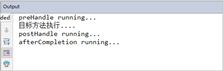


#### 2.5.4 拦截器方法说明

| **方法名**        | **说明**                                                     |
| ----------------- | ------------------------------------------------------------ |
| preHandle()       | **方法将在请求处理之前进行调用**，该方法的返回值是布尔值Boolean类型的，当它返回为false  时，表示请求结束，后续的Interceptor  和Controller  都不会再执行；当返回值为true 时就会继续调用下一个Interceptor  的preHandle 方法 |
| postHandle()      | **该方法是在当前请求进行处理之后被调用**，前提是**preHandle 方法的返回值为true** 时才能被调用，**且它会在DispatcherServlet 进行视图返回渲染之前被调用**，所以我们可以在这个方法中对Controller  处理之后的ModelAndView 对象进行操作 |
| afterCompletion() | **该方法将在整个请求结束之后**，也就是在DispatcherServlet 渲染了对应的视图之后执行，前提是**preHandle 方法的返回值为true** 时才能被调用 |


#### 2.5.5 多拦截器操作

类似FilterChain的工作方式：

所有Interceptor和目标资源执行在同一个线程中，都使用同一个Request、Response和ModelAndView对象

多个Filter执行时，按配置文件顺序执行

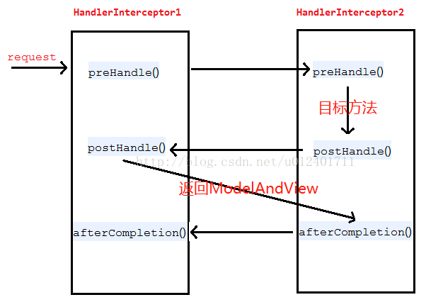


### 2.6 SpringMVC异常处理机制

#### 2.6.1 异常处理的方式

- 系统中异常包括两类：**预期异常**和**运行时异常RuntimeException**，前者通过捕获异常从而获取异常信息，后者主要通过规范代码开发、测试等手段减少运行时异常的发生。

- 系统的**Dao**、**Service**、**Controller**出现都通过throws Exception向上抛出，最后由SpringMVC前端控制器交由异常处理器进行异常处理，如下图：

  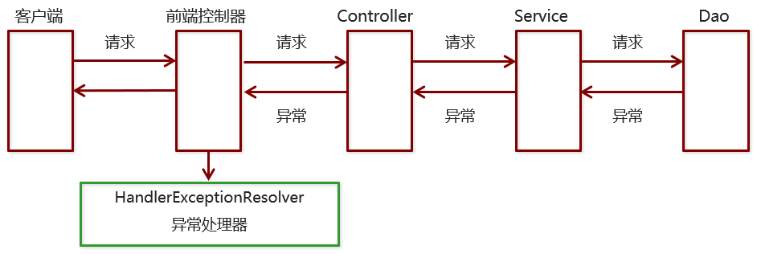

- 异常处理有两种方式：
  - 使用Spring MVC提供的简单异常处理器SimpleMappingExceptionResolver
  - 实现Spring的异常处理接口HandlerExceptionResolver 自定义自己的异常处理器


#### 2.6.2 简单异常处理器SimpleMappingExceptionResolver

SpringMVC已经定义好了该类型转换器，在使用时可以根据项目情况进行相应异常与视图的映射在spring-mvc.xml中配置：

```xml
<!--配置异常处理器-->
<bean class="org.springframework.web.servlet.handler.SimpleMappingExceptionResolver">
    <!--只配置一个属性即为通用的-->
    <!--<property name="defaultErrorView" value="error"/>-->
    <property name="exceptionMappings">
        <map>
            <!--key：异常类型  value：错误视图名称路径（视图解析器）-->
            <entry key="java.lang.ClassCastException" value="error1"/>
            <entry key="com.itheima.exception.MyException" value="error2"/>
        </map>
    </property>
</bean>
```


#### 2.6.3 自定义异常处理器

①创建异常处理器类实现HandlerExceptionResolver

```java
package com.itheima.resolver;

public class MyExceptionResolver implements HandlerExceptionResolver {

    /*
        参数Exception：异常对象
        返回值ModelAndView：跳转到错误视图信息
     */
    public ModelAndView resolveException(HttpServletRequest httpServletRequest, HttpServletResponse httpServletResponse, Object o, Exception e) {
        ModelAndView modelAndView = new ModelAndView();

        if(e instanceof MyException){
            modelAndView.addObject("info","自定义异常");
        } else if (e instanceof ClassCastException) {
            modelAndView.addObject("info", "类转换异常");
        } else {
            modelAndView.addObject("info", "其他异常");
        }
		//（视图解析器）/error.jsp
        modelAndView.setViewName("error");

        return modelAndView;
    }
}
```

②配置异常处理器

在spring-mvc.xml中配置，加入spring容器中根据其实现了HandlerExceptionResolver接口而识别异常处理器：

```xml
<!--自定义异常处理器-->
<bean class="com.itheima.resolver.MyExceptionResolver"/>
```

③编写异常页面error.jsp

```jsp
<%@ page contentType="text/html;charset=UTF-8" language="java" %>
<html>
<head>
    <title>Title</title>
</head>
<body>
    <h1>通用的错误提示页面</h1>
    <h1>${info}</h1>
</body>
</html>
```


## 三、MyBatis

### 3.1 MyBatis简介

#### 3.1.1 原始jdbc操作

- 查询数据：

  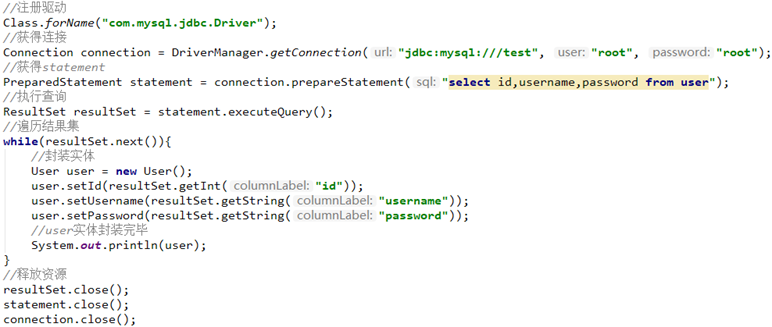

- 插入数据：

  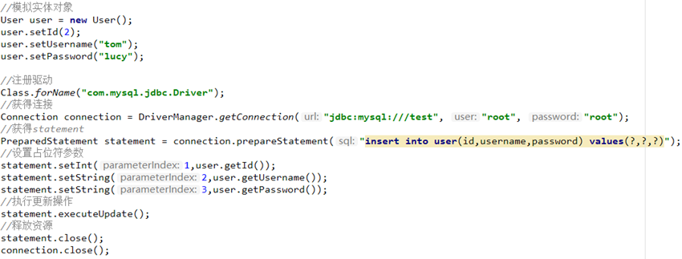

- 原始jdbc开发存在的问题如下：

  ①数据库连接创建、释放频繁造成系统资源浪费从而影响系统性能

  ②sql 语句在代码中硬编码，造成代码不易维护，实际应用 sql 变化的可能较大，sql 变动需要改变java代码。

  ③查询操作时，需要手动将结果集中的数据手动封装到实体中。插入操作时，需要手动将实体的数据设置到sql语句的占位符位置

- 应对上述问题给出的解决方案：

  ①使用数据库连接池初始化连接资源

  ②将sql语句抽取到xml配置文件中

  ③使用反射、内省等底层技术，自动将实体与表进行属性与字段的自动映射


#### 3.1.2 MyBatis介绍

- MyBatis 是一个优秀的基于java的持久层框架，它**内部封装了jdbc**，使开发者只需要关注sql语句本身，而不需要花费精力去处理加载驱动、创建连接、创建statement等繁杂的过程。
- MyBatis通过xml或注解的方式将要执行的各种 statement配置起来，并通过java对象和statement中sql的动态参数进行**映射生成最终执行的sql语句**。
- 最后MyBatis框架执行sql并将结果映射为java对象并返回。采用ORM（Object Relational Mapping）思想解决了实体和数据库映射的问题，对jdbc 进行了封装，屏蔽了jdbc api 底层访问细节，使我们不用与jdbc api 打交道，就可以完成对数据库的持久化操作。


### 3.2 MyBatis开发步骤

①添加MyBatis的坐标和其他相关坐标

```xml
<dependency>
      <groupId>mysql</groupId>
      <artifactId>mysql-connector-java</artifactId>
      <version>5.1.32</version>
    </dependency>
<dependency>
  <groupId>org.MyBatis</groupId>
  <artifactId>MyBatis</artifactId>
  <version>3.4.6</version>
</dependency>
```

②创建user数据表，编写User实体类 

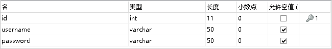

```java
public class User {
    private int id;
    private String username;
    private String password;
    ...
}
```

③编写映射文件UserMapper.xml

resources文件夹下的com.kiki.mapper.UserMapper.xml

```xml
<?xml version="1.0" encoding="UTF-8" ?>
<!DOCTYPE mapper PUBLIC "-//MyBatis.org//DTD Mapper 3.0//EN" "http://MyBatis.org/dtd/MyBatis-3-mapper.dtd">

<mapper namespace="userMapper">
    <!--查询操作-->
    <!--<select id="findAll" resultType="com.kiki.domain.User">-->
    <select id="findAll" resultType="user">
        select * from user
    </select>
    <!--插入操作-->
    <select id="save" parameterType="com.kiki.domain.User">
        insert into user values (#{id},#{username},#{password})
    </select>
    <!--修改操作-->
    <select id="update" parameterType="com.kiki.domain.User">
        update user set username=#{username},password=#{password} where id=#{id}
    </select>
    <!--删除操作-->
    <!--<select id="delete" parameterType="java.lang.Integer">-->
    <select id="delete" parameterType="int">
        delete from user where id=#{id}
    </select>
</mapper>
```

④编写核心文件SqlMapConfig.xml

```xml
<?xml version="1.0" encoding="UTF-8" ?>
<!DOCTYPE configuration PUBLIC "-//MyBatis.org//DTD Config 3.0//EN" "http://MyBatis.org/dtd/MyBatis-3-config.dtd">

<configuration>


    <!--加载外部properties-->
    <properties resource="jdbc.properties"/>

    <!--自定义别名(有放置顺序要求)-->
    <typeAliases>
        <typeAlias type="com.kiki.domain.User" alias="user"/>
    </typeAliases>

    <!--数据源环境-->
    <!--指定默认的环境-->
    <environments default="development">
        <!--指定当前环境名称-->
        <environment id="development">
            <!--事务管理器  类型是JDBC-->
            <transactionManager type="JDBC"></transactionManager>
            <!--数据源-->
            <dataSource type="POOLED">
                <property name="driver" value="${jdbc.driver}"/>
                <property name="url" value="${jdbc.url}"/>
                <property name="username" value="${jdbc.username}"/>
                <property name="password" value="${jdbc.password}"/>
            </dataSource>
        </environment>
    </environments>

    <!--加载映射文件-->
    <mappers>
        <mapper resource="com.kiki.mapper/UserMapper.xml"/>
    </mappers>
    


</configuration>
```

⑤测试

```java
public class MyTest {

    private SqlSession sqlSession;

    @Before
    public void before() throws IOException {
        //获得核心配置文件
        InputStream resourceAsStream = Resources.getResourceAsStream("sqlMapConfig.xml");
        //获得session工厂对象
        SqlSessionFactory sqlSessionFactory = new SqlSessionFactoryBuilder().build(resourceAsStream);
        //获得session会话对象
        sqlSession = sqlSessionFactory.openSession();
    }
    
    @Test
    //删除操作
    public void test3() throws IOException {


        //执行操作
        sqlSession.update("userMapper.delete", 1);
        //MyBatis执行更新操作需要提交事务
        sqlSession.commit();
        //释放资源
        sqlSession.close();
    }

    @Test
    //修改操作
    public void test2() throws IOException {

        //模拟User对象
        User user = new User();
        user.setId(1);
        user.setUsername("Hds");
        user.setPassword("543435");

        //获得核心配置文件
        InputStream resourceAsStream = Resources.getResourceAsStream("sqlMapConfig.xml");
        //获得session工厂对象
        SqlSessionFactory sqlSessionFactory = new SqlSessionFactoryBuilder().build(resourceAsStream);
        //获得session会话对象
        SqlSession sqlSession = sqlSessionFactory.openSession();
        //执行操作
        sqlSession.update("userMapper.update", user);
        //MyBatis执行更新操作需要提交事务
        sqlSession.commit();
        //释放资源
        sqlSession.close();
    }

    @Test
    //插入操作
    public void test1() throws IOException {

        //模拟User对象
        User user = new User();
        user.setUsername("Hds");
        user.setPassword("543435");

        //获得核心配置文件
        InputStream resourceAsStream = Resources.getResourceAsStream("sqlMapConfig.xml");
        //获得session工厂对象
        SqlSessionFactory sqlSessionFactory = new SqlSessionFactoryBuilder().build(resourceAsStream);
        //获得session会话对象
        SqlSession sqlSession = sqlSessionFactory.openSession(true);
        //执行操作
        sqlSession.insert("userMapper.save", user);
        //MyBatis执行更新操作需要提交事务(openSession(true)则不需要)
        //sqlSession.commit();
        //释放资源
        sqlSession.close();
    }

    @Test
    //查询操作
    public void test() throws IOException {
        //获得核心配置文件
        InputStream resourceAsStream = Resources.getResourceAsStream("sqlMapConfig.xml");
        //获得session工厂对象
        SqlSessionFactory sqlSessionFactory = new SqlSessionFactoryBuilder().build(resourceAsStream);
        //获得session会话对象
        SqlSession sqlSession = sqlSessionFactory.openSession();
        //执行操作
        List<User> userList = sqlSession.selectList("userMapper.findAll");
        //打印数据
        System.out.println(userList);
        //释放资源
        sqlSession.close();
    }
}
```


### 3.3 MyBatis的映射文件

#### 3.3.1 基本映射文件

xml映射文件在resources下的路径要和对应mapper接口在java下的路径一致

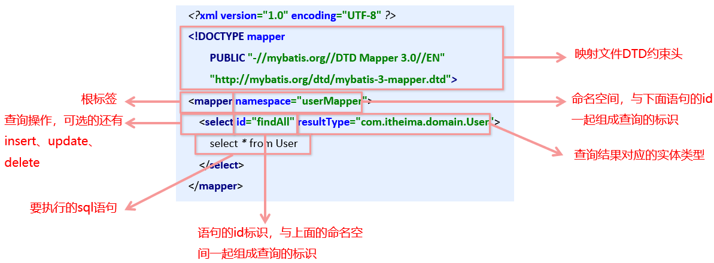


#### 3.3.2 动态sql语句

- 动态 SQL 之\<if> 

  根据实体类的不同取值，使用不同的 SQL语句来进行查询。比如在 id如果不为空时可以根据id查询，如果username 不同空时还要加入用户名作为条件（parameter为User对象）。

  ```xml
  <?xml version="1.0" encoding="UTF-8" ?>
  <!DOCTYPE mapper PUBLIC "-//MyBatis.org//DTD Mapper 3.0//EN" "http://MyBatis.org/dtd/MyBatis-3-mapper.dtd">
  <mapper namespace="com.itheima.mapper.UserMapper">
  
      <!--sql语句抽取-->
      <sql id="selectUser">select * from user</sql>
  
  
      <select id="findByCondition" parameterType="user" resultType="user">
          <include refid="selectUser"></include>
          /*select * from user*/
          /*where根据参数的存在与否标签动态生成后面的sql语句*/
          <where>
              <if test="id!=0">
                  and id=#{id}
              </if>
              <if test="username!=null">
                  and username=#{username}
              </if>
              <if test="password!=null">
                  and password=#{password}
              </if>
          </where>
      </select>
  
  </mapper>
  ```

- 动态SQL之\<foreach> 

  循环执行sql的拼接操作，例如：SELECT * FROM USER WHERE id IN (1,2,5)。

  foreach标签的属性含义如下：

  ​	\<foreach>标签用于遍历集合，它的属性：

  ​	•collection：代表要遍历的集合元素，注意编写时不要写#{}

  ​	•open：代表语句的开始部分

  ​	•close：代表结束部分

  ​	•item：代表遍历集合的每个元素，生成的变量名

  ​	•sperator：代表分隔符

  ```xml
  <?xml version="1.0" encoding="UTF-8" ?>
  <!DOCTYPE mapper PUBLIC "-//MyBatis.org//DTD Mapper 3.0//EN" "http://MyBatis.org/dtd/MyBatis-3-mapper.dtd">
  <mapper namespace="com.itheima.mapper.UserMapper">
  
      <!--sql语句抽取-->
      <sql id="selectUser">select * from user</sql>
  
      <!--select * from user where id in (1,2,3,4)-->
      <select id="findByIds" parameterType="list" resultType="user">
          select * from user
          <where>
              <foreach collection="list" open="id in(" close=")" item="id" separator=",">
                  #{id}
              </foreach>
          </where>
      </select>
  
  </mapper>
  ```

  

### 3.4 MyBatis的核心配置文件

#### 3.4.1 层级关系


#### 3.4.2 environments标签

数据库环境的配置，支持多环境配置

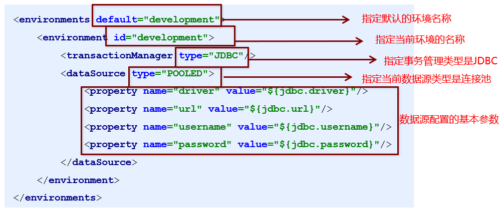

- 其中，事务管理器（transactionManager）类型有两种：
  - **JDBC**：这个配置就是直接使用了JDBC 的提交和回滚设置，它依赖于从数据源得到的连接来管理事务作用域。
  - MANAGED：这个配置几乎没做什么。它从来不提交或回滚一个连接，而是让容器来管理事务的整个生命周期（比如 JEE 应用服务器的上下文）。 默认情况下它会关闭连接，然而一些容器并不希望这样，因此需要将 closeConnection 属性设置为 false 来阻止它默认的关闭行为。

- 其中，数据源（dataSource）类型有三种：
  - UNPOOLED：这个数据源的实现只是每次被请求时打开和关闭连接。
  - **POOLED**：这种数据源的实现利用“池”的概念将 JDBC 连接对象组织起来。
  - JNDI：这个数据源的实现是为了能在如 EJB 或应用服务器这类容器中使用，容器可以集中或在外部配置数据源，然后放置一个 JNDI 上下文的引用。


#### 3.4.3 mapper标签(mappers子标签)

该标签的作用是加载映射的，加载方式有如下几种：

**使用相对于类路径的资源引用（相对于resources文件夹），例如：**

```xml
<mapper resource="com/kiki/mapper/UserMapper.xml"/>
```

使用完全限定资源定位符（URL），例如：

```xml
<mapper url="file:///var/mappers/AuthorMapper.xml"/>
```

使用映射器接口实现类的完全限定类名，例如：

```xml
<mapper class="org.MyBatis.builder.AuthorMapper"/>
```

将包内的映射器接口实现全部注册为映射器，例如：

```xml
<package name="org.MyBatis.builder"/>
```


#### 3.4.4 Properties标签

实际开发中，习惯将数据源的配置信息单独抽取成一个properties文件，该标签可以加载额外配置的properties文件

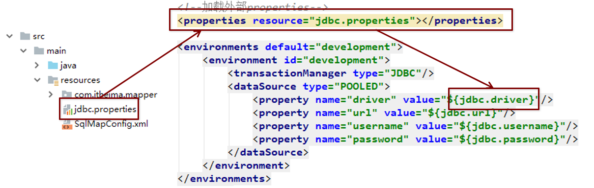


#### 3.4.5 typeAliases标签

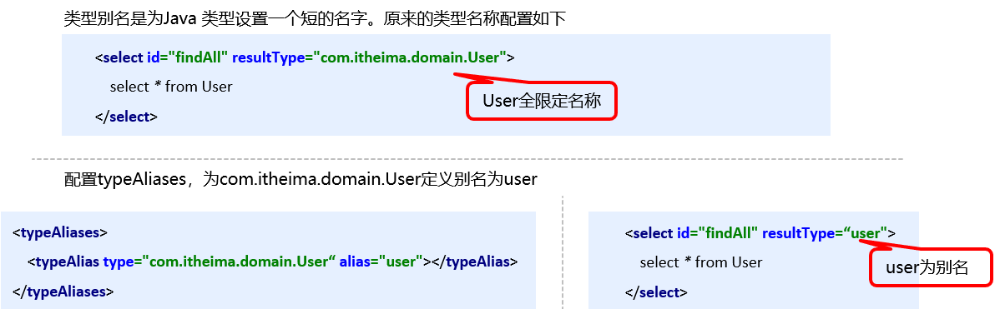

MyBatis框架已经为我们设置好的一些常用的类型的别名：

| **别名** | **数据类型** |
| -------- | ------------ |
| string   | String       |
| long     | Long         |
| int      | Integer      |
| double   | Double       |
| boolean  | Boolean      |
| …  …     | …  …         |


#### 3.4.6 typeHandlers标签

可以重写类型处理器或创建你自己的类型处理器来处理不支持的或非标准的类型。具体做法为：实现 org.apache.ibatis.type.TypeHandler 接口， 或继承一个很便利的类 org.apache.ibatis.type.BaseTypeHandler， 然后可以选择性地将它映射到一个JDBC类型。例如需求：一个Java中的Date数据类型，我想将之存到数据库的时候存成一个1970年至今的毫秒数，取出来时转换成java的Date，即**java的Date与数据库的varchar毫秒值之间转换**。

开发步骤：

①定义转换类继承类BaseTypeHandler\<T>

②覆盖4个未实现的方法，其中setNonNullParameter为java程序设置数据到数据库的回调方法，getNullableResult为查询时 mysql的字符串类型转换成 java的Type类型的方法

```java
public class DateTypeHandler extends BaseTypeHandler<Date> {
    //将java类型 转换成 数据库需要的类型
    public void setNonNullParameter(PreparedStatement preparedStatement, int i, Date date, JdbcType jdbcType) throws SQLException {
        long time = date.getTime();
        preparedStatement.setLong(i, time);
    }

    //将数据库中类型 转化为 Java类型
    //String参数 要转换的字段名称
    //ResultSet 查询出的结果集
    public Date getNullableResult(ResultSet resultSet, String s) throws SQLException {
        //获得结果集中的数据（Long）转化为Date类型返回
        long aLong = resultSet.getLong(s);
        Date date = new Date(aLong);
        return date;
    }

    //将数据库中类型 转化为 Java类型
    //String参数 要转换的字段索引
    public Date getNullableResult(ResultSet resultSet, int i) throws SQLException {
        long aLong = resultSet.getLong(i);
        Date date = new Date(aLong);
        return date;
    }

    //将数据库中类型 转化为 Java类型
    public Date getNullableResult(CallableStatement callableStatement, int i) throws SQLException {
        long aLong = callableStatement.getLong(i);
        Date date = new Date(aLong);
        return date;
    }
}
```

③在MyBatis核心配置文件sqlMapConfig.xml中进行注册

```xml
<!--注册自定义类型处理器-->
<typeHandlers>
    <typeHandler handler="com.itheima.handler.DateTypeHandler"/>
</typeHandlers>
```

④测试转换是否正确


#### 3.4.7 plugins标签(分页)

MyBatis可以使用第三方的插件来对功能进行扩展，分页助手PageHelper是将分页的复杂操作进行封装，使用简单的方式即可获得分页的相关数据

开发步骤：

①导入通用PageHelper的坐标

```xml
<dependency>
    <groupId>com.github.pagehelper</groupId>
    <artifactId>pagehelper</artifactId>
    <version>3.7.5</version>
</dependency>
<dependency>
    <groupId>com.github.jsqlparser</groupId>
    <artifactId>jsqlparser</artifactId>
    <version>0.9.1</version>
</dependency>
```

②在MyBatis核心配置文件中配置PageHelper插件

```xml
<!--配置分页助手插件  配置在加载映射文件之前-->
<plugins>
    <plugin interceptor="com.github.pagehelper.PageHelper">
        <!--指定方言-->
        <property name="dialect" value="mysql"/>
    </plugin>
</plugins>
```

③测试分页数据获取

```java
@Test
//分页插件测试
public void test3() throws IOException {
    InputStream resourceAsStream = Resources.getResourceAsStream("sqlMapConfig.xml");
    SqlSessionFactory sqlSessionFactory = new SqlSessionFactoryBuilder().build(resourceAsStream);
    SqlSession sqlSession = sqlSessionFactory.openSession();
    UserMapper mapper = sqlSession.getMapper(UserMapper.class);

    //设置分页相关参数  当前页+每页显示的条数
    //第一页，每页显示三条
    PageHelper.startPage(1, 3);

    List<User> userList = mapper.findAll();
    for (User user : userList) {
        System.out.println(user);
    }

    //获得与分页相关的数据(参数为查询到的数据）
    PageInfo<User> pageInfo = new PageInfo<>(userList);
    System.out.println("当前页：" + pageInfo.getPageNum());
    System.out.println("每页显示条数：" + pageInfo.getPageSize());
    System.out.println("总条数：" + pageInfo.getTotal());
    System.out.println("总页数：" + pageInfo.getPages());
    System.out.println("上一页：" + pageInfo.getPrePage());
    System.out.println("下一页：" + pageInfo.getNextPage());
    System.out.println("是否是首页：" + pageInfo.isIsFirstPage());
    System.out.println("是否是末页：" + pageInfo.isIsLastPage());

    sqlSession.close();
}
```


### 3.5 MyBatis对应API

#### 3.5.1 SqlSession工厂构建器SqlSessionFactoryBuilder

常用API：SqlSessionFactory build(InputStream inputStream)

通过加载MyBatis的核心文件的输入流的形式构建一个SqlSessionFactory对象

```java
//获得核心配置文件
InputStream resourceAsStream = Resources.getResourceAsStream("sqlMapConfig.xml");
//通过工厂构建器获得session工厂对象
SqlSessionFactory sqlSessionFactory = new SqlSessionFactoryBuilder().build(resourceAsStream);
```

其中， Resources 工具类，这个类在 **org.apache.ibatis.io** 包中。Resources 类帮助你从类路径下、文件系统或一个 web URL 中加载资源文件。


#### 3.5.2 SqlSession工厂对象SqlSessionFactory

SqlSessionFactory 有多个个方法创建 SqlSession 实例。常用的有如下两个：

| **方法**                         | **解释**                                                     |
| -------------------------------- | ------------------------------------------------------------ |
| openSession()                    | 会默认开启一个事务，但事务不会自动提交，也就意味着需要手动提交该事务，更新操作数据才会持久化到数据库中 |
| openSession(boolean  autoCommit) | 参数为是否自动提交，如果设置为true，那么不需要手动提交事务   |


#### 3.5.3 SqlSession会话对象

SqlSession 实例在 MyBatis 中是非常强大的一个类。在这里你会看到所有执行语句、提交或回滚事务和获取映射器实例的方法。

执行语句的方法主要有：

```java
<T> T selectOne(String statement, Object parameter);
<E> List<E> selectList(String statement, Object parameter);
int insert(String statement, Object parameter);
int update(String statement, Object parameter);
int delete(String statement, Object parameter);
```

操作事务的方法主要有：

```java
void commit();	//MyBatis执行更新操作需要提交事务(openSession(true)则不需要)
void rollback();
```


### 3.6 MyBatis中Dao层实现

#### 3.6.1 传统开发方式

编写UserDao接口，编写UserDaoImpl实现


#### 3.6.2 代理开发方式

Mapper 接口开发方法**只需要编写Mapper 接口**（相当于Dao 接口），由MyBatis 框架根据接口定义创建接口的动态代理对象，代理对象的方法体同上边Dao接口实现类方法。

Mapper 接口开发需要遵循以下规范：

1、 Mapper.xml文件中的namespace与mapper接口的全限定名相同

2、 Mapper接口方法名和Mapper.xml中定义的每个statement的id相同

3、 Mapper接口方法的输入参数类型和mapper.xml中定义的每个sql的parameterType的类型相同

4、 Mapper接口方法的输出参数类型和mapper.xml中定义的每个sql的resultType的类型相同

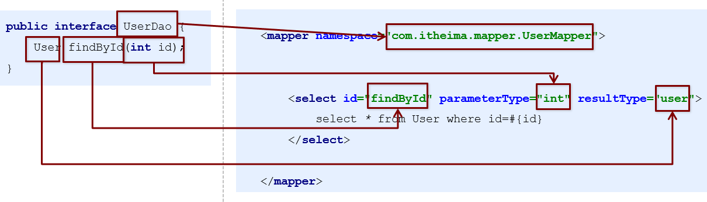


#### 3.6.3 MyBatis多表操作

##### (1) 一对一查询

用户表和订单表的关系为，一个用户有多个订单，一个订单只从属于一个用户

一对一查询的需求：查询一个订单，与此同时查询出该订单所属的用户

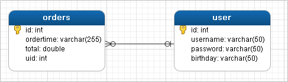

对应的sql语句：select * from orders o,user u where o.uid=u.id;

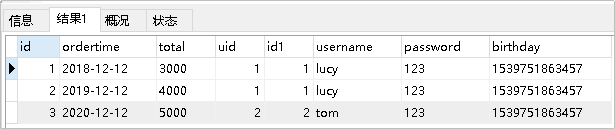

对应接口方法：List\<Order> findAll();

- **配置OrderMapper.xml：**

  ```xml
  <?xml version="1.0" encoding="UTF-8" ?>
  <!DOCTYPE mapper PUBLIC "-//MyBatis.org//DTD Mapper 3.0//EN" "http://MyBatis.org/dtd/MyBatis-3-mapper.dtd">
  <mapper namespace="com.itheima.mapper.OrderMapper">
  
      <resultMap id="orderMap" type="order">
          <!--手动指定字段与实体属性的映射关系
          column：数据表的字段名称
          property：实体的属性名称
          -->
          <id column="oid" property="id"/>
          <result column="ordertime" property="ordertime"/>
          <result column="total" property="total"/>
  
          <!--方法一-->
          <!--<result column="uid" property="user.id"/>
          <result column="username" property="user.username"/>
          <result column="password" property="user.password"/>
          <result column="birthday" property="user.birthday"/>-->
  
          <!--另外一种方法
          property：当前实体（Order）中的属性名称（private User user）
          javaType：当前实体（Order）中的属性类型（User）
          -->
          <association property="user" javaType="user">
              <id column="uid" property="id"/>
              <result column="username" property="username"/>
              <result column="password" property="password"/>
              <result column="birthday" property="birthday"/>
          </association>
      </resultMap>
  
      <select id="findAll" resultMap="orderMap">
           SELECT *,o.id oid FROM orders o,USER u WHERE o.uid=u.id
      </select>
  
  </mapper>
  ```

##### (2) 一对多查询

用户表和订单表的关系为，一个用户有多个订单，一个订单只从属于一个用户

一对多查询的需求：查询一个用户，与此同时查询出该用户具有的订单


对应的sql语句：select *,o.id oid from user u left join orders o on u.id=o.uid;


对应接口方法：List\<User> findAll();

- **配置UserMapper.xml：**

  ```xml
  <?xml version="1.0" encoding="UTF-8" ?>
  <!DOCTYPE mapper PUBLIC "-//MyBatis.org//DTD Mapper 3.0//EN" "http://MyBatis.org/dtd/MyBatis-3-mapper.dtd">
  <mapper namespace="com.itheima.mapper.UserMapper">
  
      <resultMap id="userMap" type="user">
          <id column="uid" property="id"/>
          <result column="username" property="username"/>
          <result column="password" property="password"/>
          <result column="birthday" property="birthday"/>
          <!--配置集合信息
          properties：集合名称
          ofType：当前集合中的数据类型
          -->
          <collection property="orderList" ofType="order">
              <!--封装order的数据-->
              <id column="oid" property="id"/>
              <result column="ordertime" property="ordertime"/>
              <result column="total" property="total"/>
          </collection>
      </resultMap>
  
      <select id="findAll" resultMap="userMap">
          select *,o.id oid from user u,orders o where u.id=o.id
      </select>
  
  </mapper>
  ```

##### (3) 多对多查询

用户表和角色表的关系为，一个用户有多个角色，一个角色被多个用户使用

多对多查询的需求：查询用户同时查询出该用户的所有角色


对应的sql语句：select u.*, r.\*, r.id rid from user u left join user_role ur on u.id=ur.user_id

 inner join role r on ur.role_id=r.id;

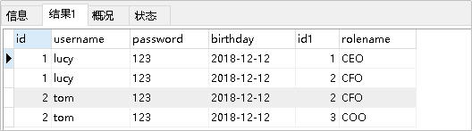

对应接口方法：List\<User> findAllUserAndRole();

- **配置UserMapper.xml：**

  ```xml
  <?xml version="1.0" encoding="UTF-8" ?>
  <!DOCTYPE mapper PUBLIC "-//MyBatis.org//DTD Mapper 3.0//EN" "http://MyBatis.org/dtd/MyBatis-3-mapper.dtd">
  <mapper namespace="com.itheima.mapper.UserMapper">
  
      <resultMap id="userRoleMap" type="user">
          <!--user的信息-->
          <id column="userId" property="id"/>
          <result column="username" property="username"/>
          <result column="password" property="password"/>
          <result column="birthday" property="birthday"/>
          <!--user内部roleList的信息-->
          <collection property="roleList" ofType="role">
              <id column="roleId" property="id"/>
              <result column="roleName" property="roleName"/>
              <result column="roleDesc" property="roleDesc"/>
          </collection>
      </resultMap>
      
      <select id="findUserAndRoleAll" resultMap="userRoleMap">
          select * from user u,sys_user_role ur,sys_role r where u.id=ur.userid and ur.roleid=r.id
      </select>
  
  </mapper>
  ```


### 3.7 MyBatis注解开发

- 1、将各个mapper对应的映射文件全部以注解的形式写到mapper接口中去：

  @Insert：实现新增

  @Update：实现更新

  @Delete：实现删除

  @Select：实现查询

  @Result：实现结果集封装

  @Results：可以与@Result 一起使用，封装多个结果集

  | **注解** | **说明**                                                     |
  | -------- | ------------------------------------------------------------ |
  | @Results | 代替的是标签\<resultMap>该注解中可以使用单个@Result注解，也可以使用@Result集合。使用格式：@Results（{@Result（），@Result（）}）或@Results（@Result（）） |
  | @Resut   | 代替了\<id>标签和\<result>标签  @Result中属性介绍：  column：数据库的列名  property：需要装配的属性名  one：需要使用的@One  注解（@Result（one=@One）（）））  many：需要使用的@Many  注解（@Result（many=@many）（））） |

  @One：实现一对一结果集封装

  @Many：实现一对多结果集封装

  | **注解**          | **说明**                                                     |
  | ----------------- | ------------------------------------------------------------ |
  | @One  （一对一）  | 代替了\<assocation>  标签，是多表查询的关键，在注解中用来指定子查询返回单一对象。  @One注解属性介绍：  select:  指定用来多表查询的  sqlmapper  使用格式：@Result(column="  ",property="",one=@One(select="")) |
  | @Many  （多对一） | 代替了\<collection>标签,  是是多表查询的关键，在注解中用来指定子查询返回对象集合。  使用格式：@Result(property="",column="",many=@Many(select="")) |

- 2、修改MyBatis的核心配置文件，加载使用了注解的Mapper接口

  ```xml
  <!--加载映射关系-->
  <mappers>
      <!--扫描使用注解的类-->
      <!--<mapper class="com.itheima.mapper.UserMapper"></mapper>-->
      <!--或指定接口所在的包-->
      <package name="com.itheima.mapper"></package>
  </mappers>
  ```

- 3、修改各mapper接口

  - OrderMapper

    ```java
    public interface OrderMapper {
    
    
    
        @Select("select * from orders where uid=#{uid}")
        public List<Order> findByUid(int uid);
    
        //一对一查询（Order对User）方式二：两张表分开查
        @Select("select * from orders")
        @Results({
                @Result(column = "id",property = "id"),
                @Result(column = "ordertime",property = "ordertime"),
                @Result(column = "total",property = "total"),
                @Result(
                        javaType = User.class, //要封装的实体类型
                        //根据order表中的这个字段去查询user表的数据（作为UserMapper.findById的参数）
                        column = "uid",
                        property = "user", //要封装的属性名称
                        //select属性 代表查询UserMapper接口的findById方法获得数据
                        one = @One(select = "com.itheima.mapper.UserMapper.findById")
                )
        })
        public List<Order> findAll();
    
        /*//一对一查询（Order对User）方式一：两张表一起查
        @Select("select *,o.id oid from orders o,user u where o.uid=u.id")
        @Results({  //@Results替代标签resultMap
                //@Result替代标签id和result
                @Result(column = "oid",property = "id"),
                @Result(column = "ordertime",property = "ordertime"),
                @Result(column = "total",property = "total"),
                @Result(column = "uid",property = "user.id"),
                @Result(column = "username",property = "user.username"),
                @Result(column = "password",property = "user.password")
        })
        public List<Order> findAll();*/
    
    }
    ```

  - UserMapper

    ```java
    public interface UserMapper {
    
        @Insert(value = "insert into user values(#{id},#{username},#{password},#{birthday})")
        public void save(User user);
    
        @Update("update user set username=#{username},password=#{password} where id=#{id}")
        public void update(User user);
    
        @Delete("delete from user where id=#{id}")
        public void delete(int id);
    
        @Select("select * from user where id=#{id}")
        public User findById(int id);
    
        @Select("select * from user")
        public List<User> findAll();
    
        //一对多查询（User对Order）
        //select * from user u,orders o where u.id=o.id;
        @Select("select * from user")
        @Results({  //替代标签resultMap
                //替代标签id和result
                @Result(id = true, column = "id",property = "id"),  //表明是主键id(标签id)
                @Result(column = "username",property = "username"),
                @Result(column = "password",property = "password"),
                @Result(
                        javaType = List.class,
                        //根据user表中的这个字段去查询order表的数据，作为OrderMapper.findByUid的参数
                        column = "id",
                        property = "orderList",
                        many = @Many(select = "com.itheima.mapper.OrderMapper.findByUid")
                )
        })
        public List<User> findUserAndOrderAll();
    
    
        //多对多查询（User对Role）
        //select * from user u,sys_user_role ur,sys_role r where u.id=ur.userid and ur.roleid=r.id;
        @Select("select * from user")
        @Results({
                @Result(id = true,column = "id",property = "id"),
                @Result(column = "username",property = "username"),
                @Result(column = "password",property = "password"),
                @Result(
                        javaType = List.class,
                        //根据user表中的这个字段作为RoleMapper.findByUid的参数
                        column = "id",
                        property = "roleList",
                        many = @Many(select = "com.itheima.mapper.RoleMapper.findByUid")
                )
        })
        public List<User> findUserAndRoleAll();
    ```

  - RoleMapper

    ```java
    public interface RoleMapper {
    
        @Select("SELECT * FROM sys_user_role ur,sys_role r WHERE ur.roleId=r.id AND ur.userId=#{uid}")
        public List<Role> findByUid(int uid);
    
    }
    ```

    

## 四、SSM整合

### 4.1 原始整合方式

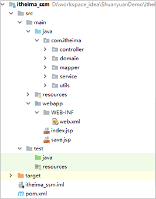

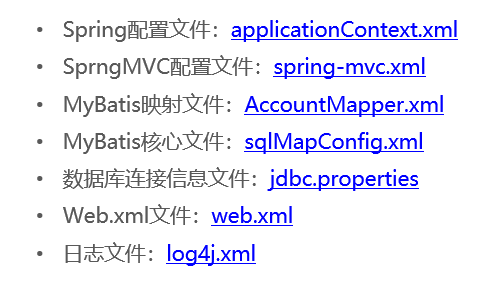


### 4.2 Spring整合MyBatis

**在service层**，MyBatis需要通过sqlSession工厂对象获取sqlSession会话对象，再执行操作，执行完操作后，提交事务在释放资源

```java
//获得核心配置文件
InputStream resourceAsStream = Resources.getResourceAsStream("sqlMapConfig.xml");
//获得session工厂对象
SqlSessionFactory sqlSessionFactory = new SqlSessionFactoryBuilder().build(resourceAsStream);
//获得session会话对象
SqlSession sqlSession = sqlSessionFactory.openSession();
//执行操作
sqlSession.update("userMapper.update", user);
//MyBatis执行更新操作需要提交事务
sqlSession.commit();
//释放资源
sqlSession.close();
```

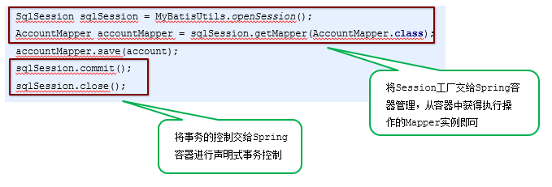

- **1、将SqlSessionFactory配置到Spring容器中，即MyBatis核心配置文件sqlMapConfig.xml中的加载properties文件、环境搭建转移到spring配置文件applicationContext中的加载properties文件、配置数据源信息与配置sessionFactory这个bean，同时sqlMapConfig.xml简化为sqlMapConfig-spring.xml（作为sessionFactory这个bean的属性之一）**

- **2、扫描Mapper，让Spring容器产生Mapper实现类，即MyBatis核心配置文件sqlMapConfig.xml中的加载mapper映射转化为spring配置文件applicationContext中的配置MapperScannerConfigurer这个bean**

- **3、配置声明式事务控制，切点为service层下的所有实现类的所有方法**


### 4.3 整合后的示例文件

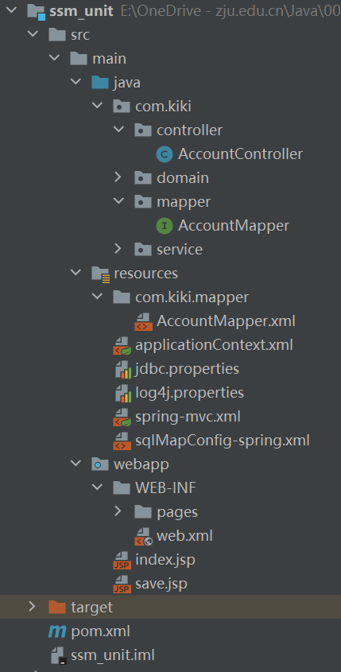

#### web.xml

```xml
<?xml version="1.0" encoding="UTF-8"?>
<web-app version="3.0" xmlns="http://java.sun.com/xml/ns/javaee"
         xmlns:xsi="http://www.w3.org/2001/XMLSchema-instance"
         xsi:schemaLocation="http://java.sun.com/xml/ns/javaee http://java.sun.com/xml/ns/javaee/web-app_3_0.xsd">


  <!--spring监听器-->
  <context-param>
    <param-name>contextConfigLocation</param-name>
    <param-value>classpath:applicationContext.xml</param-value>
  </context-param>
  <listener>
    <listener-class>org.springframework.web.context.ContextLoaderListener</listener-class>
  </listener>

  <!--springMVC前端控制器-->
  <servlet>
    <servlet-name>DispatcherServlet</servlet-name>
    <servlet-class>org.springframework.web.servlet.DispatcherServlet</servlet-class>
    <init-param>
      <param-name>contextConfigLocation</param-name>
      <param-value>classpath:spring-mvc.xml</param-value>
    </init-param>
    <load-on-startup>1</load-on-startup>
  </servlet>
  <servlet-mapping>
    <servlet-name>DispatcherServlet</servlet-name>
    <url-pattern>/</url-pattern>
  </servlet-mapping>


  <!--乱码过滤器-->
  <filter>
    <filter-name>CharacterEncodingFilter</filter-name>
    <filter-class>org.springframework.web.filter.CharacterEncodingFilter</filter-class>
    <init-param>
      <param-name>encoding</param-name>
      <param-value>UTF-8</param-value>
    </init-param>
  </filter>
  <filter-mapping>
    <filter-name>CharacterEncodingFilter</filter-name>
    <url-pattern>/*</url-pattern>
  </filter-mapping>

</web-app>
```

#### applicationContext.xml

```xml
<?xml version="1.0" encoding="UTF-8" ?>
<beans xmlns="http://www.springframework.org/schema/beans"
       xmlns:xsi="http://www.w3.org/2001/XMLSchema-instance"
       xmlns:aop="http://www.springframework.org/schema/aop"
       xmlns:tx="http://www.springframework.org/schema/tx"
       xmlns:context="http://www.springframework.org/schema/context"
       xsi:schemaLocation="http://www.springframework.org/schema/beans
http://www.springframework.org/schema/beans/spring-beans.xsd
http://www.springframework.org/schema/tx
http://www.springframework.org/schema/tx/spring-tx.xsd
http://www.springframework.org/schema/aop
http://www.springframework.org/schema/aop/spring-aop.xsd
http://www.springframework.org/schema/context
http://www.springframework.org/schema/context/spring-context.xsd">


    <!--组件扫描，扫描service和mapper-->
    <context:component-scan base-package="com.kiki">
        <!--排除controller的扫描-->
        <context:exclude-filter type="annotation" expression="org.springframework.stereotype.Controller"/>
    </context:component-scan>


    <!--加载properties文件-->
    <context:property-placeholder location="classpath:jdbc.properties"/>

    <!--配置数据源信息-->
    <bean id="dataSource" class="com.mchange.v2.c3p0.ComboPooledDataSource">
        <property name="driverClass" value="${jdbc.driver}"></property>
        <property name="jdbcUrl" value="${jdbc.url}"></property>
        <property name="user" value="${jdbc.username}"></property>
        <property name="password" value="${jdbc.password}"></property>
    </bean>

    <!--配置sessionFactory-->
    <bean id="sqlSessionFactory" class="org.mybatis.spring.SqlSessionFactoryBean">
        <property name="dataSource" ref="dataSource"/>
        <!--加载mybatis核心文件-->
        <property name="configLocation" value="classpath:sqlMapConfig-spring.xml"/>
    </bean>

    <!--扫描mapper所在包 为mapper创建实现类-->
    <bean class="org.mybatis.spring.mapper.MapperScannerConfigurer">
        <property name="basePackage" value="com.kiki.mapper"/>
    </bean>


    <!--声明式事务控制-->
    <!--平台事务管理器-->
    <bean id="transactionManager" class="org.springframework.jdbc.datasource.DataSourceTransactionManager">
        <property name="dataSource" ref="dataSource"/>
    </bean>

    <!--配置事务增强-->
    <tx:advice id="txAdvice">
        <tx:attributes>
            <tx:method name="*"/>
        </tx:attributes>
    </tx:advice>

    <!--事务的aop织入-->
    <aop:config>
        <aop:advisor advice-ref="txAdvice" pointcut="execution(* com.kiki.service.impl.*.*(..))"/>
    </aop:config>


</beans>
```

#### sqlMapConfig-spring.xml

```xml
<?xml version="1.0" encoding="UTF-8" ?>
<!DOCTYPE configuration
        PUBLIC "-//mybatis.org//DTD Config 3.0//EN"
        "http://mybatis.org/dtd/mybatis-3-config.dtd">
<configuration>


    <!--定义别名-->
    <typeAliases>
        <!--<typeAlias type="com.kiki.domain.Account" alias="account"/>-->
        <!--该包下所有实体都设置别名，为实体名称或者小写实体名称-->
        <package name="com.kiki.domain"/>
    </typeAliases>


</configuration>
```

#### com.kiki.mapper.AccountMapper.xml

```xml
<?xml version="1.0" encoding="UTF-8" ?>
<!DOCTYPE mapper
        PUBLIC "-//mybatis.org//DTD Mapper 3.0//EN"
        "http://mybatis.org/dtd/mybatis-3-mapper.dtd">

<mapper namespace="com.kiki.mapper.AccountMapper">

    <insert id="save" parameterType="account">
        insert into account values (#{id},#{name},#{money})
    </insert>

    <select id="findAll" resultType="account">
        select * from account
    </select>

</mapper>
```

#### spring-mvc.xml

```xml
<?xml version="1.0" encoding="UTF-8" ?>
<beans xmlns="http://www.springframework.org/schema/beans"
       xmlns:mvc="http://www.springframework.org/schema/mvc"
       xmlns:context="http://www.springframework.org/schema/context"
       xmlns:xsi="http://www.w3.org/2001/XMLSchema-instance"
       xsi:schemaLocation="http://www.springframework.org/schema/beans
http://www.springframework.org/schema/beans/spring-beans.xsd
http://www.springframework.org/schema/mvc
http://www.springframework.org/schema/mvc/spring-mvc.xsd
http://www.springframework.org/schema/context
http://www.springframework.org/schema/context/spring-context.xsd">


    <!--组件扫描，主要扫描controller-->
    <context:component-scan base-package="com.kiki.controller"/>

    <!--配置mvc的注解驱动-->
    <mvc:annotation-driven/>

    <!--内部资源视图解析器-->
    <bean id="resourceViewResolver" class="org.springframework.web.servlet.view.InternalResourceViewResolver">
        <!--前缀-->
        <property name="prefix" value="/WEB-INF/"/>
        <!--后缀-->
        <property name="suffix" value=".jsp"/>
    </bean>

    <!--开放静态资源访问权限-->
    <mvc:default-servlet-handler/>

</beans>
```

#### jdbc.properties

```properties
jdbc.driver=com.mysql.jdbc.Driver
jdbc.url=jdbc:mysql://localhost:3306/ssm
jdbc.username=root
jdbc.password=123456
```

#### log4j.properties

```properties
### direct log messages to stdout ###
log4j.appender.stdout=org.apache.log4j.ConsoleAppender
log4j.appender.stdout.Target=System.err
log4j.appender.stdout.layout=org.apache.log4j.PatternLayout
log4j.appender.stdout.layout.ConversionPattern=%d{ABSOLUTE} %5p %c{1}:%L - %m%n

### direct messages to file mylog.log ###
log4j.appender.file=org.apache.log4j.FileAppender
log4j.appender.file.File=c:/mylog.log
log4j.appender.file.layout=org.apache.log4j.PatternLayout
log4j.appender.file.layout.ConversionPattern=%d{ABSOLUTE} %5p %c{1}:%L - %m%n

### set log levels - for more verbose logging change 'info' to 'debug' ###
### 日志级别，优先级从高到低分别是 ERROR、WARN、INFO、DEBUG
log4j.rootLogger=debug, stdout
```

#### pom.xml

```xml
<?xml version="1.0" encoding="UTF-8"?>

<project xmlns="http://maven.apache.org/POM/4.0.0" xmlns:xsi="http://www.w3.org/2001/XMLSchema-instance"
  xsi:schemaLocation="http://maven.apache.org/POM/4.0.0 http://maven.apache.org/xsd/maven-4.0.0.xsd">
  <modelVersion>4.0.0</modelVersion>

  <groupId>org.example</groupId>
  <artifactId>ssm_unit</artifactId>
  <version>1.0-SNAPSHOT</version>
  <packaging>war</packaging>

  <properties>
    <project.build.sourceEncoding>UTF-8</project.build.sourceEncoding>
    <maven.compiler.source>1.8</maven.compiler.source>
    <maven.compiler.target>1.8</maven.compiler.target>
  </properties>


  <dependencies>
    <!--spring相关-->
    <dependency>
      <groupId>org.springframework</groupId>
      <artifactId>spring-context</artifactId>
      <version>5.0.5.RELEASE</version>
    </dependency>
    <dependency>
      <groupId>org.aspectj</groupId>
      <artifactId>aspectjweaver</artifactId>
      <version>1.8.7</version>
    </dependency>
    <dependency>
      <groupId>org.springframework</groupId>
      <artifactId>spring-jdbc</artifactId>
      <version>5.0.5.RELEASE</version>
    </dependency>
    <dependency>
      <groupId>org.springframework</groupId>
      <artifactId>spring-tx</artifactId>
      <version>5.0.5.RELEASE</version>
    </dependency>
    <dependency>
      <groupId>org.springframework</groupId>
      <artifactId>spring-test</artifactId>
      <version>5.0.5.RELEASE</version>
    </dependency>
    <dependency>
      <groupId>org.springframework</groupId>
      <artifactId>spring-webmvc</artifactId>
      <version>5.0.5.RELEASE</version>
    </dependency>

    <!--servlet和jsp-->
    <dependency>
      <groupId>javax.servlet</groupId>
      <artifactId>servlet-api</artifactId>
      <version>2.5</version>
    </dependency>
    <dependency>
      <groupId>javax.servlet.jsp</groupId>
      <artifactId>jsp-api</artifactId>
      <version>2.0</version>
    </dependency>

    <!--mybatis相关-->
    <dependency>
      <groupId>org.mybatis</groupId>
      <artifactId>mybatis</artifactId>
      <version>3.4.5</version>
    </dependency>
    <dependency>
      <groupId>org.mybatis</groupId>
      <artifactId>mybatis-spring</artifactId>
      <version>1.3.1</version>
    </dependency>
    <dependency>
      <groupId>mysql</groupId>
      <artifactId>mysql-connector-java</artifactId>
      <version>5.1.6</version>
    </dependency>
    <dependency>
      <groupId>c3p0</groupId>
      <artifactId>c3p0</artifactId>
      <version>0.9.1.2</version>
    </dependency>

    <dependency>
      <groupId>junit</groupId>
      <artifactId>junit</artifactId>
      <version>4.12</version>
    </dependency>
    <dependency>
      <groupId>jstl</groupId>
      <artifactId>jstl</artifactId>
      <version>1.2</version>
    </dependency>

  </dependencies>

</project>
```

