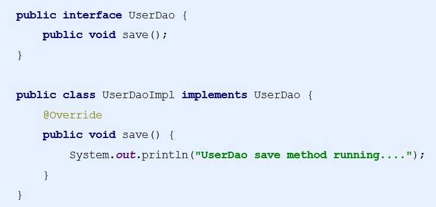
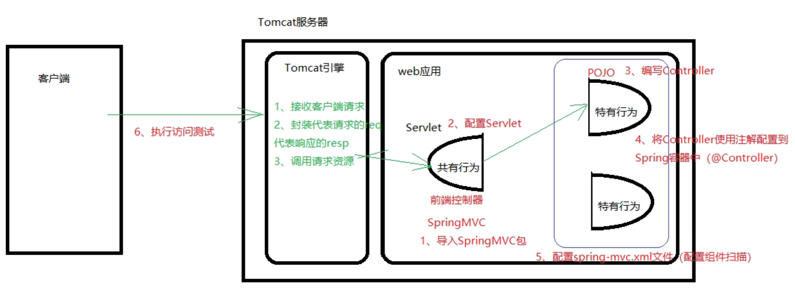
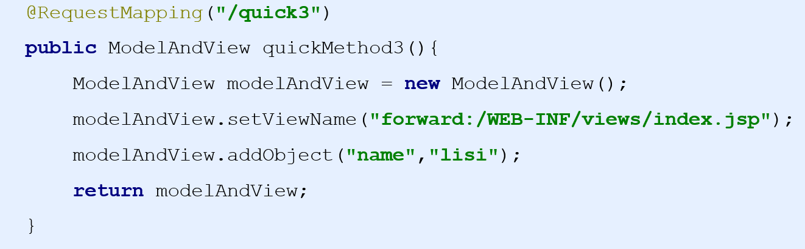
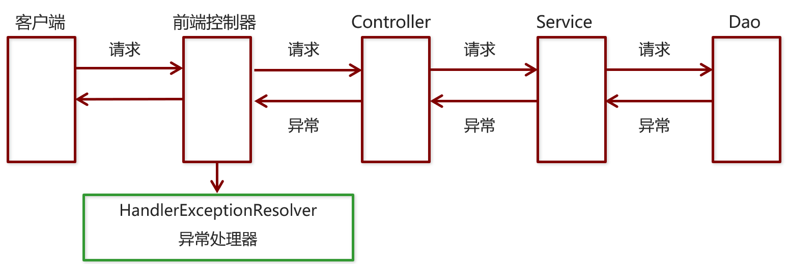
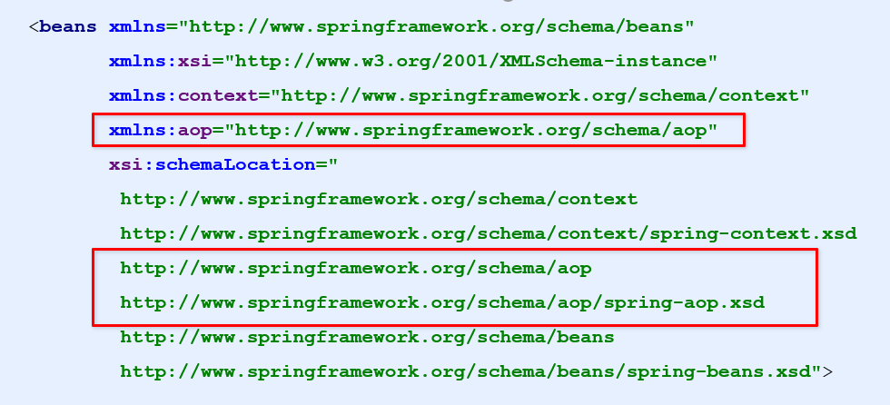
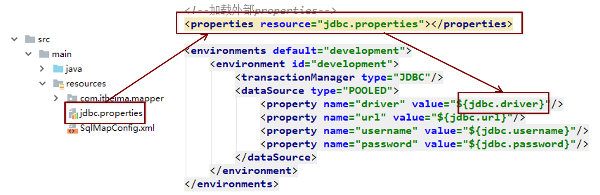
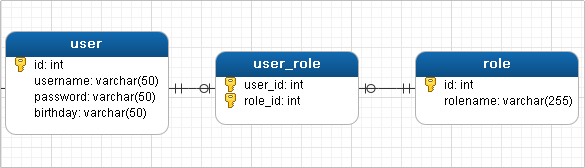
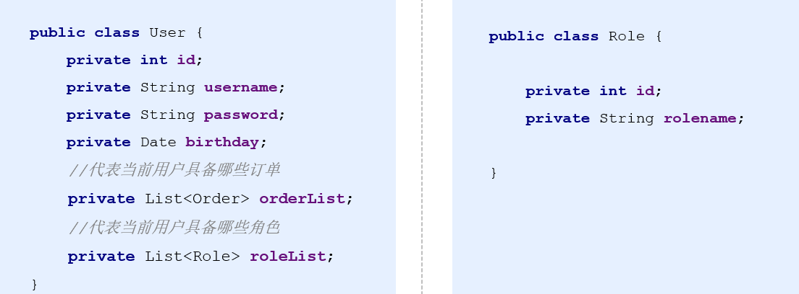

# Spring+SpringMVC+MyBatis---SSM

## 第一章 **Spring**的IoC和DI

### 1、Spring 简介

#### 1.1  Spring是什么

​		Spring是分层的 Java SE/EE应用 full-stack 轻量级开源框架，以 **IoC**（Inverse Of Control：反转控制）和 **AOP**（Aspect Oriented Programming：面向切面编程）为内核。

   	提供了**展现层** **SpringMVC** 和**持久层** **Spring** **JDBCTemplate** 以及**业务层事务管理**等众多的企业级应用技术，还能整合开源世界众多著名的第三方框架和类库，逐渐成为使用最多的Java EE 企业应用开源框架。

#### 1.2 Spring的优势

* **方便解耦，简化开发**

     通过 Spring 提供的 IoC容器，可以将对象间的依赖关系交由 Spring 进行控制，避免硬编码所造成的过度耦合。

     用户也不必再为单例模式类、属性文件解析等这些很底层的需求编写代码，可以更专注于上层的应用

* **AOP** **编程的支持**

     通过 Spring的 AOP 功能，方便进行面向切面编程，许多不容易用传统 OOP 实现的功能可以通过 AOP 轻松实现

* **声明式事务的支持**

     可以将我们从单调烦闷的事务管理代码中解脱出来，通过声明式方式灵活的进行事务管理，提高开发效率和质量。

* **方便程序的测试**

     可以用非容器依赖的编程方式进行几乎所有的测试工作，测试不再是昂贵的操作，而是随手可做的事情

#### 1.3 Spring的体系架构


### 2、Spring快速入门

#### 2.1 Spring程序的开发步骤


* 导入 Spring 开发的基本包坐标
* 编写 Dao 接口和实现类
* 创建 Spring 核心配置文件
* 在 Spring 配置文件中配置 UserDaoImpl
* 使用 Spring 的 API 获得 Bean 实例

#### 2.2 导入Spring开发的基本包坐标

```xml
<dependency>
      <groupId>org.springframework</groupId>
      <artifactId>spring-context</artifactId>
      <version>5.0.5.RELEASE</version>
</dependency>
```

#### 2.3 编写Dao接口和实现类



#### 2.4 创建Spring核心配置文件

【在类路径下（resources）创建applicationContext.xml配置文件】


#### 2.5 在Spring配置文件中配置UserDaoImpl


#### 2.6 使用Spring的API获得Bean实例


### 3、Spring配置文件

#### 3.1 Bean标签基本配置 

用于配置对象交由**Spring** 来创建。

默认情况下它调用的是类中的**无参构造函数**，如果没有无参构造函数则不能创建成功。

基本属性：

* id：Bean实例在Spring容器中的唯一标识
* class：Bean的全限定名称

#### 3.2 Bean标签范围配置 

**scope**：指对象的作用范围，取值如下： 


【**Bean**标签范围配置】

* 1）当scope的取值为singleton时

  ​		Bean的实例化个数：1个

  ​		Bean的实例化时机：当Spring核心文件被加载时，实例化配置的Bean实例

  ​		Bean的生命周期：

  ​		     (1) 	对象创建：当应用加载，创建容器时，对象就被创建了

  ​			 (2)	 对象运行：只要容器在，对象一直活着

  ​			 (3)     对象销毁：对象销毁：当应用卸载，销毁容器时，对象就被销毁了

* 2）当scope的取值为prototype时

  ​		Bean的实例化个数：多个

  ​		Bean的实例化时机：当调用getBean()方法时实例化Bean

  ​		Bean的生命周期：

  ​		     (1) 	对象创建：当使用对象时，创建新的对象实例

  ​			 (2)	 对象运行：只要对象在使用中，就一直活着

  ​			 (3)     对象销毁：当对象长时间不用时，被 Java 的垃圾回收器回收了

#### 3.3 Bean生命周期配置

* **init-method**：指定类中的初始化方法名称
* **destroy-method**：指定类中销毁方法名称

#### 3.4 Bean实例化的三种方式

* 无参**构造**方法实例化
* 工厂**静态**方法实例化
* 工厂**实例**方法实例化 

```xml
<!--以下为 无参构造方法的实例化-->
       <!--<bean id="userDao" class="com.itheima.dao.impl.UserDaoImpl"
             scope="prototype" init-method="init" destroy-method="destroy">
       </bean>-->

       <!--以下为静态方法工厂模式-->
      <!-- <bean id="userDao" class="com.itheima.factory.StaticFactory"
             factory-method="getUserDao">
       </bean>-->

       <!--以下为实例方法实例化-->
       <bean id="factory" class="com.itheima.factory.DynamicFactory">
       </bean>
       <bean id="userDao" factory-bean="factory" factory-method="getUserDao"></bean>
```

【工厂静态方法实例化】

​     工厂的静态方法返回Bean实例


【工厂实例方法实例化】

​		工厂的非静态方法返回Bean实例


#### 3.5  Bean的依赖注入入门

①创建 UserService，UserService 内部在调用 UserDao的save() 方法


②将 UserServiceImpl 的创建权交给 Spring


③从 Spring 容器中获得 UserService 进行操作


#### 3.6 Bean的依赖注入分析

​		目前UserService实例和UserDao实例都存在与Spring容器中，当前的做法是在容器外部获得UserService实例和UserDao实例，然后在程序中进行结合。


​		因为UserService和UserDao都在Spring容器中，而最终程序直接使用的是UserService，所以可以在Spring容器中，将UserDao设置到UserService内部。


#### 3.7 Bean的依赖注入概念

* 依赖注入（**Dependency Injection**）：它是 Spring 框架核心 IOC 的具体实现。

* 在编写程序时，通过控制反转，把对象的创建交给了 Spring，但是代码中不可能出现没有依赖的情况。

  IOC 解耦只是降低他们的依赖关系，但不会消除。例如：业务层仍会调用持久层的方法。

* 那这种业务层和持久层的依赖关系，在使用 Spring 之后，就让 Spring 来维护了。

  简单的说，就是坐等框架把持久层对象传入业务层，而不用我们自己去获取。

#### 3.8 Bean的依赖注入方式

**1）set方法注入**

​	  在UserServiceImpl中添加setUserDao方法


  配置Spring容器调用set方法进行注入


P命名空间注入本质也是set方法注入，但比起上述的set方法注入更加方便，主要体现在配置文件中，如下：

首先，需要引入P命名空间：


其次，需要修改注入方式


**2）构造方法注入**

   UserServiceImpl中存在有参构造器

  配置Spring容器调用有参构造时进行注入


**3.9 Bean的依赖注入的数据类型**

**1）普通数据类型的注入**


**2）集合数据类型（List<String>）注入**


**3）集合数据类型（List<User>）注入**


**4)集合数据（Map<String,User>）的注入**


**5）集合数据类型（Properties）的注入**


#### **3.9 引入其他配置文件(分模块开发)**

​		实际开发中，Spring的配置内容非常多，这就导致Spring配置很繁杂且体积很大，所以，可以将部分配置拆解到其他配置文件中，而在Spring主配置文件通过import标签进行加载


#### 3.10 总结知识要点

【**Spring的重点配置**】


### 4、Spring相关API

#### 4.1 ApplicationContext的继承体系

**applicationContext*** 接口类型，代表应用上下文，可以通过其实例获得 Spring 容器中的 Bean 对象


#### 4.2 ApplicationContext的实现类


#### 4.3 getBean()方法的使用


* 其中，当参数的数据类型是字符串时，表示根据Bean的id从容器中获得Bean实例，返回是Object，需要强转。
* 当参数的数据类型是Class类型时，表示根据类型从容器中匹配Bean实例，当容器中相同类型的Bean有多个时，则此方法会报错。


【Spring的重点API】


### 5、Spring配置数据源

#### 5.1 数据源（连接池）的作用

* 数据源(连接池)是提高程序性能如出现的
* 事先实例化数据源，初始化部分连接资源
* 使用连接资源时从数据源中获取
* 使用完毕后将连接资源归还给数据源

   常见的数据源有：DBCP  C3P0 BoneCP Druid d等

#### 5.2 数据源开发步骤

#####  5.2.1 手动创建数据源

【1】导入数据源坐标和数据库驱动坐标 

```xml
	<dependency>
      <groupId>com.mchange</groupId>
      <artifactId>c3p0</artifactId>
      <version>0.9.5.5</version>
    </dependency>
    
    <dependency>
      <groupId>com.alibaba</groupId>
      <artifactId>druid</artifactId>
      <version>1.2.6</version>
    </dependency>
    
    <dependency>
      <groupId>org.springframework</groupId>
      <artifactId>spring-core</artifactId>
      <version>5.0.5.RELEASE</version>
    </dependency>
```

【2】创建Druid连接池  C3P0连接池

```java
 @Test
    public void test2() throws Exception{
        //手动创建Druid数据源
        DruidDataSource dataSource = new DruidDataSource();
        dataSource.setDriverClassName("com.mysql.jdbc.Driver");
        dataSource.setUrl("jdbc:mysql://localhost:3306");
        dataSource.setUsername("root");
        dataSource.setPassword("000328");
        DruidPooledConnection connection = dataSource.getConnection();
        System.out.println(connection);
        connection.close();
    }
```

```java
@Test
    public void test1() throws Exception{
        //手动创建C3P0数据源
        ComboPooledDataSource dataSource = new ComboPooledDataSource();
        dataSource.setDriverClass("com.mysql.jdbc.Driver");
        dataSource.setJdbcUrl("jdbc:mysql://localhost:3306");
        dataSource.setUser("root");
        dataSource.setPassword("000328");
        Connection connection = dataSource.getConnection();
        System.out.println(connection);
        connection.close();
    }
```

【3】提取jdbc.properties配置文件

```properties
jdbc.driver=com.mysql.jdbc.Driver
jdbc.url=jdbc:mysql://localhost:3306
jdbc.user=root
jdbc.password=000328
```

【4】读取jdbc.properties配置文件创建连接池

```java
@Test
    public void test3() throws Exception{
        //测试手动创建C3P0 数据源 加载properties配置文件
        ResourceBundle resourceBundle = ResourceBundle.getBundle("jdbc");
        String driver = resourceBundle.getString("jdbc.driver");
        String url = resourceBundle.getString("jdbc.url");
        String username = resourceBundle.getString("jdbc.user");
        String password = resourceBundle.getString("jdbc.password");
        //创建数据源对象
        ComboPooledDataSource dataSource = new ComboPooledDataSource();
        dataSource.setDriverClass(driver);
        dataSource.setJdbcUrl(url);
        dataSource.setUser(username);
        dataSource.setPassword(password);
        Connection connection = dataSource.getConnection();
        System.out.println(connection);
        connection.close();
    }
```

##### 5.2.2 Spring配置数据源

**可以将DataSource的创建权交由Spring容器去完成**

* DataSource有无参构造方法，而Spring默认就是通过无参构造方法实例化对象的
* DataSource要想使用需要通过set方法设置数据库连接信息，而Spring可以通过set方法进行字符串注入

【1】抽取jdbc配置文件

applicationContext.xml加载jdbc.properties配置文件获得连接信息；

首先，需要引入context命名空间和约束路径：

* 命名空间：**xmlns:**context="http://www.springframework.org/schema/context"
* 约束路径：**http://www.springframework.org/schema/context
              http://www.springframework.org/schema/context/spring-context.xsd**

```xml
<?xml version="1.0" encoding="UTF-8"?>
<beans xmlns="http://www.springframework.org/schema/beans"
       xmlns:context="http://www.springframework.org/schema/context"
       xmlns:xsi="http://www.w3.org/2001/XMLSchema-instance"
       xsi:schemaLocation=
               "http://www.springframework.org/schema/beans http://www.springframework.org/schema/beans/spring-beans.xsd
               http://www.springframework.org/schema/context http://www.springframework.org/schema/context/spring-context.xsd">
    <!--记载外部的properties文件-->
    <context:property-placeholder location="classpath:jdbc.properties"/>

    <bean id="datasourcec3p0" class="com.mchange.v2.c3p0.ComboPooledDataSource">
          <property name="driverClass" value="${jdbc.driver}"/>
          <property name="jdbcUrl" value="${jdbc.url}"/>
          <property name="user" value="${jdbc.user}"/>
          <property name="password" value="${jdbc.password}"/>
      </bean>

    <bean id="datasourcecdruid" class="com.alibaba.druid.pool.DruidDataSource">
        <property name="driverClassName" value="${jdbc.driver}"/>
        <property name="url" value="${jdbc.url}"/>
        <property name="username" value="${jdbc.user}"/>
        <property name="password" value="${jdbc.password}"/>
    </bean>
</beans>
```

【2】测试

```java
    @Test
    public void test4() throws Exception{
        //测试Spring容器产生C3P0数据源对象
        ApplicationContext app = new ClassPathXmlApplicationContext("applicationContext.xml");
        DataSource dataSource = (DataSource) app.getBean("datasourcec3p0");
        Connection connection = dataSource.getConnection();
        System.out.println(connection);
        connection.close();
    }
    @Test
    public void test5() throws Exception{
        //测试Spring容器产生Druid数据源对象
        ApplicationContext app = new ClassPathXmlApplicationContext("applicationContext.xml");
        DataSource dataSource = (DataSource) app.getBean("datasourcecdruid");
        Connection connection = dataSource.getConnection();
        System.out.println(connection);
        connection.close();
    }
```

##### 5.2.3 要点

**Spring**容器加载**properties**文件


### 6、Spring注解开发

#### 6.1 Spring原始注解

【1】Spring原始注解主要是替代<Bean>的配置。


【2】使用注解进行开发时，需要在applicationContext.xml中配置组件扫描，作用是指定哪个包及其子包下的Bean需要进行扫描以便识别使用注解配置的类、字段和方法。

```xml
<!--配置组件扫描-->
    <context:component-scan base-package="com.itheima"/>
```

* 使用@Compont或@Repository标识UserDaoImpl需要Spring进行实例化

```java
/*@Component("userDao")*/
@Repository("userDao")
public class UserDaoImpl implements UserDao{
    public void save() {
        System.out.println("save running");
    }
}
```

* 使用@Compont或@Service标识UserServiceImpl需要Spring进行实例化
* 使用@Autowired或者@Autowired+@Qulifier或者@Resource进行userDao的注入
* 使用@Value进行字符串的注入
* 使用@Scope标注Bean的范围
* 使用@PostConstruct标注初始化方法，使用@PreDestroy标注销毁方法

```java
/*@Component("userService")*/
@Service("userService")
@Scope("singleton")
public class UserServiceImpl implements UserService {
    @Value("${jdbc.driver}")
    private String driver;
    @Autowired //按照数据类型从容器中进行匹配
    @Qualifier("userDao") //按照id值从容器中进行匹配的 此处@Qualfier 结合@Autowired一起使用
    /*@Resource(name="userDao") //@Resource相当于@Qualifier + Autowired*/
    private UserDao userDao;

    public void save() {
        System.out.println(driver);
        userDao.save();
    }
    @PostConstruct
    public void init(){
        System.out.println("service对象初始化方法");
    }
    @PreDestroy
    public void destroy(){
        System.out.println("service对象销毁方法");
    }
}
```

#### 6.2  Spring新注解开发

使用上面的注解还不能全部替代xml配置文件，还需要使用注解替代的配置如下：

* 非自定义的Bean的配置：**<bean>**
* 加载properties文件的配置：**<context:property-placeholder>**
* 组件扫描的配置：**<context:component-scan>**
* 引入其他文件：<import>


【1】新注解第一部分 


【2】新注解第二部分


【3】新注解第三部分

* @bean

```java
 @Bean("dataSource") //Spring会将当前方法的返回值以指定名称存储到Spring容器中
    public DataSource getDataSource() throws PropertyVetoException {
        ComboPooledDataSource dataSource = new ComboPooledDataSource();
        dataSource.setDriverClass(driver);
        dataSource.setJdbcUrl(url);
        dataSource.setUser(username);
        dataSource.setPassword(password);
        return dataSource;
    }
```

#### 6.3 Spring集成Junit

 **Spring集成Junit的步骤**

①导入spring集成Junit的坐标

②使用@Runwith注解替换原来的运行期

③使用@ContextConfiguration指定配置文件或配置类

④使用@Autowired注入需要测试的对象

⑤创建测试方法进行测试

*  导入spring集成Junit的坐标


* 使用@Runwith注解替换原来的运行期


* 使用@ContextConfiguration指定配置文件或配置类


* 使用@Autowired注入需要测试的对象


* 创建测试方法进行测试


---

## 第二章 SpringMVC入门

### 1、Spring与Web环境的集成

​		Spring提供了一个监听器**ContextLoaderListener**就是对上述功能的封装，该监听器内部加载Spring配置文件，创建应用上下文对象，并存储到**ServletContext**域中，提供了一个客户端工具**WebApplicationContextUtils**供使用者获得应用上下文对象

我们需要做两件事情：

* 在web.xml中配置ContextLoaderListener监听器（导入spring-web坐标）
* 使用WebApplicationContextUtils获得应用上下文对象ApplicationContext

【第一步】导入Spring集成Web的坐标

```xml
 <dependency>
      <groupId>org.springframework</groupId>
      <artifactId>spring-web</artifactId>
      <version>5.0.5.RELEASE</version>
 </dependency>
```

【第二步】配置ContextLoaderListener监听器

```xml
<context-param>
        <param-name>contextConfigLocation</param-name>
        <param-value>classpath:applicationContext.xml</param-value>
</context-param>
<listener>
        <listener-class>org.springframework.web.context.ContextLoaderListener</listener-class>
</listener>
```

【第三步】在web层中通过工具类获取上下文对象

```java
public class UserServlet extends HttpServlet {
    @Override
    protected void doGet(HttpServletRequest req, HttpServletResponse resp) throws ServletException, IOException {
        ServletContext servletContext = this.getServletContext();
        //通过WebApplicationContextUtils 获取上下文对象
        WebApplicationContext app = WebApplicationContextUtils.getWebApplicationContext(servletContext);
        UserService userService = app.getBean(UserService.class);
        userService.save();
    }
}
```

### 2、SpringMVC简介

#### 2.1 SpringMVC概述

* **SpringMVC** 是一种基于 Java 的实现 **MVC** **设计模型**的请求驱动类型的轻量级 **Web** **框架**，属于**SpringFrameWork** 的后续产品，已经融合在 Spring Web Flow 中
* SpringMVC 已经成为目前最主流的MVC框架之一，它通过一套注解，让一个简单的 Java 类成为处理请求的控制器，而无须实现任何接口。同时它还支持 **RESTful** 编程风格的请求。


#### 2.2 SpringMVC快速入门

**需求**：客户端发起请求，服务器端接收请求，执行逻辑并进行视图跳转。

**开发步骤**：

①导入SpringMVC相关坐标

②配置SpringMVC核心控制器DispathcerServlet

③创建Controller类和视图页面

④使用注解配置Controller类中业务方法的映射地址

⑤配置SpringMVC核心文件 spring-mvc.xml

⑥客户端发起请求测试



【1、导入SpringMVC相关坐标】

```
<dependency>
      <groupId>org.springframework</groupId>
      <artifactId>spring-webmvc</artifactId>
      <version>5.0.5.RELEASE</version>
</dependency>
```

【2、在web.xml配置SpringMVC的核心控制器】

```xml
 <!--配置SpringMVC的前端控制器-->
    <servlet>
        <servlet-name>DispatcherServlet</servlet-name>
        <servlet-class>org.springframework.web.servlet.DispatcherServlet</servlet-class>

        <init-param>
            <param-name>contextConfigLocation</param-name>
            <param-value>classpath:spring-mvc.xml</param-value>
        </init-param>

        <load-on-startup>1</load-on-startup>
    </servlet>

    <servlet-mapping>
        <servlet-name>DispatcherServlet</servlet-name>
        <url-pattern>/</url-pattern>
    </servlet-mapping>
```

【3、创建Controller类和视图页面】【4、使用注解配置Controller类中业务方法的映射地址】

```java
@Controller
public class UserController {
    @RequestMapping("/quick")
    public String save(){
        System.out.println("controller save running...");
        return "success.jsp";
    }
}
```

【5、配置SpringMVC核心文件 spring-mvc.xml】

```xml
<beans xmlns="http://www.springframework.org/schema/beans"
       xmlns:xsi="http://www.w3.org/2001/XMLSchema-instance"
       xmlns:context="http://www.springframework.org/schema/context"
       xsi:schemaLocation="http://www.springframework.org/schema/beans
                           http://www.springframework.org/schema/beans/spring-beans.xsd
                           http://www.springframework.org/schema/context
                           http://www.springframework.org/schema/context/spring-context.xsd">
    <!--Controller的组件扫描-->
    <context:component-scan base-package="com.itheima.controller"/>
</beans>
```

#### 2.3 流程图示


### 3、SpringMVC组件解析

#### 3.1 SpringMVC的执行流程


①用户发送请求至前端控制器DispatcherServlet。

②DispatcherServlet收到请求调用HandlerMapping处理器映射器。

③处理器映射器找到具体的处理器(可以根据xml配置、注解进行查找)，生成处理器对象及处理器拦截器(如果有则生成)一并返回给DispatcherServlet。

④DispatcherServlet调用HandlerAdapter处理器适配器。

⑤HandlerAdapter经过适配调用具体的处理器(Controller，也叫后端控制器)。

⑥Controller执行完成返回ModelAndView。

⑦HandlerAdapter将controller执行结果ModelAndView返回给DispatcherServlet。

⑧DispatcherServlet将ModelAndView传给ViewReslover视图解析器。

⑨ViewReslover解析后返回具体View。

⑩DispatcherServlet根据View进行渲染视图（即将模型数据填充至视图中）。DispatcherServlet响应用户。

#### 3.2 SpringMVC组件解析

**1.** **前端控制器：**DispatcherServlet

  用户请求到达前端控制器，它就相当于 MVC 模式中的 C，DispatcherServlet 是整个流程控制的中心，由

它调用其它组件处理用户的请求，DispatcherServlet 的存在降低了组件之间的耦合性。

**2.** **处理器映射器：**HandlerMapping

  HandlerMapping 负责根据用户请求找到 Handler 即处理器，SpringMVC 提供了不同的映射器实现不同的

映射方式，例如：配置文件方式，实现接口方式，注解方式等。

**3.** **处理器适配器：**HandlerAdapter

  通过 HandlerAdapter 对处理器进行执行，这是适配器模式的应用，通过扩展适配器可以对更多类型的处理器进行执行。

**4.** **处理器：**Handler

  它就是我们开发中要编写的具体业务控制器。由 DispatcherServlet 把用户请求转发到 Handler。由

Handler 对具体的用户请求进行处理。

**5**. 视图解析器：View Resolver

  View Resolver 负责将处理结果生成 View 视图，View Resolver 首先根据逻辑视图名解析成物理视图名，即具体的页面地址，再生成 View 视图对象，最后对 View 进行渲染将处理结果通过页面展示给用户。

**6.** 视图：View

  SpringMVC 框架提供了很多的 View 视图类型的支持，包括：jstlView、freemarkerView、pdfView等。最常用的视图就是 jsp。一般情况下需要通过页面标签或页面模版技术将模型数据通过页面展示给用户，需要由程序员根据业务需求开发具体的页面

【**@RequestMapping**】

作用：用于建立请求 URL 和处理请求方法之间的对应关系

位置：

* 类上，请求URL 的第一级访问目录。此处不写的话，就相当于应用的根目录

* 方法上，请求 URL 的第二级访问目录，与类上的使用@ReqquestMapping标注的一级目录一起组成访问虚拟路径

属性：

​	**value**：用于指定请求的URL。它和path属性的作用是一样的

​	**method**：用于指定请求的方式

​	**params**：用于指定限制请求参数的条件。它支持简单的表达式。要求请求参数的key和value必须和配置的一模一样

例如：

​	**params** **= {"****accountName****"}**，表示请求参数必须有accountName

​	**params** **= {"moeny!100"}**，表示请求参数中money不能是100

【**MVC命名空间引入**】

```Xml
命名空间：xmlns:context="http://www.springframework.org/schema/context"
        xmlns:mvc="http://www.springframework.org/schema/mvc"
约束地址： http://www.springframework.org/schema/context
         http://www.springframework.org/schema/context/spring-context.xsd
         http://www.springframework.org/schema/mvc 
         http://www.springframework.org/schema/mvc/spring-mvc.xsd

```

【**组件扫描**】

```xml
SpringMVC基于Spring容器，所以在进行SpringMVC操作时，需要将Controller存储到Spring容器中，如果使用@Controller注解标注的话，就需要使用<context:component-scan base-package=“com.itheima.controller"/>进行组件扫描。
```

【**视图解析器**】

SpringMVC有默认组件配置，默认组件都是**DispatcherServlet.properties**配置文件中配置的，该配置文件地址**org/springframework/web/servlet/DispatcherServlet.properties**，该文件中配置了默认的视图解析器，如下：

```
org.springframework.web.servlet.ViewResolver=org.springframework.web.servlet.view.InternalResourceViewResolver
```

翻看该解析器源码，可以看到该解析器的默认设置，如下：

```
REDIRECT_URL_PREFIX = "redirect:"  --重定向前缀
FORWARD_URL_PREFIX = "forward:"    --转发前缀（默认值）
prefix = "";     --视图名称前缀
suffix = "";     --视图名称后缀
```

我们可以通过属性注入的方式修改视图的的前后缀

```xml
<!--配置内部资源视图解析器-->
<bean class="org.springframework.web.servlet.view.InternalResourceViewResolver">   
	<property name="prefix" value="/WEB-INF/views/"></property>   
	<property name="suffix" value=".jsp"></property>
</bean>
```

#### 3.3 知识要点

**SpringMVC**的相关组件

​	•前端控制器：DispatcherServlet

​	•处理器映射器：HandlerMapping

​	•处理器适配器：HandlerAdapter

​	•处理器：Handler

​	•视图解析器：View Resolver

​	•视图：View

**SpringMVC**的注解和配置

​	•请求映射注解：@RequestMapping

​	•视图解析器配置：

​	*REDIRECT_URL_PREFIX = "redirect:"* 

​	FORWARD_URL_PREFIX = "forward:"

​	prefix = "";

​	*suffix = "";*   

## 第三章 SpringMVC的请求和响应

### 3.1 SpringMVC的数据响应

#### 3.1.1 SpringMVC的数据响应方式

1） 页面跳转

* 直接返回字符串

* 通过ModelAndView对象返回


2） 回写数据 

* 直接返回字符串

* 返回对象或集合  

#### 3.1.2 页面跳转

【1】**返回字符串形式**


【2】**返回ModelAndView对象**


【3】**向request域中存储数据**

  ①通过SpringMVC框架注入的request对象setAttribute()方法设置


②通过ModelAndView的addObject()方法设置



#### 3.1.3 回写数据

##### 3.1.3.1 直接返回字符串

1）通过SpringMVC框架注入的response对象，使用response.getWriter().print(“hello world”) 回写数据，此时不需要视图跳转，业务方法返回值为void。

```
@RequestMapping("/quick4")
public void quickMethod4(HttpServletResponse response) throws IOException 
{   
	response.getWriter().print("hello world");
}
```

2）将需要回写的字符串直接返回，但此时需要通过**@ResponseBody**注解告知SpringMVC框架，方法返回的字符串不是跳转是直接在http响应体中返回。

```
@RequestMapping("/quick5")
@ResponseBody
public String quickMethod5() throws IOException 
{    
   return "hello springMVC!!!";
}
```

3）通过jackson转换json格式字符串，回写字符串。

```xml
 <dependency>
      <groupId>com.fasterxml.jackson.core</groupId>
      <artifactId>jackson-core</artifactId>
      <version>2.9.0</version>
    </dependency>
    <dependency>
      <groupId>com.fasterxml.jackson.core</groupId>
      <artifactId>jackson-databind</artifactId>
      <version>2.9.0</version>
    </dependency>
    <dependency>
      <groupId>com.fasterxml.jackson.core</groupId>
      <artifactId>jackson-annotations</artifactId>
      <version>2.9.0</version>
    </dependency>
```

```java
  @RequestMapping(value="/quick8")
    @ResponseBody //告诉SpringMVC框架不进行跳转 直接进行数据响应
    public String save8() throws IOException { //不常用
        User user = new User();
        user.setUsername("durant");
        user.setAge(18);
        //使用json的转换工具 将对象转换成json格式字符串返回
        ObjectMapper objectMapper = new ObjectMapper();
        String json = objectMapper.writeValueAsString(user);
        return json;
    }
```

##### **3.1.3.2 返回对象或集合**

在 SpringMVC 的各个组件中，**处理器映射器**、**处理器适配器**、**视图解析器**称为 SpringMVC 的三大组件。

使用<mvc:annotation-driven>自动加载 RequestMappingHandlerMapping（处理映射器）和RequestMappingHandlerAdapter（ 处 理 适 配 器 ），可用在Spring-xml.xml配置文件中使用<mvc:annotation-driven>替代注解处理器和适配器的配置。同时使用<mvc:annotation-driven>默认底层就会集成jackson进行对象或集合的json格式字符串的转换

```
<!--mvc的注解驱动-->
<mvc:annotation-driven/>
```

```java
@RequestMapping(value="/quick9")
    @ResponseBody //告诉SpringMVC框架不进行跳转 直接进行数据响应
    //SpringMVC自动将User转换成json格式的字符串

    public User save9() throws IOException { //不常用
        User user = new User();
        user.setUsername("durant");
        user.setAge(19);
        return user;
    }
```

### 3.2 SpringMVC获得请求数据

#### 3.2.1 获得请求参数

客户端请求参数的格式是：**name=value&name=value… …**

服务器端要获得请求的参数，有时还需要进行数据的封装，SpringMVC可以接收如下类型的参数：

* 基本类型参数
* POJO类型参数
* 数组类型参数
* 集合类型参数

##### 【获得基本类型参数】

Controller中的业务方法的参数名称要与请求参数的name一致，参数值会自动映射匹配。


##### 【获取POJO类型参数】

Controller中的业务方法的参数名称要与请求参数的name一致，参数值会自动映射匹配。


##### 【获得数组类型参数】

Controller中的业务方法数组名称与请求参数的name一致，参数值会自动映射匹配。


##### 【获得集合类型参数1】

获得集合类型参数，要将集合包装到一个POJO中才可以。

```java
public class VO {
    private List<User> userList;

    public List<User> getUserList() {
        return userList;
    }

    public void setUserList(List<User> userList) {
        this.userList = userList;
    }

    @Override
    public String toString() {
        return "VO{" +
                "userList=" + userList +
                '}';
    }
}
```

```xml
<body>
     <%--${pageContext.request.contextPath}/user/quick14--%>
 <form action="${pageContext.request.contextPath}/user/quick13" method="post">
     <%--表明是第几个User对象的userame age--%>
     <input type="text" name="userList[0].username"><br/>
     <input type="text" name="userList[0].age"><br/>
     <input type="text" name="userList[1].username"><br/>
     <input type="text" name="userList[1].age"><br/>
     <input type="submit" value="提交">
 </form>
</body>
```

```java
 @RequestMapping(value="/quick13")
 @ResponseBody //告诉SpringMVC框架不进行跳转 直接进行数据响应
    //SpringMVC自动将User转换成json格式的字符串
    /**
     * 获取集合类型的请求数据
     */
    public void save13(VO vo) throws IOException { //请求参数名与User对应属性名 相同
        System.out.println(vo);
    }
```

##### 【获取集合类型参数2】

当使用ajax提交时，可以指定contentType为json形式，那么在方法参数位置使用@RequestBody可以直接接收集合数据而无需使用POJO进行包装。

```xml
<head>
    <title>Title</title>
    <script src="pageContext.request.contextPath/js/jQuery-3.3.1.js"></script>
    <script>
        var userList = new Array();
        userList.push({username:"young",age:18});
        userList.push({username:"miniyoung",age:1});
        $.ajax({
            type:"POST",
            url:"pageContext.request.contextPath/user/quick14",
            data:JSON.stringify(userList),
            contentType:"application/json;charset=utf-8"
        });
    </script>
</head>
```

```java
@RequestMapping(value="/quick14")
    @ResponseBody //告诉SpringMVC框架不进行跳转 直接进行数据响应
    //SpringMVC自动将User转换成json格式的字符串
    /**
     * 获取集合类型的请求数据2
     */
    public void save14(@RequestBody List<User> userList) throws IOException { //请求参数名与User对应属性名 相同
        System.out.println(userList);
    }
```

#### 3.2.1 放行指定的静态资源

注意：通过谷歌开发者工具抓包发现，没有加载到jquery文件，原因是SpringMVC的前端控制器DispatcherServlet的url-pattern配置的是/,代表对所有的资源都进行过滤操作，我们可以通过以下两种方式指定放行静态资源：

•在spring-mvc.xml配置文件中指定放行的资源

   <mvc:resources mapping="/js/**" location="/js/"/> 

•使用<mvc:default-servlet-handler/>标签

#### 3.2.3 请求数据乱码问题

当post请求时，数据会出现乱码，我们可以设置一个过滤器来进行编码的过滤

```xml
<!--配置全局过滤的filter过滤器来解决当Post请求时 数据出现乱码的问题-->
    <filter>
        <filter-name>CharacterEncodingFilter</filter-name>
        <filter-class>org.springframework.web.filter.CharacterEncodingFilter</filter-class>
        <init-param>
            <param-name>encoding</param-name>
            <param-value>UTF-8</param-value>
        </init-param>
    </filter>
    <filter-mapping>
        <filter-name>CharacterEncodingFilter</filter-name>
        <url-pattern>/*</url-pattern>
    </filter-mapping>
```

#### 3.2.4 参数绑定注解

当请求的参数名称与Controller的业务方法参数名称不一致时，就需要通过@RequestParam注解显示的绑定。


注解@RequestParam还有如下参数可以使用：

* **value**：与请求参数名称

* **required**：此在指定的请求参数是否必须包括，默认是true，提交时如果没有此参数则报错

* **defaultValue**：当没有指定请求参数时，则使用指定的默认值赋值

```java
@RequestMapping("/quick14")
@ResponseBody
public void quickMethod14(@RequestParam(value="name",required = false,defaultValue = "itcast") String username) throws IOException 
{
   System.out.println(username);
}

```

#### 3.2.5 获得Restful风格的参数

​		Restful是一种软件架构风格、设计风格，而不是标准，只是提供了一组设计原则和约束条件。主要用于客户端和服务器交互类的软件，基于这个风格设计的软件可以更简洁，更有层次，更易于实现缓存机制等。

​		**Restful**风格的请求是使用**“****url+****请求方式”**表示一次请求目的的，HTTP 协议里面四个表示操作方式的动词如下：

​			GET：用于获取资源

​			POST：用于新建资源

​			PUT：用于更新资源

​			DELETE：用于删除资源 

​		例如：

​			/user/1  GET ：    得到 id = 1 的 user

​			/user/1  DELETE： 删除 id = 1 的 user

​			/user/1  PUT：    更新 id = 1 的 user

​			/user    POST：   新增 user

​		上述url地址/user/1中的1就是要获得的请求参数，在SpringMVC中可以使用占位符进行参数绑定。地址/user/1可以写成/user/{id}，占位符{id}对应的就是1的值。在业务方法中我们可以使用@PathVariable注解进行占位符的匹配获取工作。


#### 3.2.6 自定义类型转换器

•SpringMVC 默认已经提供了一些常用的类型转换器，例如客户端提交的字符串转换成int型进行参数设置。

•但是不是所有的数据类型都提供了转换器，没有提供的就需要自定义转换器，例如：日期类型的数据就需要自定义转换器。

自定义类型转换器的开发步骤：

①定义转换器类实现Converter接口

②在配置文件中声明转换器

③在<annotation-driven>中引用转换器

【定义转换器类实现Converter接口】

```java
public class DateConverter implements Converter<String, Date>{

    public Date convert(String dateStr) {
        //将日期字符串转换成日期对象
        SimpleDateFormat format = new SimpleDateFormat("yyyy-MM-dd");
        Date date = null;
        try {
            date = format.parse(dateStr);
        } catch (ParseException e) {
            e.printStackTrace();
        }
        return date;
    }
}
```

【在配置文件中声明转换器】

```
 <!--声明转换器-->
    <bean id="conversionService" class="org.springframework.context.support.ConversionServiceFactoryBean">
        <property name="converters">
            <list>
                <bean class="com.itheima.converter.DateConverter"></bean>
            </list>
        </property>
    </bean>
```

【在<annotation-driven>中引用转换器】

```
<mvc:annotation-driven conversion-service="conversionService"/>
```

#### 3.2.7 获得Servlet相关API

SpringMVC支持使用原始ServletAPI对象作为控制器方法的参数进行注入，常用的对象如下：

* HttpServletRequest

* HttpServletResponse

* HttpSession

```
@RequestMapping("/quick16")
@ResponseBody
public void quickMethod16(HttpServletRequest request,HttpServletResponse response,HttpSession session)
{    
	System.out.println(request);   
	System.out.println(response);   
	System.out.println(session);
}
```

#### 3.2.8 获得请求头

##### 【**@RequestHeader**】

使用@RequestHeader可以获得请求头信息，相当于web阶段学习的request.getHeader(name)

@RequestHeader注解的属性如下：

* value: 请求头的名称
* require：是否必须携带此请求头

```java
 @RequestMapping(value="/quick19")
    @ResponseBody //告诉SpringMVC框架不进行跳转 直接进行数据响应
    //获取请求头
    public void save19(@RequestHeader(value = "User-Agent",required = false) String headerValue) throws IOException {
        System.out.println(headerValue);
    }
```

##### 【**@CookieValue**】

使用@CookieValue可以获得指定Cookie的值

@CookieValue注解的属性如下：

* value：指定Cookie的名称
* required：是否必须携带此Cookie

```java
@RequestMapping(value="/quick20")
    @ResponseBody //告诉SpringMVC框架不进行跳转 直接进行数据响应
    //获取请求头cookie
    public void save20(@CookieValue(value = "JSESSIONID",required = false) String jsession) throws IOException {
        System.out.println(jsession);
    }
```

#### 3.2.9 文件上传

* 表单项type=“file”

* 表单的提交方式是post

* 表单的enctype属性是多部分表单形式，及enctype=“multipart/form-data”


**文件上传原理**


#### 3.2.10 单文件上传步骤

①导入fileupload和io坐标

②配置文件上传解析器

③编写文件上传代码

【导入fileupload和io坐标】

```xml
<dependency>
      <groupId>commons-fileupload</groupId>
      <artifactId>commons-fileupload</artifactId>
      <version>1.3.1</version>
    </dependency>
    <dependency>
      <groupId>commons-io</groupId>
      <artifactId>commons-io</artifactId>
      <version>2.3</version>
    </dependency>
```

【配置上传解析器】

```xml
 <!--配置文件上传解析器-->
    <bean id="commonsMultipartResolver" class="org.springframework.web.multipart.commons.CommonsMultipartResolver">
        <!--上传文件的总大小-->
        <property name="maxUploadSize" value="52428000000"/>
        <!--上传单个文件的大小-->
        <property name="maxUploadSizePerFile" value="5242800000"/>
        <!--上传文件的编码类型-->
        <property name="defaultEncoding" value="UTF-8"/>
    </bean>
```

【编写文件上传代码】

```java
@RequestMapping(value="/quick21")
    @ResponseBody //告诉SpringMVC框架不进行跳转 直接进行数据响应
    //单个文件上传实现
    public void save21(String username, MultipartFile uploadFile) throws IOException {
        System.out.println(username);
        System.out.println(uploadFile);
        //获得文件名称
        /*String originalFilename = upload.getOriginalFilename();*/
        //保存文件
        /*upload.transferTo(new File("C:\\upload\\"+originalFilename));*/
    }
```

#### 3.2.11 多文件上传实现

多文件上传，只需要将页面修改为多个文件上传项，将方法参数MultipartFile类型修改为MultipartFile[]即可


#### 3.2.12 知识要点

**MVC实现数据请求的方式**

* 基本类型参数

* POJO类型参数

* 数组类型参数

* 集合类型参数

**MVC获取数据细节**

* 中文乱码问题

* @RequestParam 和 @PathVariable 

* 自定义类型转换器

* 获得Servlet相关API

* @RequestHeader 和 @CookieValue

* 文件上传

---

## 第四章 JdbcTemplate

### 4.1 JdbcTemplate概述

​		它是spring框架中提供的一个对象，是对原始繁琐的Jdbc API对象的简单封装。spring框架为我们提供了很多的操作模板类。例如：操作关系型数据的JdbcTemplate和HibernateTemplate，操作nosql数据库的RedisTemplate，操作消息队列的JmsTemplate等等。

### 4.2 JdbcTemplate开发步骤

【导入spring-jdbc和spring-tx坐标】


【创建数据库表和实体】


【Spring产生JdbcTemplate对象】

我们可以将JdbcTemplate的创建权交给Spring，将数据源DataSource的创建权也交给Spring，在Spring容器内部将数据源DataSource注入到JdbcTemplate模版对象中，配置如下：


【执行数据库操作】

**添加操作**


**修改操作**


**删除和查询全部操作**


**查询单个数据操作操作**


---

## 第五章  Spring MVC 拦截器

### 5.1 拦截器的作用

​			Spring MVC 的**拦截器**类似于 Servlet 开发中的过滤器 Filter，用于对处理器进行**预处理**和**后处理** ，将拦截器按一定的顺序联结成一条链，这条链称为**拦截器链（**Interceptor Chain**）**。在访问被拦截的方法或字段时，拦截器链中的拦截器就会按其之前定义的顺序被调用。拦截器也是AOP思想的具体实现。

### 5.2 拦截器与过滤器的区别


### 5.3 自定义拦截器入门

【①创建拦截器类实现HandlerInterceptor接口】

```java
public class MyInterception1 implements HandlerInterceptor {
    //在目标方法执行之前
    public boolean preHandle(HttpServletRequest request, HttpServletResponse response, Object handler) throws Exception {
        System.out.println("preHandle方法执行");
        String param = request.getParameter("param");
        if("yes".equals(param)){
            return true;
        }else{
            request.getRequestDispatcher("/error.jsp").forward(request,response);
            return false;
        }
    }
    //目标方法执行之后 视图返回之前执行
    public void postHandle(HttpServletRequest request, HttpServletResponse response, Object handler, ModelAndView modelAndView) throws Exception {
        modelAndView.addObject("name", "itheima");
        System.out.println("postHandle方法执行");

    }
    //在整个流程都执行完毕后 执行
    public void afterCompletion(HttpServletRequest request, HttpServletResponse response, Object handler, Exception ex) throws Exception {
        System.out.println("afterCompletion方法执行");

    }
}
```

【②配置拦截器】

在spring-mvc.xml文件中配置拦截器

```xml
<mvc:interceptors>
        <mvc:interceptor>
            <!--对哪些资源进行拦截-->
            <mvc:mapping path="/**"/>
            <bean class="com.itheima.interceptor.MyInterception1"/>
        </mvc:interceptor>
 </mvc:interceptors>
```

【③测试拦截器的拦截效果（编写目标方法）】

在controller中测试

```java
@Controller
public class TargetControl {
    @RequestMapping(value = "/target")
    public ModelAndView show(){
        System.out.println("目标资源执行......");
        ModelAndView modelAndView = new ModelAndView();
        modelAndView.addObject("name", "itcast");
        modelAndView.setViewName("index");
        return modelAndView;
    }
}
```

### 5.4 配置多个拦截器

```xml
<!--配置拦截器-->
    <mvc:interceptors>
        <mvc:interceptor>
            <!--对哪些资源进行拦截-->
            <mvc:mapping path="/**"/>
            <bean class="com.itheima.interceptor.MyInterception1"/>
        </mvc:interceptor>
        <mvc:interceptor>
            <!--对哪些资源进行拦截-->
            <mvc:mapping path="/**"/>
            <bean class="com.itheima.interceptor.MyInterception2"/>
        </mvc:interceptor>
    </mvc:interceptors>
```

```java
public class MyInterception2 implements HandlerInterceptor {
    //在目标方法执行之前
    public boolean preHandle(HttpServletRequest request, HttpServletResponse response, Object handler) throws Exception {
        System.out.println("preHandle2222方法执行");
        return true;
    }
    //目标方法执行之后 视图返回之前执行
    public void postHandle(HttpServletRequest request, HttpServletResponse response, Object handler, ModelAndView modelAndView) throws Exception {
        System.out.println("postHandle2222方法执行");

    }
    //在整个流程都执行完毕后 执行
    public void afterCompletion(HttpServletRequest request, HttpServletResponse response, Object handler, Exception ex) throws Exception {
        System.out.println("afterCompletion2222方法执行");

    }
}
```

测试结果：


执行结果类似于Filer链；

---

## 第六章 异常处理机制

### 6.1 异常处理的思路

系统中的异常包括两大类：

* 预期异常
* 运行时异常 RuntimeException

系统的**Dao**、**Service**、**Controller**出现都通过throws Exception向上抛出，最后由SpringMVC前端控制器交由异常处理器进行异常处理，如下图



### 6.2 异常处理的两种方式

* 使用Spring MVC 提供的简单异常处理器SimpleMappingExceptionResolver
* 实现Spring的异常处理接口HandlerExceptionResolver

### 6.3  简单异常处理器

Spring MVC 已经定义好了该类型转换器，在使用时可以根据项目的的情况进行相应视图和异常的映射配置


### 6.4 自定义异常处理步骤

①创建异常处理器类实现HandlerExceptionResolver

②配置异常处理器

③编写异常页面

④测试异常跳转

【创建异常处理类实现】

```java
public class MyExceptionResolver implements HandlerExceptionResolver {
    /*
        参数Exception：异常对象
        返回值ModelAndView：跳转到错误视图信息
     */
    public ModelAndView resolveException(HttpServletRequest httpServletRequest, HttpServletResponse httpServletResponse, Object o, Exception e) {
        ModelAndView modelAndView = new ModelAndView();
        if(e instanceof Myexception){
            modelAndView.addObject("info","自定义异常");
            modelAndView.setViewName("error2");
            return modelAndView;
        }else if(e instanceof FileNotFoundException){
            modelAndView.addObject("info","文件找不到的异常");
            modelAndView.setViewName("error1");
            return modelAndView;
        }
        modelAndView.setViewName("error");
        return modelAndView;
    }
}
```

【配置异常处理器】

在spring-mvc.xml文件中配置异常处理器

```xml
  <!--自定义异常处理器-->
    <bean class="com.itheima.resolver.MyExceptionResolver"/>
```

【编辑异常页面】

```xml

<%@ page contentType="text/html;charset=UTF-8" language="java" %>
<html>
<head>
    <title>Title</title>
</head>
<body>
    <h1>自定义异常</h1>
    <h2>${info}</h2>
</body>
</html>
```

【测试异常跳转】

```java
@Controller
public class DemoController {
    @Autowired
    private DemoService demoService;
    @RequestMapping(value = "/show")
    public String show() throws FileNotFoundException, Myexception {
        System.out.println("show running......");
        //demoService.show1();
        //demoService.show2();
        //demoService.show3();
        //demoService.show4();
        demoService.show5();
        return "index";
    }
}
```

---

## 第七章 面向切面编程AOP

### 7.1 AOP简介

#### 7.1.1 AOP简介

* **AOP** 为 **A**spect **O**riented **P**rogramming 的缩写，意思为面向切面编程，是通过预编译方式和运行期动态代理实现程序功能的统一维护的一种技术
* 利用AOP可以对业务逻辑的各个部分进行隔离，从而使得业务逻辑各部分之间的耦合度降低，提高程序的可重用性，同时提高了开发的效率

#### 7.1.2AOP作用及其优势

* 作用：在程序运行期间，在不修改源码的情况下对方法进行功能增强
* 优势：减少重复代码，提高开发效率，并且便于维护

#### 7. 1.3 AOP底层实现

​		AOP 的底层是通过 Spring 提供的的动态代理技术实现的。在运行期间，Spring通过动态代理技术动态的生成代理对象，代理对象方法执行时进行增强功能的介入，在去调用目标对象的方法，从而完成功能的增强。

#### 7.1.4 AOP动态代理技术

* JDK 代理 : 基于接口的动态代理技术
* cglib 代理：基于父类的动态代理技术


#### 7.1.5 JDK动态代理

【目标类接口】TargetInterface

```java
public interface TargetInterface {
    public void save();
}
```

【目标类】Target

```java
public class Target implements TargetInterface{

    public void save() {
        System.out.println("save running");
    }
}
```

【增强类】Advcie

```java
public class Advice {
    public void before(){
        System.out.println("前置增强...");
    }
    public void after(){
        System.out.println("后置增强...");
    }
}
```

【动态代理代码】

```java
public class ProxyTest {
    public static void main(String[] args) {
        //创建目标对象
        final Target target = new Target();
        //获得增强对象
        final Advice advice = new Advice();
        //返回值就是动态生成的代理对象
        TargetInterface proxy = (TargetInterface) Proxy.newProxyInstance(target.getClass().getClassLoader(), target.getClass().getInterfaces(), new InvocationHandler() {
            public Object invoke(Object proxy, Method method, Object[] args) throws Throwable {
                //前置增强
                advice.before();
                //执行目标方法
                method.invoke(target, args);
                //后置增强
                advice.after();
                return null;
            }
        });
        //调用代理对象的方法
        proxy.save();
    }
}
```

#### 7.1.6 cglib动态代理

【目标类】Target

```java
public class Target {
    public void save(){
        System.out.println("save running");
    }
}
```

【增强类】Advice

```

```

【动态代理代码】

```java
public class ProxyTest {
    public static void main(String[] args) {
        //创建目标对象
        final com.itheima.proxy.jdk.Target target = new Target();
        //获得增强对象
        final com.itheima.proxy.jdk.Advice advice = new Advice();
        //返回值就是动态生成的代理对象 基于cglib
        //1、创建增强器
        Enhancer enhancer = new Enhancer();
        //2、设置父类(目标)
        enhancer.setSuperclass(Target.class);
        //3、设置回调
        enhancer.setCallback(new MethodInterceptor() {
            public Object intercept(Object o, Method method, Object[] args, MethodProxy methodProxy) throws Throwable {
                //执行前置
                advice.before();
                //执行目标
                method.invoke(target,args);
                //执行后置
                advice.after();
                return null;
            }
        });
        //4、创建代理对象
        Target proxy = (Target) enhancer.create();

        proxy.save();

    }
}
```

#### 7.1.7 AOP相关概念

​		Spring 的 AOP 实现底层就是对上面的动态代理的代码进行了封装，封装后我们只需要对需要关注的部分进行代码编写，并通过配置的方式完成指定目标的方法增强。

* Target（目标对象）：代理的目标对象

* Proxy （代理）：一个类被 AOP 织入增强后，就产生一个结果代理类

* Joinpoint（连接点）：所谓连接点是指那些被拦截到的点。在spring中,这些点指的是方法，因为spring只支持方法类型的连接点

* Pointcut（切入点）：所谓切入点是指我们要对哪些 Joinpoint 进行拦截的定义

* Advice（通知/ 增强）：所谓通知是指拦截到 Joinpoint 之后所要做的事情就是通知

* Aspect（切面）：是切入点和通知（引介）的结合

* Weaving（织入）：是指把增强应用到目标对象来创建新的代理对象的过程。spring采用动态代理织入，而AspectJ采用编译期织入和类装载期织入

#### 7.1.8 AOP开发注意事项

【1、需要编写的内容】

* 编写核心业务代码（目标类的目标方法）

* 编写切面类，切面类中有通知(增强功能方法)

* 在配置文件中，配置织入关系，即将哪些通知与哪些连接点进行结合

【2、AOP技术实现的内容】

​	Spring 框架监控切入点方法的执行。一旦监控到切入点方法被运行，使用代理机制，动态创建目标对象的代理对象，根据通知类别，在代理对象的对应位置，将通知对应的功能织入，完成完整的代码逻辑运行。

【3、AOP底层使用哪种代理方式】

在 spring 中，框架会根据目标类是否实现了接口来决定采用哪种动态代理的方式。

#### 7.1.9 知识要点

* aop：面向切面编程

* aop底层实现：基于JDK的动态代理 和 基于Cglib的动态代理

* aop的重点概念：

​         Pointcut（切入点）：被增强的方法

​        Advice（通知/ 增强）：封装增强业务逻辑的方法

​        Aspect（切面）：切点+通知

​        Weaving（织入）：将切点与通知结合的过程

* 开发明确事项：

​       谁是切点（切点表达式配置）

​       谁是通知（切面类中的增强方法）

​       将切点和通知进行织入配置

### 7.2 基于XML的AOP开发

#### 7.2.1 快速入门

①导入 AOP 相关坐标

②创建目标接口和目标类（内部有切点）

③创建切面类（内部有增强方法）

④将目标类和切面类的对象创建权交给 spring

⑤在 applicationContext.xml 中配置织入关系

⑥测试代码

【①导入AOP相关坐标】

```xml
    <dependency>
      <groupId>org.springframework</groupId>
      <artifactId>spring-context</artifactId>
      <version>5.0.5.RELEASE</version>
    </dependency>
     <dependency>
      <groupId>org.aspectj</groupId>
      <artifactId>aspectjweaver</artifactId>
      <version>1.8.4</version>
      <scope>runtime</scope>
    </dependency>
    <dependency>
      <groupId>aopalliance</groupId>
      <artifactId>aopalliance</artifactId>
      <version>1.0</version>
    </dependency>
    <dependency>
      <groupId>org.aspectj</groupId>
      <artifactId>aspectjrt</artifactId>
      <version>1.8.4</version>
    </dependency>
```

【②创建目标接口和目标类（内部有切点】‘

```java
public interface TargetInterface {
    public void save();
}

public class Target implements TargetInterface {

    public void save() {
        System.out.println("save running");
    }
}
```

【③创建切面类（内部有增强方法】

```java
public class MyAspect {
    public void before(){
        System.out.println("前置增强执行");
    }
    public void after(){
        System.out.println("后置增强执行");
    }
    public Object around(ProceedingJoinPoint pjp) throws Throwable {
        System.out.println("环绕前增强");
        Object proceed = pjp.proceed();
        System.out.println("环绕后增加");
        return proceed;
    }
    public void afterThrowing(){
        System.out.println("出错啦");
    }
}
```

【④将目标类和切面类的对象创建权交给 spring】

在applicationContext.xml文件中配置

```xml
       <!--目标对象-->
       <bean id="target" class="com.itheima.aop.Target"></bean>

       <!--切面对象-->
       <bean id="myAspect" class="com.itheima.aop.MyAspect"></bean>
```

【⑤在 applicationContext.xml 中配置织入关系】

导入aop命名空间



```xml
<!--配置织入 告诉Spring框架 哪些方法需要进行哪些增强-->
<aop:config>
  <!--声明切面-->
  <aop:aspect ref="myAspect">
     <!--切面：切点+通知-->
      <aop:before method="before" pointcut="execution(public void com.itheima.aop.Target.save())"></aop:before>
      <aop:after-returning method="after" pointcut="execution(public void com.itheima.aop.Target.save())"></aop:after-returning>
      <aop:around method="around" pointcut="execution(public void com.itheima.aop.Target.save())"></aop:around>
      <aop:after-throwing method="afterThrowing" pointcut="execution(*  com.itheima.aop.*.*(..))"></aop:after-throwing>
   </aop:aspect>
</aop:config>
```

【利用Spring进行代码测试】

```java
@RunWith(SpringJUnit4ClassRunner.class)
@ContextConfiguration("classpath:applicationContext.xml")
public class AopTest {
    @Autowired
    private TargetInterface target;
    @Test
    public void test1(){
        target.save();
    }
}
```

#### 7.2.2 XML配置AOP详解

【1.切点表达式的写法】

​    **execution([修饰符] 返回值类型 包名.类名.方法名(参数))**

* 访问修饰符可以省略

* 返回值类型、包名、类名、方法名可以使用星号* 代表任意

* 包名与类名之间一个点 . 代表当前包下的类，两个点 .. 表示当前包及其子包下的类

* 参数列表可以使用两个点 .. 表示任意个数，任意类型的参数列表

例如：

```
execution(public void com.itheima.aop.Target.method())	
execution(void com.itheima.aop.Target.*(..))
execution(* com.itheima.aop.*.*(..))
execution(* com.itheima.aop..*.*(..))
execution(* *..*.*(..))
```

【2.通知的类型】

<aop:通知类型 method=“切面类中方法名” pointcut=“切点表达式"></aop:通知类型>


【3.切点表达式的抽取】

当多个增强的切点表达式相同时，可以将切点表达式进行抽取，在增强中使用 pointcut-ref 属性代替 pointcut 属性来引用抽取后的切点表达式


### 7.3 基于注解的AOP开发

#### 7.3.1 快速入门

基于注解的aop开发步骤：

①创建目标接口和目标类（内部有切点）

②创建切面类（内部有增强方法）

③将目标类和切面类的对象创建权交给 spring

④在切面类中使用注解配置织入关系

⑤在配置文件中开启组件扫描和 AOP 的自动代理

⑥测试

【①创建目标接口和目标类（内部有切点）】

```java
public interface TargetInterface {
    public void save();
}
```

```java
public class Target implements TargetInterface {

    public void save() {
        System.out.println("save running");
    }
}
```

【②创建切面类（内部有增强方法）】

```java
public class MyAspect {
     public void before(){
        System.out.println("前置增强执行");
    }
    public void after(){
        System.out.println("后置增强执行");
    }
    /*public Object around(MethodInvocationProceedingJoinPoint pjp) throws Exception{
        System.out.println("环绕前增强");
        Object proceed = pjp.proceed();
        System.out.println("环绕后增加");
        return proceed;
    }*/
    public void afterThrowing(){
        System.out.println("出错啦");
    }
}
```

【③将目标类和切面类的对象创建权交给 spring】

```
@Component("target")
public class Target implements TargetInterface {

    public void save() {
        System.out.println("save running");
    }
}
```

```
@Component("myAspect")
public class MyAspect {
    public void before(){
        System.out.println("前置增强执行");
    }
    public void after(){
        System.out.println("后置增强执行");
    }
    /*public Object around(MethodInvocationProceedingJoinPoint pjp) throws Exception{
        System.out.println("环绕前增强");
        Object proceed = pjp.proceed();
        System.out.println("环绕后增加");
        return proceed;
    }*/
    public void afterThrowing(){
        System.out.println("出错啦");
    }
}
```

【④在切面类中使用注解配置织入关系】

```java
@Component("myAspect")
@Aspect //标注当前类是一个切面类
public class MyAspect {
    @Before("execution(* com.itheima.anno.*.*(..))")
    public void before(){
        System.out.println("前置增强执行");
    }
    public void after(){
        System.out.println("后置增强执行");
    }
    /*public Object around(MethodInvocationProceedingJoinPoint pjp) throws Exception{
        System.out.println("环绕前增强");
        Object proceed = pjp.proceed();
        System.out.println("环绕后增加");
        return proceed;
    }*/
    public void afterThrowing(){
        System.out.println("出错啦");
    }
}
```

【⑤在配置文件中开启组件扫描和 AOP 的自动代理】

```xml
<?xml version="1.0" encoding="UTF-8"?>
<beans xmlns="http://www.springframework.org/schema/beans"
       xmlns:xsi="http://www.w3.org/2001/XMLSchema-instance"
       xmlns:aop="http://www.springframework.org/schema/aop"
       xmlns:context="http://www.springframework.org/schema/context"
       xsi:schemaLocation="http://www.springframework.org/schema/beans
                           http://www.springframework.org/schema/beans/spring-beans.xsd
                           http://www.springframework.org/schema/aop
                           http://www.springframework.org/schema/aop/spring-aop.xsd
                           http://www.springframework.org/schema/context
                           http://www.springframework.org/schema/context/spring-context.xsd
 //组件扫描                        ">
 <context:component-scan base-package="com.itheima.anno"/>
 <!--aop自动代理-->
 <aop:aspectj-autoproxy/>
</beans>
```

【⑥测试】

```java
@RunWith(SpringJUnit4ClassRunner.class)
@ContextConfiguration("classpath:applicationContext-anno.xml")
public class AnnoTest {
    @Autowired
    private TargetInterface target;
    @Test
    public void test1(){
        target.save();
    }
}
```

#### 7.3.2 注解配置AOP详解

【**注解通知类型**】


【**切点表达式的抽取**】

同 xml 配置 aop 一样，我们可以将切点表达式抽取。抽取方式是在切面内定义方法，在该方法上使用@Pointcut注解定义切点表达式，然后在在增强注解中进行引用。具体如下：


#### 7.3.3 知识要点

 注解aop开发步骤

①使用@Aspect标注切面类

②使用@通知注解标注通知方法

③在配置文件中配置aop自动代理<aop:aspectj-autoproxy/>

## 第八章 声明式事务控制

### 8.1 编程式事务控制相关对象

编程式事务控制三大对象：

* PlatformTransactionManager

* TransactionDefinition

* TransactionStatus

【**1、PlatformTransactionManager**】


【**2、TransactionDefinition**】


* 事务隔离级别

​    设置隔离级别，可以解决事务并发产生的问题，如脏读、不可重复读和虚读

​       ISOLATION_DEFAULT

​      ISOLATION_READ_UNCOMMITTED

​      ISOLATION_READ_COMMITTED 

​      ISOLATION_REPEATABLE_READ

​      ISOLATION_SERIALIZABLE

* 事务传播行为

  REQUIRED：如果当前没有事务，就新建一个事务，如果已经存在一个事务中，加入到这个事务中。一般的选择（默认值）

  SUPPORTS：支持当前事务，如果当前没有事务，就以非事务方式执行（没有事务）

  MANDATORY：使用当前的事务，如果当前没有事务，就抛出异常

  REQUERS_NEW：新建事务，如果当前在事务中，把当前事务挂起。

  NOT_SUPPORTED：以非事务方式执行操作，如果当前存在事务，就把当前事务挂起

  NEVER：以非事务方式运行，如果当前存在事务，抛出异常

  NESTED：如果当前存在事务，则在嵌套事务内执行。如果当前没有事务，则执行 REQUIRED 类似的操作

  超时时间：默认值是-1，没有超时限制。如果有，以秒为单位进行设置

  是否只读：建议查询时设置为只读

【3、**TransactionStatus**】


### 8.2 基于XML的声明式事务控制

#### 8.2.1 什么是声明式事务控制

​		Spring 的声明式事务顾名思义就是采用声明的方式来处理事务。这里所说的声明，就是指在配置文件中声明，用在 Spring 配置文件中声明式的处理事务来代替代码式的处理事务。

* 事务管理不侵入开发的组件。具体来说，业务逻辑对象就不会意识到正在事务管理之中，事实上也应该如此，因为事务管理是属于系统层面的服务，而不是业务逻辑的一部分，如果想要改变事务管理策划的话，也只需要在定义文件中重新配置即可。
* 在不需要事务管理的时候，只要在设定文件上修改一下，即可移去事务管理服务，无需改变代码重新编译，这样维护起来极其方便。

#### 8.2.2 声明式事务控制的实现

* 谁是切点
* 谁是通知
* 配置切面

【引入tx命名空间】


【配置事务增强】


【配置事务AOP织入】


【测试事务控制的转账业务代码】


#### 8.2.3 切点方法的事务参数的配置


其中，<tx:method> 代表切点方法的事务参数的配置，例如：

<**tx**:method **name**="transfer"  **isolation**="REPEATABLE_READ" **propagation**="REQUIRED" **timeout**="-1" **read-only**="false"/>

* name：切点方法名称

* isolation:事务的隔离级别

* propogation：事务的传播行为

* timeout：超时时间

* read-only：是否只读

### 8.3 基于注解的声明式事务控制

1、编写AccountDao


2、编写AccountService


3、编写applicationContext.xml配置文件


【要点】

①使用 @Transactional 在需要进行事务控制的类或是方法上修饰，注解可用的属性同 xml 配置方式，例如隔离级别、传播行为等。

②注解使用在类上，那么该类下的所有方法都使用同一套注解参数配置。

③使用在方法上，不同的方法可以采用不同的事务参数配置。

④Xml配置文件中要开启事务的注解驱动<**tx**:annotation-driven />

---

## 第九章 MyBatis

### 9.1 MyBatis入门操作

#### 9.1.1 原始JDBC操作分析

原始jdbc开发存在的问题如下：

①数据库连接创建、释放频繁造成系统资源浪费从而影响系统性能

②sql 语句在代码中硬编码，造成代码不易维护，实际应用 sql 变化的可能较大，sql 变动需要改变java代码。

③查询操作时，需要手动将结果集中的数据手动封装到实体中。插入操作时，需要手动将实体的数据设置到sql语句的占位符位置

应对上述问题给出的解决方案：

①使用数据库连接池初始化连接资源

②将sql语句抽取到xml配置文件中

③使用反射、内省等底层技术，自动将实体与表进行属性与字段的自动映射

#### 9.1.2 MyBatis简介

* mybatis 是一个优秀的基于java的持久层框架，它内部封装了jdbc，使开发者只需要关注sql语句本身，而不需要花费精力去处理加载驱动、创建连接、创建statement等繁杂的过程。
* mybatis通过xml或注解的方式将要执行的各种 statement配置起来，并通过java对象和statement中sql的动态参数进行映射生成最终执行的sql语句。
* 最后mybatis框架执行sql并将结果映射为java对象并返回。采用ORM思想解决了实体和数据库映射的问题，对jdbc 进行了封装，屏蔽了jdbc api 底层访问细节，使我们不用与jdbc api 打交道，就可以完成对数据库的持久化操作。

#### 9.1.3 MyBatis快速入门

MyBatis官网地址：http://www.mybatis.org/mybatis-3/ 

【**MyBatis开发步骤**】：

①添加MyBatis的坐标

②创建user数据表

③编写User实体类 

④编写映射文件UserMapper.xml

⑤编写核心文件SqlMapConfig.xml

⑥编写测试类

【**环境搭建**】

① 导入MyBatis的坐标和其他相关坐标

```xml
<dependency>
      <groupId>mysql</groupId>
      <artifactId>mysql-connector-java</artifactId>
      <version>5.1.32</version>
    </dependency>
    <dependency>
      <groupId>org.mybatis</groupId>
      <artifactId>mybatis</artifactId>
      <version>3.4.6</version>
</dependency>
```

②创建数据表User


③编写User实体类

④编写映射文件UserMapper.xml

```xml
<?xml version="1.0" encoding="UTF-8" ?>
<!DOCTYPE mapper PUBLIC "-//mybatis.org//DTD Mapper 3.0//EN" "http://mybatis.org/dtd/mybatis-3-mapper.dtd">
<mapper namespace="userMapper">
    <!--删除操作-->
    <delete id="delete" parameterType="java.lang.Integer">
        delete from user where id=#{id}
    </delete>
    <!--修改操作-->
    <update id="update" parameterType="com.itheima.User">
        update user set username=#{username},password=#{password} where id=#{id}
    </update>
    <!--插入操作-->
    <insert id="insert" parameterType="com.itheima.User">
        insert into user values(#{id},#{username},#{password})
    </insert>

    <!--查询操作-->
    <select id="findAll" resultType="user">
        select * from user
    </select>
</mapper>
```

⑤编写核心文件SqlMapConfig.xml

```xml
<?xml version="1.0" encoding="UTF-8" ?>
<!DOCTYPE configuration PUBLIC "-//mybatis.org//DTD Config 3.0//EN" "http://mybatis.org/dtd/mybatis-3-config.dtd">
<configuration>
    <!--引入外部properties文件-->
    <properties resource="jdbc.properties"></properties>
    <!--自定义别名-->
    <typeAliases>
        <typeAlias type="com.itheima.User" alias="user"></typeAlias>
    </typeAliases>
    <!--数据源环境-->
    <environments default="development">
        <environment id="development">
            <transactionManager type="JDBC"></transactionManager>
            <dataSource type="POOLED">
                <property name="driver" value="${jdbc.driver}"/>
                <property name="url" value="${jdbc.url}"/>
                <property name="username" value="${jdbc.username}"/>
                <property name="password" value="${jdbc.password}"/>
            </dataSource>
        </environment>
    </environments>

    <!--加载映射文件-->
    <mappers>
        <mapper resource="com/itheima/mapper/UserMapper.xml"></mapper>
    </mappers>
</configuration>
```

⑥编写测试类

```java
@Test
    public void test1() throws Exception{
        //获得核心配置文件
        InputStream resourceAsStream = Resources.getResourceAsStream("sqlMapConfig.xml");
        //获得Session工厂对象
        SqlSessionFactory sqlSessionFactory = new SqlSessionFactoryBuilder().build(resourceAsStream);
        //获得session会话对象
        SqlSession sqlSession = sqlSessionFactory.openSession(true);
        //执行操作
        List<User> userList = sqlSession.selectList("userMapper.findAll");
        //打印数据
        for (User user:userList){
            System.out.println(user);
        }
        //关闭资源
        sqlSession.close();
    }
```

#### 9.1.4 MyBatis映射文件概述


#### 9.1.5 MyBatis增删改操作

【**插入数据**】

注意事项：

• 插入语句使用insert标签

• 在映射文件中使用parameterType属性指定要插入的数据类型

•Sql语句中使用#{实体属性名}方式引用实体中的属性值

•插入操作使用的API是sqlSession.insert(“命名空间.id”,实体对象);

•插入操作涉及数据库数据变化，所以要使用sqlSession对象显示的提交事务，即sqlSession.commit() 

【**修改数据**】

注意事项：

• 修改语句使用update标签

• 修改操作使用的API是sqlSession.update(“命名空间.id”,实体对象);

【**删除数据**】

• 删除语句使用delete标签

•Sql语句中使用#{任意字符串}方式引用传递的单个参数

•删除操作使用的API是sqlSession.delete(“命名空间.id”,Object);

#### 9.1.6 MyBatis的核心配置文件概述

【核心配置文件层级关系】


【**environments标签**解析】

数据库环境的配置，支持多环境配置


其中，事务管理器（**transactionManager**）类型有两种：

•JDBC：这个配置就是直接使用了JDBC 的提交和回滚设置，它依赖于从数据源得到的连接来管理事务作用域。

•MANAGED：这个配置几乎没做什么。它从来不提交或回滚一个连接，而是让容器来管理事务的整个生命周期（比如 JEE 应用服务器的上下文）。 默认情况下它会关闭连接，然而一些容器并不希望这样，因此需要将 closeConnection 属性设置为 false 来阻止它默认的关闭行为。

其中，数据源（**dataSource**）类型有三种：

•UNPOOLED：这个数据源的实现只是每次被请求时打开和关闭连接。

•POOLED：这种数据源的实现利用“池”的概念将 JDBC 连接对象组织起来。

•JNDI：这个数据源的实现是为了能在如 EJB 或应用服务器这类容器中使用，容器可以集中或在外部配置数据源，然后放置一个 JNDI 上下文的引用。

【**mapper标签**】

该标签的作用是加载映射的，加载方式有如下几种：

•使用相对于类路径的资源引用，例如：<mapper resource="org/mybatis/builder/AuthorMapper.xml"/>

•使用完全限定资源定位符（URL），例如：<mapper url="file:///var/mappers/AuthorMapper.xml"/>

•使用映射器接口实现类的完全限定类名，例如：<mapper class="org.mybatis.builder.AuthorMapper"/>

•将包内的映射器接口实现全部注册为映射器，例如：<package name="org.mybatis.builder"/>

【**Properties标签**】

实际开发中，习惯将数据源的配置信息单独抽取成一个properties文件，该标签可以加载额外配置的properties文件



【**typeAliases**标签】


mybatis框架已经为我们设置好的一些常用的类型的别名：https://blog.csdn.net/qq_34039868/article/details/104374194

#### **9.1.7 MyBatis相应的API**

【**SqlSession工厂构建器SqlSessionFactoryBuilder**】

常用API：SqlSessionFactory build(InputStream inputStream)

通过加载mybatis的核心文件的输入流的形式构建一个SqlSessionFactory对象

```java
String resource = "org/mybatis/builder/mybatis-config.xml"; 
InputStream inputStream = Resources.getResourceAsStream(resource); 
SqlSessionFactoryBuilder builder = new SqlSessionFactoryBuilder(); 
SqlSessionFactory factory = builder.build(inputStream);
```

其中， Resources 工具类，这个类在 org.apache.ibatis.io 包中。Resources 类帮助你从类路径下、文件系统或一个 web URL 中加载资源文件。

【**SqlSession工厂对象SqlSessionFactory**】

SqlSessionFactory 有多个个方法创建 SqlSession 实例。常用的有如下两个：


【**Session会话对象**】

SqlSession 实例在 MyBatis 中是非常强大的一个类。在这里你会看到所有执行语句、提交或回滚事务和获取映射器实例的方法。

执行语句的方法主要有：


操作事务的方法主要有：

void commit() 

void rollback()

### **9.2 MyBatis的DAO实现**

#### 9.2.1 传统开发方式

【编写UserDao接口】

```java
public interface UserDao {    
    List<User> findAll() throws IOException;
}
```

【编写UserDaoImpl实现】


【测试传统方式】


#### 9.2.2 代理开发方式

采用 Mybatis 的代理开发方式实现 DAO 层的开发，这种方式是我们后面进入企业的主流。

Mapper 接口开发方法只需要程序员编写Mapper 接口（相当于Dao 接口），由Mybatis 框架根据接口定义创建接口的动态代理对象，代理对象的方法体同上边Dao接口实现类方法。

Mapper 接口开发需要遵循以下规范：

1、 Mapper.xml文件中的namespace与mapper接口的全限定名相同

2、 Mapper接口方法名和Mapper.xml中定义的每个statement的id相同

3、 Mapper接口方法的输入参数类型和mapper.xml中定义的每个sql的parameterType的类型相同

4、 Mapper接口方法的输出参数类型和mapper.xml中定义的每个sql的resultType的类型相同

【**编写UserMapper接口**】


【**测试代理方式**】


### 9.3 MyBatis映射文件深入（动态sql）

#### 9.3.1 动态 SQL之if

​        我们根据实体类的不同取值，使用不同的 SQL语句来进行查询。比如在 id如果不为空时可以根据id查询，如果username 不同空时还要加入用户名作为条件。这种情况在我们的多条件组合查询中经常会碰到.

```xml
<!--按条件查询-->
    <select id="findByCondition" parameterType="user" resultType="user">
        <include refid="selectUser"/>
        <where>
            <if test="id!=0">
                and id=#{id}
            </if>
            <if test="username!=null">
                and username=#{username}
            </if>
            <if test="password!=null">
                and password=#{password}
            </if>
        </where>
    </select>
```

#### 9.3.2 动态 SQL之foreach

循环执行sql的拼接操作，例如：SELECT * FROM USER WHERE id IN (1,2,5)

foreach标签的属性含义如下：

<foreach>标签用于遍历集合，它的属性：

•collection：代表要遍历的集合元素，注意编写时不要写#{}

•open：代表语句的开始部分

•close：代表结束部分

•item：代表遍历集合的每个元素，生成的变量名

•sperator：代表分隔符

```xml
<!--根据不同的id值查询-->
    <select id="findByIds" parameterType="list" resultType="user">
        <include refid="selectUser"/>
        <where>
            <foreach collection="list" open="id in(" close=")" item="id" separator=",">
                #{id}
            </foreach>
        </where>
    </select>
```

#### 9.3.2 sql片段抽取

Sql 中可将重复的 sql 提取出来，使用时用 include 引用即可，最终达到 sql 重用的目的


### 9.4 MyBatis核心配置文件深入

#### 9.4.1 TypeHandlers标签

无论是 MyBatis 在预处理语句（PreparedStatement）中设置一个参数时，还是从结果集中取出一个值时， 都会用类型处理器将获取的值以合适的方式转换成 Java 类型。下表描述了一些默认的类型处理器（https://www.cnblogs.com/zltao/p/10546288.html）


**可以重写类型处理器或创建你自己的类型处理器来处理不支持的或非标准的类型**。具体做法为：实现 org.apache.ibatis.type.TypeHandler 接口， 或继承一个很便利的类 org.apache.ibatis.type.BaseTypeHandler， 然后可以选择性地将它映射到一个JDBC类型。例如需求：一个Java中的Date数据类型，我想将之存到数据库的时候存成一个1970年至今的毫秒数，取出来时转换成java的Date，即java的Date与数据库的varchar毫秒值之间转换。

**开发步骤**：

①定义转换类继承类BaseTypeHandler<T>

②覆盖4个未实现的方法，其中setNonNullParameter为java程序设置数据到数据库的回调方法，getNullableResult为查询时 mysql的字符串类型转换成 java的Type类型的方法

③在MyBatis核心配置文件中进行注册

④测试转换是否正确

```java
public class DateHandler extends BaseTypeHandler<Date> {

    //将java类型转换成数据库类型
    public void setNonNullParameter(PreparedStatement preparedStatement, int i, Date date, JdbcType jdbcType) throws SQLException {
        long time = date.getTime();
        preparedStatement.setLong(i,time);
    }
    //将数据库类型转换成java类型
    //String s 要转换的字段的名称
    //ResultSet 结果集
    public Date getNullableResult(ResultSet resultSet, String s) throws SQLException {
        //获取结果集中的数据（long）转换成Date类型并返回
        long time = resultSet.getLong(s);
        Date date = new Date(time);
        return date;
    }
    //将数据库类型转换成java类型
    public Date getNullableResult(ResultSet resultSet, int i) throws SQLException {
        //获取结果集中的数据（long）转换成Date类型并返回
        long time = resultSet.getLong(i);
        Date date = new Date(time);
        return date;
    }
    //将数据库类型转换成java类型
    public Date getNullableResult(CallableStatement callableStatement, int i) throws SQLException {
        //获取结果集中的数据（long）转换成Date类型并返回
        long time = callableStatement.getLong(i);
        Date date = new Date(time);
        return date;
    }
}
```

在MyBatis核心配置文件sqlMapperConfig.xml中配置：

```xml
<!--注册类型处理器-->
    <typeHandlers>
        <typeHandler handler="com.itheima.handler.DateHandler"></typeHandler>
    </typeHandlers>
```

#### 9.4.2 plugins标签

MyBatis可以使用第三方的插件来对功能进行扩展，分页助手PageHelper是将分页的复杂操作进行封装，使用简单的方式即可获得分页的相关数据

开发步骤：

①导入通用PageHelper的坐标

②在mybatis核心配置文件中配置PageHelper插件

③测试分页数据获取

【**导入通用PageHelper的坐标**】

```xml
 <dependency>
      <groupId>com.github.pagehelper</groupId>
      <artifactId>pagehelper</artifactId>
      <version>3.7.5</version>
    </dependency>
    <dependency>
      <groupId>com.github.jsqlparser</groupId>
      <artifactId>jsqlparser</artifactId>
      <version>0.9.1</version>
    </dependency>
```

【**在mybatis核心配置文件中配置PageHelper插件**】

```xml
 <!--配合分页助手-->
    <plugins>
        <plugin interceptor="com.github.pagehelper.PageHelper">
            <property name="dialect" value="mysql"/>
        </plugin>
    </plugins>
```

【**测试分页功能**】

```java
@Test
    public void test3() throws IOException {
        InputStream resourceAsStream = Resources.getResourceAsStream("sqlMapConfig.xml");
        SqlSessionFactory sqlSessionFactory = new SqlSessionFactoryBuilder().build(resourceAsStream);
        SqlSession sqlSession = sqlSessionFactory.openSession();
        UserMapper userMapper = sqlSession.getMapper(UserMapper.class);
        //设置分页相关参数
        PageHelper.startPage(2,2);
        //执行查询操作
        List<User> userList = userMapper.findAll();
        for(User user:userList){
            System.out.println(user);
        }
        //获得与分页相关参数
        PageInfo<User> pageInfo = new PageInfo<User>(userList);
        System.out.println("当前页"+pageInfo.getPageNum());
        System.out.println("每页显示条数"+pageInfo.getPageSize());
        System.out.println("总条数"+pageInfo.getTotal());
        System.out.println("总页数"+pageInfo.getPages());
        System.out.println("上一页"+pageInfo.getPrePage());
        System.out.println("下一页"+pageInfo.getNextPage());
        System.out.println("是否是第一页"+pageInfo.isIsFirstPage());
        System.out.println("是否是最后一页"+pageInfo.isIsLastPage());
        sqlSession.close();
    }
```

#### 9.4.3 小结

MyBatis核心配置文件常用标签：

1、properties标签：该标签可以加载外部的properties文件

2、typeAliases标签：设置类型别名

3、environments标签：数据源环境配置标签

4、typeHandlers标签：配置自定义类型处理器

5、plugins标签：配置MyBatis的插件

### 9.5 MyBatis多表操作

#### 9.5.1 一对一查询模型

用户表和订单表的关系为，一个用户有多个订单，一个订单只从属于一个用户
一对一查询的需求：查询一个订单，与此同时查询出该订单所属的用户：

【数据表的建立】


【一对一查询语句】

对应的sql语句：select * from orders o,user u where o.uid=u.id;


【创建Order 和 User实体】


【创建OrderMapper接口】


【配置OrderMapper.xml】

```xml
<?xml version="1.0" encoding="UTF-8" ?>
<!DOCTYPE mapper PUBLIC "-//mybatis.org//DTD Mapper 3.0//EN" "http://mybatis.org/dtd/mybatis-3-mapper.dtd">
<mapper namespace="com.itheima.mapper.OrderMapper">
    <resultMap id="orderMap" type="order">
        <!--手动指定字段与实体属性的映射关系-->
        <id column="oid" property="id"></id>
        <id column="ordertime" property="ordertime"></id>
        <id column="total" property="total"></id>
        <id column="uid" property="user.id"></id>
        <id column="username" property="user.username"></id>
        <id column="password" property="user.password"></id>
        <id column="birthday" property="user.birthday"></id>
    </resultMap>
    <select id="findAllOrders" resultMap="orderMap">
        SELECT *,o.id oid FROM orders o,USER u WHERE o.uid=u.id
    </select>
</mapper>
```

【测试结果】

```xml
 @Test//一对一表查询
    public void test1() throws IOException {
        InputStream resourceAsStream = Resources.getResourceAsStream("sqlMapConfig.xml");
        SqlSessionFactory sqlSessionFactory = new SqlSessionFactoryBuilder().build(resourceAsStream);
        SqlSession sqlSession = sqlSessionFactory.openSession();
        OrderMapper mapper = sqlSession.getMapper(OrderMapper.class);
        List<Order> orderList = mapper.findAllOrders();
        for(Order order:orderList){
            System.out.println(order);
        }
        sqlSession.close();
    }
```


#### 9.5.2 一对多查询

用户表和订单表的关系为，一个用户有多个订单，一个订单只从属于一个用户

一对多查询的需求：查询一个用户，与此同时查询出该用户具有的订单：

【数据表建立】


【一对多查询语句】

对应的sql语句：select *,o.id oid from user u left join orders o on u.id=o.uid;

查询的结果如下：


【修改User实体】


【创建UserMapper接口】


【配置UserMapper.xml】

```xml
<?xml version="1.0" encoding="UTF-8" ?>
<!DOCTYPE mapper PUBLIC "-//mybatis.org//DTD Mapper 3.0//EN" "http://mybatis.org/dtd/mybatis-3-mapper.dtd">
<mapper namespace="com.itheima.mapper.UserMapper">
       <resultMap id="userMap" type="user">
           <id column="uid" property="id"></id>
           <result column="username" property="username"></result>
           <result column="password" property="password"></result>
           <result column="birthday" property="birthday"></result>
           <!--配置集合-->
           <!--property :集合名称
               ofType:当前集合中的数据类型
           -->
           <collection property="orderList" ofType="order">
               <id column="oid" property="id"></id>
               <result column="ordertime" property="ordertime"></result>
               <result column="total" property="total"></result>
           </collection>
       </resultMap>
       <select id="findAll" resultMap="userMap">

           SELECT *,o.id oid FROM USER u,orders o WHERE u.id=o.uid
       </select>
</mapper>
```

#### 9.5.3 多对多查询

用户表和角色表的关系为，一个用户有多个角色，一个角色被多个用户使用

多对多查询的需求：查询用户同时查询出该用户的所有角色：

【数据表的建立】



【多对多查询语句】

```sql
SELECT * FROM USER u,sys_user_role ur,sys_role r WHERE u.id=ur.userId AND ur.roleId=r.id
```

【创建Role实体，修改User实体】



【添加UserMapper】接口方法


【配置UserMapper.xml】

```xml
<resultMap id="userRoleMap" type="user">
        <!--user的信息-->
        <id column="userId" property="id"></id>
        <result column="username" property="username"></result>
        <result column="password" property="password"></result>
        <result column="birthday" property="birthday"></result>
        <!--user内部的roleList的信息-->
        <collection property="roleList" ofType="role">
            <id column="roleId" property="id"></id>
            <result column="roleName" property="roleName"></result>
            <result column="roleDesc" property="roleDesc"></result>
        </collection>
    </resultMap>
    <select id="findUserAndRole" resultMap="userRoleMap">
        SELECT * FROM USER u,sys_user_role ur,sys_role r WHERE u.id=ur.userId AND ur.roleId=r.id
    </select>
```

【测试】

```java
  @Test//
    public void test3() throws IOException {
        InputStream resourceAsStream = Resources.getResourceAsStream("sqlMapConfig.xml");
        SqlSessionFactory sqlSessionFactory = new SqlSessionFactoryBuilder().build(resourceAsStream);
        SqlSession sqlSession = sqlSessionFactory.openSession();
        UserMapper userMapper = sqlSession.getMapper(UserMapper.class);
        List<User> userList = userMapper.findUserAndRole();
        for (User user:userList){
            System.out.println(user);
        }
        sqlSession.close();
    }
```

#### 9.5.4 小结

MyBatis多表配置方式：

一对一配置：使用<resultMap>做配置

一对多配置：使用<resultMap>+<collection>做配置

多对多配置：使用<resultMap>+<collection>做配置

### 9.6 MyBatis注解开发

#### 9.6.1 MyBatis常用注解

这几年来注解开发越来越流行，Mybatis也可以使用注解开发方式，这样我们就可以减少编写Mapper

映射文件了。我们先围绕一些基本的CRUD来学习，再学习复杂映射多表操作。

@Insert：实现新增

@Update：实现更新

@Delete：实现删除

@Select：实现查询

@Result：实现结果集封装

@Results：可以与@Result 一起使用，封装多个结果集

@One：实现一对一结果集封装

@Many：实现一对多结果集封装

#### 9.6.2 一对一查询

用户表和订单表的关系为，一个用户有多个订单，一个订单只从属于一个用户

一对一查询的需求：查询一个订单，与此同时查询出该订单所属的用户：


【创建User和Order实体】


【创建OrderMapper接口】


【使用注解配置Mapper】


【测试】


#### 9.6.3 一对多查询

用户表和订单表的关系为，一个用户有多个订单，一个订单只从属于一个用户

一对多查询的需求：查询一个用户，与此同时查询出该用户具有的订单


【修改User实体】


【创建UserMapper接口】


【使用注解配置Mapper】


#### 9.6.4 多对多查询

用户表和角色表的关系为，一个用户有多个角色，一个角色被多个用户使用

多对多查询的需求：查询用户同时查询出该用户的所有角色


【创建Role实体 修改User实体】


【添加UserMapper接口方法】


【使用注解配置Mapper】


## 第十章 SSM整合

