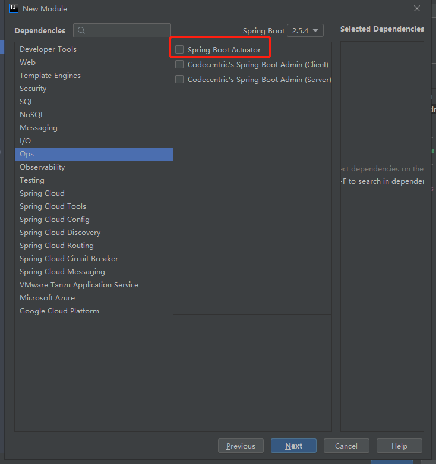

# SpringBoot

## SpringBoot概述

SpringBoot提供了一种快速使用Spring的方式，基于约定优于配置的思想，可以让开发人员不必在配置与逻
辑业务之间进行思维的切换，全身心的投入到逻辑业务的代码编写中，从而大大提高了开发的效率，一定程度
上缩短了项目周期。2014 年 4 月，Spring Boot 1.0.0 发布。Spring的顶级项目之一(https://spring.io)。

- Spring缺点：

  1） 配置繁琐
  虽然Spring的组件代码是轻量级的，但它的配置却是重量级的。一开始，Spring用XML配置，而且是很多XML配置。Spring 2.5引入了基于注解的组件扫描，这消除了大量针对应用程序自身组件的显式XML配置。Spring 3.0引入了基于Java的配置，这是一种类型安全的可重构配置方式，可以代替XML。所有这些配置都代表了开发时的损耗。因为在思考Spring特性配置和解决业务问题之间需要进行思维切换，所以编写配置挤占了编写应用程序逻辑的时间。和所有框架一样，Spring实用，但它要求的回报也不少。

  2）依赖繁琐
  项目的依赖管理也是一件耗时耗力的事情。在环境搭建时，需要分析要导入哪些库的坐标，而且还需要分析导入与之有依赖关系的其他库的坐标，一旦选错了依赖的版本，随之而来的不兼容问题就会严重阻碍项目的开发进度。

- SpringBoot功能：

  1） 自动配置
  Spring Boot的自动配置是一个运行时（更准确地说，是应用程序启动时）的过程，考虑了众多因素，才决定Spring配置应该用哪个，不该用哪个。该过程是SpringBoot自动完的。
  2） 起步依赖
  起步依赖本质上是一个Maven项目对象模型（Project Object Model，POM），定义了对其他库的传递依赖，这些东西加在一起即支持某项功能。简单的说，起步依赖就是将具备某种功能的坐标打包到一起，并提供一些默认的功能。
  3） 辅助功能
  提供了一些大型项目中常见的非功能性特性，如嵌入式服务器（Tomcat）、安全、指标，健康检测、外部配置等。

- SpringBoot快速入门：

  - SpringBoot在创建项目时，使用jar的打包方式。
  - SpringBoot的引导类，是项目入口，运行main方法就可以启动项目。
  - 使用SpringBoot和Spring构建的项目，业务代码编写方式完全一样。

  


## SpringBoot起步依赖分析

在pom,xml文件中：

```xml
<?xml version="1.0" encoding="UTF-8"?>
<project xmlns="http://maven.apache.org/POM/4.0.0" xmlns:xsi="http://www.w3.org/2001/XMLSchema-instance"
         xsi:schemaLocation="http://maven.apache.org/POM/4.0.0 https://maven.apache.org/xsd/maven-4.0.0.xsd">
    <modelVersion>4.0.0</modelVersion>
    <parent>
        <groupId>org.springframework.boot</groupId>
        <artifactId>spring-boot-starter-parent</artifactId>
        <version>2.5.4</version>
        <relativePath/> <!-- lookup parent from repository -->
    </parent>

    <groupId>com.kiki</groupId>
    <artifactId>springboot-init</artifactId>
    <version>0.0.1-SNAPSHOT</version>
    <name>springboot-init</name>
    <description>Demo project for Spring Boot</description>

    <properties>
        <java.version>1.8</java.version>
    </properties>

    <dependencies>
        <dependency>
            <groupId>org.springframework.boot</groupId>
            <artifactId>spring-boot-starter-web</artifactId>
        </dependency>

        <dependency>
            <groupId>org.springframework.boot</groupId>
            <artifactId>spring-boot-starter-test</artifactId>
            <scope>test</scope>
        </dependency>

        <dependency>
            <groupId>org.springframework.boot</groupId>
            <artifactId>spring-boot-configuration-processor</artifactId>
            <optional>true</optional>
        </dependency>

    </dependencies>

    <build>
        <plugins>
            <plugin>
                <groupId>org.springframework.boot</groupId>
                <artifactId>spring-boot-maven-plugin</artifactId>
                <version>2.5.4</version>
            </plugin>
        </plugins>
    </build>

</project>
```

- spring-boot-starter-parent

  - 在spring-boot-starter-parent中定义了各种技术的版本信息，组合了一套最优搭配的技术版本。
  - 在各种starter中，定义了完成该功能需要的坐标合集，其中大部分版本信息来自于父工程。
  - 我们的工程继承parent，引入starter后，通过**依赖传递**，就可以简单方便获得需要的jar包，并且不会存在版本冲突等问题。

- spring-boot-starter-web

  根据spring-boot-starter-parent版本的一套与web相关的最优搭配的技术版本。


## SpringBoot配置

### 配置文件分类

SpringBoot是基于约定的，所以很多配置都有默认值，但如果想使用自己的配置替换默认配置的话，就可以使用application.properties或者**application.yml**（application.yaml）进行配置。


- SpringBoot提供了2种配置文件类型：properteis和yml/yaml
- 默认配置文件名称：application
- 在同一级目录下优先级为：properties > yml > yaml


### YAML

YAML（简洁，以数据为核心）全称是 YAML **Ain't Markup Language** 。YAML是一种直观的能够被电脑识别的的数据数据序列化格式，并且容易被人类阅读，容易和脚本语言交互的，可以被支持YAML库的不同的编程语言程序导入，比如： C/C++, Ruby, Python, Java, Perl, C#, PHP
等。YML文件是以数据为核心的，比传统的xml方式更加简洁。
YAML文件的扩展名可以使用.yml或者.yaml。

- 基本语法：

  大小写敏感
  数据值前边必须有空格，作为分隔符
  使用缩进表示层级关系
  缩进时不允许使用Tab键，只允许使用空格（各个系统 Tab对应的 空格数目可能不同，导致层次混乱）。
  缩进的空格数目不重要，只要相同层级的元素左侧对齐即可
  \# 表示注释，从这个字符一直到行尾，都会被解析器忽略。

- 数据格式：

  

- 参数引用：

  


### 读取SpringBoot配置文件内容

```yaml
#server:
#  port: 8081

#对象
person:
  name: zhangsan
  age: 20
#行内写法
person1: {name: zhansan,age: 20}

#数组
address:
  - beijing
  - shanghai
#行内写法
address1: [beijing,shanghai]

#纯量
msg1: 'hello \n world'  #不识别转义字符
msg2: "hello \n world"  #识别转义字符

#参数引用
name: abc
personname: ${name}
```

- 1）@Value

- 2） Environment

  ```java
  @RestController //=@ResponseBody+@Controller
  public class HelloController {
  
      @Value("${name}")
      private String name;
  
      @Value("${person.name}")
      private String personName;
  
      @Value("${person.age}")
      private int age;
  
      @Value("${address[0]}")
      private String address;
  
      @Autowired
      private Environment env;
  
      @Autowired
      private Person person;
  
      @RequestMapping("/hello2")
      public void hello2() {
          System.out.println(name);
          System.out.println(personName);
          System.out.println(age);
          System.out.println(address);
  
          System.out.println(env.getProperty("name"));
  
          System.out.println(person);
      }
  
      @RequestMapping("/hello")
      public String hello() {
          return "hello springboot init!";
      }
  }
  ```

- 3） @ConfigurationProperties （通过prefix与yml文件中数据对应后注入）

  ```java
  @Component
  @ConfigurationProperties(prefix = "person") //前缀为person
  public class Person {
      private String name;
      private int age;
  
      @Override
      public String toString() {
          return "Person{" +
                  "name='" + name + '\'' +
                  ", age=" + age +
                  '}';
      }
  
      public String getName() {
          return name;
      }
  
      public void setName(String name) {
          this.name = name;
      }
  
      public int getAge() {
          return age;
      }
  
      public void setAge(int age) {
          this.age = age;
      }
  }
  ```


### profile

我们在开发Spring Boot应用时，通常同一套程序会被安装到不同环境，比如：开发、测试、生产等。其中数据库地址、服务器端口等等配置都不同，如果每次打包时，都要修改配置文件，那么非常麻烦。profile功能就是来进行动态配置切换的。


- profile配置方式

  - 多profile文件方式：

    

  - yml多文档方式：在yml中使用 --- 分隔不同配置

    ```yaml
    ---
    server:
      port: 8081
    spring:
      config:
        activate:
          on-profile: dev
    ---
    server:
      port: 8082
    spring:
      config:
        activate:
          on-profile: test
    
    ---
    server:
      port: 8083
    spring:
      config:
        activate:
          on-profile: prod
    
    ---
    spring:
      profiles:
        active: test
    ```


- profile激活方式：

  配置文件： 在配置文件中配置：spring.profiles.active=dev

  虚拟机参数：在VM options 指定：-Dspring.profiles.active=dev

  命令行参数：java –jar xxx.jar  --spring.profiles.active=dev

  ​	如通过命令行指定端口和web工程路径：


### 内外部配置加载方式

- 内部配置加载顺序：

  

  


- 外部配置加载顺序：

  https://docs.spring.io/spring-boot/docs/current/reference/html/boot-features-external-config.html

  


## SpringBoot整合其他框架

- 整合Junit

  - 步骤：

    ① 搭建SpringBoot工程
    ② 引入starter-test起步依赖
    ③ 编写测试类
    ④ 添加测试相关注解
    • @RunWith(SpringRunner.class)
    • @SpringBootTest(classes = 启动类.class)
    ⑤ 编写测试方法

  ```java
  //@RunWith(SpringRunner.class)
  @SpringBootTest(classes = SpringbootTestApplication.class)
  public class UserServiceTest {
  
      @Autowired
      private UserService userService;
  
      @Test
      public void test() {
          userService.add();
      }
  }
  ```

  


- 整合Redis

  - 步骤

    ① 搭建SpringBoot工程
    ② 引入redis起步依赖
    ③ 配置redis相关属性
    ④ 注入RedisTemplate模板
    ⑤ 编写测试方法，测试

  - 所需组件

    

  - application.yml

    ```yaml
    spring:
      redis:
        host: 127.0.0.1 #redis的主机ip
        port: 6379
    ```

  - 测试：

    ```java
    @SpringBootTest
    class SpringbootRedisApplicationTests {
    
        @Autowired
        private RedisTemplate redisTemplate;
    
        @Test
        public void test() {
            //存入数据
            redisTemplate.boundValueOps("name").set("zhangsan");
    
        }
    
        @Test
        public void test1() {
            //获取数据
            String name = (String) redisTemplate.boundValueOps("name").get();
            System.out.println(name);
        }
    
    }
    ```


- 整合MyBatis

  - 所需组件

    

  - 纯注解开发：

    - application.yml

      ```yaml
      spring:
        datasource:
          url: jdbc:mysql:///test #  ///省略localhost：8080
          username: root
          password: 123456
          driver-class-name: com.mysql.cj.jdbc.Driver
      ```

    - UserMapper

      ```java
      @Mapper
      @Repository
      public interface UserMapper {
      
          @Select("select * from user")
          public List<User> findAll();
      }
      ```

    - 测试

      ```java
      @SpringBootTest
      class SpringbootMybatisApplicationTests {
      
          @Autowired
          private UserMapper userMapper;
      
          @Test
          public void test() {
              List<User> userList = userMapper.findAll();
              System.out.println(userList);
          }
      }
      ```

  - mapper配置文件开发

    - application.yml

      ```yaml
      spring:
        datasource:
          url: jdbc:mysql:///test #  ///省略localhost：8080
          username: root
          password: 123456
          driver-class-name: com.mysql.cj.jdbc.Driver
      
      #mybatis
      mybatis:
        mapper-locations: classpath:mapper/*Mapper.xml #mapper映射文件路径
        type-aliases-package: com.kiki.springbootmybatis.domain #别名的包扫描
        #config-location: 指定mybatis的核心配置文件
      ```

    - UserXmlMapper

      ```java
      @Mapper
      @Repository
      public interface UserXmlMapper {
      
          public List<User> findAll();
      }
      ```

    - UserMapper.xml

      ```xml
      <?xml version="1.0" encoding="UTF-8" ?>
      <!DOCTYPE mapper PUBLIC "-//mybatis.org//DTD Mapper 3.0//EN" "http://mybatis.org/dtd/mybatis-3-mapper.dtd">
      
      <mapper namespace="com.kiki.springbootmybatis.mapper.UserXmlMapper">
          <select id="findAll" resultType="user">
              select * from user
          </select>
      </mapper>
      ```

    - 测试

      ```java
      @SpringBootTest
      class SpringbootMybatisApplicationTests {
      
          @Autowired
          private UserXmlMapper userXmlMapper;
          
          @Test
          public void test1() {
              List<User> userList = userXmlMapper.findAll();
              System.out.println(userList);
          }
      
      }
      ```


## SpringBoot自动配置

### @Conditional

- 自定义条件：
  - ① 定义条件类：自定义类实现Condition接口，重写 matches 方法，在 matches 方法中进行逻辑判断，返回
    boolean值 。 matches 方法两个参数：
    - context：上下文对象，可以获取属性值，获取类加载器，获取BeanFactory等。
    - metadata：元数据对象，用于获取注解属性。
  - ② 判断条件： 在初始化Bean时，使用 **@Conditional(条件类.class)**注解
  
- SpringBoot 提供的常用条件注解： 
  - ConditionalOnProperty：判断配置文件中是否有对应属性和值才初始化Bean 
  - ConditionalOnClass：判断环境中是否有对应字节码文件才初始化Bean 
  - ConditionalOnMissingBean：判断环境中没有对应Bean才初始化Bean
  
- 手动实现ConditionOnClass注解：

  - ConditionOnClass注解

    ```java
    //注解可以添加的范围：类和方法上
    @Target({ElementType.TYPE, ElementType.METHOD})
    //注解生效时机
    @Retention(RetentionPolicy.RUNTIME)
    //生成javadoc文档
    @Documented
    @Conditional(ClassCondition.class)
    public @interface ConditionOnClass {
    
        //注解参数可以为数组
        String[] value();
    }
    ```

  - ClassCondition.java

    ```java
    public class ClassCondition implements Condition {
        /**
         * Description: 
         * @param conditionContext: 上下文对象，可以获取环境，IOC容器和ClassLoader对象
         * @param annotatedTypeMetadata: 注解元对象，可以获取注解的属性值
         * @return boolean: 判断注解属性值的字节码文件是否存在
         */
        @Override
        public boolean matches(ConditionContext conditionContext, AnnotatedTypeMetadata annotatedTypeMetadata) {
            
            //获取注解属性值
            Map<String, Object> map = annotatedTypeMetadata.getAnnotationAttributes(ConditionOnClass.class.getName());
            String[] value = (String[]) map.get("value");
            Boolean flag = true;
            try {
                for (String className : value) {
                    Class<?> aClass = Class.forName(className);
                }
            } catch (ClassNotFoundException e) {
                flag = false;
            }
            return flag;
        }
    }
    ```

  - 使用ConditionOnClass注解：

    ```java
    @Bean
    @ConditionOnClass("redis.clients.jedis.Jedis")
    public User user() {
        return new User();
    }
    ```


### 切换内置web服务器

SpringBoot的web环境中默认使用tomcat作为内置服务器，其实SpringBoot提供了4中内置服务器供我们选择，在pom.xml文件中我们可 以很方便的进行切换。

```xml
<dependency>
    <groupId>org.springframework.boot</groupId>
    <artifactId>spring-boot-starter-web</artifactId>
    <!--排除tomcat服务器的依赖-->
    <exclusions>
        <exclusion>
            <groupId>org.springframework.boot</groupId>
            <artifactId>spring-boot-starter-tomcat</artifactId>
        </exclusion>
    </exclusions>
</dependency>
<!--添加jetty服务器的依赖-->
<dependency>
	<groupId>org.springframework.boot</groupId>
	<artifactId>spring-boot-starter-jetty</artifactId>
</dependency>
```


### @Enable*注解


- SpringBoot中提供了很多Enable开头的注解，这些注解都是用于动态启用某些功能的。而**其底层原理是使用@Import注解导入一些配置类，实现Bean的动态加载**。

- @Import注解：

  使用@Import导入的类会被Spring加载到IOC容器中。而@Import提供4中用法： 

  ​	① 导入Bean 

  ​	② 导入配置类 

  ​	③ **导入 ImportSelector 实现类。一般用于加载配置文件中的类** 

  ​	④ 导入 ImportBeanDefinitionRegistrar 实现类

- SpringBoot引导类：

  ```java
  @SpringBootApplication
  public class SpringbootConditionApplication {
  
      public static void main(String[] args) {
          //启动springboot的应用，返回spring的IOC容器
          ConfigurableApplicationContext applicationContext = SpringApplication.run(SpringbootConditionApplication.class, args);
  
          //获取Bean，redisTemplate
          Object redisTemplate = applicationContext.getBean("redisTemplate");
          System.out.println(redisTemplate);
  
      }
  }
  ```

  - @SpringBootApplication底层：

    ```java
    @Target(ElementType.TYPE)
    @Retention(RetentionPolicy.RUNTIME)
    @Documented
    @Inherited
    @SpringBootConfiguration
    @EnableAutoConfiguration
    @ComponentScan(excludeFilters = { @Filter(type = FilterType.CUSTOM, classes = TypeExcludeFilter.class),
          @Filter(type = FilterType.CUSTOM, classes = AutoConfigurationExcludeFilter.class) })
    public @interface SpringBootApplication {
        ...
    }
    ```
    - @EnableAutoConfiguration底层

      ```java
      @Target(ElementType.TYPE)
      @Retention(RetentionPolicy.RUNTIME)
      @Documented
      @Inherited
      @AutoConfigurationPackage
      @Import(AutoConfigurationImportSelector.class)
      public @interface EnableAutoConfiguration {
      	...
      }
      ```


### @EnableAutoConfiguration 注解

- 如上所示，@EnableAutoConfiguration 注解内部使用 **@Import(AutoConfigurationImportSelector.class)**来加载配置类。
- **配置文件位置：（resources）META-INF/spring.factories，该配置文件中定义了大量的配置类，当 SpringBoot 应用启动时，会自动加载这些配置类，初始化Bean** 
- 并不是所有的Bean都会被初始化，在配置类中使用Condition来加载满足条件的Bean


### 自定义starter依赖

自定义redis-starter。要求当导入redis坐标时，SpringBoot自动创建Jedis的Bean。

- ① 创建 redis-spring-boot-autoconfigure 模块 ，删除其他文件

- ② 创建 redis-spring-boot-starter 模块,依赖 redis-springboot-autoconfigure的模块，其余文件删除

  ```xml
  <?xml version="1.0" encoding="UTF-8"?>
  <project xmlns="http://maven.apache.org/POM/4.0.0" xmlns:xsi="http://www.w3.org/2001/XMLSchema-instance"
           xsi:schemaLocation="http://maven.apache.org/POM/4.0.0 https://maven.apache.org/xsd/maven-4.0.0.xsd">
      <modelVersion>4.0.0</modelVersion>
      <parent>
          <groupId>org.springframework.boot</groupId>
          <artifactId>spring-boot-starter-parent</artifactId>
          <version>2.5.4</version>
          <relativePath/> <!-- lookup parent from repository -->
      </parent>
  
      <groupId>com.kiki</groupId>
      <artifactId>redis-spring-boot-starter</artifactId>
      <version>0.0.1-SNAPSHOT</version>
      <name>redis-spring-boot-starter</name>
      <description>Demo project for Spring Boot</description>
  
      <properties>
          <java.version>1.8</java.version>
      </properties>
      <dependencies>
          <dependency>
              <groupId>org.springframework.boot</groupId>
              <artifactId>spring-boot-starter</artifactId>
          </dependency>
  
          <!--引入configure-->
          <dependency>
              <groupId>com.kiki</groupId>
              <artifactId>redis-spring-boot-autoconfigure</artifactId>
              <version>0.0.1-SNAPSHOT</version>
          </dependency>
  
      </dependencies>
  
  </project>
  ```

- ③ 在 redis-spring-boot-autoconfigure 模块中初始化 Jedis 的 Bean。并定义META-INF/spring.factories 文件 

  

  RedisAutoConfiguration.java(主配置类)

  ```java
  @Configuration
  //动态启用
  @EnableConfigurationProperties(RedisProperties.class)
  @ConditionalOnClass(Jedis.class)
  public class RedisAutoConfiguration {
  
      //提供Jedis的Bean
      @Bean
      //没有id为jedis的Bean再提供
      @ConditionalOnMissingBean(name = "jedis")
      public Jedis jedis(RedisProperties redisProperties) {
          return new Jedis(redisProperties.getHost(), redisProperties.getPort());
      }
  }
  ```

  RedisProperties.java(配置信息类)

  ```java
  //会读取properties文件中所有以redis开头的属性，并和bean中的字段进行匹配
  @ConfigurationProperties(prefix = "redis")
  public class RedisProperties {
  
      private String host = "localhost";
      private int port = 6379;
  
      public String getHost() {
          return host;
      }
  
      public void setHost(String host) {
          this.host = host;
      }
  
      public int getPort() {
          return port;
      }
  
      public void setPort(int port) {
          this.port = port;
      }
  }
  ```

  spring.factories

  ```xml
  org.springframework.boot.autoconfigure.EnableAutoConfiguration=com.kiki.redis.config.RedisAutoConfiguration
  ```

- ④ 在测试模块中引入自定义的 redis-starter 依赖，测试获取 Jedis 的Bean，操作 redis。

  ```xml
  <!--自定义的redis-spring-boot-starter-->
  <dependency>
      <groupId>com.kiki</groupId>
      <artifactId>redis-spring-boot-starter</artifactId>
      <version>0.0.1-SNAPSHOT</version>
  </dependency>
  ```

  ```java
  @SpringBootApplication
  public class SpringbootConditionApplication {
  
      public static void main(String[] args) {
          //启动springboot的应用，返回spring的IOC容器
          ConfigurableApplicationContext applicationContext = SpringApplication.run(SpringbootConditionApplication.class, args);
  
          Jedis jedis = applicationContext.getBean(Jedis.class);
          System.out.println(jedis);
      }
  }
  ```

  

## SpringBoot监听机制与启动流程

- Java监听机制

  事件：Event，继承 java.util.EventObject类的对象 

  事件源：Source ，任意对象Object 

  监听器：Listener，实现 java.util.EventListener接口的对象

  

- SpringBoot 监听机制，其实是对Java提供的事件监听机制的封装

  SpringBoot 在项目启动时，会对几个监听器进行回调，我们可以实现这些监听器接口，在项目启动时完成 一些操作。 

  ​	ApplicationContextInitializer、

  ​	SpringApplicationRunListener、

  ​	CommandLineRunner、

  ​	ApplicationRunner


- 启动流程：

  


## SpringBoot监控

### Actuator

- SpringBoot自带监控功能Actuator，可以帮助实现对程序内部运行情况监控，比如监控状况、Bean加载情况、配置属性 、日志信息等。

- 使用：

  导入依赖坐标，运行项目，访问http://localhost:8080/acruator



- 具体使用：

  


### SpringBoot 监控 - Spring Boot Admin

- 简介

  Spring Boot Admin是一个开源社区项目，用于管理和监控SpringBoot应用程序。 

  Spring Boot Admin 有两个角色，客户端(Client)和服务端(Server)。 

  

  应用程序作为Spring Boot Admin Client向为Spring Boot Admin Server注册 

  Spring Boot Admin Server 的UI界面将Spring Boot Admin Client的Actuator Endpoint上的一些监控信息。

- 使用步骤：

  

  配置admin-server的端口号application.properties：

  ```properties
  server.port=9000
  ```

  admin-client配置文件application.properties：

  ```properties
  #执行admin.server（server的端口号）
  spring.boot.admin.client.url=http://localhost:9000
  
  #开启健康检查的完整信息
  management.endpoint.health.show-details=always
  
  #将所有的监控endpoint暴露出来
  management.endpoints.web.exposure.include=*
  ```


## SpringBoot项目部署

### jar包方式（推荐）

- 使用maven插件Lifecycle中的package功能，在日志内查看输出位置，内嵌tomcat服务器，可以直接在在命令行运行：


​		通过命令行指定端口和web工程路径：

- 自定义jar包名

  ```xml
  <build>
      <finalName>springboot</finalName>
  </build>
  ```


### war包

- 在jar包基础上在pom.xml文件中添加

  ```xml
  <packaging>war</packaging>
  ```

- 不内嵌服务器，需要放置在如Tomcat文件夹webapps目录下以Tomcat的方式运行

- web工程目录有所改变（  localhost:8080/(war包名)/  ）

  
