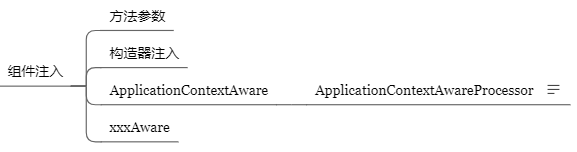

## AnnotationConfigApplication

注解驱动（@Configuration）使用配置类代替xml配置文件

使用 **AnnotationConfigApplicationContext **类代替 **ClassPathXmlApplicationContext** 类来创建Bean容器

```java
public static void main(String[] args) {
	//ApplicationContext app = new ClassPathXmlApplicationContext("applicationContext.xml");
	ApplicationContext app = new AnnotationConfigApplicationContext(SpringConfiguration.class);
	UserService userService = app.getBean(UserService.class);
	userService.save();
}
```


```java
public class IOCTest {

    //创建IOC容器
    AnnotationConfigApplicationContext applicationContext = new AnnotationConfigApplicationContext(MainConfig2.class);

    @Test
    public void test01(){

        //获取 Spring 容器中定义的所有 JavaBean 的名称
        String[] beanDefinitionNames = applicationContext.getBeanDefinitionNames();
        System.out.println(Arrays.toString(beanDefinitionNames));

        //使用名称获取Bean对象
        Person person = (Person)applicationContext.getBean("person");
        System.out.println(person);
    }

    @Test
    public void test02(){

        //获取操作系统、处理器、屏幕显示等与系统相关的信息
        ConfigurableEnvironment environment = applicationContext.getEnvironment();
        //getProperty()可以获取系统相关的信息，也可以获取外部配置文件properties的k/v
        String property = environment.getProperty("os.name");
        System.out.println(property);

        //通过类型获取Bean名称
        String[] beanNamesForType = applicationContext.getBeanNamesForType(Person.class);
        for(String name:beanNamesForType){
            System.out.println(name);
        }

        //用于获取 Spring 容器中指定类型的所有 JavaBean 对象。
        Map<String, Person> beansOfType = applicationContext.getBeansOfType(Person.class);
        System.out.println(beansOfType);
    }

}
```


## 组件注册


- 给容器中中注册组件的四种方法：

  - 1、包扫描（@ComponentScan）+组件标注注解（@Component、@Service、@Controller、@Repository，主要是自己写的类

   * 2、@Bean[导入的第三方包里面的组件]，写在配置类里
      * @Scope
         * prototype:多例的 ioc容器启动并不会去调用方法创建对象在容器中，而是每次获取时才会调用方法创建对象
         * singleton:单例的（默认值） ioc容器启动会调用方法创建对象放到ioc容器中，以后每次获取就是从容器中拿
         * request:同一次请求创建一个实例
         * session:同一个session创建一个实例
   * 3、@Import[快速给容器中导入一个组件]，写在配置类前
      *          1、Import(类名),容器中就会自动注册这个组件，id默认是组件的全类名
      *          2、ImportSelector：实现ImportSelector接口的类，要实现的方法返回需要导入的组件的全类名的数组
      *          3、ImportBeanDefinitionRegistrar：实现ImportBeanDefinitionRegistrar接口的类，手动注册bean
   * 4、使用Spring提供的FactoryBean（工厂bean），实现FactoryBean接口
      * 1、默认获取到的是工厂bean调用getObject创建的对象
      * 2、要获取到工厂bean本身，需要给id前面加个&标识
  * @Conditional({Condition}):按照一定的条件判断，满足条件给容器中注册bean】
  * @Lazy
    * 单实例bean：默认在容器启动时创建对象
    * 可以把单实例改为懒加载：容器启动不创建对象，第一次获取才创建 @Lazy注解


- **示例一：@Configuration、@ComponentScan、 @Bean**

  ```java
  //MainConfig.java
  
  //配置类==配置文件
  @Configuration//告诉Spring这是一个配置类，同时自己作为一个bean注入Spring容器，id为类名
  
  //包扫描（java8为可重复注解或者写@ConponentScans指定多个规则）
  @ComponentScan(value = "com.npu",excludeFilters = {@ComponentScan.Filter(type = FilterType.ANNOTATION,classes = {Controller.class})})
      //@ComponentScan value:指定要扫描的包
      //excludeFilters=Filter[]:指定扫描包的时候按照什么规则排除哪些组件
      //includeFilters=Filter[]:指定扫描包的时候要包含哪些组件,需将useDefaultFilters置为false
          //FilterType.ANNOTATION:按照注解，如Controller.class
          //FilterType.ASSIGNABLE_TYPE:按照指定的类型，如Book.Class
          //FilterType.REGEX:使用正则指定
          //FilterType.CUSTOM:使用自定义规则（自定义类实现TypeFilter接口，match返回值作为判定条件，类也作为bean注入容器）
  //@ComponentScan(value = "com.npu",excludeFilters = {@ComponentScan.Filter(type = FilterType.ASSIGNABLE_TYPE,classes = {BookService.class})})
  @ComponentScan(value = "com.npu",includeFilters = {@ComponentScan.Filter(type = FilterType.CUSTOM,classes = {MyTypeFilter.class})},useDefaultFilters = false)
  public class MainConfig {
  
      //给容器注册一个bean，类型为返回值的类型，id默认用方法名作为类型或者是value值作为bean的id
      @Bean(value = "person")
      public Person Person(){
          return new Person("gy",20);
      }
  
  }  
  ```

  ```java
  //@ComponentScan自定义规则扫描类
  public class MyTypeFilter implements TypeFilter {
  
      /**
       * @param metadataReader 读取到当前正在扫描的类的信息
       * @param metadataReaderFactory 可以获取到其它任何类信息的
       * @return 返回ture则过滤规则生效
       * @throws IOException
       */
      @Override
      public boolean match(MetadataReader metadataReader, MetadataReaderFactory metadataReaderFactory) throws IOException {
          //获取到当前扫描类注解的信息
          AnnotationMetadata annotationMetadata = metadataReader.getAnnotationMetadata();
  
          //获取到当前正在扫描的类的类信息
          ClassMetadata classMetadata = metadataReader.getClassMetadata();
  
          //获取当前类资源（类的路径）
          metadataReader.getResource();
  
          String className = classMetadata.getClassName();
  
          System.out.println(className);
  
          //如果类名中含有er字符串，return true
          if(className.contains("er")) return true;
  
          return false;
      }
  }
  ```


- **示例二：@Import、@Lazy、@Conditional、FactoryBean、@Scope**

  ```java
  //MainConfig2.java
  @Configuration
  //自行判断是普通的类，配置类、还是实现了ImportSelector接口的类、ImportBeanDefinitionRegistrar接口的类
  @Import({Color.class, UserConfig.class, MyImportSelector.class, MyImportBeanRegistrar.class})
  public class MainConfig2 {
  
      @Bean("person")
      //@Lazy
      @Scope("prototype")
      public Person person(){
          return new Person("zhangsan",25);
      }
  
      /**
       * @Conditional({Condition}):按照一定的条件判断，满足条件给容器中注册bean
       * 参数WindowsCondition、LinuxCondition类实现了接口Condition
       * 类的matches方法返回true则注册该bean
       */
      @Conditional({WindowsCondition.class})  //如果操作系统是Windows，给容器中注册“ywl”
      @Bean("ywl")
      public Person person01(){
          return new Person("ywl",11);
      }
  
      @Conditional({LinuxCondition.class})    //如果操作系统是Linux，给容器中注册“ljk”
      @Bean("ljk")
      public Person person02(){
          return new Person("ljk",12);
      }
  
  
      @Bean   //工厂bean，默认获取到的是工厂bean调用getObject创建的对象，要获取到工厂bean本身，需要给id前面加个&标识
      public ColorFactory colorFactory(){
          return new ColorFactory();
      }
  }
  ```

  ```java
  //@Import的MyImportSelector
  //自定义逻辑需要返回的容器组件
  public class MyImportSelector implements ImportSelector {
  
      //返回值，就是容器中要导入到容器中的组件全类名
      //可以返回空数组，不能返回null
      //AnnotationMetadata：当前标注@Import注解的类的所有注解信息
      @Override
      public String[] selectImports(AnnotationMetadata importingClassMetadata) {
          return new String[]{"com.npu.bean.Blue"};
      }
  }
  ```

  ```java
  //@Import的ImportBeanDefinitionRegistrar
  //手动注册bean
  public class MyImportBeanRegistrar implements ImportBeanDefinitionRegistrar {
  
      /**
       *
       * @param importingClassMetadata 当前类的注解信息
       * @param registry               BeanDefinition注册类，可以通过该类来注册bean
       * @param importBeanNameGenerator
       */
      @Override
      public void registerBeanDefinitions(AnnotationMetadata importingClassMetadata, BeanDefinitionRegistry registry, BeanNameGenerator importBeanNameGenerator) {
          //判断在ioc容器中是否有这些bean
          boolean definition1 = registry.containsBeanDefinition("com.npu.bean.Blue");
          boolean definition2 = registry.containsBeanDefinition("com.npu.bean.Color");
          if (definition1 && definition2) {
              //RootBeanDefinition中定义要注册bean的定义信息——bean的类型、scope等等
              RootBeanDefinition beanDefinition = new RootBeanDefinition(Yello.class);
              //手动注册一个bean，“yello”为bean名
              registry.registerBeanDefinition("yello", beanDefinition);
          }
      }
  }
  ```

  ```java
  //@Conditional的条件
  public class WindowsCondition implements Condition {
  
      @Override
      public boolean matches(ConditionContext context, AnnotatedTypeMetadata metadata) {
          //能获取到ioc使用的beanFactory工厂
          ConfigurableListableBeanFactory beanFactory = context.getBeanFactory();
  
          //获取类加载器
          ClassLoader classLoader = context.getClassLoader();
  
          //获取当前环境信息
          Environment environment = context.getEnvironment();
  
          //获取bean定义的注册类
          BeanDefinitionRegistry registry = context.getRegistry();
  
          //可以判断容器中bean注册情况，也可以给容器中注册bean
          registry.getBeanDefinitionNames();
  
          String property = environment.getProperty("os.name");
          if(property.contains("Windows")) return true;
          return false;
      }
  }
  ```

  ```java
  //创建一个spring定义的FactoryBean，泛型指定bean的类型，默认获取到的是工厂bean调用getObject创建的对象
  public class ColorFactory implements FactoryBean<Color> {
      @Override
      //true：单实例  false：多实例
      public boolean isSingleton() {
          return true;
      }
  
      //返回一个color对象，这个对象会添加到容器中
      @Override
      public Color getObject() throws Exception {
          return new Color();
      }
  
      //返回类加载器
      @Override
      public Class<?> getObjectType() {
          return Color.class;
      }
  }
  ```


## 生命周期

 * **bean创建--初始化--销毁的过程**

      * 1. 构造（对象创建）

           * 单实例：在容器启动时创建
           * 多实例：每次获取时创建

      * 2.BeanPostProcessor.postProcessBeforeInitialization

      * 3.初始化：对象创建时

      * 4.BeanPostProcessor.postProcessAfterInitialization

      * 5.销毁：

           * 单实例：关闭容器时
           * 多实例：容器不会管理这个bean，容器不会调用销毁方法


- **生命周期使用的方式：**

  - 1）指定初始化和销毁方法 在@Bean注解里指定initMethod方法和destroyMethod方法

    ```java
    @Configuration
    @ComponentScan("com.npu.bean")
    public class MainConfigOfLifeCycle {
    
        @Bean(initMethod = "init",destroyMethod = "destroy")
        public Car car(){
            return new Car();
        }
    
    }
    ```

    ```java
    @Component
    public class Car {
    
        //构造方法
        public Car() {
            System.out.println("car constructor...");
        }
    
        //自定义初始化方法
        public void init(){
            System.out.println("car init...");
        }
    
        //自定义销毁方法
        public void destroy(){
            System.out.println("car... destroy");
        }
    }
    ```

  - 2）通过让bean类实现InitializingBean（定义初始化逻辑），DisposableBean（定义销毁逻辑）接口

    ```java
    public class Cat implements InitializingBean, DisposableBean {
        public Cat() {
            System.out.println("cat constructor");
        }
    
        //销毁bean之前
        @Override
        public void destroy() throws Exception {
            System.out.println("cat destroy...");
        }
    
        //在bean创建完成并且属性赋值完成
        @Override
        public void afterPropertiesSet() throws Exception {
            System.out.println("cat init...");
        }
    }
    ```

  - 3）可以使用JSR250（java规范）

    - 1、@PostConstructor：在bean创建完成并且属性赋值完成，来执行初始化方法
    - 2、@PreDestroy：在容器销毁bean之前通知我们进行清理工作

    ```java
    @Component
    public class Dog {
        public Dog() {
            System.out.println("dog constructor");
        }
    
        //容器创建并赋值之后调用
        @PostConstruct
        public void init(){
            System.out.println("dog init...");
        }
    
        //容器销毁之前
        @PreDestroy
        public void destroy(){
            System.out.println("dog destroy...");
        }
    }
    ```

  - 4）BeanPostProcessor【接口】：bean的后置处理器，作为bean加入容器，对容器内的bean生效

     - 在bean初始化前后进行一些处理工作：

       1.postProcessBeforeInitialization：在初始化之前进行一些工作

       2.对象初始化

       3.postProcessAfterInitialization：在初始化之后进行一些工作

    ```java
    /**
     * 后置处理器，初始化前后处理
     */
    @Component
    public class MyBeanPostProcessor implements BeanPostProcessor {
        
        //在初始化之前进行一些工作
        @Override
        public Object postProcessBeforeInitialization(Object bean, String beanName) throws BeansException {
            System.out.println("postProcessBeforeInitialization"+beanName+"=>"+bean);
            return bean;
        }
    
        //在初始化之后进行一些工作
        @Override
        public Object postProcessAfterInitialization(Object bean, String beanName) throws BeansException {
            System.out.println("postProcessAfterInitialization"+beanName+"=>"+bean);
            return bean;
        }
    }
    ```


 * **BeanPostProcessor的大致执行流程：**

      * 1.给bean进行属性赋值

          ```java
          populateBean(beanName, mbd, instanceWrapper);
          ```

      * 2.赋值后执行初始化，初始化前后分别执行BeanPostProcessor

          ```java
          initializeBean{
          	//for循环得到全部beanPost
              //遍历得到容器中所有的BeanPostProcessor；挨个执行beforeInitialization,一旦返回null，跳出for循环，不会执行后面的BeanPostProcess.postProcessors
          	applyBeanPostProcessorsBeforeInitialization;
          	//自定义初始化方法
          	invokeInitMethods(beanName, wrappedBean, mbd);
          	//for循环得到全部beanPost
          	applyBeanPostProcessorsAfterInitialization;
           }
          ```
          
          

 - **Spring底层对BeanPostProcess接口的使用**

    bean赋值，生命周期注解功能，注入其它组件，@AutoWired，@Async xxx都是通过BeanPostProcess进行完成的
     - **ApplicationContextAwareProcessor**实现了接口BeanPostProcessor,用于向实现了某种Aware接口的bean设置ApplicationContext中相应的属性

        比如会在实现了ApplicationContextAware接口的bean里面通过((ApplicationContextAware) bean).setApplicationContext(this.applicationContext)，将bean注入到容器中

     - **InitDestroyAnnotationBeanPostProcessor**会对@PostConstructor和@PreDestroy注解进行解析来达到容器的初始化和销毁方法的执行


## 组件赋值与注入




- @Value赋值和@PropertySource

  - 1、基本数值
  - 2、可以写SpEL;#{}
  - 3、可以写${}取出配置文件【properties】的值（在运行环境变量里面的值）

  ```java
  //使用@PropertySource读取外部配置文件中的k/v保存到运行的环境变量中;加载完外部的配置文件后使用${}取出配置文件的值
  //为可重复注解
  @PropertySource(value={"classpath:/person.properties"})
  @Configuration
  public class MainConfigOfPropertyValues {
  
      @Bean
      public Person person(){
          return new Person();
      }
  
  }
  ```

  ```java
  public class Person {
  
      @Value("gy")
      private String name;
      @Value("#{20-2}")
      private Integer age;
  
      @Value("${person.nickName}")
      private String nickName;
  }
  ```

  

- **@Autowired自动装配**

  Spring利用依赖注入（DI），完成对IOC容器中各个组件的依赖关系赋值；

   * **1、@AutoWired：自动注入【Spring定义的】**是按照类型**（byType）**装配依赖对象

      *          1）默认按照类型**去容器中找对应的组件**    applicationContext.getBean(BookService.class)，找到就赋值
      *          2）如果找到多个相同类型的组件，再将属性的名称作为组件的id去容器中查找      applicationContext.getBean("bookDao")
      *          3）@Qualifier("bookDao1")：使用该注解来明确指定需要装配的组件的id，而不是使用属性名
      *          4）自动装配默认一定要将属性赋值好，没有就会报错，可通过在Autowire的注解中将required=false来使该配置设置为非必需
      *          5）@Primary：让Spring进行自动装配的时候，默认使用首选的bean,也可以继续使用@Qualifier（优先级最高）来指定需要装配的bean

     ```java
     @Configuration
     @ComponentScan({"com.npu.service","com.npu.dao","com.npu.controller","com.npu.bean"})
     public class MainConfigOfAutoWired {
     
         @Primary    //将bookDao2设置为BookDao的首选Bean
         @Bean("bookDao2")
         public BookDao bookDao(){
             return new BookDao();
         }
     
         @Bean   //省略了@Auotowired
         public Color color(Car car) {
             Color color = new Color();
             color.setCar(car);
             return color;
         }
     }
     ```

     ```java
     public Class BookService{
         
     	@Qualifier("bookDao1")
     	@Autowired(required=false)  //容器中找不到不会报错
     	BookDao bookDao;
     }
     ```

   * **2、Spring还支持使用@Resource（JSR250）和@Inject（JSR330）【java规范】**

      * 1）**@Resource**：

        可以和@Autowired一样实现自动装配功能；默认是按照组件名称**(ByName)**进行装配的；没有能支持@Primary的功能以及@Autowired（required=false）的功能

     *      2）@Inject（需要导入依赖）：

            导入javax.inject的包，和Autowired的功能一样，没有required=false的功能

   * **3、AutowiredAnnotationBeanPostProcessor：解析上述注解完成自动装配功能**

   * **4、@Autowired：可以标的位置：构造器，参数，方法，属性**

      * 1）标注在方法位置     标注在方法，Spring容器创建当前对象，就会调用方法，完成赋值，方法使用的参数，自定义类型的值从ioc容器中获取

        @Bean标注的方法创建对象的时候，方法参数的值默认从ioc容器中获取，默认不写Autowired，效果是一样的

      * 2）标注在构造器位置   默认加在ioc容器中的组件，容器启动会调用无参构造器创建对象，再进行初始化赋值等操作。

        标注在构造器上可以默认调用该方法，方法中用的参数同样从ioc容器中获取，

        如果容器只有一个有参构造器，这个有参构造器的Autowired可以省略，参数位置的组件还是可以自动从容器中获取

      * 3）标注在参数位置     从ioc容器中获取参数组件的值

     ```java
     @Component
     public class Boss {
     
         @Autowired
         Blue blue;
     
         Car car;
     
         @Override
         public String toString() {
             return "Boss{" +
                     "car=" + car +
                     '}';
         }
     
         public Car getCar() {
             return car;
         }
     
         //@Autowired
         //标注在方法，Spring容器创建当前对象，就会调用方法，完成赋值
         //方法使用的参数，自定义类型的值从ioc容器中获取
         public void setCar(Car car) {
             this.car = car;
         }
     
         /*@Autowired
         //有参构造器
         public Boss(Car car) {
             this.car = car;
         }*/
     
         //有参构造器
         public Boss(@Autowired Car car) {
             this.car = car;
         }
     }
     ```


 - **自定义组件想要使用Spring容器底层的一些组件（ApplicationContext，BeanFactory，xxx）;**

    *      自定义组件需要实现xxxAware接口；在创建对象的时候会调用接口规定的方法注入相关组件；
           *      在某些特殊的情况下，Bean需要实现某个功能，但该功能必须借助于Spring容器才能实现，此时就必须让该Bean先获取Spring容器，然后借助于Spring容器实现该功能。为了让Bean获取它所在的Spring容器，可以让该Bean实现ApplicationContextAware接口。ApplicationContextAware 通过它Spring容器会自动把上下文环境对象调用ApplicationContextAware接口中的setApplicationContext方法。在ApplicationContextAware的实现类中，就可以通过这个上下文环境对象得到Spring容器中的Bean。
    *      把Spring底层的一些组件注入到自定义的bean中
   *              xxxAware的功能都是使用xxxAwareProcessor处理的
   
   ```java
   @Component
   //实现xxxAware接口可以将Spring容器底层的一些组件注入到自定义的Bean中
   public class Red implements ApplicationContextAware, BeanNameAware, EmbeddedValueResolverAware {
   
       ApplicationContext applicationContext;
   
       //可以方便获得ApplicationContext中的所有bean
       @Override
       public void setApplicationContext(ApplicationContext applicationContext) throws BeansException {
           this.applicationContext=applicationContext;
           System.out.println("传入的ioc"+applicationContext);
       }
   
       //让实现这个接口的bean知道自己在spring容器里的名字
       @Override
       public void setBeanName(String name) {
           System.out.println("当前bean的名字:"+name);
       }
   
       //获取properties文件属性，解析配置文件
       @Override
       public void setEmbeddedValueResolver(StringValueResolver resolver) {
           String s = resolver.resolveStringValue("你好${os.name},我是#{20*18}");
           System.out.println("解析的字符串:"+s);
       }
   }
   ```
   
   - ApplicationContextAwareProcessor底层处理逻辑
   
   ```java
   if (bean instanceof Aware) {
   
   			if (bean instanceof EnvironmentAware) {
   
   				((EnvironmentAware) bean).setEnvironment(this.applicationContext.getEnvironment());
   
   			}
   
   			if (bean instanceof EmbeddedValueResolverAware) {
   
   				((EmbeddedValueResolverAware) bean).setEmbeddedValueResolver(this.embeddedValueResolver);
   
   			}
   
   			if (bean instanceof ResourceLoaderAware) {
   
   				((ResourceLoaderAware) bean).setResourceLoader(this.applicationContext);
   
   			}
   
   			if (bean instanceof ApplicationEventPublisherAware) {
   
   				((ApplicationEventPublisherAware) bean).setApplicationEventPublisher(this.applicationContext);
   
   			}
   
   			if (bean instanceof MessageSourceAware) {
   
   				((MessageSourceAware) bean).setMessageSource(this.applicationContext);
   
   			}
   
   			if (bean instanceof ApplicationContextAware) {
   
   				((ApplicationContextAware) bean).setApplicationContext(this.applicationContext);
   
   			}
   
   }
   ```


- **Profile：Spring为我们提供的可以根据当前环境，动态的激活和切换一系列组件的功能**

   - 开发环境、测试环境、生产环境比如分别使用数据源（/A数据源)(/B数据源)(/C数据源)
   - @Profile:指定组件在哪个环境的情况下才能被注册到容器中，不指定，任何环境下都能注册
       - 1、加了环境标识的bean，只有这个环境被激活的时候才能注册到容器中，默认是default环境
       - 2、写在配置类上，只有是指定的环境的时候，整个配置类里面的所有配置才能生效
       - 3、没有标注环境标识的bean在任何环境下都加载
   - 运行时如何指定运行环境：
      - 1、命令行参数，通过在虚拟机参数位置指定-Dspring.profiles.active=xxx来指定运行环境，标注了该环境的bean会被配置进容器中
      - 2、程序内指定：
         - 1）创建一个AnnotationConfigApplicationContext
         - 2）设置需要激活的环境，applicationContext.getEnvironment().setActiveProfiles("");
         - 3）注册主配置类，applicationContext.register(xxx.class)
         - 4）启动刷新容器，applicationContext.refresh();

  ```java
  //@Profile("dev")
  @Configuration
  public class MainConfigOfProfile {
  
      @Profile("dev")
      @Bean("devDataSource")
      public DataSource dataSource1() throws PropertyVetoException {
          ComboPooledDataSource dataSource = new ComboPooledDataSource();
          dataSource.setUser("root");
          dataSource.setPassword("123456");
          dataSource.setJdbcUrl("jdbc:mysql://localhost:3306/test");
          dataSource.setDriverClass("com.mysql.jdbc.Driver");
          return dataSource;
      }
  
      @Profile("test")
      @Bean("testDataSource")
      public DataSource dataSource2() throws PropertyVetoException {
          ComboPooledDataSource dataSource = new ComboPooledDataSource();
          dataSource.setUser("root");
          dataSource.setPassword("123456");
          dataSource.setJdbcUrl("jdbc:mysql://localhost:3306/book");
          dataSource.setDriverClass("com.mysql.jdbc.Driver");
          return dataSource;
      }
  
      @Profile("prod")
      @Bean("prodDataSource")
      public DataSource dataSource3() throws PropertyVetoException {
          ComboPooledDataSource dataSource = new ComboPooledDataSource();
          dataSource.setUser("root");
          dataSource.setPassword("123456");
          dataSource.setJdbcUrl("jdbc:mysql://localhost:3306/ssm");
          dataSource.setDriverClass("com.mysql.jdbc.Driver");
          return dataSource;
      }
  }
  ```

  指定运行环境：

  ```java
  @Test
  public void test() {
      //创建一个applicationContext
      AnnotationConfigApplicationContext applicationContext = new AnnotationConfigApplicationContext();
      //设置需要激活的环境
      applicationContext.getEnvironment().setActiveProfiles("test", "dev");
      //注册主配置类
      applicationContext.register(MainConfigOfProfile.class);
      //启动刷新容器
      applicationContext.refresh();
  
      String[] definitionNames=applicationContext.getBeanDefinitionNames();
      for(String name:definitionNames){
          System.out.println(name);
      }
  }
  ```


## 自动装配

~~~java
/**
 * 自动装配；
 *      Spring利用依赖注入（DI），完成对IOC容器中各个组件的依赖关系赋值；
 *      1、@AutoWired：自动注入【Spring定义的】
 *          1、默认按照类型去容器中找对应的组件    applicationContext.getBean(BookService.class)，找到就赋值
 *          2、如果找到相同类型的组件，再将属性的名称作为组件的id去容器中查找      applicationContext.getBean("bookDao")
 *          3、@Qualifier("bookDao")：使用该注解来指定需要装配的组件的id，而不是使用属性名
 *          4、自动装配默认一定要将属性赋值好，没有就会报错，可通过在Autowire的注解中将required=false来使该配置设置为非必需
 *          5、@Primary：让Spring进行自动装配的时候，默认使用首选的bean,也可以继续使用@Qualifier来指定需要装配的bean
 *          BookService{
 *              @Autowired
 *              BookDao bookDao;
 *          }
 *      2、Spring还支持使用@Resource（JSR250）和@Inject（JSR330）【java规范】
 *          1、@Resource：
 *              可以和@Autowired一样实现自动装配功能；默认是按照组件名称进行装配的；没有能支持					@Primary的功能以及@Autowired（required=false）的功能
 *          2、@Inject（需要导入依赖）：
 *              导入javax.inject的包，和Autowired的功能一样，没有required=false的功能
 *
 *      AutowiredAnnotationBeanPostProcessor：解析完成自动装配功能
 *
 *      3、@Autowired：构造器，参数，方法，属性
 *        1）标注在方法位置  	标注在方法，Spring容器创建当前对象，就会调用方法，完成赋值，方法使用							  的参数，自定义类型的值从ioc容器中获取,@Bean标注的方法创建对象的时								     候，方法参数的值默认从ioc容器中获取，默认不写Autowired，效果是一样的
 *        2）标注在构造器位置   默认加在ioc容器中的组件，容器启动会调用无参构造器创建对象，再进行初始								 化赋值等操作。标注在构造器上可以默认调用该方法，方法中用的参数同样从								 ioc容器中获取，如果容器只有一个有参构造器，这个有参构造器的Autowired							  可以省略，参数位置的组件还是可以自动从容器中获取
 *        3）标注在参数位置     从ioc容器中获取参数组件的值
 
 *      4、自定义组件想要使用Spring容器底层的一些组件（ApplicationContext，BeanFactory，xxx）;
 *           自定义组件需要实现xxxAware接口；在创建对象的时候会调用接口规定的方法注入相关组件；
 *           把Spring底层的一些组件注入到自定义的bean中
 *           xxxAware的功能都是使用xxxAwareProcessor处理的
 *
 */
~~~

~~~java
/**
 * Profile:
 *      Spring为我们提供的可以根据当前环境，动态的激活和切换一系列组件的功能；
 *
 * 开发环境、测试环境、生产环境
 * 数据源（/A)(/B)(/C)
 *
 * @Profile:指定组件在哪个环境的情况下才能被注册到容器中，不指定，任何环境下都能注册
 *
 * 1、加了环境标识的bean，只有这个环境被激活的时候才能注册到容器中，默认是default环境
 * 2、写在配置类上，只有是指定的环境的时候，整个配置类里面的所有配置才能生效
 * 3、没有标注环境标识的bean在任何环境下都加载
 *
 * 运行时如何指定运行环境：
 *  1、命令行参数，通过在虚拟机参数位置指定-Dspring.profiles.active=xxx来指定运行环境，标注了该环境的bean会被配置进容器中
 *  2、程序内指定：
 *          1、创建一个applicationContext
 *          2、设置需要激活的环境，applicationContext.getEnvironment().setActiveProfiles("");
 *          3、注册主配置类，applicationContext.register(xxx.class)
 *          4、启动刷新容器，applicationContext.refresh();
 */
~~~

## AOP

### AOP的使用


 * AOP:【动态代理】: 指在程序运行期间动态的将某段代码切入到指定方法指定位置进行运行的编程模式

 * 使用流程：
    * 1、导入aop模块

    * 2、定义一个业务逻辑类（MathCalculator），在业务逻辑运行的时候将日志进行打印（方法之前，方法运行结束，方法出现异常等）；定义一个日志切面类（LogAspect），切面类里面的方法需要动态感知MathCalculator.div运行到哪里，然后执行

      将业务逻辑组件和切面类都加入到容器中，告诉spring哪个是切面类（@Aspect）

    * 3、在切面类上的每一个通知方法标注通知注解，告诉spring何时何地运行（切入点表达式）

    * 4、开启基于注解的aop模式@EnableAspectJAutoProxy

   导入坐标：

   ```xml
   <dependency>
               <groupId>org.springframework</groupId>
               <artifactId>spring-context</artifactId>
               <version>5.0.5.RELEASE</version>
   </dependency>
   <dependency>
               <groupId>org.aspectj</groupId>
               <artifactId>aspectjweaver</artifactId>
               <version>1.8.4</version>
   </dependency>
   ```

   配置类：

   ```java
   @EnableAspectJAutoProxy //开启基于AspectJ注解的AOP模式
   @Configuration
   public class MainConfigOfAOP {
   
       //业务逻辑类加入容器中
       @Bean
       public MathCalculator calculator(){
           return new MathCalculator();
       }
   
       //切面类加入容器中
       @Bean
       public LogAspect logAspect(){
           return new LogAspect();
       }
   
   }
   ```

   业务逻辑类：

   ```java
   @Component
   public class MathCalculator {
   
       public int div(int i,int j){
           System.out.println("本方法被调用");
           return i/j;
       }
   
   }
   ```

   切面类：

   ```java
   //告诉Spring为切面类
   @Aspect
   public class LogAspect {
   
       //抽取公共的切入点表达式
       //1、本类引用
       @Pointcut("execution(public int com.npu.aop.MathCalculator.*(..))")
       public void pointCut(){}
   
       //在目标方法之前切入：切入点表达式（指定在哪个方法切入）
       //JoinPoint joinPoint ：获取切点表达式（可以作为下列所有方法的参数，必须放在第一位）
       @Before("pointCut()")
       public void logStart(JoinPoint joinPoint){
           System.out.println(""+joinPoint.getSignature().getName()+"除法运行。。。参数列表是：{"+ Arrays.asList(joinPoint.getArgs())+"}");
       }
   
       //目标方法运行结束之后切入
       @After("pointCut()")
       public void logEnd(){
           System.out.println("除法运行结束。。。");
       }
   
       //目标方法正常返回前切入
       //Object result：获取返回值
       @AfterReturning(value = "pointCut()",returning ="result" )
       public void logReturn(Object result){
           System.out.println("除法正常返回。。运行结果：{"+result+"}");
       }
   
       //目标方法抛出异常时切入
       //Exception exception ：获取异常信息
       @AfterThrowing(value = "pointCut()", throwing = "exception")
       public void LogException(Exception exception) {
           System.out.println("除法异常。。异常信息：{" + exception + "}");
       }
   
   }
   ```

   测试方法：

   ```java
   public class IOCTest_AOP {
   
       AnnotationConfigApplicationContext applicationContext = new AnnotationConfigApplicationContext(MainConfigOfAOP.class);
   
       @Test
       public void test01(){
           //自己直接new的对象未被IOC管理，AOP不生效，需要从IOC容器中获取
           MathCalculator mathCalculator = applicationContext.getBean(MathCalculator.class);
           //mathCalculator.div(1,0);
           mathCalculator.div(3,2);
       }
   
   
   }
   ```

 * 通知方法：

    * 前置通知(@Before)：logStart:在目标方法（div）运行之前运行，参数列表传入joinPoint可获取到方法的相关属性,且该参数必须放在第一个参数，否则无法识别

    *              后置通知(@After)：logEnd：在目标方法（div）运行之后运行,无论方法正常结束还是异常结束
    *              返回通知(@AfterReturning(returning可以指定封装返回值的参数）)：logReturn：在目标方法（div）正常返回之后运行
    * 异常通知(@AfterThrowing)：logException：在目标方法（div）出现异常以后运行
    * 环绕通知(@Around)：动态代理，手动推进目标方法运行（joinPoint.proceed())

   

### AOP源码

~~~java
/**
 *
AOP原理：【看给容器中注册了什么组件，这个组件什么时候工作，包括这个组件工作时候的功能】		@EnableAspectJAutoProxy
 * 1、@EnableAspectJAutoProxy是什么？
 *      @Import(AspectJAutoProxyRegistrar.class):给容器导入AspectJAutoProxyRegistrar.class
 *          利用AspectJAutoProxyRegistrar自定义给容器中注册bean
 *          第一步给容器中注册了"internalAutoProxyCreator"=AnnotationAwareAspectJAutoProxyCreator的bean（BeanDefinition），即bean的定义信息
 * 2、AnnotationAwareAspectJAutoProxyCreator extends
 *      AnnotationAwareAspectJAutoProxyCreator extends
 *          AspectJAwareAdvisorAutoProxyCreator extends
 *              AbstractAdvisorAutoProxyCreator  extends
 *                  AbstractAutoProxyCreator extends ProxyProcessorSupport implements SmartInstantiationAwareBeanPostProcessor, BeanFactoryAware
	关注后置处理器（在bean初始化完成前后做事情）（SmartInstantiationAwareBeanPostProcessor）、自动		装配beanFactory（BeanFactoryAware）
 *    装备beanFactory的逻辑
 *    AbstractAutoProxyCreator.setBeanFactory()
 *    后置处理器的逻辑
 *    AbstractAutoProxyCreator.postProcessBeforeInstantiation()
 *    AbstractAdvisorAutoProxyCreator.setBeanFactory()重写了父类方法，会在方法里调一个initBeanFactory()方法
 *    AspectJAwareAdvisorAutoProxyCreator
 *    AnnotationAwareAspectJAutoProxyCreator.initBeanFactory(),即调用setBeanFactory时会调用这里的initBeanFactory()方法
 * 流程：
 *      1）传入主配置类，创建ioc容器
 *      2）注册配置类，调用refresh（）刷新容器
 *      3）registerBeanPostProcessors(beanFactory);注册bean的后置处理器来方便拦截bean的创建
 *              1、先获取ioc容器中已经定义了的需要创建对象的所有BeanPostProcessor beanFactory.getBeanNamesForType();
 *              2、给容器中加别的BeanPostProcessor beanFactory.addBeanPostProcessor();
 *              3、对实现了PriorityOrdered接口和Ordered接口以及其它的BeanPostProcessor以进行分类
 *              4、优先注册实现了PriorityOrdered接口的BeanPostProcessor ，其次注册实现了Ordered接口的BeanPostProcessor，最后注册其它的
 *              5、AnnotationAwareAspectJAutoProxyCreator实现了Ordered接口，注册这个BeanPostProcessor，实际上就是创建这个对象，保存在容器中
 *                     如何创建名为internalAutoProxyCreator的AnnotationAwareAspectJAutoProxyCreator对象
 *                     doCreateBean():
 *                     1、创建bean的实例
 *                     2、populateBean();给bean的各种属性赋值
 *                     3、initializeBean();初始化bean
 *                              1、invokeAwareMethods()；处理Aware接口的方法回掉（AnnotationAwareAspectJAutoProxyCreator实现了BeanFactoryAware接口，会在这里将beanFactory回调给该bean）
 *                              2、applyBeanPostProcessorsBeforeInitialization();执行后置处理器的BeforeInitialization
 *                              3、invokeInitMethods()；执行初始化方法
 *                              4、applyBeanPostProcessorsAfterInitialization(wrappedBean, beanName);；执行后置处理器的AfterInitialization
 *                     4、AnnotationAwareAspectJAutoProxyCreator创建成功，并且通过beanFactory创建了aspectJAdvisorFactory，再用aspectJAdvisorFactory创建了aspectJAdvisorsBuilder
 *              6、把AnnotationAwareAspectJAutoProxyCreator这个bean注册到BeanFactory中，beanFactory.addBeanPostProcessor(postProcessor);
 * ===============以上是创建和注册AnnotationAwareAspectJAutoProxyCreator的过程====================================================================
 *         AnnotationAwareAspectJAutoProxyCreator是InstantiationAwareBeanPostProcessor类型的后置处理器
 *      4）finishBeanFactoryInitialization(beanFactory);完成beanFactory初始化工作；创建剩余的单实例bean
 *          1、遍历获取容器中所有的Bean，依次创建对象
 *                getBean()->doGetBean()->getSingleton()
 *          2、创建bean【AnnotationAwareAspectJAutoProxyCreator会在所有bean创建之前有一个拦截，会调用 postProcessBeforeInstantiation方法】
 *              1、先从缓存中获取当前bean，如果能获取到，说明bean是之前被创建过的，直接使用，否则再创建，只要创建好的bean都会被缓存起来
 *              2、createBean（）；创建bean AnnotationAwareAspectJAutoProxyCreator会在任何bean创建之前先尝试返回bean的实例
 *                  【BeanPostProcessor是在Bean对象创建完成初始化前后调用的】
 *                  【InstantiationAwareBeanPostProcessor是在创建bean实例之前先尝试用后置处理器返回对象】
 *                  1、resolveBeforeInstantiation()；解析BeforeInstantiation，希望后置处理器在此能返回一个代理对象，如果能返回就使用该对象；
 *                          1）后置处理器先尝试返回对象 bean = applyBeanPostProcessorsBeforeInstantiation()；
 *                                  applyBeanPostProcessorsBeforeInstantiation（）方法中会拿到所有后置处理器，
 *                                  判断如果是InstantiationAwareBeanPostProcessor类型的，就执行postProcessBeforeInstantiation方法
 *                                          1）判断当前bean是否在advisedBeans（保存了所有需要增强的bean）中
 *                                          2）判断当前bean是否是基础类型的Advice、PointCut、Advisor、AopInfrastructureBean，或者是否是切面（@Aspect）
 *                                          3）是否需要跳过
 *                                              1、获取候选的增强器（切面里面的通知方法）【List<Advisor> candidateAdvisors】，
 *                                                  每一个封装的通知方法的增强器是InstantiationModelAwarePointcutAdvisor,
 *                                                  判断每个增强器是否是AspectJPointcutAdvisor类型的，如果是就返回true
 *                                              2、否则永远返回false
 *                          2）if (bean != null) bean = applyBeanPostProcessorsAfterInitialization(bean, beanName);//这里即bean创建出来了需要进行一次后置处理
 *                    如果不能就往下走
 *                  2、doCreateBean();真正的去创建一个bean实例；和3.5的流程一样
 *
 *
 * 主配置类被拦截时会将切面类的属性的相关拦截器加入到AnnotationAwareAspectJAutoProxyCreator中
 * 1、MathCalculator：
 *     1、 MathCalculator调用postProcessBeforeInstantiation()方法时不会返回bean，即通过doCreateBean创建对象
 *     2、doCreateBean过程中：在applyBeanPostProcessorsAfterInitialization（）方法中调用postProcessAfterInitialization()方法
 *          return wrapIfNecessary(bean, beanName, cacheKey);//即如果需要的情况下包装bean
 *          1、获取当前bean的所有增强器（通知方法） Object[] specificInterceptors
 *              1、找到候选的所有增强器（找哪些通知方法是需要切入当前bean方法）
 *              2、获取到能在当前bean使用的增强器
 *              3、给增强器排序
 *          2、保存当前bean在advisedBeans中
 *          3、如果当前bean需要增强，创建当前bean的代理对象
 *              1、获取所有增强器（通知方法）
 *              2、保存到proxyFactory中
 *              3、创建代理对象：Spring自动决定；最后创建出com.npu.aop.MathCalculator@39a8312f
 *                  JdkDynamicAopProxy(config)；jdk动态代理；
 *                  ObjenesisCglibAopProxy(config);cglib动态代理
 *          4、给容器中返回当前组件使用cglib增强了的代理对象
 *          5、以后容器中获取到的就是这个组件的代理对象，执行目标方法的时候，代理对象就会执行通知方法的流程
 *      3、目标方法的执行
 *          容器中保存了组件的代理对象（cglib增强后的对象），这个对象里面保存了详细信息（比如增强器，目标对象，xxx）
 *          1、CglibAopProxy.intercept();拦截目标方法的执行
 *          2、根据ProxyFactory对象获取目标方法将要执行的拦截器链getInterceptorsAndDynamicInterceptionAdvice()
 *                  1、创建一个List<Object> interceptorList = new ArrayList<>(advisors.length);保存所有拦截器链
 *                     有一个默认的ExposeInvocationInterceptor.ADVISOR和自己配置的四个InstantiationModelAwarePointcutAdvisor
 *                  2、遍历所有增强器，将其转为MethodInterceptor
 *                      registry.getInterceptors(advisor)：1、如果是 MethodInterceptor，直接加入到List中返回
 *                                                         2、如果不是，使用AdvisorAdapter将增强器转为MethodInterceptor
 *                                                                  三类适配器：1、MethodBeforeAdviceAdapter
 *                                                                             2、AfterReturningAdviceAdapter
 *                                                                             3、ThrowAdviceAdapter
 *                                                         3、转换完成，返回MethodInterceptor数组,即拦截器链
 *                                                              拦截器链：每一个通知方法又被包装成拦截器链，利用MethodInterceptor机制
 *          3、如果没有拦截器链，直接执行目标方法
 *          4、如果有拦截器链，把需要执行的目标对象，目标方法，拦截器链等信息传入创建一个CglibMethodInvocation对象，并调用proceed()方法获取返回值。
 *          5、拦截器链的触发过程(proceed()的方法中），拦截器链的机制保证通知方法与目标方法的执行顺序
 *                  1、如果没有拦截器，或者拦截器的索引和拦截器数组-1大小一样（执行到最后一个拦截器），直接执行目标方法后返回;
 *                      currentInterceptorIndex=this.interceptorsAndDynamicMethodMatchers.size() - 1
 *                  2、获取到当前下标拦截器interceptorOrInterceptionAdvice =this.interceptorsAndDynamicMethodMatchers.get(++this.currentInterceptorIndex)（将当前拦截器的索引+1）
 *                  3、调用((MethodInterceptor) interceptorOrInterceptionAdvice）.invoke(this);
 *                      this为cglib的代理对象，再调用proceed，直到MethodBeforeAdviceInterceptor时会调用前置通知，然后再调用proceed。
 *                  4、MethodBeforeAdviceInterceptor方法返回后执行目标方法后到AspectJAfterAdvice的proceed中，执行后置通知
 *                  5、AspectJAfterAdvice执行完成后又返回到AfterReturningAdviceInterceptor方法中，
 *                      执行afterReturning()方法（方法执行过程中间不出任何异常，如果出了异常会被上层AspectJAfterThrowingAdvice捕获）
 *                  6、如果出现异常AspectJAfterThrowingAdvice会捕获到执行invokeAdviceMethod（）方法
 *                  7、随后回到最初的proceed方法，返回，过程中一共进行了5次压栈操作、
 * 总结：
 *      1、@EnableAspectJAutoProxy 开启AOP功能
 *      2、@EnableAspectJAutoProxy会注册一个AnnotationAwareAspectJAutoProxyCreator组件
 *      3、AnnotationAwareAspectJAutoProxyCreator是一个后置处理器
 *      4、容器创建流程：
 *              1：registerBeanPostProcessor()注册所有后置处理器，会创建AnnotationAwareAspectJAutoProxyCreator对象
 *              2：finishBeanFactoryInitialize()初始化剩下的单实例bean
 *                  1）创建业务逻辑组件和切面组件
 *                  2）AnnotationAwareAspectJAutoProxyCreator会拦截组件的创建过程
 *                  3）组件创建完成之后，判断组件是否需要增强
 *                      是：切面的通知方法包装成增强器（Advisor）；给业务逻辑组件创建一个代理对象（cglib代理）
 *      5、执行目标方法：
 *          1、代理对象执行目标方法
 *          2、CglibProxy.intercept()
 *              1、得到目标方法的拦截器链（增强器包装成拦截器MethodInterceptor）
 *              2、利用拦截器的链式机制，依次进入每一个拦截器进行执行；
 *              3、效果：
 *                  正常执行：前置通知->目标方法->后置通知->返回通知
 *                  异常执行：前置通知->目标方法->后置通知->异常通知
 */
~~~

proceed方法的过程


## 声明式事务

**声明式事务：**

 * 1、导入相关依赖：数据源、数据库、SpringJdbc模块

    ```xml
            <dependency>
                <groupId>org.springframework</groupId>
                <artifactId>spring-context</artifactId>
                <version>5.0.5.RELEASE</version>
            </dependency>
            <dependency>
                <groupId>org.springframework</groupId>
                <artifactId>spring-jdbc</artifactId>
                <version>5.0.5.RELEASE</version>
            </dependency>
            <dependency>
                <groupId>c3p0</groupId>
                <artifactId>c3p0</artifactId>
                <version>0.9.1.2</version>
            </dependency>
            <dependency>
                <groupId>mysql</groupId>
                <artifactId>mysql-connector-java</artifactId>
                <version>5.1.32</version>
            </dependency>
    ```

 * 2、配置数据源、JdbcTemplate操作数据

 * 3、给方法上面标注@Transactional 标识当前方法是一个事务方法

 * 4、@EnableTransactionManagement开启基于注解的事务管理功能

 * 5、配置事务管理器来控制事务 public PlatformTransactionManager 

    事务配置类：

    ```java
    @EnableTransactionManagement    //开启基于注解的事务管理功能
    @Configuration
    @ComponentScan("com.npu.tx")
    public class TxConfig {
    
        //数据源
        @Bean
        public DataSource dataSource() throws PropertyVetoException {
            ComboPooledDataSource dataSource = new ComboPooledDataSource();
            dataSource.setUser("root");
            dataSource.setPassword("123456");
            dataSource.setDriverClass("com.mysql.jdbc.Driver");
            dataSource.setJdbcUrl("jdbc:mysql://localhost:3306/test");
            return dataSource;
        }
    
        /*@Bean
        public JdbcTemplate jdbcTemplate(DataSource dataSource){
            return new JdbcTemplate(dataSource);
        }*/
    
        @Bean
        public JdbcTemplate jdbcTemplate() throws PropertyVetoException {
            //dataSource()：给容器中加组件的方法，多次调用也是从容器中找组件
            JdbcTemplate jdbcTemplate = new JdbcTemplate(dataSource());
            return jdbcTemplate;
        }
    
        //注册事务管理器在容器中
        @Bean
        public PlatformTransactionManager platformTransactionManager(DataSource dataSource){
            return new DataSourceTransactionManager(dataSource);
        }
    }
    ```

    事务方法：

    ```java
    @Service
    public class UserService {
    
        @Autowired
        private UserDao userDao;
    
        @Transactional
        public void insertUser(){
            userDao.insert();
            System.out.println("插入完成");
        }
    
    }
    ```


~~~java
*原理：
 *      1、@EnableTransactionManagement利用
 *                  TransactionManagementConfigurationSelector给容器中导入两个组件
 *                  1、AutoProxyRegistrar，它会给容器中注册一个InfrastructureAdvisorAutoProxyCreator组件
 *                                         InfrastructureAdvisorAutoProxyCreator也是一个后置处理器，利用后置处理器机制在对象创建以后包装对象，返回一个代理对象（增强器），
 *                                         代理对象执行方法利用拦截器链进行调用
 *                  2、ProxyTransactionManagementConfiguration
 *                          1、它会给容器中注册事务增强器、
 *                                  1、事务增强器要用事务注解的信息，AnnotationTransactionAttributeSource解析事务注解
 *                                  2、事务增强器需要事务拦截器：TransactionInterceptor保存了事务的属性信息，事务管理器
 *                                      TransactionInterceptor（它是一个MethodIntercepter）在目标方法执行的时候执行拦截器链
 *                                          事务拦截器：
 *                                              1、先获取事务相关的属性
 *                                              2、在获取PlatformTransactionManager，没有事先没有指定，最终会从容器中按照类型获取一个TransactionManager
 *                                              3、执行目标方法，如果异常，获取到事务管理器，利用事务管理器回滚操作，如果正常，利用事务管理器提交事务
 */
~~~


## 扩展原理

~~~java
/**
 * 扩展原理
 * BeanPostProcessor：bean后置处理器，bean创建对象初始化前后进行拦截工作的
 * 1、BeanFactoryPostProcessor：beanFactory的后置处理器，在beanFactory标注初始化后调用，所以bean的定义已经保存加载到beanFactory，但是bean的实例还未创建
 *      1、ioc容器创建对象
 *      2、执行invokeBeanFactoryPostProcessors(beanFactory);执行BeanFactoryPostProcessors
 *          如何找到所有的BeanFactoryPostProcessor并执行它们的方法：
 *              1、String[] postProcessorNames =beanFactory.getBeanNamesForType(BeanFactoryPostProcessor.class, true, false);
 *              2、在初始化创建其它组件前面执行
 *
 * 2、BeanDefinitionRegistryPostProcessor是BeanFactoryPostProcessor的子接口，BeanDefinitionRegistry是Bean定义信息的保存中心，BeanFactory就是按照其中保存的bean的定义信息创建bean实例的
 *      postProcessBeanDefinitionRegistry()方法，在所有bean定义信息将要被加载到，但是bean实例还未创建，优先于BeanFactoryPostProcess执行，可以利用其给容器中再来添加一些组件
 * 原理：
 *      1）、ioc容器创建对象
 *      2）、执行执行invokeBeanFactoryPostProcessors(beanFactory);
 *      3）、从容器中获取到所有的BeanDefinitionRegistryPostProcessor组件beanFactory.getBeanNamesForType(BeanDefinitionRegistryPostProcessor.class, true, false);
 *          1、先触发 postProcessBeanDefinitionRegistry（）方法
 *          2、再触发 postProcessBeanFactory（）方法
 *      4）、再来从容器中执行BeanFactoryPostProcessor类型的组件，然后依次触发postProcessBeanFactory（）方法
 *
 * 3、ApplicationListener:监听容器中发布的事件，事件驱动模型的开发
 *      ApplicationListener<E extends ApplicationEvent>
 *      监听ApplicationEvent及其子类的相关事件
 *   步骤：
 *      1）、写一个监听器来监听某个事件（ApplicationEvent及其子类）
 *          @EventListener(class={})可以在普通的业务逻辑组件上的方法监听事件
 *          原理：使用EventListenerMethodProcessor处理器来解析方法上的@EventListener注解，它实现了EventListenerMethodProcessor接口
 *                  SmartInitializingSingleton接口的原理：单实例bean全部创建完成后
 *                  1）ioc容器创建,refresh（）;
 *                  2）finishBeanFactoryInitialization(beanFactory);初始化剩下的单实例bean；
 *                      1）一顿遍历先创建所有的单实例bean；
 *                      2）获取有创建好的单实例bean，判断是否是实现了 SmartInitializingSingleton接口类型的，
 *                          如果是就调用该接口的afterSingletonsInstantiated()方法
 *      2）、把监听器加入到容器中
 *      3）、只要容器中有相关类型的事件的发布，就能监听到这个事件
 *              ContextRefreshedEvent：容器刷新完成（所有bean都完全创建）会发布这个事件
 *              ContextClosedEvent：关闭容器发布这个事件
 *      4）、自定义发布一个事件 ioc容器.publishEvent(ApplicationEvent);
 *
 *    原理：
 *       ContextRefreshedEvent、IOCTest_Ext$1、ContextClosedEvent
 *       1、ContextRefreshedEvent事件：
 *          1）容器创建对象：refresh（）;
 *          2）finishRefresh（）方法中调用publishEvent(new ContextRefreshedEvent(this));
 *      2、自己发布的事件 publishEvent();
 *      3、ContextClosedEvent:close方法调用doClose方法发布ContextClosedEvent事件
 *
 *       【事件发布流程】即publishEvent方法：
 *           1、获取事件的多播器：getApplicationEventMulticaster();
 *           2、调用multicastEvent(applicationEvent, eventType)派发事件
 *           3、获取到所有的ApplicationListener,即getApplicationListeners()
 *                1、如果有Executor，可以支持使用Executor进行异步派发
 *                2、否则同步的方式直接执行invokeListener(listener, event);
 *               拿到listener回调onApplicationEvent方法
 *        【事件的多播器【派发器】】
 *           1、容器创建对象：refresh（）中
 *           2、initApplicationEventMulticaster();会初始化多播器
 *                  1、先去容器中有没有id="applicationEventMulticaster"的组件
 *                  2、如果没有，new SimpleApplicationEventMulticaster(beanFactory);同时注册到容器中，我们就可以在其它组件要派发事件，自动注入这个派发器
 *        【容器中有哪些监听器】
 *           1、容器创建对象：refresh（）中
 *           2、registerListeners();
 *              从容器中拿到所有的监听器，把他们注册到applicationEventMulticaster中；
 *              String[] listenerBeanNames = getBeanNamesForType(ApplicationListener.class, true, false);
 *              //将listener注册到多播器中
 *              for (String listenerBeanName : listenerBeanNames)
 * 			        getApplicationEventMulticaster().addApplicationListenerBean(listenerBeanName);
 *
 */
~~~

## Spring容器的创建过程

### Spring容器的refresh()【创建刷新】

1、prepareRefresh()刷新前的预处理；

​		1）、initPropertySources();初始化一些属性设置；子类自定义个性化属性设置方法；

​		2）、getEnvironment().validateRequiredProperties();检验属性的合法等

​		3）、this.earlyApplicationEvents = new LinkedHashSet<>();保存容器中的一些早期事件

2、obtainFreshBeanFactory();获取BeanFactory;

​		1)、refreshBeanFactory();刷新【创建】beanFactory

​				在GenericApplicationContext对象构造时this.beanFactory=new DefaultListableBeanFactory();

​				设置id

​		2)、getBeanFactory();

​				返回刚才GenericApplicationContext创建的BeanFactory【DefaultListableBeanFactory】对象；

3、prepareBeanFactory(beanFactory);BeanFactory的预准备工作（BeanFactory进行一些设置）

​		1）、设置BeanFactory的类加载器、支持表达式解析器

​		2）、添加部分BeanPostProcessor【ApplicationContextAwareProcessor】

​		3）、设置忽略的自动装配的接口EnvironmentAware、EmbeddedValueResolverAware、xxx

​		4）、注册可以解析的自动装配；我们能直接在任何组件中自动注入：BeanFactory、ResourceLoader、ApplicationEventPublisher、ApplicationContext

​		5）、添加BeanPostProcessor【ApplicationListenerDetector】

​		6）、添加编译时的AspectJ；

​		7）、给BeanFactory中注册一些能用的组件：

​						environment【ConfigurableEnvironment】、

​						systemProperties【Map<String,Object>】、

​						systemEnvironment【Map<String,Object>】

4、postProcessBeanFactory(beanFactory);BeanFactory准备工作完成后进行的后置处理工作；

​		1）、子类通过重写这方法在BeanFactory创建并预准备完成以后做进一步的设置

===================以上是BeanFactory的创建及预准备工作=====================

5、invokeBeanFactoryPostProcessors(beanFactory);执行BeanFactoryPostProcessor的方法

​		BeanFactoryPostProcessor：BeanFactory的后置处理器，在BeanFactory标注初始化之后执行

​		两个接口：BeanFactoryPostProcessor、BeanDefinitionRegistryPostProcessor接口

​		1）、执行BeanFactoryPostProcessor的方法：

​				1）、获取所有BeanDefinitionRegistryPostProcessor

​				2）、先执行实现了PriorityOrdered优先级接口的、再执行实现了Ordered的接口的、最后执行其它的

​				3）、获取所有BeanFactoryPostProcessor

​				2）、先执行实现了PriorityOrdered优先级接口的、再执行实现了Ordered的接口的、最后执行其它的

6、registerBeanPostProcessors(beanFactory);注册BeanPostProcessor

​			BeanPostProcessor（Bean的后置处理器）【拦截Bean的创建过程】

​			不同类型的BeanPostProcessor，在Bean创建前后的执行时机是不一样的

​			有如下几类：	BeanPostProcessor、

​										DestructionAwareBeanPostProcessor、

​								   	 InstantiationAwareBeanPostProcessor、

​										SmartInstantiationAwareBeanPostProcessor、

​										MergedBeanDefinitionPostProcessor【internalPostProcessors】

​			1）、获取所有的BeanPostProcessor；

​					 后置处理器都默认可以通过PriorityOrdered、Ordered来指定优先级	

​			2）、先注册PriorityOrdered优先级接口的BeanPostProcessor

​					 把每一个BeanPostProcessor添加到BeanFactory中，

​						beanFactory.addBeanPostProcessor(postProcessor);		

​			3）、再注册了实现Ordered接口的

​			4）、最后注册其它的

​			5）、最终注册MergedBeanDefinitionPostProcessor类型的

​			6）、注册一个ApplicationListenerDetector；来在Bean创建完成后检查是否是ApplicationListener

​						addApplicationListener((ApplicationListener<?>) bean);		

7、initMessageSource();初始化MessageSource组件（做国际化功能；消息绑定；消息解析等功能）

​			1）、获取BeanFactory

​			2）、看容器中是否有id为messageSource，类型是MessageSource的组件

​					如果有赋值给messageSource，如果没有自己创建一个DelegatingMessageSource；

​					MessageSource：取出国际化配置文件中的某个key的值；能按照区域信息获取；

​			3）、把创建好的MessageSource注册在容器中，以后获取国际化配置文件的值的时候，可以自动注入MessageSource；调用其方法可以获得相关配置属性

​		          beanFactory.registerSingleton(MESSAGE_SOURCE_BEAN_NAME, this.messageSource);					

8、initApplicationEventMulticaster();初始化事件派发器【多播器】

​			1）、获取BeanFactory

​			2）、从BeanFactory获取applicationEventMulticaster的组件

​			3）、如果上一步没有配置；创建一个SimpleApplicationEventMulticaster

​			4）、将创建的ApplicationEventMulticaster添加到BeanFactory中，以后其他组件直接自动注入

9、onRefresh();留给子容器（子类）

​			1）、子类重写这个方法，在容器刷新的时候可以自定义逻辑；

10、registerListeners();给容器中将所有项目里面的ApplicationListener注册进来

​			1）、从容器中拿到所有ApplicationListener组件

​			2）、将每个监听器添加到事件派发器中

​					getApplicationEventMulticaster().addApplicationListenerBean(listenerBeanName);

​			3）、派发之前步骤产生的事件；

11、finishBeanFactoryInitialization(beanFactory);初始化所有剩下的单实例bean

​			1）、beanFactory.preInstantiateSingletons();初始化剩下的单实例bean

​					1）、获取容器中的所有Bean，依次进行初始化和创建对象

​							 List<String> beanNames = new ArrayList<>(this.beanDefinitionNames);

​					2）、遍历beanNames获取bean 的定义信息；

​							RootBanDefinition bd = getMergedLocalBeanDefinition(beanName);								

​					3）、Bean不是抽象的，是单实例的，是懒加载；

​							1）、判断是否是FactoryBean；是否是实现FactoryBean接口的Bean；

​									1）、如果是，利用工厂方法创建对象

​									2）、不是工厂Bean，利用getBean（过程如下）（beanName）；创建对象

​				 	4）、所有Bean都利用getBean创建完成以后；

​								检查所有的Bean是否是SmartInitializingSingleton接口类型的，如果是就执行								afterSingletonsInstantiated()方法;

12、finishRefresh();完成BeanFactory初始化创建工作；IOC容器就创建完成

​			1）、initLifecycleProcessor();初始化声明周期有关的后置处理器

​					允许我们写一个LifecycleProcessor的实现类，可以在BeanFactory进行到特定生命周期时进行调用

​					默认从容器中找是否有LifeCycleProcessor的组件，如果没有，默认会创建一个

​					new DefaultLifecycleProcessor();然后加入到容器中

​			2）、getLifecycleProcessor().onRefresh();拿到所有前面定义的生命周期处理器回调onRefresh()方法

​			3）、publishEvent(new ContextRefreshedEvent(this));发布容器刷新完成事件

​			4）、LiveBeansView.registerApplicationContext(this);


### getBean

~~~java
getBean(beanName);ioc.getBean;
	1、AbstractBeanFactory.doGetBean();
	2、先获取缓存中保存的单实例bean，如果能获取到，说明这Bean之前被创建过（所有创建过的单实例Bean都会被缓存起来）从singletonObjects=new ConcurrentHashMap<String,Object>中获取到
	3、缓存中获取不到，开始Bean的创建对象流程；
	4、标记当前Bean已经被创建，markBeanAsCreated(beanName);
	5、获取Bean的定义信息
	6、获取当前Bean依赖的其它Bean；如果有，按照getBean（）把依赖的Bean先创建出来
	7、启动单实例Bean的创建流程
		1、createBean(beanName,mbd,args);
			/**
			*先让BeanPostProcessor【InstantiationAwareBeanPostProcessor】先拦截返回代理对象
			*先触发所有该接口的postProcessBeforeInstantiation()方法，如果有返回对象，调用					*applyBeanPostProcessorsAfterInitialization()，即会执行所有的BeanPostProcessor的			   *postProcessAfterInitialization()方法，将bean返回
			*/
			1、Object bean = resolveBeforeInstantiation(beanName, mbdToUse);
			2、如果没有返回bean，调用doCreateBean();
				Object beanInstance = doCreateBean(beanName, mbdToUse, args);
				//利用工厂方法或者对象的构造器等创建bean实例
                1、createBeanInstance(beanName, mbd, args);
				//调用MergedBeanDefinitionPostProcessor的postProcessMergedBeanDefinition()
				2、applyMergedBeanDefinitionPostProcessors(mbd, beanType, beanName);
				//为bean的属性赋值
				3、populateBean(beanName, mbd, instanceWrapper);
					1、拿到InstantiationAwareBeanPostProcessor类型的后置处理器
					   执行postProcessAfterInstantiation();
					2、拿到InstantiationAwareBeanPostProcessor类型的后置处理器
						执行postProcessProperties();
					//应用Bean属性的值，为属性利用setter方法等进行赋值
					3、applyPropertyValues(beanName, mbd, bw, pvs);
				//【Bean初始化】
				4、initializeBean(beanName, exposedObject, mbd);
					//执行xxxAware接口的方法
					1、invokeAwareMethods(beanName, bean);
					   BeanNameAware\BeanClassLoaderAware\BeanFactoryAware
					//执行后置处理器在初始化之前
					2、applyBeanPostProcessorsBeforeInitialization();
					   BeanPostProcessor.postProcessBeforeInitialization();
					//执行初始化方法
					3、invokeInitMethods();
						1、判断是否是InitializingBean接口的实现；执行接口规定的初始化
						2、是否自定义初始化方法
					//执行后置处理器在初始化之后
					4、applyBeanPostProcessorsAfterInitialization();
				//注册Bean的销毁方法
				5、registerDisposableBeanIfNecessary(beanName, bean, mbd);
			//Bean的实例创建完成，将bean添加到缓存中
			3、addSingleton(beanName, singletonObject);
			ioc容器就是这些Map;很多Map里面保存了单实例bean，环境信息。。。
                        
			
~~~


### 			Spring容器创建总结

1、Spring容器在启动的时候，先会保存所有注册进来的Bean的定义信息

​		1、xml注册bean

​		2、使用注解；@Service、@Bean、@Component、...

2、Spring容器会在合适的时机创建这些Bean

​		1、用到这个bean的时候，利用getBean方法创建bean，创建好以后保存在容器中

​		2、统一创建剩下所有bean的时候，即finishBeanFactoryInitialize();

3、后置处理器

​		1、每一个bean创建完成，都会使用各种后置处理器进行处理，来增强bean 的功能

​				AutowiredAnnotationBeanPostProcessor会处理自动注入功能

​				AnnotationAwareAspectJAutoProxyCreator来做AOP功能；

​				xxx

4、事件驱动模型：

​		ApplicationListener：事件监听

​		ApplicationEventMulticaster：事件派发：

​											

## Web

### servlet3.0

#### Shared libraries（共享库）/runtimes pluggability（运行时插件能力）

- ServletContainerInitializer 是 Servlet 3.0 新增的一个接口，主要用于在容器启动阶段通过编程风格注册Filter, Servlet以及Listener，以取代通过web.xml配置注册。这样就利于开发内聚的web应用框架


- 取代Web.xml配置文件的方式：
  - 1、Servlet容器启动会扫描，当前应用里面每一个jar包的ServletContainerInitializer的实现
  - 2、提供ServletContainerInitializer的实现类，必须绑定在（resources文件夹下）META-INF/ services/ javax.servlet.ServletContainerInitializer文件里，文件的内容就是**ServletContainerInitializer实现类的全类名**
  - 总结：容器在启动应用的时候，会扫描当前应用每一个jar包里面（resources文件夹下）META-INF/services/ javax.servlet.ServletContainerInitializer文件中指定的实现类，**启动并运行这个实现类的方法,可以传入感兴趣的类型**

  


- ServletContainerInitializer实现类的示例，可以注册Servlet、Listener和Filter三大组件：

  ```java
  //容器启动的时候会将@HandlesTypes指定的这个类型下面的子类（实现类，子接口等）传递过来；
  @HandlesTypes(value={HelloService.class})  //需要传递的类型
  public class MyServletContainerInitializer implements ServletContainerInitializer {
  
     /**
      * 应用启动的时候，会运行onStartup方法；
      * 
      * Set<Class<?>> arg0：感兴趣的类型的所有子类型；
      * ServletContext arg1:代表当前Web应用的ServletContext；一个Web应用对应一个ServletContext；
      * 
      * 1）、使用ServletContext注册Web组件（Servlet、Filter、Listener）
      * 2）、使用编码的方式，在项目启动的时候给ServletContext里面添加组件；
      *        必须在项目启动的时候来添加；
      *        1）、ServletContainerInitializer得到的ServletContext；
      *        2）、ServletContextListener得到的ServletContext；
      */
     @Override
     public void onStartup(Set<Class<?>> arg0, ServletContext sc) throws ServletException {
        // TODO Auto-generated method stub
        System.out.println("感兴趣的类型：");
        for (Class<?> claz : arg0) {
           System.out.println(claz);
        }
        
        //注册servlet组件  ServletRegistration
        ServletRegistration.Dynamic servlet = sc.addServlet("userServlet", new UserServlet());
        //配置servlet的映射信息
        servlet.addMapping("/user");
        
        
        //注册Listener
        sc.addListener(UserListener.class);
        
        //注册Filter  FilterRegistration
        FilterRegistration.Dynamic filter = sc.addFilter("userFilter", UserFilter.class);
        //配置Filter的映射信息（拦截类型，...，拦截路径）
        filter.addMappingForUrlPatterns(EnumSet.of(DispatcherType.REQUEST), true, "/*");
        
     }
  
  }
  ```

  - UserServlet：

  ```java
  public class UserServlet extends HttpServlet {
     
     @Override
     protected void doGet(HttpServletRequest req, HttpServletResponse resp) throws ServletException, IOException {
        // TODO Auto-generated method stub
        resp.getWriter().write("tomcat...");
     }
  
  }
  ```

  - UserListener：

  ```java
  public class UserListener implements ServletContextListener {
  
     
     //监听ServletContext销毁
     @Override
     public void contextDestroyed(ServletContextEvent arg0) {
        // TODO Auto-generated method stub
        System.out.println("UserListener...contextDestroyed...");
     }
  
     //监听ServletContext启动初始化
     @Override
     public void contextInitialized(ServletContextEvent arg0) {
        // TODO Auto-generated method stub
        ServletContext servletContext = arg0.getServletContext();
        System.out.println("UserListener...contextInitialized...");
     }
  
  }
  ```

  - UserFilter：

  ```java
  public class UserFilter implements Filter {
  
     @Override
     public void destroy() {
        // TODO Auto-generated method stub
        
     }
  
     @Override
     public void doFilter(ServletRequest arg0, ServletResponse arg1, FilterChain arg2)
           throws IOException, ServletException {
        // 过滤请求
        System.out.println("UserFilter...doFilter...");
        //放行
        arg2.doFilter(arg0, arg1);
        
     }
  
     @Override
     public void init(FilterConfig arg0) throws ServletException {
        // TODO Auto-generated method stub
        
     }
  
  }
  ```


#### 异步请求

servlet的异步请求处理


```java
@WebServlet(value="/async",asyncSupported=true)
public class HelloAsyncServlet extends HttpServlet {
   
   @Override
   protected void doGet(HttpServletRequest req, HttpServletResponse resp) throws ServletException, IOException {
      //1、支持异步处理asyncSupported=true
      //2、开启异步模式
      System.out.println("主线程开始。。。"+Thread.currentThread()+"==>"+System.currentTimeMillis());
      AsyncContext startAsync = req.startAsync();
      
      //3、业务逻辑进行异步处理;开始异步处理
      startAsync.start(new Runnable() {
         @Override
         public void run() {
            try {
               System.out.println("副线程开始。。。"+Thread.currentThread()+"==>"+System.currentTimeMillis());
               sayHello();
               startAsync.complete();
               //获取到异步上下文
               AsyncContext asyncContext = req.getAsyncContext();
               //4、获取响应
               ServletResponse response = asyncContext.getResponse();
               response.getWriter().write("hello async...");
               System.out.println("副线程结束。。。"+Thread.currentThread()+"==>"+System.currentTimeMillis());
            } catch (Exception e) {
            }
         }
      });       
      System.out.println("主线程结束。。。"+Thread.currentThread()+"==>"+System.currentTimeMillis());
   }

   public void sayHello() throws Exception{
      System.out.println(Thread.currentThread()+" processing...");
      Thread.sleep(3000);
   }
}
```


### SpringMVC与servlet3.0

#### 注解配置

- SpringServletContainerInitializer 通过实现 ServletContainerInitializer 将自身并入到 Servlet 容器的生命周期中, 并通过自身定义的 WebApplicationInitializer 将依赖于 Spring 框架的系统初始化需求与Servlet容器解耦. 即依赖于 spring 的系统可以通过实现 WebApplicationInitializer 来实现自定义的初始化逻辑，而不需要去实现 ServletContainerInitializer
  - 1、web容器在启动的时候，会扫描每个jar包下的META-INF/services/javax.servlet.ServletContainerInitializer
  - 2、加载这个文件指定的类SpringServletContainerInitializer
  - 3、spring的应用一启动会加载感兴趣的WebApplicationInitializer接口的下的所有组件；
  - 4、并且为WebApplicationInitializer组件创建对象（组件不是接口，不是抽象类）
    - 1）—AbstractContextLoaderInitializer：创建根容器；createRootApplicationContext()；
    - 2）——AbstractDispatcherServletInitializer：
      			创建一个web的ioc容器；createServletApplicationContext();
        			创建了DispatcherServlet；createDispatcherServlet()；
        			将创建的DispatcherServlet添加到ServletContext中；
        				  getServletMappings();
    - 3）———AbstractAnnotationConfigDispatcherServletInitializer：注解方式配置的DispatcherServlet初始化器
      			创建根容器：createRootApplicationContext()
        					getRootConfigClasses();传入一个配置类
        			创建web的ioc容器： createServletApplicationContext();
        					获取配置类；getServletConfigClasses();
  - 总结：以注解方式来启动SpringMVC，不需要实现 ServletContainerInitializer，而是继承AbstractAnnotationConfigDispatcherServletInitializer，实现抽象方法指定DispatcherServlet的配置信息 

- 以注解方式来启动SpringMVC：

  com.atguigu.MyWebAppInitializer.java，继承AbstractAnnotationConfigDispatcherServletInitializer

  ```java
  //web容器启动的时候创建对象；调用方法来初始化容器以及前端控制器
  public class MyWebAppInitializer extends AbstractAnnotationConfigDispatcherServletInitializer {
  
     //获取根容器的配置类；（Spring的配置文件）   父容器；
     @Override
     protected Class<?>[] getRootConfigClasses() {
        // TODO Auto-generated method stub
        return new Class<?>[]{RootConfig.class};
     }
  
     //获取web容器的配置类（SpringMVC配置文件）  子容器；
     @Override
     protected Class<?>[] getServletConfigClasses() {
        // TODO Auto-generated method stub
        return new Class<?>[]{AppConfig.class};
     }
  
     //获取DispatcherServlet的映射信息
     //  /：拦截所有请求（包括静态资源（xx.js,xx.png）），但是不包括*.jsp；
     //  /*：拦截所有请求；连*.jsp页面都拦截；jsp页面是tomcat的jsp引擎解析的；
     @Override
     protected String[] getServletMappings() {
        // TODO Auto-generated method stub
        return new String[]{"/"};
     }
  
  }
  ```

  com.atguigu.config.RootConfig：

  ```java
  //Spring的容器不扫描controller;父容器
  @ComponentScan(value="com.atguigu",excludeFilters={
        @Filter(type=FilterType.ANNOTATION,classes={Controller.class})
  })
  public class RootConfig {
  
  }
  ```

  com.atguigu.config.AppConfig：

  ```java
  //SpringMVC只扫描Controller；子容器
  //useDefaultFilters=false 禁用默认的过滤规则；
  @ComponentScan(value="com.atguigu",includeFilters={
        @Filter(type=FilterType.ANNOTATION,classes={Controller.class})
  },useDefaultFilters=false)
  @EnableWebMvc  //开启SpringMVC定制配置功能，相当于<mvc:annotation-driven />
  public class AppConfig  implements WebMvcConfigurer  {
  
     //定制
  
     //视图解析器
     @Override
     public void configureViewResolvers(ViewResolverRegistry registry) {
        // TODO Auto-generated method stub
        //默认所有的页面都从 /WEB-INF/ xxx .jsp
        //registry.jsp();
        registry.jsp("/WEB-INF/views/", ".jsp");
     }
  
     //静态资源访问,相当于<mvc:default-servlet-handler/>
     @Override
     public void configureDefaultServletHandling(DefaultServletHandlerConfigurer configurer) {
        // TODO Auto-generated method stub
        configurer.enable();
     }
  
     //拦截器
     @Override
     public void addInterceptors(InterceptorRegistry registry) {
        // TODO Auto-generated method stub
        //super.addInterceptors(registry);
        registry.addInterceptor(new MyFirstInterceptor()).addPathPatterns("/**");
     }
  
  }
  ```


- 定制SpringMVC，具体实现如上：

  1）、@EnableWebMvc:开启SpringMVC定制配置功能；替代\<mvc:annotation-driven/>；

  2）、配置组件（视图解析器、视图映射、静态资源映射、拦截器。。。）
      implement WebMvcConfigurer（Spring5.0已提供默认实现方法）
  	extends WebMvcConfigurerAdapter


#### 异步请求

- **Spring的异步请求流程：**

  

  ```java
  @Controller
  public class AsyncController {
      
     @ResponseBody
     @RequestMapping("/async01")
     public Callable<String> async01(){
        System.out.println("主线程开始..."+Thread.currentThread()+"==>"+System.currentTimeMillis());
  
        Callable<String> callable = new Callable<String>() {
           @Override
           public String call() throws Exception {
              System.out.println("副线程开始..."+Thread.currentThread()+"==>"+System.currentTimeMillis());
              Thread.sleep(2000);
              System.out.println("副线程开始..."+Thread.currentThread()+"==>"+System.currentTimeMillis());
              return "Callable<String> async01()";
           }
        };
  
        System.out.println("主线程结束..."+Thread.currentThread()+"==>"+System.currentTimeMillis());
        return callable;
     }
  
  }
  ```

  - 1、当控制器返回Callable
  - 2、Spring异步处理，将Callable 提交到 TaskExecutor 使用一个隔离的线程进行执行
  - 3、DispatcherServlet和所有的Filter退出web容器的线程，但是response 保持打开状态；
   - 4、Callable返回结果，SpringMVC将请求重新派发给容器，恢复之前的处理；
   - 5、根据Callable返回的结果。SpringMVC继续进行视图渲染流程等（从收请求-视图渲染）。
   - 流程打印信息：

  ```
   preHandle.../springmvc-annotation/async01
   主线程开始...Thread[http-bio-8081-exec-3,5,main]==>1513932494700
   主线程结束...Thread[http-bio-8081-exec-3,5,main]==>1513932494700
   =========DispatcherServlet及所有的Filter退出线程============================
  
   ================等待Callable执行==========
   副线程开始...Thread[MvcAsync1,5,main]==>1513932494707
   副线程开始...Thread[MvcAsync1,5,main]==>1513932496708
   ================Callable执行完成==========
  
   ================再次收到之前重发过来的请求（第二次被拦截）========
   preHandle.../springmvc-annotation/async01
   postHandle...（Callable的之前的返回值就是目标方法的返回值）
   afterCompletion...
  ```


- 普通的拦截器不能拦截到异步请求，可以拦截异步请求的拦截器:
   1）、原生API的AsyncListener
   2）、SpringMVC：实现AsyncHandlerInterceptor；


- 实际开发场景的异步请求处理：

  

  

  Controller层：分为两个线程/createOrder发出订单创建请求信息，需要/create在3s内获取请求信息并处理

  ```java
  @Controller
  public class AsyncController {
  
     @ResponseBody
     @RequestMapping("/createOrder")
     public DeferredResult<Object> createOrder(){
  
        //3s后未处理销毁并打印信息
        DeferredResult<Object> deferredResult = new DeferredResult<>((long)3000, "create fail...");
  
        //临时保存deferredResult到消息队列
        DeferredResultQueue.save(deferredResult);
  
        return deferredResult;
     }
  
     //实际的订单创建
     @ResponseBody
     @RequestMapping("/create")
     public String create(){
        //创建订单
        String order = UUID.randomUUID().toString();
        DeferredResult<Object> deferredResult = DeferredResultQueue.get();
        deferredResult.setResult(order);
        return "success===>"+order;
     }
  
  }
  ```

  模拟消息队列：

  ```java
  public class DeferredResultQueue {
     
     private static Queue<DeferredResult<Object>> queue = new ConcurrentLinkedQueue<DeferredResult<Object>>();
     
     public static void save(DeferredResult<Object> deferredResult){
        queue.add(deferredResult);
     }
     
     public static DeferredResult<Object> get( ){
        return queue.poll();
     }
  
  }
  ```

  

