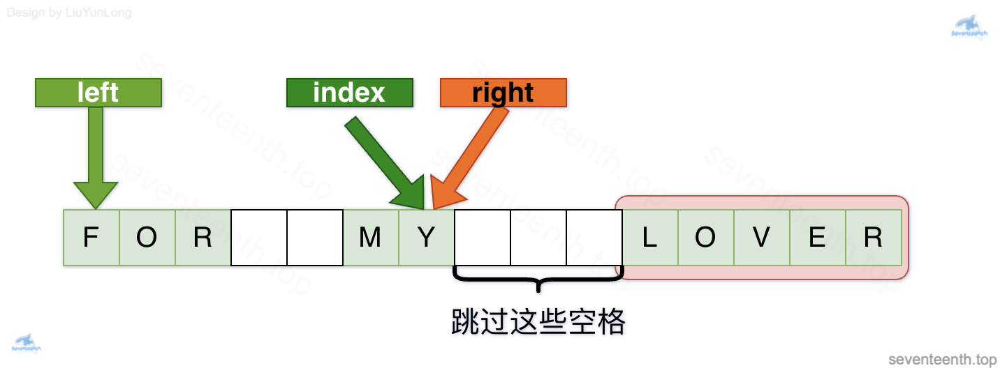
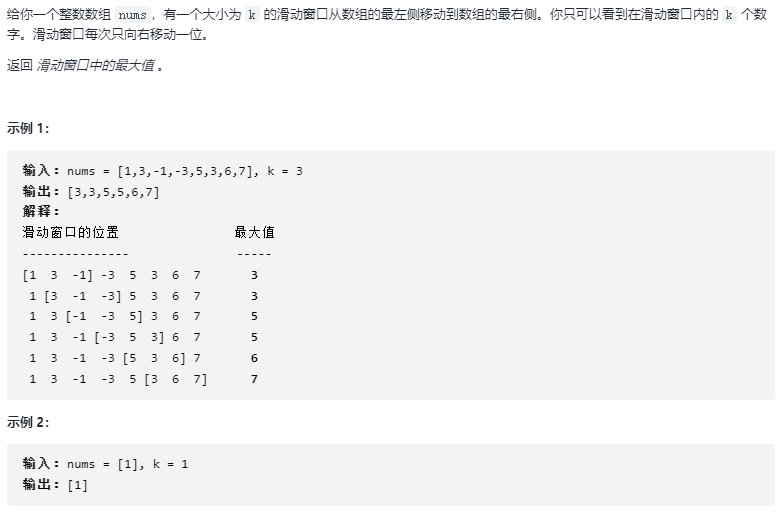

# LeetCode刷题笔记

## 1、数组

### 【704】二分查找

>1、题目描述
>
>
>
>2、思路分析
>
>* 采用二分查找法 定义left 和right两个指针，不断的计算中间位置mid的值 mid = (left + right)/2
>* 如果nums[mid] =target 则返回target的下标
>* 如果nums[mid] < target 则说明target在右半部分,则令left = mid + 1;
>* 如果nums[mid] >  target 则说明target在左半部分,则令right= mid - 1;
>* 循环终止条件 left > right
>
>3、代码实现
>
>```java
>class Solution {
>    public int search(int[] nums, int target) {
>      int left=0;
>      int right=nums.length-1;
>      while(left<=right){
>          int mid = (left+right)/2;
>          if(nums[mid]==target){
>              return mid;
>          }else if(nums[mid]>target){
>              right=mid-1;
>          }else{
>              left=mid+1;
>          }
>      }
>      return -1;
>    }
>}
>```

### 【34】在数组中查找第一个和最后一个元素

>1、题目描述
>
>
>
>2、思路分析
>
>* 设法找到左边界和右边界，关键在于如何向某个方向缩小范围，避免进入死循环。
>* 寻找左边界时，mid = (left + right)/2，向下取整
>* 寻找右边界时，mid = (left + right + 1)/2 向上取整，寻找右边界时，如果数组内没有target，则可能出现角标越界。
>
>3、代码实现
>
>```java
>class Solution {
>    public int[] searchRange(int[] nums, int target) {
>       int[] result = {-1,-1};
>       if(nums == null || nums.length == 0) return result;
>       result[0] = findLeft(nums,target);
>       result[1] = findRight(nums,target);
>       return result;
>    }
>    //寻找左边界 向下取整不断缩小范围
>    private int findLeft(int[] nums, int target){
>       int left = 0;
>       int right = nums.length - 1;
>       int mid = (left + right)/2;
>       while(left < right){
>           mid = (left + right)/2;
>           if(nums[mid] == target){
>               right = mid;
>           }else if(target < nums[mid]){
>               right = mid - 1;
>           }else{
>               left = mid + 1;
>           }
>       }
>       return nums[left] == target? left:-1;
>    }
>    //寻找右边界 注意最后可能出现数组角标越界
>    private int findRight(int[] nums, int target){
>       int left = 0;
>       int right = nums.length - 1;
>       int mid = (left + right + 1)/2;
>       while(left < right){
>           mid = (left + right + 1)/2;
>           if(nums[mid] == target){
>               left = mid;
>           }else if(target < nums[mid]){
>               right = mid - 1;
>           }else{
>               left = mid + 1;
>           }
>       }
>       if(left >= nums.length) return -1;
>       return nums[left] == target? left:-1;
>    }
>}
>```

### 【27】移除元素

>1、题目描述
>
>
>
>2、思路分析
>
>* 定义两个指针 count 和 point，count用于记录删除元素后的角标，point用于遍历原数组
>* 如果当前值nums[point]!=val ，就令nums[count]=nums[point] 并且两个指针都右移
>* 如果当前值nums[point]=val，那么只需将point指针右移，继续向右遍历
>
>3、代码实现
>
>```java
>class Solution {
>    public int removeElement(int[] nums, int val) {
>        int len = nums.length;
>        int point = 0;
>        int count = 0;
>        while(point < len){
>            if(nums[point] != val){
>               nums[count] = nums[point];
>               count++;
>            }
>            point++;
>        }
>        return count;
>    }
>}
>```

### 【977】有序数组的平方

>1、题目描述
>
>
>
>2、思路分析
>
>  方法一：
>
>* 先原地计算数组平方后的结果
>* 再利用排序算法进行排序
>
>  方法二:
>
>* 原数组是一个有序数组，假设其中有正有负，则平方后，其实是一个由两个有序数组拼接起来的数组
>* 利用双指针 i 和 j，一个从平方后的数组的左边开始遍历，另一个从右边开始遍历，每次比较大者放入结果数组中，以此类推
>
>3、代码实现
>
>​    方法一：暴力排序 快排
>
>```java
>class Solution {
>    public int[] sortedSquares(int[] nums) {
>        for(int i=0;i<nums.length;i++){
>            nums[i]=(nums[i]*nums[i]);
>        }
>        quickSort(nums,0,nums.length-1);
>       return nums;
>    }
>    public void quickSort(int[] arr,int left,int right){
>        int l = left;
>        int r= right;
>        int mid = arr[(left+right)/2];
>        int temp = 0;
>        while(l < r){
>            while(arr[l]<mid){
>                l++;
>            }
>            while (arr[r]>mid) {
>                r--;
>            }
>            if(l>=r){
>                break;
>            }
>            temp = arr[l];
>            arr[l]=arr[r];
>            arr[r]=temp;
>            if(arr[l]==mid) {
>                r--;
>            }
>            if(arr[r]==mid) {
>                l++;
>            }
>        }
>        if(l==r){
>            r--;
>            l++;
>        }
>        //向左递归
>        if(left<r){
>            quickSort(arr, left, r);
>        }
>        //向右递归
>        if(right>l){
>            quickSort(arr,l,right);
>        }
>    }
>}
>```
>
>   方法二:双指针
>
>```java
>class Solution {
>    public int[] sortedSquares(int[] nums) {
>      int len = nums.length;
>      int[] ans = new int[len];
>      for(int i = 0,j = len-1,po = len -1;i <= j;){
>          if(nums[i]*nums[i] > nums[j]*nums[j]){
>              ans[po] = nums[i]*nums[i];
>              ++i;
>          }else{
>              ans[po] = nums[j]*nums[j];
>              --j;
>          }
>          --po;
>      }
>      return ans;
>    }
>}
>```

### 【209】长度最小的子数组

>1、题目描述
>
>
>
>2、思路分析
>
>* 采用滑动窗口法 定义两个指针 i 和 j 
>* 如果i 和 j 所指的指针区间 总和sum < target，则++j。
>* 如果 i 和 j 所指的指针区间 总和sum >= target，则++i，缩短区间，期间不断更新，最小数组长度，直到sum < target,然后++j
>
>3、代码实现
>
>```java
>class Solution {
>    public int minSubArrayLen(int target, int[] nums) {
>        int len = nums.length;
>        int i = 0;
>        int j = 0;
>        int result = len + 1;
>        int sum = 0;
>        while(j < len){
>            sum += nums[j];
>            while(sum >= target){
>                result = Math.min(result,j-i+1);
>                sum -=nums[i++];
>            }
>            ++j;
>
>        }
>        return  (result == nums.length + 1)? 0:result;
>    }
>}
>```

### 【59】旋转矩阵Ⅱ

>1、题目描述
>
>
>
>2、思路分析
>
>* 本题涉及一个模拟的过程
>* 
>* 填充上行从左到右
>* 填充右列从上到下
>* 填充下行从右到左
>* 填充左列从下到上
>
>由外向内一圈一圈这么画下去
>
>3、代码实现
>
>```java
>class Solution {
>    public int[][] generateMatrix(int n) {
>       int[][] res = new int[n][n];
>
>       //定义每次循环遍历的起点位置
>       int startX = 0;
>       int startY = 0;
>
>       //定义偏移l量
>       int offset = 1;
>
>       //定义填充数字
>       int count = 1;
>
>       //定义循环次数 如果n为奇数，则矩阵中心的元素需要单独赋值
>       int loop = n/2;
>
>       while(loop > 0){
>       //定义循环变量
>       int i = startX;
>       int j = startY;
>
>       //上侧从左到右遍历
>       for(;j < startX + n -offset;j++){
>           res[startX][j] = count++;
>        }
>       //右侧从上到下遍历
>       for(;i < startY + n -offset;i++){
>           res[i][j] = count++;
>        }
>       //下侧从右到左遍历
>       for(;j > startX;j--){
>           res[i][j] = count++;
>        }
>       //左侧从下到上遍历
>       for(;i > startY;i--){
>           res[i][j] = count++;
>        }
>        //初始位置缩圈
>       startX++;
>       startY++;
>       //更新偏移量 每次减少2个
>       offset +=2;
>       loop--;
>       }
>       if(n % 2 == 1){
>           res[n/2][n/2] = count;
>       }
>       return res;
>    }
>}
>```

## 2、链表

### 【209】移除链表元素

>1、题目描述
>
>
>
>2、思路分析
>
>* 方法一 采用递归  注意每一步返回给上一步的是什么
>* 方法二 迭代
>
>3、代码实现
>
>  方法一：
>
>```java
>class Solution {
>    public ListNode removeElements(ListNode head, int val) {
>       if(head == null){
>           return head;
>       }
>       head.next = removeElements(head.next,val);
>       return head.val == val? head.next:head;
>    }
>}
>```
>
>方法二：
>
>```java
>class Solution {
>    public ListNode removeElements(ListNode head, int val) {
>       if(head == null){
>           return null;
>       }
>       ListNode newHead = new ListNode();
>       newHead.next = head;
>       ListNode temp = newHead;
>       while(temp.next != null){
>           if(temp.next.val == val){
>               temp.next = temp.next.next;
>           }else{
>               temp = temp.next;
>           }
>       }
>       return newHead.next;
>    }
>```

### 【206】反转链表

>1、题目描述
>
>
>
>2、思路分析
>
> 方法一：采用递归
>
>* 考虑每次递归要做的事情以及返回的给上一级的值
>* 将当前节点的下一个节点保存，并进行反转处理，作为新的头节点
>* 当前的节点的下节点指向当前节点，当前节点指向null
>* 将新的头节点当作本次递归的返回值
>
>方法二:采用迭代
>
>* 采用pre 和 cur两个指针不断遍历链表
>* 每次循环中，next保存当前节点cur的下一节点，然后将当前节点cur指向前一个节点pre
>* 而后令pre=cur   cur =next
>
>3、代码实现
>
> 方法一:递归
>
>```java
>class Solution {
>    public ListNode reverseList(ListNode head) {
>    if (head == null || head.next == null) {
>        return head;
>    }
>    ListNode next = head.next;
>    ListNode newHead = reverseList(next);
>    next.next = head;
>    head.next = null;
>    return newHead;
>   }
>}
>```
>
>方法二迭代
>
>```java
>class Solution {
>    public ListNode reverseList(ListNode head) {
>      ListNode pre = null;
>      ListNode cur = head;
>      while(cur!=null){
>          ListNode next = cur.next;
>          cur.next = pre;
>          pre = cur;
>          cur = next;
>      }
>      return pre;
>    }
>}
>```

### 【24】两两交换链表元素

>1、题目描述
>
>
>
>2、思路分析
>
>方法一：递归
>
>* 把当前节点head指向 head.next.next节点处理的结果
>* 而后当前节点的下一节点next  指向当前节点head
>* 最后返回 next 因为此时头节点就是next
>
>3、代码实现
>
> 方法一：递归
>
>```java
>class Solution {
>    public ListNode swapPairs(ListNode head) {
>       if(head==null || head.next==null){
>           return head;
>       }
>       ListNode next=head.next;
>       head.next=swapPairs(next.next);
>       next.next=head;
>       return next;
>    }
>}
>```

### 【19】删除链表的倒数第n个节点

>1、题目描述
>
>
>
>2、思路分析
>
>   采用快慢指针
>
>* 定义dummyHead指向head 为的是可能删除头节点的情况
>* 定义指针slow 和 fast 均指向 dummyHead，fast指针先向前移动n步
>* 之后fast 和 slow指针同时向后遍历，当fast指针指向最后一个节点的next时，slow指针刚好指向要删除的节点
>
>3、代码实现
>
>```java
>class Solution {
>    public ListNode removeNthFromEnd(ListNode head, int n) {
>       ListNode dummyHead = new ListNode();
>       dummyHead.next = head;
>       ListNode slow = dummyHead;
>       ListNode fast = dummyHead;
>       while(n-- > 0){
>           fast = fast.next;
>       }
>       ListNode pre = new ListNode();
>       while(fast != null){
>           pre = slow;
>           slow = slow.next;
>           fast = fast.next;
>       }
>       pre.next = slow.next;
>       return dummyHead.next;
>    }
>}
>```

### 【160】相交链表

>1、题目描述
>
>
>
>2、思路分析
>
>方法一：采用集合Set存储数据，先遍历其中一条链表，再去遍历另一条链表
>
>方法二：采用双指针
>
>*  若两条链表相交  链表1长度为 a+c  链表2长度为 b+c,
>*  定义指针A 和 B，若a=b，则刚好可以判断相交，若a≠b，则遍历完各自的链表，指针指向对方的头部，这样第二轮遍历必会交于相交点。
>* 若两个链表不相交，则经过上述步骤后，两个指针最后都指向两条链表的尾部 null，可以作为结束循环的条件 
>
>3、代码实现
>
>方法一：
>
>```java
>public class Solution {
>    public ListNode getIntersectionNode(ListNode headA, ListNode headB) {
>        if(headA == null || headB == null){
>            return null;
>        }
>        Set<ListNode> visited = new HashSet<ListNode>();
>        ListNode temp = headA;
>        while (temp != null) {
>            visited.add(temp);
>            temp = temp.next;
>        }
>        temp = headB;
>        while (temp != null) {
>            if (visited.contains(temp)) {
>                return temp;
>            }
>            temp = temp.next;
>        }
>        return null;
>    }
>}
>
>```
>
>方法二:
>
>```java
>public class Solution {
>    public ListNode getIntersectionNode(ListNode headA, ListNode headB) {
>        ListNode A = headA, B = headB;
>        while (A != B) {
>            A = A != null ? A.next : headB;
>            B = B != null ? B.next : headA;
>        }
>        return A;
>    }
>}
>
>```

### 【204】环形链表

>1、题目描述
>
>
>
>2、思路分析
>
>方法一:采用HashSet存储出现过的链表元素，判断是否重复出现，一旦出现重复出现的，就说明链表内部存在环
>
>方法二：采用快慢指针 fast 和 slow，若快指针在某个时刻与慢指针重合，说明链表内部存在环
>
>
>
>3、代码实现
>
>​    方法一:
>
>```java
>public class Solution {
>    public boolean hasCycle(ListNode head) {
>        Set<ListNode> arr = new HashSet();
>        while(head != null){
>            if(!arr.contains(head)){
>                 arr.add(head);
>                 head = head.next;
>            }
>            else{
>                return true;
>            }
>        }
>        return false;
>    }
>}
>```
>
>  方法二:
>
>```java
>public class Solution {
>    public boolean hasCycle(ListNode head) {
>        if (head == null || head.next == null) {
>            return false;
>        }
>        ListNode slow = head;
>        ListNode fast = head.next;
>        while (slow != fast) {
>            if (fast == null || fast.next == null) {
>                return false;
>            }
>            slow = slow.next;
>            fast = fast.next.next;
>        }
>        return true;
>    }
>}
>```
>

### 【142】环形链表Ⅱ

>1、题目描述
>
>
>
>2、思路分析
>
>   采用双针法
>
>* 定义快慢指针 fast 和 slow 
>* 第一次相遇时  f=2s   f=s+nb  （其中a为head节点到环入口的距离 不包括环入口节点，b为环的长度），此时s=nb，也就是说在当前状态下，slow再走a步就可以到达环入口节点。
>* 若此时将 fast指针重新指向head节点，fast指针再走a步也同样到达环入口节点，令fast和slow每次都走一步，则再次相遇时，两指针均恰好 指向环入口节点。
>
>3、代码实现
>
>```java
>public class Solution {
>    public ListNode detectCycle(ListNode head) {
>        ListNode slow = head;
>        ListNode fast = head;
>        while(true){
>            if(fast == null || fast.next == null) return null;
>            fast = fast.next.next;
>            slow = slow.next;
>            if(fast == slow)  break;
>        }
>        fast = head;
>        while(fast != slow){
>            fast = fast.next;
>            slow = slow.next;
>        }
>        return slow;
>    }
>}
>```

## 3、哈希表

### 【242】有效的字母异位词

>1、题目描述
>
>
>
>2、思路分析
>
>方法一 采用哈希表
>
>* 定义用于26个字母出现次数的数组，将字符串中对应字符的值 s.charAt(i) - 'a' ，作为数组的下标
>* 先遍历s串，按照字母对应下标统计出现的次数，s串对应的每个字符加处理，t串对应的每个字符减处理
>* 全部处理完后，检查数组中是否有值为非0的数 若有则返回false，没有则返回true。
>
>方法二 先排序后比较
>
>3、代码实现
>
>​      方法一 
>
>```java
>class Solution {
>    public boolean isAnagram(String s, String t) {
>        if(s.length() != t.length()) return false;
>        int[] res = new int[26];
>        for(int i = 0;i<s.length();i++){
>            res[s.charAt(i) - 'a']++;
>            res[t.charAt(i) - 'a']--;
>        }
>        for(int i=0;i<26;i++){
>            if(res[i] != 0) return false;
>        }
>        return true;
>    }
>}
>```
>
>​     方法二
>
>```java
>class Solution {
>    public boolean isAnagram(String s, String t) {
>        if(s.length() != t.length()) return false;
>        char[] str1 = s.toCharArray();
>        char[] str2 = t.toCharArray();
>        Arrays.sort(str1);
>        Arrays.sort(str2);
>        return Arrays.equals(str1,str2);
>    }
>}
>```
>

### 【349】两个数组的交集 	

>1、题目描述
>
>
>
>2、解题思路
>
>方法一 采用哈希表
>
>* set1  和 set2 分别存储 两个数组的元素
>* 循环遍历 元素较多的那个哈希表 判断另一个哈希表中是否存在相同的元素 若相同则加入结果的哈希表中
>
>3、代码实现
>
>```java
>class Solution {
>    public int[] intersection(int[] nums1, int[] nums2) {
>        Set<Integer> set1 = new HashSet();
>        Set<Integer> set2 = new HashSet();
>        for(int i:nums1){
>            set1.add(i);
>        }
>        for(int i:nums2){
>            set2.add(i);
>        }
>        if(set1.size() > set2.size()){
>            return getIntersection(set1,set2);
>        }
>        return getIntersection(set2,set1);
>    }
>
>    public int[] getIntersection(Set<Integer> set1,Set<Integer> set2){
>        Set<Integer> intersectionSet = new HashSet();
>        for(int i:set1){
>            if(set2.contains(i)){
>                intersectionSet.add(i);
>            }
>        }
>        int[] res = new int[intersectionSet.size()];
>        int count = 0;
>        for(int i : intersectionSet){
>           res[count++] = i;
>        }
>        return res;
>    }
>}
>```
>

### 【202】快乐数

>1、题目描述
>
>
>
>2、思路分析
>
>方法一 采用哈希表
>
>* 定义一个函数 获取一个正整数 每个位置上的数的平方和
>* 定义一个集合存储出现过的和值
>* 循环判断  新的和是否出现过 若未出现过则将其加入集合中，若出现过，则表明陷入循环 不是快乐数，若和为1则为快乐数
>
>方法二 采用快慢指针
>
>* 如果说 这个数 不是快乐数 那么它必将进入一个循环当中
>
>
>
>* 采用快慢指针来判断是否有环存在
>
>3、代码实现
>
>方法一：
>
>```java
>class Solution {
>    public boolean isHappy(int n) {
>        Set<Integer> set = new HashSet();
>        while(!set.contains(n)){
>            if(n == 1) return true;
>            set.add(n);
>            n = getSum(n);
>        }
>        return false;
>    }
>
>    public int getSum(int n){
>        int sum = 0;
>        while(n > 0){
>          sum += (n%10) * (n%10);
>          n /= 10;
>        } 
>        return sum;
>    }
>}
>```
>
>方法二：
>
>```java
>class Solution {
>
>     public int getNext(int n) {
>        int totalSum = 0;
>        while (n > 0) {
>            int d = n % 10;
>            n = n / 10;
>            totalSum += d * d;
>        }
>        return totalSum;
>    }
>
>    public boolean isHappy(int n) {
>        int slowRunner = n;
>        int fastRunner = getNext(n);
>        while (fastRunner != 1 && slowRunner != fastRunner) {
>            slowRunner = getNext(slowRunner);
>            fastRunner = getNext(getNext(fastRunner));
>        }
>        return fastRunner == 1;
>    }
>}
>```

### 【454】四数相加

>1、题目描述
>
>
>
>2、思路分析
>
>* 四个数组中 取出 先遍历 A 数组 和 B数组 取出两个数 进行计算 a + b ，并且统计所有可能性的结果 存入map中，并统计同一个和的次数。
>* 遍历数组C 和 D，查找c 和 d 是否满足 0 - (c + d) 是否在map中，若存在则查找当前值的个数 并累计到结果res中
>
>3、代码实现
>
>```java
>class Solution {
>    public int fourSumCount(int[] nums1, int[] nums2, int[] nums3, int[] nums4) {
>         Map<Integer,Integer> map = new HashMap();
>         int res = 0;
>         int temp = 0;
>         for(int i : nums1){
>             for(int j : nums2){
>                 temp = i + j;
>                 if(map.containsKey(temp)){
>                     map.put(temp,map.get(temp) + 1);
>                 }else{
>                     map.put(temp,1);
>                 }
>             }
>         }
>         for(int i : nums3){
>             for(int j : nums4){
>                 temp = i + j;
>                 if(map.containsKey(0 - temp)){
>                     res += map.get(0 - temp);
>                 }
>             }
>         }
>         return res;
>    }
>}
>```

### 【383】赎金信

>1、题目描述
>
>
>
>2、思路分析
>
>* 定义一个长度为26的记录数组record，记录每个字母出现的次数
>* 遍历magazine中出现的字母，并将每个字母出现的次数保存到数组中
>* 遍历ransomNote中出现的字母，并将记录数组record中对应次数减1 判断是否出现负数
>*   ！！！本题也可采用哈希表HashMap实现，但是**使用map的空间消耗要比数组大一些的，因为map要维护红黑树或者哈希表，而且还要做哈希函数，是费时的！数据量大的话就能体现出来差别了。 所以数组更加简单直接有效！**
>
>3、代码实现
>
>```java
>class Solution {
>    public boolean canConstruct(String ransomNote, String magazine) {
>            int[] record = new int[26];
>            for(int i = 0;i < magazine.length();i++){
>                record[magazine.charAt(i) - 'a']++;
>            }
>            for(int i = 0;i < ransomNote.length();i++){
>                record[ransomNote.charAt(i) - 'a']--;
>                if(record[ransomNote.charAt(i) - 'a'] < 0) return false;
>            }
>            return true;
>    }
>}
>```

### 【15】三数之和

>1、题目描述
>
>
>
>2、思路分析
>
>* 双指针法，**这道题目使用双指针法 要比哈希法高效一些**
>
>* 
>
>* 拿这个nums数组来举例，首先将数组排序，然后有一层for循环，i从下标0的地方开始，同时定一个下标left 定义在i+1的位置上，定义下标right 在数组结尾的位置上。
>
>  ​       依然还是在数组中找到 a b c 使得a + b +c =0，我们这里相当于 a = nums[i]  b = nums[left]   c = nums[right]。
>
>  接下来如何移动left 和right呢， 如果nums[i] + nums[left] + nums[right] > 0 就说明 此时三数之和大了，因为数组是排序后了，所以right下标就应该向左移动，这样才能让三数之和小一些。
>
>  ​        如果 nums[i] + nums[left] + nums[right] < 0 说明 此时 三数之和小了，left 就向右移动，才能让三数之和大一些，直到left与right相遇为止。
>
>  时间复杂度：$O(n^2)$。
>
>3、代码实现   80%  19% 
>
>```java
>class Solution {
>    public List<List<Integer>> threeSum(int[] nums) {
>    List<List<Integer>> res = new ArrayList();
>    if(nums == null || nums.length < 3) return res;
>    Arrays.sort(nums);
>    for(int i = 0; i < nums.length;i++){
>        if(nums[i] > 0) return res;
>        if(i > 0 && nums[i] == nums[i - 1]) continue;
>        int left = i + 1;
>        int right = nums.length - 1;
>        while(right > left){
>            int sum = nums[i] + nums[left] + nums[right];
>            if( sum > 0){
>                right--;
>            }else if(sum < 0){
>                left++;
>            }else{
>                res.add(Arrays.asList(nums[i],nums[left],nums[right]));
>                while(right > left && nums[left] == nums[left + 1]) left++;
>                while(right > left && nums[right] == nums[right - 1]) right--;
>
>                right--;
>                left++;
>            }
>        }
>
>      }
>      return res;
>    }
>}
>```

### 【18】四数之和

>1、题目描述
>
>
>
>2、思路分析
>
>* 四数之和的双指针解法是两层for循环nums[i] + nums[j]为确定值，依然是循环内有left和right下标作为双指针，找出nums[i] + nums[j] + nums[left] + nums[right] == target的情况，三数之和的时间复杂度是$O(n^2)$，四数之和的时间复杂度是$O(n^3)$ 
>* 本题思路和三数之和一致, 唯一要注意的地方就是少了一种剪枝的情况:
>  nums[i] > target时不能剪枝, 因为target是任意值;
>   存在以下情况: nums[i] < 0, target < 0, nums[i] > target, 若nums[i]后面还有负数, 则仍有可能和为target
>
>3、代码实现
>
>```java
>class Solution {
>    public List<List<Integer>> fourSum(int[] nums, int target) {
>        List<List<Integer>> res = new ArrayList();
>        if(nums.length < 4) return res;
>        Arrays.sort(nums);
>        for(int i = 0;i < nums.length; i++){
>            //if(nums[i] > target) return res; 不能减枝
>            if(i > 0 && nums[i] == nums[i -1]) continue;
>            for(int j = i + 1;j < nums.length;j++){
>                //if(nums[j] > target) return res;不能剪枝
>                if(j > i + 1 && nums[j] == nums[j -1]) continue;
>                int left = j + 1;
>                int right = nums.length - 1;
>                //双指针向中间靠拢
>                while(right > left){
>                    int sum = nums[i] + nums[j] + nums[left] + nums[right];
>                    if(sum == target){
>                        res.add(Arrays.asList(nums[i],nums[j],nums[left],nums[right]));
>                        while(right > left && nums[left] == nums[left + 1]) left++;
>                        while(right > left && nums[right] == nums[right - 1]) right--;
>                        right--;
>                        left++;
>                    }else if(sum < target){
>                        left++;
>                    }else{
>                        right--;
>                    }
>                }
>            }
>        } 
>        return res; 
>    }
>}
>```

## 4、字符串

### 【344】反转字符串

>1、题目描述
>
>
>
>2、思路分析
>
>* 方法一 采用双指针
>
>* 方法二 采用异或运算实现交换
>
>* * 1.任意一个变量X与其自身进行异或运算，结果为0，即X^X=0
>
>    2.任意一个变量X与0进行异或运算，结果不变，即X^0=X
>
>    3.异或运算具有可结合性，即a^b^c=（a^b）^c=a^（b^c）
>
>    4.异或运算具有可交换性，即a^b=b^a
>
>3、代码实现
>
>```java
>class Solution {
>    public void reverseString(char[] s) {
>      int left = 0;
>      int right = s.length - 1;
>      char temp = ' ';
>      while(left < right){
>          temp = s[right];
>          s[right] = s[left];
>          s[left] = temp;
>          left++;
>          right--;
>      }
>    }
>}
>```
>
>```java
>class Solution {
>    public void reverseString(char[] s) {
>        int l = 0;
>        int r = s.length - 1;
>        while (l < r) {
>            s[l] ^= s[r];  //构造 a ^ b 的结果，并放在 a 中
>            s[r] ^= s[l];  //将 a ^ b 这一结果再 ^ b ，存入b中，此时 b = a, a = a ^ b
>            s[l] ^= s[r];  //a ^ b 的结果再 ^ a ，存入 a 中，此时 b = a, a = b 完成交换
>            l++;
>            r--;
>        }
>    }
>}
>```

### 【541】反转字符串Ⅱ

>1、题目描述
>
>
>
>2、思路分析
>
>* 模拟    反转每个下标从 2k2*k* 的倍数开始的，长度为 k*k* 的子串。若该子串长度不足 k*k*，则反转整个子串。
>
>3、代码实现
>
>```java
>class Solution {
>    public String reverseStr(String s, int k) {
>        int n = s.length();
>        char[] arr = s.toCharArray();
>        for (int i = 0; i < n; i += 2 * k) {
>            reverse(arr, i, Math.min(i + k, n) - 1);
>        }
>        return new String(arr);
>    }
>
>    public void reverse(char[] arr, int left, int right) {
>        while (left < right) {
>            char temp = arr[left];
>            arr[left] = arr[right];
>            arr[right] = temp;
>            left++;
>            right--;
>        }
>    }
>}
>```

### 【剑指05】替换空格

>1、题目描述
>
>
>
>2、思路分析
>
>* 方法一 ：采用StringBuilder，遇到空格就添加%20，否则添加原字符
>
>* 方法二：采用双指针 先统计字符串中的空格总数，新建一个大小满足填充后的大小的数组
>
>     * 左指针指向原数组的尾部，右指针指向新数组的尾部，从后向前遍历，判断原数组是否为空格
>
>     * 如果左指针移动到空格，则右指针一次向前填充0 2 %,左指针向前移动一位，右指针向前移动3位；
>
>     * 如果左指针指向的不是空格，则将左指针指向的字符拷贝到右指针的位置，左指针向前移动1位，右指针向前移动1位。
>
>       3、代码实现
>
>```java
>class Solution {
>   public String replaceSpace(String s) {
>       StringBuilder sb = new StringBuilder();
>        for(int i = 0; i < s.length();i++){
>            if(s.charAt(i) == ' '){
>                sb.append("%20");
>            }else{
>                sb.append(s.charAt(i));
>            }
>        }
>        return sb.toString();
> 
>    }
>}
> ```
>
>```java
>class Solution {
>   public String replaceSpace(String s) {
>       char[] ch = s.toCharArray();
>        int count = 0;
>        // 统计空格数
>        for(int i = 0 ;i < ch.length;i++){
>            if(ch[i]==' ')
>            count++;
>        }
>        // 比原来的多2个字符，所以是原来的基础上＋count*2
>        char[] ch2 = new char[ch.length+count*2];
> 
>        int l = ch.length-1;
>       int r = ch2.length-1;
>        for(int i = 0;i<ch.length;i++){
>            if(ch[l]==' '){
>                ch2[r]='0';
>                ch2[r-1]='2';
>                ch2[r-2]='%';
>                l--;
>                r-=3;
>            }else{
>                ch2[r] = ch[l];
>                l--;
>                r--;
>            }
>        }
>    return new String(ch2);
>    }
> }
> ```

### 【151】翻转字符串里的单词

>1、题目描述
>
>
>
>2、思路分析
>
>* 采用双指针 从后向前搬运字符串到StringBuilder中
>* 
>* 
>* 
>* 
>* 
>
>3、代码实现
>
>```java
>class Solution {
>    public String reverseWords(String s) {
>       char[] charArray = s.toCharArray();
>       int left = 0;
>       int right = charArray.length - 1;
>       //第一步 删除字符串左右两侧的空格
>       while(charArray[left] == ' '){
>           left++;
>       }
>       while(charArray[right] == ' '){
>           right--;
>       }
>       //现在左指针已经指向第一个单词的第一个字母，和最后一个单词的最后一个字母
>       int index = right;
>       StringBuilder res = new StringBuilder();
>       while(right >= left){
>           //定位最后一个单词的首尾
>           while(index >= left && charArray[index] != ' '){
>               index--;
>           }
>           //现在index已经指向最后一个单词的前一个空格,可将最后一个单词拷贝到StringBuilder中
>           for(int i = index + 1;i <= right;i++){
>               res.append(charArray[i]);
>           }
>           //将现存字符串的最后一个单词 添加进StringBuilder后考虑添加一个空格进入
>           if(index > left){
>               res.append(' ');
>           }
>           //将index移动到倒数第二个单词的尾部 同时也把right指针移动过去
>           while(index >= left && charArray[index] == ' '){
>               index--;
>           }
>           //此时index已经指向倒数第二个单词的尾部了
>           right = index;
>           //接下来开始新的一轮循环
>       }
>       return res.toString();
>    }
>}
>```

### 【剑指Ⅱ58】左旋转字符串

>1、题目描述
>
>
>
>2、思路分析
>
>* 反转区间为前n的子串
>* 反转区间为n到末尾的子串
>* 反转整个字符串
>* 
>
>3、代码实现
>
>```java
>class Solution {
>    public String reverseLeftWords(String s, int n) {
>       char[] str = s.toCharArray();
>       reverse(str,0,n-1);
>       reverse(str,n,str.length - 1);
>       reverse(str,0,str.length - 1);
>       return new String(str);
>    }
>    private void reverse(char[] str,int left,int right){
>        char temp = ' ';
>        while(left < right){
>             temp = str[right];
>            str[right] = str[left];
>            str[left] = temp;
>            left++;
>            right--;
>        }
>    }
>}
>```

### 【28】实现strStr()

>1、题目描述
>
>
>
>2、思路分析
>
>3、代码实现

### 【459】重复的子字符串

>1、题目描述
>
>
>
>2、思路分析
>
>3、代码实现

## 5、双指针

### 【27】移除元素

>1、题目描述
>
>
>
>2、思路分析
>
>* 采用快慢双指针
>* 
>
>3、代码实现
>
>```java
>class Solution {
>    public int removeElement(int[] nums, int val) {
>        int len = nums.length;
>        int point = 0;
>        int count = 0;
>        while(point < len){
>            if(nums[point] != val){
>               nums[count] = nums[point];
>               count++;
>            }
>            point++;
>        }
>        return count;
>    }
>}
>```

### 【344】反转字符串 

### 【剑指05】替换空格

### 【151】翻转字符串里的单词

### 【206】反转链表

### 【19】删除链表的倒数第n个节点

### 【160】相交链表

### 【142】环形链表Ⅱ

### 【15】三数之和

### 【18】四数之和

## 6、栈和队列

### 【20】有效的括号

>1、题目描述
>
>
>
>2、思路分析
>
>* 利用栈先进后出的特性
>* 根据题意 括号字符串 要满对称的特性，必须形成有效的配对
>* 从左向右遍历字符串
>* 若出现左括号，则对应的将其右括号压入栈中。
>* 若出现右括号则判断当前的栈顶元素是否与其相同，若不同则无效，若此时栈为空 也无效：说明没有对应的左括号与其匹配。
>* 若出现右括号并且栈顶元素与当前的右括号匹配，则将栈顶元素弹出，相当于一组有效匹配结束。
>* 最后返回 当前栈是否为空，若不为空。说明括号字符串左右两侧有多余的  也 无效
>
>```java
>class Solution {
>    public boolean isValid(String s) {
>      Deque<Character> stack = new LinkedList();
>      for(int i = 0;i < s.length();i++){
>          char tem = s.charAt(i);
>          if(tem == '('){
>              stack.push(')');
>          }else if(tem == '{'){
>              stack.push('}');
>          }else if(tem == '['){
>              stack.push(']');
>          }else if(stack.isEmpty() || tem != stack.peek()){
>              return false;
>          }else{
>              stack.pop();
>          }
>      }
>      return stack.isEmpty();
>    }
>}
>```
>

### 【1047】删除字符串中的所有相邻重复项

>1、题目描述
>
>
>
>2、思路分析
>
>方法一  栈
>
>* 采用栈先进后出的特性
>* 判断当前字符与栈顶元素是否相同，如果相同的话，就将栈顶元素弹出
>* 最后将栈中元素依次弹出作为结果返回
>
>方法二  双指针
>
>3、代码实现
>
>```java
>class Solution {
>    public String removeDuplicates(String s) {
>        if(s == null || s.length() <= 1) return s;
>      Deque<Character> stack = new LinkedList();
>      stack.push(s.charAt(0));
>      for(int i = 1;i < s.length();i++){
>          if(stack.isEmpty()){
>              stack.push(s.charAt(i));
>          }else if(stack.peek() == s.charAt(i)){
>             stack.pop();
>          }else{
>             stack.push(s.charAt(i));
>         }
>      }
>      StringBuilder res = new StringBuilder();
>      for(char tem : stack){
>          res.append(tem);
>      }
>      return res.reverse().toString();
>    }
>}
>```
>
>```java
>class Solution {
>    public String removeDuplicates(String s) {
>        char[] ch = s.toCharArray();
>        int fast = 0;
>        int slow = 0;
>        while(fast < s.length()){
>            // 直接用fast指针覆盖slow指针的值
>            ch[slow] = ch[fast];
>            // 遇到前后相同值的，就跳过，即slow指针后退一步，下次循环就可以直接被覆盖掉了
>            if(slow > 0 && ch[slow] == ch[slow - 1]){
>                slow--;
>            }else{
>                slow++;
>            }
>            fast++;
>        }
>        return new String(ch,0,slow);
>    }
>}
>```

### 【150】逆波兰表达式求值

>1、题目描述
>
>
>
>2、思路分析
>
>* 首先明确什么是中序表达式、逆波兰表达式(后缀表达式)
>* 根据逆波兰表达式的特性，遇到数字压入栈中，遇到运算符则从栈中两次弹出栈顶元素进行运算，然后再压入栈中
>* 直至整个逆波兰表达式遍历完，此时栈中的结果就是计算的结果。
>
>3、代码实现
>
>```java
>class Solution {
>    public int evalRPN(String[] tokens) {
>        Deque<Integer> stack = new LinkedList<Integer>();
>        int n = tokens.length;
>        for (int i = 0; i < n; i++) {
>            String token = tokens[i];
>            if (isNumber(token)) {
>                stack.push(Integer.parseInt(token));
>            } else {
>                int num2 = stack.pop();
>                int num1 = stack.pop();
>                switch (token) {
>                    case "+":
>                        stack.push(num1 + num2);
>                        break;
>                    case "-":
>                        stack.push(num1 - num2);
>                        break;
>                    case "*":
>                        stack.push(num1 * num2);
>                        break;
>                    case "/":
>                        stack.push(num1 / num2);
>                        break;
>                    default:
>                }
>            }
>        }
>        return stack.pop();
>    }
>
>    public boolean isNumber(String token) {
>        return !("+".equals(token) || "-".equals(token) || "*".equals(token) || "/".equals(token));
>    }
>}
>```

### 【239】滑动窗口最大值

>1、题目描述
>
>
>
>2、思路分析
>
>* 在窗口滑动的过程中，维护一个单调队列，用于存储数组元素的小标，单调针对的是下标对应的数组元素的大小。
>
>* 这个队列里维护的数值从大到小，从左到右。每个时刻滑动窗口的最大值即为单调队列的peek处维护的下标 对应的数组 元素值。
>
>* 为了实现这样的单调队列，采用ArrayDeque
>
>    设计单调队列的时候，pop，和push操作要保持如下规则：
>
>  * pop(value)：如果窗口移除的元素value等于单调队列的出口元素，那么队列弹出元素，否则不用任何操作。
>  * push(value)：如果push的元素value大于入口元素的数值，那么就将队列入口的元素弹出，直到push元素的数值小于等于队列入口元素的数值为止
>  * 
>
>3、代码实现
>
>```java
>class Solution {
>    public int[] maxSlidingWindow(int[] nums, int k) {
>        //用一个单调队列来存储对应的下标，每当窗口滑动的时候，直接取队列的头部指针对应的值放入结果集即可
>        ArrayDeque<Integer> deque = new ArrayDeque();
>       int len = nums.length;
>       int[] res = new int[len - k + 1];
>       int index = 0;
>       for(int i = 0;i < len;i++){
>        //头部的元素 如果已经落在滑动窗口的左侧的话 则应该将其删除
>        while(!deque.isEmpty() && deque.peek() < i - k + 1){
>            deque.poll();
>        }
>        //随着滑动窗口的移动，右侧的元素添加进来，为了保证单调递减的顺序，需要与队列尾部的元素进行比较，遇到比当前元素小的
>        //队尾元素，就将其删除
>        while(!deque.isEmpty() && nums[deque.peekLast()] < nums[i]){
>            deque.pollLast();
>        }
>        deque.offer(i);
>        //当滑动窗口整个进入数组之后，就可以开始取每个时刻窗口的最大值,即为单调队列的头部元素。
>        if(i >= k - 1){
>            res[index++] = nums[deque.peek()];
>        }
>       }
>       return res;
>    }
>}
>```

### 【347】前K个高频元素

>1、题目描述
>
>
>
>2、思路分析
>
>* HashMap统计频数，采用优先队列(小顶堆)存储出现频率前K高的数
>* 优先级队列就是披着队列外衣的堆，因为优先级队列对外接口只是从队头取元素，从队尾添加元素，再无其他取元素的方式，看起来就是一个队列，而且优先级队列内部元素是自动依照元素的权值排列。
>* 熟悉大顶堆、小顶堆。
>* 
>
>3、代码实现
>
>```java
>class Solution {
>    public int[] topKFrequent(int[] nums, int k) {
>       int[] res = new int[k];
>       HashMap<Integer,Integer> map = new HashMap();
>       for(int num : nums){
>           map.put(num,map.getOrDefault(num,0) + 1);
>       }
>       Set<Map.Entry<Integer,Integer>> entries = map.entrySet();
>       //根据Map的value值进行正排序 相当于一个小顶堆
>       PriorityQueue<Map.Entry<Integer,Integer>> queue = new PriorityQueue<>((o1,o2) -> o1.getValue() - o2.getValue());
>       for(Map.Entry<Integer,Integer> entry : entries){
>           queue.offer(entry);
>           //一旦小顶堆中的元素大于k则将堆顶元素弹出，弹出的都是频率小的。
>           if(queue.size() > k){
>               queue.poll();
>           }
>        }
>        //从小顶堆中倒序输出结果 就是出现频率前k高的元素
>        for(int i = k -1;i >= 0;i--){
>            res[i] = queue.poll().getKey();
>        }
>        return res;
>  }
>}
>```

## 7、二叉树

### 【递归遍历】

* 说白了递归就是一种循环，一种自己调用自己的循环。

* 一道题你看能不能用递归实现，需要具备两个条件：

* 1、问题可以分为多个重复的子问题，子问题仅存在数据规模的差距。
* 2、存在终止条件。
* 所以根据条件，对于实现递归，只需要两步：

​               找出重复的子问题（递推公式）。
​               终止条件。

>1、前序遍历
>
>```java
>class Solution {
>    public List<Integer> preorderTraversal(TreeNode root) {
>        List<Integer> res = new ArrayList();
>        preorder(root,res);
>        return res;
>    }
>    private void preorder(TreeNode root, List<Integer> res){
>        if(root == null){
>            return;
>        }
>        res.add(root.val);
>        preorder(root.left,res);
>        preorder(root.right,res);
>    }
>}
>```
>
>2、中序遍历
>
>```java
>class Solution {
>    public List<Integer> inorderTraversal(TreeNode root) {
>       List<Integer> res = new ArrayList();
>       inorder(root,res);
>       return res;
>    }
>    private void inorder(TreeNode root,List<Integer> res){
>        if(root == null) return;
>        inorder(root.left,res);
>        res.add(root.val);
>        inorder(root.right,res);
>    }
>}
>```
>
>3、后序遍历
>
>```java
>class Solution {
>    public List<Integer> postorderTraversal(TreeNode root) {
>        List<Integer> res = new ArrayList();
>        postorder(root,res);
>        return res;
>    }
>    private void postorder(TreeNode root,List<Integer> res){
>        if(root == null) return;
>        postorder(root.left,res);
>        postorder(root.right,res);
>        res.add(root.val);
>    }
>}
>```

### 【迭代遍历】

【前序遍历】

1、都知道前序遍历的顺序是：根、左子树、右子树，也就是先输出根，再输出左子树，最后输出右子树。

2、每次都是先将根节点放入栈，然后右子树，最后左子树。

具体步骤如下所示：

​    1、初始化维护一个栈，将根节点入栈。

​    2、当栈不为空时，弹出栈顶元素 node，将节点值加入结果数组中。
​    3、若 node 的右子树不为空，右子树入栈。
​    4、若 node 的左子树不为空，左子树入栈


>1、前序遍历
>
>```java
>class Solution {
>    public List<Integer> preorderTraversal(TreeNode root) {
>        List<Integer> res = new ArrayList();
>        Deque<TreeNode> stack = new LinkedList();
>        if(root == null) return res;
>        stack.push(root);
>        while(!stack.isEmpty()){
>            TreeNode tem = stack.pop();
>            res.add(tem.val);
>            if(tem.right != null) stack.push(tem.right);
>            if(tem.left != null) stack.push(tem.left);
>        }
>        return res;
>        
>    }
>}
>```
>
>**前序遍历中访问节点（遍历节点）和处理节点（将元素放进result数组中）可以同步处理，但是中序就无法做到同步！**
>
>2、中序遍历
>
>```
>
>```
>
>3、后序遍历
>
>```
>
>```


### 【层序遍历】

#### 102.二叉树的层序遍历

>1、题目描述
>
>
>
>2、思路分析
>
>* 
>* 采用广度优先搜索
>* 首先根元素入队，当队列不为空的时候，求当前队列的长度len，依次从队列中取 len个元素进行拓展，然后进入下一次迭代
>  它和普通广度优先搜索的区别在于，普通广度优先搜索每次只取一个元素拓展，而这里每次取 len个元素。在上述过程中的第 ii 次迭代就得到了二叉树的第 ii 层的元素
>
>3、代码实现
>
>```java
>class Solution {
>    public List<List<Integer>> levelOrder(TreeNode root) {
>         List<List<Integer>> resList = new ArrayList();
>         if(root == null) return resList;
>         Queue<TreeNode> stack = new LinkedList();
>         stack.offer(root);
>         while(!stack.isEmpty()){
>             int len = stack.size();
>             List<Integer> itemList = new ArrayList();
>             while(len > 0){
>                 TreeNode tem = stack.poll();
>                 itemList.add(tem.val);
>                 if(tem.left != null) stack.offer(tem.left);
>                 if(tem.right != null) stack.offer(tem.right);
>                 len--;
>             }
>             resList.add(itemList);
>         }
>         return resList;
>    }
>}
>```

#### 107.二叉树的层序遍历Ⅱ

>1、题目描述
>
>
>
>2、思路分析
>
>* 思路与从上到下的遍历相似
>* 如果要求从上到下输出每一层的节点值，做法是很直观的，在遍历完一层节点之后，将存储该层节点值的列表添加到结果列表的尾部。这道题要求从下到上输出每一层的节点值，只要对上述操作稍作修改即可：在遍历完一层节点之后，将存储该层节点值的列表添加到结果列表的头部。
>* 将结果链表声明为LinkedList，结果列表可以使用链表的结构，在链表头部添加一层节点值的列表的时间复杂度是 O(1)
>
>3、代码实现
>
>```java
>class Solution {
>    public List<List<Integer>> levelOrderBottom(TreeNode root) {
>        List<List<Integer>> resList = new LinkedList<List<Integer>>();
>        if(root == null) return resList;
>        Queue<TreeNode> queue = new LinkedList();
>        queue.offer(root);
>        while(!queue.isEmpty()){
>            List<Integer> itemList = new ArrayList();
>            int len = queue.size();
>            while(len > 0){
>                TreeNode tem = queue.poll();
>                itemList.add(tem.val);
>                if(tem.left != null) queue.offer(tem.left);
>                if(tem.right != null) queue.offer(tem.right);
>                len--;
>            }
>            resList.add(0,itemList);
>        }
>        return resList;
>    }
>}
>```

#### 199.二叉树的右视图

>1、题目描述
>
>
>
>2、思路分析
>
>* 层序遍历的时候，判断是否遍历到单层的最后面的元素，如果是，就放进result数组中，随后返回result就可以了
>
>3、代码实现
>
>```java
>class Solution {
>    public List<Integer> rightSideView(TreeNode root) {
>        List<Integer> resList = new ArrayList();
>        if(root == null) return resList;
>        Queue<TreeNode> queue = new LinkedList();
>        queue.offer(root);
>        while(!queue.isEmpty()){
>            int len = queue.size();
>            while(len > 0){
>                TreeNode tem = queue.poll();
>                if(len == 1) resList.add(tem.val);
>                if(tem.left != null) queue.offer(tem.left);
>                if(tem.right != null) queue.offer(tem.right);
>                len--;
>            }
>        }
>        return resList;
>    }
>}
>```

#### 637.二叉树的层平均值

>1、题目描述
>
>
>
>2、思路分析
>
>* 采用层序遍历，统计每层的平均值
>
>3、代码实现
>
>```java
>class Solution {
>    public List<Double> averageOfLevels(TreeNode root) {
>        List<Double> resList = new ArrayList();
>        if(root == null) return resList;
>        Queue<TreeNode> queue = new LinkedList();
>        queue.offer(root);
>        while(!queue.isEmpty()){
>            int len = queue.size();
>            int levelCount = len;
>            double sum = 0;
>            while(len > 0){
>                TreeNode tem = queue.poll();
>                sum += tem.val;
>                if(tem.left != null) queue.offer(tem.left);
>                if(tem.right != null) queue.offer(tem.right);
>                len--;
>            }
>            resList.add(sum / levelCount);
>        }
>        return resList;
>    }
>}
>```

429.N叉树的层序遍历

>1、题目描述
>
>
>
>2、思路分析
>
>* 层序遍历时，循环添加多个孩子节点
>
>3、代码实现
>
>```java
>class Solution {
>    public List<List<Integer>> levelOrder(Node root) {
>         List<List<Integer>> resList = new ArrayList();
>         if(root == null) return resList;
>         Queue<Node> queue = new LinkedList();
>         queue.offer(root);
>         while(!queue.isEmpty()){
>             int len = queue.size();
>             List<Integer> itemList = new ArrayList();
>             while(len > 0){
>                 Node tem = queue.poll();
>                 itemList.add(tem.val);
>                 List<Node> childrenList = tem.children; 
>                 for(Node node : childrenList){
>                     queue.offer(node);
>                 }
>                 len--;
>             }
>             resList.add(itemList);
>         }
>         return resList;
>    }
>}
>```

#### 515.在每个树行中找最大值 **低效**

>1、题目描述
>
>
>
>2、思路分析
>
>* 层序遍历时 取每层最大值
>
>3、代码实现
>
>```java
>class Solution {
>    public List<Integer> largestValues(TreeNode root) {
>        List<Integer> resList = new ArrayList();
>        if(root == null) return resList;
>        Queue<TreeNode> queue = new LinkedList();
>        queue.offer(root);
>        
>        while(!queue.isEmpty()){
>            int len = queue.size();
>           List<Integer> lvlVals = new ArrayList<Integer>();
>            while(len > 0){
>                TreeNode tem = queue.poll();
>                lvlVals.add(tem.val);
>                if(tem.left != null) queue.offer(tem.left);
>                if(tem.right != null) queue.offer(tem.right);
>                len--;
>            }
>            resList.add(Collections.max(lvlVals));
>        }
>        return resList;
>    }
>}
>```

#### 116.填充每个节点的下一个右侧节点指针

>1、题目描述
>
>
>
>2、思路分析
>
>* 利用层序遍历，每次的元素指向下一个元素，每层最后一个元素指向null。
>
>3、代码实现
>
>```java
>class Solution {
>    public Node connect(Node root) {
>        if(root == null) return root;
>        Queue<Node> queue = new LinkedList();
>        queue.offer(root);
>        while(!queue.isEmpty()){
>            int len = queue.size();
>            while(len > 0){
>                Node tem = queue.poll();
>                if(len == 1) {
>                    tem.next = null;
>                }else{
>                    tem.next = queue.peek();
>                }
>                if(tem.left != null) queue.offer(tem.left);
>                if(tem.right != null) queue.offer(tem.right);
>                len--;
>            }
>        }
>        return root;
>    }
>}
>```

### 【翻转二叉树】

#### 226.翻转二叉树

>1、题目描述
>
>
>
>2、思路分析
>
>* 递归
>* * 确定终止条件 root == null
>  * 每次递归 交换当前节点的 左右子节点 并 向左右子节点递归
>  * 每次递归返回当前节点
>* 迭代
>* * 采用层序遍历
>  * 对每层的每个节点进行 左右子节点的翻转，并将左右子节点入栈
>
>3、代码实现
>
>```java
>class Solution {
>    public TreeNode invertTree(TreeNode root) {
>        if(root == null) return null;
>        invertTree(root.left);
>        invertTree(root.right);
>        TreeNode tem = root.left;
>        root.left = root.right;
>        root.right = tem;
>        return root;
>    }
>}
>```
>
>```java
>class Solution {
>    public TreeNode invertTree(TreeNode root) {
>        if (root == null) {return null;}
>        ArrayDeque<TreeNode> deque = new ArrayDeque<>();
>        deque.offer(root);
>        while (!deque.isEmpty()) {
>            int size = deque.size();
>            while (size-- > 0) {
>                TreeNode node = deque.poll();
>                swap(node);
>                if (node.left != null) {deque.offer(node.left);}
>                if (node.right != null) {deque.offer(node.right);}
>            }
>        }
>        return root;
>    }
>
>    public void swap(TreeNode root) {
>        TreeNode temp = root.left;
>        root.left = root.right;
>        root.right = temp;
>    }
>}
>```

### 【对称二叉树】

#### 101.对称二叉树

>1、题目描述
>
>
>
>2、思路分析
>
>* 方法一 **递归**
>* * **确定递归函数的参数和返回值** 因为我们要比较的是根节点的两个子树是否是相互翻转的，进而判断这个树是不是对称树，所以要比较的是两个树，参数自然也是左子树节点和右子树节点
>  * **确定终止条件**  
>  * * 左右节点都为空时 返回true
>    * 左右节点有一个不为空 或 左右节点都不为空 但 值不同 返回true
>  * **确定单层递归的逻辑 ** 单层递归的逻辑就是处理 左右节点都不为空，且数值相同的情况
>  * * 比较二叉树外侧是否对称：传入的是左节点的左孩子，右节点的右孩子
>    * 比较内测是否对称，传入左节点的右孩子，右节点的左孩子
>    * 如果左右都对称就返回true ，有一侧不对称就返回false 
>* 方法二**迭代**
>* 通过队列来判断根节点的左子树和右子树的内侧和外侧是否相等
>* 
>* 初始时 将根节点的 左节点放在双端队列的左侧 ，根节点的右节点放在双端队列的右侧
>* 每次循环中弹出 队列最左侧的节点 和 最右侧的节点 进行判断，若符合要求则继续将  向子节点 各自的 左右子节点入队列
>* deque.offerFirst(leftNode.left);
>  deque.offerFirst(leftNode.right);
>   deque.offerLast(rightNode.right);
>   deque.offerLast(rightNode.left);
>
>3、代码实现
>
>```java
>class Solution {
>    public boolean isSymmetric(TreeNode root) {
>        if(root == null){
>            return false;
>        }
>        return isSymmetric(root.left,root.right);
>
>    }
>
>    private boolean isSymmetric(TreeNode t1,TreeNode t2){
>        if(t1 == null && t2 == null) return true;
>        if(t1 == null || t2 == null) return false;
>        if(t1.val != t2.val) return false;
>        return isSymmetric(t1.left,t2.right) && isSymmetric(t2.left,t1.right);
>    }
>}
>```
>
>```java
>public boolean isSymmetric2(TreeNode root) {
>        Deque<TreeNode> deque = new LinkedList<>();//使用双端队列相当于两个栈
>        deque.offerFirst(root.left);
>        deque.offerLast(root.right);
>        while (!deque.isEmpty()) {
>            TreeNode leftNode = deque.pollFirst();
>            TreeNode rightNode = deque.pollLast();
>            if (leftNode == null && rightNode == null) {
>                continue;
>            }
>            if (leftNode == null || rightNode == null || leftNode.val != rightNode.val) {
>                return false;
>            }
>            deque.offerFirst(leftNode.left);
>            deque.offerFirst(leftNode.right);
>            deque.offerLast(rightNode.right);
>            deque.offerLast(rightNode.left);
>        }
>        return true;
>    }
>```

#### 100.相同二叉树

>1、题目描述
>
>
>
>2、思路分析
>
>* 递归
>* 也可以采用迭代实现
>
>3、代码实现
>
>```java
>class Solution {
>    public boolean isSameTree(TreeNode p, TreeNode q) {
>        if(p == null && q == null) return true;
>        if(p == null || q == null || p.val != q.val) return false;
>        return isSameTree(p.left,q.left) && isSameTree(p.right,q.right);
>    }
>}
>```

#### 572.另一颗树的子树

>1、
>
>2、思路分析
>
>* 总体思路 需要一个判断两颗树相等的 函数，另外需要遍历root这棵树
>* 方法一 采用递归深度优先遍历
>* 方法二 采用层序遍历 广度优先遍历整棵树
>
>3、代码实现
>
>```java
>class Solution {
>    public boolean isSubtree(TreeNode root, TreeNode subRoot) {
>        if(root == null){
>            return false;
>        }
>        return judge(root,subRoot) || isSubtree(root.left,subRoot)|| isSubtree(root.right,subRoot);
>    }
>
>    private boolean judge(TreeNode s,TreeNode t){
>       if(s == null && t == null){
>           return true;
>       }
>       if(s == null || t == null || s.val != t.val){
>           return false;
>       }
>       return judge(s.left,t.left) && judge(s.right,t.right);
>    }
>}
>```
>
>```java
>class Solution {
>    public boolean isSubtree(TreeNode root, TreeNode subRoot) {
>          if(root == null) return false;
>          Queue<TreeNode> queue = new LinkedList();
>          queue.offer(root);
>          boolean flag = false;
>          while(!queue.isEmpty()){
>              int len = queue.size();
>              while(len-- > 0){
>                  TreeNode tem = queue.poll();
>                  flag = flag  || isSameTree(tem,subRoot);
>                  if(flag) return true;
>                  if(tem.left != null) queue.offer(tem.left);
>                  if(tem.right != null) queue.offer(tem.right);
>              }
>          }
>          return flag;
>    }
>    private boolean isSameTree(TreeNode p, TreeNode q) {
>        if(p == null && q == null) return true;
>        if(p == null || q == null || p.val != q.val) return false;
>        return isSameTree(p.left,q.left) && isSameTree(p.right,q.right);
>    }
>}
>```

### 【二叉树的最大深度】

#### 【104】二叉树最大深度

>1、
>
>2、思路分析
>
>* 采用递归
>* * 确定递归函数的参数和返回值：参数就是传入树的根节点，返回就返回这棵树的深度
>  * 确定终止条件：如果为空节点的话，就返回0，表示高度为0
>  * 确定单层递归的逻辑：先求它的左子树的深度，再求的右子树的深度，最后取左右深度最大的数值 再+1 （加1是因为算上当前中间节点）就是目前节点为根节点的树的深度
>* 采用层序遍历 过一层加1
>
>
>
>3、代码实现
>
>```java
>class solution {
>    /**
>     * 递归法
>     */
>    public int maxdepth(treenode root) {
>        if (root == null) {
>            return 0;
>        }
>        int leftdepth = maxdepth(root.left);
>        int rightdepth = maxdepth(root.right);
>        return math.max(leftdepth, rightdepth) + 1;
>
>    }
>}
>```
>
>```java
>class solution {
>    /**
>     * 迭代法，使用层序遍历
>     */
>    public int maxdepth(treenode root) {
>        if(root == null) {
>            return 0;
>        }
>        deque<treenode> deque = new linkedlist<>();
>        deque.offer(root);
>        int depth = 0;
>        while (!deque.isempty()) {
>            int size = deque.size();
>            depth++;
>            for (int i = 0; i < size; i++) {
>                treenode poll = deque.poll();
>                if (poll.left != null) {
>                    deque.offer(poll.left);
>                }
>                if (poll.right != null) {
>                    deque.offer(poll.right);
>                }
>            }
>        }
>        return depth;
>    }
>```

#### 【559】n叉树的最大深度

>1、题目描述
>
>
>
>2、思路分析
>
>* 采用递归 类似于 二叉树的最大深度
>
>3、代码实现
>
>```java
>class Solution {
>    public int maxDepth(Node root) {
>        if(root == null) return 0;
>        int depth = 0;
>        if(root.children != null){
>            for(Node node : root.children){
>                depth = Math.max(maxDepth(node),depth);
>            }
>        }
>        return depth + 1;
>    }
>}
>```

#### 【111】二叉树最小深度

>1、题目描述
>
>
>
>2、思路分析
>
>* **采用递归** 注意必须到达第一个最短的叶子节点 才是 最小深度
>* 确定终止条件 当前节点为null 
>* 如果左子树为空，右子树不为空，说明最小深度是 1 + 右子树的深度
>* 反之，右子树为空，左子树不为空，最小深度是 1 + 左子树的深度
>* 如果左右子树都不为空，返回左右子树深度最小值 + 1
>
>* 采用**迭代法 层序遍历**  只有当左右孩子都为空的时候，才说明遍历的最低点了。如果其中一个孩子为空则不是最低点
>
>
>
>3、代码实现
>
>```java
>class Solution {
>    /**
>     * 递归法，相比求MaxDepth要复杂点
>     * 因为最小深度是从根节点到最近**叶子节点**的最短路径上的节点数量
>     */
>    public int minDepth(TreeNode root) {
>        if (root == null) {
>            return 0;
>        }
>        int leftDepth = minDepth(root.left);
>        int rightDepth = minDepth(root.right);
>        if (root.left == null) {
>            return rightDepth + 1;
>        }
>        if (root.right == null) {
>            return leftDepth + 1;
>        }
>        // 左右结点都不为null
>        return Math.min(leftDepth, rightDepth) + 1;
>    }
>}
>```

>```java
>class Solution {
>   /**
>     * 迭代法，层序遍历
>     */
>    public int minDepth(TreeNode root) {
>        if (root == null) {
>            return 0;
>        }
>        Deque<TreeNode> deque = new LinkedList<>();
>        deque.offer(root);
>        int depth = 0;
>        while (!deque.isEmpty()) {
>            int size = deque.size();
>            depth++;
>            for (int i = 0; i < size; i++) {
>                TreeNode poll = deque.poll();
>                if (poll.left == null && poll.right == null) {
>                    // 是叶子结点，直接返回depth，因为从上往下遍历，所以该值就是最小值
>                    return depth;
>                }
>                if (poll.left != null) {
>                    deque.offer(poll.left);
>                }
>                if (poll.right != null) {
>                    deque.offer(poll.right);
>                }
>            }
>        }
>        return depth;
>    }
>}
>```

### 

#### 222.完全二叉树的节点数

>1、题目描述
>
>
>
>2、思路分析
>
>方法一 递归
>
>方法二 层次遍历 迭代
>
>3、代码实现
>
>```java
>class Solution {
>    public int countNodes(TreeNode root) {
>     if(root == null) return 0;
>     int leftNum = countNodes(root.left);
>     int rightNum = countNodes(root.right);
>     return leftNum + rightNum + 1;
>    }
>}
>```
>
>```java
>class Solution {
>    public int countNodes(TreeNode root) {
>      if(root == null) return 0;
>      Queue<TreeNode> queue = new LinkedList();
>      queue.offer(root);
>      int res = 0;
>      while(!queue.isEmpty()){
>          int len = queue.size();
>          while(len-- > 0){
>              TreeNode tem = queue.poll();
>              res++;
>              if(tem.left != null) queue.offer(tem.left);
>              if(tem.right != null) queue.offer(tem.right);
>          }
>      } 
>      return res;
>    }
>}
>```

### 【二叉树的属性】

#### 110.平衡二叉树

>1、题目描述
>
>
>
>2、思路分析
>
>* 区分深度和高度的概念，深度以根节点为基础 向下累加，高度是当前节点 与 最下一层的节点之间 的 距离。
>* 采用 **递归** 
>* 从下向上 递归 若中途出现某些节点已经 不满足 平衡二叉树的定义 那么可提前结束返回结果
>
>3、代码实现
>
>```java
>class Solution {
>   /**
>     * 递归法
>     */
>    public boolean isBalanced(TreeNode root) {
>        return getHeight(root) != -1;
>    }
>
>    private int getHeight(TreeNode root) {
>        if (root == null) {
>            return 0;
>        }
>        int leftHeight = getHeight(root.left);
>        if (leftHeight == -1) {
>            return -1;
>        }
>        int rightHeight = getHeight(root.right);
>        if (rightHeight == -1) {
>            return -1;
>        }
>        // 左右子树高度差大于1，return -1表示已经不是平衡树了
>        if (Math.abs(leftHeight - rightHeight) > 1) {
>            return -1;
>        }
>        return Math.max(leftHeight, rightHeight) + 1;
>    }
>}
>```

#### 257.二叉树的所有路径

>1、题目描述
>
>
>
>2、思路分析
>
>* 递归 + 回溯
>* 采用一个paths链表来 记录路径
>* 判断递归的终止条件 为 遇到 叶子节点时，此时将paths中的元素输出为一条完整路径并存入结果中
>* 如果左右子节点不为空，则向下递归，每次递归后 都需要进行回溯删除当前节点（也就是路径的最后一个点）
>
>3、代码实现
>
>```java
>class Solution {
>    public List<String> binaryTreePaths(TreeNode root) {
>       List<String> res = new ArrayList();
>       if(root == null) return res;
>       List<Integer> paths = new ArrayList();
>       traversal(root,paths,res);
>       return res;
>    }
>    public void traversal(TreeNode root,List<Integer> paths,List<String> res){
>        paths.add(root.val);
>        //判断递归是否终止 新加入路径的节点 的 左右 子节点都是 null时 说明 这条路走到头了
>        if(root.left == null && root.right == null){
>            StringBuilder sb  = new StringBuilder();
>            for(int i = 0; i < paths.size() - 1; i++){
>                sb.append(paths.get(i)).append("->");
>            }
>            sb.append(paths.get(paths.size() - 1));
>            res.add(sb.toString());
>        }
>        //若左节点不为空 则继续递归，每次递归后都要回溯删除当前节点 也就是当前路径的最后一个节点
>        if(root.left != null){
>            traversal(root.left,paths,res);
>            paths.remove(paths.size() - 1);
>        }
>        //若右节点不为空 则继续递归，每次递归后都要回溯删除当前节点 也就是当前路径的最后一个节点
>        if(root.right != null){
>            traversal(root.right,paths,res);
>            paths.remove(paths.size() - 1);
>        }
>    }
>}
>```

#### 404.左叶子之和

>1、题目描述
>
>
>
>2、思路分析
>
>* 采用深度优先遍历
>* 首先定义一个判断是否为叶子节点的函数 来简化代码  ： 当前节点的左右子节点均为空时 则为叶子节点
>* dfs : 如果当前节点的左节点为叶子节点则累加结果，若不为叶子节点 则以它为根节点继续深度遍历。 
>          如果当前节点的右节点为叶子节点不做操作，若为不为叶子节点 ，则以它为根节点继续深度遍历。
>
>3、代码实现
>
>```java
>class Solution {
>    public int sumOfLeftLeaves(TreeNode root) {
>       return root == null? 0:dfs(root);
>    }
>    int dfs(TreeNode node){
>       int ans = 0;
>       if(node.left != null){
>           ans += isLeftLwaves(node.left) ? node.left.val : dfs(node.left);
>       } 
>       if(node.right != null && !isLeftLwaves(node.right)){
>           return ans += dfs(node.right);
>       }
>       return ans;
>    }
>    boolean isLeftLwaves(TreeNode node){
>        return node.left == null && node.right == null;
>    }
>}
>```

#### 513.找树左下角的值

>1、题目描述
>
>
>
>2、思路分析
>
>方法一采用递归回溯
>
>* 可以使用前序遍历，这样才先优先左边搜索，然后记录深度最大的叶子节点，此时就是树的最后一行最左边的值
>* 本题还需要类里的两个全局变量，maxDepth用来记录最大深度，maxleftvalue记录最大深度最左节点的数值
>* **如果需要遍历整棵树，递归函数就不能有返回值。如果需要遍历某一条固定路线，递归函数就一定要有返回值**
>* 当遇到叶子节点的时候，就需要统计一下最大的深度了，所以需要遇到叶子节点来更新最大深度
>* 在找最大深度的时候，递归的过程中依然要使用回溯
>
>方法二 层序遍历
>
>* 层序遍历的时候从右向左存数据 那边最后一个弹出的数据就是 最下面一行 最左边的数
>
>```java
>class Solution {
>    private int maxDepth;
>    private int maxLeftvalue;
>    public int findBottomLeftValue(TreeNode root) {
>        maxLeftvalue = root.val;
>        maxDepth = 0;
>        traversal(root,0);
>        return maxLeftvalue;
>    }
>    public void traversal(TreeNode root,int curDepth){
>        if(root.left == null && root.right == null){
>            if(curDepth > maxDepth){
>                maxLeftvalue = root.val;
>                maxDepth = curDepth;
>            }
>            return;  
>        }
>        if(root.left != null){
>            curDepth++;
>            traversal(root.left,curDepth);
>            curDepth--; //回溯
>        }
>        if(root.right != null){
>            curDepth++;
>            traversal(root.right,curDepth);
>            curDepth--;
>        }
>        return;
>    }
>}
>```
>
>```java
> class Solution {
>    public int findBottomLeftValue(TreeNode root) {
>       Queue<TreeNode> queue = new LinkedList();
>       queue.offer(root);
>       while(!queue.isEmpty()){
>           int len = queue.size();
>           while(len-- > 0){
>            root = queue.poll();
>            if(root.right != null) queue.offer(root.right);
>            if(root.left != null) queue.offer(root.left);
>           }
>       }
>       return root.val;
>    }
>   }
>```

#### 112.路径之和

>1、题目描述
>
>
>
>2、思路分析
>
> 采用递归回溯
>
>* 确定递归终止条件
>* * 不要去累加然后判断是否等于目标和，那么代码比较麻烦，可以用递减，让计数器count初始为目标和，然后每次减去遍历路径节点上的数值。如果最后count == 0，同时到了叶子节点的话，说明找到了目标和。如果遍历到了叶子节点，count不为0，就是没找到。
>* 注意递归函数如果有返回值 则每次递归都需要返回，如果要搜索其中一条符合条件的路径，那么递归一定需要返回值，因为遇到符合条件的路径了就要及时返回。（本题的情况）
>
>3、代码实现
>
>```java
>class Solution {
>    public boolean hasPathSum(TreeNode root, int targetSum) {
>          if(root == null) return false;
>          return traversal(root,targetSum - root.val);
>    }
>    public boolean traversal(TreeNode root, int count){
>        if(root.left == null && root.right == null && count == 0) return true;
>        if(root.left == null && root.right == null) return false;
>        if(root.left != null){
>            if(traversal(root.left,count - root.left.val)) return true;
>        }
>        if(root.right != null){
>            if(traversal(root.right,count - root.right.val)) return true;
>        }
>        return false;
>    }
>}
>```
>
>```
>class Solution {
>    private int sum = 0;
>    public boolean hasPathSum(TreeNode root, int targetSum) {
>        if(root == null){
>            return false;
>        }
>        if(root.left == null && root.right == null){
>            return root.val == targetSum;
>        }
>        return hasPathSum(root.left,targetSum - root.val) || hasPathSum(root.right,targetSum - root.val);  
>    }
>}
>```

#### 113.路径之和Ⅱ

>1、题目描述
>
>
>
>2、思路分析
>
>采用递归回溯
>
>* 要遍历整个树，找到所有路径，**所以递归函数不要返回值！**
>
>3、代码实现
>
>```java
>class Solution {
>    
>    public List<List<Integer>> pathSum(TreeNode root, int targetSum) {
>        List<List<Integer>> resList = new ArrayList(); //存放结果
>        List<Integer> path = new LinkedList(); //存放路径
>        if(root == null) return resList;
>        traversal(root,targetSum - root.val,path,resList);
>        return resList;
>    }
>    public void traversal(TreeNode root,int count, List<Integer> path,List<List<Integer>> resList){
>        path.add(root.val);
>        if(root.left == null && root.right == null ){
>            if(count == 0) resList.add(new ArrayList<>(path));
>        }
>        if(root.left != null){
>            traversal(root.left,count - root.left.val,path,resList);
>            path.remove(path.size() - 1);  //回溯
>        }
>        if(root.right != null){
>            traversal(root.right,count - root.right.val,path,resList);
>            path.remove(path.size() - 1);
>        }
>    }
>}
>```

### 【构造二叉树】

#### 106.从中序与后序遍历序列构造二叉树

>1、题目描述
>
>
>
>2、思路分析
>
>总体思路：以 后序数组的最后一个元素为切割点，先切中序数组，根据中序数组，反过来在切后序数组。一层一层切下去，每次后序数组最后一个元素就是节点元素
>
>* 
>
>* 
>
>* 第一步：如果数组大小为零的话，说明是空节点了。
>
>* 第二步：如果不为空，那么取后序数组最后一个元素作为节点元素。
>
>* 第三步：找到后序数组最后一个元素在中序数组的位置，作为切割点。
>
>* 第四步：切割中序数组，切成中序左数组和中序右数组 （顺序别搞反了，一定是先切中序数组）
>
>* 第五步：切割后序数组，切成后序左数组和后序右数组
>
>* 第六步：递归处理左区间和右区间
>
>* **难点：****在切割的过程中会产生四个区间，把握不好不变量的话，一会左闭右开，一会左闭又闭，必然乱套**
>
>* * 首先后序数组的最后一个元素指定不能要了，这是切割点 也是 当前二叉树中间节点的元素，已经用了。
>
>    后序数组的切割点怎么找？后序数组没有明确的切割元素来进行左右切割，不像中序数组有明确的切割点，切割点左右分开就可以了。此时有一个很重的点，就是中序数组大小一定是和后序数组的大小相同的（这是必然）。中序数组我们都切成了左中序数组和右中序数组了，那么后序数组就可以按照左中序数组的大小来切割，切成左后序数组和右后序数组。
>
>3、代码实现
>
>```java
>class Solution {
>    public TreeNode buildTree(int[] inorder, int[] postorder) {
>        if(inorder.length == 0 || postorder.length == 0) return null;
>        return traversal(inorder,0,inorder.length,postorder,0,postorder.length);
>
>    }
>    public TreeNode traversal(int[] inorder,int inLeft,int inRight,int[] postorder,int postLeft,int postRight){
>        //采用左闭右开的区间模式
>        if(inRight - inLeft < 1) return null;//没有元素了
>        if(inRight - inLeft == 1) return new TreeNode(inorder[inLeft]);//只有一个元素
>        //找到后序数组的postorder的最后一个节点
>        int rootVal = postorder[postRight - 1];
>        TreeNode root = new TreeNode(rootVal);
>        int rootIndex = 0; //定义根节点在中序数组中的位置 并找到它
>        for(int i = inLeft;i < inRight;i++){
>            if(rootVal == inorder[i]){
>                rootIndex = i;
>                break;
>            }
>        } 
>        //找到根节点在中序数组中的位置后 可对中序数组和后序数组进行切分，划分左右子树
>        //根据中序数组的 左右两个部分 来定义后序数组的 左右两个部分，利用对应部分长度相等
>        root.left = traversal(inorder,inLeft,rootIndex,postorder,postLeft,postLeft + (rootIndex - inLeft));
>        //中序数组的左半部分 左闭右开 ， 后序数组的左半部分 左闭右开
>        //中序数组的右半部分 左闭右开 ， 后序数组的右半部分 左闭右开 
>        root.right = traversal(inorder,rootIndex + 1,inRight,postorder,postLeft + (rootIndex - inLeft),postRight -1);
>        //后序数组的最后一个已经作为根节点了
>        return root;
>
>    }
>}
>```

#### 105.从前序与中序遍历序列构造二叉树

>1、题目描述
>
>
>
>2、思路分析
>
>总体思路与106类似
>
>* 对于前序遍历数组而言，数组的第一个元素就是根节点，这一点与后序遍历刚好反过来。
>* 注意：区间的划分方式不同的话，递归的结束条件也将不同
>
>3、代码实现
>
>```java
>class Solution {
>    public TreeNode buildTree(int[] preorder, int[] inorder) {
>        if(preorder.length == 0 || inorder.length == 0) return null;
>        return traversal(preorder,0,preorder.length - 1,inorder,0,inorder.length - 1);
>    }
>    public TreeNode traversal(int[] preorder,int preLeft,int preRight,int[] inorder,int inLeft,int inRight){
>        //采用左闭右闭的区间模式
>         if (inLeft > inRight || preLeft > preRight) return null;
>        //前序遍历的第一个值为根节点值
>        int rootVal = preorder[preLeft];
>        TreeNode root = new TreeNode(rootVal);
>        int rootIndex = 0;
>        for(int i = inLeft; i <= inRight;i++){
>            if(rootVal == inorder[i]){
>                 rootIndex = i;
>                 break;
>            }
>        }
>        //找到中序数组中 根节点的下标后 可以对 中序数组 和 前序数组进行分割 其中前序数组的第一个数即为当前的根节点
>        //划分区间 全部遵循左闭右闭的原则
>        root.left = traversal(preorder,preLeft + 1,preLeft + (rootIndex - inLeft),inorder,inLeft,rootIndex - 1);
>        root.right = traversal(preorder,preLeft + (rootIndex - inLeft) + 1,preRight,inorder,rootIndex + 1,inRight);
>
>        return root;
>    }
>}
>```
>

#### 654.最大二叉树

>1、题目描述
>
>
>
>2、思路分析
>
>* 采用递归 分割左右区间 在每个区间中找最大值
>* 作为新的节点返回
>* 全称采用左闭右合  这一点很重要  
>
>3、代码实现
>
>```java
>class Solution {
>    public TreeNode constructMaximumBinaryTree(int[] nums) {
>      if(nums == null || nums.length == 0) return null;
>      return traversal(nums,0,nums.length);
>    }
>    public TreeNode traversal(int[] nums,int left,int right){
>        if(left >= right) return null; 
>        int rootIndex = left;
>        for(int i = left; i < right;i++){
>            if(nums[i] > nums[rootIndex]){
>                rootIndex = i;
>            }
>        }
>        TreeNode root = new TreeNode(nums[rootIndex]);
>        root.left = traversal(nums,left,rootIndex);
>        root.right = traversal(nums,rootIndex + 1,right);
>        return root;  
>    }
>}
>```

#### 617.合并二叉树

>1、题目描述
>
>
>
>2、思路分析
>
>* 采用 递归
>
>3、代码实现
>
>```java
>class Solution {
>    public TreeNode mergeTrees(TreeNode root1, TreeNode root2) {
>        if(root1 == null && root2== null) return null;
>        if(root1 != null && root2 == null) return root1;
>        if(root1 == null && root2 != null) return root2;
>        root1.val = root1.val + root2.val;
>        root1.left = mergeTrees(root1.left,root2.left);
>        root1.right = mergeTrees(root1.right,root2.right);
>        return root1;
>    }
>}
>```

700.二叉搜索树中的搜索

>1、题目描述
>
>
>
>2、思路分析
>
>* 若它的左子树不空，则左子树上所有结点的值均小于它的根结点的值；
>* 若它的右子树不空，则右子树上所有结点的值均大于它的根结点的值；
>* 它的左、右子树也分别为二叉搜索树
>
>3、代码实现
>
>```java
>class Solution {
>    public TreeNode searchBST(TreeNode root, int val) {
>       if(root == null) return null;
>       if(root.val == val) return root;
>       if(val < root.val) return searchBST(root.left,val);
>       return searchBST(root.right,val);
>    }
>}
>```

98.验证搜索二叉树

>1、题目描述
>
>
>
>2、思路分析
>
>* 利用二叉排序的特性，中序遍历时，二叉排序树应该是一个递增序列。
>* 中序遍历时，判断当前节点是否大于中序遍历的前一个节点，如果大于，说明满足 BST，继续遍历；否则直接返回 false
>
>3、代码实现
>
>```java
>class Solution {
>  TreeNode max;
>    public boolean isValidBST(TreeNode root) {
>        if (root == null) {
>            return true;
>        }
>        // 左
>        boolean left = isValidBST(root.left);
>        if (!left) {
>            return false;
>        }
>        // 中
>        if (max != null && root.val <= max.val) {
>            return false;
>        }
>        max = root;
>        // 右
>        boolean right = isValidBST(root.right);
>        return right;
>    }
>}
>```

530.二叉搜索树的最小绝对差

>1、题目描述
>
>
>
>2、思路分析
>
>* 二叉搜索树的中序遍历是一个从小到大的递增数列
>* 采用前后节点相减的方式，不断的更新最小值
>
>3、代码实现
>
>```java
>class Solution {
>    TreeNode pre;//记录前一个节点
>    int res = Integer.MAX_VALUE;
>    public int getMinimumDifference(TreeNode root) {
>        if(root == null) return 0;
>        traval(root);
>        return res;
>    }
>    public void traval(TreeNode cur){
>        if(cur == null) return;
>        traval(cur.left);
>        if(pre != null && cur.val - pre.val < res){
>            res = cur.val - pre.val;
>        }
>        pre = cur;
>        traval(cur.right);
>    }
>}
>```

### 【二叉搜索树】

#### 501.二叉搜索树中的众数

>1、题目描述
>
>
>
>2、思路分析
>
>* 针对二叉搜索树 采用中序遍历 相当于遍历一个递增的有序数组
>* 遍历的过程中保存上一个节点pre的信息，并与当前的cur节点对比，统计同一个数字数字出现的次数，统计结果
>
>3、代码实现
>
>```java
>class Solution {
>    ArrayList<Integer> resList= new ArrayList();
>    int maxCount;
>    int count;
>    TreeNode pre;
>    public int[] findMode(TreeNode root) {
>        inorder(root);
>        int[] res = new int[resList.size()];
>        for(int i = 0; i < res.length;i++){
>            res[i] = resList.get(i);
>        }
>        return res;
>
>
>    }
>    public ArrayList<Integer> inorder(TreeNode cur){
>        if(cur == null) return null;
>        inorder(cur.left);
>        
>        int curValue = cur.val;
>        //如果当前是第一个节点 或 当前节点与上一个节点的值不同则重新开始计数即对count = 1;
>        if(pre == null || curValue != pre.val){
>            count = 1;
>        }else{
>            count++;
>        }
>        //更新maxCount和resList
>        if(count > maxCount){
>            resList.clear();
>            resList.add(curValue);
>            maxCount = count;
>        }else if(count == maxCount){//遇到两个数字出现次数相同时，同时加入结果list中
>            resList.add(curValue);
>        }
>
>        pre = cur;
>
>        inorder(cur.right);
>
>        return resList;
>    }
>}
>```

#### 236.二叉树中的公共祖先

>1、题目描述
>
>
>
>2、思路分析
>
>* 采用递归 
>* 
>
>* 注意p,q必然存在树内, 且所有节点的值唯一!!!
>  递归思想, 对以root为根的(子)树进行查找p和q, 如果root == null || p || q 直接返回root
>   表示对于当前树的查找已经完毕, 否则对左右子树进行查找, 根据左右子树的返回值判断:
>
>  1、左右子树的返回值都不为null, 由于值唯一左右子树的返回值就是p和q, 此时root为LCA
>  2、左右子树返回值只有一个不为null, 说明只有p和q存在与左或右子树中, 最先找到的那个节点为LCA
>
>  3、左右子树返回值均为null, p和q均不在树中, 返回null
>
>3、代码实现
>
>```java
>class Solution {
>    public TreeNode lowestCommonAncestor(TreeNode root, TreeNode p, TreeNode q) {
>        if(root == null || root == p || root == q) return root;
>        TreeNode left = lowestCommonAncestor(root.left,p,q);
>        TreeNode right = lowestCommonAncestor(root.right,p,q);
>        if(left != null && right != null) return root;
>        return left == null ? right : left;
>    }
>}
>```

235.二叉搜索树的最近公共祖先

>1、题目描述
>
>
>
>2、思路分析
>
>* 利用二叉搜索树的性质 左子节点的值 小于 父节点的值，右节点的值 大于父节点的值，并且左右子树也是二叉搜索树
>* 那么对于两个节点而言，如果满足p.val < root.val < q.val，则root肯定是他们的最近公共祖先
>
>*  采用递归或者迭代都可以
>
>3、代码实现
>
>```java
>    public TreeNode lowestCommonAncestor(TreeNode root, TreeNode p, TreeNode q) {
>        if(root.val > p.val && root.val > q.val) return lowestCommonAncestor(root.left,p,q);
>        if(root.val < p.val && root.val < q.val) return lowestCommonAncestor(root.right,p,q);
>        return root;
>    }
>}
>```
>
>```java
>class Solution {
>    public TreeNode lowestCommonAncestor(TreeNode root, TreeNode p, TreeNode q) {
>        while (true) {
>            if (root.val > p.val && root.val > q.val) {
>                root = root.left;
>            } else if (root.val < p.val && root.val < q.val) {
>                root = root.right;
>            } else {
>                break;
>            }
>        }
>        return root;
>    }
>}
>```

#### 701.二叉搜索树中的插入操作

>1、题目描述
>
>
>
>2、思路分析
>
>* 根据二叉搜索树的性质 只要找到一个满足要求的空节点 直接接在该空节点的位置即可
>* 可以采用迭代 或 递归
>
>3、
>
>```java
>class Solution {
>    public TreeNode insertIntoBST(TreeNode root, int val) {
>       if(root == null) return new TreeNode(val);
>       TreeNode newHead = root;
>       TreeNode pre = root;
>       while(root != null){
>           pre = root;
>           if(val < root.val){
>               root = root.left;
>           }else  if(val > root.val){
>               root = root.right;
>           }
>       }
>       //退出循环说明已经出现满足要求的空节点  即可插入
>       if(val < pre.val) pre.left = new TreeNode(val);
>       if(val > pre.val) pre.right = new TreeNode(val);
>       return newHead;
>    }
>}
>```
>
>```java
>class Solution {
>    public TreeNode insertIntoBST(TreeNode root, int val) {
>        if (root == null) // 如果当前节点为空，也就意味着val找到了合适的位置，此时创建节点直接返回。
>            return new TreeNode(val);
>            
>        if (root.val < val){
>            root.right = insertIntoBST(root.right, val); // 递归创建右子树
>        }else if (root.val > val){
>            root.left = insertIntoBST(root.left, val); // 递归创建左子树
>        }
>        return root;
>    }
>}
>```

#### 450.删除二叉搜索树中的节点

>1、题目描述
>
>
>
>2、思路分析
>
>- 第一种情况：没找到删除的节点，遍历到空节点直接返回了
>- 找到删除的节点
>  - 第二种情况：左右孩子都为空（叶子节点），直接删除节点， 返回NULL为根节点
>  - 第三种情况：删除节点的左孩子为空，右孩子不为空，删除节点，右孩子补位，返回右孩子为根节点
>  - 第四种情况：删除节点的右孩子为空，左孩子不为空，删除节点，左孩子补位，返回左孩子为根节点
>  - 第五种情况：左右孩子节点都不为空，则将删除节点的左子树头结点（左孩子）放到删除节点的右子树的最左面节点的左孩子上，返回删除节点右孩子为新的根节点。
>
>3、代码实现
>
>```java
>class Solution {
>    public TreeNode deleteNode(TreeNode root, int key) {
>      if(root == null) return null;
>      if(key > root.val){
>        root.right = deleteNode(root.right,key);
>      }else if(key < root.val){
>        root.left = deleteNode(root.left,key);
>      }else{
>          if(root.left == null) return root.right;
>          if(root.right == null) return root.left;
>          //想要删除的节点的 左右子节点都不为空
>          TreeNode tem = root.right;
>          while(tem.left != null){
>              tem = tem.left;
>          }
>          //退出循环后 tem是 待删除节点的 右子树的 左下角的节点
>          root.val = tem.val;
>          //将待删除节点的右子树的 左下角的节点递归删除 因为他已经被移上去了。
>          root.right = deleteNode(root.right,tem.val);
>      }
>      return root;
>    }
>}
>```

#### 669.修剪二叉搜索树

>1、题目描述
>
>
>
>2、思路分析
>
>* 如果当前节点值小于low，说明当前节点及其左子树的所有节点都不符合要求，都需要删除，此时返回当前节点的右子树的裁剪结果，同理如果当前节点的值大于high，那么返回当前节点的左子树的裁剪结果。
>* 如果当前节点在区间内，那边递归裁剪其左子树和右子树。
>
>3、代码实现
>
>```java
>class Solution {
>    public TreeNode trimBST(TreeNode root, int low, int high) {
>        if(root == null) return null;
>        if(root.val < low) return trimBST(root.right,low,high);
>        if(root.val > high) return trimBST(root.left,low,high);
>        root.left = trimBST(root.left,low,high);
>        root.right = trimBST(root.right,low,high);
>        return root;
>    }
>}
>```

#### 108.将有序数组转换为二叉搜索树

>1、题目描述
>
>
>
>2、思路分析
>
>* 根据二叉排序树的性质 以及题目要求的高度平衡
>* 根节点可取 数组的中间元素 然后左右子树依次递归 左右区间
>* 注意 区间的 左闭右开 需要统一，对应的递归结束条件为  if(left >= right) return null;
>
>3、代码实现
>
>```java
>class Solution {
>    public TreeNode sortedArrayToBST(int[] nums) {
>      return create(nums,0,nums.length);
>    }
>    public TreeNode create(int[] nums,int left,int right){
>         if(left >= right) return null;
>         if(right - left == 1) return new TreeNode(nums[left]);
>         int mid = (left + right)/2;
>         TreeNode root = new TreeNode(nums[mid]);
>         root.left = create(nums,left,mid);
>         root.right = create(nums,mid + 1,right);
>         return root;
>    }
>}
>```

#### 538.把二叉搜索树转换为累加树

>1、题目描述
>
>
>
>2、思路分析
>
>* 二叉搜索树的性质 右子树 >中间节点>左子树 
>* 采用反中序遍历 从右边开始往左边遍历 并累加，引入pre保存上一个节点的累加值
>
>3、代码实现
>
>```java
>class Solution {
>    int pre;
>    public TreeNode convertBST(TreeNode root) {
>       traveral(root);
>       return root;
>    }
>    public void traveral(TreeNode cur){
>        if(cur == null) return;
>        traveral(cur.right);
>        cur.val += pre;
>        pre = cur.val;
>        traveral(cur.left);
>    }
>}
>```

## 8.回溯算法

### 【组合】

#### 77.组合

>1、题目描述
>
>
>
>2、思路分析
>
>* 
>* 递归回溯
>* 剪枝操作
>
>3、代码实现
>
>```java
>class Solution {
>    List<List<Integer>> res = new ArrayList();
>    LinkedList<Integer> path = new LinkedList();
>    public List<List<Integer>> combine(int n, int k) {
>        backTracking(n,k,1);
>        return res;
>    }
>    public void backTracking(int n,int k,int startIndex){
>        if(path.size() == k){
>            res.add(new ArrayList(path));
>            return;
>        }
>        for(int i = startIndex; i <= n - (k - path.size()) + 1;i++){
>            //剪枝操作 每次横向的遍历需要保证 起始位置到最后位置的元素 至少要有k个
>            path.add(i);
>            backTracking(n,k,i + 1);
>            path.removeLast();//回溯删除节点
>        }
>    }
>}
>```

#### 216.组合之和Ⅲ

>1、题目描述
>
>
>
>2、思路分析
>
>* 递归回溯
>* 剪枝
>
>3、代码实现
>
>```java
>class Solution {
>    List<List<Integer>> res = new ArrayList();
>    LinkedList<Integer> path = new LinkedList();
>    public List<List<Integer>> combinationSum3(int k, int n) {
>      backTraking(k,n,1);
>      return res;
>
>    }
>    public void backTraking(int k,int count,int startIndex){
>        if(path.size() == k){
>         if(count == 0) res.add(new ArrayList(path));
>         return;
>        }
>        for(int i = startIndex;i <= 9 - (k - path.size()) + 1; i++){
>            path.add(i);
>            backTraking(k,count - i,i + 1);
>            path.removeLast();
>        }
>    }
>}
>```

#### 17.电话号码的组合

>1、题目描述
>
>
>
>2、思路分析
>
>* 2-9 每个数字按键对应一个字符串 首先需要定义一个字符串数组来映射数字 与字符串的关系
>* 采用递归回溯，与前面的题区别在于每个按键是独立的，每个按键的每个字母都需要考虑到。
>
>3、代码实现
>
>```java
>class Solution {
>    List<String> res = new ArrayList();
>    StringBuilder path = new StringBuilder();
>    public List<String> letterCombinations(String digits) {
>      if(digits == null || digits.length() == 0) return res;
>      //定义一个字符串数组来 存储数字与字母的映射关系
>      String[] letters = {"","","abc","def","ghi","jkl","mno","pqrs","tuv","wxyz"};
>      backTracking(digits,letters,0);
>      return res;
>    }
>    public void backTracking(String digits,String[] letters,int index){
>        if(index == digits.length()){
>            res.add(path.toString());
>            return;
>        }
>        String tem = letters[digits.charAt(index) - '0'];//取到当前数字对应的字符串
>        for(int i = 0; i < tem.length(); i++){
>            path.append(tem.charAt(i));
>            backTracking(digits,letters,index + 1);
>            path.deleteCharAt(path.length() - 1);//回溯删除
>        }
>    }
>}
>```

#### 39.组合总和

>1、题目描述
>
>
>
>2、思路分析
>
>* 元素可以无限取
>* 组合没有数量要求
>* 本题还需要startIndex来控制for循环的起始位置，对于组合问题，如果是一个集合来求组合的话，就需要startIndex，如果是多个集合取组合，各个集合之间相互不影响，那么就不用startIndex。
>* 先排序 然后 回溯剪枝 (如果已经知道下一层的sum会大于target，就没有必要进入下一层递归了)
>* 
>
>3、代码实现
>
>```java
>class Solution {
>    List<List<Integer>> res = new ArrayList();
>    LinkedList<Integer> path = new LinkedList();
>    public List<List<Integer>> combinationSum(int[] candidates, int target) {
>        if(candidates == null ) return res;
>        Arrays.sort(candidates);
>        backTracking(candidates,target,0);
>        return res;
>    }
>    public void backTracking(int[] candidates,int count,int startIndex){
>        //终止条件
>        if(count < 0){
>            return ;
>        }else if(count == 0){
>            res.add(new ArrayList(path));
>            return;
>        }
>        for(int i = startIndex; i < candidates.length;i++){
>            if(count < 0) break;
>            path.add(candidates[i]);
>            backTracking(candidates,count - candidates[i],i);
>            path.removeLast();
>        }
>
>    }
>}
>```

#### 40.组合总和Ⅲ

>1、题目描述
>
>
>
>2、思路分析
>
>* **集合（数组candidates）有重复元素，但还不能有重复的组合**
>* **我们要去重的是同一树层上的“使用过”，同一树枝上的都是一个组合里的元素，不用去重**
>* 
>
>3.代码实现
>
>```java
>class Solution {
>    List<List<Integer>> res = new ArrayList();
>    LinkedList<Integer> path = new LinkedList();
>    public List<List<Integer>> combinationSum2(int[] candidates, int target) {
>        if(candidates == null ) return res;
>        Arrays.sort(candidates);
>        backTracking(candidates,target,0);
>        return res;
>    }
>    public void backTracking(int[] candidates,int count,int startIndex){
>        //终止条件
>        if(count < 0){
>            return ;
>        }else if(count == 0){
>            res.add(new ArrayList(path));
>            return;
>        }
>        for(int i = startIndex; i < candidates.length && count > 0;i++){//剪枝
>            //跳过同一树层使用过的元素
>             if ( i > startIndex && candidates[i] == candidates[i - 1] ) continue;
>            path.add(candidates[i]);
>            backTracking(candidates,count - candidates[i],i+1);
>            path.removeLast();
>        }
>
>    }
>}
>```

### 【分割】

#### 131.分割回文字符串

>1、题目描述
>
>
>
>2、思路分析
>
>* 
>* 递归终止条件  切割线切到了字符串最后面，说明找到了一种切割方法，此时就是本层递归的终止终止条件
>* 在处理组合问题的时候，递归参数需要传入startIndex，表示下一轮递归遍历的起始位置，这个startIndex就是切割线
>* 切割问题可以抽象为组合问题
>* 如何模拟那些切割线
>* 切割问题中递归如何终止
>* 在递归循环中如何截取子串
>* 如何判断回文
>
>3、代码实现
>
>```java
>class Solution {
>    List<List<String>> res = new ArrayList();
>    LinkedList<String> path = new LinkedList();
>    public List<List<String>> partition(String s) {
>        if(s == null || s.length() == 0) return null;
>        backTracking(s,0);
>        return res;
>    }
>    public void backTracking(String s,int startIndex){
>       //递归终止条件
>       if(startIndex >= s.length()){
>           res.add(new ArrayList(path));
>           return;
>       }
>
>       //for循环切割字符串
>       for(int i = startIndex; i < s.length();i++){
>           if(isPalindrome(startIndex,i,s)){
>               path.add(s.substring(startIndex,i+1));
>           }else{
>               continue;
>           }
>           backTracking(s,i + 1);
>          path.removeLast();
>       }
>    }
>
>
>    public boolean isPalindrome(int left , int right,String str){
>        while(left < right){
>            if(str.charAt(left) - str.charAt(right) != 0){
>                return false;
>            }
>            left++;
>            right--;
>        }
>        return true;
>    }
>}
>```

#### 93.复原ip地址

>1、题目描述
>
>
>
>2、思路分析
>
>* startIndex一定是需要的，因为不能重复分割，记录下一层递归分割的起始位置。本题我们还需要一个变量pointNum，记录添加逗点的数量。
>
>* **递归终止条件**    本题明确要求只会分成4段，所以不能用切割线切到最后作为终止条件，而是分割的段数作为终止条件。
>
>  pointNum表示逗点数量，pointNum为3说明字符串分成了4段了。然后验证一下第四段是否合法，如果合法就加入到结果集里。
>
>* **单层搜索逻辑**  在`for (int i = startIndex; i < s.size(); i++)`循环中 [startIndex, i] 这个区间就是截取的子串，需要判断这个子串是否合法。如果合法就在字符串后面加上符号`.`表示已经分割。如果不合法就结束本层循环，如图中剪掉的分支。
>
>* **判断字串是否合法**
>  - 段位以0为开头的数字不合法
>  - 段位里有非正整数字符不合法
>  - 段位如果大于255了不合法
>
>3、代码实现
>
>```java
>class Solution {
>    ArrayList<String> res = new ArrayList();
>    public List<String> restoreIpAddresses(String s) {
>          if(s== null || s.length() > 12) return res;
>          backTracking(s,0,0);
>          return res;
>    }
>
>    public void backTracking(String s,int startIndex,int pointNum){
>        //递归终止条件 当字符串中已经有3个逗号时 判断第四个地址是否符合要求
>        if(pointNum == 3){
>            if(isValid(s,startIndex,s.length() - 1)){
>                res.add(s);
>            }else{
>                return;
>            }
>        }
>        //单层遍历 
>        for(int i = startIndex; i < s.length();i++){
>            if(isValid(s,startIndex,i)){
>                pointNum++;
>                s = s.substring(0,i + 1) + "." + s.substring(i + 1);
>                backTracking(s,i + 2,pointNum);
>                pointNum--;
>                s = s.substring(0,i + 1) + s.substring(i + 2);
>            }else{
>                break;
>            }
>        }
>
>    }
>
>    //判断单个地址是否合法
>    public boolean isValid(String str,int start,int end){
>        if(start > end) return false;
>        //地址首位不能为0
>        if(str.charAt(start) == '0' && start != end) return false;
>        //判断单个地址是否出现非法字符和超出正常地址范围0 ~ 255
>        int num = 0;
>        for(int i = start; i <= end; i++){
>            if(str.charAt(i) > '9' || str.charAt(i) < '0') return false;
>            num = num * 10 + str.charAt(i) - '0';
>            if(num > 255) return false;
>        }
>        return true;
>    }
>}
>```

### 【子集】

#### 78.子集

>1、题目描述
>
>
>
>2、思路分析
>
>* 如果把 子集问题、组合问题、分割问题都抽象为一棵树的话，**那么组合问题和分割问题都是收集树的叶子节点，而子集问题是找树的所有节点**
>* 集合是无序的，**那么既然是无序，取过的元素不会重复取，写回溯算法的时候，for就要从startIndex开始，而不是从0开始**
>* 
>
>3、代码实现
>
>```java
>class Solution {
>    List<List<Integer>> res = new ArrayList();
>    LinkedList<Integer> tem = new LinkedList();
>    public List<List<Integer>> subsets(int[] nums) {
>       backTracking(nums,0);
>       return res;
>    }
>    public void backTracking(int[] nums, int startIndex){
>            res.add(new ArrayList(tem));
>
>        for(int i = startIndex;i < nums.length;i++){
>            tem.add(nums[i]);
>            backTracking(nums,i + 1);
>            tem.removeLast();
>        }
>    }
>}
>```

#### 90.子集Ⅱ

>1、题目描述
>
>
>
>2、思路分析
>
>* **理解“树层去重”和“树枝去重”**
>* 
>
>3、代码实现
>
>```java
>class Solution {
>    List<List<Integer>> res = new ArrayList();
>    LinkedList<Integer> tem = new LinkedList();
>    public List<List<Integer>> subsetsWithDup(int[] nums) {
>      Arrays.sort(nums);
>      backTracking(nums,0);
>      return res;
>    }
>    public void backTracking(int[] nums, int startIndex){
>            res.add(new ArrayList(tem));
>
>        for(int i = startIndex;i < nums.length;i++){
>            //跳过同一树层使用过的元素
>            if(i > startIndex && nums[i] == nums[i-1]){
>                continue;
>            }
>            tem.add(nums[i]);
>            backTracking(nums,i + 1);
>            tem.removeLast();
>        }
>    }
>}
>```

#### 491.递增子序列

>1、题目描述
>
>
>
>2、思路分析
>
>* 对于题目中的序列不能进行排序
>* 终止条件：题目要求递增子序列大小至少为2
>* 单层循环遍历：
>* **同一父节点下的同层上使用过的元素就不能在使用了**
>* 由于题目中提示序列中数字 是-100 到 100，所以定义一个数组来 记录哪些数字在某一层中是否被用过
>
>3、代码实现
>
>```java
>class Solution {
>    List<List<Integer>> res = new ArrayList();
>    LinkedList<Integer> tem = new LinkedList();
>    public List<List<Integer>> findSubsequences(int[] nums) {
>        if(nums == null || nums.length == 0) return res;
>        backTracking(nums,0);
>        return res;
>    }
>    public void backTracking(int nums[],int startIndex){
>        //递归终止条件
>        if(tem.size() >= 2)
>        res.add(new ArrayList(tem));
>        //单层循环
>        int[] used = new int[201];//记录哪些数字在同一层用过
>        for(int i = startIndex;i < nums.length;i++){
>               if(!tem.isEmpty() && nums[i] < tem.get(tem.size() - 1) ||
>                (used[nums[i] + 100] == 1)) 
>                //当前小于当前子序列的最后一个数时，或当前层用过这个数 时 抛弃本次循环
>                continue;
>               tem.add(nums[i]);
>               used[nums[i] + 100] = 1;
>               backTracking(nums,i + 1);
>               tem.removeLast();
>        }
>    }
>}
>```
>

### 【排列】

#### 46.全排列

>1.题目描述
>
>
>
>2.思路分析
>
>* **首先排列是有序的，也就是说 [1,2] 和 [2,1] 是两个集合，这和之前分析的子集以及组合所不同的地方**
>* 但排列问题需要一个used数组，标记已经选择的元素，如图橘黄色部分所示
>* 
>* 递归终止条件 当收集元素的数组path的大小达到和nums数组一样大的时候，说明找到了一个全排列，也表示到达了叶子节点
>* 因为排列问题，每次都要从头开始搜索，例如元素1在[1,2]中已经使用过了，但是在[2,1]中还要再使用一次1.
>* **used数组，其实就是记录此时path里都有哪些元素使用了，一个排列里一个元素只能使用一次**
>* 排列问题的不同 :每一层都是从0开始搜索而不是startIndex,需要used数组记录path里都放了哪些元素了
>
>3、代码实现
>
>```java
>class Solution {
>    List<List<Integer>> res = new ArrayList();
>    LinkedList<Integer> path = new LinkedList();
>    public List<List<Integer>> permute(int[] nums) {
>        if(nums == null || nums.length== 0) return res;
>        boolean[] used = new boolean[nums.length];
>        backTracking(nums,used);
>        return res;
>    }
>    public void backTracking(int[] nums,boolean[] used){
>        //递归终止条件
>        if(path.size() == nums.length){
>            res.add(new ArrayList(path));
>            return;
>        }
>        //单层遍历
>        for(int i = 0; i < nums.length; i++ ){
>            if(used[i]) continue;
>            path.add(nums[i]);
>            used[i] = true;
>            backTracking(nums,used);
>            used[i] = false;
>            path.removeLast();
>        }
>    }
>}
>```

#### 47.全排列Ⅱ

>1、题目描述
>
>
>
>2、思路分析
>
>* 这道题目和[46.全排列 (opens new window)](https://programmercarl.com/0046.全排列.html)的区别在与**给定一个可包含重复数字的序列**，要返回**所有不重复的全排列**。
>
>  这里又涉及到去重了。
>
>* 
>
>* 需要在全排列的基础上，在同一层上进行去重。
>
>3、代码实现
>
>```java
>class Solution {
>    List<List<Integer>> res = new ArrayList();
>    LinkedList<Integer> path = new LinkedList();
>    public List<List<Integer>> permuteUnique(int[] nums) {
>       if(nums == null || nums.length== 0) return res;
>        boolean[] used = new boolean[nums.length];
>        backTracking(nums,used);
>        return res;
>    }
>    public void backTracking(int[] nums,boolean[] used){
>        //递归终止条件
>        if(path.size() == nums.length){
>            res.add(new ArrayList(path));
>            return;
>        }
>        boolean[] numUsed = new boolean[21];
>        //单层遍历
>        for(int i = 0; i < nums.length; i++ ){
>            if(used[i] || numUsed[nums[i] + 10]) continue;
>            path.add(nums[i]);
>            //同同一层内进行去重 不需要回溯
>            numUsed[nums[i] + 10] = true;
>            //同一树枝上进行去重 需要进行去重
>            used[i] = true;
>            backTracking(nums,used);
>            used[i] = false;
>            path.removeLast();
>        }
>    }
>}
>```

#### 332.重新安排行程

>1、题目描述
>
>2、思路分析
>
>3、代码实现
>
>```
>
>```
>
>

### 【棋盘问题】

### 【其他】

### 1 .1 递归

#### 【111】二叉树最小深度

>1、题目描述
>
>
>
>2、思路分析
>
>* 采用递归
>* 确定终止条件 当前节点为null 或当前节点的 左右子节点都为空
>* 若左右节点中有不为空的，则递归计算深度
>
>3、代码实现
>
>```java
>class Solution {
>    public int minDepth(TreeNode root) {
>      if(root == null) return 0;
>      if(root.left == null && root.right == null) return 1;
>      int min_Depth = Integer.MAX_VALUE;
>      if(root.left != null){
>          min_Depth = Math.min(minDepth(root.left),min_Depth);
>      }
>      if(root.right != null){
>          min_Depth = Math.min(minDepth(root.right),min_Depth);
>      }
>      return min_Depth + 1;
>    }
>}
>```

#### 【104】二叉树最大深度

>1、
>
>2、思路分析
>
>* 采用递归
>* 确定结束条件为 当前节点为null时
>
>3、代码实现
>
>```java
>class Solution {
>    public int maxDepth(TreeNode root) {
>        if(root == null){
>            return 0;
>        }
>        return Math.max(maxDepth(root.left),maxDepth(root.right))+1;
>    }
>}
>```


#### 【112】路径总和

> **---------------------------------------------------------------题目描述--------------------------------------------------------------------**
>
> 
>
> **---------------------------------------------------------------解法--------------------------------------------------------------------**
>
> 方法一：
>
> ​     **思路**：观察要求我们完成的函数，我们可以归纳出它的功能：
>
> ​     询问是否存在从当前节点 root 到叶子节点的路径，满足其路径和为 sum。假定从根节点到当前节点的值之和为 val，我们可以将这个大问题转化为一个小问题：是否存在从当前节点的子节点到叶子的路径，满足其路径和为 sum - val。不难发现这满足递归的性质，若当前节点就是叶子节点，那么我们直接判断 sum 是否等于 val 即可（因为路径和已经确定，就是当前节点的值，我们只需要判断该路径和是否满足条件）。若当前节点不是叶子节点，我们只需要递归地询问它的子节点是否能满足条件即可。
>
> ```java
> class Solution {
>     public boolean hasPathSum(TreeNode root, int targetSum) {
>         if(root == null){
>             return false;
>         }
>         if(root.left == null && root.right == null){
>             return root.val == targetSum;
>         }
>         return hasPathSum(root.left,targetSum - root.val) || hasPathSum(root.right,targetSum - root.val);  
>     }
> }
> ```
>
> 

#### 【437】路径总和 Ⅲ

> **---------------------------------------------------------------题目描述--------------------------------------------------------------------**
>
> 
>
> **---------------------------------------------------------------解法--------------------------------------------------------------------**
>
> > **方法一**：自己做的 第一版 采用递归 **解答错误** 
> >
> > 【存在重复访问节点的问题】
> >
> > ```
> > class Solution {
> >     public int pathSum(TreeNode root, int targetSum) {
> >         return hasSum(root,targetSum,targetSum);
> >     }
> > 
> >     int hasSum(TreeNode root,int sum,int origin){
> >         if(root == null){
> >             return 0;
> >         }else if(root.val == sum){
> >           return 1 + hasSum(root.left,origin,origin) +hasSum(root.right,origin,origin);
> >         }
> >         return hasSum(root.left,sum - root.val,origin)+hasSum(root.left,origin,origin)
> >         + hasSum(root.right,sum-root.val,origin) + hasSum(root.right,origin,origin);
> >     }
> > }
> > ```
>
> >**方法二:** LeetetCode官方 深度优先搜索 双递归 
> >
> >**思路与算法:**
> >
> >
> >
> >```java
> >class Solution {
> >    public int pathSum(TreeNode root, int targetSum) {
> >        if (root == null) {
> >            return 0;
> >        }
> >
> >        int ret = rootSum(root, targetSum);
> >        ret += pathSum(root.left, targetSum);
> >        ret += pathSum(root.right, targetSum);
> >        return ret;
> >    }
> >
> >    public int rootSum(TreeNode root, int targetSum) {
> >        int ret = 0;
> >
> >        if (root == null) {
> >            return 0;
> >        }
> >        int val = root.val;
> >        if (val == targetSum) {
> >            ret++;
> >        } 
> >
> >        ret += rootSum(root.left, targetSum - val);
> >        ret += rootSum(root.right, targetSum - val);
> >        return ret;
> >    }
> >}
> >```
> >
> >**时间与空间复杂度分析：**
> >
> >时间复杂度：O(N^2)，其中 N 为该二叉树节点的个数。对于每一个节点，求以该节点为起点的路径数目时，则需要遍历以该节点为根节点的子树的所有节点，因此求该路径所花费的最大时间为 O(N)，我们会对每个节点都求一次以该节点为起点的路径数目，因此时间复杂度为 O(N^2)。
> >
> >空间复杂度：O(N)O(N)，考虑到递归需要在栈上开辟空间
> >
> >
>
> >**方法三:** 采用前缀和
> >
> >
> >
> >**思路与算法:**
> >
> >有了前缀和，我们只要在每一条路径上求解：两个节点之差等于 targetSum，即可。
> >
> >​        为了更快速的找到某个数值在路径中是否出现过，我们可以使用哈希表记录路径中每个数值出现的次数，比如，上图中哈希表中记录了 10 这个数值，当遍历到 18 时，发现哈希表中有 18 - 8 = 10，总次数加上 10 出现的次数即可。
> >
> >​		另外，为了处理包含根节点的情况，我们需要在哈希表中存储一个 (0,1) 的键值对。而且，我们并不需要一开始就把前缀和树计算出来，我们可以边遍历边计算，这里使用回溯来处理
> >
> >​		一些细节：由于我们只能统计往下的路径，但是树的遍历会同时搜索两个方向的子树。因此我们应当在搜索完以某个节点为根的左右子树之后，应当回溯地将路径总和从哈希表中删除，防止统计到跨越两个方向的路径。
> >
> >```java
> >class Solution {
> >
> >    int ans = 0;
> >
> >    public int pathSum(TreeNode root, int targetSum) {
> >        // 记录路径中某个前缀和出现的次数
> >        Map<Integer, Integer> map = new HashMap<>();
> >        // 防止包含根节点的时候找不到
> >        map.put(0, 1);
> >        // 开始搜索
> >        dfs(root, map, 0, targetSum);
> >        // 返回值
> >        return ans;
> >    }
> >
> >    private void dfs(TreeNode node, Map<Integer, Integer> map, int currSum, int targetSum) {
> >        // 递归退出条件
> >        if (node == null) {
> >            return;
> >        }
> >
> >        // 判断是否存在符合条件的前缀和
> >        currSum += node.val;
> >        ans += map.getOrDefault(currSum - targetSum, 0);
> >
> >        // 将当前前缀和记录下来
> >        map.put(currSum, map.getOrDefault(currSum, 0) + 1);
> >
> >        // 继续往下递归
> >        dfs(node.left, map, currSum, targetSum);
> >        dfs(node.right, map, currSum, targetSum);
> >
> >        // 回溯，恢复状态
> >        map.put(currSum, map.getOrDefault(currSum, 0) - 1);
> >    }
> >}
> >```
> >
> >**时间与空间复杂度分析：**
> >
> >时间复杂度：O(n)，每个节点只遍历一次。
> >空间复杂度：O(n)，递归栈占用的空间与树的高度成正比，这里没说是平衡二叉树，所以并不一定是 logn。map占用的空间为不同数值的前缀和，可以理解为与 n 成正比。

#### 【527】 另一个子树

   >**---------------------------------------------------------------题目描述--------------------------------------------------------------------**
   >
   >
   >
   >
   >
   >**---------------------------------------------------------------解法--------------------------------------------------------------------**
   >
   >>**方法一:**深度优先遍历
   >
   >>思路与算法:
   >
   >>这是一种最朴素的方法——深度优先搜索枚举 root 中的每一个节点，判断这个点的子树是否和 subRoot相等。如何判断一个节点的子树是否和 subRoot 相等呢，我们又需要做一次深度优先搜索来检查，即让两个指针一开始先指向该节点和 subRoot的根，然后「同步移动」两根指针来「同步遍历」这两棵树，判断对应位置是否相等
   >
   >>```java
   >>class Solution {
   >>    public boolean isSubtree(TreeNode root, TreeNode subRoot) {
   >>        if(root == null) return false;
   >>        return judge(root,subRoot) || isSubtree(root.left,subRoot)|| isSubtree(root.right,subRoot);
   >>    }
   >
   >>    private boolean judge(TreeNode s,TreeNode t){
   >>       if(s == null && t == null)   return true;
   >
   >>       if(s == null || t == null || s.val != t.val) return false;
   >
   >>       return judge(s.left,t.left) && judge(s.right,t.right);
   >>       }
   >>       }
   >>
   >>       ```

#### 【101】对称二叉树

>**---------------------------------------------------------------题目描述--------------------------------------------------------------------**
>
>
>
>**---------------------------------------------------------------解法--------------------------------------------------------------------**
>
>>方法一:递归
>
>>```java
>>class Solution {
>>public boolean isSymmetric(TreeNode root) {
>>    if(root == null){
>>      return false;
>>     }
>>   return isSymmetric(root.left,root.right);
>> }
>>private boolean isSymmetric(TreeNode t1,TreeNode t2){
>>    if(t1 == null && t2 == null) return true;
>>    if(t1 == null || t2 == null) return false;
>>    if(t1.val != t2.val) return false;
>>    return isSymmetric(t1.left,t2.right) && isSymmetric(t2.left,t1.right);
>> }
>>}
>

#### 【111】最小路径

>**---------------------------------------------------------------题目描述--------------------------------------------------------------------**
>
>
>
>**思路与算法：**
>
>求二叉树的最小深度，使用递归来做
>①当根节点为空时直接返回0
>②如果节点的左右节点同时为空，则返回1
>③如果节点的左子节点为空，此时同时表示该节点的右子节点不为空，则需要递归求右子节点的深度
>④如果节点的右子节点为空，此时同时表示该节点的左子节点不为空，则需要递归求左子节点的深度
>最后返回左子节点深度和右子节点深度的最小值
>
>```java
>public int minDepth(TreeNode root) {
>    if(root == null) {
>        return 0;
>    } else if(root.left == null && root.right == null) {
>        return 1;
>    } else if(root.left == null) {
>        return minDepth(root.right) + 1;
>    } else if(root.right == null) {
>        return minDepth(root.left) + 1;
>    }
>    return Math.min(minDepth(root.left) + 1, minDepth(root.right) + 1);
>}
>
>```
>
>优化:
>
>```java
> class Solution {
>    public int minDepth(TreeNode root) {
>        if (root == null) {
>            return 0;
>        }
>        // 计算左子树的深度
>        int left = minDepth(root.left);
>        // 计算右子树的深度
>        int right = minDepth(root.right);
>        // 如果左子树或右子树的深度不为 0，即存在一个子树，那么当前子树的最小深度就是该子树的深度+1
>        // 如果左子树和右子树的深度都不为 0，即左右子树都存在，那么当前子树的最小深度就是它们较小值+1
>        return (left == 0 || right == 0) ? left + right + 1 : Math.min(left, right) + 1;
>    }
>}
>```
>

#### 【404】左子树之和

>**---------------------------------------------------------------题目描述--------------------------------------------------------------------**
>
>
>
>方法一:递归
>
>```java
>public int sumOfLeftLeaves(TreeNode root) {
>        if(root == null){
>            return 0;
>        }
>        int ans = 0;
>        if(root.left !=null && root.left.left == null && root.left.right == null){
>            ans = ans + root.left.val;
>        }
>        return sumOfLeftLeaves(root.left) + sumOfLeftLeaves(root.right) + ans;
>    }
>```
>
>方法二:深度优先遍历
>
>​       一个节点为「左叶子」节点，当且仅当它是某个节点的左子节点，并且它是一个叶子结点。因此我们可以考虑对整棵树进行遍历，当我们遍历到节点node 时，如果它的左子节点是一个叶子结点，那么就将它的左子节点的值累加计入答案。
>
>遍历整棵树的方法有深度优先搜索和广度优先搜索，下面分别给出了实现代码
>
>```java
> public int sumOfLeftLeaves(TreeNode root) {
>       return root == null? 0:dfs(root);
>    }
>    int dfs(TreeNode node){
>       int ans = 0;
>       if(node.left != null){
>           ans +=isLeftLwaves(node.left) ? node.left.val : dfs(node.left);
>       } 
>       if(node.right != null && !isLeftLwaves(node.right)){
>           return ans += dfs(node.right);
>       }
>       return ans;
>    }
>    boolean isLeftLwaves(TreeNode node){
>        return node.left == null && node.right == null;
>    }
>```
>
>时间复杂度：O(n)，其中 n是树中的节点个数。
>
>空间复杂度：O(n)。空间复杂度与深度优先搜索使用的栈的最大深度相关。在最坏的情况下，树呈现链式结构，深度为 O(n)，对应的空间复杂度也为 O(n)。
>

#### 【687】最长同值路径

>**---------------------------------------------------------------题目描述--------------------------------------------------------------------**
>
>
>
>**思路与算法：**
>
>求最大同值路径 ，采用递归
>
>1、对于当前节点而言，它的最长同值路径等于 向左的 最长同值路径 加上 向右的最长同值路径
>
>2、子节点 需要 传递给 父节点 就是 子节点本身的 向左 与 向右中的 同值路径大者。
>
>3、在每一个节点处都是 初始化 一对 left 和 right 来求当前节点的 向左最大同值路径 和 向右最大同值路径，并将其和与全局变量ans进行比较，如果比ans大的话，就更新ans
>
>```java
>class Solution {
>    private int ans ;
>    public int longestUnivaluePath(TreeNode root) {
>      if(root == null){
>          return 0;
>      }
>      ans = 0;
>      dfs(root);
>      return ans;
>    }
>    int dfs(TreeNode node){
>        if(node == null){
>            return 0;
>        }
>        int everyLeft = dfs(node.left);
>        int everyRight = dfs(node.right);
>        int left = 0;
>        int right = 0;
>        if(node.left != null && node.val == node.left.val){
>            left = 1 + everyLeft;
>        }
>         if(node.right != null && node.val == node.right.val){
>            right = 1 +everyRight;
>        }
>        ans = Math.max(ans,left + right);
>        return Math.max(left,right);
>    }
>}
>
>```
>
>时间复杂度：O(n)，其中 n是树中的节点个数。
>
>空间复杂度：O(n)。空间复杂度与深度优先搜索使用的栈的最大深度相关。在最坏的情况下，树呈现链式结构，深度为 O(n)，对应的空间复杂度也为 O(n)。

#### 【198】打家劫舍

>**---------------------------------------------------------------题目描述--------------------------------------------------------------------**
>
>
>
>方法一：深度优先遍历
>
>
>
>思路分析：
>
>​      如上图所示，针对每一个节点，分析偷与不偷两种情况，如果选择不偷那么就只能接着偷下一个节点，如果选择偷那么就只能偷下下个节点，每次递归需要返回针对当前节点  max(不选择偷,选择偷），采用一个memo数组来记录每个节点的的 递归返回值，避免重复计算。
>
>代码实现：
>
>```java
>class Solution {
>    public int rob(int[] nums) {
>     int[] memo = new int[nums.length];
>     Arrays.fill(memo,-1);
>     return dfs(nums,0,memo);
>    }
>    private int dfs(int[] nums,int i,int[] memo){
>        if(i >= nums.length) return 0;
>
>        // 记忆化搜索可以避免重叠子问题的重复运算
>        if(memo[i] != -1) return memo[i];
>        
>        //如果不偷当前的点  就可以偷它的下一个节点
>        int notRob = dfs(nums,i+1,memo);
>        //如果偷了当前的点  就偷只能偷它的下下个节点
>        int robed = dfs(nums,i+2,memo);
>
>        memo[i] = Math.max(notRob,nums[i] + robed);
>        return memo[i];
>    }
>}
>```
>
>方法二：动态规划
>
>  思路分析：
>
>​        思路与上述方法类似，不断向后遍历，在遍历的过程中针对当前的节点 利用tempMax来存储 max(不选择偷,选择偷），如果不偷当前节点 就可以偷它的前一个节点，如果偷当前节点 就只能偷它的前前一个节点。不断向后遍历，最后得到的tempMax就是能偷到的总和的最大值。
>
>```java
>class Solution {
>    public int rob(int[] nums) {
>      if(nums.length == 1) return nums[0];
>
>      int prevMax = 0;
>      int currMax = 0;
>
>      for(int i = 0; i < nums.length; i++){
>          int tempMax = Math.max(currMax,prevMax + nums[i]);
>          prevMax = currMax;
>          currMax = tempMax;
>      }
>      return currMax;
>    }
>}
>```

#### 【213】打家劫舍Ⅱ

>**---------------------------------------------------------------题目描述--------------------------------------------------------------------**
>
>
>
>方法一：动态规划
>
>思路分析：
>
>首先考虑最简单的情况。如果只有一间房屋，则偷窃该房屋，可以偷窃到最高总金额。如果只有两间房屋，则由于两间房屋相邻，不能同时偷窃，只能偷窃其中的一间房屋，因此选择其中金额较高的房屋进行偷窃，可以偷窃到最高总金额。
>
>注意到当房屋数量不超过两间时，最多只能偷窃一间房屋，因此不需要考虑首尾相连的问题。如果房屋数量大于两间，就必须考虑首尾相连的问题，第一间房屋和最后一间房屋不能同时偷窃。
>
>如何才能保证第一间房屋和最后一间房屋不同时偷窃呢？如果偷窃了第一间房屋，则不能偷窃最后一间房屋，因此偷窃房屋的范围是第一间房屋到最后第二间房屋；如果偷窃了最后一间房屋，则不能偷窃第一间房屋，因此偷窃房屋的范围是第二间房屋到最后一间房屋。
>
>假设数组nums 的长度为 n。如果不偷窃最后一间房屋，则偷窃房屋的下标范围是 [0, n-2][0,n−2]；如果不偷窃第一间房屋，则偷窃房屋的下标范围是 [1, n-1][1,n−1]。在确定偷窃房屋的下标范围之后，即可用第 198 题的方法解决。对于两段下标范围分别计算可以偷窃到的最高总金额，其中的最大值即为在 nn间房屋中可以偷窃到的最高总金额
>
>```java
>class Solution {
>    public int rob(int[] nums) {
>        int len = nums.length;
>        if(len == 0){
>            return 0;
>        }else if(len == 1){
>            return nums[0];
>        }else if(len == 2){
>            return Math.max(nums[0],nums[1]);
>        }
>        //分两种情况讨论，一种是偷头不偷尾  另一种是偷尾不偷头 
>        //从0到len-2   和 从1 到 len-1
>        return Math.max(robRange(nums,0,len - 2),robRange(nums,1,len-1));
>
>    }
>
>    private int robRange(int[] nums,int start,int end){
>      int prev = nums[start];
>      int curr = Math.max(nums[start],nums[start + 1]);
>      for(int i = start + 2; i<= end;i++){
>          int temp = curr;
>          curr = Math.max(prev + nums[i],curr);
>          prev = temp; 
>      }
>      return curr;
>    }
>}
>```

#### 【337】打家劫舍Ⅲ

>**---------------------------------------------------------------题目描述--------------------------------------------------------------------**
>
>
>
>方法一:


## 2、动态规划

### 2.1 动规基础

####   【dp五部曲】

* 1、确定dp数组以及其下标的含义
* 2、确定递推公式
* 3、dp数组如何初始化
* 4、确定遍历顺序
* 5、举例推导dp数组

#### 【509】斐波那契问题

```java
class Solution {
    public int fib(int n) {
      if(n <= 1) return n;
      int[] dp = new int[n+1];
      dp[0] = 0;
      dp[1] = 1;
      for(int i = 2;i <= n;i++){
          dp[i] = dp[i-1] + dp[i-2];
      }
      return dp[n];
    }
}
```

```java
class Solution {
    public int fib(int n) {
      if(n <= 1) return n;
      int prev = 0;
      int curr = 1;
      for(int i = 2;i <= n;i++){
         int temp = curr;
         curr = prev + curr;
         prev = temp;
      }
      return curr;
    }
}
```

#### 【70】爬楼梯


```java
class Solution {
    public int climbStairs(int n) {
      if(n <= 1) return 1;
      int[] dp = new int[n+1];
      dp[0] = 1;
      dp[1] = 1;
      for(int i = 2; i<=n;i++){
          dp[i] = dp[i-2] + dp[i-1];
      }
      return dp[n];
    }
}
```

#### 【746】使用最小花费爬楼梯

>1、题目描述
>
>
>
>2、思路分析
>
>* 确定dp数组以及其下标的含义    dp[i]表示上到第i级台阶的最低花费
>* 确定递推公式   dp[i] = Math.min(dp[i-1]+cost[i-1],dp[i-2]+cost[i-2]) ，第i级台阶可由第 i-1 级或 第 i-2 级台阶而来
>* dp数组如何初始化   dp[0]=0   dp[1]=0
>* 确定遍历顺序   从左到右
>
>3、代码
>
>```java
>class Solution {
>    public int minCostClimbingStairs(int[] cost) {
>        int n = cost.length;
>        if(n <= 1) return 0;
>        int[] dp = new int[n+1];//dp[i]表示上到第i层需要花费的最低费用
>        dp[0]=0;                //dp初始化很重要
>        dp[1]=0;
>        for(int i=2;i<=n;i++){
>            dp[i] = Math.min(dp[i-1]+cost[i-1],dp[i-2]+cost[i-2]);
>        }
>        return dp[n];
>    }
>}
>```

#### 【62】不同路径

>1、题目描述
>
>
>
>2、思路分析
>
>* 确定dp数组以及其下标的含义    dp【i】【j】 表示到达网格上(i,j)点的 路径总数
>* 确定递推公式   dp[i[j]=dp[i-1[j]+dp[i[j-1] 只有当前点的坐边的点以及上面的点才可以到达当前点
>* dp数组如何初始化   dp数组 第一行的点 均只能由左边的点移动过去，第一列的点只能由上面的点移动下去，均初始化为1
>* 遍历顺序  双重遍历 从左到右 从上到下
>
>3、代码
>
>```java
>class Solution {
>    public int uniquePaths(int m, int n) {
>       int[][] dp = new int[m][n];
>
>       for(int i=0;i<m;i++){
>           dp[i][0]=1;
>       }
>       for(int j=0;j<n;j++){
>           dp[0][j]=1;
>       }
>       for(int i=1;i<m;i++){
>           for(int j=1;j<n;j++){
>               dp[i][j]=dp[i-1][j]+dp[i][j-1];
>           }
>       }
>       return dp[m-1][n-1];
>    }
>}
>```

#### 【63】不同路径Ⅱ

>1、题目描述
>
>
>
>2、思路分析
>
>* 确定dp数组以及其下标的含义    dp【i】【j】 表示到达网格上(i,j)点的 路径总数。
>* 确定递推公式   dp[i[j]=dp[i-1[j]+dp[i[j-1] 只有当前点的左边的点以及上面的点才可以到达当前点。如果当前的点是障碍物，那么当前点就是0；
>* dp数组如何初始化   dp数组 第一行的点 均只能由左边的点移动过去，第一列的点只能由上面的点移动下去，一旦障碍物出现在第一行或者第一列，那么障碍物后面的点就都无法到达，保持初始值0；
>* 遍历顺序  双重遍历 从左到右 从上到下
>
>3、代码实现
>
>```java
>class Solution {
>    public int uniquePathsWithObstacles(int[][] obstacleGrid) {
>       if(obstacleGrid == null && obstacleGrid.length==0){
>            return 0;
>        }
>       int m = obstacleGrid.length;
>       int n = obstacleGrid[0].length;
>       int[][] dp = new int[m][n];
>       for(int i = 0;i < m && obstacleGrid[i][0]==0;i++){
>           dp[i][0] = 1;
>       }
>       for(int j = 0;j < n && obstacleGrid[0][j]==0;j++){
>           dp[0][j] = 1;
>       }
>       for(int i =1 ;i<m;i++){
>           for(int j=1;j<n;j++){
>               if(obstacleGrid[i][j]==1){
>                   dp[i][j] = 0;
>               }else{
>                   dp[i][j]=dp[i-1][j] + dp[i][j-1];
>               }
>           }
>       }
>       return dp[m-1][n-1];
>    }
>}
>```
>

#### 【343】整数拆分

>1、题目描述
>
>
>
>2、思路分析
>
>* 确定dp数组以及其下标的含义    dp[i]：分拆数字i，可以得到的最大乘积为dp[i]
>
>* 确定递推公式  
>
>  一个是j * (i - j) 直接相乘。
>
>  一个是j * dp[i - j]，相当于是拆分(i - j)，对这个拆分不理解的话，可以回想dp数组的定义。
>
>  dp[i] = max({dp[i], (i - j) * j, dp[i - j] * j});
>
>* dp数组如何初始化   这里我只初始化dp[2] = 1，从dp[i]的定义来说，拆分数字2，得到的最大乘积是1
>
>* 遍历顺序  dp[i] 是依靠 dp[i - j]的状态，所以遍历i一定是从前向后遍历，先有dp[i - j]再有dp[i]
>
>3、代码实现
>
>```java
>class Solution {
>    public int integerBreak(int n) {
>      int[] dp = new int[n+1];
>      dp[2]=1;
>      for(int i=3;i<n+1;i++){
>          for(int j=1;j<i;j++){
>              dp[i]=Math.max(dp[i],Math.max(j*(i-j),j*dp[i-j]));
>          }
>      }
>      return dp[n];
>    }
>}
>```

#### 【96】不同的二叉搜索树

>1、题目描述
>
>
>
>2、思路分析
>
>* 确定dp数组以及其下标的含义    dp[i]：从1到i可构成的不同的二叉搜索树的个数
>
>* 确定递推公式  
>
>​        dp[i]  += dp[j-1]*dp[i-j] ; 具体看代码随想录思路分析
>
>* dp数组如何初始化   这里我只初始化dp[0] = 1
>* 遍历顺序  从前向后遍历
>
>3、代码实现
>
>```java
>class Solution {
>    public int numTrees(int n) {
>       if(n == 0) return 0;
>       int[] dp = new int[n+1];
>       dp[0] = 1;
>       for(int i = 1;i <= n;i++){
>           for(int j = 1;j <=i;j++){
>               dp[i] +=  dp[j-1]*dp[i-j];
>           }
>       }
>       return dp[n]; 
>    }
>}
>```

