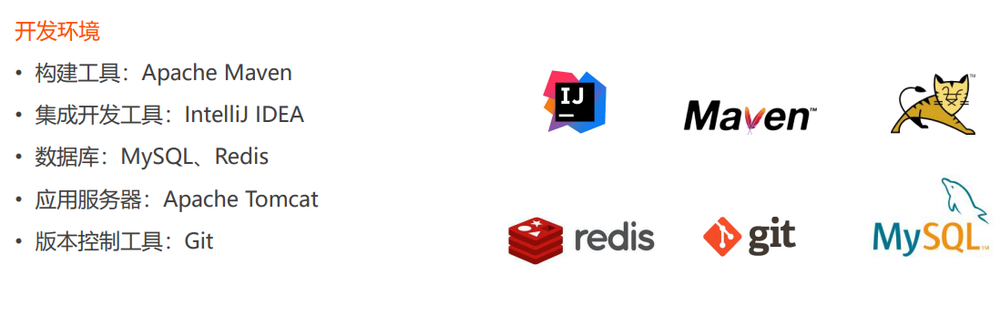
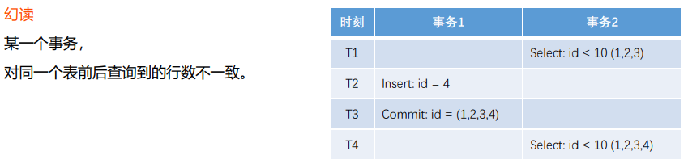
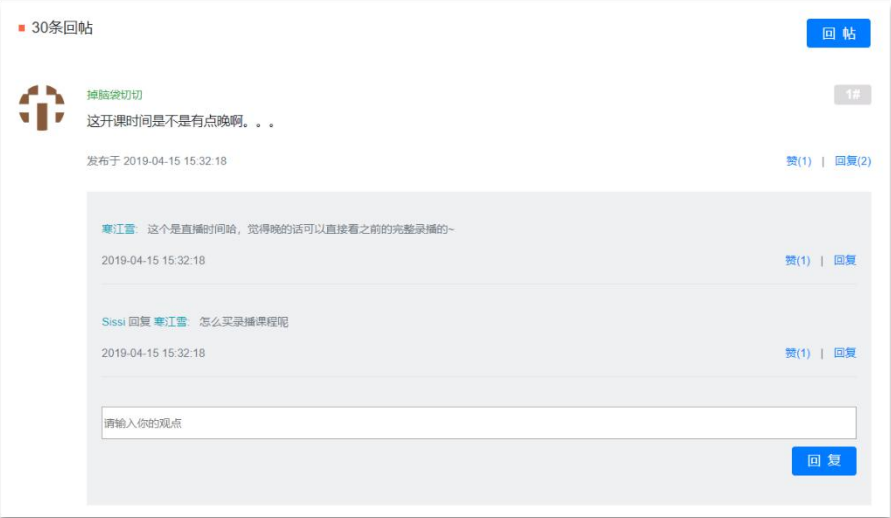

# IT-Community

## 1、项目准备

### 1.1 项目架构





> Thymeleaf是适用于Web和独立环境的现代服务器端**Java模板引擎**（jsp也是一种模板引擎）

- **模板引擎**（这里特指用于Web开发的模板引擎）是为了使**用户界面与业务数据（内容）分离**而产生的，它可以生成特定格式的文档，用于网站的模板引擎就会生成一个标准的html文档。从字面上理解`模板引擎`，最重要的就是模板二字，这个意思就是做好一个模板后套入对应位置的数据，最终以html的格式展示出来，这就是模板引擎的作用。
- **Thymeleaf动静分离的特点：** Thymeleaf选用html作为模板页，这是任何一款其他模板引擎做不到的！Thymeleaf使用html通过一些特定标签语法代表其含义，但并未破坏html结构，即使无网络、不通过后端渲染也能在浏览器成功打开，大大方便界面的测试和修改。
- **Thymeleaf开箱即用的特点**： Thymeleaf提供标准和Spring标准两种方言，可以直接套用模板实现JSTL、 OGNL表达式效果，避免每天套模板、改JSTL、改标签的困扰。同时开发人员也可以扩展和创建自定义的方言。


### 1.2 搭建开发环境

用Maven工具创建一个Spring Boot项目

> pom.xml

```xml
<?xml version="1.0" encoding="UTF-8"?>
<project xmlns="http://maven.apache.org/POM/4.0.0" xmlns:xsi="http://www.w3.org/2001/XMLSchema-instance"
         xsi:schemaLocation="http://maven.apache.org/POM/4.0.0 https://maven.apache.org/xsd/maven-4.0.0.xsd">
    <modelVersion>4.0.0</modelVersion>
    <parent>
        <groupId>org.springframework.boot</groupId>
        <artifactId>spring-boot-starter-parent</artifactId>
        <version>2.5.4</version>
        <relativePath/> <!-- lookup parent from repository -->
    </parent>

    <groupId>com.it.community</groupId>
    <artifactId>community</artifactId>
    <version>0.0.1-SNAPSHOT</version>
    <name>community</name>
    <description>it community</description>

    <properties>
        <java.version>1.8</java.version>
    </properties>

    <dependencies>

        <!--spring aop-->
        <dependency>
            <groupId>org.springframework.boot</groupId>
            <artifactId>spring-boot-starter-aop</artifactId>
        </dependency>

        <!--thymeleaf模板引擎-->
        <dependency>
            <groupId>org.springframework.boot</groupId>
            <artifactId>spring-boot-starter-thymeleaf</artifactId>
        </dependency>

        <!--springmvc web-->
        <dependency>
            <groupId>org.springframework.boot</groupId>
            <artifactId>spring-boot-starter-web</artifactId>
        </dependency>

        <!--开发者工具：
        1.自动应用代码更改到最新的App上面
        2.Spring Boot支持的一些库使用缓存来提高性能。例如，模板引擎缓存已编译的模板以避免重复解析模板文件。
        可以在开发过程中禁用缓存-->
        <dependency>
            <groupId>org.springframework.boot</groupId>
            <artifactId>spring-boot-devtools</artifactId>
            <scope>runtime</scope>
            <optional>true</optional>
        </dependency>

        <!--lombok-->
        <dependency>
            <groupId>org.projectlombok</groupId>
            <artifactId>lombok</artifactId>
            <!--两个项目间依赖不传递-->
            <optional>true</optional>
        </dependency>
        
        <!--mysql-->
        <dependency>
            <groupId>mysql</groupId>
            <artifactId>mysql-connector-java</artifactId>
        </dependency>
        
        <!--mybatis-->
        <dependency>
            <groupId>org.mybatis.spring.boot</groupId>
            <artifactId>mybatis-spring-boot-starter</artifactId>
            <version>2.2.0</version>
        </dependency>

        <!--commons-lang 公共工具类-->
        <dependency>
            <groupId>org.apache.commons</groupId>
            <artifactId>commons-lang3</artifactId>
            <version>3.9</version>
        </dependency>

        <!--测试-->
        <dependency>
            <groupId>org.springframework.boot</groupId>
            <artifactId>spring-boot-starter-test</artifactId>
            <scope>test</scope>
        </dependency>

    </dependencies>

    <build>
        <plugins>
            <!--能够将Spring Boot应用打包为可执行的jar或war文件，然后以通常的方式运行Spring Boot应用。-->
            <plugin>
                <groupId>org.springframework.boot</groupId>
                <artifactId>spring-boot-maven-plugin</artifactId>
            </plugin>
        </plugins>
    </build>

</project>
```

> application.yml

```yml
server:
  port: 8080  #Tomcat端口号
  servlet:
    context-path: /community  #web的项目路径前缀

#自定义配置(项目路径)
community:
  path:
    domain: http://localhost:8080

spring:
  #连接池配置
  datasource:
    driver-class-name: com.mysql.cj.jdbc.Driver
    password: 123456
    url: jdbc:mysql://localhost:3306/community?false&useUnicode=true&characterEncoding=utf-8&serverTimezone=GMT%2B8
    username: root
    type: com.zaxxer.hikari.HikariDataSource  #HikariDataSource连接池
    hikari:
      idle-timeout: 30000 #超时时间
      maximum-pool-size: 15 #最大连接数
      minimum-idle: 5 #最小空闲连接
  thymeleaf:
    cache: false  #关闭thymeleaf缓存

#logging:
#  level:
#    #log4j的日志记录器(Logger)的日志级别(com.it.community范围为debug)，可以打印预编译的sql
#    com:
#      it:
#        community: debug
#  #日志存储位置与文件名
#  file:
#    name: f:/community.log

#MybatisProperties
mybatis:
  #mapper配置类所在位置classpath代表resources根目录(注解方式添加@Mapper注解，扫描进spring容器即可)
  mapper-locations: classpath:mapper/*.xml
  #该包下所有实体都设置别名，为首字母小写实体名称
  type-aliases-package: com.it.community.entity
  configuration:
    #配置mybatis日志
    log-impl: org.apache.ibatis.logging.stdout.StdOutImpl
    #启用sql表下划线命名和java驼峰命名对应（可以不在<result/>标签再配置column和property的对应关系）
    map-underscore-to-camel-case: true
    #启用自动生成主键（注册时回填id，对xml文件中insert语句生效）
    use-generated-keys: true
```


### 1.3 项目整体结构


### 1.4 项目所需数据库表


### 1.5 项目调试

- 响应状态码的含义 

  [HTTP状态码 | 菜鸟教程 (runoob.com)](https://www.runoob.com/http/http-status-codes.html)

- 服务端和客户端断点调试技巧

- 设置日志级别，并将日志输出到不同的终端

  [Spring Boot Logging 配置 - 简书 (jianshu.com)](https://www.jianshu.com/p/1fa12b92d5c4)

  - Spring Boot 能够使用Logback, Log4J2 , java util logging 作为日志记录工具。Spring Boot 默认使用Logback作为日志记录工具。

  - 加入任意的Spring Boot starter 都会默认引入spring-boot-starter-logging

  - 在应用程序中记录日志：

    ```java
    package com.concretepage;
    import org.slf4j.Logger;
    import org.slf4j.LoggerFactory;
    import org.springframework.boot.SpringApplication;
    import org.springframework.boot.autoconfigure.SpringBootApplication;
    @SpringBootApplication
    public class MyApplication {
        private static final Logger logger = LoggerFactory.getLogger(MyApplication.class);  
        public static void main(String[] args) {
            SpringApplication.run(MyApplication.class, args);
            logger.debug("--Application Started--");
            }       
    }  
    ```

  - 1、在application.yml中配置日志

    ```yml
    logging:
      level:
        #日志记录器(Logger)的日志级别(com.it.community范围为debug)，可以打印预编译的sql
        com:
          it:
            community: debug
      #日志存储位置与文件名
      file:
        name: f:/community.log
    ```

  - 2、或者使用Logback XML 文件

    Sping Boot中默认使用logback, 我们可以在application.properties或者application.yml中设置日志级别。如果想使用XML配置Logback,我们需要在类路径下创建logback-spring.xml文件
    src\main\resources\logback-spring.xml

    ```xml
    <?xml version="1.0" encoding="UTF-8"?>
    <configuration>
        <contextName>community</contextName>
        <!--日志文件输出地址和目录-->
        <property name="LOG_PATH" value="C:/work/data"/>
        <property name="APPDIR" value="community"/>
    
        <!-- error file -->
        <appender name="FILE_ERROR" class="ch.qos.logback.core.rolling.RollingFileAppender">
            <file>${LOG_PATH}/${APPDIR}/log_error.log</file>
            <rollingPolicy class="ch.qos.logback.core.rolling.TimeBasedRollingPolicy">
                <fileNamePattern>${LOG_PATH}/${APPDIR}/error/log-error-%d{yyyy-MM-dd}.%i.log</fileNamePattern>
                <timeBasedFileNamingAndTriggeringPolicy class="ch.qos.logback.core.rolling.SizeAndTimeBasedFNATP">
                    <maxFileSize>5MB</maxFileSize>
                </timeBasedFileNamingAndTriggeringPolicy>
                <maxHistory>30</maxHistory>
            </rollingPolicy>
            <append>true</append>
            <encoder class="ch.qos.logback.classic.encoder.PatternLayoutEncoder">
                <pattern>%d %level [%thread] %logger{10} [%file:%line] %msg%n</pattern>
                <charset>utf-8</charset>
            </encoder>
            <filter class="ch.qos.logback.classic.filter.LevelFilter">
                <level>error</level>
                <onMatch>ACCEPT</onMatch>
                <onMismatch>DENY</onMismatch>
            </filter>
        </appender>
    
        <!-- warn file -->
        <appender name="FILE_WARN" class="ch.qos.logback.core.rolling.RollingFileAppender">
            <file>${LOG_PATH}/${APPDIR}/log_warn.log</file>
            <rollingPolicy class="ch.qos.logback.core.rolling.TimeBasedRollingPolicy">
                <fileNamePattern>${LOG_PATH}/${APPDIR}/warn/log-warn-%d{yyyy-MM-dd}.%i.log</fileNamePattern>
                <timeBasedFileNamingAndTriggeringPolicy class="ch.qos.logback.core.rolling.SizeAndTimeBasedFNATP">
                    <maxFileSize>5MB</maxFileSize>
                </timeBasedFileNamingAndTriggeringPolicy>
                <maxHistory>30</maxHistory>
            </rollingPolicy>
            <append>true</append>
            <encoder class="ch.qos.logback.classic.encoder.PatternLayoutEncoder">
                <pattern>%d %level [%thread] %logger{10} [%file:%line] %msg%n</pattern>
                <charset>utf-8</charset>
            </encoder>
            <filter class="ch.qos.logback.classic.filter.LevelFilter">
                <level>warn</level>
                <onMatch>ACCEPT</onMatch>
                <onMismatch>DENY</onMismatch>
            </filter>
        </appender>
    
        <!-- info file -->
        <appender name="FILE_INFO" class="ch.qos.logback.core.rolling.RollingFileAppender">
            <file>${LOG_PATH}/${APPDIR}/log_info.log</file>
            <rollingPolicy class="ch.qos.logback.core.rolling.TimeBasedRollingPolicy">
                <fileNamePattern>${LOG_PATH}/${APPDIR}/info/log-info-%d{yyyy-MM-dd}.%i.log</fileNamePattern>
                <timeBasedFileNamingAndTriggeringPolicy class="ch.qos.logback.core.rolling.SizeAndTimeBasedFNATP">
                    <maxFileSize>5MB</maxFileSize>
                </timeBasedFileNamingAndTriggeringPolicy>
                <maxHistory>30</maxHistory>
            </rollingPolicy>
            <append>true</append>
            <encoder class="ch.qos.logback.classic.encoder.PatternLayoutEncoder">
                <pattern>%d %level [%thread] %logger{10} [%file:%line] %msg%n</pattern>
                <charset>utf-8</charset>
            </encoder>
            <filter class="ch.qos.logback.classic.filter.LevelFilter">
                <level>info</level>
                <onMatch>ACCEPT</onMatch>
                <onMismatch>DENY</onMismatch>
            </filter>
        </appender>
    
        <!-- console -->
        <appender name="STDOUT" class="ch.qos.logback.core.ConsoleAppender">
            <encoder>
                <pattern>%d %level [%thread] %logger{10} [%file:%line] %msg%n</pattern>
                <charset>utf-8</charset>
            </encoder>
            <filter class="ch.qos.logback.classic.filter.ThresholdFilter">
                <level>debug</level>
            </filter>
        </appender>
    
        <!--项目com.it.community的日志级别为debug-->
        <logger name="com.it.community" level="debug"/>
    
        <root level="info">
            <appender-ref ref="FILE_ERROR"/>
            <appender-ref ref="FILE_WARN"/>
            <appender-ref ref="FILE_INFO"/>
            <appender-ref ref="STDOUT"/>
        </root>
    
    </configuration>
    ```

  - 使用自定义日志:Log4J2，去除spring-boot-starter-logging并且引入spring-boot-starter-log4j2 依赖，可以在类路径下创建并配置log4j2-spring.xml

    ```xml
    <dependency>
        <groupId>org.springframework.boot</groupId>
        <artifactId>spring-boot-starter</artifactId>
        <exclusions>
            <exclusion>
                <groupId>org.springframework.boot</groupId>
                <artifactId>spring-boot-starter-logging</artifactId>
            </exclusion>
        </exclusions>
    </dependency>
    <dependency>
        <groupId>org.springframework.boot</groupId>
        <artifactId>spring-boot-starter-log4j2</artifactId>
    </dependency>
    ```


## 2、IT社区登录模块

### 2.1 登录功能


- 开发社区首页，分页显示帖子

  > service层，通过userId查询所有数据（排除拉黑status != 2）

  ```java
  @Resource
  private DiscussPostDao discussPostDao;
  
  	/**
       * Description: 通过userId查询所有数据总数（排除拉黑status != 2）
       *
       * @param userId:
       * @return int:
       */
      public int findDiscussPostRows(Integer userId) {
          return discussPostDao.selectDiscussPostRows(userId);
      }
  
      /**
       * Description: 通过userId查询所有数据（排除拉黑status != 2）
       * @param userId: null即为查询所有
       * @param offset:
       * @param limit:
       * @param orderMode: 0-普通排序（置顶，时间） 1-热帖排序（置顶，分数，时间）
       * @return java.util.List<com.it.community.entity.DiscussPost>:
       */
      public List<DiscussPost> findDiscussPosts(Integer userId, int offset, int limit, int orderMode) {
          return discussPostDao.selectDiscussPosts(userId, offset, limit, orderMode);
      }
  ```
  
  > com.it.community.entity.Page
  
  ```java
  /**
   * 封装分页相关的信息.
   */
  public class Page {
      // 当前页码
      private int current = 1;
      // 显示上限
      private int limit = 10;
      // 数据总数(用于计算总页数)
      private int rows;
      // 查询路径(用于复用分页链接)
      private String path;
  
      public int getCurrent() {
          return current;
      }
  
      public void setCurrent(int current) {
          if (current >= 1) {
              this.current = current;
          }
      }
  
      public int getLimit() {
          return limit;
      }
  
      public void setLimit(int limit) {
          if (limit >= 1 && limit <= 100) {
              this.limit = limit;
          }
      }
  
      public int getRows() {
          return rows;
      }
  
      public void setRows(int rows) {
          if (rows >= 0) {
              this.rows = rows;
          }
      }
  
      public String getPath() {
          return path;
      }
  
      public void setPath(String path) {
          this.path = path;
      }
  
      /**
       * 获取当前页的起始行
       *
       * @return
       */
      public int getOffset() {
          // current * limit - limit
          return (current - 1) * limit;
      }
  
      /**
       * 获取总页数
       *
       * @return
       */
      public int getTotal() {
          // rows / limit [+1]
          if (rows % limit == 0) {
              return rows / limit;
          } else {
              return rows / limit + 1;
          }
      }
  
      /**
       * 获取起始页码
       *
       * @return
       */
      public int getFrom() {
          int from = current - 2;
          return from < 1 ? 1 : from;
      }
  
      /**
       * 获取结束页码
       *
       * @return
       */
      public int getTo() {
          int to = current + 2;
          int total = getTotal();
          return to > total ? total : to;
      }
  
  }
  ```
  
  > controller层，查询帖子的同时把帖子对应的User信息查询出来
  
  ```java
  @Controller
  public class HomeController {
  
      @Resource
      private DiscussPostService discussPostService;
  
      @Resource
      private UserService userService;
  
      // 返回首页
      @GetMapping("/index")
      public String getIndexPage(Model model, Page page) {
          // 方法调用前,SpringMVC会自动实例化Model和Page,并将Page注入Model.
          // 所以,在thymeleaf中可以直接访问Page对象中的数据.
          page.setRows(discussPostService.findDiscussPostRows(null));
          page.setPath("/index?orderMode=" + orderMode);
  
          List<DiscussPost> list = discussPostService
                  .findDiscussPosts(null, page.getOffset(), page.getLimit(), orderMode);
          //将查出来的DiscussPost与对应的User信息一起封装到Map，再组装成为List
          List<Map<String, Object>> discussPosts = new ArrayList<>();
          if (list != null) {
              for (DiscussPost post : list) {
                  Map<String, Object> map = new HashMap<>();
                  map.put("post", post);
                  User user = userService.queryById(post.getUserId());
                  map.put("user", user);
  
                  discussPosts.add(map);
              }
          }
          //将discussPosts数据存入request域并请求转发
          model.addAttribute("discussPosts", discussPosts);
  
          //resources/templates下
          return "/index";
      }
  }
  ```
  
  > 前端thymeleaf，index.html
  
  ```html
  <!doctype html>
  <!--指定thymeleaf模板引擎-->
  <html lang="en" xmlns:th="http://www.thymeleaf.org">
  <head>
     <meta charset="utf-8">
     <meta name="viewport" content="width=device-width, initial-scale=1, shrink-to-fit=no">
     <link rel="icon" href="https://static.nowcoder.com/images/logo_87_87.png"/>
     <link rel="stylesheet" href="https://stackpath.bootstrapcdn.com/bootstrap/4.3.1/css/bootstrap.min.css" crossorigin="anonymous">
     <!--让thymeleaf模板引擎去resources/static目录下寻找资源-->
     <link rel="stylesheet" th:href="@{css/global.css}" />
     <title>牛客网-首页</title>
  </head>
  ```
  
  ```html
  <!-- 帖子列表 -->
        <ul class="list-unstyled">
           <li class="media pb-3 pt-3 mb-3 border-bottom" th:each="map:${discussPosts}">
              <a href="site/profile.html">
                 
              </a>
              <div class="media-body">
                 <h6 class="mt-0 mb-3">
                    <a href="#" th:utext="${map.post.title}">备战春招，面试刷题跟他复习，一个月全搞定！</a>
                    <span class="badge badge-secondary bg-primary" th:if="${map.post.type==1}">置顶</span>
                    <span class="badge badge-secondary bg-danger" th:if="${map.post.status==1}">精华</span>
                 </h6>
                 <div class="text-muted font-size-12">
                    <u class="mr-3" th:utext="${map.user.username}">寒江雪</u> 发布于 <b th:text="${#dates.format(map.post.createTime,'yyyy-MM-dd HH:mm:ss')}">2019-04-15 15:32:18</b>
                    <ul class="d-inline float-right">
                       <li class="d-inline ml-2">赞 11</li>
                       <li class="d-inline ml-2">|</li>
                       <li class="d-inline ml-2">回帖 7</li>
                    </ul>
                 </div>
              </div>
           </li>
        </ul>
  
        	<!-- 分页 -->
  				<!--无数据时不显示-->
  				<nav class="mt-5" th:if="${page.rows>0}" th:fragment="pagination">
  					<ul class="pagination justify-content-center">
  						<li class="page-item">
  							<!--相当于工程路径下+“/index?pageNum=1”-->
  							<a class="page-link" th:href="@{${page.path}(current=1)}">首页</a>
  						</li>
  						<!--disabled 禁用标签  active 高亮标签  | | 静态值拼接动态值-->
  						<!--<li class="page-item disabled">-->
  						<li th:class="|page-item ${page.current==1?'disabled':''}|">
  							<a class="page-link" th:href="@{${page.path}(current=${(page.current)-1})}">上一页</a></li>
  						<li th:class="|page-item ${i==page.current?'active':''}|" th:each="i:${#numbers.sequence(page.from,page.to)}">
  							<a class="page-link" th:href="@{${page.path}(current=${i})}" th:text="${i}">1</a>
  						</li>
  						<li th:class="|page-item ${page.current==page.total?'disabled':''}|">
  							<a class="page-link" th:href="@{${page.path}(current=${page.current+1})}">下一页</a>
  						</li>
  						<li class="page-item">
  							<a class="page-link" th:href="@{${page.path}(current=${page.total})}">末页</a>
  						</li>
  					</ul>
  				</nav>
     </div>
  </div>
  ```


### 2.2 发送邮件

- 邮箱设置，启用客户端SMTP服务


- Spring Email

  > 导入 jar 包 

  ```xml
  <!--spring mail-->
  <dependency>
      <groupId>org.springframework.boot</groupId>
      <artifactId>spring-boot-starter-mail</artifactId>
  </dependency>
  ```

  > 邮箱参数配置，application.yml

  ```yml
  spring:
    #spring mail
    mail:
      host: smtp.qq.com #发送邮件服务器
      username: 2397637186@qq.com #QQ邮箱
      password: fbwkckqbrmdddibh #客户端授权码
      protocol: smtp #发送邮件协议
      properties.mail.smtp.auth: true
      properties.mail.smtp.port: 465 #端口号465或587
      properties.mail.display.sendmail: aaa #可以任意
      properties.mail.display.sendname: bbb #可以任意
      properties.mail.smtp.starttls.enable: true
      properties.mail.smtp.starttls.required: true
      properties.mail.smtp.ssl.enable: true #开启SSL
      default-encoding: utf-8
  ```

  > 使用 JavaMailSender 发送邮件

  ```java
  @SpringBootTest(classes = CommunityApplication.class)
  public class MailTest {
  
      @Autowired
      private MailClient mailClient;
  
      @Autowired
      private TemplateEngine templateEngine;
  
      @Test
      public void test() {
          mailClient.sendMail("qxiao@zju.edu.cn", "spring", "mail");
      }
  
      @Test
      public void test1() {
          Context context = new Context();
          //存入数据，嵌入模板
          context.setVariable("username", "sunday");
  
          //利用/mail/demo模板和thymeleaf模板引擎生成html网页（邮件的内容）
          String content = templateEngine.process("/mail/demo", context);
          mailClient.sendMail("qxiao@zju.edu.cn", "spring", content);
      }
  
  }
  ```

  > demo.html

  ```html
  <!DOCTYPE html>
  <html lang="en" xmlns:th="http://www.thymeleaf.org">
  <head>
      <meta charset="UTF-8">
      <title>spring mail</title>
  </head>
  <body>
      <p>欢迎，<span style="color: red" th:text="${username}"></span>！</p>
  </body>
  </html>
  ```

  > MailClient工具类

  ```java
  @Component
  public class MailClient {
  
      private static final Logger logger = LoggerFactory.getLogger(MailClient.class);
  
      @Autowired
      private JavaMailSender mailSender;
  
      //springboot中使用@Value读取配置文件
      @Value("${spring.mail.username}")
      private String from;
  
      public void sendMail(String to, String subject, String text) {
          MimeMessage message = mailSender.createMimeMessage();
          MimeMessageHelper helper = new MimeMessageHelper(message);
          try {
              helper.setFrom(from);
              helper.setTo(to);
              helper.setSubject(subject);
              //true--支持html格式
              helper.setText(text, true);
              mailSender.send(helper.getMimeMessage());
          } catch (MessagingException e) {
              logger.error("发送邮件失败" + e.getMessage());
          }
      }
  }
  ```

  

- 模板引擎 - 使用 Thymeleaf 发送 HTML 邮件 templates/mail/activation.html

  ```html
  <!doctype html>
  <html lang="en" xmlns:th="http://www.thymeleaf.org">
  <head>
      <meta charset="utf-8">
      <link rel="icon" href="https://static.nowcoder.com/images/logo_87_87.png"/>
      <title>it-community-激活账号</title>
  </head>
  <body>
     <div>
        <p>
           <b th:text="${email}">xxx@xxx.com</b>, 您好!
        </p>
        <p>
           您正在注册it-community, 这是一封激活邮件, 请点击
           <a th:href="${url}" style="color: red">此链接</a>,
           激活您的it-community账号!
        </p>
     </div>
  </body>
  </html>
  ```


### 2.3 注册功能

- 访问注册页面 - 点击顶部区域内的链接，通过LoginController打开index.html注册页面，使头部可以复用

  ```java
  // 访问注册页面，目的是不直接在前端暴露页面实际地址
  @GetMapping("/register")
  public String getRegisterPage() {
      // 重定向到templates下的目录文件
      return "/site/register";
  }
  ```

  ```html
  <!-- 头部 th:fragment="header" 使头部可以复用-->
  <header class="bg-dark sticky-top" th:fragment="header">
     <div class="container">
        <!-- 导航 -->
        <nav class="navbar navbar-expand-lg navbar-dark">
           <!-- logo -->
           <a class="navbar-brand" href="#"></a>
           <button class="navbar-toggler" type="button" data-toggle="collapse" data-target="#navbarSupportedContent" aria-controls="navbarSupportedContent" aria-expanded="false" aria-label="Toggle navigation">
              <span class="navbar-toggler-icon"></span>
           </button>
           <!-- 功能 -->
           <div class="collapse navbar-collapse" id="navbarSupportedContent">
              <ul class="navbar-nav mr-auto">
                 <li class="nav-item ml-3 btn-group-vertical">
                    <a class="nav-link" th:href="@{/index}">首页</a>
                 </li>
                 <li class="nav-item ml-3 btn-group-vertical">
                    <a class="nav-link position-relative" href="site/letter.html">消息<span class="badge badge-danger">12</span></a>
                 </li>
                 <li class="nav-item ml-3 btn-group-vertical">
                    <a class="nav-link" th:href="@{/register}">注册</a>
                 </li>
                 <li class="nav-item ml-3 btn-group-vertical">
                    <a class="nav-link" th:href="@{/login}">登录</a>
                 </li>
                 <li class="nav-item ml-3 btn-group-vertical dropdown">
                    <a class="nav-link dropdown-toggle" href="#" id="navbarDropdown" role="button" data-toggle="dropdown" aria-haspopup="true" aria-expanded="false">
                       
                    </a>
                    <div class="dropdown-menu" aria-labelledby="navbarDropdown">
                       <a class="dropdown-item text-center" href="site/profile.html">个人主页</a>
                       <a class="dropdown-item text-center" href="site/setting.html">账号设置</a>
                       <a class="dropdown-item text-center" th:href="@{/logout}">退出登录</a>
                       <div class="dropdown-divider"></div>
                       <span class="dropdown-item text-center text-secondary">nowcoder</span>
                    </div>
                 </li>
              </ul>
              <!-- 搜索 -->
              <form class="form-inline my-2 my-lg-0" action="site/search.html">
                 <input class="form-control mr-sm-2" type="search" aria-label="Search" />
                 <button class="btn btn-outline-light my-2 my-sm-0" type="submit">搜索</button>
              </form>
           </div>
        </nav>
     </div>
  </header>
  ```

  

- 提交注册数据 

  > 通过表单提交数据 ，register.html，同时注册数据回显，错误消息提示，

  ```xml
  <!-- 头部 复用index的头部header-->
  <header class="bg-dark sticky-top" th:replace="index::header">
  ```

  ```html
  <!-- 内容 -->
  <div class="main">
     <div class="container pl-5 pr-5 pt-3 pb-3 mt-3 mb-3">
        <h3 class="text-center text-info border-bottom pb-3">注&nbsp;&nbsp;册</h3>
        <!--提交方式和提交链接-->
        <form class="mt-5" method="post" th:action="@{/register}">
           <div class="form-group row">
              <label for="username" class="col-sm-2 col-form-label text-right">账号:</label>
              <div class="col-sm-10">
                 <!--声明name属性与User属性对应，以便springmvc将其自动注入User对象-->
                 <!--注册失败后，th:value显示默认值回填注册数据，调用user.要避免出现空指针异常-->
                 <!--注册失败后，th:text错误消息的的显示-->
                 <!--th:class判断是否显示错误消息-->
                 <input type="text" th:class="|form-control ${usernameMsg!=null?'is-invalid':''}|"
                       th:value="${user!=null?user.username:''}"
                       id="username" name="username" placeholder="请输入您的账号!" required>
                 <div class="invalid-feedback" th:text="${usernameMsg}">
                    该账号已存在!
                 </div>
              </div>
           </div>
           <div class="form-group row mt-4">
              <label for="password" class="col-sm-2 col-form-label text-right">密码:</label>
              <div class="col-sm-10">
                 <input type="password" th:class="|form-control ${passwordMsg!=null?'is-invalid':''}|"
                       th:value=${user!=null?user.password:''}
                       id="password" name="password" placeholder="请输入您的密码!" required>
                 <div class="invalid-feedback" th:text="${passwordMsg}">
                    密码长度不能小于8位!
                 </div>                   
              </div>
           </div>
           <div class="form-group row mt-4">
              <label for="confirm-password" class="col-sm-2 col-form-label text-right">确认密码:</label>
              <div class="col-sm-10">
                 <input type="password" class="form-control"
                       th:value=${user!=null?user.password:''}
                       id="confirm-password" placeholder="请再次输入密码!" required>
                 <!--此处引入register.js在前端判断两次输入是否相同-->
  			   <div class="invalid-feedback">
                    两次输入的密码不一致!
                 </div>
              </div>
           </div>
           <div class="form-group row">
              <label for="email" class="col-sm-2 col-form-label text-right">邮箱:</label>
              <div class="col-sm-10">
                 <input type="email" th:class="|form-control ${emailMsg!=null?'is-invalid':''}|"
                       th:value=${user!=null?user.email:''}
                       id="email" name="email" placeholder="请输入您的邮箱!" required>
                 <div class="invalid-feedback" th:text="${emailMsg}">
                    该邮箱已注册!
                 </div>
              </div>
           </div>
           <div class="form-group row mt-4">
              <div class="col-sm-2"></div>
              <div class="col-sm-10 text-center">
                 <button type="submit" class="btn btn-info text-white form-control">立即注册</button>
              </div>
           </div>
        </form>             
     </div>
  </div>
  
  
  ```
  
  > register.html在页尾引用register.js在前端判断两次提交密码是否相同
  
  ```js
  $(function(){
     $("form").submit(check_data);
     $("input").focus(clear_error);
  });
  
  function check_data() {
     var pwd1 = $("#password").val();
     var pwd2 = $("#confirm-password").val();
     if(pwd1 != pwd2) {
        $("#confirm-password").addClass("is-invalid");
        return false;
     }
     return true;
  }
  
  function clear_error() {
     $(this).removeClass("is-invalid");
  }
  ```
  
  > service层验证账号是否已存在、邮箱是否已注册，发送激活邮件
  
  ```java
  /**
   * Description: 用户注册方法
   * @param user:
   * @return java.util.Map<java.lang.String,java.lang.Object>:
   */
  public Map<String, Object> register(User user) {
      Map<String, Object> map = new HashMap<>();
  
      // 空值处理
      if (user == null) {
          throw new IllegalArgumentException("参数不能为空！");
      }
      if (StringUtils.isBlank(user.getUsername())) {
          map.put("usernameMsg", "账号不能为空！");
          return map;
      }
      if (StringUtils.isBlank(user.getPassword())) {
          map.put("passwordMsg", "密码不能为空！");
          return map;
      }
      if (StringUtils.isBlank(user.getEmail())) {
          map.put("emailMsg", "邮箱不能为空！");
          return map;
      }
  
      // 验证账号是否存在
      User user1 = userDao.queryByUsername(user.getUsername());
      if (user1 != null) {
          map.put("usernameMsg", "该账号已存在!");
          return map;
      }
  
      // 验证邮箱是否存在
      User user2 = userDao.queryByEmail(user.getEmail());
      if (user2 != null) {
          map.put("emailMsg", "该邮箱已被注册！");
          return map;
      }
  
      // 对密码加密，并注册用户
      user.setSalt(CommunityUtil.generateUUID().substring(0, 5));
      user.setPassword(CommunityUtil.md5(user.getPassword() + user.getSalt()));
      user.setType(0);    // 普通用户
      user.setStatus(0);  // 未激活
      user.setActivationCode(CommunityUtil.generateUUID());   // 设置激活码
      // 设置随机头像链接，0~999
      user.setHeaderUrl(String.format("http://images.nowcoder.com/head/%dt.png", new Random().nextInt(1000)));
      user.setCreateTime(new Date()); // 设置注册时间
      // 此处mybatis获取自动生成的id值并进行回填
      userDao.insert(user);
  
      // 激活邮件,thymeleaf模板引擎
      Context context = new Context();
      context.setVariable("email", user.getEmail());
      // http://localhost:8080/community/activation/id值/激活码值
      String url = domain + contextPath + "/activation/" + user.getId() + "/" + user.getActivationCode();
      context.setVariable("url", url);
      // 生成html格式的邮件内容
      String content = templateEngine.process("/mail/activation", context);
      // 发送邮件
      mailClient.sendMail(user.getEmail(), "激活账号", content);
  
      return map;
  }
  ```
  
  > controller层调用service层方法并负责把提示消息从service传递到前端，并转发页面
  
  ```java
  @PostMapping("/register")
  public String register(Model model, User user) {
      //作为参数的User user会随着注入model并在请求转发时再次被传走
  
      Map<String, Object> map = userService.register(user);
      // map没有内容，注册成功，注册成功后跳转到中转页面/site/operate-result
      if (map == null || map.isEmpty()) {
          model.addAttribute("msg", "注册成功，我们已经向您的邮箱发送了激活邮件！");
          model.addAttribute("target", "/index"); //中转页面自动跳回首页
          return "/site/operate-result";
      } else {    // 注册失败，跳回注册页面
          model.addAttribute("usernameMsg", map.get("usernameMsg"));
          model.addAttribute("passwordMsg", map.get("passwordMsg"));
          model.addAttribute("emailMsg", map.get("emailMsg"));
          return "/site/register";
      }
  }
  ```
  
  > 中转页面
  
  ```html
  <!-- 内容 -->
  <div class="main">
     <div class="container mt-5">
        <div class="jumbotron">
           <!--提示消息msg和跳转连接target不写死，可以复用-->
           <p class="lead" th:text="${msg}">您的账号已经激活成功,可以正常使用了!</p>
           <hr class="my-4">
           <p>
              系统会在 <span id="seconds" class="text-danger">8</span> 秒后自动跳转,
              您也可以点此 <a id="target" th:href="@{${target}}" class="text-primary" style="color: chartreuse">链接</a>, 手动跳转!
           </p>
        </div>
     </div>
  </div>
  ```


- 注册相关工具类CommunityUtil

  >生成随机字符串 UUID

  ```java
  /**
   * Description: 生成随机字符串 UUID：Universally unique identifier通用唯一识别码
   * @param :
   * @return java.lang.String:
   */
  public static String generateUUID() {
      return UUID.randomUUID().toString().replaceAll("-", "");
  }
  ```

  > MD5加密

  ```java
  /**
   * Description: MD5加密（只能加密不能解密，相同密码加密结果相同）
   *              防止拖库撞库（密码加随机字符串再进行加密）
   * @param key: 原始密码
   * @return java.lang.String: 加密密码
   */
  public static String md5(String key) {
      //null "" 都认为是空
      if (StringUtils.isBlank(key)) {
          return null;
      }
      //spring加密工具类
      return DigestUtils.md5DigestAsHex(key.getBytes(StandardCharsets.UTF_8));
  }
  ```


- 激活注册账号 - 点击邮件中的链接http://localhost:8080/community/activation/id值/激活码值，访问服务端的激活服务。

  > service层负责验证，改变激活状态

  ```java
  /**
   * Description: 激活用户
   * @param userId: 用户id
   * @param code: 激活码
   * @return int: 激活状态
   */
  public int activation(int userId, String code) {
      User user = userDao.queryById(userId);
      // 如果已激活
      if (user.getStatus() == 1) {
          return ACTIVATION_REPEAT;
      } else if (user.getActivationCode().equals(code)) {
          // 如果未激活且激活码符合，改变status状态使其激活
          user.setStatus(1);
          userDao.update(user);
          return ACTIVATION_SUCCESS;
      } else {
          // 未激活成功
          return ACTIVATION_FAILURE;
      }
  }
  ```

  >controller层调用service层方法并负责把提示消息从service传递到前端，并转发页面

  ```java
  // http://localhost:8080/community/activation/id值/激活码值
  @GetMapping("/activation/{userId}/{code}")
  public String activation(Model model, @PathVariable("userId") int userId, @PathVariable("code") String code) {
      int result = userService.activation(userId, code);
      if (result == ACTIVATION_SUCCESS) {
          // 激活成功先跳转到中转页面，再跳转到登录页面
          model.addAttribute("msg", "激活成功，您的账号可以正常使用了！");
          model.addAttribute("target", "/login");
      } else if (result == ACTIVATION_REPEAT) {
          // 重复激活先跳转到中转页面，再跳转到首页
          model.addAttribute("msg", "重复激活，无效操作！");
          model.addAttribute("target", "/index");
      } else {
          // 激活失败先跳转到中转页面，再跳转到首页
          model.addAttribute("msg", "激活失败，您提供的激活码不正确！");
          model.addAttribute("target", "/index");
      }
      return "/site/operate-result";
  }
  ```

  > 激活相关全局常数工具类CommunityConstant

  ```java
  /**
   * 激活成功
   */
  int ACTIVATION_SUCCESS = 0;
  
  /**
   * 重复激活
   */
  int ACTIVATION_REPEAT = 1;
  
  /**
   * 激活失败
   */
  int ACTIVATION_FAILURE = 2;
  ```


### 2.4 会话管理

- HTTP基本性质

  [HTTP 教程 | 菜鸟教程 (runoob.com)](https://www.runoob.com/http/http-tutorial.html)

- Cookie与Session的区别（javaweb）

  Cookie是服务器发送到浏览器，并保存在浏览器端的一小块数据。浏览器下次访问该服务器时，会自动携带块该数据，将其发送给服务器。

  Session是JavaEE的标准，用于在服务端记录客户端信息。数据存放在服务端更加安全，但是也会增加服务端的内存压力。

  [JSP Cookie 处理 | 菜鸟教程 (runoob.com)](https://www.runoob.com/jsp/jsp-cookies.html)

  [JSP Session | 菜鸟教程 (runoob.com)](https://www.runoob.com/jsp/jsp-session.html)

  


### 2.5 生成验证码

-  Kaptcha

  > 导入 jar 包

  ```xml
  <!--验证码生成-->
  <dependency>
      <groupId>com.github.penggle</groupId>
      <artifactId>kaptcha</artifactId>
      <version>2.3.2</version>
  </dependency>
  ```

  > 编写 Kaptcha 配置类KaptchaConfig

  ```java
  @Configuration
  public class KaptchaConfig {
  
  
      // 将kaptchaProducer装配到容器
      @Bean
      public Producer kaptchaProducer() {
          // kaptch配置文件
          Properties properties = new Properties();
          properties.setProperty("kaptcha.image.width", "100");
          properties.setProperty("kaptcha.image.height", "40");
          properties.setProperty("kaptcha.textproducer.font.size", "32");
          properties.setProperty("kaptcha.textproducer.font.color", "0,0,0");
          properties.setProperty("kaptcha.textproducer.char.String", "0123456789QWERTYUIOPLKJHGFDSAZXCVBNM");
          properties.setProperty("kaptcha.textproducer.char.length", "4");
          properties.setProperty("kaptcha.noise.impl", "com.google.code.kaptcha.impl.NoNoise");
  
          DefaultKaptcha kaptcha = new DefaultKaptcha();
          Config config = new Config(properties);
          kaptcha.setConfig(config);
          return kaptcha;
      }
  }
  ```

  > 生成随机字符、生成图片

  ```java
  @GetMapping("/kaptcha")
  public void getKaptcha(HttpServletResponse response, HttpSession session) {
      // 生成验证码
      String text = kaptchaProducer.createText();
      // 生成验证码图片
      BufferedImage image = kaptchaProducer.createImage(text);
      // 验证码存入Session以便验证
      session.setAttribute("kaptcha", text);
      // 将图片输出给浏览器，字节流
      // response由springmvc管理，会自动关闭流
      response.setContentType("image/png");
      try {
          ServletOutputStream os = response.getOutputStream();
          ImageIO.write(image, "PNG", os);
      } catch (IOException e) {
          logger.error("响应验证码失败：" + e.getMessage());
      }
  }
  ```

  > 修改login.html，每次刷新页面或者点刷新验证码链接都会访问/kaptcha调用方法生成随机图片

  ```html
  <div class="col-sm-4">
     <!--验证码图片链接-->
     <!--@{}可以代替工程路径/community-->
     <!--每次刷新页面或者点刷新验证码链接都会访问/kaptcha调用方法生成随机图片-->
     
     <!--js实现点击链接时调用js的refresh_kaptcha()方法-->
     <a href="javascript:refresh_kaptcha();" class="font-size-12 align-bottom">刷新验证码</a>
  </div>
  ```

  ```html
  <!--用jquery实现refresh_kaptcha()方法-->
  <script>
     function refresh_kaptcha() {
        /*CONTEXT_PATH是在global.js中声明的工程路径前缀*/
        /*加上可变参数是为了防止浏览器阻止重复提交*/
        var path = CONTEXT_PATH + "/kaptcha?p=" + Math.random();
        /*jquery语法id选择器并修改标签属性实现区域局部刷新*/
        $("#kaptcha").attr("src", path);
     }
  </script>
  ```


### 2.6 登录、退出功能

- 访问登录页面 - 点击顶部区域内的链接，打开登录页面

  ```html
  <!-- 头部 -->
  <header class="bg-dark sticky-top" th:replace="index::header">
  ```

  ```java
  // 访问登录页面
  @GetMapping("/login")
  public String getLoginPage() {
      return "/site/login";
  }
  ```


-  登录

  > service层验证账号、密码、验证码，登录成功生成登录凭证存入数据库

  ```java
  /**
   * Description: 用户登录方法
   *
   * @param username:
   * @param password:
   * @param expiredSeconds: 过期时间
   * @return java.util.Map<java.lang.String,java.lang.Object>:
   */
  public Map<String, Object> login(String username, String password, long expiredSeconds) {
      Map<String, Object> map = new HashMap<>();
  
      // 空值处理
      if (StringUtils.isBlank(username)) {
          map.put("usernameMsg", "账号不能为空！");
          return map;
      }
      if (StringUtils.isBlank(password)) {
          map.put("passwordMsg", "密码不能为空！");
          return map;
      }
  
      // 验证账号是否存在,是否激活
      User user = userDao.queryByUsername(username);
      if (user == null) {
          map.put("usernameMsg", "该账号不存在！");
          return map;
      }
      if (user.getStatus() == 0) {
          map.put("usernameMsg", "该账号未激活");
          return map;
      }
  
      // 验证密码
      // 传入的明文密码加密后再比较
      String passowrd = CommunityUtil.md5(password + user.getSalt());
      if (!user.getPassword().equals(passowrd)) {
          map.put("passwordMsg", "密码不正确！");
          return map;
      }
  
      // 登录成功，生成登录凭证
      LoginTicket loginTicket = new LoginTicket();
      loginTicket.setUserId(user.getId());
      loginTicket.setTicket(CommunityUtil.generateUUID());
      loginTicket.setStatus(0);
      loginTicket.setExpired(new Date(System.currentTimeMillis() + expiredSeconds * 1000));
      loginTicketDao.insert(loginTicket);
  
      map.put("ticket", loginTicket.getTicket());
  
      return map;
  }
  ```

  > controller层，登录成功时，登录凭证中的ticket发放给客户端。失败时，跳转回登录页。

  ```java
  @PostMapping("/login")
  public String login(String username, String password, String code, boolean rememberme,
                      Model model, HttpSession session, HttpServletResponse response) {
      //普通参数String boolean不会被注入model，但是会存在于request域中，请求转发时会再次带上
  
      // 首先判断验证码是否符合
      String kaptcha = (String) session.getAttribute("kaptcha");
      if (StringUtils.isBlank(kaptcha) || StringUtils.isBlank(code) || !kaptcha.equalsIgnoreCase(code)) {
          model.addAttribute("codeMsg", "验证码不正确！");
          return "/site/login";
      }
  
      // 检查账号密码
      long expiredSeconds = rememberme ? REMEMBER_EXPIRED_SECONDS : DEFAULT_EXPIRED_SECONDS;
      Map<String, Object> map = userService.login(username, password, expiredSeconds);
      if (map.containsKey("ticket")) {
          //登录成功
          Cookie cookie = new Cookie("ticket", map.get("ticket").toString());
          //把ticket登录凭证设置为cookie，并对整个项目都有效 /community  #web的项目路径前缀
          cookie.setPath(contextPath);
          cookie.setMaxAge((int) expiredSeconds);
          response.addCookie(cookie);
          return "redirect:/index";
      } else {
          //登陆失败
          model.addAttribute("usernameMsg", map.get("usernameMsg"));
          model.addAttribute("passwordMsg", map.get("passwordMsg"));
          return "site/login";
      }
  }
  ```

  > 登录相关常数工具类CommunityConstant

  ```java
  /**
   * 默认状态的登录凭证超时时间(1天)
   */
  long DEFAULT_EXPIRED_SECONDS = 3600 * 12;
  
  /**
   * 记住状态的登录凭证超时时间(100天)
   */
  long REMEMBER_EXPIRED_SECONDS = 3600 * 24 * 100;
  ```

  

- 退出 - 将登录凭证修改为失效状态并跳转至网站首页

  > service层修改数据库的登录凭证

  ```java
  /**
   * Description:  用户登出方法
   * @param ticket:
   * @return void:
   */
  public void logout(String ticket) {
      // 改为无效状态
      loginTicketDao.updateStatusByTicket(ticket, 1);
  }
  ```

  > controller层获取cookie调用service层方法，跳转到登录页面

  ```java
  @GetMapping("/logout")
  public String logout(@CookieValue("ticket") String ticket) {
      //@CookieValue从Cookie中获取数据传入
      userService.logout(ticket);
      //重定向到登录页面(默认为get请求)
      return "redirect:/login";
  }
  ```


### 2.7 显示登录信息

登录和未登录时头部的显示状态：


- 定义拦截器

  > 定义拦截器实现HandlerInterceptor接口，controller.interceptor.LoginTicketInterceptor：
  >
  > ​	在请求开始时查询登录用户
  >
  > ​	在本次请求中持有用户数据
  >
  > ​	(在模板视图上显示用户数据 )
  >
  > ​	在请求结束时清理用户数据

  ```java
  @Component
  public class LoginTicketInterceptor implements HandlerInterceptor {
  
      @Resource
      private UserService userService;
  
      @Resource
      private HostHolder hostHolder;
  
      // 目标方法之前执行
      @Override
      public boolean preHandle(HttpServletRequest request, HttpServletResponse response, Object handler) throws Exception {
          // 从cookie中获取ticket
          String ticket = CookieUtil.getValue(request, "ticket");
          //如果cookie中有ticket（即有用户登录后留下的信息）
          if (ticket != null) {
              // 根据ticket查询凭证
              LoginTicket loginTicket = userService.findLoginTicket(ticket);
              // 检查凭证是否有效
              // 能查询到loginTicket，且状态为有效，且超时时间在当前时间之后
              if (loginTicket != null && loginTicket.getStatus() == 0 && loginTicket.getExpired().after(new Date())) {
                  // 根据凭证查询用户
                  User user = userService.queryById(loginTicket.getUserId());
                  // 在本次请求中持有用户
                  hostHolder.setUser(user);
              }
          }
  
          return true;
      }
  
      // 目标方法之后执行(返回modelAndView、模板引擎之前)
      @Override
      public void postHandle(HttpServletRequest request, HttpServletResponse response, Object handler, ModelAndView modelAndView) throws Exception {
          // 获取user信息并存入modelAndView以便前端使用
          User user = hostHolder.getUser();
          if (user != null && modelAndView != null) {
              modelAndView.addObject("loginUser", user);
          }
      }
  
      // 返回ModelAndView之后（模板引擎之后）执行
      @Override
      public void afterCompletion(HttpServletRequest request, HttpServletResponse response, Object handler, Exception ex) throws Exception {
          // 清除ThreadLocal中的user信息
          hostHolder.clear();
      }
  }
  ```

  >HostHolder工具类，持有用户的信息，用于代替Session对象(以当前线程为key存取数据)

  ```java
  @Component
  public class HostHolder {
  
      // 采用线程隔离的方式存放数据，可以避免多线程之间出现数据访问冲突
      private ThreadLocal<User> users = new ThreadLocal<>();
  
      public void setUser(User user) {
          users.set(user);
      }
  
      public User getUser() {
          return users.get();
      }
  
      // 清除数据
      public void clear() {
          users.remove();
      }
  
  }
  ```


- 配置拦截器，为它指定拦截、排除的路径

  >WebMvcConfig实现WebMvcConfigurer接口

  ```java
  @Configuration
  public class WebMvcConfig implements WebMvcConfigurer {
  
      @Resource
      private LoginTicketInterceptor loginTicketInterceptor;
  
      @Override
      public void addInterceptors(InterceptorRegistry registry) {
          //配置拦截规则，不拦截静态资源以外的所有资源
          registry.addInterceptor(loginTicketInterceptor)
                  .excludePathPatterns("/**/*.css", "/**/*.js", "/**/*.png", "/**/*.jpg", "/**/*.jpeg");
      }
  }
  ```


- 在index.html上显示用户数据

  ```html
  <!-- 头部 th:fragment="header" 使头部可以复用-->
  <header class="bg-dark sticky-top" th:fragment="header">
     <div class="container">
        <!-- 导航 -->
        <nav class="navbar navbar-expand-lg navbar-dark">
           <!-- logo -->
           <a class="navbar-brand" href="#"></a>
           <button class="navbar-toggler" type="button" data-toggle="collapse" data-target="#navbarSupportedContent" aria-controls="navbarSupportedContent" aria-expanded="false" aria-label="Toggle navigation">
              <span class="navbar-toggler-icon"></span>
           </button>
           <!-- 功能 -->
           <div class="collapse navbar-collapse" id="navbarSupportedContent">
              <ul class="navbar-nav mr-auto">
                 <li class="nav-item ml-3 btn-group-vertical">
                    <a class="nav-link" th:href="@{/index}">首页</a>
                 </li>
                 <!--未登录不显示消息-->
                 <li class="nav-item ml-3 btn-group-vertical" th:if="${loginUser!=null}">
                    <a class="nav-link position-relative" href="site/letter.html">消息<span class="badge badge-danger">12</span></a>
                 </li>
                 <!--登录后不显示注册，登录-->
                 <li class="nav-item ml-3 btn-group-vertical" th:if="${loginUser==null}">
                    <a class="nav-link" th:href="@{/register}">注册</a>
                 </li>
                 <li class="nav-item ml-3 btn-group-vertical" th:if="${loginUser==null}">
                    <a class="nav-link" th:href="@{/login}">登录</a>
                 </li>
                 <!--未登录不显示头像和下拉框-->
                 <li class="nav-item ml-3 btn-group-vertical dropdown" th:if="${loginUser!=null}">
                    <a class="nav-link dropdown-toggle" href="#" id="navbarDropdown" role="button" data-toggle="dropdown" aria-haspopup="true" aria-expanded="false">
                       <!--当前用户的头像、用户名-->
                       
                    </a>
                    <div class="dropdown-menu" aria-labelledby="navbarDropdown">
                       <a class="dropdown-item text-center" href="site/profile.html">个人主页</a>
                       <a class="dropdown-item text-center" href="site/setting.html">账号设置</a>
                       <a class="dropdown-item text-center" th:href="@{/logout}">退出登录</a>
                       <div class="dropdown-divider"></div>
                       <span class="dropdown-item text-center text-secondary" th:utext="${loginUser.username}">nowcoder</span>
                    </div>
                 </li>
              </ul>
              <!-- 搜索 -->
              <form class="form-inline my-2 my-lg-0" action="site/search.html">
                 <input class="form-control mr-sm-2" type="search" aria-label="Search" />
                 <button class="btn btn-outline-light my-2 my-sm-0" type="submit">搜索</button>
              </form>
           </div>
        </nav>
     </div>
  </header>
  ```


### 2.8 账号设置

- 修改头像

  > 访问账号设置页面，index.html头部和UserController

  ```html
  <a class="dropdown-item text-center" th:href="@{/user/setting}">账号设置</a>
  ```

  ```java
  // 访问用户设置页面，目的是不直接在前端暴露页面实际地址
  @GetMapping("/setting")
  public String getSettingPage() {
      return "site/setting";
  }
  ```

  > 上传文件：setting.html和UserController
  >
  > ​	请求：必须是POST请求 
  >
  > ​	表单：enctype=“multipart/form-data” 
  >
  > ​	Spring MVC：通过 MultipartFile 处理上传文件

  ```html
  <!-- 上传头像 -->
  <h6 class="text-left text-info border-bottom pb-2">上传头像</h6>
  <!--post请求 enctype属性是多部分表单形式 提交路径-->
  <form class="mt-5" method="post" enctype="multipart/form-data" th:action="@{/user/upload}">
     <div class="form-group row mt-4">
        <label for="head-image" class="col-sm-2 col-form-label text-right">选择头像:</label>
        <div class="col-sm-10">
           <div class="custom-file">
              <!--name属性与controller方法参数对应-->
              <!--th:class判断是否显示错误消息-->
              <input type="file" th:class="|custom-file-input ${error!=null?'is-invalid':''}|"
                    id="head-image" name="headerImage" lang="es" required="">
              <label class="custom-file-label" for="head-image" data-browse="文件">选择一张图片</label>
              <!--处理错误信息的展示-->
              <div class="invalid-feedback" th:text="${error}">
                 错误信息!
              </div>
           </div>    
        </div>
     </div>
     <div class="form-group row mt-4">
        <div class="col-sm-2"></div>
        <div class="col-sm-10 text-center">
           <button type="submit" class="btn btn-info text-white form-control">立即上传</button>
        </div>
     </div>
  </form>
  ```

  ```java
  @Value("${community.path.domain}")
  private String domain;
  
  @Value("${community.path.upload-path}")
  private String uploadPath;
  
  @Value("${server.servlet.context-path}")
  private String contextPath;
  
  @Resource
  private UserService userService;
  
  @Resource
  private HostHolder hostHolder;
  
  // 上传并修改用户头像
  @PostMapping("/upload")
  public String uploadHeader(MultipartFile headerImage, Model model) {
      // 没有成功上传图像
      if (headerImage == null) {
          model.addAttribute("error", "您还没有选择图片！");
          return "/site/setting";
      }
  
      // 获取上传文件名的后缀
      String filename = headerImage.getOriginalFilename();
      String suffix = filename.substring(filename.lastIndexOf("."));
      if (StringUtils.isBlank(suffix)) {
          model.addAttribute("error", "文件的格式不正确！");
          return "/site/setting";
      }
  
      // 生成随机文件名
      filename = CommunityUtil.generateUUID() + suffix;
      // 确定文件存放的路径
      File dest = new File(uploadPath + "/" + filename);
      // 把图像写入文件
      try {
          headerImage.transferTo(dest);
      } catch (IOException e) {
          logger.error("上传文件失败：" + e.getMessage());
          throw new RuntimeException("上传文件失败，服务器发生异常！", e);
      }
  
      // 更新当前用户的头像路径（web路径而不是本地路径）
      // 当前端th:src="http://localhost:8080/community/user/header/xxx.png"
      // 又会调用springmvc映射的方法来向浏览器输出服务器存储的图片
      String headUrl = domain + contextPath + "/user/header/" + filename;
      // 把hostholder当成一个session来使用
      User user = hostHolder.getUser();
      userService.updateHeaderUrlById(user.getId(), headUrl);
  
      // 更新成功,重定向到首页
      // return “/index”是返回一个模板路径，本次请求没有处理完，
      //      DispatcherServlet会将Model中的数据和对应的模板提交给模板引擎，让它继续处理完这次请求。
      // return "redirect:/index"是重定向，表示本次请求已经处理完毕，但是没有什么合适的数据展现给客户端，
      //      建议客户端再发一次请求，访问"/index"以获得合适的数据。
      return "redirect:/index";
  }
  ```

  >文件存放位置：application.yml

  ```yml
  # 自定义配置
  community:
    path:
      # 文件上传存放位置地址
      upload-path: e:/community/data/upload
  ```

  >获取头像：前端index.html头部和UserController

  ```html
  <!--当前用户的头像、用户名-->
  
  ```

  ```java
  // 外界从头像存储位置获取头像（来向浏览器输出服务器存储的图片）
  @GetMapping("header/{filename}")
  public void getHeader(@PathVariable("filename")String fileName, HttpServletResponse response) {
      // 服务器存放图片路径
      fileName = uploadPath + "/" + fileName;
      // 文件后缀（去除.）
      String suffix = fileName.substring(fileName.lastIndexOf(".") + 1);
      // 响应图片
      response.setContentType("image/" + suffix);
      // ()自动加上finally，一个输入流一个输出流
      try (
              FileInputStream fis = new FileInputStream(fileName);
      ){
          // springmvc管理会自动关闭
          ServletOutputStream os = response.getOutputStream();
          byte[] buffer = new byte[1024];
          int b = 0;
          while ((b = fis.read(buffer)) != -1) {
              os.write(buffer, 0, b);
          }
      } catch (IOException e) {
          logger.error("读取图片失败：" + e.getMessage());
      }
  }
  ```


- 修改密码

  > setting.html

  ```html
  <!-- 修改密码 -->
  <h6 class="text-left text-info border-bottom pb-2 mt-5">修改密码</h6>
  <!--post请求，和响应链接-->
  <form class="mt-5" method="post" th:action="@{/user/updatePassword}">
     <div class="form-group row mt-4">
        <label for="old-password" class="col-sm-2 col-form-label text-right">原密码:</label>
        <div class="col-sm-10">
           <!--错误消息的显示，文本回显，name属性与controller方法参数对应-->
           <input type="password" th:class="|form-control ${oldPasswordMsg!=null?'is-invalid':''}|"
                 name="oldPassword" th:value="${param.oldPassword}"
                 id="old-password"  placeholder="请输入原始密码!" required>
           <div class="invalid-feedback" th:text="${oldPasswordMsg}">
              密码长度不能小于8位!
           </div>                   
        </div>
     </div>
     <div class="form-group row mt-4">
        <label for="new-password" class="col-sm-2 col-form-label text-right">新密码:</label>
        <div class="col-sm-10">
           <input type="password" th:class="|form-control ${newPasswordMsg!=null?'is-invalid':''}|"
                 name="newPassword" th:value="${param.newPassword}" id="new-password" placeholder="请输入新的密码!" required>
           <div class="invalid-feedback" th:text="${newPasswordMsg}">
              密码长度不能小于8位!
           </div>
        </div>
     </div>
     <div class="form-group row mt-4">
        <label for="confirm-password" class="col-sm-2 col-form-label text-right">确认密码:</label>
        <div class="col-sm-10">
           <input type="password" class="form-control"
                 th:value="${param.newPassword}"
                 id="confirm-password" placeholder="再次输入新密码!" required>
           <!--此处的错误消息需要在前端处理，页尾引入register.js-->
           <div class="invalid-feedback">
              两次输入的密码不一致!
           </div>
        </div>
     </div>
     <div class="form-group row mt-4">
        <div class="col-sm-2"></div>
        <div class="col-sm-10 text-center">
           <button type="submit" class="btn btn-info text-white form-control">立即保存</button>
        </div>
     </div>
  </form>
  ```

  > 在setting.html页尾引入register.js，在前端判断两次输入密码是否相同

  ```js
  $(function(){
     $("form").submit(check_data);
     $("input").focus(clear_error);
  });
  
  function check_data() {
     var pwd1 = $("#new-password").val();
     var pwd2 = $("#confirm-password").val();
     if(pwd1 != pwd2) {
        $("#confirm-password").addClass("is-invalid");
        return false;
     }
     return true;
  }
  
  function clear_error() {
     $(this).removeClass("is-invalid");
  }
  ```

  > UserService验证密码并修改密码

  ```java
  /**
   * Description: 修改密码
   *
   * @param userId:
   * @param oldPassword:
   * @param newPassword:
   * @return java.util.Map<java.lang.String, java.lang.Object>:
   */
  public Map<String, Object> updatePassword(int userId, String oldPassword, String newPassword) {
  
      Map<String, Object> map = new HashMap<>();
  
      // 空值处理
      if (StringUtils.isBlank(oldPassword)) {
          map.put("oldPasswordMsg", "原密码不能为空!");
          return map;
      }
      if (StringUtils.isBlank(newPassword)) {
          map.put("newPasswordMsg", "新密码不能为空!");
          return map;
      }
  
      // 验证原始密码
      User user = userDao.queryById(userId);
      oldPassword = CommunityUtil.md5(oldPassword + user.getSalt());
      if (!user.getPassword().equals(oldPassword)) {
          map.put("oldPasswordMsg", "原密码输入有误!");
          return map;
      }
  
      // 更新密码
      user.setSalt(CommunityUtil.generateUUID().substring(0, 5));
      user.setPassword(CommunityUtil.md5(newPassword + user.getSalt()));
      userDao.update(user);
  
      return map;
  }
  ```

  > UserController从当前线程中获取user作为service层密码验证条件，传递错误消息到前端

  ```java
  @Resource
  private UserService userService;
  
  @Resource
  private HostHolder hostHolder;
  
  // 修改密码
  @PostMapping("/updatePassword")
  public String updatePassword(String oldPassword, String newPassword, Model model) {
      User user = hostHolder.getUser();
      Map<String, Object> map = userService.updatePassword(user.getId(), oldPassword, newPassword);
      if (map == null || map.isEmpty()) {
          // 成功修改密码则重定向到登出功能，登出再重定向到登录页面
          return "redirect:/logout";
      } else {
          model.addAttribute("oldPasswordMsg", map.get("oldPasswordMsg"));
          model.addAttribute("newPasswordMsg", map.get("newPasswordMsg"));
          // 出现错误，返回设置页面
          return "/site/setting";
      }
  }
  ```


### 2.9 检查登录状态

- 自定义注解

  > 常用的元注解： @Target、@Retention、@Document、@Inherited
  >
  > 如何读取注解：Method.getDeclaredAnnotations(),Method.getAnnotation(Class annotationClass)

- 使用拦截器拦截带自定义注解@LoginRequired的方法，检查登录状态，未登录有关于用户的方法拒绝访问

  > 自定义注解@LoginRequired

  ```java
  // 用springmvc拦截带有此注解的方法，登录后才能访问
  @Target(ElementType.METHOD) // 注解可以写在方法上
  @Retention(RetentionPolicy.RUNTIME) // 注解在运行时有效
  public @interface LoginRequired {
  }
  ```

  > 给user/setting、updatePassword、upload等方法添加注解

  > LoginTicketInterceptor拦截器

  ```java
  @Component
  public class LoginRequiredInterceptor implements HandlerInterceptor {
  
      @Resource
      private HostHolder hostHolder;
  
      // 在请求初判断是否登录
      @Override
      public boolean preHandle(HttpServletRequest request, HttpServletResponse response, Object handler) throws Exception {
          // 如果拦截到的是一个方法
          if (handler instanceof HandlerMethod) {
              HandlerMethod handlerMethod = (HandlerMethod) handler;
              // 获取方法对象
              Method method = handlerMethod.getMethod();
              // 取方法的@LoginRequired注解
              LoginRequired loginRequired = method.getAnnotation(LoginRequired.class);
              if (loginRequired != null && hostHolder.getUser() == null) {
                  // 如果当前方法需要登录且你未登录，拒绝请求，重定向到登录页面
                  response.sendRedirect(request.getContextPath() + "/login");
                  return false;
              }
          }
          return true;
      }
  }
  ```

  > 配置拦截器

  ```java
  @Configuration
  public class WebMvcConfig implements WebMvcConfigurer {
  
      @Resource
      private LoginRequiredInterceptor loginRequiredInterceptor;
  
      @Override
      public void addInterceptors(InterceptorRegistry registry) {
          //配置拦截规则，不拦截静态资源
          registry.addInterceptor(loginRequiredInterceptor)
                  .excludePathPatterns("/**/*.css", "/**/*.js", "/**/*.png", "/**/*.jpg", "/**/*.jpeg");
      }
  }
  ```


## 3、IT社区核心功能

### 3.1 过滤敏感词

- 前缀树（Trie、字典树、查找树）

  

  > 特点：查找效率高，消耗内存大
  >
  > 应用：字符串检索、词频统计、字符串排序等

- 敏感词过滤器

  > 定义敏感词：sensitive-words.txt

  ```txt
  赌博
  开票
  吸毒
  嫖娼
  ```

  > com.it.community.util.SensitiveFilter
  >
  > 定义前缀树
  >
  > 根据敏感词，初始化前缀树
  >
  > 编写过滤敏感词的方法

  ```java
  @Component
  public class SensitiveFilter {
  
      public static final Logger logger = LoggerFactory.getLogger(SensitiveFilter.class);
  
      // 替换符
      private static final String REPLACEMENT = "***";
  
      // 根结点
      private TrieNode root = new TrieNode();
      
      // 前缀树结点
      private class TrieNode {
  
          // 关键词结束标识
          private boolean isKeywordEnd = false;
  
          public boolean isKeywordEnd() {
              return isKeywordEnd;
          }
  
          public void setKeywordEnd(boolean keywordEnd) {
              isKeywordEnd = keywordEnd;
          }
  
          // 子结点的值和数据结构组成的Map（当前结点的value存在父结点的map）
          private Map<Character, TrieNode> subNodes = new HashMap<>();
  
          // 添加子结点的方法
          public void addSubNode(Character c, TrieNode node) {
              subNodes.put(c, node);
          }
  
          // 获取子结点
          public TrieNode getSubNode(Character c) {
              return subNodes.get(c);
          }
      }
  
      
      
      // 初始化方法，当容器实例化这个bean，调用构造方法后调用
      @PostConstruct
      public void init() {
          try (
                  // 使用类加载器获取资源（编译后会存在class目录下）
                  InputStream is = this.getClass().getClassLoader().getResourceAsStream("sensitive-words.txt");
                  // 字节流转化为字符流，字符流转化为缓冲流
                  BufferedReader reader = new BufferedReader(new InputStreamReader(is))
          ) {
              String keyword;
              while ((keyword = reader.readLine()) != null) {
                  // 添加到前缀树
                  this.addKeyword(keyword);
              }
  
          } catch (IOException e) {
              logger.error("加载敏感词文件失败：" + e.getMessage());
          }
  
      }
  
      // 将一个敏感词添加到前缀树当中
      private void addKeyword(String keyword) {
          TrieNode tempNode = root;
          for (int i = 0; i < keyword.length(); i++) {
              char c = keyword.charAt(i);
              // 是否已经有该字符
              TrieNode subNode = tempNode.getSubNode(c);
              if (subNode == null) {
                  // 无该字符，初始化此结点
                  subNode = new TrieNode();
                  tempNode.addSubNode(c, subNode);
              }
              // temp指向子结点，进行下一轮循环
              tempNode = subNode;
              // 给最后一个字符设置结束标识
              if (i == keyword.length() - 1) {
                  tempNode.setKeywordEnd(true);
              }
          }
      }
  
      
      
      
      /**
       * Description: 过滤敏感词
       * @param text: 待过滤的文本
       * @return java.lang.String: 已过滤的文本
       */
      public String filter(String text) {
          if (StringUtils.isBlank(text)) {
              return null;
          }
          // 指针1，指向树
          TrieNode tempNode = root;
          // 指针2，text文本首指针
          int begin = 0;
          // 指针3，text文本尾指针
          int position = 0;
          // 过滤后的结果
          StringBuilder sb = new StringBuilder();
  
          while(begin < text.length()){
              if(position < text.length()) {
                  Character c = text.charAt(position);
  
                  // 跳过符号(不是普通字符(abc123...)且不是东亚字符)
                  if (!CharUtils.isAsciiAlphanumeric(c) && (c < 0x2E80 || c > 0x9FFF)) {
                      // 若此时处于根结点，首指针++
                      if (tempNode == root) {
                          begin++;
                          sb.append(c);
                      }
                      // 无论符号在开头还是中间，尾指针++
                      position++;
                      // 进行下一次循环
                      continue;
                  }
  
                  // 检查下级节点
                  tempNode = tempNode.getSubNode(c);
                  if (tempNode == null) {
                      // 以begin开头的字符串不是敏感词
                      sb.append(text.charAt(begin));
                      // 进入下一个位置
                      begin++;
                      position = begin;
                      // 重新指向根节点
                      tempNode = root;
                  }
                  // 发现敏感词，将begin~position字符串替换
                  else if (tempNode.isKeywordEnd()) {
                      sb.append(REPLACEMENT);
                      // 进入下一个位置
                      position++;
                      begin = position;
                      // 重新指向根节点
                      tempNode = root;
                  }
                  // 检查到敏感词部分，继续检查下一个字符
                  else {
                      position++;
                  }
              }
              // position遍历越界仍未匹配到敏感词
              else{
                  sb.append(text.charAt(begin));
                  // 进入下一个位置
                  begin++;
                  position = begin;
                  // 重新指向根节点
                  tempNode = root;
              }
          }
          return sb.toString();
  
      }
  
  }
  ```


### 3.2 发布帖子

- AJAX

  >Asynchronous JavaScript and XML 
  >
  >异步的JavaScript与XML，不是一门新技术，只是一个新的术语。 
  >
  >使用AJAX，网页能够将增量更新呈现在页面上，而不需要刷新整个页面。
  >
  >虽然X代表XML，但目前JSON的使用比XML更加普遍。

- 使用jQuery发送AJAX请求，实现发布帖子的功能

  > DiscussPostService添加帖子（过滤敏感词和转义html标签）

  ```java
  @Resource
  private DiscussPostDao discussPostDao;
  
  @Resource
  private SensitiveFilter sensitiveFilter;
  
  /**
   * Description: 添加帖子（过滤敏感词）
   * @param discussPost:
   * @return int:
   */
  public int addDiscussPost(DiscussPost discussPost) {
      if (discussPost == null) {
          throw new IllegalArgumentException("参数不能为空！");
      }
  
      // 转义HTML标记(恶意注册的时候，会使用诸如 <script>alert('papapa')</script>，转义标签)
      discussPost.setTitle(HtmlUtils.htmlEscape(discussPost.getTitle()));
      discussPost.setContent(HtmlUtils.htmlEscape(discussPost.getContent()));
      // 过滤敏感词
      discussPost.setTitle(sensitiveFilter.filter(discussPost.getTitle()));
      discussPost.setContent(sensitiveFilter.filter(discussPost.getContent()));
  
      return discussPostDao.insert(discussPost);
  }
  ```

  >DisscussPostController调用add方法，向前端传递消息

  ```java
  @Controller
  @RequestMapping("/discuss")
  public class DisscussPostController {
  
      @Resource
      private DiscussPostService discussPostService;
  
      @Resource
      private HostHolder hostHolder;
  
      @PostMapping("/add")
      @ResponseBody
      public String addDiscussPost(String title, String context) {
          User user = hostHolder.getUser();
          if (user == null) {
              return CommunityUtil.getJSONString(403, "你还没有登录！");
          }
  
          DiscussPost post = new DiscussPost();
          // type、status、commentCount、score默认为0
          post.setUserId(user.getId());
          post.setTitle(title);
          post.setContent(context);
          post.setCreateTime(new Date());
          post.setType(0);
          post.setStatus(0);
          post.setCommentCount(0);
          post.setScore(0.0);
          discussPostService.insert(post);
          // 报错统一处理
          return CommunityUtil.getJSONString(0, "发布成功！");
  
      }
  }
  ```

  > index.html，发布按钮和引用jQuery和index.js

  ```java
  <!--用户登录后才显示我要发布按钮，点击后出现弹窗-->
  <button type="button" class="btn btn-primary btn-sm position-absolute rt-0" data-toggle="modal"
        th:if="${loginUser!=null}"
        data-target="#publishModal">我要发布</button>
  
  <script src="https://code.jquery.com/jquery-3.3.1.min.js" crossorigin="anonymous"></script>
  <script th:src="@{js/index.js}"></script>
  ```

  > index.js中用jQuery实现AJAX

  ```js
  /*绑定单击事件，调用publish函数*/
  $(function(){
     $("#publishBtn").click(publish);
  });
  
  function publish() {
     $("#publishModal").modal("hide");
  
     // 获取标题和内容
     var title = $("#recipient-name").val();
     var content = $("#message-text").val();
     // 发送异步请求（POST）
     $.post(
        /*url*/
        CONTEXT_PATH+"/discuss/add",
        /*data*/
        {"title":title,"context":content},
        /*成功后的回调函数*/
        function (data) {
           data = $.parseJSON(data);
           // 在提示框显示返回消息
           $("#hintBody").text(data.msg);
           // 显示提示框
           $("#hintBody").modal("show");
           // 2s后，自动隐藏提示框
           setTimeout(function(){
              $("#hintBody").modal("hide");
              // 如果添加成功，刷新页面显示新帖子
              if (data.code == 0) {
                 window.location.reload();
              }
           }, 2000);
        }
     );
  
     $("#hintModal").modal("show");
     setTimeout(function(){
        $("#hintModal").modal("hide");
     }, 2000);
  }
  ```


### 3.3 帖子详情

- DiscussPostService

  ```java
  /**
   * 通过ID查询单条数据
   *
   * @param id 主键
   * @return 实例对象
   */
  @Override
  public DiscussPost queryById(Integer id) {
      return this.discussPostDao.queryById(id);
  }
  ```


- DiscussPostController

  ```java
  @GetMapping("/detail/{discussPostId}")
  public String getDiscussPost(@PathVariable("discussPostId") int discussPostId, Model model) {
      // 帖子
      DiscussPost post = discussPostService.queryById(discussPostId);
      model.addAttribute("post", post);
      // 通过userId查询对应的user数据
      User user = userService.queryById(post.getUserId());
      model.addAttribute("user", user);
      // 跳转到帖子详情页面
      return "/site/discuss-detail";
  }
  ```


- index.html，在帖子标题上增加访问详情页面的链接

  ```html
  <!--超链接到帖子详情页，常量拼变量 |  |-->
  <a th:href="@{|/discuss/detail/${map.post.id}|}" th:utext="${map.post.title}">备战春招，面试刷题跟他复习，一个月全搞定！</a>
  ```


- discuss-detail.html 

  > 处理静态资源的访问路径 - 复用index.html的header区域 - 显示标题、作者、发布时间、帖子正文等内容

  ```html
  <!-- 帖子详情 -->
  <div class="container">
     <!-- 标题 -->
     <h6 class="mb-4">
        
        <span th:utext="${post.title}">备战春招，面试刷题跟他复习，一个月全搞定！</span>
        <div class="float-right">
           <button type="button" class="btn btn-danger btn-sm">置顶</button>
           <button type="button" class="btn btn-danger btn-sm">加精</button>
           <button type="button" class="btn btn-danger btn-sm">删除</button>
        </div>
     </h6>
     <!-- 作者 -->
     <div class="media pb-3 border-bottom">
        <a href="profile.html">
           
        </a>
        <div class="media-body">
           <div class="mt-0 text-warning" th:utext="${user.username}">寒江雪</div>
           <div class="text-muted mt-3">
              发布于 <b th:text="${#dates.format(post.createTime,'yyyy-MM-dd HH:mm:ss')}">2019-04-15 15:32:18</b>
              <ul class="d-inline float-right">
                 <li class="d-inline ml-2"><a href="#" class="text-primary">赞 11</a></li>
                 <li class="d-inline ml-2">|</li>
                 <li class="d-inline ml-2"><a href="#replyform" class="text-primary">回帖 7</a></li>
              </ul>
           </div>
        </div>
     </div> 
     <!-- 正文 -->
     <div class="mt-4 mb-3 content" th:utext="${post.content}">
        金三银四的金三已经到了，你还沉浸在过年的喜悦中吗？
        如果是，那我要让你清醒一下了：目前大部分公司已经开启了内推，正式网申也将在3月份陆续开始，金三银四，春招的求职黄金时期已经来啦！！！
        再不准备，作为19应届生的你可能就找不到工作了。。。作为20届实习生的你可能就找不到实习了。。。
        现阶段时间紧，任务重，能做到短时间内快速提升的也就只有算法了，
        那么算法要怎么复习？重点在哪里？常见笔试面试算法题型和解题思路以及最优代码是怎样的？
        跟左程云老师学算法，不仅能解决以上所有问题，还能在短时间内得到最大程度的提升！！！
     </div>
  </div>
  ```


### 3.4 事务管理

常见的并发异常 

- 第一类丢失更新、第二类丢失更新、脏读、不可重复读、幻读。

  

  

  

  

  


- 常见的隔离级别 

  > Read Uncommitted：读取未提交的数据。
  >
  > Read Committed：读取已提交的数据。
  >
  > Repeatable Read：可重复读。
  >
  > Serializable：串行化。

  


- 实现机制

  > > 悲观锁（数据库）
  >
  > ​	共享锁（S锁） 事务A对某数据加了共享锁后，其他事务只能对该数据加共享锁，但不能加排他锁。(只能读不能改)	
  >
  > ​	排他锁（X锁） 事务A对某数据加了排他锁后，其他事务对该数据既不能加共享锁，也不能加排他锁。（不能读不能改） 
  >
  > > 乐观锁（自定义）
  >
  >  版本号、时间戳等 在更新数据前，检查版本号是否发生变化。若变化则取消本次更新，否则就更新数据（版本号+1）。


- Spring事务管理

  > 声明式事务 - 通过XML配置，声明某方法的事务特征。 - 通过注解，声明某方法的事务特征。

  > 编程式事务 - 通过 TransactionTemplate 管理事务， 并通过它执行数据库的操作。


### 3.5 显示评论



- service层CommentService

  ```java
  /**
   * Description: 通过状态(=0)和Entity查询Comment的数量
   *
   * @param entityType:
   * @param entityId:
   * @return int:
   */
  public int queryCountByStatusAndEntity(int entityType, int entityId) {
      return commentDao.queryCountByStatusAndEntity(entityType, entityId);
  }
  
  /**
   * Description: 通过状态(=0)和Entity查询Comment
   * @param entityType:
   * @param entityId:
   * @param offset:
   * @param limit:
   * @return java.util.List<com.it.community.entity.Comment>:
   */
  public List<Comment> findCommentsByEntity(int entityType, int entityId, int offset, int limit) {
      return commentDao.selectCommentsByEntity(entityType, entityId, offset, limit);
  }
  ```


- Controller层DisscussPostController

  ```java
  @GetMapping("/detail/{discussPostId}")
  public String getDiscussPost(@PathVariable("discussPostId") int discussPostId, Model model,
                               @RequestParam(value = "pageNum", required = false, defaultValue = "1") Integer pageNum) {
      // 帖子
      DiscussPost post = discussPostService.queryById(discussPostId);
      model.addAttribute("post", post);
      // 通过userId查询对应的user数据
      User user = userService.queryById(post.getUserId());
      model.addAttribute("user", user);
  
      // 评论分页信息
      page.setLimit(5);
      page.setPath("/discuss/detail/" + discussPostId);
      page.setRows(post.getCommentCount());
      
      // 评论: 给帖子的评论
      // 回复: 给评论的评论
      // 评论列表
      List<Comment> commentList = commentService.findCommentsByEntity(
          ENTITY_TYPE_POST, post.getId(), page.getOffset(), page.getLimit());
      // 将查出来的Comment与对应的User信息一起封装到Map，再组装成为List
      List<Map<String, Object>> commentVoList = new ArrayList<>();
      if (commentList != null) {
          for (Comment comment : commentList) {
              Map<String, Object> commentVo = new HashMap<>();
              // 评论
              commentVo.put("comment", comment);
              // 此处的user是评论者，前处的user是发帖者
              commentVo.put("user", userService.queryById(comment.getUserId()));
              // 回复(不分页)
              List<Comment> replyList = commentService.queryByStatusAndEntity(ENTITY_TYPE_COMMENT, comment.getId());
              // 将查出来的回复与对应的User信息一起封装到Map，再组装成为List、
              List<Map<String, Object>> replyVoList = new ArrayList<>();
              if (replyList != null) {
                  for (Comment reply : replyList) {
                      Map<String, Object> replyVo = new HashMap<>();
                      // 回复
                      replyVo.put("reply", reply);
                      // 回复者
                      replyVo.put("user", userService.queryById(reply.getUserId()));
                      // 被回复者
                      User target = reply.getTargetId() == 0 ? null : userService.queryById(reply.getTargetId());
                      replyVo.put("target", target);
  
                      replyVoList.add(replyVo);
                  }
              }
              commentVo.put("replies", replyVoList);
              // 回复数量
              int replyCount = commentService.queryCountByStatusAndEntity(ENTITY_TYPE_COMMENT, comment.getId());
              commentVo.put("replyCount", replyCount);
  
              commentVoList.add(commentVo);
          }
      }
  
      //将数据存入request域并请求转发
      model.addAttribute("comments", commentVoList);
  
      // 跳转到帖子详情页面
      return "/site/discuss-detail";
  }
  ```

  > CommunityConstant

  ```java
  public interface CommunityConstant {
  
      /**
       * 实体类型：帖子
       */
      int ENTITY_TYPE_POST = 1;
  
      /**
       * 实体类型：评论
       */
      int ENTITY_TYPE_COMMENT = 2;
  }
  ```


- discuss-detail.html

  ```html
  		<!-- 回帖 -->
  			<div class="container mt-3">
  				<!-- 回帖数量 -->
  				<div class="row">
  					<div class="col-8">
  						<h6><b class="square"></b> <i th:text="${post.commentCount}">30</i>条回帖</h6>
  					</div>
  					<div class="col-4 text-right">
  						<a href="#replyform" class="btn btn-primary btn-sm">&nbsp;&nbsp;回&nbsp;&nbsp;帖&nbsp;&nbsp;</a>
  					</div>
  				</div>
  				<!-- 回帖列表 -->
  				<ul class="list-unstyled mt-4">
  					<!-- 循环显示回帖 -->
  					<li class="media pb-3 pt-3 mb-3 border-bottom" th:each="cvo:${comments}">
  						<a href="profile.html">
  							
  						</a>
  						<div class="media-body">
  							<div class="mt-0">
  								<span class="font-size-12 text-success" th:utext="${cvo.user.username}">掉脑袋切切</span>
  								<span class="badge badge-secondary float-right floor">
  									<!-- 评论楼数，Stat获取循环次数 -->
  									<i th:text="${page.offset + cvoStat.count}">1</i>#
  								</span>
  							</div>
  							<div class="mt-2" th:utext="${cvo.comment.content}">
  								这开课时间是不是有点晚啊。。。
  							</div>
  							<div class="mt-4 text-muted font-size-12">
  								<span>发布于 <b th:text="${#dates.format(cvo.comment.createTime,'yyyy-MM-dd HH:mm:ss')}">2019-04-15 15:32:18</b></span>
  								<ul class="d-inline float-right">
  									<li class="d-inline ml-2"><a href="#" class="text-primary">赞(1)</a></li>
  									<li class="d-inline ml-2">|</li>
  									<li class="d-inline ml-2"><a href="#" class="text-primary">回复(<i th:text="${cvo.replyCount}">2</i>)</a></li>
  								</ul>
  							</div>
  							<!-- 回复列表 -->
  							<ul class="list-unstyled mt-4 bg-gray p-3 font-size-12 text-muted">
  								<!-- 循环显示回复（给评论的评论）-->
  								<li class="pb-3 pt-3 mb-3 border-bottom" th:each="rvo:${cvo.replies}">
  									<!-- 有两种情况，无回复人和有回复人 -->
  									<div>
  										<span th:if="${rvo.target==null}">
  											<b class="text-info" th:text="${rvo.user.username}">寒江雪</b>:&nbsp;&nbsp;
  										</span>
  										<span th:if="${rvo.target!=null}">
  											<i class="text-info" th:text="${rvo.user.username}">Sissi</i>回复
  											<b class="text-info" th:text="${rvo.target.username}">寒江雪</b>:&nbsp;&nbsp;
  										</span>
  										<span th:utext="${rvo.reply.content}">这个是直播时间哈，觉得晚的话可以直接看之前的完整录播的~</span>
  									</div>
  									<div class="mt-3">
  										<span th:text="${#dates.format(rvo.reply.createTime,'yyyy-MM-dd HH:mm:ss')}">2019-04-15 15:32:18</span>
  										<ul class="d-inline float-right">
  											<li class="d-inline ml-2"><a href="#" class="text-primary">赞(1)</a></li>
  											<li class="d-inline ml-2">|</li>
  											<!-- 回复按钮 -->
  											<li class="d-inline ml-2"><a th:href="|#huifu-${rvoStat.count}|" data-toggle="collapse" class="text-primary">回复</a></li>
  										</ul>
  										<!-- 点击回复出现回复框 动态生成（对评论的评论回复，有回复人target）-->
  										<div th:id="|huifu-${rvoStat.count}|" class="mt-4 collapse">
  											<div>
  												<input type="text" class="input-size" th:placeholder="|回复${rvo.user.username}|"/>
  											</div>
  											<div class="text-right mt-2">
  												<button type="button" class="btn btn-primary btn-sm" onclick="#">&nbsp;&nbsp;回&nbsp;&nbsp;复&nbsp;&nbsp;</button>
  											</div>										
  										</div>
  									</div>								
  								</li>
  								<!-- 添加评论的回复输入框（对评论的评论，无回复人target） -->
  								<li class="pb-3 pt-3">
  									<div>
  										<input type="text" class="input-size" placeholder="请输入你的观点"/>
  									</div>
  									<div class="text-right mt-2">
  										<button type="button" class="btn btn-primary btn-sm" onclick="#">&nbsp;&nbsp;回&nbsp;&nbsp;复&nbsp;&nbsp;</button>
  									</div>
  								</li>
  							</ul>
  						</div>
  					</li>
  				</ul>
  				<!-- 分页，复用首页 -->
  				<nav class="mt-5" th:replace="index::pagination">
  					<ul class="pagination justify-content-center">
  						<li class="page-item"><a class="page-link" href="#">首页</a></li>
  						<li class="page-item disabled"><a class="page-link" href="#">上一页</a></li>
  						<li class="page-item active"><a class="page-link" href="#">1</a></li>
  						<li class="page-item"><a class="page-link" href="#">2</a></li>
  						<li class="page-item"><a class="page-link" href="#">3</a></li>
  						<li class="page-item"><a class="page-link" href="#">4</a></li>
  						<li class="page-item"><a class="page-link" href="#">5</a></li>
  						<li class="page-item"><a class="page-link" href="#">下一页</a></li>
  						<li class="page-item"><a class="page-link" href="#">末页</a></li>
  					</ul>
  				</nav>			
  			</div>
  ```


### 3.6 添加评论

- CommentService：先增加评论、再更新帖子的评论数量(事务管理)

  ```java
  @Resource
  private CommentDao commentDao;
  
  @Resource
  private SensitiveFilter sensitiveFilter;
  
  @Resource
  private DiscussPostService discussPostService;
  
  /**
   * Description: 添加评论
   *
   * @param comment:
   * @return int:
   */
  @Transactional(isolation = Isolation.READ_COMMITTED, propagation = Propagation.REQUIRED)
  public int addComment(Comment comment) {
      if (comment == null) {
          throw new IllegalArgumentException("参数不能为空！");
      }
  
      // 转义html字符和过滤敏感词
      comment.setContent(HtmlUtils.htmlEscape(comment.getContent()));
      comment.setContent(sensitiveFilter.filter(comment.getContent()));
      // 添加评论
      int rows = commentDao.insert(comment);
      // 更新帖子评论数量（对评论的评论则不增加）
      if (comment.getEntityType() == ENTITY_TYPE_POST) {
          int count = commentDao.queryCountByStatusAndEntity(comment.getEntityType(), comment.getEntityId());
          discussPostService.updateCommentCountById(comment.getEntityId(), count);
      }
      return rows;
  }
  ```


- CommentController：处理添加评论数据的请求

  ```java
  @Controller
  @RequestMapping("/comment")
  public class CommentController {
  
      @Resource
      private CommentService commentService;
  
      @Resource
      private HostHolder hostHolder;
  
      @PostMapping("/add/{discussPostId}")
      public String addComment(@PathVariable("discussPostId") int discussPostId, Comment comment) {
          // 补充comment所缺信息
          comment.setUserId(hostHolder.getUser().getId());
          comment.setStatus(0);
          comment.setCreateTime(new Date());
          if (comment.getTargetId() == null) {
              comment.setTargetId(0);
          }
          commentService.addComment(comment);
  
          // 重定向到该帖子详情页面
          return "redirect:/discuss/detail/" + discussPostId;
      }
  }
  ```


- discuss-detail.html

  > 回帖输入，对帖子的评论

  ```html
  <div class="container mt-3">
     <form class="replyform" method="post" th:action="@{|/comment/add/${post.id}|}">
        <p class="mt-3">
           <a name="replyform"></a>
           <!-- name属性对应comment实体属性 -->
           <textarea placeholder="在这里畅所欲言你的看法吧!" name="content"></textarea>
           <!-- 传入隐含数据 -->
           <input type="hidden" name="entityType" value="1">
           <input type="hidden" name="entityId" th:value="${post.id}">
        </p>
        <p class="text-right">
           <button type="submit" class="btn btn-primary btn-sm">&nbsp;&nbsp;回&nbsp;&nbsp;帖&nbsp;&nbsp;</button>
        </p>
     </form>
  </div>
  ```

  >对评论的评论回复，有回复人target

  ```html
  <div th:id="|huifu-${rvoStat.count}|" class="mt-4 collapse">
     <form method="post" th:action="@{|/comment/add/${post.id}|}">
        <div>
           <input type="text" class="input-size" name="content" th:placeholder="|回复${rvo.user.username}|"/>
           <input type="hidden" name="entityType" value="2">
           <!-- cvo:帖子的评论及相关信息，包括rvo(贴子的回复及相关信息) -->
           <!-- rvo中的user和target在显示评论时已经用到，此处你回复该评论的评论，就把user当成了新的target -->
           <input type="hidden" name="entityId" th:value="${cvo.comment.id}">
           <input type="hidden" name="targetId" th:value="${rvo.user.id}">
        </div>
        <div class="text-right mt-2">
           <button type="submit" class="btn btn-primary btn-sm" onclick="#">&nbsp;&nbsp;回&nbsp;&nbsp;复&nbsp;&nbsp;</button>
        </div>
     </form>
  </div>
  ```

  > 对评论的评论，无回复人target

  ```html
  <li class="pb-3 pt-3">
     <form method="post" th:action="@{|/comment/add/${post.id}|}">
        <div>
           <input type="text" class="input-size" name="content" placeholder="请输入你的观点"/>
           <input type="hidden" name="entityType" value="2">
           <input type="hidden" name="entityId" th:value="${cvo.comment.id}">
        </div>
        <div class="text-right mt-2">
           <button type="submit" class="btn btn-primary btn-sm" onclick="#">&nbsp;&nbsp;回&nbsp;&nbsp;复&nbsp;&nbsp;</button>
        </div>
     </form>
  </li>
  ```


### 3.7 私信列表

- 私信列表：查询当前用户的会话列表， 每个会话只显示一条最新的私信，支持分页显示。

  > Service层MessageService

  ```java
  /**
   * Description: 查询当前用户的会话列表，针对每个会话只返回一条最新的私信
   *
   * @param userId:
   * @param offset:
   * @param limit:
   * @return java.util.List<com.it.community.entity.Message>:
   */
  List<Message> selectConversations(int userId, int offset, int limit);
  
  /**
   * Description: 查询当前用户的会话数量
   *
   * @param userId:
   * @return int:
   */
  int queryConversationCountByUserId(int userId);
  
  /**
   * Description: 查询某个会话所包含的私信列表
   *
   * @param conversationId:
   * @param offset:
   * @param limit:
   * @return java.util.List<com.it.community.entity.Message>:
   */
  List<Message> selectLetters(String conversationId, int offset, int limit);
  
  /**
   * Description: 查询某个会话所包含的私信数量
   *
   * @param conversationId:
   * @return int:
   */
  int queryLettersCountByConversationId(String conversationId);
  
  
  /**
   * Description: 查询未读私信数量(所有的和单个会话的)
   *
   * @param userId:
   * @param conversationId:
   * @return int:
   */
  int queryLettersCountByUserId(int userId, String conversationId);
  ```
  
  > Controller层MessageController
  
  ```java
  // 显示私信列表
  @GetMapping("/list")
  public String getLetterList(Model model, @RequestParam(value = "pageNum", required = false,
          defaultValue = "1") Integer pageNum) {
  
      User user = hostHolder.getUser();
      // 分页信息
      page.setLimit(5);
      page.setPath("/letter/list");
      page.setRows(messageService.queryConversationCountByUserId(user.getId()));
  
      // 会话列表
      List<Message> conversationList = messageService.findConversations(
              user.getId(), page.getOffset(), page.getLimit());
      List<Map<String, Object>> conversations = new ArrayList<>();
      if (conversationList != null) {
          for (Message message : conversationList) {
              Map<String, Object> map = new HashMap<>();
              // 每个会话只返回一条最新的私信
              map.put("conversation", message);
              // 每个会话的消息数量
              map.put("letterCount", messageService.queryLettersCountByConversationId(message.getConversationId()));
              // 每个会话的未读消息数量
              map.put("unreadCount", messageService.queryLettersCountByUserId(user.getId(), message.getConversationId()));
              // 会话的另一方的信息
              int targetId = user.getId() == message.getFromId() ? message.getToId() : message.getFromId();
              map.put("target", userService.queryById(targetId));
  
              conversations.add(map);
          }
      }
      // 整个用户的所有未读消息数量
      int letterUnreadCount = messageService.queryLettersCountByUserId(user.getId(), null);
      //将数据存入request域并请求转发
      model.addAttribute("conversations", conversations);
      model.addAttribute("letterUnreadCount", letterUnreadCount);
  
      //resources/templates下
      return "/site/letter";
  }
  ```
  
  > 前端letter.html
  
  ```html
  <!-- 选项,私信和系统通知切换以及未读消息的显示 -->
  <ul class="nav nav-tabs mb-3">
     <li class="nav-item">
        <a class="nav-link position-relative active" th:href="@{/letter/list}">
           朋友私信<span class="badge badge-danger" th:text="${letterUnreadCount}" th:if="${letterUnreadCount!=0}">3</span>
        </a>
     </li>
     <li class="nav-item">
        <a class="nav-link position-relative" href="notice.html">系统通知<span class="badge badge-danger">27</span></a>
     </li>
  </ul>
  ```
  
  ```html
  <!-- 私信列表 -->
  <ul class="list-unstyled">
     <!-- 循环 -->
     <li class="media pb-3 pt-3 mb-3 border-bottom position-relative" th:each="map:${conversations}">
        <!-- 单个会话的未读消息数量 -->
        <span class="badge badge-danger" th:text="${map.unreadCount}" th:if="${map.unreadCount!=0}">3</span>
        <a href="profile.html">
           <!-- 目标用户头像 -->
           
        </a>
        <div class="media-body">
           <h6 class="mt-0 mb-3">
              <!-- 目标用户名和创建时间 -->
              <span class="text-success" th:utext="${map.target.username}">落基山脉下的闲人</span>
              <span class="float-right text-muted font-size-12" th:text="${#dates.format(map.conversation.createTime,'yyyy-MM-dd HH:mm:ss')}">2019-04-28 14:13:25</span>
           </h6>
           <div>
              <!-- 会话中最后一条消息的内容，链接到消息详情 -->
              <a th:href="@{|/letter/detail/${map.conversation.conversationId}|}" th:utext="${map.conversation.content}">米粉车, 你来吧!</a>
              <ul class="d-inline font-size-12 float-right">
                 <!-- 会话的所有消息数量 -->
                 <li class="d-inline ml-2"><a href="#" class="text-primary">共<i th:text="${map.letterCount}">5</i>条消息</a></li>
              </ul>
           </div>
        </div>
     </li>
  </ul>
  ```


- 私信详情：查询某个会话所包含的私信，支持分页显示， 将显示的私信设置为已读状态。

  > Service层MessageService包含在私信列表的基础上

  ```java
  /**
   * Description: 批量修改消息为已读
   * @param ids:
   * @return int:
   */
  public int readMessage(List<Integer> ids);
  ```

  > Controller层MessageController

  ```java
  // 显示私信详情
  @GetMapping("/detail/{conversationId}")
  public String getLetterDetail(@PathVariable("conversationId") String conversationId,
                                Model model,
                                @RequestParam(value = "pageNum", required = false, defaultValue = "1") Integer pageNum) {
  
      User user = hostHolder.getUser();
      // 分页信息
      page.setLimit(5);
      page.setPath("/letter/detail/" + conversationId);
      page.setRows(messageService.queryLettersCountByConversationId(conversationId));
  
      // 私信列表
      List<Message> letterList = messageService.findLetters(conversationId, page.getOffset(), page.getLimit());
      List<Map<String, Object>> letters = new ArrayList<>();
      if (letterList != null) {
          for (Message message : letterList) {
              Map<String, Object> map = new HashMap<>();
              // 单条私信
              map.put("letter", message);
              // 私信发送方（自己或会话另一方，有来有回）
              map.put("fromUser", userService.queryById(message.getFromId()));
  
              letters.add(map);
          }
      }
      // 会话的另一方
      model.addAttribute("target", getLetterTarget(conversationId));
      // 将数据存入request域并请求转发
      model.addAttribute("letters", letters);
  
      // 设置未读消息为已读
      List<Integer> ids = getLetterIds(letterList);
      if (!ids.isEmpty()) {
          messageService.readMessage(ids);
      }
  
      // resources/templates下
      return "/site/letter-detail";
  }
  
  // 返回当前用户为接收方且消息是未读状态的消息id集合
  private List<Integer> getLetterIds(List<Message> letterList) {
      List<Integer> ids = new ArrayList<>();
      if (letterList != null) {
          for (Message message : letterList) {
              // 如果当前用户是消息的接受方且消息是未读状态
              // 此处返回值为Integer，不能直接使用==判断
              if (hostHolder.getUser().getId().equals(message.getToId()) && message.getStatus() == 0) {
                  ids.add(message.getId());
              }
          }
      }
      return ids;
  }
  
  // 从conversationId获取Letter的Target（对方）
  private User getLetterTarget(String conversationId) {
      String[] ids = conversationId.split("_");
      int id0 = Integer.parseInt(ids[0]);
      int id1 = Integer.parseInt(ids[1]);
  
      if (hostHolder.getUser().getId() == id0) {
          return userService.queryById(id1);
      } else {
          return userService.queryById(id0);
      }
  }
  ```
  
  > 前端letter-detail.html

  ```html
  <!-- 私信列表 -->
  <ul class="list-unstyled mt-4">
     <li class="media pb-3 pt-3 mb-2" th:each="map:${letters}">
        <a href="profile.html">
           
        </a>
        <div class="toast show d-lg-block" role="alert" aria-live="assertive" aria-atomic="true">
           <div class="toast-header">
              <strong class="mr-auto" th:utext="${map.fromUser.username}">落基山脉下的闲人</strong>
              <small th:text="${#dates.format(map.letter.createTime,'yyyy-MM-dd HH:mm:ss')}">2019-04-25 15:49:32</small>
              <button type="button" class="ml-2 mb-1 close" data-dismiss="toast" aria-label="Close">
                 <span aria-hidden="true">&times;</span>
              </button>
           </div>
           <div class="toast-body" th:utext="${map.letter.content}">
              君不见, 黄河之水天上来, 奔流到海不复回!
           </div>
        </div>
     </li>
  </ul>
  ```


- 删除私信

### 3.8 发送私信

- 发送私信：采用异步的方式发送私信，发送成功后刷新私信列表。

  > Service层MessageService

  ```java
  /**
   * Description: 新增一条message
   *
   * @param message:
   * @return int:
   */
  int insert(Message message);
  ```
  
  > Controller层MessageController
  
  ```java
  // 发送私信
  @PostMapping("/send")
  @ResponseBody   // 异步的更新，返回值为JSON字符串
  public String sendLetter(String toName, String content) {
  
      // 通过toName得到私信对象的id
      User target = userService.queryByName(toName);
      if (target == null) {
          return CommunityUtil.getJSONString(1, "目标用户不存在！");
      }
      // 不能自己给自己发私信(此处判断Integer值是否相等)
      if (target.getId().equals(hostHolder.getUser().getId())) {
          return CommunityUtil.getJSONString(2, "不能给自己发私信！");
      }
      // 补充message信息
      Message message = new Message();
      message.setFromId(hostHolder.getUser().getId());
      message.setToId(target.getId());
      // ConversationId由两者userId拼接，小的在前
      if (message.getFromId() < message.getToId()) {
          message.setConversationId(message.getFromId() + "_" + message.getToId());
      } else {
          message.setConversationId(message.getToId() + "_" + message.getFromId());
      }
      message.setContent(content);
      // 默认未读
      message.setStatus(0);
      message.setCreateTime(new Date());
      messageService.insert(message);
  
      return CommunityUtil.getJSONString(0,"发送成功！");
  }
  ```
  
  > 前端包括letter.html和letter-detail.html的消息发送框，letter-detail.html自动填入target
  
  ```html
  <!-- 动态显示要私信的对象 -->
  <input type="text" class="form-control" id="recipient-name" th:value="${target.username}">
  ```
  
  > 前端letter.js处理异步请求流程
  
  ```js
  $(function(){
     $("#sendBtn").click(send_letter);
     $(".close").click(delete_msg);
  });
  
  function send_letter() {
  
     /*隐藏消息输入框*/
     $("#sendModal").modal("hide");
  
     // 获取内容
     var toName = $("#recipient-name").val();
     var content = $("#message-text").val();
     // 发送异步请求（POST）
     $.post(
        /*url*/
        CONTEXT_PATH + "/letter/send",
        /*data*/
        {"toName":toName,"content":content},
        /*成功后的回调函数*/
        function(data) {
           data = $.parseJSON(data);
           // 输入提示消息
           $("#hintBody").text(data.msg);
           // 显示提示消息
           $("#hintBody").modal("show");
           // 2s后，自动隐藏提示消息
           setTimeout(function(){
              $("#hintBody").modal("hide");
              // 如果添加成功，刷新页面显示新页面
              if (data.code == 0) {
                 window.location.reload();
              }
           }, 2000);
        }
     );
  
     /*显示提示框(包含提示消息)，2s后自动隐藏*/
     $("#hintModal").modal("show");
     setTimeout(function(){
        $("#hintModal").modal("hide");
     }, 2000);
  }
  
  function delete_msg() {
     // TODO 删除数据
     $(this).parents(".media").remove();
  }
  ```


### 3.9 统一异常处理

- SpringBoot的统一异常处理方案：

  > 错误页面资源放置在资源目录下的templates/error/404.html（或500.html），发生404错误或者500错误自动进行跳转（**访问的路径为静态页面地址**）。


- Spring的统一异常处理方案：

  > >@ControllerAdvice
  >
  > 用于修饰类，表示该类是Controller的全局配置类
  >
  > 在此类中，可以对Controller进行如下三种全局配置： 异常处理方案、绑定数据方案、绑定参数方案。 
  >
  > >@ExceptionHandler
  >
  > 用于修饰方法，该方法会在Controller出现异常后被调用，用于处理捕获到的异常
  >
  > >@ModelAttribute
  >
  > 用于修饰方法，该方法会在Controller方法执行前被调用，用于为Model对象绑定参数
  >
  > > @DataBinder
  >
  > 用于修饰方法，该方法会在Controller方法执行前被调用，用于绑定参数的转换器。


- 项目的统一异常处理（捕获Controller层出现的异常）

  >com.it.community.controller.advice.ExceptionAdvice

  ```java
  // 表示该类是Controller的全局配置类，只扫描带有Controller注解的Bean
  @ControllerAdvice(annotations = Controller.class)
  public class ExceptionAdvice {
  
      private static final Logger logger = LoggerFactory.getLogger(ExceptionAdvice.class);
  
      // 修饰方法，该方法会在Controller出现异常后被调用，用于处理捕获到的异常。
      @ExceptionHandler(Exception.class)
      public void handleException(Exception e, HttpServletRequest request, HttpServletResponse response) throws IOException {
          
          logger.error("服务器发生异常：" + e.getMessage());
          // 详细日志
          for (StackTraceElement element : e.getStackTrace()) {
              logger.error(element.toString());
          }
  
          // 判断是普通请求还是异步请求
          String xRequestedWith = request.getHeader("x-requested-with");
          if ("XMLHttpRequest".equals(xRequestedWith)) {
              // 异步请求（在提示框输出提示消息）
              response.setContentType("application/plain;charset=utf-8");
              PrintWriter writer = response.getWriter();
              writer.write(CommunityUtil.getJSONString(1, "服务器异常！"));
          } else {
              // 普通请求（转发到错误页面）
              response.sendRedirect(request.getContextPath()+"/error");
          }
      }
  }
  ```


### 3.10 统一记录日志

- Aspect Oriented Programing， 即面向方面（切面）编程， AOP是一种编程思想，是对OOP的补充， 可以进一步提高编程的效率。


- AOP的实现

  > AspectJ
  >
  > - AspectJ是语言级的实现，它扩展了Java语言，定义了AOP语法。
  >
  > - AspectJ在编译期织入代码，它有一个专门的编译器，用来生成遵守Java字节码规范的class文件。

  > Spring AOP
  >
  > - Spring AOP使用纯Java实现，它不需要专门的编译过程，也不需要特殊的类装载器。
  > - Spring AOP在运行时通过代理的方式织入代码，只支持方法类型的连接点。
  > - Spring支持对AspectJ的集成。


- Spring AOP的实现

  > JDK动态代理
  >
  > - Java提供的动态代理技术，可以在运行时创建接口的代理实例。
  > - Spring AOP默认采用此种方式，在接口的代理实例中织入代码。

  > CGLib动态代理
  >
  > - 采用底层的字节码技术，在运行时创建子类代理实例。
  > - 当目标对象不存在接口时，Spring AOP会采用此种方式，在子类实例中织入代码。


- 项目统一记录业务方法调用日志，日志位置由logback-spring.xml决定

  > com.it.community.aspect.ServiceAspect

  ```java
  // 给业务方法记录日志的切面类
  @Component
  @Aspect
  public class ServiceAspect {
  
      private static final Logger logger = LoggerFactory.getLogger(ServiceAspect.class);
  
      // 声明切点
      @Pointcut("execution(* com.it.community.service.impl.*.*(..))")
      public void pointcut() {
  
      }
  
      @Before("pointcut()")
      public void before(JoinPoint joinPoint) {
          // 用户[1.2.3.4],在[xxx],访问了[com.it.community.service.xxx()].
          // 获取ip地址
          ServletRequestAttributes attributes = (ServletRequestAttributes) RequestContextHolder.getRequestAttributes();
          HttpServletRequest request = attributes.getRequest();
          String ip = request.getRemoteHost();
          // 时间
          String now = new SimpleDateFormat("yyyy-MM-dd HH:mm:ss").format(new Date());
          // 目标方法(类名+方法名)
          String target = joinPoint.getSignature().getDeclaringTypeName() + "." + joinPoint.getSignature().getName();
          logger.info(String.format("用户[%s],在[%s],访问了[%s].", ip, now, target));
      }
  }
  ```


## 4、一站式高性能存储方案Redis

### 4.1 Spring整合Redis

- Redis简介

  >Redis是一款基于键值对的NoSQL数据库，它的值支持多种数据结构： 字符串(strings)、哈希(hashes)、列表(lists)、集合(sets)、有序集合(sorted sets)等。
  >
  > Redis将所有的数据都存放在内存中，所以它的读写性能十分惊人。 同时，Redis还可以将内存中的数据以快照或日志的形式保存到硬盘上，以保证数据的安全性。
  >
  >Redis典型的应用场景包括：缓存、排行榜、计数器、社交网络、消息队列等。


- Redis在dos命令行的操作命令


- Redis在IDEA的操作命令

  ```java
  @Autowired
  private RedisTemplate redisTemplate;
  
  @Test
  public void test() {
      String redisKey = "test:count";
      redisTemplate.opsForValue().set(redisKey, 1);
      System.out.println(redisTemplate.opsForValue().get(redisKey));
      System.out.println(redisTemplate.opsForValue().increment(redisKey));
  
      String redisKey1 = "test:user";
      redisTemplate.opsForHash().put(redisKey1,"id",1);
      redisTemplate.opsForHash().put(redisKey1,"username","zhangsan");
      System.out.println(redisTemplate.opsForHash().get(redisKey1, "id"));
      System.out.println(redisTemplate.opsForHash().get(redisKey1, "username"));
  
      String redisKey2 = "test:ids";
      redisTemplate.opsForList().leftPush(redisKey2, 101);
      redisTemplate.opsForList().leftPush(redisKey2, 102);
      redisTemplate.opsForList().leftPush(redisKey2, 103);
      System.out.println(redisTemplate.opsForList().size(redisKey2));
      System.out.println(redisTemplate.opsForList().index(redisKey2, 0));
      System.out.println(redisTemplate.opsForList().range(redisKey2, 0, 2));
      System.out.println(redisTemplate.opsForList().leftPop(redisKey2));
  
      String redisKey3 = "test:teachers";
      redisTemplate.opsForSet().add(redisKey3, "aaa", "bbb", "ccc", "ddd");
      System.out.println(redisTemplate.opsForSet().size(redisKey3));
      // 随机弹出
      System.out.println(redisTemplate.opsForSet().pop(redisKey3));
      System.out.println(redisTemplate.opsForSet().members(redisKey3));
  
      String redisKey4 = "test:students";
      redisTemplate.opsForZSet().add(redisKey4, "aaa", 80);
      redisTemplate.opsForZSet().add(redisKey4, "bbb", 50);
      redisTemplate.opsForZSet().add(redisKey4, "ccc", 70);
      System.out.println(redisTemplate.opsForZSet().zCard(redisKey4));
      System.out.println(redisTemplate.opsForZSet().score(redisKey4, "aaa"));
      System.out.println(redisTemplate.opsForZSet().rank(redisKey4, "aaa"));
      System.out.println(redisTemplate.opsForZSet().reverseRank(redisKey4, "aaa"));
      System.out.println(redisTemplate.opsForZSet().range(redisKey4, 0, 3));
  
      redisTemplate.delete("test:user");
      System.out.println(redisTemplate.hasKey("test:user"));
      redisTemplate.expire("test:students", 10, TimeUnit.SECONDS);
  
      // 多次访问同一个key
      String redisKey5 = "test:counts";
      BoundValueOperations operations = redisTemplate.boundValueOps(redisKey5);
      operations.increment();
      operations.increment();
      operations.increment();
      System.out.println(operations.get());
  
  }
  
  // 编程式事务
  // redis事务是把操作放入队列一起执行，所以其中不要做查询操作
  @Test
  public void test1() {
      Object obj = redisTemplate.execute(new SessionCallback() {
          @Override
          public Object execute(RedisOperations redisOperations) throws DataAccessException {
              String redisKey = "test:tx";
              // 启用事务
              redisOperations.multi();
  
              redisOperations.opsForSet().add(redisKey, "aaa");
              redisOperations.opsForSet().add(redisKey, "bbb");
              redisOperations.opsForSet().add(redisKey, "ccc");
  
              // 提交事务
              return redisOperations.exec();
          }
      });
      System.out.println(obj);
  }
  ```


### 4.2 点赞

- 点赞：支持对帖子、评论点赞、第1次点赞，第2次取消点赞

  > 对于某个帖子或者某个评论单个实体，采用Redis的set存储，like:entity:(entityType):(entityId)作为key，而点赞者的id集合作为value

  ```java
  public class RedisKeyUtil {
  
      private static final String SPLIT = ":";
      private static final String PREFIX_ENTITY_LIKE = "like:entity";
  
      // 某个实体(帖子、评论和回复)的赞在Redis中的key
      // like:entity:entityType:entityId -> 作为一个set的key，value为点赞者的id的集合
      public static String getEntityLikeKey(int entityType, int entityId) {
          return PREFIX_ENTITY_LIKE + SPLIT + entityType + SPLIT + entityId;
      }
  
  }
  ```

  >LikeService提供直接操作Redis数据库的方法

  ```java
  @Service("likeService")
  public class LikeServiceImpl implements LikeService {
  
      @Resource
      private RedisTemplate redisTemplate;
  
  
      /**
       * Description: 点赞功能，双击取消
       *
       * @param userId:     点赞者id
       * @param entityType: 待点赞的实体类型
       * @param entityId:   待点赞的实体Id
       * @return void:
       */
      public void like(int userId, int entityType, int entityId) {
          // 生成当前实体的点赞在Redis中的key
          String entityLikeKey = RedisKeyUtil.getEntityLikeKey(entityType, entityId);
          // 判断Redis中是否有此用户对当前实体的点赞(集合set)
          if (redisTemplate.opsForSet().isMember(entityLikeKey, userId)) {
              // 有点赞，双击取消点赞
              redisTemplate.opsForSet().remove(entityLikeKey, userId);
          } else {
              // 没有点赞，记录点赞
              redisTemplate.opsForSet().add(entityLikeKey, userId);
          }
      }
  
      /**
       * Description: 查询某个实体点赞的数量
       *
       * @param entityType:
       * @param entityId:
       * @return long:
       */
      public long findEntityLikeCount(int entityType, int entityId) {
          // 生成当前实体的点赞在Redis中的key
          String entityLikeKey = RedisKeyUtil.getEntityLikeKey(entityType, entityId);
          return redisTemplate.opsForSet().size(entityLikeKey);
      }
  
      /**
       * Description: 查询某人对某实体的点赞状态
       *
       * @param userId:
       * @param entityType:
       * @param entityId:
       * @return int: 1--已点赞；0--未点赞
       */
      public int findEntityLikeStatus(int userId, int entityType, int entityId) {
          // 生成当前实体的点赞在Redis中的key
          String entityLikeKey = RedisKeyUtil.getEntityLikeKey(entityType, entityId);
          return redisTemplate.opsForSet().isMember(entityLikeKey, userId) ? 1 : 0;
      }
  }
  ```

  > LikeController提供异步请求更新点赞状态和数量的方法

  ```java
  @Controller
  public class LikeController {
      
      @Resource
      private LikeService likeService;
  
      @Resource
      private HostHolder hostHolder;
  
      @LoginRequired
      @PostMapping("/like")
      @ResponseBody
      public String like(int entityType,int entityId) {
          User user = hostHolder.getUser();
  
          // 点赞操作
          likeService.like(user.getId(), entityType, entityId);
          // 该实体点赞数量
          long likeCount = likeService.findEntityLikeCount(entityType, entityId);
          // 本用户对该实体的点赞状态
          int likeStatus = likeService.findEntityLikeStatus(user.getId(), entityType, entityId);
          // 返回的结果
          Map<String, Object> map = new HashMap<>();
          map.put("likeCount", likeCount);
          map.put("likeStatus", likeStatus);
  
          return CommunityUtil.getJSONString(0, null, map);
      }
  
  }
  ```

  > discuss-detail.html修改帖子，评论，回复处的前端逻辑，使其调用discuss.js发起ajax请求进行局部更新

  ```html
  <!-- 超链接失效，当作单击事件触发js中的like()方法 -->
  <!-- this记录是哪里点赞,1代表帖子,post.id代表帖子id -->
  <li class="d-inline ml-2">
     <a href="javascript:;" th:onclick="|like(this,1,${post.id});|" class="text-primary">
        <b>赞</b> <i>11</i>
     </a>
  </li>
  
  <!-- this记录是哪里点赞,2代表评论,cvo.comment.id代表评论id -->
  <li class="d-inline ml-2">
  	<a href="javascript:;" th:onclick="|like(this,2,${cvo.comment.id});|" class="text-primary">
  		<b>赞</b>(<i>1</i>)
  	</a>
  </li>
  
  <!-- this记录是哪里点赞,2代表评论(回复),rvo.reply.id代表评论(回复)id -->
  <li class="d-inline ml-2">
  	<a href="javascript:;" th:onclick="|like(this,2,${rvo.reply.id});|" class="text-primary">
  		<b>赞</b>(<i>1</i>)
  	</a>
  </li>
  ```

  > discuss.js提供前端onclick响应like()方法，发起ajax请求

  ```js
  function like(btn,entityType,entityId) {
      $.post(
          /*访问路径*/
          CONTEXT_PATH + "/like",
          /*传入数据*/
          {"entityType":entityType, "entityId": entityId},
          /*成功后的回调函数*/
          function (data) {
              data = $.parseJSON(data);
              if (data.code == 0) {
                  /*点赞成功*/
                  $(btn).children("b").text(data.likeStatus == 1 ? "已赞" : "赞");
                  $(btn).children("i").text(data.likeCount);
              }
          }
      );
  }
  ```

  > 修改LoginRequiredInterceptor，使其能与Ajax异步请求兼容，@LoginRequired对Controller层异步请求也生效

  ```java
  @Component
  public class LoginRequiredInterceptor implements HandlerInterceptor {
  
      @Resource
      private HostHolder hostHolder;
  
      // 在请求初判断是否登录
      @Override
      public boolean preHandle(HttpServletRequest request, HttpServletResponse response, Object handler) throws Exception {
          // 如果拦截到的是一个方法
          if (handler instanceof HandlerMethod) {
              HandlerMethod handlerMethod = (HandlerMethod) handler;
              // 获取方法对象
              Method method = handlerMethod.getMethod();
              // 取方法的@LoginRequired注解
              LoginRequired loginRequired = method.getAnnotation(LoginRequired.class);
              if (loginRequired != null && hostHolder.getUser() == null) {
                  // 如果当前方法需要登录且你未登录，拒绝请求，重定向到登录页面
                  //response.sendRedirect(request.getContextPath() + "/login");
  
                  // 如果是 ajax 请求响应头会有，x-requested-with
                  // 如果是 ajax 请求，则设置 "REDIRECT" 标识 、CONTEXTPATH 的路径值
                  if (request.getHeader("x-requested-with") != null && "XMLHttpRequest".equalsIgnoreCase(request.getHeader("x-requested-with"))) {
  
                      // 自定义响应头 告诉ajax我是重定向，用ajax进行判断。
                      response.setHeader("REDIRECT", "REDIRECT");
                      // 自定义响应头 告诉ajax我重定向的路径
                      response.setHeader("CONTEXTPATH", request.getContextPath() + "/login");
                      // 设置这次请求状态码为403 禁止访问
                      response.setStatus(HttpServletResponse.SC_FORBIDDEN);
                  } else {
                      // 如果不是 ajax 请求，则直接跳转即可
                      response.sendRedirect(request.getContextPath() + "/login");
                  }
  
                  return false;
              }
          }
          return true;
      }
  
  }
  ```

  > 同时在global.js中新增ajax请求完成时调用的函数，实现拦截Ajax异步请求

  ```js
  /*通用的ajax请求完成时调用的函数，在回调函数之前。
  这个函数会得到两个参数：XMLHttpRequest对象和一个描述请求成功的类型的字符串。
  当请求完成时调用函数，即status==404、403、302...。*/
  $.ajaxSetup( {
     complete: function (xhr, status) {
        //拦截器实现超时跳转到登录页面
        // 通过xhr取得响应头
        var REDIRECT = xhr.getResponseHeader("REDIRECT");
        //如果响应头中包含 REDIRECT 则说明是拦截器返回的
        if (REDIRECT == "REDIRECT")
        {
           var win = window;
           while (win != win.top)
           {
              win = win.top;
           }
           //重新跳转到拦截器中的路径
           win.location.href = xhr.getResponseHeader("CONTEXTPATH");
        }
     }
  });
  ```


- 首页显示帖子的点赞数量

  > 修改HomeController的getIndexPage()方法

  ```java
  //将查出来的DiscussPost与对应的User信息一起封装到Map，再组装成为List
  List<Map<String, Object>> discussPosts = new ArrayList<>();
  if (list != null) {
      for (DiscussPost post : list) {
          Map<String, Object> map = new HashMap<>();
          map.put("post", post);
          User user = userService.queryById(post.getUserId());
          map.put("user", user);
  
          // 查询赞的数量
          long likeCount = likeService.findEntityLikeCount(ENTITY_TYPE_POST, post.getId());
          map.put("likeCount", likeCount);
  
          discussPosts.add(map);
      }
  }
  ```

  > 修改index.html

  ```html
  <li class="d-inline ml-2">
     赞 <span th:text="${map.likeCount}">11</span>
  </li>
  ```


- 帖子详情页显示点赞数量和点赞状态

  >修改DisscussPostController的getDiscussPost()方法

  ```java
  // 帖子的点赞数量和点赞状态
  long likeCount = likeService.findEntityLikeCount(ENTITY_TYPE_POST, discussPostId);
  model.addAttribute("likeCount", likeCount);
  int likeStatus = hostHolder.getUser() == null ? 0 :
          likeService.findEntityLikeStatus(hostHolder.getUser().getId(), ENTITY_TYPE_POST, discussPostId);
  model.addAttribute("likeStatus", likeStatus);
  
  // 帖子的评论点赞数量和点赞状态
  likeCount = likeService.findEntityLikeCount(ENTITY_TYPE_COMMENT, comment.getId());
  commentVo.put("likeCount", likeCount);
  likeStatus = hostHolder.getUser() == null ? 0 :
  		likeService.findEntityLikeStatus(hostHolder.getUser().getId(), ENTITY_TYPE_COMMENT, comment.getId());
  commentVo.put("likeStatus", likeStatus);
  
  // 帖子的评论的评论（即回复）点赞数量和点赞状态
  likeCount = likeService.findEntityLikeCount(ENTITY_TYPE_COMMENT, reply.getId());
  replyVo.put("likeCount", likeCount);
  likeStatus = hostHolder.getUser() == null ? 0 :
  	likeService.findEntityLikeStatus(hostHolder.getUser().getId(), ENTITY_TYPE_COMMENT, reply.getId());
  replyVo.put("likeStatus", likeStatus);
  ```

  > 修改discuss-detail.html中帖子，评论，回复处

  ```html
  <!-- 超链接失效，当作单击事件触发js -->
  <!-- this记录是哪里点赞,1代表帖子,post.id代表帖子id -->
  <li class="d-inline ml-2">
     <a href="javascript:;" th:onclick="|like(this,1,${post.id});|" class="text-primary">
        <b th:text="${likeStatus==1?'已赞':'赞'}">赞</b> <i th:text="${likeCount}">11</i>
     </a>
  </li>
  
  <li class="d-inline ml-2">
  	<!-- this记录是哪里点赞,2代表评论,cvo.comment.id代表评论id -->
  	<a href="javascript:;" th:onclick="|like(this,2,${cvo.comment.id});|" class="text-primary">
  		<b th:text="${cvo.likeStatus==1?'已赞':'赞'}">赞</b>(<i th:text="${cvo.likeCount}">1</i>)
  	</a>
  </li>
  
  <!-- this记录是哪里点赞,2代表评论(回复),rvo.reply.id代表评论(回复)id -->
  <li class="d-inline ml-2">
  	<a href="javascript:;" th:onclick="|like(this,2,${rvo.reply.id});|" class="text-primary">
  		<b th:text="${rvo.likeStatus==1?'已赞':'赞'}">赞</b>(<i th:text="${rvo.likeCount}">1</i>)
  	</a>
  </li>
  ```


### 4.3 我收到的赞

- 重构点赞功能

  > 对于某个用户收到的赞的数量，采用Redis的String存储，like:user:(userId)作为key，而点赞数量作为value

  ```java
  public class RedisKeyUtil {
  
      private static final String SPLIT = ":";
      private static final String PREFIX_USER_LIKE = "like:user";
  
      // 某个用户收到的赞
      // like:user:userId -> int
      public static String getUserLikeKey(int userId) {
          return PREFIX_USER_LIKE + SPLIT + userId;
      }
  
  }
  ```

  > 修改LikeService中的like()方法，编程式事务的方法，记录用户收到的赞，同时新增返回某个用户收到的点赞数量的方法

  ```java
  @Resource
  private RedisTemplate redisTemplate;
  
  
  /**
   * Description: 返回某个用户收到的点赞数量
   *
   * @param userId:
   * @return int:
   */
  public int findUserLikeCount(int userId) {
  
      String userLikeKey = RedisKeyUtil.getUserLikeKey(userId);
      Integer count = (Integer) redisTemplate.opsForValue().get(userLikeKey);
      return count == null ? 0 : count.intValue();
  }
  
  /**
   * Description: 点赞功能，双击取消
   *
   * @param userId:       点赞者id
   * @param entityType:   待点赞的实体类型
   * @param entityId:     待点赞的实体Id
   * @param entityUserId: 被点赞者Id
   * @return void:
   */
  public void like(int userId, int entityType, int entityId, int entityUserId) {
  
      // 编程式事务
      redisTemplate.execute(new SessionCallback() {
          @Override
          public Object execute(RedisOperations redisOperations) throws DataAccessException {
              // 生成当前实体的点赞在Redis中的key -> set
              String entityLikeKey = RedisKeyUtil.getEntityLikeKey(entityType, entityId);
              // 生成当前实体的User收到的点赞在Redis中的key -> int
              String userLikeKey = RedisKeyUtil.getUserLikeKey(entityUserId);
              // 判断Redis中是否有此用户对当前实体的点赞(集合set)
              boolean isMember = redisOperations.opsForSet().isMember(entityLikeKey, userId);
  
              // 开启事务
              redisOperations.multi();
  
  
              if (isMember) {
                  // 有点赞，双击取消点赞，用户收到的赞的数量-1
                  redisOperations.opsForSet().remove(entityLikeKey, userId);
                  redisOperations.opsForValue().decrement(userLikeKey);
              } else {
                  // 没有点赞，记录点赞，用户收到的赞的数量+1
                  redisOperations.opsForSet().add(entityLikeKey, userId);
                  redisOperations.opsForValue().increment(userLikeKey);
              }
  
              // 提交事务
              return redisOperations.exec();
          }
      });
  }
  ```

  > like()方法修改后，对应的前端discuss-detail.html和discuss.js也进行修改(Ajax调用Controller层的like()方法)，传入被点赞者id

  ```html
  <!-- 超链接失效，当作单击事件触发js -->
  <!-- this记录是哪里点赞,1代表帖子,post.id代表帖子id -->
  <li class="d-inline ml-2">
     <a href="javascript:;" th:onclick="|like(this,1,${post.id},${post.userId});|" class="text-primary">
        <b th:text="${likeStatus==1?'已赞':'赞'}">赞</b> <i th:text="${likeCount}">11</i>
     </a>
  </li>
  
  <li class="d-inline ml-2">
  	<!-- this记录是哪里点赞,2代表评论,cvo.comment.id代表评论id -->
  	<a href="javascript:;" th:onclick="|like(this,2,${cvo.comment.id},${cvo.comment.userId});|" class="text-primary">
  		<b th:text="${cvo.likeStatus==1?'已赞':'赞'}">赞</b>(<i th:text="${cvo.likeCount}">1</i>)
  	</a>
  </li>
  
  <!-- this记录是哪里点赞,2代表评论(回复),rvo.reply.id代表评论(回复)id -->
  <li class="d-inline ml-2">
  	<a href="javascript:;" th:onclick="|like(this,2,${rvo.reply.id},${rvo.reply.userId});|" class="text-primary">
  		<b th:text="${rvo.likeStatus==1?'已赞':'赞'}">赞</b>(<i th:text="${rvo.likeCount}">1</i>)
  	</a>
  </li>
  ```

  ```js
  function like(btn,entityType,entityId,entityUserId) {
      $.post(
          /*访问路径*/
          CONTEXT_PATH + "/like",
          /*传入数据*/
          {"entityType":entityType, "entityId": entityId, "entityUserId": entityUserId},
          /*成功后的回调函数*/
          function (data) {
              data = $.parseJSON(data);
              if (data.code == 0) {
                  /*点赞成功*/
                  $(btn).children("b").text(data.likeStatus == 1 ? "已赞" : "赞");
                  $(btn).children("i").text(data.likeCount);
              }
          }
      );
  }
  ```

  

- 个人主页

  > UserController新增访问个人首页的方法

  ```java
  @Resource
  private LikeService likeService;
  
  // 个人主页(任何人都可以访问)
  @GetMapping("/profile/{userId}")
  public String getProfile(@PathVariable("userId") int userId, Model model) {
      User user = userService.queryById(userId);
      if (user == null) {
          throw new RuntimeException("该用户不存在！");
      }
  
      // 用户信息
      model.addAttribute("user", user);
      // 用户收到的点赞
      int likeCount = likeService.findUserLikeCount(userId);
      model.addAttribute("likeCount", likeCount);
  
      return "/site/profile";
  }
  ```

  > index.html和discuss-detail.html修改进入个人主页的链接（点击头像或者用户名）

  ```html
  <!-- 帖子发布人的主页 -->
  <a th:href="@{|/user/profile/${map.user.id}|}">
     
  </a>
  ```

  ```html
  <!-- 帖子作者的个人主页 -->
  <a th:href="@{|/user/profile/${user.id}|}">
     
  </a>
  
  <!-- 评论者的个人主页 -->
  <a th:href="@{|/user/profile/${cvo.user.id}|}">
  	
  </a>
  
  <!-- 有两种情况，无回复人和有回复人 -->
  <!-- 回复者的个人主页 -->
  <div>
  	<span th:if="${rvo.target==null}">
  		<a th:href="@{|/user/profile/${rvo.user.id}|}">
  			<b class="text-info" th:text="${rvo.user.username}">寒江雪</b>:&nbsp;&nbsp;
  		</a>
  	</span>
  	<span th:if="${rvo.target!=null}">
  		<a th:href="@{|/user/profile/${rvo.user.id}|}">
  			<i class="text-info" th:text="${rvo.user.username}">Sissi</i>回复
  		</a>
  		<a th:href="@{|/user/profile/${rvo.target.id}|}">
  			<b class="text-info" th:text="${rvo.target.username}">寒江雪</b>:&nbsp;&nbsp;
  		</a>
  	</span>
  	<span th:utext="${rvo.reply.content}">这个是直播时间哈，觉得晚的话可以直接看之前的完整录播的~</span>
  </div>
  ```

  >个人主页profile.html显示个人信息和获得的点赞数量

  ```html
  <!-- 个人信息 -->
  <div class="media mt-5">
     
     <div class="media-body">
        <h5 class="mt-0 text-warning">
           <span th:utext="${user.username}">nowcoder</span>
           <button type="button" class="btn btn-info btn-sm float-right mr-5 follow-btn">关注TA</button>
        </h5>
        <div class="text-muted mt-3">
           <span>注册于 <i class="text-muted" th:text="${#dates.format(user.createTime,'yyyy-MM-dd HH:mm:ss')}">2015-06-12 15:20:12</i></span>
        </div>
        <div class="text-muted mt-3 mb-5">
           <span>关注了 <a class="text-primary" href="followee.html">5</a> 人</span>
           <span class="ml-4">关注者 <a class="text-primary" href="follower.html">123</a> 人</span>
           <span class="ml-4">获得了 <i class="text-danger" th:text="${likeCount}">87</i> 个赞</span>
        </div>
     </div>
  </div>
  ```


### 4.4 关注、取消关注

- 若A关注了B，则A是B的Follower（粉丝），B是A的Followee（目标）。关注的目标可以是用户、帖子、题目等，在实现时将这些目标抽象为实体。

  > RedisKeyUtil

  ```java
  public class RedisKeyUtil {
  
      private static final String SPLIT = ":";
      private static final String PREFIX_FOLLOWER = "follower";
      private static final String PREFIX_FOLLOWEE = "followee";
  
      // 某个用户关注的实体（用户，帖子）
      // followee:userId:entityType -> zset(entityId,now) 有序集合，按照时间排序
      public static String getFolloweeKey(int userId, int entityType) {
          return PREFIX_FOLLOWEE + SPLIT + userId + SPLIT + entityType;
      }
  
      // 某个实体（用户，帖子）的粉丝
      // follower:entityType:entityId -> zset(userId,now) 有序集合，按照时间排序
      public static String getFollowerKey(int entityType, int entityId) {
          return PREFIX_FOLLOWER + SPLIT + entityType + SPLIT + entityId;
      }
  
  }
  ```

  > FollowService

  ```java
  @Service("followService")
  public class FollowServiceImpl implements FollowService {
  
      @Resource
      private RedisTemplate redisTemplate;
  
      /**
       * Description: 查询关注的实体的数量(帖子或者用户)
       *
       * @param userId:
       * @param entityType:
       * @return long:
       */
      public long findFolloweeCount(int userId, int entityType) {
  
          String followeeKey = RedisKeyUtil.getFolloweeKey(userId, entityType);
          return redisTemplate.opsForZSet().zCard(followeeKey);
      }
  
      /**
       * Description: 查询实体(帖子或者用户)的粉丝数量
       *
       * @param entityType:
       * @param entityId:
       * @return long:
       */
      public long findFollowerCount(int entityType, int entityId) {
  
          String followerKey = RedisKeyUtil.getFollowerKey(entityType, entityId);
          return redisTemplate.opsForZSet().zCard(followerKey);
      }
  
  
      /**
       * Description: 查询当前用户是否已关注该实体(帖子或者用户)
       *
       * @param userId:
       * @param entityType:
       * @param entityId:
       * @return boolean:
       */
      public boolean hasFollowed(int userId, int entityType, int entityId) {
  
          String followeeKey = RedisKeyUtil.getFolloweeKey(userId, entityType);
          return redisTemplate.opsForZSet().score(followeeKey, entityId) != null;
      }
  
      /**
       * Description: 关注
       *
       * @param userId:     关注者
       * @param entityType: 被关注实体
       * @param entityId:   被关注实体id
       * @return void:
       */
      public void follow(int userId, int entityType, int entityId) {
  
          redisTemplate.execute(new SessionCallback() {
              @Override
              public Object execute(RedisOperations redisOperations) throws DataAccessException {
                  // 当前用户关注的实体（用户，帖子） zset(entityId,now)
                  String followeeKey = RedisKeyUtil.getFolloweeKey(userId, entityType);
                  // 当前实体（用户，帖子）的粉丝 zset(userId,now)
                  String followerKey = RedisKeyUtil.getFollowerKey(entityType, entityId);
  
                  // 启用事务
                  redisOperations.multi();
  
                  redisOperations.opsForZSet().add(followeeKey, entityId, System.currentTimeMillis());
                  redisOperations.opsForZSet().add(followerKey, userId, System.currentTimeMillis());
  
                  // 提交事务
                  return redisOperations.exec();
              }
          });
      }
  
      /**
       * Description: 取消关注
       *
       * @param userId:     取消关注者
       * @param entityType: 被取消关注实体
       * @param entityId:   被取消关注实体id
       * @return void:
       */
      public void unfollow(int userId, int entityType, int entityId) {
  
          redisTemplate.execute(new SessionCallback() {
              @Override
              public Object execute(RedisOperations redisOperations) throws DataAccessException {
                  // 当前用户关注的实体（用户，帖子） zset(entityId,now)
                  String followeeKey = RedisKeyUtil.getFolloweeKey(userId, entityType);
                  // 当前实体（用户，帖子）的粉丝 zset(userId,now)
                  String followerKey = RedisKeyUtil.getFollowerKey(entityType, entityId);
  
                  // 启用事务
                  redisOperations.multi();
  
                  redisOperations.opsForZSet().remove(followeeKey, entityId, System.currentTimeMillis());
                  redisOperations.opsForZSet().remove(followerKey, userId, System.currentTimeMillis());
  
                  // 提交事务
                  return redisOperations.exec();
              }
          });
      }
  
  }
  ```

  > FollowController

  ```java
  @Controller
  public class FollowController {
  
      @Resource
      private FollowService followService;
  
      @Resource
      private HostHolder hostHolder;
  
      @LoginRequired
      @PostMapping("/follow")
      @ResponseBody
      public String follow(int entityType,int entityId) {
          User user = hostHolder.getUser();
  
          followService.follow(user.getId(), entityType, entityId);
  
          return CommunityUtil.getJSONString(0, "已关注！");
      }
  
      @LoginRequired
      @PostMapping("/unfollow")
      @ResponseBody
      public String unfollow(int entityType,int entityId) {
          User user = hostHolder.getUser();
  
          followService.unfollow(user.getId(), entityType, entityId);
  
          return CommunityUtil.getJSONString(0, "已取消关注！");
      }
  }
  ```

  > 修改UserController的getProfile()方法

  ```java
  @Resource
  private UserService userService;
  
  @Resource
  private HostHolder hostHolder;
  
  @Resource
  private LikeService likeService;
  
  @Resource
  private FollowService followService;
  
  // 个人主页(任何人都可以访问)
  @GetMapping("/profile/{userId}")
  public String getProfile(@PathVariable("userId") int userId, Model model) {
      User user = userService.queryById(userId);
      if (user == null) {
          throw new RuntimeException("该用户不存在！");
      }
  
      // 用户信息
      model.addAttribute("user", user);
      // 用户收到的点赞
      int likeCount = likeService.findUserLikeCount(userId);
      model.addAttribute("likeCount", likeCount);
      // 关注(用户)数量
      long followeeCount = followService.findFolloweeCount(userId, ENTITY_TYPE_USER);
      model.addAttribute("followeeCount", followeeCount);
      // 粉丝数量
      long followerCount = followService.findFollowerCount(ENTITY_TYPE_USER, userId);
      model.addAttribute("followerCount", followerCount);
      // 当前用户对此用户是否已关注(未登录显示未关注，与ajax修改显示关注或取消关注不同)
      boolean hasFollowed = false;
      if (hostHolder.getUser() != null) {
          hasFollowed = followService.hasFollowed(hostHolder.getUser().getId(), ENTITY_TYPE_USER, userId);
      }
      model.addAttribute("hasFollowed", hasFollowed);
  
      return "/site/profile";
  }
  ```

  > 修改profile.html

  ```html
  <!-- 个人信息 -->
  <div class="media mt-5">
     
     <div class="media-body">
        <h5 class="mt-0 text-warning">
           <span th:utext="${user.username}">nowcoder</span>
           <!-- 隐藏域传值，由js获取发送给controller -->
           <input type="hidden" id="entityId" th:value="${user.id}">
           <!-- th:class动态切换样式（背景色 和 js的关注或取消关注逻辑） -->
  		 <!-- th:text动态显示是否已经关注 -->
  		 <!-- th:if在未登录 或者 已经登录但是当前用户不是个人主页的用户时显示 关注框 -->
           <button type="button" th:class="|btn ${hasFollowed?'btn-secondary':'btn-info'} btn-sm float-right mr-5 follow-btn|"
              th:text="${hasFollowed?'已关注':'关注TA'}" th:if="${loginUser==null||(loginUser!=null&&loginUser.id!=user.id)}">关注TA</button>
        </h5>
        <div class="text-muted mt-3">
           <span>注册于 <i class="text-muted" th:text="${#dates.format(user.createTime,'yyyy-MM-dd HH:mm:ss')}">2015-06-12 15:20:12</i></span>
        </div>
        <div class="text-muted mt-3 mb-5">
           <span>关注了 <a class="text-primary" href="followee.html" th:text="${followeeCount}">5</a> 人</span>
           <span class="ml-4">关注者 <a class="text-primary" href="follower.html" th:text="${followerCount}">123</a> 人</span>
           <span class="ml-4">获得了 <i class="text-danger" th:text="${likeCount}">87</i> 个赞</span>
        </div>
     </div>
  </div>
  ```

  > profile.js通过识别class属性来判断调用follow()或unfollow()方法

  ```js
  $(function(){
     $(".follow-btn").click(follow);
  });
  
  function follow() {
     var btn = this;
     if($(btn).hasClass("btn-info")) {
        // 关注TA
        $.post(
           CONTEXT_PATH+"/follow",
           {"entityType":3,"entityId":$(btn).prev().val()},
           function (data) {
              data = $.parseJSON(data);
              if (data.code == 0) {
                 // $(btn).text("已关注").removeClass("btn-info").addClass("btn-secondary");
                 /*为了省事，其他数据显示直接刷新界面而不局部更新*/
                 window.location.reload();
              } else {
                 alert(data.msg);
              }
           }
        );
     } else {
        // 取消关注
        $.post(
           CONTEXT_PATH+"/unfollow",
           {"entityType":3,"entityId":$(btn).prev().val()},
           function (data) {
              data = $.parseJSON(data);
              if (data.code == 0) {
                 // $(btn).text("关注TA").removeClass("btn-secondary").addClass("btn-info");
                 /*为了省事，其他数据显示直接刷新界面而不局部更新*/
                 window.location.reload();
              } else {
                 alert(data.msg);
              }
           }
        );
     }
  }
  ```


### 4.5 关注列表、粉丝列表

- 查询某个用户关注的人和某个用户的粉丝，支持分页。

  > FollowService

  ```java
  @Resource
  private RedisTemplate redisTemplate;
  
  @Resource
  private UserService userService;
  
  
  /**
   * Description: 查询某个用户关注的用户
   *
   * @param userId:
   * @param offset:
   * @param limit:
   * @return java.util.List<java.util.Map < java.lang.String, java.lang.Object>>:
   */
  public List<Map<String, Object>> findFollowees(int userId, long offset, long limit) {
  
      String followeeKey = RedisKeyUtil.getFolloweeKey(userId, ENTITY_TYPE_USER);
      // zset范围倒序查询
      Set<Integer> targetIds = redisTemplate.opsForZSet().reverseRange(followeeKey, offset, offset + limit - 1);
  
      if (targetIds == null) {
          return null;
      }
  
      // 每个map里面有user信息和关注时间
      List<Map<String, Object>> list = new ArrayList<>();
      for (Integer targetId : targetIds) {
          Map<String, Object> map = new HashMap<>();
          User user = userService.queryById(targetId);
          map.put("user", user);
          Double score = redisTemplate.opsForZSet().score(followeeKey, targetId);
          map.put("followTime", new Date(score.longValue()));
          list.add(map);
      }
  
      return list;
  }
  
  /**
   * Description: 查询某个用户的粉丝
   *
   * @param userId:
   * @param offset:
   * @param limit:
   * @return java.util.List<java.util.Map < java.lang.String, java.lang.Object>>:
   */
  public List<Map<String, Object>> findFollowers(int userId, long offset, long limit) {
  
      String followerKey = RedisKeyUtil.getFollowerKey(ENTITY_TYPE_USER, userId);
      // zset范围倒序查询（一个有序的set接口的实现类）
      Set<Integer> targetIds = redisTemplate.opsForZSet().reverseRange(followerKey, offset, offset + limit - 1);
  
      if (targetIds == null) {
          return null;
      }
  
      // 每个map里面有user信息和关注时间
      List<Map<String, Object>> list = new ArrayList<>();
      for (Integer targetId : targetIds) {
          Map<String, Object> map = new HashMap<>();
          User user = userService.queryById(targetId);
          map.put("user", user);
          Double score = redisTemplate.opsForZSet().score(followerKey, targetId);
          map.put("followTime", new Date(score.longValue()));
          list.add(map);
      }
  
      return list;
  }
  ```

  > FollowController

  ```java
  // 用户关注者页面
  @GetMapping("/followees/{userId}")
  public String getFollowees(@PathVariable("userId") int userId, Model model, com.it.community.entity.Page page) {
      User user = userService.queryById(userId);
      if (user == null) {
          throw new RuntimeException("该用户不存在");
      }
      model.addAttribute("user", user);
  
      // 分页信息
      page.setLimit(5);
      page.setPath("/followees/" + userId);
      page.setRows((int) followService.findFolloweeCount(userId, ENTITY_TYPE_USER));
  
      List<Map<String, Object>> list = followService.findFollowees(userId, page.getOffset(), page.getLimit());
      if (list != null) {
          for (Map<String, Object> map : list) {
              User u = (User) map.get("user");
              // 增加当前登录用户是否关注此用户的信息
              map.put("hasFollowed", hasFollowed(u.getId()));
          }
      }
  
      model.addAttribute("followees", list);
  
      return "/site/followee";
  }
  
  // 用户粉丝页面
  @GetMapping("/followers/{userId}")
  public String getFollowers(@PathVariable("userId") int userId, Model model, com.it.community.entity.Page page) {
      User user = userService.queryById(userId);
      if (user == null) {
          throw new RuntimeException("该用户不存在");
      }
      model.addAttribute("user", user);
  
      // 分页信息
      page.setLimit(5);
      page.setPath("/followers/" + userId);
      page.setRows((int) followService.findFollowerCount(ENTITY_TYPE_USER, userId));
  
      List<Map<String, Object>> list = followService.findFollowers(userId, page.getOffset(), page.getLimit());
      if (list != null) {
          for (Map<String, Object> map : list) {
              User u = (User) map.get("user");
              // 增加当前登录用户是否关注此用户的信息
              map.put("hasFollowed", hasFollowed(u.getId()));
          }
      }
  
      model.addAttribute("followers", list);
  
      return "/site/follower";
  }
  ```
  
  > profile.html增加关注列表和粉丝列表入口
  
  ```html
  <span class="ml-4">关注者 <a class="text-primary" th:href="@{|/followers/${user.id}|}" th:text="${followerCount}">123</a> 人</span>
  <span class="ml-4">获得了 <i class="text-danger" th:text="${likeCount}">87</i> 个赞</span>
  ```
  
  > followee.html，头部和分页复用index.html的
  
```html
  <div class="position-relative">
   <!-- 选项 -->
     <ul class="nav nav-tabs mb-3">
        <li class="nav-item">
           <a class="nav-link position-relative active" th:href="@{|/followees/${user.id}|}"><i class="text-info" th:utext="${user.username}">Nowcoder</i> 关注的人</a>
        </li>
        <li class="nav-item">
           <a class="nav-link position-relative" th:href="@{|/followers/${user.id}|}">关注 <i class="text-info" th:utext="${user.username}">Nowcoder</i> 的人</a>
        </li>
     </ul>
     <a th:href="@{|/user/profile/${user.id}|}" class="text-muted position-absolute rt-0">返回个人主页&gt;</a>
  </div>
  
  <!-- 关注列表 -->
  <ul class="list-unstyled">
     <li class="media pb-3 pt-3 mb-3 border-bottom position-relative" th:each="map:${followees}">
        <a th:href="@{|/user/profile/${map.user.id}|}">
           
        </a>
        <div class="media-body">
           <h6 class="mt-0 mb-3">
              <span class="text-success" th:utext="${map.user.username}">落基山脉下的闲人</span>
              <span class="float-right text-muted font-size-12">
                 关注于 <i th:text="${#dates.format(map.followTime,'yyyy-MM-dd HH:mm:ss')}">2019-04-28 14:13:25</i>
              </span>
           </h6>
           <div>
              <!-- 处理逻辑与个人主页处相同 -->
              <!-- 隐藏域传值，由js获取发送给controller -->
              <input type="hidden" id="entityId" th:value="${map.user.id}">
            <!-- th:class动态切换样式（背景色和js的关注或取消关注逻辑） -->
              <!-- th:text动态显示是否已经关注 -->
            <!-- th:if在未登录 或者 已经登录但是当前登录用户不是显示信息的用户时显示 关注框 -->
              <button type="button" th:class="|btn ${map.hasFollowed?'btn-secondary':'btn-info'} btn-sm float-right mr-5 follow-btn|"
                    th:text="${map.hasFollowed?'已关注':'关注TA'}" th:if="${loginUser==null||(loginUser!=null&&loginUser.id!=map.user.id)}">关注TA</button>
           </div>
        </div>
   </li>
  </ul>
```

  > follower.html，头部和分页复用index.html的

  ```html
  <div class="position-relative">
     <!-- 选项 -->
     <ul class="nav nav-tabs mb-3">
        <li class="nav-item">
           <a class="nav-link position-relative" th:href="@{|/followees/${user.id}|}"><i class="text-info" th:utext="${user.username}">Nowcoder</i> 关注的人</a>
        </li>
        <li class="nav-item">
           <a class="nav-link position-relative active" th:href="@{|/followers/${user.id}|}">关注 <i class="text-info" th:utext="${user.username}">Nowcoder</i> 的人</a>
        </li>
     </ul>
     <a th:href="@{|/user/profile/${user.id}|}" class="text-muted position-absolute rt-0">返回个人主页&gt;</a>
  </div>
  
  <!-- 粉丝列表 -->
  <ul class="list-unstyled">
     <li class="media pb-3 pt-3 mb-3 border-bottom position-relative" th:each="map:${followers}">
        <a th:href="@{|/user/profile/${map.user.id}|}">
           
        </a>
        <div class="media-body">
           <h6 class="mt-0 mb-3">
              <span class="text-success" th:utext="${map.user.username}">落基山脉下的闲人</span>
              <span class="float-right text-muted font-size-12">
                 关注于 <i th:text="${#dates.format(map.followTime,'yyyy-MM-dd HH:mm:ss')}">2019-04-28 14:13:25</i>
              </span>
           </h6>
           <div>
              <!-- 处理逻辑与个人主页处相同 -->
              <!-- 隐藏域传值，由js获取发送给controller -->
              <input type="hidden" id="entityId" th:value="${map.user.id}">
              <!-- th:class动态切换样式（背景色和js的关注或取消关注逻辑） -->
              <!-- th:text动态显示是否已经关注 -->
              <!-- th:if在未登录 或者 已经登录但是当前登录用户不是显示信息的用户时显示 关注框 -->
              <button type="button" th:class="|btn ${map.hasFollowed?'btn-secondary':'btn-info'} btn-sm float-right mr-5 follow-btn|"
                    th:text="${map.hasFollowed?'已关注':'关注TA'}" th:if="${loginUser==null||(loginUser!=null&&loginUser.id!=map.user.id)}">关注TA</button>
           </div>
        </div>
   </li>
  </ul>
  ```


### 4.6 我的帖子、我的回复


### 4.7 优化登录模块

- 使用Redis存储验证码

  > 验证码需要频繁的访问与刷新，对性能要求较高。
  >
  > 验证码不需永久保存，通常在很短的时间后就会失效。
  >
  > 分布式部署时，存在Session共享的问题。

  > RedisKeyUtil

  ```java
  public class RedisKeyUtil {
  
      private static final String SPLIT = ":";
      private static final String PREFIX_KAPTCHA = "kaptcha";
      
      // 登录验证码
      // kaptcha:owner owner为随机生成字符串，存入cookie，60s过期 -> value为验证码的text
      public static String getKaptchaKey(String owner) {
          return PREFIX_KAPTCHA + SPLIT + owner;
      }
  
  }
  ```

  > 修改LoginController，kaptcha:owner为key存入redis（60s过期）， owner为随机生成字符串，存入cookie，60s过期 -> value为验证码的text

  ```java
  @GetMapping("/kaptcha")
  public void getKaptcha(HttpServletResponse response/*, HttpSession session*/) {
      // 生成验证码
      String text = kaptchaProducer.createText();
      // 生成验证码图片
      BufferedImage image = kaptchaProducer.createImage(text);
  
      // 验证码存入Session以便验证
      //session.setAttribute("kaptcha", text);
  
      // 验证码的归属owner,作为临时值存入cookie，60s后失效
      String kaptchaOwner = CommunityUtil.generateUUID();
      Cookie cookie = new Cookie("kaptchaOwner", kaptchaOwner);
      cookie.setMaxAge(60);
      cookie.setPath(contextPath);
      response.addCookie(cookie);
      // 将验证码存入Redis，60s后失效
      String kaptchaKey = RedisKeyUtil.getKaptchaKey(kaptchaOwner);
      redisTemplate.opsForValue().set(kaptchaKey, text, 60, TimeUnit.SECONDS);
  
      // 将图片输出给浏览器，字节流
      // response由springmvc管理，会自动关闭流
      response.setContentType("image/png");
      try {
          ServletOutputStream os = response.getOutputStream();
          ImageIO.write(image, "PNG", os);
      } catch (IOException e) {
          logger.error("响应验证码失败：" + e.getMessage());
      }
  }
  
  @PostMapping("/login")
  public String login(String username, String password, String code, boolean rememberme,
                      Model model, /*HttpSession session,*/ HttpServletResponse response,
                      @CookieValue("kaptchaOwner") String kaptchaOwner) {
      //普通参数String boolean不会被注入model，但是会存在于request域中，请求转发时会再次带上
  
      // 取出验证码，首先判断验证码是否符合
      //String kaptcha = (String) session.getAttribute("kaptcha");
      String kaptcha = null;
      if (StringUtils.isNotBlank(kaptchaOwner)) {
          String kaptchaKey = RedisKeyUtil.getKaptchaKey(kaptchaOwner);
          kaptcha = (String) redisTemplate.opsForValue().get(kaptchaKey);
      }
  
      if (StringUtils.isBlank(kaptcha) || StringUtils.isBlank(code) || !kaptcha.equalsIgnoreCase(code)) {
          model.addAttribute("codeMsg", "验证码不正确！");
          return "/site/login";
      }
  
      // 检查账号密码
      long expiredSeconds = rememberme ? REMEMBER_EXPIRED_SECONDS : DEFAULT_EXPIRED_SECONDS;
      Map<String, Object> map = userService.login(username, password, expiredSeconds);
      if (map.containsKey("ticket")) {
          //登录成功
          Cookie cookie = new Cookie("ticket", map.get("ticket").toString());
          //把ticket登录凭证设置为cookie，并对整个项目都有效
          cookie.setPath(contextPath);
          cookie.setMaxAge((int) expiredSeconds);
          response.addCookie(cookie);
          return "redirect:/index";
      } else {
          //登陆失败
          model.addAttribute("usernameMsg", map.get("usernameMsg"));
          model.addAttribute("passwordMsg", map.get("passwordMsg"));
          return "site/login";
      }
  }
  ```


- 使用Redis存储登录凭证：处理每次请求时，都要查询用户的登录凭证，访问的频率非常高

  > RedisKeyUtil

  ```
  public class RedisKeyUtil {
  
      private static final String SPLIT = ":";
      private static final String PREFIX_TICKET = "ticket";
  
      // 登录的凭证
      public static String getTicketKey(String ticket) {
          return PREFIX_TICKET + SPLIT + ticket;
      }
  }
  ```

  >修改UserService，数据全部存入Redis，过期后取出修改状态再存入Redis

  ```java
  /**
   * Description: 通过id值更新user数据
   *
   * @param id:
   * @param headerUrl:
   * @return int:
   */
  public int updateHeaderUrlById(int id, String headerUrl) {
      return userDao.updateHeaderUrlById(id, headerUrl);
  }
  
  /**
   * Description: 通过ticket查询用户凭证信息
   * @param ticket:
   * @return com.it.community.entity.LoginTicket:
   */
  public LoginTicket findLoginTicket(String ticket) {
      //return loginTicketDao.queryByTicket(ticket);
      String ticketKey = RedisKeyUtil.getTicketKey(ticket);
      return (LoginTicket) redisTemplate.opsForValue().get(ticketKey);
  }
  
  /**
   * Description:  用户登出方法
   * @param ticket:
   * @return void:
   */
  public void logout(String ticket) {
      // 改为无效状态，从Redis中取出修改再存回
      //loginTicketDao.updateStatusByTicket(ticket, 1);
      String ticketKey = RedisKeyUtil.getTicketKey(ticket);
      LoginTicket loginTicket = (LoginTicket) redisTemplate.opsForValue().get(ticketKey);
      loginTicket.setStatus(1);
      redisTemplate.opsForValue().set(ticketKey, loginTicket);
  }
  
  /**
   * Description: 用户登录方法
   *
   * @param username:
   * @param password:
   * @param expiredSeconds: 过期时间
   * @return java.util.Map<java.lang.String,java.lang.Object>:
   */
  public Map<String, Object> login(String username, String password, long expiredSeconds) {
      Map<String, Object> map = new HashMap<>();
  
      // 空值处理
      if (StringUtils.isBlank(username)) {
          map.put("usernameMsg", "账号不能为空！");
          return map;
      }
      if (StringUtils.isBlank(password)) {
          map.put("passwordMsg", "密码不能为空！");
          return map;
      }
  
      // 验证账号是否存在,是否激活
      User user = userDao.queryByUsername(username);
      if (user == null) {
          map.put("usernameMsg", "该账号不存在！");
          return map;
      }
      if (user.getStatus() == 0) {
          map.put("usernameMsg", "该账号未激活");
          return map;
      }
  
      // 验证密码
      // 传入的明文密码加密后再比较
      String passowrd = CommunityUtil.md5(password + user.getSalt());
      if (!user.getPassword().equals(passowrd)) {
          map.put("passwordMsg", "密码不正确！");
          return map;
      }
  
      // 登录成功，生成登录凭证
      LoginTicket loginTicket = new LoginTicket();
      loginTicket.setUserId(user.getId());
      loginTicket.setTicket(CommunityUtil.generateUUID());
      loginTicket.setStatus(0);
      loginTicket.setExpired(new Date(System.currentTimeMillis() + expiredSeconds * 1000));
      // loginTicketDao.insert(loginTicket);
      String ticketKey = RedisKeyUtil.getTicketKey(loginTicket.getTicket());
      // Redis会自动将对象序列化为一个字符串
      redisTemplate.opsForValue().set(ticketKey, loginTicket);
  
  
      map.put("ticket", loginTicket.getTicket());
  
      return map;
  }
  ```


- 使用Redis缓存用户信息：处理每次请求时，都要根据凭证查询用户信息，访问的频率非常高

  > RedisKeyUtil

  ```java
  public class RedisKeyUtil {
  
      private static final String SPLIT = ":";
      private static final String PREFIX_USER = "user";
  
      // 用户信息缓存
      public static String getUserKey(int userId) {
          return PREFIX_USER + SPLIT + userId;
      }
  }
  ```

  > UserService新增关于User存入Redis的相关方法，sql数据库和Redis数据库同时有User信息，Redis数据库作为缓存效率高

  ```java
  // 1.优先从缓存中取值
  private User getCache(int userId) {
      String userKey = RedisKeyUtil.getUserKey(userId);
      return (User) redisTemplate.opsForValue().get(userKey);
  }
  
  // 2.取不到时初始化缓存数据
  private User initCache(int userId) {
      User user = userDao.queryById(userId);
      String userKey = RedisKeyUtil.getUserKey(userId);
      // 一个小时后过期
      redisTemplate.opsForValue().set(userKey, user, 3600, TimeUnit.SECONDS);
      return user;
  }
  
  
  // 3.数据变更时清除缓存数据
  private void clearCache(int userId) {
      String userKey = RedisKeyUtil.getUserKey(userId);
      redisTemplate.delete(userKey);
  }
  ```

  > 修改UserService中关于通过userId查找和修改User的方法

  ```java
  /**
   * Description: 通过id值更新user数据
   *
   * @param id:
   * @param headerUrl:
   * @return int:
   */
  public int updateHeaderUrlById(int id, String headerUrl) {
      int rows = userDao.updateHeaderUrlById(id, headerUrl);
  
      // 清除缓存
      clearCache(id);
  
      return rows;
  }
  
  /**
   * Description: 激活用户
   * @param userId: 用户id
   * @param code: 激活码
   * @return int: 激活状态
   */
  public int activation(int userId, String code) {
      User user = userDao.queryById(userId);
      // 如果已激活
      if (user.getStatus() == 1) {
          return ACTIVATION_REPEAT;
      } else if (user.getActivationCode().equals(code)) {
          // 如果未激活且激活码符合，改变status状态使其激活
          user.setStatus(1);
          userDao.update(user);
  
          // 清除缓存
          clearCache(userId);
  
          return ACTIVATION_SUCCESS;
      } else {
          // 未激活成功
          return ACTIVATION_FAILURE;
      }
  }
  
  /**
   * 通过ID查询单条数据
   *
   * @param id 主键
   * @return 实例对象
   */
  @Override
  public User queryById(Integer id) {
      //return this.userDao.queryById(id);
      User user = getCache(id);
      if (user == null) {
          user = initCache(id);
      }
      return user;
  }
  ```


## 5、构建TB级异步消息系统Kafka

### 5.1 阻塞队列

- BlockingQueue

  > 解决线程通信的问题。
  >
  > 阻塞方法：put、take。 

  

  

- 生产者消费者模式 - 生产者：产生数据的线程。 - 消费者：使用数据的线程。 

  > 当消息队列空，Thread-2被阻塞，当消息队列满，Thread-1被阻塞，阻塞时不占用系统资源

  

- 实现类 

  > ArrayBlockingQueue
  >
  > LinkedBlockingQueue
  >
  > PriorityBlockingQueue、SynchronousQueue、DelayQueue等。

  > 阻塞队列示例

  ```java
  public class BlockingQueueTest {
      public static void main(String[] args) {
  
          ArrayBlockingQueue queue = new ArrayBlockingQueue(10);
          // 一个生产者，三个消费者
          new Thread(new Producer(queue)).start();
          new Thread(new Consumer(queue)).start();
          new Thread(new Consumer(queue)).start();
          new Thread(new Consumer(queue)).start();
      }
  }
  
  // 生产者：产生数据的线程
  class Producer implements Runnable {
  
      private BlockingQueue<Integer> queue;
  
      public Producer(BlockingQueue<Integer> queue) {
          this.queue = queue;
      }
  
      @Override
      public void run() {
          try {
              for (int i = 0; i < 100; i++) {
                  Thread.sleep(20);
                  queue.put(i);
                  System.out.println(Thread.currentThread().getName() + "生产：" + queue.size());
              }
          } catch (InterruptedException e) {
              e.printStackTrace();
          }
      }
  }
  
  // 消费者：使用数据的线程
  class Consumer implements Runnable {
  
      private BlockingQueue<Integer> queue;
  
      public Consumer(BlockingQueue<Integer> queue) {
          this.queue = queue;
      }
  
      @Override
      public void run() {
          try {
              while (true) {
                  // 消费者消费能力没有生产者快
                  Thread.sleep(new Random().nextInt(1000));
                  queue.take();
                  System.out.println(Thread.currentThread().getName() + "消费：" + queue.size());
              }
          } catch (InterruptedException e) {
              e.printStackTrace();
          }
      }
  }
  ```

  

  


### 5.2 Spring整合Kafka

- Kafka简介

  > Kafka是一个分布式的流媒体平台
  >
  > 应用：消息系统、日志收集、用户行为追踪、流式处理
  >
  > 特点：高吞吐量、消息持久化、高可靠性、高扩展性
  >
  > 术语：Broker(Kafka的服务器)、Zookeeper(用于管理Kafka的集群)、Topic(存放消息的位置)、Partition(对Topic位置的分区，并发能力强)、Offset(消息在分区内的索引)、 Leader Replica(主副本，负责响应)、Follower Replica(随从副本)

  


- DOS命令行实现Kafka消息队列(kafka_2.12-2.3.0)

  > 修改config下zookeeper.properties和server.properties的日志文件存放路径

  > 在文件夹目录下启动服务器 （先启动zookeeper服务器，再启动kafka）

  ```
  bin\windows\zookeeper-server-start.bat config\zookeeper.properties
  bin\windows\kafka-server-start.bat config\server.properties
  ```

  >在bin\windows下创建主题

  ```
  kafka-topics.bat --create --bootstrap-server localhost:9092 --replication-factor 1 --partitions 1  --topic test
  ```

  > 查看当前服务器的主题

  ```
  kafka-topics.bat --list --bootstrap-server localhost:9092
  ```

  > 创建生产者，往指定主题上发消息

  ```
  kafka-console-producer.bat --broker-list localhost:9092 --topic test
  ```

  > 消费者

  ```
  kafka-console-consumer.bat --bootstrap-server localhost:9092 --topic test --from-beginning
  ```

  > 关闭kafka服务器和zookeeper服务器

  ```
  kafka-server-stop.bat
  zookeeper-server-stop.bat
  ```


- Spring整合Kafka

  > 引入依赖

  ```xml
  <!--Kafka-->
  <dependency>
      <groupId>org.springframework.kafka</groupId>
      <artifactId>spring-kafka</artifactId>
  </dependency>
  ```

  > 配置Kafka

  ```yml
  # KafkaProperties
  spring:
  kafka:
    bootstrap-servers: localhost:9092 # 目标集群的服务器地址
    consumer:
      group-id: community-consumer-group # 消费者组id
      enable-auto-commit: true  # 是否自动提交消费者的偏移量
      auto-commit-interval: 3000  # 自动提交频率，3s
  ```

  > Kafka消息队列示例

  ```java
  @SpringBootTest(classes = CommunityApplication.class)
  public class KafkaTest {
  
      @Autowired
      private KafkaProducer kafkaProducer;
  
      @Test
      public void testKafka() {
          kafkaProducer.sendMessage("test", "hello");
          kafkaProducer.sendMessage("test", "morning");
  
          try {
              Thread.sleep(1000 * 10);
          } catch (InterruptedException e) {
              e.printStackTrace();
          }
  
      }
  }
  
  @Component
  class KafkaProducer {
  
      @Autowired
      private KafkaTemplate kafkaTemplate;
  
      public void sendMessage(String topic, String content) {
          kafkaTemplate.send(topic, content);
      }
  
  }
  
  @Component
  class KafkaConsumer {
  
      @KafkaListener(topics = {"test"})
      public void handleMessage(ConsumerRecord record) {
          System.out.println(record.value());
      }
  
  }
  ```


### 5.3 发送系统通知


- 处理事件

  > 封装事件对象com.it.community.entity.Event
  >
  > 修改成.set().set().set()的形式

  ```java
  public class Event {
  
      private String topic;
  
      /**
       * 事件触发者;
       */
      private int userId;
  
      private int entityType;
  
      private int entityId;
  
      /**
       * 触发的事件实体所属对象;
       */
      private int entityUserId;
  
      /**
       * 补充信息;
       */
      private Map<String, Object> data = new HashMap<>();
  
      public String getTopic() {
          return topic;
      }
  
      public Event setTopic(String topic) {
          this.topic = topic;
          return this;
      }
  
      public int getUserId() {
          return userId;
      }
  
      public Event setUserId(int userId) {
          this.userId = userId;
          return this;
      }
  
      public int getEntityType() {
          return entityType;
      }
  
      public Event setEntityType(int entityType) {
          this.entityType = entityType;
          return this;
      }
  
      public int getEntityId() {
          return entityId;
      }
  
      public Event setEntityId(int entityId) {
          this.entityId = entityId;
          return this;
      }
  
      public int getEntityUserId() {
          return entityUserId;
      }
  
      public Event setEntityUserId(int entityUserId) {
          this.entityUserId = entityUserId;
          return this;
      }
  
      public Map<String, Object> getData() {
          return data;
      }
  
      public Event setData(String key, Object value) {
          this.data.put(key, value);
          return this;
      }
  }
  ```

  > 开发事件的生产者com.it.community.event.EventProducer

  ```java
  @Component
  public class EventProducer {
  
      @Resource
      private KafkaTemplate kafkaTemplate;
  
      // 处理事件
      public void fireEvent(Event event) {
          // 将事件发布到指定的主题
          kafkaTemplate.send(event.getTopic(), JSONObject.toJSONString(event));
      }
  }
  ```

  > 定义TOPIC主题常量

  ```java
  /**
   * 主题：评论
   */
  String TOPIC_COMMENT = "comment";
  
  /**
   * 主题：点赞
   */
  String TOPIC_LIKE = "like";
  
  /**
   * 主题：关注
   */
  String TOPIC_FOLLOW = "follow";
  
  /**
   * 系统用户id
   */
  int SYSTEM_USER_ID = 1;
  ```

  > 开发事件的消费者EventConsumer，消费队列中的消息，并将系统message固化到数据库

  ```java
  @Component
  public class EventConsumer implements CommunityConstant {
  
      private static final Logger logger = LoggerFactory.getLogger(EventConsumer.class);
  
      @Resource
      private MessageService messageService;
  
      // 消费的方式是在sql数据库的message表中存入相关数据
      // 消费者是被动触发的，当消息队列中有数据会自动消费
      @KafkaListener(topics = {TOPIC_COMMENT, TOPIC_LIKE, TOPIC_FOLLOW})
      public void handleCommentMessage(ConsumerRecord record) {
  
          if (record == null || record.value() == null) {
              logger.error("消息的内容为空！");
              return;
          }
  
          Event event = JSONObject.parseObject(record.value().toString(), Event.class);
          if (event == null) {
              logger.error("消息格式错误！");
              return;
          }
  
          // 产生一个站内Message并存入数据库（fromId为1）
          Message message = new Message();
          message.setFromId(SYSTEM_USER_ID);
          // 触发的实体的所属者id
          message.setToId(event.getEntityUserId());
          // event的topic
          message.setConversationId(event.getTopic());
          message.setCreateTime(new Date());
          // 0-未读;1-已读;2-删除
          message.setStatus(0);
  
          Map<String, Object> content = new HashMap<>();
          // 触发者
          content.put("userId", event.getUserId());
          content.put("entityType", event.getEntityType());
          content.put("entityId", event.getEntityId());
          if (!event.getData().isEmpty()) {
              for (Map.Entry<String, Object> entry : event.getData().entrySet()) {
                  content.put(entry.getKey(), entry.getValue());
              }
          }
          message.setContent(JSONObject.toJSONString(content));
  
          messageService.insert(message);
      }
  }
  ```


- 触发事件(生成Event对象，再调用生产者发布)

  > 评论后，发布通知

  ```java
  // 添加评论或回复
      @LoginRequired
      @PostMapping("/add/{discussPostId}")
      public String addComment(@PathVariable("discussPostId") int discussPostId, Comment comment) {
          // 补充comment所缺信息
          comment.setUserId(hostHolder.getUser().getId());
          comment.setStatus(0);
          comment.setCreateTime(new Date());
          if (comment.getTargetId() == null) {
              comment.setTargetId(0);
          }
          commentService.addComment(comment);
  
          // 触发评论事件
          // postId便于发送通知时生成这个帖子的连接
          Event event = new Event()
                  .setTopic(TOPIC_COMMENT)
                  .setUserId(hostHolder.getUser().getId())
                  .setEntityType(comment.getEntityType())
                  .setEntityId(comment.getEntityId())
                  .setData("postId", discussPostId);
          // 触发事件的实体的所属用户
          if (comment.getEntityType() == ENTITY_TYPE_POST) {
              // 如果评论的是帖子
              event.setEntityUserId(discussPostService.queryById(comment.getEntityId()).getUserId());
          } else if (comment.getEntityType() == ENTITY_TYPE_COMMENT) {
              // 如果评论的是评论
              event.setEntityUserId(commentService.queryById(comment.getEntityId()).getUserId());
          }
          // 发布事件（事件由消息队列处理，不影响当前线程继续执行）
          eventProducer.fireEvent(event);
  
          // 重定向到该帖子详情页面
          return "redirect:/discuss/detail/" + discussPostId;
      }
  }
  ```

  > 点赞后，发布通知

  ```java
  @LoginRequired
  @PostMapping("/like")
  @ResponseBody
  public String like(int entityType, int entityId, int entityUserId, int postId) {
      User user = hostHolder.getUser();
  
      // 点赞操作
      likeService.like(user.getId(), entityType, entityId, entityUserId);
      // 该实体点赞数量
      long likeCount = likeService.findEntityLikeCount(entityType, entityId);
      // 本用户对该实体的点赞状态
      int likeStatus = likeService.findEntityLikeStatus(user.getId(), entityType, entityId);
      // 返回的结果
      Map<String, Object> map = new HashMap<>();
      map.put("likeCount", likeCount);
      map.put("likeStatus", likeStatus);
  
      // 触发点赞事件（此时点赞操作已完成，status=1，取消点赞不需要）
      // postId便于发送通知时生成这个帖子的连接
      if (likeStatus == 1) {
          Event event = new Event()
                  .setTopic(TOPIC_LIKE)
                  .setUserId(hostHolder.getUser().getId())
                  .setEntityType(entityType)
                  .setEntityId(entityId)
                  .setEntityUserId(entityUserId)
                  .setData("postId", postId);
          // 发布事件（事件由消息队列处理，不影响当前线程继续执行）
          eventProducer.fireEvent(event);
      }
  
      return CommunityUtil.getJSONString(0, null, map);
  }
  ```

  > 关注后，发布通知

  ```java
  // 关注
  @LoginRequired
  @PostMapping("/follow")
  @ResponseBody
  public String follow(int entityType,int entityId) {
      User user = hostHolder.getUser();
  
      followService.follow(user.getId(), entityType, entityId);
  
      // 触发关注事件（目前只能关注用户）
      Event event = new Event()
              .setTopic(TOPIC_FOLLOW)
              .setUserId(hostHolder.getUser().getId())
              .setEntityType(entityType)
              .setEntityId(entityId)
              .setEntityUserId(entityId);
      eventProducer.fireEvent(event);
  
      return CommunityUtil.getJSONString(0, "已关注！");
  }
  ```


### 5.4 显示系统通知

- 通知列表 - 显示评论、点赞、关注三种类型的通知

  

  >MessageService

  ```java
  /**
   * Description: 查询某个主题包含的通知列表
   *
   * @param userId:
   * @param topic:
   * @return java.util.List<com.it.community.entity.Message>:
   */
  List<Message> findNotices(int userId, String topic);
  
  /**
   * Description: 查询未读的通知的数量(所有的或者某个主题的)
   *
   * @param userId:
   * @param topic:
   * @return int:
   */
  int findNoticeUnreadCount(int userId, String topic);
  
  /**
   * Description: 查询某个主题所包含的通知数量
   *
   * @param userId:
   * @param topic:
   * @return int:
   */
  int findNoticeCount(int userId, String topic);
  
  /**
   * Description: 查询某个主题下最新的通知
   *
   * @param userId:
   * @param topic:
   * @return com.it.community.entity.Message:
   */
  Message findLatestNotice(int userId, String topic);
  ```

  > MessageController

  ```java
  // 显示系统通知列表
  @GetMapping("/notice/list")
  public String getNoticeList(Model model) {
      User user = hostHolder.getUser();
  
      // 查询评论类最新一条通知
      Message message = messageService.findLatestNotice(user.getId(), TOPIC_COMMENT);
      Map<String, Object> messageVO = new HashMap<>();
      if (message != null) {
          messageVO.put("message", message);
  
          // 解构通知message的content中信息(对象类转化为JSON字符串会有一些转义字符)
          String content = HtmlUtils.htmlUnescape(message.getContent());
          Map<String, Object> data = JSONObject.parseObject(content, HashMap.class);
          messageVO.put("user", userService.queryById((Integer) data.get("userId")));
          messageVO.put("entityType", data.get("entityType"));
          messageVO.put("entityId", data.get("entityId"));
          messageVO.put("postId", data.get("postId"));
  
          // 查询评论类通知数量
          int count = messageService.findNoticeCount(user.getId(), TOPIC_COMMENT);
          messageVO.put("count", count);
          // 查询评论类未读通知数量
          int unread = messageService.findNoticeUnreadCount(user.getId(), TOPIC_COMMENT);
          messageVO.put("unread", unread);
  
          model.addAttribute("commentNotice", messageVO);
      }
  
      // 查询点赞类通知(与评论类类似，复用message和messageVO)
      message = messageService.findLatestNotice(user.getId(), TOPIC_LIKE);
      messageVO = new HashMap<>();
      if (message != null) {
          messageVO.put("message", message);
  
          // 解构通知message的content中信息
          String content = HtmlUtils.htmlUnescape(message.getContent());
          Map<String, Object> data = JSONObject.parseObject(content, HashMap.class);
          messageVO.put("user", userService.queryById((Integer) data.get("userId")));
          messageVO.put("entityType", data.get("entityType"));
          messageVO.put("entityId", data.get("entityId"));
          messageVO.put("postId", data.get("postId"));
  
          // 查询评论类通知数量
          int count = messageService.findNoticeCount(user.getId(), TOPIC_LIKE);
          messageVO.put("count", count);
          // 查询评论类未读通知数量
          int unread = messageService.findNoticeUnreadCount(user.getId(), TOPIC_LIKE);
          messageVO.put("unread", unread);
  
          model.addAttribute("likeNotice", messageVO);
      }
  
      // 查询关注类通知
      message = messageService.findLatestNotice(user.getId(), TOPIC_FOLLOW);
      messageVO = new HashMap<>();
      if (message != null) {
          messageVO.put("message", message);
  
          // 解构通知message的content中信息
          String content = HtmlUtils.htmlUnescape(message.getContent());
          Map<String, Object> data = JSONObject.parseObject(content, HashMap.class);
          messageVO.put("user", userService.queryById((Integer) data.get("userId")));
          messageVO.put("entityType", data.get("entityType"));
          messageVO.put("entityId", data.get("entityId"));
          // 关注类没有postId，不用链接到帖子页面
  
          // 查询评论类通知数量
          int count = messageService.findNoticeCount(user.getId(), TOPIC_FOLLOW);
          messageVO.put("count", count);
          // 查询评论类未读通知数量
          int unread = messageService.findNoticeUnreadCount(user.getId(), TOPIC_FOLLOW);
          messageVO.put("unread", unread);
  
          model.addAttribute("followNotice", messageVO);
      }
  
      // 查询未读消息数量(私信和系统通知)
      int letterUnreadCount = messageService.queryLettersCountByUserId(user.getId(), null);
      model.addAttribute("letterUnreadCount", letterUnreadCount);
      int noticeUnreadCount = messageService.findNoticeUnreadCount(user.getId(), null);
      model.addAttribute("noticeUnreadCount", noticeUnreadCount);
  
      return "/site/notice";
  }
  ```

  > notice.html(同时提供通知详情页面链接)

  ```html
  <!-- 内容 -->
  <div class="main">
     <div class="container">
        <div class="position-relative">
           <!-- 选项 -->
           <!-- 选项,私信和系统通知切换以及未读消息的显示 -->
           <ul class="nav nav-tabs mb-3">
              <li class="nav-item">
                 <a class="nav-link position-relative" th:href="@{/letter/list}">
                    朋友私信<span class="badge badge-danger" th:text="${letterUnreadCount}" th:if="${letterUnreadCount!=0}">3</span>
                 </a>
              </li>
              <li class="nav-item">
                 <a class="nav-link position-relative active" th:href="@{/notice/list}">
                    系统通知<span class="badge badge-danger" th:text="${noticeUnreadCount}" th:if="${noticeUnreadCount!=0}">27</span>
                 </a>
              </li>
           </ul>
        </div> 
        
        <!-- 通知列表 -->
        <ul class="list-unstyled">
           <!--评论类通知-->
           <li class="media pb-3 pt-3 mb-3 border-bottom position-relative" th:if="${commentNotice.message!=null}">
              <!--未读消息数量-->
              <span class="badge badge-danger" th:text="${commentNotice.unread!=0?commentNotice.unread:''}">3</span>
              
              <div class="media-body">
                 <h6 class="mt-0 mb-3">
                    <span>评论</span>
                    <span class="float-right text-muted font-size-12"
                       th:text="${#dates.format(commentNotice.message.createTime,'yyyy-MM-dd HH:mm:ss')}">2019-04-28 14:13:25</span>
                 </h6>
                 <div>
                    <!--详情链接-->
                    <a th:href="@{/notice/detail/comment}">
                       用户
                       <i th:utext="${commentNotice.user.username}">nowcoder</i>
                       评论了你的<b th:text="${commentNotice.entityType==1?'帖子':'回复'}">帖子</b> ...
                    </a>
                    <ul class="d-inline font-size-12 float-right">
                       <li class="d-inline ml-2"><span class="text-primary">共 <i th:text="${commentNotice.count}">3</i> 条消息</span></li>
                    </ul>
                 </div>
              </div>
           </li>
           <!--点赞类通知-->
           <li class="media pb-3 pt-3 mb-3 border-bottom position-relative" th:if="${likeNotice.message!=null}">
              <span class="badge badge-danger" th:text="${likeNotice.unread!=0?likeNotice.unread:''}">3</span>
              
              <div class="media-body">
                 <h6 class="mt-0 mb-3">
                    <span>赞</span>
                    <span class="float-right text-muted font-size-12"
                         th:text="${#dates.format(likeNotice.message.createTime,'yyyy-MM-dd HH:mm:ss')}">2019-04-28 14:13:25</span>
                 </h6>
                 <div>
                    <!--详情链接-->
                    <a th:href="@{/notice/detail/like}">
                       用户
                       <i th:utext="${likeNotice.user.username}">nowcoder</i>
                       点赞了你的<b th:text="${likeNotice.entityType==1?'帖子':'回复'}">帖子</b> ...
                    </a>
                    <ul class="d-inline font-size-12 float-right">
                       <li class="d-inline ml-2"><span class="text-primary">共 <i th:text="${likeNotice.count}">3</i> 条消息</span></li>
                    </ul>
                 </div>
              </div>
           </li>
           <!--关注类通知-->
           <li class="media pb-3 pt-3 mb-3 border-bottom position-relative" th:if="${followNotice.message!=null}">
              <span class="badge badge-danger" th:text="${followNotice.unread!=0?followNotice.unread:''}">3</span>
              
              <div class="media-body">
                 <h6 class="mt-0 mb-3">
                    <span>关注</span>
                    <span class="float-right text-muted font-size-12"
                         th:text="${#dates.format(followNotice.message.createTime,'yyyy-MM-dd HH:mm:ss')}">2019-04-28 14:13:25</span>
                 </h6>
                 <div>
                    <!--详情链接-->
                    <a th:href="@{/notice/detail/follow}">
                       用户
                       <i  th:utext="${followNotice.user.username}">nowcoder</i> 关注了你 ...
                    </a>
                    <ul class="d-inline font-size-12 float-right">
                       <li class="d-inline ml-2"><span class="text-primary">共 <i th:text="${followNotice.count}">3</i> 条消息</span></li>
                    </ul>
                 </div>
              </div>
           </li>              
        </ul>
     </div>
  </div>
  ```


- 通知详情 - 分页显示某一类主题所包含的通知

  > MessageController

  ```java
  // 显示通知详情
  @GetMapping("/notice/detail/{topic}")
  public String getNoticeDetail(@PathVariable("topic") String topic, Model model
          , @RequestParam(value = "pageNum", required = false, defaultValue = "1") Integer pageNum) {
  
      User user = hostHolder.getUser();
  
      page.setLimit(5);
      page.setPath("/notice/detail/" + topic);
      page.setRows(messageService.findNoticeCount(user.getId(), topic));
  
      List<Message> noticeList = messageService.findNotices(user.getId(), topic, page.getOffset(), page.getLimit());
      List<Map<String, Object>> noticeVOList = new ArrayList<>();
      if (noticeList != null) {
          for (Message notice : noticeList) {
              Map<String, Object> map = new HashMap<>();
              // 通知
              map.put("notice", notice);
              // 通知的内容，解构通知message的content中信息(对象类转化为JSON字符串会有一些转义字符)
              String content = HtmlUtils.htmlUnescape(notice.getContent());
              Map<String, Object> data = JSONObject.parseObject(content, HashMap.class);
              map.put("user", userService.queryById((Integer) data.get("userId")));
              map.put("entityType", data.get("entityType"));
              map.put("entityId", data.get("entityId"));
              map.put("postId", data.get("postId"));
              // 通知的作者（System）
              map.put("fromUser", userService.queryById(notice.getFromId()));
  
              noticeVOList.add(map);
          }
      }
  
      model.addAttribute("notices", noticeVOList);
  
      // 设置已读
      List<Integer> ids = getLetterIds(noticeList);
      if (!ids.isEmpty()) {
          messageService.readMessage(ids);
      }
  
      return "/site/notice-detail";
  }
  ```
  
  > notice-detail.html
  
  ```html
  <div class="row">
     <div class="col-8">
        <h6><b class="square"></b> 系统通知</h6>
     </div>
     <div class="col-4 text-right">
        <button type="button" class="btn btn-secondary btn-sm" onclick="back();">返回</button>
     </div>
  </div>
  
  <!-- 通知列表-->
  <ul class="list-unstyled mt-4">
     <li class="media pb-3 pt-3 mb-2" th:each="map:${notices}">
        <!--系统用户头像-->
        
        <div class="toast show d-lg-block" role="alert" aria-live="assertive" aria-atomic="true">
           <div class="toast-header">
              <!--系统用户名-->
              <strong class="mr-auto" th:utext="${map.fromUser.username}">落基山脉下的闲人</strong>
              <small th:text="${#dates.format(map.notice.createTime,'yyyy-MM-dd HH:mm:ss')}">2019-04-25 15:49:32</small>
              <button type="button" class="ml-2 mb-1 close" data-dismiss="toast" aria-label="Close">
                 <span aria-hidden="true">&times;</span>
              </button>
           </div>
           <div class="toast-body">
              <!--链接到帖子-->
              <span th:if="${topic.equals('comment')}">
                 用户
                 <i th:utext="${map.user.username}">nowcoder</i>
                 评论了你的<b th:text="${map.entityType==1?'帖子':'回复'}">帖子</b>,
                 <a class="text-primary" th:href="@{|/discuss/detail/${map.postId}|}">点击查看</a> !
              </span>
              <!--链接到帖子-->
              <span th:if="${topic.equals('like')}">
                 用户
                 <i th:utext="${map.user.username}">nowcoder</i>
                 点赞了你的<b th:text="${map.entityType==1?'帖子':'回复'}">帖子</b>,
                 <a class="text-primary" th:href="@{|/discuss/detail/${map.postId}|}">点击查看</a> !
              </span>
              <!--链接到该用户主页-->
              <span th:if="${topic.equals('follow')}">
                 用户
                 <i th:utext="${map.user.username}">nowcoder</i>
                 关注了你,
                 <a class="text-primary" th:href="@{|/user/profile/${map.user.id}|}">点击查看</a> !
              </span>
           </div>
        </div>
     </li>
  </ul>
  
  
  <script>
  		function back() {
  			location.href = CONTEXT_PATH + "/notice/list";
  		}
  </script>
  ```


- 未读消息 - 在页面头部显示所有的未读消息数量，使用拦截器处理

  > com.it.community.controller.interceptor.MessageInterceptor

  ```java
  @Component
  public class MessageInterceptor implements HandlerInterceptor {
  
      @Resource
      private HostHolder hostHolder;
  
      @Resource
      private MessageService messageService;
  
      @Override
      public void postHandle(HttpServletRequest request, HttpServletResponse response, Object handler, ModelAndView modelAndView) throws Exception {
          User user = hostHolder.getUser();
          // 已经登录，消息信息通过modelandview携带
          if (user != null && modelAndView != null) {
              int noticeUnreadCount = messageService.findNoticeUnreadCount(user.getId(), null);
              int letterUnreadCount = messageService.queryLettersCountByUserId(user.getId(), null);
              modelAndView.addObject("allUnreadCount", letterUnreadCount + noticeUnreadCount);
          }
      }
  }
  ```

  > 配置拦截器com.it.community.config.WebMvcConfig

  ```java
  @Configuration
  public class WebMvcConfig implements WebMvcConfigurer {
  
      @Resource
      private MessageInterceptor messageInterceptor;
  
      @Override
      public void addInterceptors(InterceptorRegistry registry) {
          //配置拦截规则，不拦截静态资源
          registry.addInterceptor(messageInterceptor)
                  .excludePathPatterns("/**/*.css", "/**/*.js", "/**/*.png", "/**/*.jpg", "/**/*.jpeg");
      }
  }
  ```


## 6、分布式搜索引擎Elasticsearch

### 6.1 Spring整合Elasticsearch

- Elasticsearch简介

  > 一个分布式的、Restful风格的搜索引擎
  >
  > 支持对各种类型的数据的检索
  >
  > 搜索速度快，可以提供实时的搜索服务
  >
  > 便于水平扩展，每秒可以处理PB级海量数据


- Elasticsearch术语

  > 索引(与库对应，6.0后对应表，废弃类型)、类型(与表对应)、文档(JSON结构，与表中的一条数据对应)、字段(表中的一列)
  >
  > 集群(多台ES服务器组成)、节点(一台ES服务器)、分片(对索引划分存储)、副本(对分片的备份)。


- 通过DOS命令行和Postman访问ES

  

  

  


- Spring整合Elasticsearch

  > 引入依赖

  ```xml
  <!--ES-->
  <dependency>
      <groupId>org.springframework.boot</groupId>
      <artifactId>spring-boot-starter-data-elasticsearch</artifactId>
  </dependency>
  ```

  > 配置Elasticsearch

  ```yml
  spring:
    # ElasticsearchProperties
    data:
      elasticsearch:
        cluster-name: community # 集群名
        cluster-nodes: 127.0.0.1:9300 # 9200是http端口，9300是tcp端口
  ```

  > com.it.community.dao.elasticsearch.DiscussPostRepository

  ```java
  @Repository
  // 泛型参数：待处理的类和类中的主键类型
  public interface DiscussPostRepository extends ElasticsearchRepository<DiscussPost, Integer> {
  
  }
  ```

  > DiscussPost实体类的处理
  
  ```java
  @Data
  @AllArgsConstructor
  @NoArgsConstructor
  // 将实体与ES内的索引对应，分为6片，备份3
  @Document(indexName = "discusspost", type = "_doc", shards = 6, replicas = 3)
  public class DiscussPost {
      //private static final long serialVersionUID = 270601098922567852L;
  
      @Id
      private Integer id;
  
      @Field(type = FieldType.Integer)
      private Integer userId;
  
      // 待搜索的字段，分词器ik_max_word尽可能拆分成词，分词器ik_smart在搜索时拆出较少的词
      @Field(type = FieldType.Text, analyzer = "ik_max_word", searchAnalyzer = "ik_smart")
      private String title;
  
      // 待搜索的字段，分词器ik_max_word尽可能拆分成词，分词器ik_smart在搜索时拆出较少的词
      @Field(type = FieldType.Text, analyzer = "ik_max_word", searchAnalyzer = "ik_smart")
      private String content;
  
      /**
       * 0-普通; 1-置顶;
       */
      @Field(type = FieldType.Integer)
      private Integer type;
  
      /**
       * 0-正常; 1-精华; 2-拉黑;
       */
      @Field(type = FieldType.Integer)
      private Integer status;
  
      @Field(type = FieldType.Date)
      private Date createTime;
  
      @Field(type = FieldType.Integer)
      private Integer commentCount;
  
      @Field(type = FieldType.Double)
      private Double score;
  
  }
  ```
  
  > Spring Data Elasticsearch示例
  >
  > ​	ElasticsearchTemplate
  >
  > ​	ElasticsearchRepository
  
  ```java
  @RunWith(SpringRunner.class)
  @SpringBootTest
  @ContextConfiguration(classes = CommunityApplication.class)
  public class ElasticsearchTest {
  
      @Resource
      private DiscussPostDao discussPostDao;
  
      @Resource
      private DiscussPostRepository discussPostRepository;
  
      @Resource
      private ElasticsearchTemplate elasticsearchTemplate;
  
      @Test
      public void testInsert() {
          // 往ES里插入数据，save同主键的数据可以进行覆盖修改数据
          discussPostRepository.save(discussPostDao.queryById(241));
          discussPostRepository.save(discussPostDao.queryById(242));
          discussPostRepository.save(discussPostDao.queryById(243));
      }
  
      @Test
      public void testInsertList() {
          // 往ES里批量插入数据
          discussPostRepository.saveAll(discussPostDao.queryByUserIdAndStatus(101));
          discussPostRepository.saveAll(discussPostDao.queryByUserIdAndStatus(102));
          discussPostRepository.saveAll(discussPostDao.queryByUserIdAndStatus(103));
          discussPostRepository.saveAll(discussPostDao.queryByUserIdAndStatus(111));
          discussPostRepository.saveAll(discussPostDao.queryByUserIdAndStatus(112));
          discussPostRepository.saveAll(discussPostDao.queryByUserIdAndStatus(131));
          discussPostRepository.saveAll(discussPostDao.queryByUserIdAndStatus(132));
          discussPostRepository.saveAll(discussPostDao.queryByUserIdAndStatus(133));
          discussPostRepository.saveAll(discussPostDao.queryByUserIdAndStatus(134));
      }
  
      @Test
      public void delete() {
          //discussPostRepository.deleteById(231);
          // 删除所有
          discussPostRepository.deleteAll();
      }
  
      @Test
      public void testSearchByRepository() {
          // 构建查询条件
          SearchQuery searchQuery = new NativeSearchQueryBuilder()
                  .withQuery(QueryBuilders.multiMatchQuery("互联网寒冬", "title", "content"))
                  .withSort(SortBuilders.fieldSort("type").order(SortOrder.DESC))
                  .withSort(SortBuilders.fieldSort("score").order(SortOrder.DESC))
                  .withSort(SortBuilders.fieldSort("createTime").order(SortOrder.DESC))
                  .withPageable(PageRequest.of(0, 10))
                  .withHighlightFields(
                          new HighlightBuilder.Field("title").preTags("<em>").postTags("</em>"),
                          new HighlightBuilder.Field("content").preTags("<em>").postTags("</em>")
                  ).build();
  
          // 搜索原始结果（不带高亮显示）
          Page<DiscussPost> page = discussPostRepository.search(searchQuery);
          System.out.println(page.getTotalElements());
          System.out.println(page.getTotalPages());
          System.out.println(page.getNumber());
          System.out.println(page.getSize());
          for (DiscussPost post : page) {
              System.out.println(post);
          }
      }
  
      @Test
      public void testSearchByTemplate() {
          // 构建查询条件
          SearchQuery searchQuery = new NativeSearchQueryBuilder()
                  .withQuery(QueryBuilders.multiMatchQuery("互联网寒冬", "title", "content"))
                  .withSort(SortBuilders.fieldSort("type").order(SortOrder.DESC))
                  .withSort(SortBuilders.fieldSort("score").order(SortOrder.DESC))
                  .withSort(SortBuilders.fieldSort("createTime").order(SortOrder.DESC))
                  .withPageable(PageRequest.of(0, 10))
                  .withHighlightFields(
                          new HighlightBuilder.Field("title").preTags("<em>").postTags("</em>"),
                          new HighlightBuilder.Field("content").preTags("<em>").postTags("</em>")
                  ).build();
  
          Page<DiscussPost> page = elasticsearchTemplate.queryForPage(searchQuery, DiscussPost.class, new SearchResultMapper() {
              @Override
              public <T> AggregatedPage<T> mapResults(SearchResponse searchResponse, Class<T> aClass, Pageable pageable) {
                  SearchHits hits = searchResponse.getHits();
                  if (hits.getTotalHits() <= 0) {
                      return null;
                  }
                  List<DiscussPost> list = new ArrayList<>();
                  for (SearchHit hit : hits) {
                      DiscussPost post = new DiscussPost();
  
                      String id = hit.getSourceAsMap().get("id").toString();
                      post.setId(Integer.valueOf(id));
  
                      String userId = hit.getSourceAsMap().get("userId").toString();
                      post.setUserId(Integer.valueOf(userId));
  
                      String title = hit.getSourceAsMap().get("title").toString();
                      post.setTitle(title);
  
                      String content = hit.getSourceAsMap().get("content").toString();
                      post.setContent(content);
  
                      String status = hit.getSourceAsMap().get("status").toString();
                      post.setStatus(Integer.valueOf(status));
  
                      String createTime = hit.getSourceAsMap().get("createTime").toString();
                      post.setCreateTime(new Date(Long.valueOf(createTime)));
  
                      String commentCount = hit.getSourceAsMap().get("commentCount").toString();
                      post.setCommentCount(Integer.valueOf(commentCount));
  
                      // 处理高亮显示
                      HighlightField titleField = hit.getHighlightFields().get("title");
                      if (titleField != null) {
                          post.setTitle(titleField.getFragments()[0].toString());
                      }
  
                      HighlightField contentField = hit.getHighlightFields().get("content");
                      if (contentField != null) {
                          post.setContent(contentField.getFragments()[0].toString());
                      }
  
                      list.add(post);
                  }
  
                  return new AggregatedPageImpl(list, pageable,
                          hits.getTotalHits(), searchResponse.getAggregations(), searchResponse.getScrollId(), hits.getMaxScore());
              }
          });
  
          // 搜索结果（带高亮显示）
          for (DiscussPost post : page) {
              System.out.println(post);
          }
      }
  }
  ```
  
  

### 6.2 社区搜索功能

- 搜索服务

  > ElasticsearchService：
  >
  > ​	将帖子保存至Elasticsearch服务器
  >
  > ​	从Elasticsearch服务器删除帖子
  >
  > ​	从Elasticsearch服务器搜索帖子

  ```java
  @Service("elasticsearchService")
  public class ElasticsearchServiceImpl implements ElasticsearchService {
  
      @Resource
      private DiscussPostRepository discussPostRepository;
  
      @Resource
      private ElasticsearchTemplate elasticsearchTemplate;
  
      /**
       * Description: 向ES的discusspost索引中添加数据
       *
       * @param post:
       * @return void:
       */
      public void saveDiscussPost(DiscussPost post) {
          discussPostRepository.save(post);
      }
  
      /**
       * Description: 向ES的discusspost索引中删除数据
       *
       * @param id:
       * @return void:
       */
      public void deleteDiscussPost(int id) {
          discussPostRepository.deleteById(id);
      }
  
      /**
       * Description: 向ES的discusspost索引中搜索数据
       *
       * @param keyword:
       * @param pageNum:
       * @param pageSize:
       * @return org.springframework.data.domain.Page<com.it.community.entity.DiscussPost>:
       */
      public Page<DiscussPost> searchDiscussPost(String keyword, int pageNum, int pageSize) {
  
          // 构建查询条件
          SearchQuery searchQuery = new NativeSearchQueryBuilder()
                  .withQuery(QueryBuilders.multiMatchQuery(keyword, "title", "content"))
                  .withSort(SortBuilders.fieldSort("type").order(SortOrder.DESC))
                  .withSort(SortBuilders.fieldSort("score").order(SortOrder.DESC))
                  .withSort(SortBuilders.fieldSort("createTime").order(SortOrder.DESC))
                  .withPageable(PageRequest.of(pageNum, pageSize))
                  .withHighlightFields(
                          new HighlightBuilder.Field("title").preTags("<em>").postTags("</em>"),
                          new HighlightBuilder.Field("content").preTags("<em>").postTags("</em>")
                  ).build();
  
          // 返回查询结果，带高亮显示
          return elasticsearchTemplate.queryForPage(searchQuery, DiscussPost.class, new SearchResultMapper() {
              @Override
              public <T> AggregatedPage<T> mapResults(SearchResponse searchResponse, Class<T> aClass, Pageable pageable) {
                  SearchHits hits = searchResponse.getHits();
                  if (hits.getTotalHits() <= 0) {
                      return null;
                  }
                  List<DiscussPost> list = new ArrayList<>();
                  for (SearchHit hit : hits) {
                      DiscussPost post = new DiscussPost();
  
                      String id = hit.getSourceAsMap().get("id").toString();
                      post.setId(Integer.valueOf(id));
  
                      String userId = hit.getSourceAsMap().get("userId").toString();
                      post.setUserId(Integer.valueOf(userId));
  
                      String title = hit.getSourceAsMap().get("title").toString();
                      post.setTitle(title);
  
                      String content = hit.getSourceAsMap().get("content").toString();
                      post.setContent(content);
  
                      String status = hit.getSourceAsMap().get("status").toString();
                      post.setStatus(Integer.valueOf(status));
  
                      String createTime = hit.getSourceAsMap().get("createTime").toString();
                      post.setCreateTime(new Date(Long.valueOf(createTime)));
  
                      String commentCount = hit.getSourceAsMap().get("commentCount").toString();
                      post.setCommentCount(Integer.valueOf(commentCount));
  
                      // 处理高亮显示
                      HighlightField titleField = hit.getHighlightFields().get("title");
                      if (titleField != null) {
                          post.setTitle(titleField.getFragments()[0].toString());
                      }
  
                      HighlightField contentField = hit.getHighlightFields().get("content");
                      if (contentField != null) {
                          post.setContent(contentField.getFragments()[0].toString());
                      }
  
                      list.add(post);
                  }
  
                  return new AggregatedPageImpl(list, pageable,
                          hits.getTotalHits(), searchResponse.getAggregations(), searchResponse.getScrollId(), hits.getMaxScore());
              }
          });
      }
  }
  ```


- 发布事件

  > 发布帖子时，将帖子发布事件发布到Kafka消息队列，再由消费者到Elasticsearch服务器

  ```java
  // 发帖
  @LoginRequired
  @PostMapping("/add")
  @ResponseBody // 异步的更新，返回值为JSON字符串
  public String addDiscussPost(String title, String context) {
      User user = hostHolder.getUser();
      if (user == null) {
          return CommunityUtil.getJSONString(403, "你还没有登录！");
      }
  
      DiscussPost post = new DiscussPost();
      // type、status、commentCount、score默认为0
      post.setUserId(user.getId());
      post.setTitle(title);
      post.setContent(context);
      post.setCreateTime(new Date());
      post.setType(0);
      post.setStatus(0);
      post.setCommentCount(0);
      post.setScore(0.0);
      discussPostService.addDiscussPost(post);
  
      // 触发发帖事件
      Event event = new Event()
              .setTopic(TOPIC_PUBLISH)
              .setUserId(user.getId())
              .setEntityType(ENTITY_TYPE_POST)
              .setEntityId(post.getId());
      eventProducer.fireEvent(event);
  
      // 报错统一处理
      return CommunityUtil.getJSONString(0, "发布成功！");
  }
  ```

  > 增加评论时，将帖子发布事件发布到Kafka消息队列，再由消费者到Elasticsearch服务器

  ```java
  // 添加评论或回复
  @LoginRequired
  @PostMapping("/add/{discussPostId}")
  public String addComment(@PathVariable("discussPostId") int discussPostId, Comment comment) {
      // 补充comment所缺信息
      comment.setUserId(hostHolder.getUser().getId());
      comment.setStatus(0);
      comment.setCreateTime(new Date());
      if (comment.getTargetId() == null) {
          comment.setTargetId(0);
      }
      commentService.addComment(comment);
  
      // 触发评论事件
      // postId便于发送通知时生成这个帖子的连接
      Event event = new Event()
              .setTopic(TOPIC_COMMENT)
              .setUserId(hostHolder.getUser().getId())
              .setEntityType(comment.getEntityType())
              .setEntityId(comment.getEntityId())
              .setData("postId", discussPostId);
      // 触发事件的实体的所属用户
      if (comment.getEntityType() == ENTITY_TYPE_POST) {
          // 如果评论的是帖子
          event.setEntityUserId(discussPostService.queryById(comment.getEntityId()).getUserId());
      } else if (comment.getEntityType() == ENTITY_TYPE_COMMENT) {
          // 如果评论的是评论
          event.setEntityUserId(commentService.queryById(comment.getEntityId()).getUserId());
      }
      // 发布事件（事件由消息队列处理，不影响当前线程继续执行）
      eventProducer.fireEvent(event);
  
      // 如果给帖子添加评论则触发发帖(修改)事件
      if (comment.getEntityType() == ENTITY_TYPE_POST) {
          event = new Event()
              .setTopic(TOPIC_PUBLISH)
              .setUserId(comment.getUserId())
              .setEntityType(ENTITY_TYPE_POST)
              .setEntityId(discussPostId);
          eventProducer.fireEvent(event);
      }
  
      // 重定向到该帖子详情页面
      return "redirect:/discuss/detail/" + discussPostId;
  }
  ```

  > 在消费com.it.community.event.EventConsumer组件中增加一个方法，消费帖子发布事件

  ```java
  // 消费发帖事件，将对应的帖子存入ES服务器
  @KafkaListener(topics = {TOPIC_PUBLISH})
  public void handlePublishMessage(ConsumerRecord record) {
  
      if (record == null || record.value() == null) {
          logger.error("消息的内容为空！");
          return;
      }
  
      Event event = JSONObject.parseObject(record.value().toString(), Event.class);
      if (event == null) {
          logger.error("消息格式错误！");
          return;
      }
  
      DiscussPost post = discussPostService.queryById(event.getEntityId());
      elasticsearchService.saveDiscussPost(post);
  
  }
  ```


- 显示搜索结果

  > SearchController

  ```java
  @Controller
  public class SearchController implements CommunityConstant {
  
      @Autowired
      private ElasticsearchService elasticsearchService;
  
      @Autowired
      private UserService userService;
  
      @Autowired
      private LikeService likeService;
  
      // search?keyword=xxx
      @RequestMapping(path = "/search", method = RequestMethod.GET)
      public String search(String keyword, Page page, Model model) {
          // 搜索帖子
          org.springframework.data.domain.Page<DiscussPost> searchResult =
                  elasticsearchService.searchDiscussPost(keyword, page.getCurrent() - 1, page.getLimit());
          // 聚合数据
          List<Map<String, Object>> discussPosts = new ArrayList<>();
          if (searchResult != null) {
              for (DiscussPost post : searchResult) {
                  Map<String, Object> map = new HashMap<>();
                  // 帖子
                  map.put("post", post);
                  // 作者
                  map.put("user", userService.findUserById(post.getUserId()));
                  // 点赞数量
                  map.put("likeCount", likeService.findEntityLikeCount(ENTITY_TYPE_POST, post.getId()));
  
                  discussPosts.add(map);
              }
          }
          model.addAttribute("discussPosts", discussPosts);
          model.addAttribute("keyword", keyword);
  
          // 分页信息
          page.setPath("/search?keyword=" + keyword);
          page.setRows(searchResult == null ? 0 : (int) searchResult.getTotalElements());
  
          return "/site/search";
      }
  
  }
  ```
  
  > index.html头部的搜索框

  ```html
  <!-- 搜索 -->
  <form class="form-inline my-2 my-lg-0" method="get" th:action="@{/search}">
     <!--搜索框默认值为搜索的keyword-->
     <input class="form-control mr-sm-2" type="search" aria-label="Search" name="keyword" th:value="${keyword}"/>
     <button class="btn btn-outline-light my-2 my-sm-0" type="submit">搜索</button>
  </form>
  ```
  
  > search.html搜索结果页面，复用index的头部和分页

  ```html
  <!-- 帖子列表 -->
  <ul class="list-unstyled mt-4">
     <li class="media pb-3 pt-3 mb-3 border-bottom" th:each="map:${discussPosts}">
        
        <div class="media-body">
           <h6 class="mt-0 mb-3">
              <a th:href="@{|/discuss/detail/${map.post.id}|}" th:utext="${map.post.title}">备战<em>春招</em>，面试刷题跟他复习，一个月全搞定！</a>
           </h6>
           <div class="mb-3" th:utext="${map.post.content}">
              金三银四的金三已经到了，你还沉浸在过年的喜悦中吗？ 如果是，那我要让你清醒一下了：目前大部分公司已经开启了内推，正式网申也将在3月份陆续开始，金三银四，<em>春招</em>的求职黄金时期已经来啦！！！ 再不准备，作为19应届生的你可能就找不到工作了。。。作为20届实习生的你可能就找不到实习了。。。 现阶段时间紧，任务重，能做到短时间内快速提升的也就只有算法了， 那么算法要怎么复习？重点在哪里？常见笔试面试算法题型和解题思路以及最优代码是怎样的？ 跟左程云老师学算法，不仅能解决以上所有问题，还能在短时间内得到最大程度的提升！！！
           </div>
           <div class="text-muted font-size-12">
              <u class="mr-3" th:utext="${map.user.username}">寒江雪</u>
              发布于 <b th:text="${#dates.format(map.post.createTime,'yyyy-MM-dd HH:mm:ss')}">2019-04-15 15:32:18</b>
              <ul class="d-inline float-right">
                 <li class="d-inline ml-2">赞 <i th:text="${map.likeCount}">11</i></li>
                 <li class="d-inline ml-2">|</li>
                 <li class="d-inline ml-2">回复 <i th:text="${map.post.commentCount}">7</i></li>
              </ul>
           </div>
        </div>
     </li>
  </ul>
  ```


## 7、构建安全高效的企业服务Spring Security

### 7.1 Spring Security

- 简介

  > Spring Security是一个基于**JavaEE规范的Filter**的专注于为Java应用程序提供 身份认证和授权的框架，它的强大之处在于它可以 轻松扩展以满足自定义的需求。

  


- 特征

  > 对身份的**认证（验证密码）和授权（身份的访问权限）**提供全面的、可扩展的支持
  >
  > 防止各种攻击，如会话固定攻击、点击劫持、csrf攻击`（Cross-site request forgery）`跨站请求伪造等
  >
  > 支持与Servlet API、Spring MVC等Web技术集成


- Spring Security示例

  > 添加依赖

  ```
  <dependency>
     <groupId>org.springframework.boot</groupId>
     <artifactId>spring-boot-starter-security</artifactId>
  </dependency>
  ```

  > com.nowcoder.community.entity.User，针对于Spring Security**认证**的改造

  ```java
  @Data
  @AllArgsConstructor
  @NoArgsConstructor
  public class User implements UserDetails {
  
      private int id;
      private String username;
      private String password;
      private String salt;
      private String email;
      private int type;
      private int status;
      private String activationCode;
      private String headerUrl;
      private Date createTime;
  
      // true: 账号未过期.
      @Override
      public boolean isAccountNonExpired() {
          return true;
      }
  
      // true: 账号未锁定.
      @Override
      public boolean isAccountNonLocked() {
          return true;
      }
  
      // true: 凭证未过期.
      @Override
      public boolean isCredentialsNonExpired() {
          return true;
      }
  
      // true: 账号可用.
      @Override
      public boolean isEnabled() {
          return true;
      }
  
      @Override
      public Collection<? extends GrantedAuthority> getAuthorities() {
          List<GrantedAuthority> list = new ArrayList<>();
          list.add(new GrantedAuthority() {
              @Override
              public String getAuthority() {
                  switch (type) {
                      case 1:
                          return "ADMIN";
                      default:
                          return "USER";
                  }
              }
          });
          return list;
      }
  
  }
  ```

  > com.nowcoder.community.service.UserService，针对于Spring Security**认证**的改造

  ```java
  @Service
  public class UserService implements UserDetailsService {
  
      @Autowired
      private UserMapper userMapper;
  
      public User findUserByName(String username) {
          return userMapper.selectByName(username);
      }
  
      @Override
      public UserDetails loadUserByUsername(String username) throws UsernameNotFoundException {
          return this.findUserByName(username);
      }
  }
  ```

  > com.nowcoder.community.config.SecurityConfig，配置Spring Security

  ```java
  @Configuration
  public class SecurityConfig extends WebSecurityConfigurerAdapter {
  
      @Autowired
      private UserService userService;
  
      @Override
      public void configure(WebSecurity web) throws Exception {
          // 忽略静态资源的访问
          // ANT风格
          // ? 匹配任何单字符；*匹配0或者任意数量字符；**匹配0或者更多的目录
          web.ignoring().antMatchers("/resources/**");
      }
  
      // AuthenticationManager: 认证的核心接口.
      // AuthenticationManagerBuilder: 用于构建AuthenticationManager对象的工具.
      // ProviderManager: AuthenticationManager接口的默认实现类.
      @Override
      protected void configure(AuthenticationManagerBuilder auth) throws Exception {
          // 内置的认证规则（userService+加密工具）
          // auth.userDetailsService(userService).passwordEncoder(new Pbkdf2PasswordEncoder("12345"));
  
          // 自定义认证规则
          // AuthenticationProvider: ProviderManager持有一组AuthenticationProvider,每个AuthenticationProvider负责一种认证.
          // 委托模式: ProviderManager将认证委托给AuthenticationProvider.
          auth.authenticationProvider(new AuthenticationProvider() {
              // Authentication: 用于封装认证信息（账号密码）的接口,不同的实现类代表不同类型的认证信息.
              @Override
              public Authentication authenticate(Authentication authentication) throws AuthenticationException {
                  // 获取账号密码
                  String username = authentication.getName();
                  String password = (String) authentication.getCredentials();
  
                  User user = userService.findUserByName(username);
                  if (user == null) {
                      throw new UsernameNotFoundException("账号不存在!");
                  }
  
                  password = CommunityUtil.md5(password + user.getSalt());
                  if (!user.getPassword().equals(password)) {
                      throw new BadCredentialsException("密码不正确!");
                  }
  
                  // principal: 主要信息; credentials: 证书; authorities: 权限;
                  return new UsernamePasswordAuthenticationToken(user, user.getPassword(), user.getAuthorities());
              }
  
              // 当前的AuthenticationProvider支持哪种类型的认证.
              @Override
              public boolean supports(Class<?> aClass) {
                  // UsernamePasswordAuthenticationToken: Authentication接口的常用的实现类.
                  return UsernamePasswordAuthenticationToken.class.equals(aClass);
              }
          });
      }
  
      @Override
      protected void configure(HttpSecurity http) throws Exception {
          // 登录相关配置：登录页面和登录处理路径，成功和失败后的处理逻辑
          http.formLogin()
                  .loginPage("/loginpage")
                  .loginProcessingUrl("/login")
                  .successHandler(new AuthenticationSuccessHandler() {
                      @Override
                      public void onAuthenticationSuccess(HttpServletRequest request, HttpServletResponse response, Authentication authentication) throws IOException, ServletException {
                          response.sendRedirect(request.getContextPath() + "/index");
                      }
                  })
                  .failureHandler(new AuthenticationFailureHandler() {
                      @Override
                      public void onAuthenticationFailure(HttpServletRequest request, HttpServletResponse response, AuthenticationException e) throws IOException, ServletException {
                          request.setAttribute("error", e.getMessage());
                          request.getRequestDispatcher("/loginpage").forward(request, response);
                      }
                  });
  
          // 退出相关配置（要求是post请求）
          http.logout()
                  .logoutUrl("/logout")
                  .logoutSuccessHandler(new LogoutSuccessHandler() {
                      @Override
                      public void onLogoutSuccess(HttpServletRequest request, HttpServletResponse response, Authentication authentication) throws IOException, ServletException {
                          response.sendRedirect(request.getContextPath() + "/index");
                      }
                  });
  
          // 授权配置（权限和路径的对应关系，拒绝访问时的提示页面路径）
          http.authorizeRequests()
                  .antMatchers("/letter").hasAnyAuthority("USER", "ADMIN")
                  .antMatchers("/admin").hasAnyAuthority("ADMIN")
                  .and().exceptionHandling().accessDeniedPage("/denied");
  
          // 增加Filter,处理验证码
          http.addFilterBefore(new Filter() {
              @Override
              public void doFilter(ServletRequest servletRequest, ServletResponse servletResponse, FilterChain filterChain) throws IOException, ServletException {
                  HttpServletRequest request = (HttpServletRequest) servletRequest;
                  HttpServletResponse response = (HttpServletResponse) servletResponse;
                  // 登录请求才处理验证码
                  if (request.getServletPath().equals("/login")) {
                      String verifyCode = request.getParameter("verifyCode");
                      if (verifyCode == null || !verifyCode.equalsIgnoreCase("1234")) {
                          request.setAttribute("error", "验证码错误!");
                          request.getRequestDispatcher("/loginpage").forward(request, response);
                          return;
                      }
                  }
                  // 让请求继续向下执行.
                  filterChain.doFilter(request, response);
              }
          }, UsernamePasswordAuthenticationFilter.class);
  
          // 记住我
          http.rememberMe()
                  .tokenRepository(new InMemoryTokenRepositoryImpl())
                  .tokenValiditySeconds(3600 * 24)
                  .userDetailsService(userService);
  
      }
  }
  ```


### 7.2 权限控制

- 登录检查 - 之前采用拦截器实现了登录检查，这是简单的权限管理方案，现在将其废弃

  > 注释com.it.community.config.WebMvcConfig中关于LoginRequiredInterceptor相关的内容


- 授权配置 - 对当前系统内包含的所有的请求，分配访问权限（普通用户、版主、管理员）

  > CommunityConstant

  ```java
  /**
   * 权限：普通用户
   */
  String AUTHORITY_USER = "user";
  
  /**
   * 权限：管理员
   */
  String AUTHORITY_ADMIN = "admin";
  
  /**
   * 权限：版主
   */
  String AUTHORITY_MODERATOR = "moderator";
  ```

  > com.it.community.config.SecurityConfig，配置Spring Security，其中对于异步请求未登录的处理：
  >
  > > 原先的做法：如点赞一样，自定义响应头，然后在ajax的回调函数之前在global.js中进行跳转页面处理
  >
  > > 现在的做法：无论是没有登录还是权限不足，返回JSON格式的信息，交由对应的ajax的回调函数解析显示提示，不进行页面跳转
  
  ```java
  @Configuration
  public class SecurityConfig extends WebSecurityConfigurerAdapter implements CommunityConstant {
  
      @Resource
      private UserService userService;
  
      @Override
      public void configure(WebSecurity web) throws Exception {
          // 忽略静态资源的拦截访问
          // ANT风格
          // ? 匹配任何单字符；*匹配0或者任意数量字符；**匹配0或者更多的目录
          web.ignoring().antMatchers("/resources/**");
      }
  
      // 认证采用自己之前的逻辑，不再重写方法
      // 但是需要构建用户认证的结果，并存入SecurityContext，以便于Security进行授权
  
  
      @Override
      protected void configure(HttpSecurity http) throws Exception {
  
          // 授权配置（权限和路径的对应关系）
          // 第一个授权是需要登录才能访问的地址
          // 第二个授权是需要版主身份才能置顶加精，第三个授权是需要管理员身份才能删除
          // 禁用csrf
          http.authorizeRequests()
                  .antMatchers(
                          "/user/setting",
                          "/user/upload",
                          "user/updatePassword",
                          "/discuss/add",
                          "/comment/add/**",
                          "/letter/**",
                          "/notice/**",
                          "/follow/**",
                          "/unfollow/**",
                          "/like"
                  ).hasAnyAuthority(AUTHORITY_USER, AUTHORITY_ADMIN, AUTHORITY_MODERATOR)
                  .antMatchers(
                          "/discuss/top",
                          "/discuss/wonderful"
                  ).hasAnyAuthority(AUTHORITY_MODERATOR)
                  .antMatchers(
                          "/discuss/delete"
                  ).hasAnyAuthority(AUTHORITY_ADMIN)
                  .anyRequest().permitAll()
                  .and().csrf().disable();
  
          // 没有登录和访问权限不够时的处理
          http.exceptionHandling()
                  .authenticationEntryPoint(new AuthenticationEntryPoint() {
                      // 没有登录
                      @Override
                      public void commence(HttpServletRequest httpServletRequest, HttpServletResponse httpServletResponse, AuthenticationException e) throws IOException, ServletException {
                          String s = httpServletRequest.getHeader("x-requested-with");
                          if ("XMLHttpRequest".equalsIgnoreCase(s)) {
                              // 如果是异步请求，返回403，交由js解析提示错误消息
                              httpServletResponse.setContentType("application/plain;charset=utf-8");
                              PrintWriter writer = httpServletResponse.getWriter();
                              writer.write(CommunityUtil.getJSONString(403, "你还没有登录！"));
                          } else {
                              // 如果是普通的请求，重定向到登录页面
                              httpServletResponse.sendRedirect(httpServletRequest.getContextPath() + "/login");
                          }
                      }
                  })
                  .accessDeniedHandler(new AccessDeniedHandler() {
                      // 权限不足
                      @Override
                      public void handle(HttpServletRequest httpServletRequest, HttpServletResponse httpServletResponse, AccessDeniedException e) throws IOException, ServletException {
                          String s = httpServletRequest.getHeader("x-requested-with");
                          if ("XMLHttpRequest".equalsIgnoreCase(s)) {
                              // 如果是异步请求，返回403，交由js解析提示错误消息
                              httpServletResponse.setContentType("application/plain;charset=utf-8");
                              PrintWriter writer = httpServletResponse.getWriter();
                              writer.write(CommunityUtil.getJSONString(403, "你没有访问此功能的权限！"));
                          } else {
                              // 如果是普通的请求，重定向到权限不足页面
                              httpServletResponse.sendRedirect(httpServletRequest.getContextPath() + "/denied");
                          }
                      }
                  });
  
          // Security底层默认会拦截/logout请求，进行退出处理
          // 覆盖他默认的逻辑，才能执行自己的退出代码
          http.logout().logoutUrl("/securityLogout");
  
      }
  }
  ```
  
  > com.it.community.controller.HomeController
  
  ```java
  // 拒绝访问时的提示页面
  @RequestMapping(path = "/denied", method = RequestMethod.GET)
  public String getDeniedPage() {
      return "/error/404";
  }
  ```


- 认证方案 - 绕过Security认证流程，采用系统原来的认证方案

  > 在UserService添加构建用户认证权限的方法

  ```java
  /**
   * Description: 构建用户认证权限
   *
   * @param userId:
   * @return java.util.Collection<? extends org.springframework.security.core.GrantedAuthority>:
   */
  public Collection<? extends GrantedAuthority> getAuthorities(int userId) {
  
      User user = this.queryById(userId);
  
      List<GrantedAuthority> list = new ArrayList<>();
      list.add(new GrantedAuthority() {
          @Override
          public String getAuthority() {
              switch (user.getType()) {
                  case 1:
                      return AUTHORITY_ADMIN;
                  case 2:
                      return AUTHORITY_MODERATOR;
                  default:
                      return AUTHORITY_USER;
              }
          }
      });
  
      return list;
  }
  ```

  > 在LoginTicketInterceptor调用构建用户认证的方法，获取当前登录用户的身份（AUTHORITY_ADMIN、AUTHORITY_MODERATOR、AUTHORITY_USER）并存入SecurityContext，以便于Security进行授权

  ```java
  // 目标方法之前执行
  @Override
  public boolean preHandle(HttpServletRequest request, HttpServletResponse response, Object handler) throws Exception {
      // 从cookie中获取ticket
      String ticket = CookieUtil.getValue(request, "ticket");
      //如果cookie中有ticket（即有用户登录后留下的信息）
      if (ticket != null) {
          // 根据ticket查询凭证
          LoginTicket loginTicket = userService.findLoginTicket(ticket);
          // 检查凭证是否有效
          // 能查询到loginTicket，且状态为有效，且超时时间在当前时间之后
          if (loginTicket != null && loginTicket.getStatus() == 0 && loginTicket.getExpired().after(new Date())) {
              // 根据凭证查询用户
              User user = userService.queryById(loginTicket.getUserId());
              // 在本次请求中持有用户
              hostHolder.setUser(user);
              // 构建用户认证的结果，并存入SecurityContext，以便于Security进行授权
              Authentication authentication = new UsernamePasswordAuthenticationToken(
                      user, user.getPassword(), userService.getAuthorities(user.getId()));
              SecurityContextHolder.setContext(new SecurityContextImpl(authentication));
          }
      }
  
      return true;
  }
  ```

  > 在LoginTicketInterceptor中所有方法返回ModelAndView之后（模板引擎之后）或者执行logout命令后清理用户认证的结果

  ```java
  // 返回ModelAndView之后（模板引擎之后）执行
  @Override
  public void afterCompletion(HttpServletRequest request, HttpServletResponse response, Object handler, Exception ex) throws Exception {
      // 清除ThreadLocal中的user信息
      hostHolder.clear();
      // 清理用户认证的结果
      SecurityContextHolder.clearContext();
  }
  ```

  ```java
  @GetMapping("/logout")
  public String logout(@CookieValue("ticket") String ticket) {
      //@CookieValue从Cookie中获取数据传入
      userService.logout(ticket);
      // 清理用户认证的结果
      SecurityContextHolder.clearContext();
      //重定向到登录页面(默认为get请求)
      return "redirect:/login";
  }
  ```


- CSRF配置 - 防止 CSRF 攻击的基本原理，以及表单、AJAX相关的配置

  

  > 1)Spring Security在表单的提交域中自动生成了隐藏域的token

  > 2)在AJAX异步请求时，在html的head标签中添加CSRF令牌，在index.js中发送AJAX请求之前，将CSEF令牌设置到请求的消息头中

  ```html
  <!--访问此页面时，在此处生成CSRF令牌-->
  <meta name="_csrf" th:content="${_csrf.token}">
  <meta name="_csrf_header" th:content="${_csrf.headerName}">
  ```

  ```js
  // 发送AJAX请求之前，将CSEF令牌设置到请求的消息头中
  var token = $("meta[name='_csrf']").attr("content");
  var header = $("meta[name='_csrf_header']").attr("content");
  $(document).ajaxSend(function (e, xhr, token) {
     xhr.setRequestHeader(header, token);
  });
  ```

  


### 7.3 置顶、加精、删除

- 功能实现，点击置顶，修改帖子的类型，点击加精、删除，修改帖子的状态

  > DiscussPostService

  ```java
  /**
   * Description: 修改帖子类型
   *
   * @param id:
   * @param type:
   * @return int:
   */
  public int updateType(int id, int type) {
      return discussPostDao.updateType(id, type);
  }
  
  /**
   * Description: 修改帖子状态
   *
   * @param id:
   * @param status:
   * @return int:
   */
  public int updateStatus(int id, int status) {
      return discussPostDao.updateStatus(id, status);
  }
  ```

  >DisscussPostController

  ```
  // 拉黑（删除）
  @PostMapping("/delete")
  @ResponseBody
  public String setDelete(int id) {
      discussPostService.updateStatus(id, 2);
  
      // 从ES中删除，触发删帖事件
      Event event = new Event()
              .setTopic(TOPIC_DELETE)
              .setUserId(hostHolder.getUser().getId())
              .setEntityType(ENTITY_TYPE_POST)
              .setEntityId(id);
      eventProducer.fireEvent(event);
  
      return CommunityUtil.getJSONString(0);
  }
  
  // 加精
  @PostMapping("/wonderful")
  @ResponseBody
  public String setWonderful(int id) {
      discussPostService.updateStatus(id, 1);
  
      // 同步到ES，触发发帖事件
      Event event = new Event()
              .setTopic(TOPIC_PUBLISH)
              .setUserId(hostHolder.getUser().getId())
              .setEntityType(ENTITY_TYPE_POST)
              .setEntityId(id);
      eventProducer.fireEvent(event);
  
      return CommunityUtil.getJSONString(0);
  }
  
  // 置顶
  @PostMapping("/top")
  @ResponseBody
  public String setTop(int id) {
      discussPostService.updateType(id, 1);
  
      // 同步到ES，触发发帖事件
      Event event = new Event()
              .setTopic(TOPIC_PUBLISH)
              .setUserId(hostHolder.getUser().getId())
              .setEntityType(ENTITY_TYPE_POST)
              .setEntityId(id);
      eventProducer.fireEvent(event);
  
      return CommunityUtil.getJSONString(0);
  }
  ```

  > 消费发帖事件的逻辑已经有了，处理删帖事件的逻辑
  >
  > com.it.community.util.CommunityConstant
  >
  > com.it.community.event.EventConsumer

  ```java
  /**
   * 主题：删帖
   */
  String TOPIC_DELETE = "delete";
  ```

  ```java
  // 消费删帖事件
  @KafkaListener(topics = {TOPIC_DELETE})
  public void handleDeleteMessage(ConsumerRecord record) {
  
      if (record == null || record.value() == null) {
          logger.error("消息的内容为空！");
          return;
      }
  
      Event event = JSONObject.parseObject(record.value().toString(), Event.class);
      if (event == null) {
          logger.error("消息格式错误！");
          return;
      }
  
      elasticsearchService.deleteDiscussPost(event.getEntityId());
  
  }
  ```

  > discuss-detail.html

  ```html
  <div class="float-right">
     <!--隐藏域方便discuss.js获取帖子id-->
     <!--id属性方便绑定单击事件-->
     <!--th:disabled使按钮失效-->
     <input type="hidden" id="postId" th:value="${post.id}">
     <button type="button" class="btn btn-danger btn-sm" id="topBtn"
        th:disabled="${post.type==1}">置顶</button>
     <button type="button" class="btn btn-danger btn-sm" id="wonderfulBtn"
        th:disabled="${post.status==1}">加精</button>
     <button type="button" class="btn btn-danger btn-sm" id="deleteBtn"
        th:disabled="${post.status==2}">删除</button>
  </div>
  ```

  > discuss.js

  ```js
  /*页面加载完后绑定单击事件，与调用like()形式不同，作用相同*/
  $(function(){
      $("#topBtn").click(setTop);
      $("#wonderfulBtn").click(setWonderful);
      $("#deleteBtn").click(setDelete);
  });
  
  // 置顶
  function setTop() {
      $.post(
          CONTEXT_PATH + "/discuss/top",
          {"id":$("#postId").val()},
          function(data) {
              data = $.parseJSON(data);
              if(data.code == 0) {
                  // 成功后设置按钮不可用
                  $("#topBtn").attr("disabled", "disabled");
              } else {
                  // 失败提示错误消息
                  alert(data.msg);
              }
          }
      );
  }
  
  // 加精
  function setWonderful() {
      $.post(
          CONTEXT_PATH + "/discuss/wonderful",
          {"id":$("#postId").val()},
          function(data) {
              data = $.parseJSON(data);
              if(data.code == 0) {
                  $("#wonderfulBtn").attr("disabled", "disabled");
              } else {
                  alert(data.msg);
              }
          }
      );
  }
  
  // 删除
  function setDelete() {
      $.post(
          CONTEXT_PATH + "/discuss/delete",
          {"id":$("#postId").val()},
          function(data) {
              data = $.parseJSON(data);
              if(data.code == 0) {
                  // 删除后直接跳转到首页
                  location.href = CONTEXT_PATH + "/index";
              } else {
                  alert(data.msg);
              }
          }
      );
  }
  ```


- 权限管理：版主可以执行置顶、加精操作，管理员可以执行删除操作

  > com.it.community.config.SecurityConfig

  ```java
  // 授权配置（权限和路径的对应关系）
  // 第一个授权是需要登录才能访问的地址
  // 第二个授权是需要版主身份才能置顶加精，第三个授权是需要管理员身份才能删除
  // 禁用csrf
  http.authorizeRequests()
          .antMatchers(
                  "/user/setting",
                  "/user/upload",
                  "user/updatePassword",
                  "/discuss/add",
                  "/comment/add/**",
                  "/letter/**",
                  "/notice/**",
                  "/follow/**",
                  "/unfollow/**",
                  "/like"
          ).hasAnyAuthority(AUTHORITY_USER, AUTHORITY_ADMIN, AUTHORITY_MODERATOR)
          .antMatchers(
                  "/discuss/top",
                  "/discuss/wonderful"
          ).hasAnyAuthority(AUTHORITY_MODERATOR)
          .antMatchers(
                  "/discuss/delete"
          ).hasAnyAuthority(AUTHORITY_ADMIN)
          .anyRequest().permitAll()
          .and().csrf().disable();
  ```


- 按钮显示：版主可以看到置顶、加精按钮，管理员可以看到删除按钮

  > 引入依赖

  ```xml
  <!--thymeleaf联合springsecurity-->
  <dependency>
      <groupId>org.thymeleaf.extras</groupId>
      <artifactId>thymeleaf-extras-springsecurity5</artifactId>
  </dependency>
  ```

  > discuss-detail.html

  ```html
  <html lang="en" xmlns:th="http://www.thymeleaf.org" xmlns:sec="http://www.thymeleaf.org/extras/spring-security">
      
  <div class="float-right">
      <!--隐藏域方便discuss.js获取帖子id-->
      <!--id属性方便绑定单击事件-->
      <!--th:disabled使按钮失效-->
      <!--sec:authorize使有权限才能显示该标签-->
      <input type="hidden" id="postId" th:value="${post.id}">
      <button type="button" class="btn btn-danger btn-sm" id="topBtn"
              th:disabled="${post.type==1}" sec:authorize="hasAnyAuthority('moderator')">置顶</button>
      <button type="button" class="btn btn-danger btn-sm" id="wonderfulBtn"
              th:disabled="${post.status==1}" sec:authorize="hasAnyAuthority('moderator')">加精</button>
      <button type="button" class="btn btn-danger btn-sm" id="deleteBtn"
              th:disabled="${post.status==2}" sec:authorize="hasAnyAuthority('admin')">删除</button>
  </div>
  ```


### 7.4 Redis高级数据类型

- HyperLogLog

  > 采用一种基数算法，用于完成独立总数的统计
  >
  > 占据空间小，无论统计多少个数据，只占12K的内存空间
  >
  > 不精确的统计算法，标准误差为 0.81%

  ```java
  // 统计20万个重复数据的独立总数.
  @Test
  public void testHyperLogLog() {
      String redisKey = "test:hll:01";
  
      for (int i = 1; i <= 100000; i++) {
          redisTemplate.opsForHyperLogLog().add(redisKey, i);
      }
  
      for (int i = 1; i <= 100000; i++) {
          int r = (int) (Math.random() * 100000 + 1);
          redisTemplate.opsForHyperLogLog().add(redisKey, r);
      }
  
      long size = redisTemplate.opsForHyperLogLog().size(redisKey);
      System.out.println(size);
  }
  
  // 将3组数据合并, 再统计合并后的重复数据的独立总数.
  @Test
  public void testHyperLogLogUnion() {
      String redisKey2 = "test:hll:02";
      for (int i = 1; i <= 10000; i++) {
          redisTemplate.opsForHyperLogLog().add(redisKey2, i);
      }
  
      String redisKey3 = "test:hll:03";
      for (int i = 5001; i <= 15000; i++) {
          redisTemplate.opsForHyperLogLog().add(redisKey3, i);
      }
  
      String redisKey4 = "test:hll:04";
      for (int i = 10001; i <= 20000; i++) {
          redisTemplate.opsForHyperLogLog().add(redisKey4, i);
      }
  
      String unionKey = "test:hll:union";
      redisTemplate.opsForHyperLogLog().union(unionKey, redisKey2, redisKey3, redisKey4);
  
      long size = redisTemplate.opsForHyperLogLog().size(unionKey);
      System.out.println(size);
  }
  ```


- Bitmap

  > 不是一种独立的数据结构，实际上就是字符串
  >
  > BitMap 占用的空间，就是底层字符串占用的空间。假如 BitMap 偏移量的最大值是 OFFSET_MAX，那么它底层占用的空间就是：
  >
  > ```
  > (OFFSET_MAX/8)+1 = 占用字节数
  > ```
  >
  > 支持按位存取数据，可以将其看成是byte数组
  >
  > 适合存储索大量的连续的数据的布尔值
  >
  > Redis 中字符串的最大长度是 512M，所以 BitMap 的 offset 值也是有上限的，(C语言中字符串的末尾都要存储一位分隔符)其最大值是：
  >
  > ```
  > 8 * 1024 * 1024 * 512  =  2^32-1
  > ```

  ```java
  // 统计一组数据的布尔值
  @Test
  public void testBitMap() {
      String redisKey = "test:bm:01";
  
      // 记录
      redisTemplate.opsForValue().setBit(redisKey, 1, true);
      redisTemplate.opsForValue().setBit(redisKey, 4, true);
      redisTemplate.opsForValue().setBit(redisKey, 7, true);
  
      // 查询
      System.out.println(redisTemplate.opsForValue().getBit(redisKey, 0));
      System.out.println(redisTemplate.opsForValue().getBit(redisKey, 1));
      System.out.println(redisTemplate.opsForValue().getBit(redisKey, 2));
  
      // 统计true的个数
      Object obj = redisTemplate.execute(new RedisCallback() {
          @Override
          public Object doInRedis(RedisConnection connection) throws DataAccessException {
              return connection.bitCount(redisKey.getBytes());
          }
      });
  
      System.out.println(obj);
  }
  
  // 统计3组数据的布尔值, 并对这3组数据做OR运算.
  @Test
  public void testBitMapOperation() {
      String redisKey2 = "test:bm:02";
      redisTemplate.opsForValue().setBit(redisKey2, 0, true);
      redisTemplate.opsForValue().setBit(redisKey2, 1, true);
      redisTemplate.opsForValue().setBit(redisKey2, 2, true);
  
      String redisKey3 = "test:bm:03";
      redisTemplate.opsForValue().setBit(redisKey3, 2, true);
      redisTemplate.opsForValue().setBit(redisKey3, 3, true);
      redisTemplate.opsForValue().setBit(redisKey3, 4, true);
  
      String redisKey4 = "test:bm:04";
      redisTemplate.opsForValue().setBit(redisKey4, 4, true);
      redisTemplate.opsForValue().setBit(redisKey4, 5, true);
      redisTemplate.opsForValue().setBit(redisKey4, 6, true);
  
      // 相当于多个字节相应的每个位进行位运算
      String redisKey = "test:bm:or";
      Object obj = redisTemplate.execute(new RedisCallback() {
          @Override
          public Object doInRedis(RedisConnection connection) throws DataAccessException {
              connection.bitOp(RedisStringCommands.BitOperation.OR,
                      redisKey.getBytes(), redisKey2.getBytes(), redisKey3.getBytes(), redisKey4.getBytes());
              return connection.bitCount(redisKey.getBytes());
          }
      });
  
      System.out.println(obj);
  
      System.out.println(redisTemplate.opsForValue().getBit(redisKey, 0));
      System.out.println(redisTemplate.opsForValue().getBit(redisKey, 1));
      System.out.println(redisTemplate.opsForValue().getBit(redisKey, 2));
      System.out.println(redisTemplate.opsForValue().getBit(redisKey, 3));
      System.out.println(redisTemplate.opsForValue().getBit(redisKey, 4));
      System.out.println(redisTemplate.opsForValue().getBit(redisKey, 5));
      System.out.println(redisTemplate.opsForValue().getBit(redisKey, 6));
  }
  ```


### 7.5 网站数据统计

- > UV（Unique Visitor）
  >
  > ​	独立访客，需通过用户 IP 排重统计数据
  >
  > ​	每次访问都要进行统计
  >
  > ​	HyperLogLog ，性能好，且存储空间小
  >
  >  DAU（Daily Active User）
  >
  > ​	日活跃用户，需通过用户 ID 排重统计数据
  >
  > ​	访问过一次，则认为其活跃
  >
  >  	Bitmap，性能好、且可以统计精确的结果


- 项目中的网站数据统计实现

  > RedisKeyUtil

  ```java
  private static final String SPLIT = ":";
  private static final String PREFIX_UV = "uv";
  private static final String PREFIX_DAU = "dau";
  
  // 单日UV独立访客（一个日期为一个HyperLogLog），用于统计
  public static String getUVKey(String date) {
      return PREFIX_UV + SPLIT + date;
  }
  
  // 区间UV独立访客（对单日UV的合并，新增一个HyperLogLog），用于查询
  public static String getUVKey(String startDate, String endDate) {
      return PREFIX_UV + SPLIT + startDate + SPLIT + endDate;
  }
  
  // 单日DAU活跃用户（以userId作为索引存入Bitmap，一个日期为一个Bitmap），用于统计
  public static String getDAUKey(String date) {
      return PREFIX_DAU + SPLIT + date;
  }
  
  // 区间DAU活跃用户（对单日DAU的合并，或运算，新增一个Bitmap），用于查询
  public static String getDAUKey(String startDate, String endDate) {
      return PREFIX_DAU + SPLIT + startDate + SPLIT + endDate;
  }
  ```

  > DataService

  ```java
  @Service
  public class DataService {
  
      @Resource
      private RedisTemplate redisTemplate;
  
      /**
       * 当前时间格式化作为Redis的key的一部分
       */
      private SimpleDateFormat df = new SimpleDateFormat("yyyyMMdd");
  
      /**
       * Description: 将指定的IP计入UV独立访客
       *
       * @param ip:
       * @return void:
       */
      public void recordUV(String ip) {
          String redisKey = RedisKeyUtil.getUVKey(df.format(new Date()));
          redisTemplate.opsForHyperLogLog().add(redisKey, ip);
      }
  
      /**
       * Description: 统计指定日期范围内的UV独立访客数量
       *
       * @param start:
       * @param end:
       * @return long:
       */
      public long calculateUV(Date start, Date end) {
  
          if (start == null || end == null) {
              throw new IllegalArgumentException("参数不能为空!");
          }
  
          // 整理该日期范围内的key存入List
          List<String> keyList = new ArrayList<>();
  
          // Calendar用于遍历日期
          Calendar calendar = Calendar.getInstance();
          calendar.setTime(start);
          while (!calendar.getTime().after(end)) {
              String key = RedisKeyUtil.getUVKey(df.format(calendar.getTime()));
              keyList.add(key);
              // 日期加一天
              calendar.add(Calendar.DATE, 1);
          }
  
          // 合并这些数据存入Redis
          String redisKey = RedisKeyUtil.getUVKey(df.format(start), df.format(end));
          redisTemplate.opsForHyperLogLog().union(redisKey, keyList.toArray());
  
          // 返回统计数量
          return redisTemplate.opsForHyperLogLog().size(redisKey);
      }
  
      /**
       * Description: 将指定用户计入DAU日活跃用户（以userId作为索引存入Bitmap）
       *
       * @param userId:
       * @return void:
       */
      public void recordDAU(int userId) {
          String redisKey = RedisKeyUtil.getDAUKey(df.format(new Date()));
          redisTemplate.opsForValue().setBit(redisKey, userId, true);
      }
  
      //
      /**
       * Description: 统计指定日期范围内的DAU活跃用户
       *              指定日期内登录过就算活跃用户
       * @param start:
       * @param end:
       * @return long:
       */
      public long calculateDAU(Date start, Date end) {
          if (start == null || end == null) {
              throw new IllegalArgumentException("参数不能为空!");
          }
  
          // 整理该日期范围内的key
          List<byte[]> keyList = new ArrayList<>();
  
          Calendar calendar = Calendar.getInstance();
          calendar.setTime(start);
          while (!calendar.getTime().after(end)) {
              String key = RedisKeyUtil.getDAUKey(df.format(calendar.getTime()));
              keyList.add(key.getBytes());
              // 日期加一天
              calendar.add(Calendar.DATE, 1);
          }
  
          // 进行OR运算
          return (long) redisTemplate.execute(new RedisCallback() {
              @Override
              public Object doInRedis(RedisConnection connection) throws DataAccessException {
                  // 新增一个key
                  String redisKey = RedisKeyUtil.getDAUKey(df.format(start), df.format(end));
                  connection.bitOp(RedisStringCommands.BitOperation.OR,
                          redisKey.getBytes(), keyList.toArray(new byte[0][0]));
                  return connection.bitCount(redisKey.getBytes());
              }
          });
      }
  }
  ```

  > 使用拦截器DataInterceptor来统计网站数据

  ```java
  @Component
  public class DataInterceptor implements HandlerInterceptor {
  
      @Resource
      private DataService dataService;
  
      @Resource
      private HostHolder hostHolder;
  
      // 在所有请求初，根据IP和当前用户统计UV和DAU
      @Override
      public boolean preHandle(HttpServletRequest request, HttpServletResponse response, Object handler) throws Exception {
          // 统计UV
          String ip = request.getRemoteHost();
          dataService.recordUV(ip);
  
          // 统计DAU
          User user = hostHolder.getUser();
          if (user != null) {
              dataService.recordDAU(user.getId());
          }
          return true;
      }
  }
  ```

  > WebMvcConfig配置拦截器

  ```java
  @Resource
  private DataInterceptor dataInterceptor;
  
  @Override
  public void addInterceptors(InterceptorRegistry registry) {
      //配置拦截规则，不拦截静态资源
  
      registry.addInterceptor(dataInterceptor)
              .excludePathPatterns("/**/*.css", "/**/*.js", "/**/*.png", "/**/*.jpg", "/**/*.jpeg");
  }
  ```

  > DataController与外部交互网站统计数据，同时在Spring Security中配置只有管理员能访问/data/**

  ```java
  @Controller
  public class DataController {
  
      @Resource
      private DataService dataService;
  
      // 统计页面
      @RequestMapping(path = "/data", method = {RequestMethod.GET, RequestMethod.POST})
      public String getDataPage() {
          return "/site/admin/data";
      }
  
      // 统计网站uv独立访客
      @PostMapping("/data/uv")
      public String getUV(@DateTimeFormat(pattern = "yyyy-MM-dd") Date start,
                          @DateTimeFormat(pattern = "yyyy-MM-dd") Date end, Model model) {
  
          long uv = dataService.calculateUV(start, end);
          model.addAttribute("uvResult", uv);
          model.addAttribute("uvStartDate", start);
          model.addAttribute("uvEndDate", end);
  
          // 请求转发到/data方法，继续处理，返回页面
          // 转发是在一个请求内完成的，所以统计页面方法既有GET也有POST
          return "forward:/data";
      }
  
      // 统计网站DAU日活跃用户
      @PostMapping("/data/dau")
      public String getDAU(@DateTimeFormat(pattern = "yyyy-MM-dd") Date start,
                          @DateTimeFormat(pattern = "yyyy-MM-dd") Date end, Model model) {
  
          long uv = dataService.calculateDAU(start, end);
          model.addAttribute("dauResult", uv);
          model.addAttribute("dauStartDate", start);
          model.addAttribute("dauEndDate", end);
  
          // 请求转发到/data方法，继续处理，返回页面
          // 转发是在一个请求内完成的，所以统计页面方法既有GET也有POST
          return "forward:/data";
      }
  }
  ```

  > admin/data.html

  ```html
  <!-- 网站UV -->
  <div class="container pl-5 pr-5 pt-3 pb-3 mt-3">
     <h6 class="mt-3"><b class="square"></b> 网站 UV</h6>
     <form class="form-inline mt-3" method="post" th:action="@{/data/uv}">
        <!--required 属性规定必需在提交之前填写输入字段-->
        <input type="date" class="form-control" required name="start" th:value="${#dates.format(uvStartDate,'yyyy-MM-dd')}"/>
        <input type="date" class="form-control ml-3" required name="end" th:value="${#dates.format(uvEndDate,'yyyy-MM-dd')}"/>
        <button type="submit" class="btn btn-primary ml-3">开始统计</button>
     </form>
     <ul class="list-group mt-3 mb-3">
        <li class="list-group-item d-flex justify-content-between align-items-center">
           统计结果
           <span class="badge badge-primary badge-danger font-size-14" th:text="${uvResult}">0</span>
        </li>
     </ul>
  </div>
  <!-- 活跃用户 -->
  <div class="container pl-5 pr-5 pt-3 pb-3 mt-4">
     <h6 class="mt-3"><b class="square"></b> 活跃用户</h6>
     <form class="form-inline mt-3" method="post" th:action="@{/data/dau}">
        <input type="date" class="form-control" required name="start" th:value="${#dates.format(dauStartDate,'yyyy-MM-dd')}"/>
        <input type="date" class="form-control ml-3" required name="end" th:value="${#dates.format(dauEndDate,'yyyy-MM-dd')}"/>
        <button type="submit" class="btn btn-primary ml-3">开始统计</button>
     </form>
     <ul class="list-group mt-3 mb-3">
        <li class="list-group-item d-flex justify-content-between align-items-center">
           统计结果
           <span class="badge badge-primary badge-danger font-size-14" th:text="${dauResult}">0</span>
        </li>
     </ul>
  </div>
  ```


### 7.6 任务执行和调度

- JDK 线程池 

  > ExcecutorService
  >
  > ScheduledExecutorService

  ```java
  private static final Logger logger = LoggerFactory.getLogger(ThreadPoolTest.class);
  
  // JDK普通线程池
  private ExecutorService executorService = Executors.newFixedThreadPool(5);
  
  // JDK可执行定时任务的线程池
  private ScheduledExecutorService scheduledExecutorService = Executors.newScheduledThreadPool(5);
  
  // 防止单元测试方法的线程直接结束
  private void sleep(long m) {
      try {
          Thread.sleep(m);
      } catch (InterruptedException e) {
          e.printStackTrace();
      }
  }
  
  // 1.JDK普通线程池
  @Test
  public void testExecutorService() {
      Runnable task = new Runnable() {
          @Override
          public void run() {
              logger.debug("Hello ExecutorService");
          }
      };
  
      // 每次从线程池中取一个线程执行任务
      for (int i = 0; i < 10; i++) {
          executorService.submit(task);
      }
  
      sleep(10000);
  }
  
  // 2.JDK定时任务线程池
  @Test
  public void testScheduledExecutorService() {
      Runnable task = new Runnable() {
          @Override
          public void run() {
              logger.debug("Hello ScheduledExecutorService");
          }
      };
  
      // 任务，延迟执行时间，执行周期，单位
      // 调用一次，就能从线程池内反复取出线程执行任务
      scheduledExecutorService.scheduleAtFixedRate(task, 10000, 1000, TimeUnit.MILLISECONDS);
  
      sleep(30000);
  }
  ```


- Spring 线程池

  > ThreadPoolTaskExecutor
  >
  > ThreadPoolTaskScheduler

  ```java
  private static final Logger logger = LoggerFactory.getLogger(ThreadPoolTest.class);
  
  // Spring普通线程池
  @Resource
  private ThreadPoolTaskExecutor taskExecutor;
  
  // Spring可执行定时任务的线程池
  @Resource
  private ThreadPoolTaskScheduler taskScheduler;
  
  @Resource
  private TestService testService;
  
  // 防止单元测试方法的线程直接结束
  private void sleep(long m) {
      try {
          Thread.sleep(m);
      } catch (InterruptedException e) {
          e.printStackTrace();
      }
  }
  
  // 3.Spring普通线程池(比JDK普通线程池可以配置核心、最大线程数量，超出还有缓冲)
  @Test
  public void testThreadPoolTaskExecutor() {
      Runnable task = new Runnable() {
          @Override
          public void run() {
              logger.debug("Hello ThreadPoolTaskExecutor");
          }
      };
  
      // 每次从线程池中取一个线程执行任务
      for (int i = 0; i < 10; i++) {
          taskExecutor.submit(task);
      }
  
      sleep(10000);
  }
  
  // 4.Spring定时任务线程池
  @Test
  public void testThreadPoolTaskScheduler() {
      Runnable task = new Runnable() {
          @Override
          public void run() {
              logger.debug("Hello ThreadPoolTaskScheduler");
          }
      };
  
      Date startTime = new Date(System.currentTimeMillis() + 10000);
      // 任务，任务开始时间，执行任务循环周期
      taskScheduler.scheduleAtFixedRate(task, startTime, 1000);
  
      sleep(30000);
  }
  
  // 5.Spring普通线程池(简化)
  @Test
  public void testThreadPoolTaskExecutorSimple() {
      for (int i = 0; i < 10; i++) {
          testService.execute1();
      }
  
      sleep(10000);
  }
  
  // 6.Spring定时任务线程池(简化)
  @Test
  public void testThreadPoolTaskSchedulerSimple() {
      sleep(30000);
  }
  ```

  >TestService（针对于两个简化的Spring线程池测试方法）

  ```java
  @Service
  public class TestService {
  
      private static final Logger logger = LoggerFactory.getLogger(TestService.class);
  
      // 让该方法在多线程环境下,被异步的调用.
      @Async
      public void execute1() {
          logger.debug("execute1");
      }
  
      // 定时任务，让该方法在多线程运行环境下,自动周期运行.
      @Scheduled(initialDelay = 10000, fixedRate = 1000)
      public void execute2() {
          logger.debug("execute2");
      }
  }
  ```

  >使@Async和@Scheduled可用的配置类ThreadPoolConfig

  ```java
  @Configuration
  // 使@Schedule定时任务注解功能可用的注解
  @EnableScheduling
  // 使@Async异步注解功能可用的注解
  @EnableAsync
  public class ThreadPoolConfig {
  }
  ```
  
  > Spring线程池的配置
  
  ```yml
  spring:
    # spring线程池
    task:
      # TaskExecutionProperties（普通）
      execution:
        pool:
          core-size: 5  # 核心线程池线程数
          max-size: 15  # 最大扩容数
          queue-capacity: 100 # 队列容量，缓冲任务
      # TaskSchedulingProperties（可执行定时任务）
      scheduling:
        pool:
          size: 5
  ```


- JDK和Spring线程池存在的问题：

  > 分布式部署环境下，定时任务Scheduler的配置存在于服务器的内存中，而服务器1和2的内存不共享，就会导致问题。

   

  > 使用分布式定时任务Spring Quartz时，配置(第一次初始化后)存在于数据库中，由多个服务器共享

  


### 7.7 热帖排行

- 使用Spring Quartz执行定时刷新帖子分数的任务

  > 引入依赖

  ```xml
  <!--quartz任务调度-->
  <dependency>
      <groupId>org.springframework.boot</groupId>
      <artifactId>spring-boot-starter-quartz</artifactId>
  </dependency>
  ```

  > application.yml

  ```yml
  spring:
    # QuartzProperties
    quartz:
      job-store-type: jdbc  # 任务存储方式
      properties:
        org:
          quartz:
            jobStore:
              class: org.quartz.impl.jdbcjobstore.JobStoreTX  # 存入数据库所使用的类
              driverDelegateClass: org.quartz.impl.jdbcjobstore.StdJDBCDelegate # jdbc驱动
              isClustered: true # 是否采用集群
            scheduler:
              instanceId: AUTO  # 调度器ID自动生成
            threadPool:
              class: org.quartz.simpl.SimpleThreadPool  # 线程池
              threadCount: 5  # 线程数
      scheduler-name: communityScheduler  # 调度器名
  ```

  >com.it.community.config.QuartzConfig配置类

  ```java
  // 配置 -> 数据库 -> 调用
  @Configuration
  public class QuartzConfig {
  
      // FactoryBean可简化Bean的实例化过程:
      // 1.通过FactoryBean封装Bean的实例化过程.
      // 2.将FactoryBean装配到Spring容器里.
      // 3.将FactoryBean注入给其他的Bean.
      // 4.该Bean得到的是FactoryBean所管理的对象实例.
  
      // 刷新帖子分数任务详情
      // PostScoreRefreshJob.class ： 待执行的任务
      @Bean
      public JobDetailFactoryBean postScoreRefreshJobDetail() {
          JobDetailFactoryBean factoryBean = new JobDetailFactoryBean();
          factoryBean.setJobClass(PostScoreRefreshJob.class);
          factoryBean.setName("postScoreRefreshJob");
          factoryBean.setGroup("communityJobGroup");
          // 持久化
          factoryBean.setDurability(true);
          // 可恢复
          factoryBean.setRequestsRecovery(true);
          return factoryBean;
      }
  
      // 触发器
      // JobDetail postScoreRefreshJobDetail ： 任务详情
      // 配置Trigger(SimpleTriggerFactoryBean(简单任务), CronTriggerFactoryBean(复杂任务))
      @Bean
      public SimpleTriggerFactoryBean postScoreRefreshTrigger(JobDetail postScoreRefreshJobDetail) {
          SimpleTriggerFactoryBean factoryBean = new SimpleTriggerFactoryBean();
          factoryBean.setJobDetail(postScoreRefreshJobDetail);
          factoryBean.setName("postScoreRefreshTrigger");
          factoryBean.setGroup("communityTriggerGroup");
          // 触发间隔 5min
          factoryBean.setRepeatInterval(1000 * 60 * 5);
          factoryBean.setJobDataMap(new JobDataMap());
          return factoryBean;
      }
  }
  ```

  > 帖子分数刷新任务com.it.community.quartz.PostScoreRefreshJob

  ```java
  // 刷新帖子分数任务
  public class PostScoreRefreshJob implements Job, CommunityConstant {
  
      private static final Logger logger = LoggerFactory.getLogger(PostScoreRefreshJob.class);
  
      @Autowired
      private RedisTemplate redisTemplate;
  
      @Autowired
      private DiscussPostService discussPostService;
  
      @Autowired
      private LikeService likeService;
  
      @Autowired
      private ElasticsearchService elasticsearchService;
  
      // 社区纪元
      private static final Date epoch;
  
      static {
          try {
              epoch = new SimpleDateFormat("yyyy-MM-dd HH:mm:ss").parse("2014-08-01 00:00:00");
          } catch (ParseException e) {
              throw new RuntimeException("初始化社区纪元失败!", e);
          }
      }
  
      // 要执行的任务
      @Override
      public void execute(JobExecutionContext jobExecutionContext) throws JobExecutionException {
  
          String postScoreKey = RedisKeyUtil.getPostScoreKey();
          BoundSetOperations operations = redisTemplate.boundSetOps(postScoreKey);
  
          if (operations.size() == 0) {
              logger.info("任务取消，没有要刷新的帖子！");
          }
  
          logger.info("任务开始，正在刷新帖子分数：" + operations.size());
          // 从集合中pop出待刷新分数的帖子Id
          while (operations.size() > 0) {
              this.refresh((Integer) operations.pop());
          }
          logger.info("任务结束，帖子分数刷新完毕！");
      }
  
      // 刷新某个帖子分数
      private void refresh(int postId) {
  
          DiscussPost post = discussPostService.queryById(postId);
          // 刷新时帖子是否还存在
          if (post == null) {
              logger.error("该帖子不存在：id = " + postId);
          }
  
          // 是否精华
          boolean wonderful = post.getStatus() == 1;
          // 评论数量
          int commentCount = post.getCommentCount();
          // 点赞数量
          long likeCount = likeService.findEntityLikeCount(ENTITY_TYPE_POST, postId);
  
          // 计算权重
          double w = (wonderful ? 75 : 0) + commentCount * 10 + likeCount * 2;
          // 分数 = 帖子权重 + 距离天数
          double score = Math.log10(Math.max(w, 1))
                  + (post.getCreateTime().getTime() - epoch.getTime()) / (1000 * 3600 * 24);
          // 更新帖子分数
          discussPostService.updateScore(postId, score);
          // 同步ES搜索数据
          post.setScore(score);
          elasticsearchService.saveDiscussPost(post);
  
      }
  }
  ```


- 使用Redis存储要刷新分数的帖子id

  > RedisKeyUtil

  ```java
  public class RedisKeyUtil {
  
      private static final String SPLIT = ":";
      private static final String PREFIX_POST = "post";
  
      // 帖子分数（用一个set存储分数有变化帖子的id（新增，评论，加精，点赞），在一个定时任务中去重新计算它们的分数）
      public static String getPostScoreKey() {
          return PREFIX_POST + SPLIT + "score";
      }
  }
  ```

  > 分别在新增，评论，加精，点赞的Controller层方法结束处加上帖子分数待计算的逻辑

  ```java
  // 计算帖子分数
  String postScoreKey = RedisKeyUtil.getPostScoreKey();
  redisTemplate.opsForSet().add(postScoreKey, postId);
  ```


- 重构进入首页的逻辑

  > 重构查询所有未被拉黑帖子的查询方法

  ```java
  /**
   * Description: 通过userId查询所有数据（排除拉黑status != 2）
   * @param userId: null即为查询所有
   * @param orderMode: 0-普通排序（置顶，时间） 1-热帖排序（置顶，分数，时间）
   * @return 对象列表
   */
  public List<DiscussPost> queryByUserIdAndStatus(Integer userId, int orderMode) {
      return this.discussPostDao.queryByUserIdAndStatus(userId, orderMode);
  }
  ```

  ```xml
  <!--查询某个用户或者所有用户的未被拉黑的帖子-->
  <!--通过传入类型来判断是否按照热帖排行-->
  <select id="queryByUserIdAndStatus" resultMap="BaseResultMap">
      select
       id, user_id, title, content, type, status, create_time, comment_count, score
      from community.discuss_post
      where status != 2
      <if test="userId != null">
          and user_id = #{userId}
      </if>
      <if test="orderMode == 0">
          order by type desc, create_time desc
      </if>
      <if test="orderMode == 1">
          order by type desc, score desc, create_time desc
      </if>
  </select>
  ```

  > 修改HomeController的index()方法

  ```java
  // 返回首页
  @GetMapping("/index")
  public String getIndexPage(Model model, Page page,
                             @RequestParam(value = "orderMode", defaultValue = "0") int orderMode) {
      // 方法调用前,SpringMVC会自动实例化Model和Page,并将Page注入Model.
      // 所以,在thymeleaf中可以直接访问Page对象中的数据.
      page.setRows(discussPostService.findDiscussPostRows(null));
      page.setPath("/index?orderMode=" + orderMode);
  
      List<DiscussPost> list = discussPostService
              .findDiscussPosts(null, page.getOffset(), page.getLimit(), orderMode);
      //将查出来的DiscussPost与对应的User信息一起封装到Map，再组装成为List
      List<Map<String, Object>> discussPosts = new ArrayList<>();
      if (list != null) {
          for (DiscussPost post : list) {
              Map<String, Object> map = new HashMap<>();
              map.put("post", post);
              User user = userService.queryById(post.getUserId());
              map.put("user", user);
  
              // 查询赞的数量
              long likeCount = likeService.findEntityLikeCount(ENTITY_TYPE_POST, post.getId());
              map.put("likeCount", likeCount);
  
              discussPosts.add(map);
          }
      }
      //将discussPosts数据存入request域并请求转发
      model.addAttribute("discussPosts", discussPosts);
      model.addAttribute("orderMode", orderMode);
  
      //resources/templates下
      return "/index";
  }
  ```
  
  > 修改index.html
  
  ```html
  <!-- 筛选条件 -->
  <ul class="nav nav-tabs mb-3">
     <li class="nav-item">
        <a th:class="|nav-link ${orderMode==0?'active':''}|" th:href="@{/index(orderMode=0)}">最新</a>
     </li>
     <li class="nav-item">
        <a th:class="|nav-link ${orderMode==1?'active':''}|" th:href="@{/index(orderMode=1)}">最热</a>
     </li>
  </ul>
  ```


### 7.8 网页生成长图片

- wkhtmltopdf

  >工具全名叫 "wkhtmltopdf" ; 是一个使用 Qt WebKit 引擎做渲染的，能够把html 文档转换成 pdf 文档 或 图片(image) 的**命令行工具**。

  


- 异步实现网页生成长图片的功能

  > application.yml自定义配置

  ```yml
  # 自定义配置wk
  wk:
    image:
      command: c:/soft/wkhtmltopdf/bin/wkhtmltoimage  # .bat命令所在位置
      storage: e:/community/data/wk-images # 图片存储位置
  ```

  > CommunityConstant

  ```java
  /**
   * 主题：分享
   */
  String TOPIC_SHARE = "share";
  ```

  >WKConfig配置类在项目启动之初创建WK图片存放目录

  ```java
  @Configuration
  public class WKConfig {
  
      private static final Logger logger = LoggerFactory.getLogger(WKConfig.class);
  
      @Value("${wk.image.storage}")
      private String wkImageStorage;
  
      // 目的是在项目启动之初就开始执行
      @PostConstruct
      public void init() {
          // 创建WK图片存放目录
          File file = new File(wkImageStorage);
          if (!file.exists()) {
              file.mkdirs();
              logger.info("创建WK图片存放目录：" + wkImageStorage);
          }
      }
  
  }
  ```

  >ShareController
  >
  >给对应的网址生成长图片，返回成功信息和图片链接
  >
  >通过图片链接获取长图

  ```java
  @Controller
  public class ShareController implements CommunityConstant {
  
      private static final Logger logger = LoggerFactory.getLogger(ShareController.class);
  
      @Resource
      private EventProducer eventProducer;
  
      // http://localhost:8080
      @Value("${community.path.domain}")
      private String domain;
  
      // /community
      @Value("${server.servlet.context-path}")
      private String contextPath;
  
      @Value("${wk.image.storage}")
      private String wkImageStorage;
  
      // 给对应的网址生成长图片，返回成功信息和图片链接
      @GetMapping("/share")
      @ResponseBody
      public String share(String htmlUrl) {
          // 随机文件名
          String fileName = CommunityUtil.generateUUID();
  
          // 生成事件，异步地生成长图片
          Event event = new Event()
                  .setTopic(TOPIC_SHARE)
                  .setData("htmlUrl", htmlUrl)
                  .setData("fileName", fileName)
                  .setData("suffix", ".png");
          eventProducer.fireEvent(event);
  
          // 返回图片访问路径（通过http方式调用）
          Map<String, Object> map = new HashMap<>();
          map.put("shareUrl", domain + contextPath + "/share/image/" + fileName);
  
          return CommunityUtil.getJSONString(0, null, map);
      }
  
      // 通过图片链接获取长图
      @GetMapping("/share/image/{fileName}")
      public void getShareImage(@PathVariable("fileName") String filename, HttpServletResponse response) {
  
          if (StringUtils.isBlank(filename)) {
              throw new IllegalArgumentException("文件名不能为空！");
          }
  
          // 从本地获取图片，再通过字节流直接向网页输出
          response.setContentType("image/png");
          File file = new File(wkImageStorage + "/" + filename + ".png");
          try {
              OutputStream os = response.getOutputStream();
              FileInputStream fis = new FileInputStream(file);
              byte[] buffer = new byte[1024];
              int b = 0;
              while ((b = fis.read(buffer)) != -1) {
                  os.write(buffer, 0, b);
              }
          } catch (IOException e) {
              logger.error("获取长图失败：" + e.getMessage());
          }
  
      }
  }
  ```

  > EventConsumer消费分享事件（异步地生成网页长图片）

  ```java
  @Component
  public class EventConsumer implements CommunityConstant {
  
      private static final Logger logger = LoggerFactory.getLogger(EventConsumer.class);
  
      @Value("${wk.image.command}")
      private String wkImageCommand;
  
      @Value("${wk.image.storage}")
      private String wkImageStorage;
  
      // 消费分享事件（生成长图片）
      @KafkaListener(topics = {TOPIC_SHARE})
      public void handleShareMessage(ConsumerRecord record) {
          if (record == null || record.value() == null) {
              logger.error("消息的内容为空！");
              return;
          }
  
          Event event = JSONObject.parseObject(record.value().toString(), Event.class);
          if (event == null) {
              logger.error("消息格式错误！");
              return;
          }
  
          String htmlUrl = (String) event.getData().get("htmlUrl");
          String fileName = (String) event.getData().get("fileName");
          String suffix = (String) event.getData().get("suffix");
  
          // 拼接cmd命令
          String cmd = wkImageCommand + " --quality 75 "
                  + htmlUrl + " " + wkImageStorage + "/" + fileName + suffix;
  
          // 执行命令（生成图片并保存）
          try {
              Runtime.getRuntime().exec(cmd);
              logger.info("生成长图片成功: " + cmd);
          } catch (IOException e) {
              logger.error("生成长图片失败: " + e.getMessage());
          }
      }
  }
  ```


### 7.9 将文件上传至云服务器

- 七牛云

  

  > 引入依赖

  ```
  <!--七牛云-->
  <dependency>
      <groupId>com.qiniu</groupId>
      <artifactId>qiniu-java-sdk</artifactId>
      <version>7.2.23</version>
  </dependency>
  ```

  > 自定义配置

  ```yml
  # 七牛云自定义配置
  qiniu:
    key:
      access: uDpXTY_pJ4XrXAk3CmhYlAuJsFLTO6MUkul0Uv5b # 密钥
      secret: fSTFiqcS8ABNElna_BUu8PgMANcWV9HN5vZSPfVN # 密钥
    bucket:
      header:
        name: xq-community-header # 存放空间名
        url: http://r12aile45.hn-bkt.clouddn.com  # 访问链接
      share:
        name: xq-community-share  # 存放空间名
        url: http://r12a80gm7.hn-bkt.clouddn.com  # 访问链接
  ```


- 客户端上传：用户上传头像时，客户端将表单数据提交给云服务器

  > UserController：废弃【上传并修改用户头像】和【外界从头像存储位置获取头像】两个方法
  >
  > 在访问setting界面时生成上传七牛云的凭证，并提供更新用户头像链接的接口方法

  ```java
  @Value("${qiniu.key.access}")
  private String accessKey;
  
  @Value("${qiniu.key.secret}")
  private String secretKey;
  
  @Value("${qiniu.bucket.header.name}")
  private String headerBucketName;
  
  @Value("${qiniu.bucket.header.url}")
  private String headerBucketUrl;
  
  // 访问用户设置页面，目的是不直接在前端暴露页面实际地址
  @LoginRequired
  @GetMapping("/setting")
  public String getSettingPage(Model model) {
  
      // 上传文件名称
      String fileName = CommunityUtil.generateUUID();
      // 设置响应信息，响应码0代表成功
      StringMap policy = new StringMap();
      policy.put("returnBody", CommunityUtil.getJSONString(0));
      // 生成上传七牛云的凭证
      Auth auth = Auth.create(accessKey, secretKey);
      String uploadToken = auth.uploadToken(headerBucketName, fileName, 3600, policy);
  
      model.addAttribute("uploadToken", uploadToken);
      model.addAttribute("fileName", fileName);
  
      return "site/setting";
  }
  
  // 更新针对于七牛云的头像路径
  @RequestMapping(path = "/header/url", method = RequestMethod.POST)
  @ResponseBody
  public String updateHeaderUrl(String fileName) {
      if (StringUtils.isBlank(fileName)) {
          return CommunityUtil.getJSONString(1, "文件名不能为空!");
      }
      // 针对于七牛云的头像路径
      String url = headerBucketUrl + "/" + fileName;
      userService.updateHeaderUrlById(hostHolder.getUser().getId(), url);
  
      return CommunityUtil.getJSONString(0);
  }
  ```

  > setting.html修改上传文件表单

  ```html
  <!--上传到七牛云，异步请求-->
  <form class="mt-5" id="uploadForm">
     <div class="form-group row mt-4">
        <label for="head-image" class="col-sm-2 col-form-label text-right">选择头像:</label>
        <div class="col-sm-10">
           <div class="custom-file">
              <!--上传凭证-->
              <input type="hidden" name="token" th:value="${uploadToken}">
              <!--上传文件名-->
              <input type="hidden" name="key" th:value="${fileName}">
              <input type="file" class="custom-file-input" id="head-image" name="file" lang="es" required="">
              <label class="custom-file-label" for="head-image" data-browse="文件">选择一张图片</label>
              <div class="invalid-feedback">
                 该账号不存在!
              </div>
           </div>
        </div>
     </div>
     <div class="form-group row mt-4">
        <div class="col-sm-2"></div>
        <div class="col-sm-10 text-center">
           <button type="submit" class="btn btn-info text-white form-control">立即上传</button>
        </div>
     </div>
  </form>
  ```

  > setting.js异步调用上传文件的方法

  ```js
  /*给表单提交绑定提交事件，提交数据到七牛云*/
  $(function(){
     $("#uploadForm").submit(upload);
  });
  
  function upload() {
     /*$.post()是对$.ajax()的简化*/
     $.ajax({
        url: "http://upload-z2.qiniup.com",
        method: "post",
        /*不把表单数据转化为字符串*/
        processData: false,
        /*不然jQuery设置类型*/
        contentType: false,
        data: new FormData($("#uploadForm")[0]),
        success: function(data) {
           // 成功上传后再进行异步更新头像访问路径
           if(data && data.code == 0) {
              // 更新头像访问路径
              $.post(
                 CONTEXT_PATH + "/user/header/url",
                 {"fileName":$("input[name='key']").val()},
                 function(data) {
                    data = $.parseJSON(data);
                    if(data.code == 0) {
                       // 刷新当前页面
                       window.location.reload();
                    } else {
                       alert(data.msg);
                    }
                 }
              );
           } else {
              alert("上传失败!");
           }
        }
     });
     return false;
  }
  ```


- 服务器直传：分享时，服务端将自动生成的图片，直接提交给云服务器

  > ShareController废弃通过图片链接获取长图的方法，修改生成长图片的方法

  ```java
  @Value("${wk.image.storage}")
  private String wkImageStorage;
  
  @Value("${qiniu.bucket.share.url}")
  private String shareBucketUrl;
  
  // 给对应的网址生成长图片，返回成功信息和图片链接
  @GetMapping("/share")
  @ResponseBody
  public String share(String htmlUrl) {
      // 随机文件名
      String fileName = CommunityUtil.generateUUID();
  
      // 生成事件，异步地生成长图片
      Event event = new Event()
              .setTopic(TOPIC_SHARE)
              .setData("htmlUrl", htmlUrl)
              .setData("fileName", fileName)
              .setData("suffix", ".png");
      eventProducer.fireEvent(event);
  
      // 返回图片访问路径（通过http方式调用）
      Map<String, Object> map = new HashMap<>();
      //map.put("shareUrl", domain + contextPath + "/share/image/" + fileName);
      // 七牛云空间图片访问路径（异步地生成长图片，所以此时链接不一定生效）
      map.put("shareUrl", shareBucketUrl + "/" + fileName);
      return CommunityUtil.getJSONString(0, null, map);
  }
  ```

  > EventConsumer修改消费分享事件（生成长图片）的方法

  ```java
  @Value("${wk.image.command}")
  private String wkImageCommand;
  
  @Value("${wk.image.storage}")
  private String wkImageStorage;
  
  @Value("${qiniu.key.access}")
  private String accessKey;
  
  @Value("${qiniu.key.secret}")
  private String secretKey;
  
  @Value("${qiniu.bucket.share.name}")
  private String shareBucketName;
  
  // Spring可执行定时任务的线程池，用于执行上传图片
  // （消费者有抢占机制，不需要考虑分布式）
  @Autowired
  private ThreadPoolTaskScheduler taskScheduler;
  
  // 消费分享事件（生成长图片）
  @KafkaListener(topics = {TOPIC_SHARE})
  public void handleShareMessage(ConsumerRecord record) {
      if (record == null || record.value() == null) {
          logger.error("消息的内容为空！");
          return;
      }
  
      Event event = JSONObject.parseObject(record.value().toString(), Event.class);
      if (event == null) {
          logger.error("消息格式错误！");
          return;
      }
  
      String htmlUrl = (String) event.getData().get("htmlUrl");
      String fileName = (String) event.getData().get("fileName");
      String suffix = (String) event.getData().get("suffix");
  
      // 拼接cmd命令
      String cmd = wkImageCommand + " --quality 75 "
              + htmlUrl + " " + wkImageStorage + "/" + fileName + suffix;
  
      // 执行命令（生成图片并保存）
      try {
          // 命令执行较慢，线程继续向下执行，不能确保图片生成成功
          Runtime.getRuntime().exec(cmd);
          logger.info("生成长图片成功: " + cmd);
      } catch (IOException e) {
          logger.error("生成长图片失败: " + e.getMessage());
      }
  
      // 启用定时器,监视该图片,一旦生成了,则上传至七牛云
      UploadTask task = new UploadTask(fileName, suffix);
      Future future = taskScheduler.scheduleAtFixedRate(task, 500);
      // 传入Future方便停止定时器
      task.setFuture(future);
  }
  
  class UploadTask implements Runnable {
  
      // 文件名称
      private String fileName;
      // 文件后缀
      private String suffix;
      // 启动任务的返回值
      private Future future;
      // 开始时间
      private long startTime;
      // 上传次数
      private int uploadTimes;
  
      public UploadTask(String fileName, String suffix) {
          this.fileName = fileName;
          this.suffix = suffix;
          this.startTime = System.currentTimeMillis();
      }
  
      public void setFuture(Future future) {
          this.future = future;
      }
  
      @Override
      public void run() {
          // 上传时间超过30s，生成失败
          if (System.currentTimeMillis() - startTime > 30000) {
              logger.error("执行时间过长,终止任务:" + fileName);
              future.cancel(true);
              return;
          }
          // 上传次数超过3次，上传失败
          if (uploadTimes >= 3) {
              logger.error("上传次数过多,终止任务:" + fileName);
              future.cancel(true);
              return;
          }
  
          // 先把长图片保存在服务器本地，在进行上传云端操作
  
          String path = wkImageStorage + "/" + fileName + suffix;
          File file = new File(path);
          if (file.exists()) {
              logger.info(String.format("开始第%d次上传[%s].", ++uploadTimes, fileName));
  
              // 服务器直传
  
              // 设置响应信息
              StringMap policy = new StringMap();
              policy.put("returnBody", CommunityUtil.getJSONString(0));
              // 生成上传凭证
              Auth auth = Auth.create(accessKey, secretKey);
              String uploadToken = auth.uploadToken(shareBucketName, fileName, 3600, policy);
              // 指定上传机房
              UploadManager manager = new UploadManager(new Configuration(Zone.zone2()));
              try {
                  // 开始上传图片
                  Response response = manager.put(
                          path, fileName, uploadToken, null, "image/" + suffix.substring(1), false);
                  // 处理响应结果
                  JSONObject json = JSONObject.parseObject(response.bodyString());
                  if (json == null || json.get("code") == null || !json.get("code").toString().equals("0")) {
                      logger.info(String.format("第%d次上传失败[%s].", uploadTimes, fileName));
                  } else {
                      logger.info(String.format("第%d次上传成功[%s].", uploadTimes, fileName));
                      future.cancel(true);
                  }
              } catch (QiniuException e) {
                  logger.info(String.format("第%d次上传失败[%s].", uploadTimes, fileName));
              }
          } else {
              logger.info("等待图片生成[" + fileName + "].");
          }
      }
  }
  ```


### 7.10 优化网站的性能

- 多级缓存

  >\> 一级缓存（本地缓存）> 二级缓存（分布式缓存）> DB
  >
  >避免缓存雪崩（缓存失效，大量请求直达DB ），提高系统的可用性

  >本地缓存
  >
  >​	将数据缓存在应用服务器上，性能最好
  >
  >​	常用缓存工具：Ehcache、Guava、Caffeine等

  > 分布式缓存
  >
  > ​	将数据缓存在NoSQL数据库上，跨服务器
  >
  > ​	常用缓存工具：MemCache、Redis等

  


- 优化热帖显示的缓存

  > application.yml

  ```yml
  # caffeine自定义配置
  caffeine:
    posts:
      max-size: 15  # 最大缓存数量
      expire-seconds: 180 # 3min后自动过期（不主动更新，所以点赞和评论等会有延迟）
  ```

  >DiscussPostService

  ```java
  @Value("${caffeine.posts.max-size}")
  private int maxSize;
  
  @Value("${caffeine.posts.expire-seconds}")
  private int expireSeconds;
  
  // Caffeine核心接口: Cache, LoadingCache, AsyncLoadingCache
  
  // 帖子列表缓存（key-value形式）
  private LoadingCache<String, List<DiscussPost>> postListCache;
  
  // 帖子总数缓存
  private LoadingCache<Integer, Integer> postRowsCache;
  
  // 被注解的方法，在对象加载完依赖注入后执行
  @PostConstruct
  public void init() {
      // 初始化帖子列表缓存
      // postListCache.get(key)调用此方法，此方法执行过一次后，下次执行从缓存中取数据
      postListCache = Caffeine.newBuilder()
              .maximumSize(maxSize)
              .expireAfterWrite(expireSeconds, TimeUnit.SECONDS)
              .build(new CacheLoader<String, List<DiscussPost>>() {
                  @Nullable
                  @Override
                  public List<DiscussPost> load(@NonNull String key) throws Exception {
  
                      if (key == null || key.length() == 0) {
                          throw new IllegalArgumentException("参数错误!");
                      }
  
                      String[] params = key.split(":");
                      if (params == null || params.length != 2) {
                          throw new IllegalArgumentException("参数错误!");
                      }
  
                      int offset = Integer.valueOf(params[0]);
                      int limit = Integer.valueOf(params[1]);
  
                      // 二级缓存: Redis -> mysql
  
                      logger.debug("load post list from DB.");
                      // 全部未被拉黑的按热度排序的数据
                      return discussPostDao.selectDiscussPosts(null, offset, limit, 1);
                  }
              });
      // 初始化帖子总数缓存
      postRowsCache = Caffeine.newBuilder()
              .maximumSize(maxSize)
              .expireAfterWrite(expireSeconds, TimeUnit.SECONDS)
              .build(new CacheLoader<Integer, Integer>() {
                  @Nullable
                  @Override
                  public Integer load(@NonNull Integer key) throws Exception {
                      logger.debug("load post rows from DB.");
                      return discussPostDao.selectDiscussPostRows(null);
                  }
              });
  }
  
  /**
   * Description: 通过userId查询所有数据总数（排除拉黑status != 2）
   *
   * @param userId:
   * @return int:
   */
  public int findDiscussPostRows(Integer userId) {
      // 查询全部时且按照热帖排序时启用缓存
      if (userId == null) {
          return postRowsCache.get(0);
      }
  
      logger.debug("load post list from DB.");
      return discussPostDao.selectDiscussPostRows(userId);
  }
  
  
  /**
   * Description: 通过userId查询所有数据（排除拉黑status != 2）
   * @param userId: null即为查询所有
   * @param offset:
   * @param limit:
   * @param orderMode: 0-普通排序（置顶，时间） 1-热帖排序（置顶，分数，时间）
   * @return java.util.List<com.it.community.entity.DiscussPost>:
   */
  public List<DiscussPost> findDiscussPosts(Integer userId, int offset, int limit, int orderMode) {
      // 查询全部时且按照热帖排序时启用缓存
      if (userId == null && orderMode == 1) {
          return postListCache.get(offset + ":" + limit);
      }
  
      logger.debug("load post list from DB.");
      return discussPostDao.selectDiscussPosts(userId, offset, limit, orderMode);
  }
  ```


- jmeter压力测试工具

  

  

  

  

  >Label：每个 JMeter 的 element（例如 HTTP Request）都有一个 Name 属性，这里显示的就是 Name 属性的值
  >
  >\#Samples：表示你这次测试中一共发出了多少个请求，如果模拟10个用户，每个用户迭代10次，那么这里显示100
  >
  >Average：平均响应时间——默认情况下是单个 Request 的平均响应时间，当使用了 Transaction Controller 时，也可以以Transaction 为单位显示平均响应时间
  >
  >Median：中位数，也就是 50％ 用户的响应时间
  >
  >90% Line：90％ 用户的响应时间
  >
  >Note：关于 50％ 和 90％ 并发用户数的含义，请参考下文
  >
  >http://www.cnblogs.com/jackei/archive/2006/11/11/557972.html
  >
  >Min：最小响应时间
  >
  >Max：最大响应时间
  >
  >Error%：本次测试中出现错误的请求的数量/请求的总数
  >
  >Throughput：吞吐量——默认情况下表示每秒完成的请求数（Request per Second），当使用了 Transaction Controller 时，也可以表示类似 LoadRunner 的 Transaction per Second 数
  >
  >KB/Sec：每秒从服务器端接收到的数据量，相当于LoadRunner中的Throughput/Sec


## 8、项目发布与总结

### 8.1 单元测试

- Spring Boot Testing

  > 依赖：spring-boot-starter-test

  > 包括：Junit、Spring Test、AssertJ、..

  > 常用注解：@BeforeClass、@AfterClass、@Before、@After


- 示例

  ```java
  @RunWith(SpringRunner.class)
  @org.springframework.boot.test.context.SpringBootTest
  @ContextConfiguration(classes = CommunityApplication.class)
  public class SpringBootTest {
  
      @Autowired
      private DiscussPostService discussPostService;
  
      private DiscussPost data;
  
      // 一个JUnit4的单元测试用例执行顺序为：
      // @BeforeClass -> @Before -> @Test -> @After -> @AfterClass;
      // 每一个测试方法的调用顺序为：
      // @Before -> @Test -> @After;
  
      // 针对所有测试，只执行一次，且必须为static void
      @BeforeClass
      public static void beforeClass() {
          System.out.println("beforeClass");
      }
  
      // 针对所有测试，只执行一次，且必须为static void
      @AfterClass
      public static void afterClass() {
          System.out.println("afterClass");
      }
  
      // 对于每一个测试方法都要执行一次
      @Before
      public void before() {
          System.out.println("before");
  
          // 初始化测试数据
          data = new DiscussPost();
          data.setUserId(111);
          data.setTitle("Test Title");
          data.setContent("Test Content");
          data.setCreateTime(new Date());
          discussPostService.addDiscussPost(data);
      }
  
      // 对于每一个测试方法都要执行一次
      @After
      public void after() {
          System.out.println("after");
  
          // 删除测试数据
          discussPostService.updateStatus(data.getId(), 2);
      }
  
      @Test
      public void testFindById() {
          DiscussPost post = discussPostService.queryById(data.getId());
          // 断言：用于在代码中捕捉这些假设
          // 传入的object必须不能为空。如果为空就抛出异常
          Assert.assertNotNull(post);
          // 传入的两个值内容相等，不然抛出异常
          Assert.assertEquals(data.getTitle(), post.getTitle());
          Assert.assertEquals(data.getContent(), post.getContent());
      }
  }
  ```


### 8.2 项目监控

- Spring Boot Actuator

  > Endpoints：监控应用的入口，Spring Boot内置了很多端点，也支持自定义端点。
  >
  > 访问路径：例如“/actuator/health”。
  >
  > 监控方式：HTTP 或 JMX

  > application.yml

  ```yml
  # actuator
  management:
    endpoints:
      web:
        exposure:
          include: "*"  # 将所有的监控endpoint暴露出来
          exclude: info,caches  # 不暴露info,caches
  ```

  > 自定义端点com.it.community.actuator.DatabaseEndpoint

  ```java
  // 监控数据库连接是否正常
  @Component
  @Endpoint(id = "database")
  public class DatabaseEndpoint {
      private static final Logger logger = LoggerFactory.getLogger(DatabaseEndpoint.class);
  
      @Resource
      private DataSource dataSource;
  
      @ReadOperation
      public String checkConnection() {
          try (
                  Connection conn = dataSource.getConnection();
          ) {
              return CommunityUtil.getJSONString(0, "获取连接成功!");
          } catch (SQLException e) {
              logger.error("获取连接失败:" + e.getMessage());
              return CommunityUtil.getJSONString(1, "获取连接失败!");
          }
      }
  }
  ```


### 8.3 项目部署


### 8.4 项目总结


