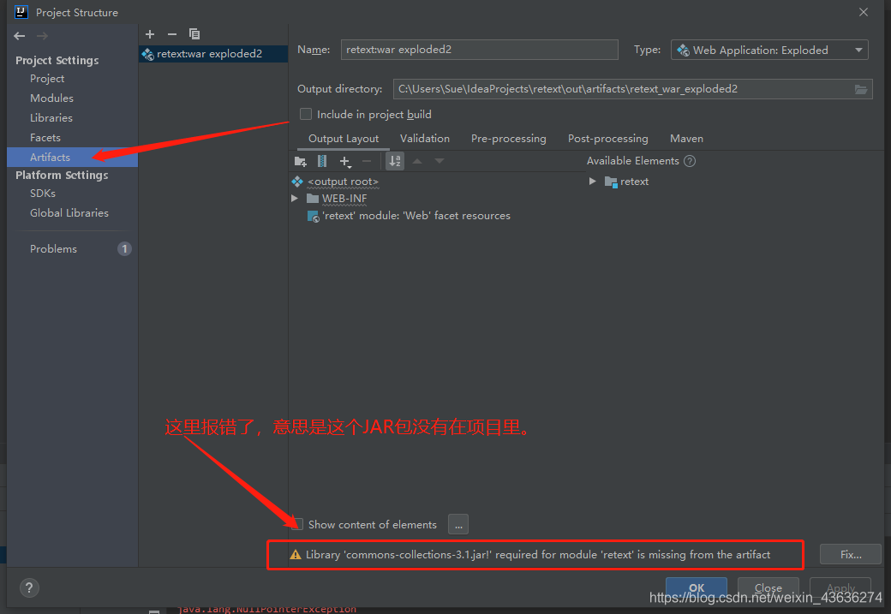
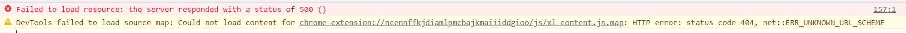

# 编程bug收集

## JDBC学习部分

* java.sql.SQLException: Parameter index out of range (1 > number of parameters, which is 0).

​      可能的问题：

​                        第一种：？号被单引号包围。

​                        第二种： sql语句中没有？号，在后面用到了set语句。

​                        第三种：初学者很常见的错误：?—？ 写成了中文的问号导致报错

* jar包文件、xml文件应该放在当前模块的src目录下 
* Access denied for user 'root'@'localhost' (using password: YES)  数据库连接时 用户密码错误


## JAVAWeb学习部分

**问题1**：URL里莫名出现%20问题

原因：URL里出现%20的原因的地址中存在的空格被转码成了%20，所以写一个正则对地址做个校验，有空格的话把它删掉就可以了


**注意事项**：修改配置文件后 要重新redeploy才能生效


JSTL标签库使用：

**问题2**：The absolute uri: http://java.sun.com/jsp/jstl/core cannot be resolved in either web.xml

​            java.lang.ClassNotFoundException: org.apache.jsp.core1_jsp

解决：https://blog.csdn.net/weixin_43636274/article/details/103598670 【主要是jar包没有完全导入module中类似下图】





**问题3**：HTTP Status 405 - HTTP method GET is not supported by this URL

原因：

1、继承自HttpServlet的Servlet没有重写对于请求和响应的处理方法：doGet或doPost等方法；默认调用父类的doGet或doPost等方法；

2、父类HttpServlet的doGet或doPost等方法的默认实现是返回状态代码为405的HTTP错误表示对于指定资源的请求方法不被允许

解决方法：

​		在你扩展的Servlert中重写doGet或doPost等方法来处理请求和响应时 不要调用父类HttpServlet的doGet或doPost等方法，即去掉super.doGet(request, response)和super.doPost(request, response);


**问题4**：java.sql.SQLException: No value specified for parameter 7 Query: update t_book set name=?,author=?,price=?,sales=?,stock=?,img_path=? where id=? Parameters: [三国演义, 罗贯中, 60, 200, static/img/default.jpg, 22]

原因：有某个sql语句中的占位符没有被填充


**问题5**：java.sql.SQLException: Cannot add or update a child row: a foreign key constraint fails

```sql
CREATE TABLE t_order(
`order_id` VARCHAR(50) PRIMARY KEY,
`create_time` DATETIME,
`price` DECIMAL(11,2),
`status` INT,
`user_id` INT,
FOREIGN KEY(`user_id`) REFERENCES t_user(`id`)
    ）;
    在表t_order中插入数据 `user_id` = 1,而在其外键列参考表中t_user表的`id`列中没有 1这个值
```
原因：原因一：

添加的外键列与另一个表的唯一索引列（一般是主键）的数据类型不同
原因二：
要添加外键的表类型与另一个表的存储引擎是不是都为innodb引擎
#查看表引擎
法一： show create table 表名;
法二：show table status from 数据库 where name=‘表名’;
法三：use information_schema;
select table_catalog,table_schema,table_name,engine from tables
where table_schema=‘数据库名’ and table_name=‘表名’;
原因三：
设置的外键与另一个表中的唯一索引列（一般是主键）中的值不匹配
#解决办法：删除要成为外键的列，再次创建并默认为NULL

## SSM学习部分

问题1：解决log4j.xml的问题：http//jakarta.apache.org/log4j/ uri is not registered

原因：原官方URL地址进行了更换

解决：修改log4j.xml文件

```xml
<?xml version="1.0" encoding="GB2312" ?>
<!DOCTYPE log4j:configuration SYSTEM "http://logging.apache.org/log4j/1.2/apidocs/org/apache/log4j/xml/doc-files/log4j.dtd">

<log4j:configuration debug="true">
```


问题2：Maven框架下在resource下建立多层级文件夹存放资源比如com.itheima.mapper 下存放UserMapp.xml 在程序运行过程中该文件找不到

原因：IDEA中Maven在识别文件夹的时候 如果你是一次性创建的文件可能不同层级不会识别出来，需要多次分层创建才可以。

问题3：The absolute uri: http://java.sun.com/jsp/jstl/core cannot be resolved in either web.xml....

原因：发现，这个问题居然是tomcat的配置文件配置了跳过tld扫描导致的，当时为了tomcat有一个更快的速度跳过了所有的tld扫描。重新下载了一个tomcat，就可以了，所以两者不可兼得，这是当时写的博客：https://blog.csdn.net/sinat_34104446/article/detail

https://blog.csdn.net/sinat_34104446/article/details/82846585

## Springboot学习部分

问题一：org.junit.runners.model.InvalidTestClassError: Invalid test class

原因 ：Test注解导入包时 误导入import org.junit.jupiter.api.Test

解决：https://blog.csdn.net/qq_43377329/article/details/107460727


问题2：org.thymeleaf.exceptions.TemplateInputException: An error happened during template parsing (template: "class path resource [templates//site/profile.html]")



原因:在controller中封装数据对象进Model，并转发至页面，但是有某个变量没有在controller中未定义，或者在页面引用变量时名字写错了。
