第一章 概述

### 图示说明

代表着主机

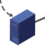代表服务器

代表着路由器

代表着网络

### 1.1、计算机网络在信息时代的作用

* 计算机网络已由一种**通信基础设施**发展成为一种重要的**信息服务基础设施**
* 计算机网络已经像水，电，煤气这些基础设施一样，成为我们**生活中不可或缺**的一部分

#### 我国互联网发展状况

[中国互联网络信息中心CNNIC](http://www.cnnic.net.cn)

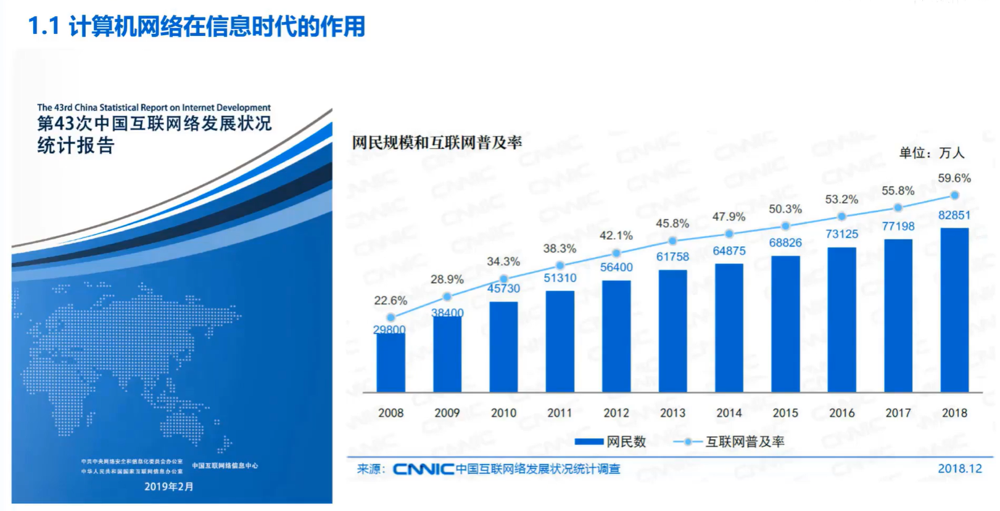

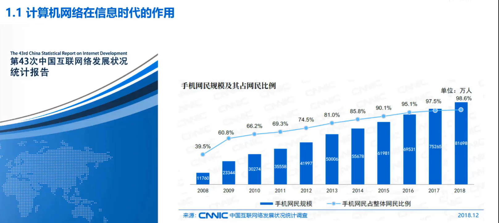

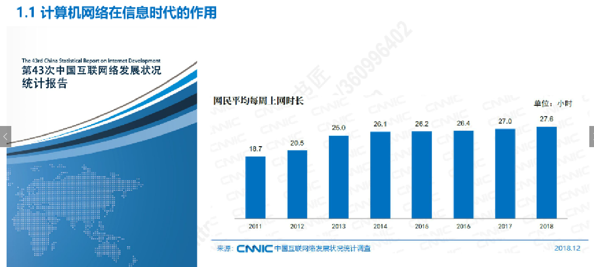

------

### 1.2、因特网概述

#### 1、网络、互连网（互联网）和因特网

网络：网络（Network）由若干**结点（Node）**和连接这些结点的**链路（Link）**组成。

互连网（互联网）：多个网络通过路由器互连起来，这样就构成了一个覆盖范围更大的网络，即互连网（互联网）。因此，互联网又称为“网络的网络（Network of Networks）”。

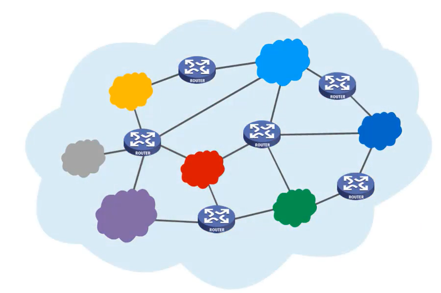

因特网：因特网（Internet）是世界上最大的互连网络（用户数以亿计，互连的网络数以百万计）。

> **internet与Internet的区别**
>
> * **internet(互联网或互连网)**是一个通用名词，它泛指**多个计算机网络互连而成的网络**。在这些网络之间的通信协议可以是任意的。
> * **Internet（因特网）则是一个专用名词**，它指**当前全球最大的、开放的、由众多网络互连而成的特定计算机网络**，它采用TCP/IP协议族作为通信的规则，其前身是美国的ARPANET。
>
> **任意把几个计算机网络互连起来（不管采用什么协议），并能够相互通信，这样构成的是一个互连网(internet) ，而不是互联网(Internet)。**

#### 2、因特网发展的三个阶段

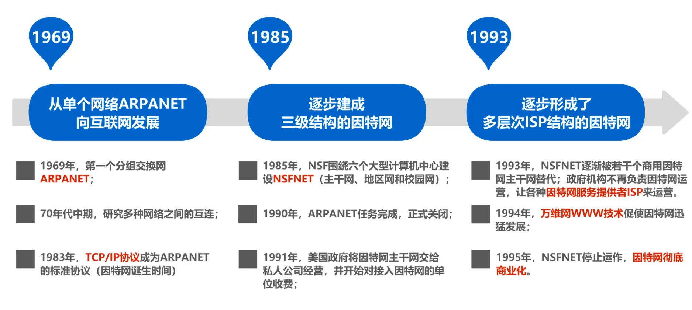

**因特网服务提供者`ISP`(`I`nternet `S`ervice `P`rovider)**

> 普通用户是如何接入到因特网的呢？
>
> 答：**通过ISP接入因特网**
>
> ISP可以从因特网管理机构申请到成块的IP地址，同时拥有通信线路以及路由器等联网设备。任何机构和个人只需缴纳费用，就可从**ISP的得到所需要的IP地址**。
>
> **因为因特网上的主机都必须有IP地址才能进行通信，这样就可以通过该ISP接入到因特网**

**中国的三大`ISP`：中国电信，中国联通和中国移动**

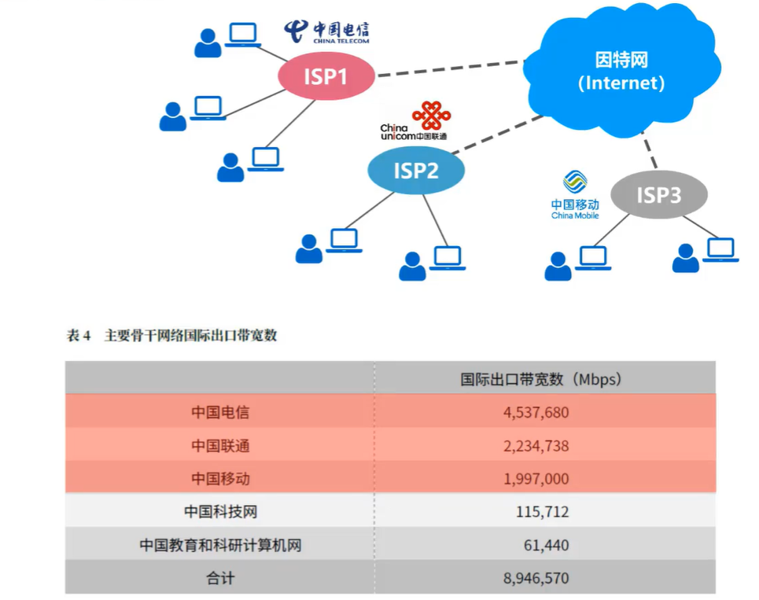

**基于ISP的三层结构的因特网**

> 一旦某个用户能够接入到因特网，那么他也可以成为一个ISP，所需要做的就是购买一些如调制解调器或路由器这样的设备，让其他用户可以和他相连。

#### 3、因特网的标准化工作

* 因特网的标准化工作对因特网的发展起到了非常重要的作用。
* 因特网在指定其标准上的一个很大的特点是**面向公众。**
  * 因特网所有的**RFC**(Request For Comments)技术文档都可从因特网上免费下载；
  * 任何人都可以随时用电子邮件发表对某个文档的意见或建议。
* **因特网协会ISOC**是一个国际性组织，它负责对因特网进行全面管理，以及在世界范围内促进其发展和使用。
  * 因特网体系结构委员会IAB，负责管理因特网有关协议的开发；
  * 因特网工程部IETF，负责研究中短期工程问题，主要针对协议的开发和标准化；
  * 因特网研究部IRTF，从事理论方面的研究和开发一些需要长期考虑的问题。

* 制订因特网的正式标准要经过一下**4个阶段**：

  1、因特网草案（在这个阶段还不是RFC文档）

  2、建议标准（从这个阶段开始就成为RFC文档）

  3、草案标准

  4、因特网标准

#### 4、因特网的组成

* 边缘部分

  由所有连接在因特网上的**主机**组成（台式电脑，大型服务器，笔记本电脑，平板，智能手机等）。这部分是**用户直接使用**的，用来进行**通信**（传送数据、音频或视频）和**资源共享**。

* 核心部分

  由**大量网络**和连接这些网络的**路由器**组成。这部分是**为边缘部分提供服务**的（提供连通性和交换）。

> 路由器是一种专用计算机，但我们不称它为主机，**路由器是实现分组交换的关键构建，其任务是转发收到的分组**，这是网络核心最重要的部分。
>
> 处在互联网边缘的部分就是连接在互联网上的所有的主机。这些主机又称为**端系统 (end system)**。
>
> **端系统在功能上可能有很大的差别：**
>
> 1. 小的端系统可以是一台普通个人电脑，具有上网功能的智能手机，甚至是一个很小的网络摄像头。
>
> 2. 大的端系统则可以是一台非常昂贵的大型计算机。
>
> 3. 端系统的拥有者可以是个人，也可以是单位（如学校、企业、政府机关等），当然也可以是某个ISP。

#### 补充：

**端系统之间通信的含义**

“主机 A 和主机 B 进行通信”实际上是指：“运行在主机 A 上的某个程序和运行在主机 B 上的另一个程序进行通信”。**即“主机** **A** **的某个进程和主机** **B** **上的另一个进程进行通信”。简称为“计算机之间通信”。** 

端系统之间的通信方式通常可划分为两大类：

**客户-服务器方式：**

* 客户 (client) 和服务器 (server) 都是指通信中所涉及的两个应用进程。
* 客户 - 服务器方式所描述的是进程之间服务和被服务的关系。
* **客户是服务的请求方，服务器是服务的提供方**。

> **服务请求方和服务提供方都要使用网络核心部分所提供的服务。**

**对等连接方式：**

* **对等连接** (peer-to-peer，简写为 **P2P** ) 是指两个主机在通信时并不区分哪一个是服务请求方还是服务提供方。
* 只要两个主机都运行了对等连接软件 ( P2P 软件) ，它们就可以进行**平等的、对等连接通信**。
* 双方都可以下载对方已经存储在硬盘中的共享文档。 

------

### 1.3 三种交换方式

网络核心部分是互联网中最复杂的部分。

网络中的核心部分要向网络边缘中的大量主机提供连通性，使边缘部分中的任何一个主机都能够向其他主机通信（即传送或接收各种形式的数据）。

在网络核心部分起特殊作用的是**路由器**(router)。

**路由器**是实现**分组交换** (packet switching) 的关键构件，其任务是**转发**收到的分组，这是网络核心部分最重要的功能。

#### 1、电路交换（Circuit Switching）

> 传统两两相连的方式，当电话数量很多时，电话线也很多，就很不方便
>
> 所以要使得每一部电话能够很方便地和另一部电话进行通信，就应该使用一个**中间设备**将这些电话连接起来，这个中间设备就是**电话交换机**

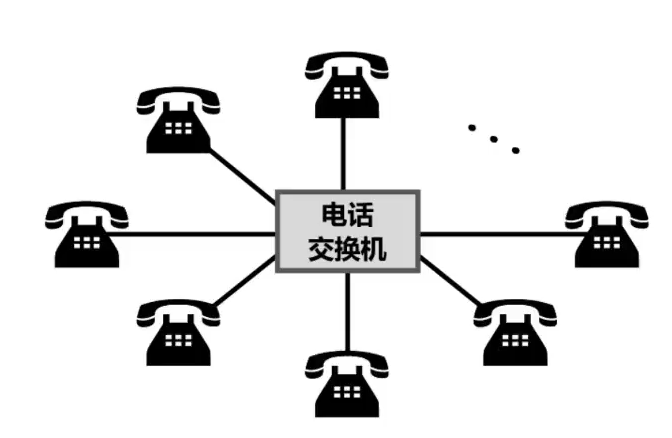

* 电话交换机接通电话线的方式称为电路交换；

* 从通信资源的分配角度来看，交换（Switching）就是按照某种方式动态地分配传输线路的资源；

* 电路交换的三个步骤：

  1、建立连接（分配通信资源）

  2、通话（一直占用通信资源）

  3、释放连接（归还通信资源）

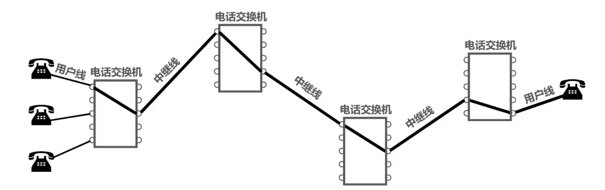

> 当使用电路交换来传送计算机数据时，其线路的传输效率往往很低。
>
> 这是因为计算机数据是突发式地出现在传输线路上的。
>
> 所以计算机通常采用的是**分组交换**，而不是电路交换

#### 2、分组交换（Packet Switching）

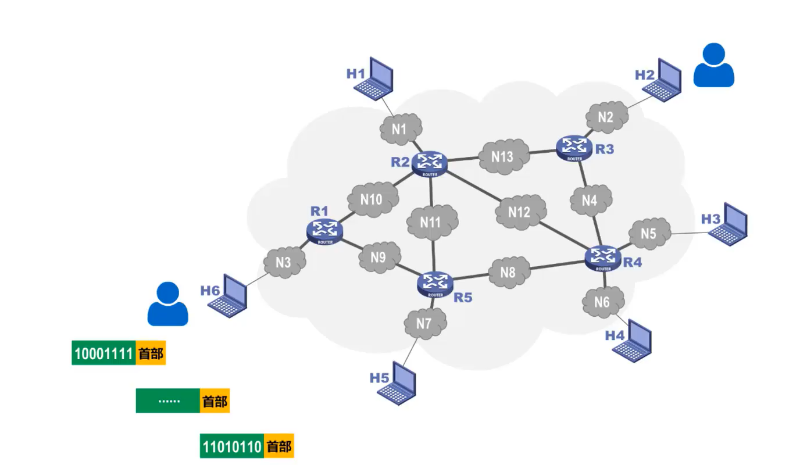

> 通常我们把表示**该消息的整块数据**称为一个**报文**。
>
> 在发送报文之前，先把较长的报文划分成一个个更小的**等长数据段**，在每一个数据段前面。加上一些由必**要的控制信息组成的首部**后，就构成一个分组，也可简称为“包”，相应地，首部也可称为“包头”。
>
> 首部包含了**分组的目的地址**
>
> 分组从源主机到目的主机，可走不同的路径，分组到达时间不一。

发送方

* 构造分组
* 发送分组

路由器

* 缓存分组
* 转发分组
* 简称为“分组转发”

> 在路由器中的输入和输出端口之间没有直接连线。
>
> 路由器处理分组的过程是：
>
> 1. 把收到的分组先**放入缓存（暂时存储）；**
> 2. **查找转发表**，找出到某个目的地址应从哪个端口转发；
> 3. 把分组送到适当的端口**转发**出去。

接收方

* 接收分组
* 还原报文

#### 3、报文交换（Message Switching）

报文交换中的交换结点也采用存储转发方式，但报文交换对报文的大小没有限制，这就要求交换结点需要较大的缓存空间。报文交换主要用于早期的电报通信网，现在较少使用，**通常被较先进的分组交换方式所取代**。

#### 三种交换方式的对比

> 假设A，B，C，D是分组传输路径所要经过的4个结点交换机，纵坐标为时间

分析：

电路交换：

* 通信之前首先**要建立连接**；连接建立好之后，就可以使用已建立好的连接进行数据传送；**数据传送后，需释放连接**，以归还之前建立连接所占用的通信线路资源。

* 一旦建立连接，中间的各结点交换机就是直通形式的，**比特流可以直达终点**；

报文交换：

* 可以随时发送报文，而不需要事先建立连接；整个报文先传送到相邻结点交换机，全部存储下来后进行查表转发，转发到下一个结点交换机。
* 整个报文需要在各结点交换机上进行存储转发，由于**不限制报文大小，因此需要各结点交换机都具有较大的缓存空间**。

分组交换：

* 可以随时发送分组，而不需要事先建立连接。构成原始报文的一个个分组，依次在各结点交换机上存储转发。各结点交换机在发送分组的同时，还缓存接收到的分组。
* 构成原始报文的一个个分组，在各结点交换机上进行存储转发，相比报文交换，减少了转发时延，还可以避免过长的报文长时间占用链路，同时也有利于进行差错控制。

------

### 1.4 计算机网络的定义和分类

#### 定义

* 计算机网络的精确定义并未统一
* 计算机网络的最简单的定义是：一些**互**相**连**接的、**自治**的计算机的**集合**。
  * 互连：是指计算机之间可以通过有线或无线的方式进行数据通信；
  * 自治：是指独立的计算机，他有自己的硬件和软件，可以单独运行使用；
  * 集合：是指至少需要两台计算机；
* 计算机网络的较好的定义是：计算机网络主要是由一些**通用的，可编程的硬件（一定包含有中央处理机CPU）互连**而成的，而这些硬件并非专门用来实现某一特定目的（例如，传送数据或视频信号）。这些可编程的硬件能够用来**传送多种不同类型的数据**，并能**支持广泛的和日益增长的应用**。
  * 计算机网络所连接的硬件，并不限于一般的计算机，而是包括了智能手机等智能硬件。
  * 计算机网络并非专门用来传送数据，而是能够支持很多种的应用（包括今后可能出现的各种应用）。

#### 分类

**按交换技术分类：**

* 电路交换网络
* 报文交换网络
* 分组交换网络

**按使用者分类：**

* 公用网
* 专用网

**按传输介质分类：**

* 有线网络
* 无线网络

**按覆盖范围分类：**

* 广域网WAN（Wide Area Network）

作用范围通常为几十到几千公里，因而有时也称为远程网（long haul network）。广域网是互联网的核心部分，其任务是通过长距离（例如，跨越不同的国家）运送主机所发送的数据。

* 城域网MAN

作用范围一般是一个城市，可跨越几个街区甚至整个城市

* 局域网LAN

一般用微型计算机或工作站通过高速通信线路相连（速率通常在 10 Mbit/s 以上），但地理上范围较小（1 km 左右）

* 个域网PAN

就是在个人工作的地方把个人使用的电子设备用无线技术连接起来的网络。

**按拓扑结构分类：**

* 总线型网络

* 星型网络

* 环形网络

* 网状型网络

------

### 1.5 计算机网络的性能指标

#### 速率

#### 带宽

#### 吞吐量

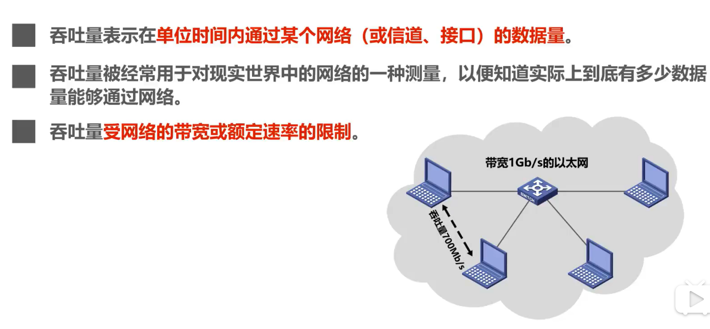

> 带宽1 Gb/s的以太网，代表其额定速率是1 Gb/s，这个数值也是该以太网的**吞吐量的绝对上限值**。因此，对于带宽1 Gb/s的以太网，可能实际吞吐量只有 700 Mb/s，甚至更低。
>
> 注意：吞吐量还可以用每秒传送的字节数或帧数表示

#### 时延

时延时指数据（一个报文或分组，甚至比特）从网络（或链路）的一端传送到另一端所需的时间。

网络时延由几部分组成：

* 发送时延

主机或路由器发送数据帧所需要的时间，也就是从发送数据帧的第一个比特算起，到该帧的最后一个比特发送完毕所需的时间。

* 传播时延

电磁波在信道中传播一定的距离需要花费的时间。

* 处理时延

主机或路由器在收到分组时要花费一定时间进行处理

* 排队时延

分组在进过网络传输时，要经过许多路由器。但分组在进入路由器后要先在输入队列中排队等待处理。

> 有时会把排队时延看成**处理时延 一部分**
>
> 总时延 = 发送时延 + 传播时延 + 处理时延 （处理时延 + 排队时延）

> 当处理时延忽略不计时，发送时延 和 传播时延谁占主导，要具体情况具体分析

#### 时延带宽积

时延带宽积 = 传播时延 * 带宽

#### 往返时间

互联网上的信息不仅仅单方向传输而是双向交互的。因此，我们有时很需要知道**双向交互一次所需的时间**。

#### 利用率

利用率有**信道利用率**和**网络利用率**两种。

  

#### 丢包率

------

### 1.6 计算机网络体系结构

#### 1、常见的计算机网络体系结构

> 如今用的最多的是TCP/IP体系结构，现今规模最大的、覆盖全球的、基于TCP/IP的互联网并未使用OSI标准。
>
> TCP/IP体系结构相当于将OSI体系结构的**物理层**和**数据链路层**合并为了**网络接口层**，并去掉了**会话层**和**表示层**。
>
> TCP/IP在网络层使用的协议是IP协议，IP协议的意思是网际协议，因此**TCP/IP体系结构的网络层称为网际层**

> 在用户主机的操作系统中，通常都带有符合TCP/IP体系结构标准的TCP/IP协议族。
>
> 而用于网络互连的路由器中，也带有符合TCP/IP体系结构标准的TCP/IP协议族。
>
> 只不过路由器一般只包含网络接口层和网际层。

> **网络接口层**：并没有规定具体内容，这样做的目的是可以互连全世界各种不同的网络接口，例如：有线的以太网接口，无线局域网的WIFI接口等。
>
> **网际层**：它的核心协议是IP协议。
>
> **运输层**：TCP和UDP是这层的两个重要协议。
>
> **应用层**：这层包含了大量的应用层协议，如 HTTP , DNS 等。

> **IP协议（网际层）**可以将不同的**网络接口（网络接口层）**进行互连，并向其上的**TCP协议和UDP协议（运输层）**提供网络互连服务
>
> 而**TCP协议**在享受IP协议提供的网络互连服务的基础上，可向**应用层的相应协议**提供**可靠**的传输服务。
>
> **UDP协议**在享受IP协议提供的网络互连服务的基础上，可向**应用层的相应协议**提供**不可靠**的传输服务。

> TCP/IP体系结构中最重要的是**IP协议**和**TCP协议**，因此用TCP和IP来表示整个协议大家族。

> 教学时把TCP/IP体系结构的**网络接口层**分成了**物理层**和**数据链路层**

#### 2、计算机网络体系结构分层的必要性

**物理层问题**

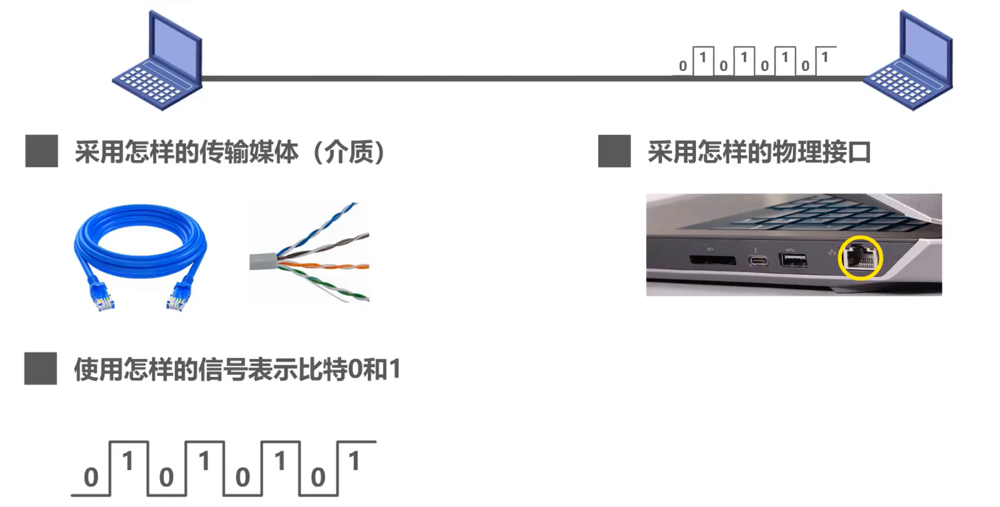

> 这图说明
>
> * 第一，严格来说，传输媒体并不属于物理层
> * 计算机传输的信号，并不是图示的方波信号
>
> 这样举例只是让初学者容易理解

**数据链路层问题**

MAC地址（英语：Media Access Control Address）,每个网卡都需要并会有一个唯一的MAC地址

**网络层问题**

IP是Internet Protocol（网际互连协议）的缩写，前三段标识网络，最后一段标识为主机号

**运输层问题**

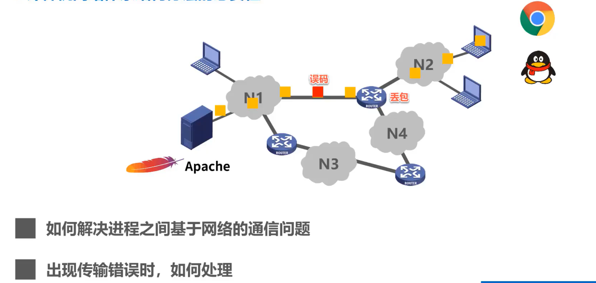

>如何标识与网络通信相关的应用进程：一个分组到来，我们应该交给哪个进程处理呢？浏览器进程还是QQ进程，使用端口号

**应用层问题**

> 应用层该用什么方法（应用层协议）去解析数据

**总结**

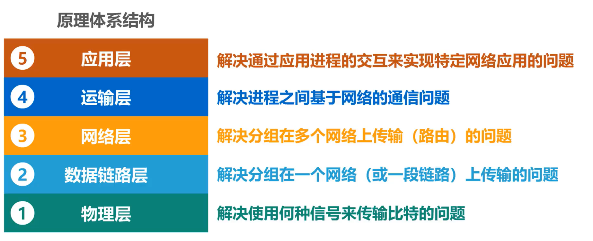

#### 3、计算机网络体系结构分层思想举例

例子：主机的浏览器如何与Web服务器进行通信

**解析：**

主机和Web服务器之间基于网络的通信，实际上是主机中的**浏览器应用进程**与Web服务器中的**Web服务器应用进程**之间基于**网络的通信**

**体系结构的各层在整个过程中起到怎样的作用？**

**1、发送方发送**

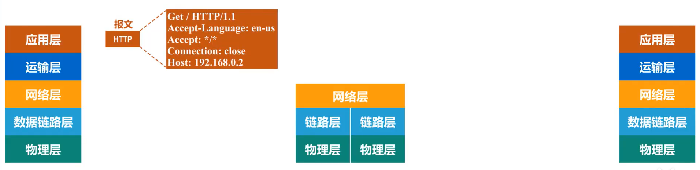

> 第一步：
>
> * **应用层**按照HTTP协议的规定构建一个**HTTP请求报文**
> * 应用层将**HTTP请求报文**交付给**运输层**处理

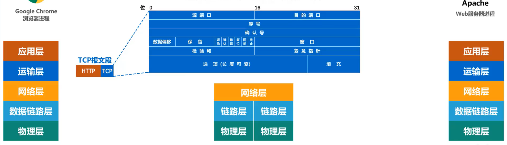

> 第二步：
>
> * **运输层**给**HTTP请求报文**添加一个**TCP首部**，使之成为**TCP报文段**
> * **TCP报文段的首部格式**作用是区分应用进程以及实现可靠传输
> * **运输层**将T**CP报文段**交付给**网络层**处理

> 第三步：
>
> * **网络层**给**TCP报文段**添加一个**IP首部**，使之成为**IP数据报**
> * **IP数据报的首部格式**作用是使**IP数据报**可以在互联网传输，也就是被路由器转发
> * **网络层**将**IP数据报**交付给**数据链路层**处理

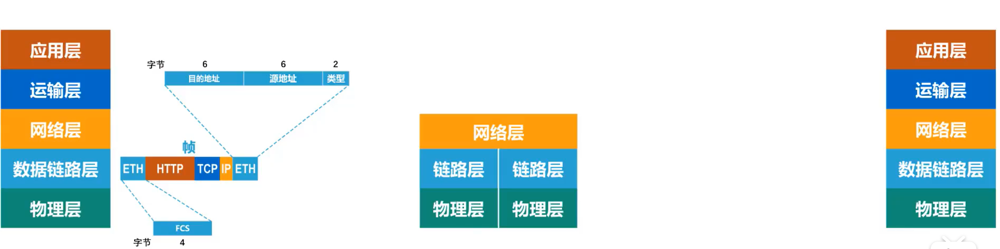

> 第四步：
>
> * **数据链路层**给**IP数据报**添加一个**首部**和一个**尾部**，使之成为**帧**     （图示右边为首部，左边为尾部） 
> * 该**首部**的作用主要是为了让**帧**能够在一段链路上或一个网络上传输，能够被相应的目的主机接收
> * 该**尾部**的作用是让目的主机检查所接收到的**帧**是否有误码
> * **数据链路层**将**帧**交付给**物理层**

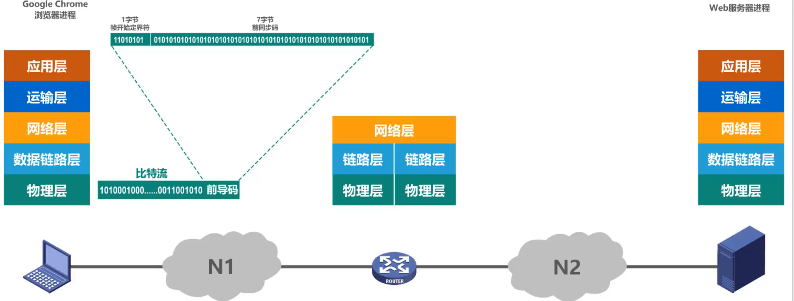

> 第五步：
>
> * **物理层**先将**帧**看做是**比特流**，这里的网络N1假设是以太网，所以**物理层**还会给该**比特流**前面添加**前导码**
> * **前导码**的作用是为了让目的主机做好接收帧的准备
> * **物理层**将装有**前导码**的**比特流**变换成相应的**信号**发送给传输媒体

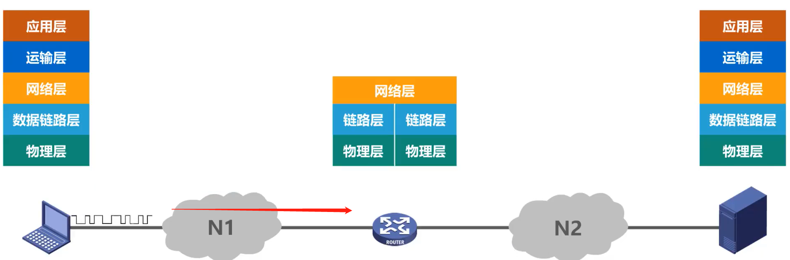

> 第六步：
>
> * **信号**通过**传输媒体**到达**路由器**

**2、路由器转发**

> 在路由器中
>
> * **物理层**将**信号**变为**比特流**，然后去掉**前导码**后，将其交付给**数据链路层**
> * **数据链路层**将**帧**的**首部**和**尾部**去掉后，将其交付给**网络层**，这实际交付的是**IP数据报**
> * **网络层**解析**IP数据报**的**首部**，从中提取**目的网络地址**

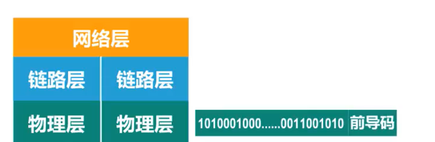

> 在路由器中
>
> * 提取**目的网络地址**后查找**自身路由表**。确定**转发端口**， 以便进行转发
> * **网络层**将**IP数据报**交付给**数据链路层**
> * **数据链路层**给**IP数据报**添加一个**首部**和一个**尾部**，使之成为**帧**
> * **数据链路层**将帧交付给**物理层**
> * **物理层**先将**帧**看成**比特流**，这里的网络N2假设是以太网，所以**物理层**还会给该**比特流**前面添加**前导码**
> * 物理层将装有**前导码**的**比特流**变换成相应的**信号**发送给传输媒体，信号通过传输媒体到达**Web服务器**

**3、接收方接收**

> 和发送方（主机）发送过程的封装正好是反着来
>
> 在Web 服务器上
>
> * **物理层**将**信号**变换为**比特流**，然后去掉**前导码**后成为**帧**，交付给**数据链路层**
> * **数据链路层**将**帧**的**首部**和**尾部**去掉后成为**IP数据报**，将其交付给**网络层**
> * **网络层**将**IP数据报**的**首部**去掉后成为**TCP报文段**，将其交付给**运输层**
> * **运输层**将**TCP报文段**的**首部**去掉后成为**HTTP请求报文**，将其交付给**应用层**
> * **应用层**对**HTTP请求报文**进行**解析**，然后给主机发回**响应报文**
>
> **发回响应报文的步骤和之前过程类似**

#### 4、计算机网络体系结构中的专用术语

以下介绍的专用术语来源于OSI的七层协议体系结构，但也适用于TCP/IP的四层体系结构和五层协议体系结构

**实体**

**协议**

> 协议：控制两个对等实体进行逻辑通信的规则的集合
>
> 协议三要素：
>
> * 语法：定义所交换信息的格式
> * 语义：定义收发双方所要完成的操作
> * 同步：定义收发双发的时序关系

**服务**

术语协议数据单元（PDU，Protocol Data Unit），服务数据单元（SDU，Service Data Unit）

## 第二章 物理层

### 2.1、物理层的基本概念

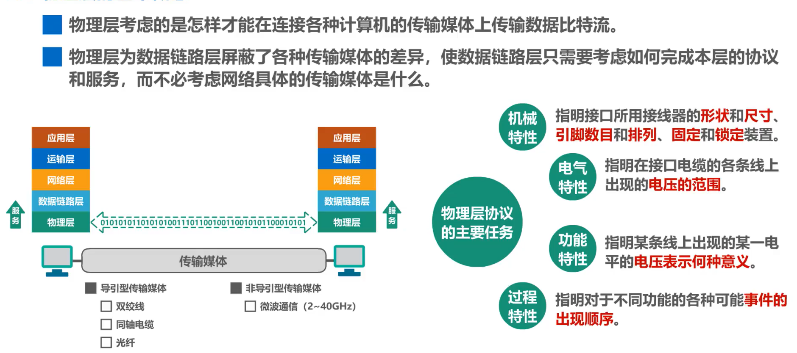

------

### 2.2、物理层下面的传输媒体

**传输媒体**也称为传输介质或传输媒介，他就是数据传输系统中在发送器和接收器之间的物理通路。**传输媒体**课分为两大类，即**导引型传输媒体**和**非导引型传输媒体**

**传输媒体不属于计算机网络体系结构的任何一层**。如果非要将它添加到体系结构中，那只能将其放置到物理层之下。

#### 导引型传输媒体

在导引型传输媒体中，电磁波被导引沿着固体媒体传播。

**同轴电缆**

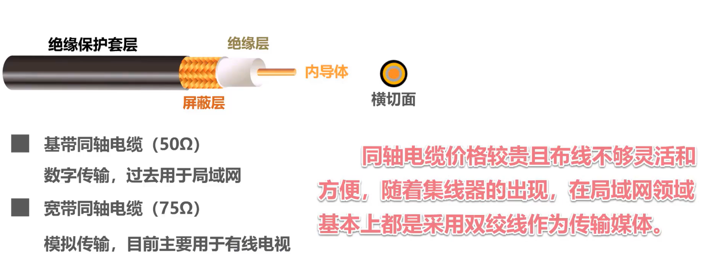

**双绞线**

**光纤**

> **多模光纤**
>
> * 可以存在多条不同角度入射的光线在一条光纤中传输。这种光纤就称为**多模光纤**。
>
> **单模光纤**
>
> * 若光纤的直径减小到只有一个光的波长，则光纤就像一根波导那样，它可使光线一直向前传播，而不会产生多次反射。这样的光纤称为**单模光纤**。

**电力线**

#### 非导引型传输媒体

非导引型传输媒体是指自由空间。

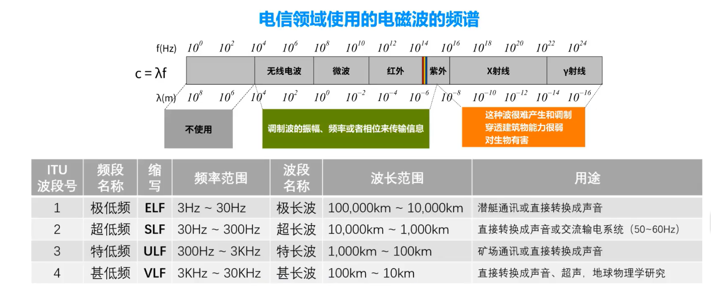

**无线电波**

**微波**

**红外线**

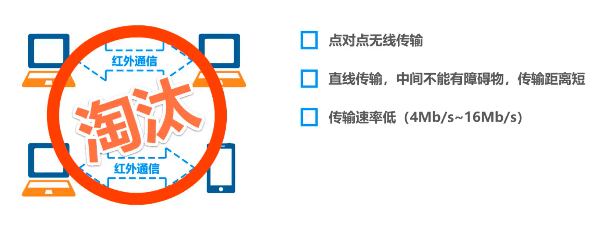

**可见光**

[LIFI](https://baike.baidu.com/item/%E5%8F%AF%E8%A7%81%E5%85%89%E6%97%A0%E7%BA%BF%E9%80%9A%E4%BF%A1/16268518?fromtitle=LiFi&fromid=5675729&fr=aladdin)

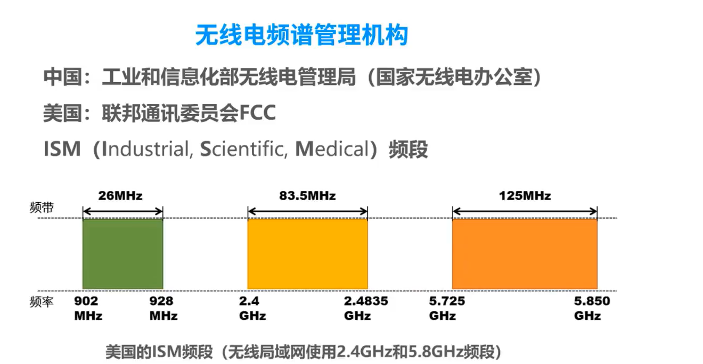

------

### 2.3、传输方式

#### 串行传输和并行传输

> **串行传输**：
>
> * 数据是一个比特一个比特依次发送的，因此在发送端与接收端之间，只需要**一条数据传输线路**即可
>
> **并行传输**：
>
> * 一次发送n个比特，因此，在发送端和接收端之间需要有**n条传输线路**
>
> * 并行传输的优点是比串行传输的速度n倍，但成本高
>
> 数据在传输线路上的传输采用是**串行传输**，计算机内部的数据传输常用**并行传输**，远距离串行，近距离并行。

#### 同步传输和异步传输

外同步如I2C，内同步如onewire

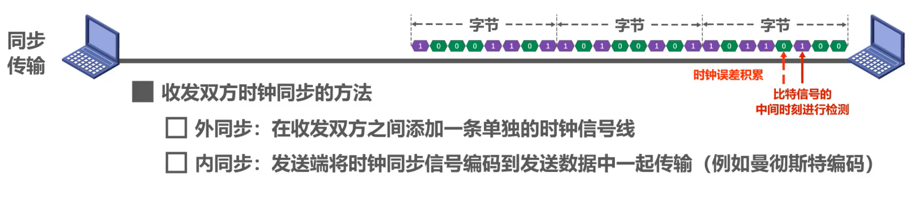

> **同步传输**：
>
> * 数据块以稳定的比特流的形式传输。字节之间没有间隔
> * 接收端在每个比特信号的中间时刻进行检测，以判别接收到的是比特0还是比特1
> * 由于不同设备的时钟频率存在一定差异，不可能做到完全相同，在传输大量数据的过程中，所产生的判别时刻的累计误差，会导致接收端对比特信号的判别错位
>
> 所以要使**收发双发时钟保持同步**

> **异步传输**：
>
> * 以字节为独立的传输单位，字节之间的时间间隔不是固定
> * 接收端仅在每个字节的起始处对字节内的比特实现同步
> * 通常在每个字节前后分别加上起始位和结束位

#### 单向通信（单工）、双向交替通信（半双工）和双向同时通信（全双工）

在许多情况下，我们要使用“**信道（channel）**”这一名词。信道和电路并不等同。信道一般都是用来表示向某一个方向传送信息的媒体。因此，一条通信电路往往包含一条发送信道和一条接收信道。

从通信的双方信息交互的方式来看，可以有以下三种基本方式：

**单向通信**：

又称为**单工通信**，即只能有**一个方向的通信**而没有反方向的交互。无线电广播或有线电以及电视广播就属于这种类型

**双向交替通信**：

又称为**半双工通信**，即通信的**双方可以发送信息，但不能双方同时发送**（当然也就不能同时接收）。这种通信方式使一方发送另一方接收，过一段时间后可以再反过来

**双向同时通信**：

又称为**全双工通信**，即通信的双发可以**同时发送和接收信息**。

> **单向通信**只需要一条信道，而**双向交替通信**或**双向同时通信**则需要两条信道（每个方向各一条）
>
> **双向同时通信**的传输效率最高

### 2.4、编码与调制

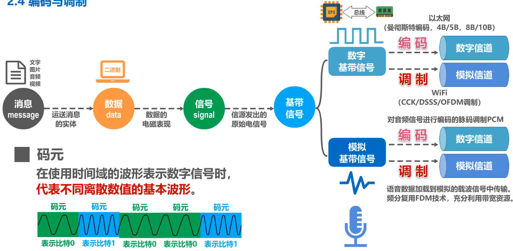

> **常用术语**
>
> * **数据 (data)** —— 运送消息的实体。
> * **信号 (signal)** —— 数据的电气的或电磁的表现。 
> * **模拟信号 (analogous signal)** —— 代表消息的参数的取值是连续的。 
> * **数字信号 (digital signal)** —— 代表消息的参数的取值是离散的。 
> * **码元 (code)** —— 在使用时间域（或简称为时域）的波形表示数字信号时，代表不同离散数值的基本波形。
>
> * **基带信号**（即基本频带信号）—— 来自信源的信号。像计算机输出的代表各种文字或图像文件的数据信号都属于基带信号。
> * 基带信号往往包含有较多的低频成分，甚至有直流成分，而许多信道并不能传输这种低频分量或直流分量。因此必须对基带信号进行**调制**  (modulation)。 

在计算机网络中，常见的是将数字基带信号通过编码（基带信号转换为数字信号）或调制（基带信号转换为模拟信号）的方法在相应信道进行传输

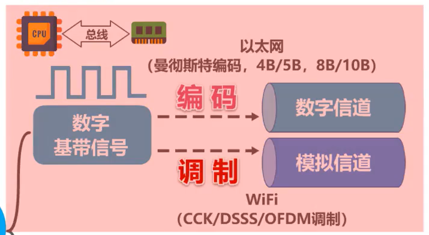

#### **传输媒体与信道的关系**

> **信道的几个基本概念**
>
> * **信道** —— 一般用来表示向某一个方向传送信息的媒体。
> * **单向通信（单工通信）**——只能有一个方向的通信而没有反方向的交互。
> * **双向交替通信（半双工通信）**——通信的双方都可以发送信息，但不能双方同时发送(当然也就不能同时接收)。
> * **双向同时通信（全双工通信）**——通信的双方可以同时发送和接收信息。 

严格来说，传输媒体不能和信道划等号

对于单工传输，传输媒体只包含一个信道，要么是发送信道，要么是接收信道

对于半双工和全双工，传输媒体中要包含两个信道，一个发送信道，另一个是接收信道

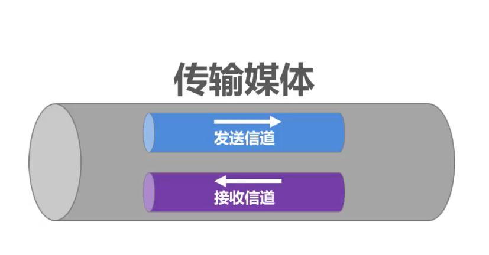

> 如果使用信道复用技术，**一条传输媒体还可以包含多个信道**

#### 常用编码

**不归零编码NRZ**

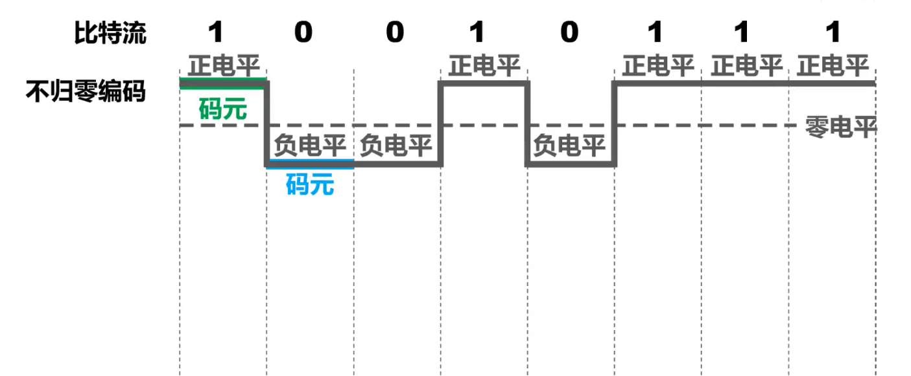

> * 正电平表示比特1/0
>
> * 负电平表示比特0/1
>
> 中间的虚线是零电平，所谓不归零编码，就是指在整个码元时间内，电平不会出现零电平
>
> **实际比特1和比特0的表示要看现实怎么规定**

> 这需要发送方的发送与接收方的接收做到严格的同步
>
> * 需要**额外一根传输线来传输时钟信号**，使发送方和接收方同步，接收方按时钟信号的节拍来逐个接收码元
> * **但是**对于计算机网络，**宁愿利用这根传输线传输数据信号**，而不是传输时钟信号
>
> 由于**不归零编码**存在**同步问题**，因此计算机网络中的数据传输不采用这类编码！

**反向不归零编码NRZI**

**归零编码RZ**

> **归零编码**虽然**自同步**，但**编码效率低**

**曼彻斯特编码**

> 在每个码元时间的中间时刻，信号都会发生跳变（中间时刻跳变）
>
> * 负跳变表示比特1/0
> * 正跳变表示比特0/1
> * 码元中间时刻的**跳变即表示时钟，又表示数据**
>
> **实际比特1和比特0的表示要看现实怎么规定**
>
> 传统以太网使用的就是曼切斯特编码

**差分曼彻斯特编码**

> 在每个码元时间的中间时刻，信号都会发送跳变，但与**曼彻斯特不同**
>
> * **跳变仅表示时钟**
> * **码元开始处电平是否变换表示数据**
>   * 变化表示比特1/0
>   * 不变化表示比特0/1
>
> **实际比特1和比特0的表示要看现实怎么规定**
>
> 比曼彻斯特编码变化少，更适合较高的传输速率

**总结**

#### 调制

数字信号转换为模拟信号，在模拟信道中传输，例如WiFi，采用补码键控CCK/直接序列扩频DSSS/正交频分复用OFDM等**调制**方式。

模拟信号转换为另一种模拟信号，在模拟信道中传输，例如，语音数据加载到模拟的载波信号中传输。频分复用FDM技术，充分利用带宽资源。

**基本调制方法**

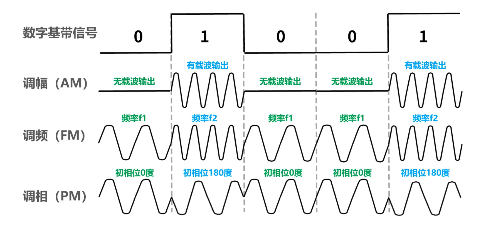

> * **调幅AM**：所调制的信号由两种不同振幅的基本波形构成。每个基本波形只能表示1比特信息量。
> * **调频FM**：所调制的信号由两种不同频率的基本波形构成。每个基本波形只能表示1比特信息量。
> * **调相PM**：所调制的信号由两种不同初相位的基本波形构成。每个基本波形只能表示1比特信息量。
>
> 但是使用基本调制方法，1个码元只能包含1个比特信息

**混合调制**

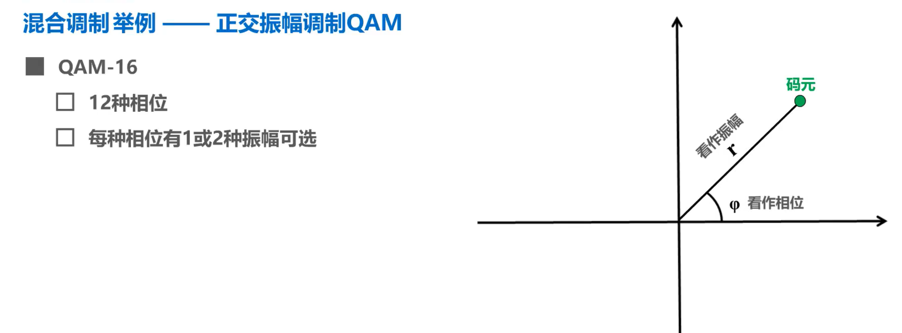

> 上图码元所对应的4个比特是错误的，码元不能随便对应4个比特

#### 码元

在使用时间域的波形表示数字信号时，代表不同离散数值的基本波形。

### 2.5、信道的极限容量

* 任何实际的信道都不是理想的，在传输信号时会产生各种失真以及带来多种干扰。 
* 码元传输的速率越高，或信号传输的距离越远，或传输媒体质量越差，在信道的输出端的波形的失真就越严重。

失真的原因：

* 码元传输的速率越高
* 信号传输的距离越远
* 噪声干扰越大
* 传输媒体质量越差

信号调制速度就是码元传输速率

比特/秒（bps）

奈氏准则（默认低通）和香农公式对比：

奈氏准则是无噪声情况下的极限数据传输速率，香农公式考虑到了信噪比。

### 补充：信道复用技术

本节内容视频未讲到，是《计算机网络（第7版）谢希仁》物理层的内容

#### 频分复用、时分复用和统计时分复用

复用 (multiplexing) 是通信技术中的基本概念。

它允许用户使用一个共享信道进行通信，降低成本，提高利用率。

**频分复用 FDM (Frequency Division Multiplexing)**

* 将整个带宽分为多份，用户在分配到一定的频带后，在通信过程中自始至终都占用这个频带。
* **频分复用**的所有用户在同样的时间**占用不同的带宽资源**（请注意，这里的“带宽”是频率带宽而不是数据的发送速率）。 

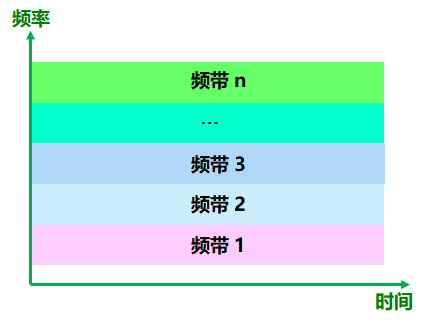

**时分复用TDM (Time Division Multiplexing)** 

* **时分复用**则是将时间划分为一段段等长的**时分复用帧（TDM帧）**。每一个时分复用的用户在每一个 TDM 帧中占用固定序号的时隙。
* 每一个用户所占用的时隙是**周期性地出现**（其周期就是TDM帧的长度）的。
* TDM 信号也称为**等时** (isochronous) 信号。
* **时分复用的所有用户在不同的时间占用同样的频带宽度。**

* **时分复用可能会造成线路资源的浪费**
  * 使用时分复用系统传送计算机数据时，由于计算机数据的突发性质，用户对分配到的子信道的利用率一般是不高的。

**统计时分复用 STDM  (Statistic TDM)** 

#### 波分复用

波分复用 WDM(Wavelength Division Multiplexing)，光的频分复用

#### 码分复用

码分复用 CDM  (Code Division Multiplexing)

* 常用的名词是**码分多址** CDMA (Code Division Multiple Access)。
* 各用户使用经过特殊挑选的不同码型，因此彼此不会造成干扰。
* 这种系统发送的信号有很强的抗干扰能力，其频谱类似于白噪声，不易被敌人发现。 

## 第三章 数据链路层

### 3.1、数据链路层概述

#### 概述

**链路**是从一个结点到相邻结点的一段物理线路，**数据链路**则是在链路的基础上增加了一些必要的硬件（如网络适配器）和软件（如协议的实现）

**网络中的主机、路由器等都必须实现数据链路层**

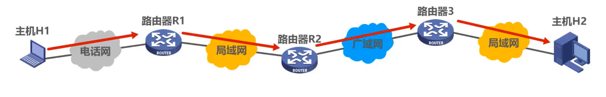

**局域网中的主机、交换机等都必须实现数据链路层**

**从层次上来看数据的流动**

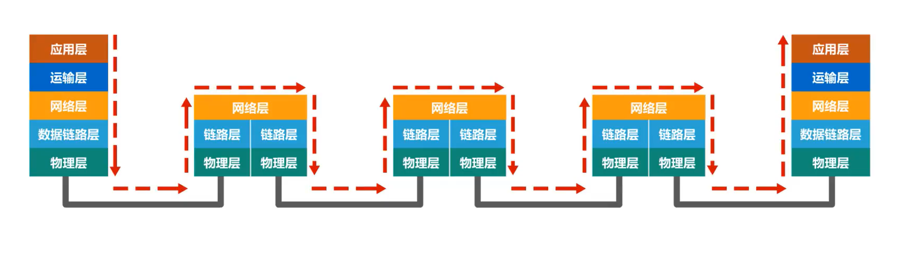

**仅从数据链路层观察帧的流动**

> 主机H1 到主机H2 所经过的网络可以是多种不同类型的
>
> **注意：不同的链路层可能采用不同的数据链路层协议**

**数据链路层使用的信道**

数据链路层属于计算机网路的低层。**数据链路层使用的信道主要有以下两种类型：**

* 点对点信道
* 广播信道

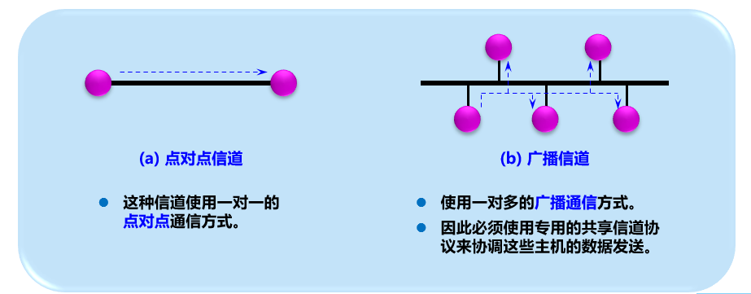

> **局域网属于数据链路层**
>
> 局域网虽然是个网络。但我们并不把局域网放在网络层中讨论。这是因为在网络层要讨论的是多个网络互连的问题，是讨论分组怎么从一个网络，通过路由器，转发到另一个网络。
>
> 而在同一个局域网中，分组怎么从一台主机传送到另一台主机，但并不经过路由器转发。从整个互联网来看，**局域网仍属于数据链路层**的范围

#### 三个重要问题

数据链路层传送的协议数据单元是**帧**

**封装成帧**

* **封装成帧** (framing) 就是在一段数据的前后分别添加首部和尾部，然后就构成了一个帧。
* 首部和尾部的一个重要作用就是进行**帧定界**。

**差错控制**

在传输过程中可能会产生**比特差错**：1 可能会变成 0， 而 0 也可能变成 1。检错码也可以检测自己的差错。

**可靠传输**

接收方主机收到有误码的帧后，是不会接受该帧的，会将它丢弃

如果数据链路层向其上层提供的是不可靠服务，那么丢弃就丢弃了，不会再有更多措施

**如果数据链路层向其上层提供的是可靠服务，那就还需要其他措施，来确保接收方主机还可以重新收到被丢弃的这个帧的正确副本**

>以上三个问题都是使用**点对点信道的数据链路层**来举例的

**如果使用广播信道的数据链路层除了包含上面三个问题外，还有一些问题要解决**

如图所示，主机A，B，C，D，E通过一根总线进行互连，主机A要给主机C发送数据，代表帧的信号会通过总线传输到总线上的其他各主机，那么主机B，D，E如何知道所收到的帧不是发送给她们的，主机C如何知道发送的帧是发送给自己的

可以用编址（地址）的来解决

将**帧的目的地址添加在帧中一起传输**

还有**数据碰撞问题**

> 随着技术的发展，交换技术的成熟，
>
> 在 有线（局域网）领域 使用**点对点链路**和**链路层交换机**的**交换式局域网**取代了~~共享式局域网~~
>
> 在无线局域网中仍然使用的是共享信道技术
>
> Carrier Sense Multiple Access with Collision Detection载波侦听多路访问/冲突检测

------

### 3.2、封装成帧

#### 介绍

封装成帧是指**数据链路层给上层交付的协议数据单元添加帧头和帧尾使之成为帧**

* **帧头和帧尾中包含有重要的控制信息**

发送方的数据链路层将上层交付下来的协议数据单元封装成帧后，还要通过物理层，将构成帧的各比特，转换成电信号交给传输媒体，那么接收方的数据链路层如何从物理层交付的比特流中提取出一个个的帧？

答：需要帧头和帧尾来做**帧定界**

但比**不是每一种数据链路层协议的帧都包含有帧定界标志**，例如下面例子

> 前导码
>
> * 前同步码：作用是使接收方的时钟同步
> * 帧开始定界符：表明其后面紧跟着的就是MAC帧

另外以太网还规定了帧间间隔为96比特时间，因此，MAC帧不需要帧结束定界符

#### 透明传输

> **透明**
>
> 指某一个实际存在的事物看起来却好像不存在一样。

透明传输是指**数据链路层对上层交付的传输数据没有任何限制**，好像数据链路层不存在一样

帧界定标志也就是个特定数据值，如果在上层交付的协议数据单元中，  恰好也包含这个特定数值，接收方就不能正确接收

> 所以数据链路层应该对上层交付的数据**有限制**，其内容不能包含帧定界符的值

**解决透明传输问题**

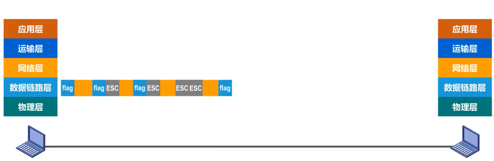

* **解决方法**：面向字节的物理链路使用**字节填充** (byte stuffing) 或**字符填充** (character stuffing)，面向比特的物理链路使用比特填充（HDLC帧头尾为01111110，零比特填充法，每五个连续1后面插入一个比特0）的方法实现透明传输
* 发送端的数据链路层在数据中出现控制字符“SOH”或“EOT”的前面**插入一个转义字符“ESC”**(其十六进制编码是**1B**)。
* 接收端的数据链路层在将数据送往网络层之前删除插入的转义字符。
* 如果**转义字符也出现在数据当中，那么应在转义字符前面插入一个转义字符 ESC**。当接收端收到连续的两个转义字符时，就删除其中前面的一个。 

**帧的数据部分长度**

#### 总结

------

### 3.3、差错检测

#### 介绍

FCS：Frame Check Sequence（帧校验序列）

#### 奇偶校验

#### 循环冗余校验CRC(Cyclic Redundancy Check)

**例题**

二进制除法为异或运算，二进制乘法就是0或1相乘的原值，为与运算。

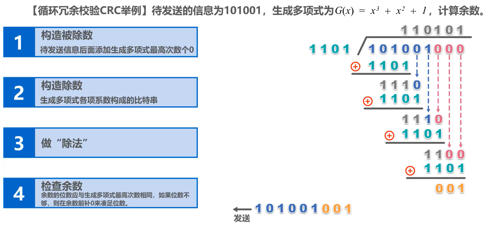

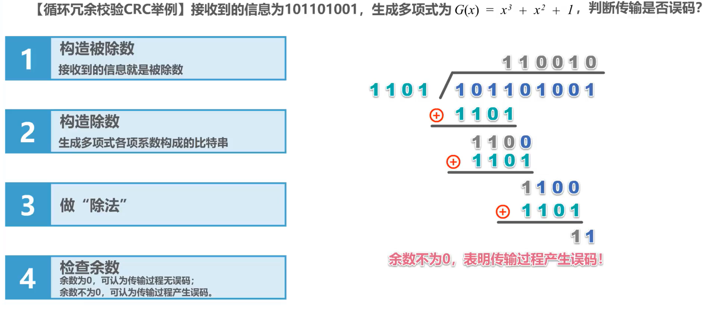

**总结**

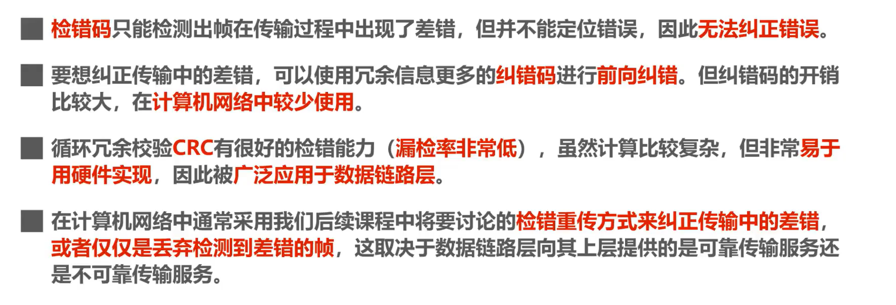

> 循环冗余校验 CRC 是一种检错方法，而帧校验序列 FCS 是添加在数据后面的冗余码

------

### 3.4、可靠传输

#### 基本概念

**下面是比特差错**

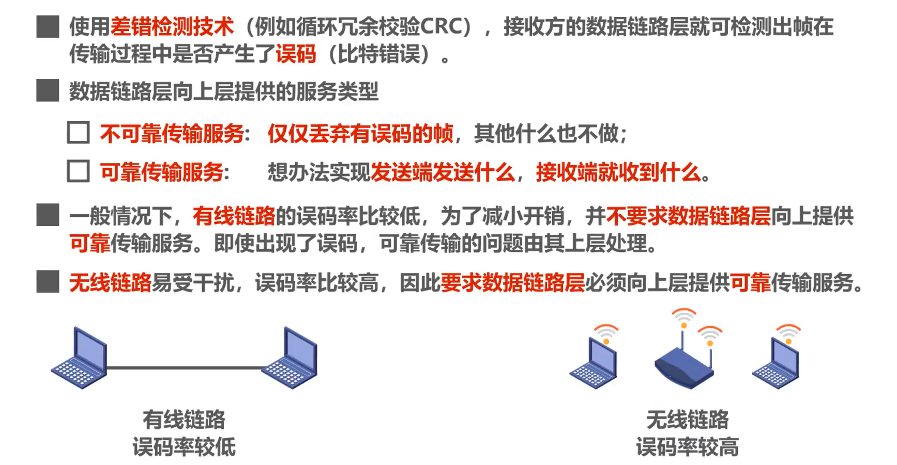

**其他传输差错**

* 分组丢失

路由器输入队列快满了，主动丢弃收到的分组

* 分组失序

数据并未按照发送顺序依次到达接收端

* 分组重复

由于某些原因，有些分组在网络中滞留了，没有及时到达接收端，这可能会造成发送端对该分组的重发，重发的分组到达接收端，但一段时间后，滞留在网络的分组也到达了接收端，这就造成**分组重复**的传输差错

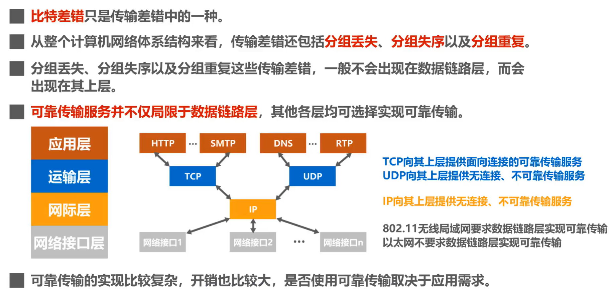

#### 三种可靠协议

* 停止-等待协议SW（stop wait）也称为自动请求重传协议（ARQ automatic repeat request）
* 回退N帧协议GBN（Go-Back-N）连续ARQ协议
* 选择重传协议SR（Selective-Repeat）

> 这三种可靠传输实现机制的基本原理并**不仅限于数据链路层，可以应用到计算机网络体系结构的各层协议**中

#### 停止-等待协议

##### 停止-等待协议可能遇到的四个问题

**确认与否认**

发送一个分组后，发送方等待接收方的应答，发送方不能立即从缓存中删除发送的分组，要收到接收方的确认分组ack后才能删除。

**超时重传**

**确认丢失**

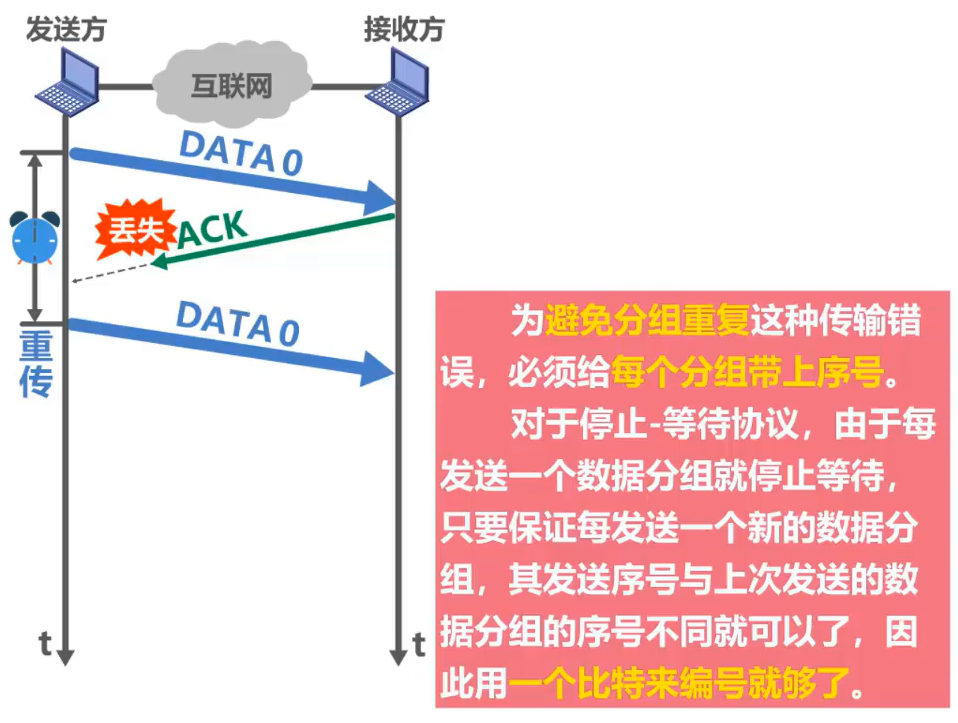

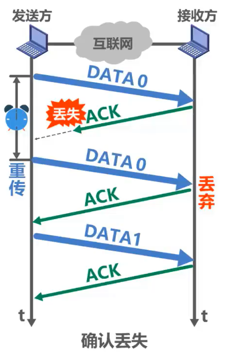

> 既然数据分组需要编号，确认分组是否需要编号？
>
> 要。如下图所示

**确认迟到**

> 注意，图中最下面那个数据分组与之前序号为0的那个数据分组不是同一个数据分组

**注意事项**

##### 停止-等待协议的信道利用率

假设收发双方之间是一条直通的信道

* **TD**：是发送方发送数据分组所耗费的发送时延
* **RTT**：是收发双方之间的往返时间
* **TA**：是接收方发送确认分组所耗费的发送时延

TA一般都远小于TD，可以忽略，当RTT远大于TD时，信道利用率会非常低

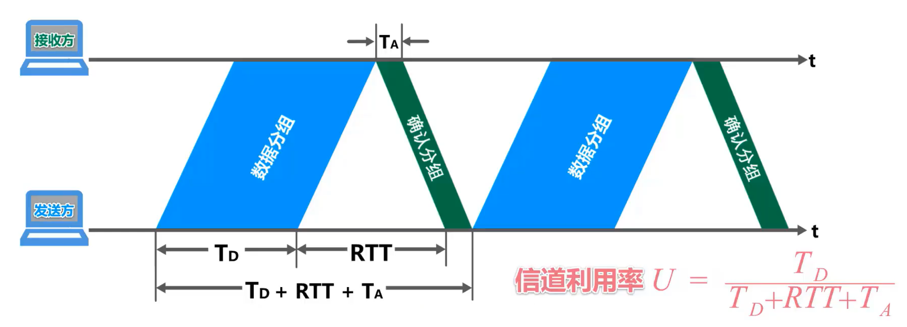

> 像停止-等待协议这样通过确认和重传机制实现的可靠传输协议，常称为自动请求重传协议ARQ(**A**utomatic **R**epeat re**Q**uest)，意思是重传的请求是自动进行，因为不需要接收方显式地请求，发送方重传某个发送的分组

#### 回退N帧协议GBN

##### 为什么用回退N帧协议

在相同的时间内，使用停止-等待协议的发送方只能发送一个数据分组，而采用流水线传输的发送方，可以发送多个数据分组

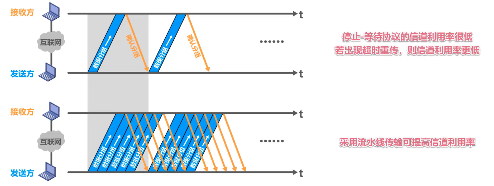

回退N帧协议**在流水线传输的基础上，利用发送窗口来限制发送方可连续发送数据分组的个数**

**窗口尺寸小于序号范围可使每次发送的分组的编号都不相同**

##### 无差错情况流程

发送方将序号落在发送窗口内的0~4号数据分组，依次连续发送出去

他们经过互联网传输正确到达接收方，就是没有乱序和误码，接收方按序接收它们，每接收一个，接收窗口就向前滑动一个位置，并给发送方发送针对所接收分组的确认分组，在通过互联网的传输正确到达了发送方

发送方每接收一个、发送窗口就向前滑动一个位置，这样就有新的序号落入发送窗口，发送方可以将收到确认的数据分组从缓存中删除了，而接收方可以择机将已接收的数据分组交付上层处理

##### **累计确认**

> 累计确认
>
> 优点:
>
> * **即使确认分组丢失，发送方也可能不必重传**
> * 减小接收方的开销
> * 减小对网络资源的占用
>
> 缺点：
>
> * 不能向发送方及时反映出接收方已经正确接收的数据分组信息

##### **有差错情况**

例如

在传输数据分组时，5号数据分组出现误码，接收方通过数据分组中的检错码发现了错误

于是丢弃该分组，而后续到达的这剩下四个分组与接收窗口的序号不匹配

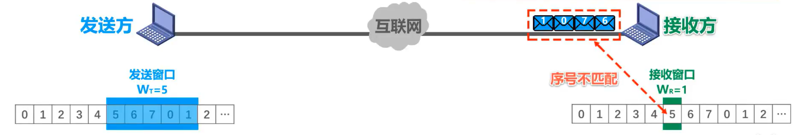

接收同样也不能接收它们，讲它们丢弃，并对之前按序接收的最后一个数据分组进行确认，发送ACK4，**每丢弃一个数据分组，就发送一个ACK4**

当收到重复的ACK4时，就知道之前所发送的数据分组出现了差错，于是**可以不等超时计时器超时就立刻开始重传**，具体收到几个重复确认就立刻重传，根据具体实现决定

 **如果收到这4个重复的确认并不会触发发送立刻重传**，一段时间后。超时计时器超时，也会将发送窗口内以发送过的这些数据分组全部重传

若WT超过取值范围，例如WT=8，会出现什么情况？**超时重传时接收方无法分辨新旧数据分组**

习题

**总结**

* 回退N帧协议在流水线传输的基础上利用发送窗口来限制发送方连续发送数据分组的数量，是一种**连续ARQ协议**
* 在协议的工作过程中发送窗口和接收窗口不断向前滑动，因此这类协议又称为滑动窗口协议
* 由于回退N帧协议的特性，当通信线路质量不好时，其信道利用率并不比停止-等待协议高

#### 选择重传协议SR

[具体流程请看视频](https://www.bilibili.com/video/BV1c4411d7jb?p=27)

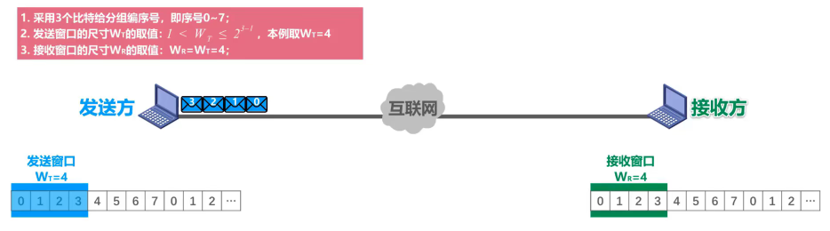

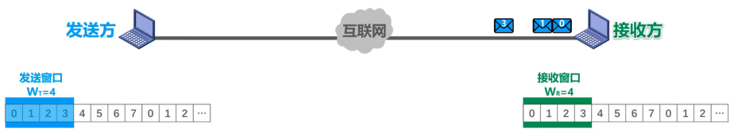

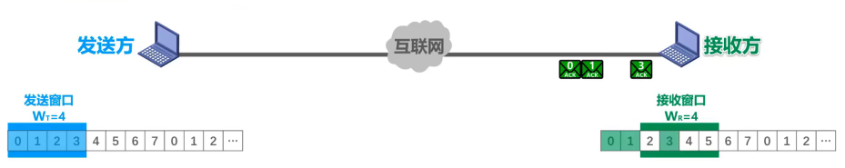


**习题**


**总结**

**如图即滑动窗口内不能有相同分组序号，接收方无法分辨新旧分组**


### 3.5、点对点协议PPP

* 点对点协议PPP（Point-to-Point Protocol）是目前使用最广泛的点对点数据链路层协议
* PPP协议是因特网工程任务组IEIF在1992年制定的。经过1993年和1994年的修订，现在的PPP协议已成为因特网的正式标准[RFC1661，RFC1662]
* 数据链路层使用的一种协议，它的特点是：简单；只检测差错，而不是纠正差错；不使用序号，也不进行流量控制；可同时支持多种网络层协议


* PPPoE（over Internet） 是为宽带上网的主机使用的链路层协议


#### 帧格式

必须规定特殊的字符作为帧定界符

#### 透明传输

 必须保证数据传输的透明性

实现透明传输的方法

* 面向字节的异步链路：字节填充法（插入“转义字符”）

* 面向比特的同步链路：比特填充法（插入“比特0”）


#### 差错检测

能够对接收端收到的帧进行检测，并立即丢弃有差错的帧。


#### 工作状态

* 当用户拨号接入 ISP 时，路由器的调制解调器对拨号做出确认，并建立一条物理连接。
* PC 机向路由器发送一系列的 LCP 分组（封装成多个 PPP 帧）。
* 这些分组及其响应选择一些 PPP 参数，并进行网络层配置，NCP 给新接入的 PC 机
* 分配一个临时的 IP 地址，使 PC 机成为因特网上的一个主机。
* 通信完毕时，NCP 释放网络层连接，收回原来分配出去的 IP 地址。接着，LCP 释放数据链路层连接。最后释放的是物理层的连接。


> 可见，PPP 协议已不是纯粹的数据链路层的协议，它还包含了物理层和网络层的内容。

------

### 3.6、媒体接入控制（介质访问控制）——广播信道

**媒体接入控制（介质访问控制）使用一对多的广播通信方式**

> **Medium Access Control**翻译成媒体接入控制，有些翻译成介质访问控制

**局域网的数据链路层**

* 局域网最主要的**特点**是：
  * 网络为一个单位所拥有；
  * 地理范围和站点数目均有限。 
* 局域网具有如下**主要优点**：
  * 具有广播功能，从一个站点可很方便地访问全网。局域网上的主机可共享连接在局域网上的各种硬件和软件资源。 
  * 便于系统的扩展和逐渐地演变，各设备的位置可灵活调整和改变。
  * 提高了系统的可靠性、可用性和残存性。

**数据链路层的两个子层**

为了使数据链路层能更好地适应多种局域网标准，IEEE 802 委员会就将局域网的数据链路层拆成**两个子层**：

1. **逻辑链路控制** LLC (Logical Link Control)子层；
2. **媒体接入控制** MAC (Medium Access Control)子层。

与接入到传输媒体有关的内容都放在 MAC子层，而 LLC 子层则与传输媒体无关。
**不管采用何种协议的局域网，对 LLC 子层来说都是透明的。**


#### 基本概念

为什么要媒体接入控制（介质访问控制）？

**共享信道带来的问题**

若多个设备在共享信道上同时发送数据，则会造成彼此干扰，导致发送失败。

> 随着技术的发展，交换技术的成熟和成本的降低，具有**更高性能的使用点对点链路和链路层交换机的交换式局域网在有线领域已完全取代了共享式局域网**，但由于无线信道的广播天性，无线局域网仍然使用的是共享媒体技术

#### 静态划分信道（物理层）

**信道复用**

**频分复用FDM (Frequency Division Multiplexing)**

* 将整个带宽分为多份，用户在分配到一定的频带后，在通信过程中自始至终都占用这个频带。

* **频分复用**的所有用户在同样的时间**占用不同的带宽资源**（请注意，这里的“带宽”是频率带宽而不是数据的发送速率）。


**时分复用TDM (Time Division Multiplexing)**

* **时分复用**则是将时间划分为一段段等长的**时分复用帧（TDM帧）**。每一个时分复用的用户在每一个 TDM 帧中占用固定序号的时隙。
* 每一个用户所占用的时隙是**周期性地出现**（其周期就是TDM帧的长度）的。
* TDM 信号也称为**等时** (isochronous) 信号。
* **时分复用的所有用户在不同的时间占用同样的频带宽度。**

**波分复用 WDM(Wavelength Division Multiplexing)**

> 波分复用就是光的频分复用，使用一根光纤来同时传输多个光载波信号
>
> 光信号传输一段距离后悔衰减，所以要用 掺铒光纤放大器 放大光信号

**码分复用 CDM  (Code Division Multiplexing)** 

> 码片序列正交可以区分叠加信号


#### 动态接入控制

受控接入

**受控接入在局域网中使用得较少，本书不再讨论**

**随机接入**

**重点**

##### 随机接入（CSMA/CD协议）

**总线局域网使用协议：CSMA/CD**，**不适用于无线链路**，用于早期总线型以太网和双绞线以太网。

###### 基本概念

**最初**的**以太网**是将许多计算机都连接到一根总线上。易于实现广播通信。当初认为这样的连接方法既简单又可靠，因为总线上没有有源器件。

> **以太网（Ethernet）**是一种计算机**局域网技术**。IEEE组织的IEEE 802.3标准制定了**以太网（Ethernet）**的技术标准
>
> 以太网采用无连接的工作方式，对发送的数据帧不进行编号，也不要求对方发回确认。目的站收到有差错帧就把它丢弃，其他什么也不做

###### 多址接入MA

表示许多主机以多点接入的方式连接在一根总线上。

###### 载波监听CS

是指每一个站在发送数据之前先要检测一下总线上是否有其他计算机在发送数据，如果有，则暂时不要发送数据，以免发生碰撞。

总线上并没有什么“载波”。因此， **“载波监听”就是用电子技术检测总线上有没有其他计算机发送的数据信号。**

###### 碰撞检测CD

* **“碰撞检测”**就是计算机**边发送数据边检测**信道上的信号电压大小。
* 当几个站同时在总线上发送数据时，总线上的信号电压摆动值将会增大（互相叠加）。
* 当一个站检测到的信号电压摆动值超过一定的门限值时，就认为总线上至少有两个站同时在发送数据，表明产生了碰撞。
* **所谓“碰撞”就是发生了冲突。因此“碰撞检测”也称为“冲突检测”。**
* 在发生碰撞时，总线上传输的信号产生了严重的失真，无法从中恢复出有用的信息来。
* **每一个正在发送数据的站，一旦发现总线上出现了碰撞，就要立即停止发送，免得继续浪费网络资源，然后等待一段随机时间后再次发送。**

> 为什么要进行碰撞检测？ 因为信号传播时延对载波监听产生了影响
>
> 
>
> A 需要单程传播时延的 2 倍的时间，才能检测到与 B 的发送产生了冲突

###### CSMA/CD 协议工作流程

###### CSMA/CD 协议工作——争用期（碰撞窗口）

###### CSMA/CD 协议工作——最小帧长

最小帧长=争用期（2x传播时延）x数据传输速率

###### CSMA/CD 协议工作——最大帧长

###### CSMA/CD 协议工作——截断二进制指数退避算法


###### CSMA/CD 协议工作——信道利用率


###### CSMA/CD 协议工作——帧发送和接收流程


###### CSMA/CD 协议的重要特性

* 使用 CSMA/CD 协议的以太网不能进行全双工通信而**只能进行双向交替通信（半双工通信）。**
* 每个站在发送数据之后的一小段时间内，存在着遭遇碰撞的可能性。 
* 这种**发送的不确定性**使整个以太网的平均通信量远小于以太网的最高数据率。 

> CSMA/CD协议曾经用于各种总线结构以太网和双绞线以太网的早期版本中。
>
> **现在的以太网基于交换机和全双工连接，不会有碰撞，因此没有必要使用CSMA/CD协议**

##### 随机接入（CSMA/CA协议）

**无线局域网(如802.11)使用的协议：CSMA/CA**（Collision Avoidance）碰撞避免

###### 为·什么无线局域网要使用CSMA/CA协议

###### 帧间间隔IFS（InterFrame Space）

###### CSMA/CA协议的工作原理

> **源站为什么在检测到信道空闲后还要再等待一段时间DIFS？**
>
> * 考虑到可能有其他的站有高优先级的帧要发送。若有，就要让高优先级帧先发送
>
> **目的站为什么正确接收数据帧后还要等待一段时间SIFS才能发送ACK帧？**
>
> * SIFS是最短的帧间间隔，用来**分隔**开属于一次对话的各帧，在这段时间内，一个站点应当能够从发送方式切换到接收方式

> **信道由忙转为空闲且经过DIFS时间后，还要退避一段随机时间才能使用信道？**
>
> 防止多个站点同时发送数据而产生碰撞

**使用退避算法的时机**

###### CSMA/CA协议的退避算法

**退避算法的示例**

###### CSMA/CA协议的信道预约和虚拟载波监听


> Request To Send/Clear To Send


**虚拟载波监听机制能减少隐蔽站带来的碰撞问题的示例**


> 小结


### 3.7、MAC地址、IP地址以及ARP协议

#### MAC地址

> * 使用点对点信道的数据链路层不需要使用地址
> * 使用广播信道的数据链路层必须使用地址来区分各主机


#### 广播信道的数据链路层必须使用地址（MAC）


> **MAC地址又称为硬件地址或物理地址**。请注意：不要被 “物理” 二字误导认为物理地址属于物理层范畴，物理地址属于数据链路层范畴

#### IEEE 802局域网的MAC地址格式

> **组织唯一标识符OUI**
>
> * 生产网络设备的厂商，需要向IEEE的注册管理机构申请一个或多个OUI
>
> **网络接口标识符**
>
> * 由获得OUI的厂商自行随意分配
>
> **EUI-48**
>
> * 48是这个MAC地址的位数

Extended Unique Identifiers（EUI）

全球单播地址如网卡蓝牙wifi、路由器接口等等

> 对于使用EUI-48空间的应用程序，IEEE的目标寿命为100年（直到2080年），但是鼓励采用EUI-64作为替代

**关于无效的 MAC 帧**

* 数据字段的长度与长度字段的值不一致；
* 帧的长度不是整数个字节；
* 用收到的帧检验序列 FCS 查出有差错；
* 数据字段的长度不在 46 ~ 1500 字节之间。
* 有效的 MAC 帧长度为 64 ~ 1518 字节之间。

> **对于检查出的无效** **MAC** **帧就简单地丢弃。以太网不负责重传丢弃的帧。** 

#### IEEE 802局域网的MAC地址发送顺序

#### 单播MAC地址举例

> 主机B给主机C发送**单播帧**，主机B首先要构建该**单播帧**，**在帧首部中的目的地址字段填入主机C的MAC地址**，源地址字段填入自己的MAC地址，再加上帧首部的其他字段、数据载荷以及帧尾部，就构成了该**单播帧**

> 主机B将该**单播帧**发送出去，主机A和C都会收到该**单播帧**
>
> 主机A的网卡发现该**单播帧**的目的MAC地址与自己的MAC地址不匹配，丢弃该帧
>
> 主机C的网卡发现该**单播帧**的目的MAC地址与自己的MAC地址匹配，接受该帧
>
> 并将该帧交给其上层处理

#### 广播MAC地址举例

> 假设主机B要发送一个**广播帧**，主机B首先要构建该**广播帧**，**在帧首部中的目的地址字段填入广播地址**，也就是十六进制的全F，源地址字段填入自己的MAC地址，再加上帧首部中的其他字段、数据载荷以及帧尾部，就构成了该**广播帧**

> 主机B讲该**广播帧**发送出去，主机A和C都会收到该**广播帧**，**发现该帧首部中的目的地址字段的内容是广播地址**，就知道该帧是**广播帧**，主机A和主机C都接受该帧，并将该帧交给上层处理

#### 多播MAC地址举例


> 假设主机A要发送**多播帧**给该**多播地址**。将该**多播地址**的左起第一个字节写成8个比特，第一个字节的最低比特位是1，这就表明该地址是**多播地址**。
>
> 快速判断地址是不是**多播地址**，就是上图所示箭头所指的第十六进制数不能整除2（1,3,5,7,9,B,D,F），则该地址是**多播地址**
>
> 假设主机B，C和D支持多播，各用户给自己的主机配置多播组列表**如下所示**


> 主机B属于两个多播组，主机C也属于两个多播组，而主机D不属于任何多播组


> 主机A首先要构建该**多播帧**，**在帧首部中的目的地址字段填入该多播地址**，源地址点填入自己的MAC地址，再加上帧首部中的其他字段、数据载荷以及帧尾部，就构成了该**多播帧**

> 主机A将该**多播帧**发送出去，主机B、C、D都会收到该**多播帧**
>
> **主机B和C发现该多播帧的目的MAC地址在自己的多播组列表中**，主机B和C都会接受该帧
>
> 主机D发现该**多播帧**的目的MAC地址不在自己得多播组列表中，则丢弃该**多播帧**

> 给主机配置多播组列表进行私有应用时，不得使用公有的标准多播地址

##### IP地址

IP地址属于网络层的范畴，不属于数据链路层的范畴

下面内容讲的是IP地址的使用，详细的IP地址内容在网络层中介绍

##### 基本概念

#### 从网络体系结构看IP地址与MAC地址


#### 数据包转发过程中IP地址与MAC地址的变化情况

图上各主机和路由器各接口的IP地址和MAC地址用简单的标识符来表示


> 如何从IP地址找出其对应的MAC地址？
>
> ARP协议

#### ARP协议

如何从IP地址找出其对应的MAC地址？

ARP（地址解析协议）（Address Resolution Protocol）

##### 流程


ARP高速缓存表

> 当主机B要给主机C发送数据包时，会首先在自己的ARP高速缓存表中查找主机C的IP地址所对应的MAC地址，但未找到，因此，主机B需要发送**ARP请求报文**，来获取主机C的MAC地址

> ARP请求报文有具体的格式，上图的只是简单描述
>
> ARP请求报文被封装在MAC帧中发送，目的地址为广播地址
>
> **主机B发送封装有ARP请求报文的广播帧**，总线上的其他主机都能收到该广播帧


> 收到ARP请求报文的主机A和主机C会把ARP请求报文交给上层的ARP进程
>
> 主机A发现所询问的IP地址不是自己的IP地址，因此不用理会
>
> 主机C的发现所询问的IP地址是自己的IP地址，需要进行相应


动态（ip地址和MAC地址不是一直绑定的）与静态的区别

**ARP协议只能在一段链路或一个网络上使用，而不能跨网络使用**


> ARP协议的使用是逐段链路进行的

##### 总结

> ARP表中的IP地址与MAC地址的对应关系记录，是**会定期自动删除的**，**因为IP地址与MAC地址的对应关系不是永久性的**

------

### 3.8、集线器与交换机的区别

#### 集线器-在物理层扩展以太网

##### 概念

> * 传统以太网最初是使用粗同轴电缆，后来演进到使用比较便宜的细同轴电缆，最后发展为使用更便宜和更灵活的双绞线。
> * 采用双绞线的以太网采用星形拓扑，在星形的中心则增加了一种可靠性非常高的设备，叫做**集线器** (hub)。
> * **集线器**是也可以看做多口中继器，每个端口都可以成为一个中继器，中继器是对减弱的信号进行放大和发送的设备
> * **集线器**的以太网在逻辑上仍是个总线网，需要使用CSMA/CD协议来协调各主机争用总线，只能工作在**半双工模式**，收发帧不能同时进行

##### 集线器HUB在物理层扩展以太网

**使用集线器扩展**：将多个以太网段连成更大的、多级星形结构的以太网

> * **优点**
>   1. 使原来属于不同碰撞域的以太网上的计算机能够进行跨碰撞域的通信。
>   2. 扩大了以太网覆盖的地理范围。
> * **缺点**
>   1. 碰撞域增大了，但总的吞吐量并未提高。
>   2. 如果不同的碰撞域使用不同的数据率，那么就不能用集线器将它们互连起来。 

**碰撞域**

* **碰撞域（collision domain）**又称为**冲突域**，是指网络中一个站点发出的帧会与其他站点发出的帧产生碰撞或冲突的那部分网络。
* 碰撞域越大，发生碰撞的概率越高。

#### 以太网交换机-在数据链路层扩展以太网

##### 概念

* 扩展以太网更常用的方法是在数据链路层进行。
* 早期使用**网桥**，现在使用**以太网交换机**。

> **网桥**
>
> * 网桥**工作在数据链路层**。
> * 它根据 MAC 帧的目的地址对收到的帧进行转发和过滤。
> * 当网桥收到一个帧时，并不是向所有的接口转发此帧，而是先检查此帧的目的MAC 地址，然后再确定将该帧转发到哪一个接口，或把它丢弃。 
>
> **交换机**
>
> * 1990 年问世的交换式集线器 (switching hub) 可明显地提高以太网的性能。
> * 交换式集线器常称为**以太网交换机** (switch) 或**第二层交换机** (L2 switch)，强调这种交换机工作在数据链路层。
> * 以太网交换机实质上就是一个**多接口的网桥**

##### **集线器HUB与交换机SWITCH区别**

> 使用**集线器**互连而成的共享总线式以太网上的某个主机，要给另一个主机发送单播帧，该单播帧会通过共享总线传输到**总线上的其他各个主机**
>
> 使用交换机互连而成的交换式以太网上的某个主机，要给另一个主机发送单播帧，该单播帧进入交换机后，交换机会将该单播帧转发给目的主机，**而不是网络中的其他各个主机**
>
> **这个例子的前提条件是忽略ARP过程，并假设交换机的帧交换表已经学习或配置好了**


> **以太网交换机的交换方式**
>
> * 存储转发方式
>   * 把整个数据帧**先缓存**后再进行处理。
> * 直通 (cut-through) 方式
>   * 接收数据帧的同时就**立即按数据帧的目的 MAC 地址决定该帧的转发接口**，因而提高了帧的转发速度。
>   * **缺点**是它不检查差错就直接将帧转发出去，因此有可能也将一些无效帧转发给其他的站。
>
> **这个例子的前提条件是忽略ARP过程，并假设交换机的帧交换表已经学习或配置好了**

**对比集线器和交换机**


> 多台主机同时给另一台主机发送单播帧
>
> 集线器以太网：会产生碰撞，遭遇碰撞的帧会传播到总线上的各主机
>
> 交换机以太网：会将它们缓存起来，然后逐个转发给目的主机，不会产生碰撞
>
> **这个例子的前提条件是忽略ARP过程，并假设交换机的帧交换表已经学习或配置好了**

**集线器扩展以太网和交换机扩展以太网区别**

**单播**

**广播**（都属于同一个广播域）


**多个单播**


广播域（broadcast domain）：指这样一部分网络，其中任何一台设备发出的广播通信都能被该部分网络中的所有其他设备所接收。

#### 总结


> 工作在数据链路层的以太网交换机，其性能远远超过工作在物理层的集线器，而且价格并不贵，这就使得集线器逐渐被市场淘汰

------

### 3.9、以太网交换机自学习和转发帧的流程

#### 概念

#### 自学习和转发帧的例子

交换机的帧交换表和主机ARP高速缓存表的功能类似

以下例子假设各主机知道网络中其他各主机的MAC地址（无需进行ARP）

**A -> B**

> 1. A 先向 B 发送一帧。该帧从接口 1 进入到交换机
> 2. 交换机收到帧后，先查找（图中左边）交换表。没有查到应从哪个接口转发这个帧给 B
> 3. 交换机把这个帧的源地址 A 和接口 1 写入（图中左边）交换表中（自学习）
> 4. 交换机向除接口 1 以外的所有的接口**广播（盲目防洪）**这个帧
> 5. 接口 4到接口 2，先查找（图中右边）交换表。没有查到应从哪个接口转发这个帧给 B
> 6. 交换机把这个帧的源地址 A 和接口 1 写入（图中右边）交换表中（自学习）
> 7. 除B主机之外与该帧的目的地址不相符，将丢弃该帧
> 8. 主机B发现是给自己的帧，接受该帧（**此时主机B的MAC地址没有自学习**）

**B -> A**

> 1. B 向 A 发送一帧。该帧从接口 3 进入到交换机
> 2. 交换机收到帧后，先查找（图中左边）交换表。发现（图中左边）交换表中的 MAC 地址有 A，表明要发送给A的帧应从接口1转发出去。于是就把这个帧传送到接口 1 转发给 A。
> 3. 主机 A 发现目的地址是它，就接受该帧
> 4. 交换机把这个帧的源地址 B 和接口 3 写入（图中左边）交换表中

**E -> A**

> 1. E 向 A发送一帧
> 2. 交换机收到帧后，先查找（图中右边）交换表。发现（图中右边）交换表中的 MAC 地址有 A，表明要发送给A的帧应从接口2转发出去。于是就把这个帧传送到接口 2 转发给 接口 4。
> 3. 交换机把这个帧的源地址 E 和接口 3 写入（图中右边）交换表中
> 4. 接口 4 到 左边的交换机，先查找（图中左边）交换表。发现（图中左边）交换表中的 MAC 地址有 A，表明要发送给A的帧应从接口1转发出去。于是就把这个帧传送到接口 1 转发给 A。
> 5. 交换机把这个帧的源地址 E 和接口 4 写入（图中左边）交换表中
> 6. 主机 A 发现目的地址是它，就接受该帧

**G -> A**


> 主机 A、主机 G、交换机 1的接口 1就共享同一条总线（相当于总线式网络，可以想象成用集线器连接了）
>
> 1. 主机 G 发送给 主机 A 一个帧
> 2. 主机 A 和 交换机接口 1都能接收到
> 3. 主机 A 的网卡收到后，根据帧的目的MAC地址A，就知道是发送给自己的帧，就接受该帧
> 4. 交换机 1收到该帧后，首先进行登记工作
> 5. 然后交换机 1对该帧进行转发，该帧的MAC地址是A，在（图中左边）交换表查找MAC 地址有 A
> 6. MAC 地址为 A的接口号是1，但是该帧正是从接口 1 进入交换机的，交换机不会再从该接口 1 将帧转发出去，因为这是没有必要，于是丢弃该帧

随着网络中各主机都发送了帧后，网络中的各交换机就可以学习到各主机的MAC地址，以及它们与自己各接口的对应关系

> 考虑到可能有时要在交换机的接口更换主机，或者主机要更换其网络适配器，这就需要更改交换表中的项目。为此，在交换表中每个项目都设有一定的**有效时间**。**过期的项目就自动被删除**。
>
> **以太网交换机的这种自学习方法使得以太网交换机能够即插即用，不必人工进行配置，因此非常方便。**

#### 总结

**交换机自学习和转发帧的步骤归纳**


------

### 3.10、以太网交换机的生成树协议STP

生成树协议，spanning-tree-protocol

#### 如何提高以太网的可靠性

#### 生成树协议STP


> * IEEE 802.1D 标准制定了一个**生成树协议 STP**  (Spanning Tree Protocol)。
> * 其**要点**是：**不改变**网络的实际拓扑，但在逻辑上则切断（阻塞）某些链路，使得从一台主机到所有其他主机的路径是**无环路的树状结构**，从而消除了兜圈子现象。


------

### 3.11、虚拟局域网VLAN

#### 为什么要虚拟局域网VLAN

**广播风暴**

**分割广播域的方法**


> 为了分割广播域，所以虚拟局域网VLAN技术应运而生

#### 概念


> * 利用以太网交换机可以很方便地实现虚拟局域网 VLAN (Virtual LAN)。
> * IEEE 802.1Q 对虚拟局域网 VLAN 的**定义**：
>   **虚拟局域网 VLAN** 是由一些局域网网段构成的**与物理位置无关的逻辑组**，而这些网段具有某些共同的需求。每一个 VLAN 的帧都有一个明确的标识符，指明发送这个帧的计算机是属于哪一个 VLAN。
> * 同一个VLAN内部可以广播通信，不同VLAN不可以广播通信
> * **虚拟局域网其实只是局域网给用户提供的一种服务，而并不是一种新型局域网。**
> * 由于虚拟局域网是用户和网络资源的逻辑组合，因此可按照需要将有关设备和资源非常方便地重新组合，使用户从不同的服务器或数据库中存取所需的资源。

#### 虚拟局域网VLAN的实现机制

虚拟局域网VLAN技术是在交换机上实现的，需要交换机能够实现以下功能

* 能够处理带有VLAN标记的帧——IEEE 802.1 Q帧
* 交换机的各端口可以支持不同的端口类型，不同端口类型的端口对帧的处理方式有所不同

**Access端口**

交换机与用户计算机之间的互连

> 同一个VLAN内部可以广播通信，不同VLAN不可以广播通信

**Truck端口**

交换机之间或交换机与路由器之间的互连

**小例题**


**华为交换机私有的Hybrid端口类型**


#### 总结


> **虚拟局域网优点**
>
> 虚拟局域网（VLAN）技术具有以下主要优点：
>
> 1. 改善了性能
> 2. 简化了管理
> 3. 降低了成本
> 4. 改善了安全性 

## 第四章 网络层

### 4.1、网络层概述

#### 简介

* 网络层的主要任务是**实现网络互连**，进而**实现数据包在各网络之间的传输**


> 这些异构型网络N1~N7如果只是需要各自内部通信，他们只要实现各自的物理层和数据链路层即可
>
> 但是如果要将这些异构型网络互连起来，形成一个更大的互联网，就需要实现网络层设备路由器
>
> 有时为了简单起见，可以不用画出这些网络，图中N1~N7，而将他们看做是一条链路即可

* 要实现网络层任务，需要解决一下主要问题：

  * 网络层向运输层提供怎样的服务（“可靠传输”还是“不可靠传输”）

    在数据链路层那课讲过的可靠传输，详情可以看那边的笔记：网络层对以下的**分组丢失**、**分组失序**、**分组重复**的传输错误采取措施，使得接收方能正确接受发送方发送的数据，就是**可靠传输**，反之，如果什么措施也不采取，则是**不可靠传输**

  * 网络层寻址问题

  

  * 路由选择问题

  

  > 路由器收到数据后，是依据什么来决定将数据包从自己的哪个接口转发出去？
  >
  > **依据数据包的目的地址和路由器中的路由表**
  >
  > 
  >
  > 但在实际当中，路由器是怎样知道这些路由记录？
  >
  > * 由用户或网络管理员进行**人工配置**，这种方法只适用于规模较小且网络拓扑不改变的小型互联网
  > * **另一种是实现各种路由选择协议，由路由器执行路由选择协议中所规定的路由选择算法，而自动得出路由表中的路有记录，这种方法更适合规模较大且网络拓扑经常改变的大型互联网**


> 补充 **网络层（网际层）**除了 **IP协议Internet Protocol**外，还有之前介绍过的**地址解析协议ARP**，还有**网际控制报文协议ICMP**，**网际组管理协议IGMP**

#### 总结


------

### 4.2、网络层提供的两种服务

* 在计算机网络领域，网络层应该向运输层提供怎样的服务（“**面向连接**”还是“**无连接**”）曾引起了长期的争论。
* 争论焦点的实质就是：**在计算机通信中，可靠交付应当由谁来负责**？是**网络**还是**端系统**？ 

#### 面向连接的虚电路服务

**一种观点：让网络负责可靠交付**

* 这种观点认为，应借助于电信网的成功经验，让网络负责可靠交付，计算机网络应模仿电信网络，使用**面向连接**的通信方式。
* 通信之前先建立**虚电路** (Virtual Circuit)，以保证双方通信所需的一切网络资源。 
* 如果再使用可靠传输的网络协议，就可使所发送的分组无差错按序到达终点，不丢失、不重复。


**发送方** 发送给 **接收方** 的所有分组都沿着同一条虚电路传送

> * 虚电路表示这只是一条逻辑上的连接，分组都沿着这条逻辑连接按照存储转发方式传送，而并不是真正建立了一条物理连接。
> * 请注意，电路交换的电话通信是先建立了一条真正的连接。
> * 因此分组交换的虚连接和电路交换的连接只是类似，但并不完全一样

#### 无连接的数据报服务

**另一种观点：网络提供数据报服务**

* 互联网的先驱者提出了一种崭新的网络设计思路。
* 网络层向上只提供简单灵活的、**无连接的**、**尽最大努力交付**的**数据报服务**。
* 网络在发送分组时不需要先建立连接。每一个分组（即 IP 数据报）独立发送，与其前后的分组无关（不进行编号）。
* **网络层不提供服务质量的承诺**。即所传送的分组**可能出错、丢失、重复和失序**（不按序到达终点），当然也**不保证分组传送的时限**。 

**发送方** 发送给 **接收方** 的分组可能沿着不同路径传送

> **尽最大努力交付**
>
> * 如果主机（即端系统）中的进程之间的通信需要是可靠的，那么就由网络的**主机中的运输层负责可靠交付（包括差错处理、流量控制等）** 。
> * **采用这种设计思路的好处是**：网络的造价大大降低，运行方式灵活，能够适应多种应用。
> * 互连网能够发展到今日的规模，充分证明了当初采用这种设计思路的正确性。

#### 虚电路服务与数据报服务的对比

| **对比的方面**                 | **虚电路服务**                                     | **数据报服务**                                         |
| ------------------------------ | -------------------------------------------------- | ------------------------------------------------------ |
| **思路**                       | **可靠通信应当由网络来保证**                       | **可靠通信应当由用户主机来保证**                       |
| **连接的建立**                 | **必须有**                                         | **不需要**                                             |
| **终点地址**                   | **仅在连接建立阶段使用，每个分组使用短的虚电路号** | **每个分组都有终点的完整地址**                         |
| **分组的转发**                 | **属于同一条虚电路的分组均按照同一路由进行转发**   | **每个分组独立选择路由进行转发**                       |
| **当结点出故障时**             | **所有通过出故障的结点的虚电路均不能工作**         | **出故障的结点可能会丢失分组，一些路由可能会发生变化** |
| **分组的顺序**                 | **总是按发送顺序到达终点**                         | **到达终点时不一定按发送顺序**                         |
| **端到端的差错处理和流量控制** | **可以由网络负责，也可以由用户主机负责**           | **由用户主机负责**                                     |

------

### 4.3、IPv4

#### 概述


#### 分类编制的IPv4地址

##### 简介


* 每一类地址都由两个固定长度的字段组成，其中一个字段是**网络号 net-id**，它标志**主机（或路由器接口）**所连接到的网络，而另一个字段则是**主机号 host-id**，它标志该主机（或路由器接口）。
* 主机号在它前面的网络号所指明的网络范围内必须是唯一的。
* 由此可见，**一个 IP 地址在整个互联网范围内是唯一的**。
* 0.0.0.0 本网络的本主机

**A类地址**（注意网络号127为本地环回测试地址）


**B类地址**


**C类地址**


**练习**


##### 总结

**IP 地址的指派范围**


**一般不使用的特殊的 IP 地址**


**IP 地址的一些重要特点**

(1) **IP 地址是一种分等级的地址结构**。分两个等级的好处是：

* **第一**，IP 地址管理机构在分配 IP 地址时只分配网络号，而剩下的主机号则由得到该网络号的单位自行分配。这样就方便了 IP 地址的管理。
* **第二**，路由器仅根据目的主机所连接的网络号来转发分组（而不考虑目的主机号），这样就可以使路由表中的项目数大幅度减少，从而减小了路由表所占的存储空间。 

(2) **实际上 IP 地址是标志一个主机（或路由器）和一条链路的接口**。

* 当一个主机同时连接到两个网络上时，该主机就必须同时具有两个相应的 IP 地址，其网络号 net-id 必须是不同的。这种主机称为**多归属主机** (multihomed host)。
* 由于一个路由器至少应当连接到两个网络（这样它才能将 IP 数据报从一个网络转发到另一个网络），因此**一个路由器至少应当有两个不同的 IP 地址**。 

(3) **用转发器或网桥连接起来的若干个局域网仍为一个网络**，因此这些局域网都具有同样的网络号 net-id。

(4) **所有分配到网络号 net-id 的网络，无论是范围很小的局域网，还是可能覆盖很大地理范围的广域网，都是平等的。**

#### 划分子网的IPv4地址

##### 为什么要划分子网

在 ARPANET 的早期，IP 地址的设计确实不够合理：

* IP 地址空间的利用率有时很低。 
* 给每一个物理网络分配一个网络号会使路由表变得太大因而使网络性能变坏。 
* 两级的 IP 地址不够灵活。 


如果想要将原来的网络划分成三个独立的网路


所以是否可以**从主机号部分借用一部分作为子网号**


> 但是如果未在图中标记子网号部分，那么我们和计算机又如何知道分类地址中主机号有多少比特被用作子网号了呢？
>
> 所以就有了划分子网的工具：**子网掩码**
>
> * 从 1985 年起在 IP 地址中又增加了一个“**子网号字段**”，使两级的 IP 地址变成为**三级的 IP 地址**。
> * 这种做法叫做**划分子网** (subnetting) 。
> * 划分子网已成为互联网的正式标准协议。 

##### 如何划分子网

基本思路

* 划分子网纯属一个**单位内部的事情**。单位对外仍然表现为没有划分子网的网络。
* 从主机号**借用**若干个位作为**子网号** subnet-id，而主机号 host-id 也就相应减少了若干个位。


* 凡是从其他网络发送给本单位某个主机的 IP 数据报，仍然是根据 IP 数据报的**目的网络号** net-id，先找到连接在本单位网络上的路由器。
* 然后**此路由器**在收到 IP 数据报后，再按**目的网络号** net-id 和**子网号** subnet-id 找到目的子网。
* 最后就将 IP 数据报直接交付目的主机。

划分为三个子网后对外仍是一个网络


> * **优点**
>   1. 减少了 IP 地址的浪费
>   2. 使网络的组织更加灵活
>   3. 更便于维护和管理
> * **划分子网纯属一个单位内部的事情，对外部网络透明**，对外仍然表现为没有划分子网的一个网络。

##### 子网掩码


> **(IP 地址) AND (子网掩码) = 网络地址** 重要，下面很多相关知识都会用到

举例

例子1


例子2


**默认子网掩码**


##### 总结


> * **子网掩码**是一个网络或一个子网的重要属性。
> * 路由器在和相邻路由器交换路由信息时，必须把自己所在网络（或子网）的子网掩码告诉相邻路由器。
> * 路由器的路由表中的每一个项目，除了要给出目的网络地址外，还必须同时给出该网络的子网掩码。
> * **若一个路由器连接在两个子网上，就拥有两个网络地址和两个子网掩码**。

#### 无分类编址的IPv4地址

##### 为什么使用无分类编址

**无分类域间路由选择 CIDR** (Classless Inter-Domain Routing)。音译sider 


> **CIDR 最主要的特点**
>
> * CIDR使用各种长度的“**网络前缀**”(network-prefix)来代替分类地址中的网络号和子网号。
> * **IP 地址从三级编址（使用子网掩码）又回到了两级编址**。 

##### 如何使用无分类编址


举例


##### 路由聚合（构造超网）

找共同前缀再记为无分类编址


##### 总结


#### IPv4地址的应用规划

给定一个IPv4地址快，如何将其划分成几个更小的地址块，并将这些地址块分配给互联网中不同网络，进而可以给各网络中的主机和路由器接口分配IPv4地址

##### 定长的子网掩码FLSM（Fixed Length Subnet Mask）


**划分子网的IPv4就是定长的子网掩码**

举例


> 通过上面步骤分析，就可以从子网1~8中任选5个分配给左图中的N1~N5
>
> **采用定长的子网掩码划分，只能划分出2^n个子网，其中n是从主机号部分借用的用来作为子网号的比特数量，每个子网所分配的IP地址数量相同**
>
> **但是也因为每个子网所分配的IP地址数量相同，不够灵活，容易造成IP地址的浪费**

##### 变长的子网掩码VLSM（Variable Length Subnet Mask）


> **无分类编址的IPv4就是变长的子网掩码**

举例

分配的原则是每个子块只能选取大小整数倍的地址作为起点，先给大的子块分配。

**同时可以看出，不同的网络的子网掩码可以一样**


------

### 4.4、IP数据报的发送和转发过程


举例


源主机如何知道目的主机是否与自己在同一个网络中，是直接交付，还是间接交付？


> 可以通过**目的地址IP**和**源地址的子网掩码**进行**逻辑与运算**得到**目的网络地址**
>
> * 如果**目的网络地址**和**源网络地址** **相同**，就是**在同一个网络**中，属于**直接交付**
> * 如果**目的网络地址**和**源网络地址** **不相同**，就**不在同一个网络**中，属于**间接交付**，传输给主机所在网络的**默认网关**（路由器——下图会讲解）,由默认网关帮忙转发

主机C如何知道路由器R的存在？

> 用户为了让本网络中的主机能和其他网络中的主机进行通信，就必须给其指定本网络的一个路由器的接口，由该路由器帮忙进行转发，**所指定的路由器**，也被称为**默认网关**
>
> 例如。路由器的接口0的IP地址192.168.0.128做为左边网络的默认网关


> 主机A会将该IP数据报传输给自己的默认网关，也就是图中所示的路由器接口0

路由器收到IP数据报后如何转发？

* 检查IP数据报首部是否出错：
  * 若出错，则直接丢弃该IP数据报并通告源主机
  * 若没有出错，则进行转发
* 根据IP数据报的目的地址在路由表中查找匹配的条目：
  * 若找到匹配的条目，则转发给条目中指示的下一跳
  * 若找不到，则丢弃该数据报并通告源主机

假设IP数据报首部没有出错，路由器取出IP数据报首部各地址字段的值

接下来路由器对该IP数据报进行查表转发

> 逐条检查路由条目，将目的地址与路由条目中的地址掩码进行逻辑与运算得到目的网络地址，然后与路由条目中的目的网络进行比较，如果相同，则这条路由条目就是匹配的路由条目，按照它的下一条指示，图中所示的也就是接口1转发该IP数据报

**路由器是隔离广播域的**

------

### 4.5、静态路由配置及其可能产生的路由环路问题

#### 概念


#### 多种情况举例

 **静态路由配置**

举例

**默认路由**

举例

默认路由可以被所有网络匹配，但路由匹配有优先级，默认路由是优先级最低的


**特定主机路由**

举例

有时候，我们可以给路由器添加针对某个主机的特定主机路由条目（**把该主机看成一个网络**）

一般用于网络管理人员对网络的管理和测试


> 多条路由可选，匹配路由最具体的

**静态路由配置错误导致路由环路**

举例


假设将R2的路由表中第三条目录配置错了下一跳

这导致R2和R3之间产生了路由环路


解决方法

在IP数据报首部设置生存时间TTL字段，限制转发次数

**聚合了不存在的网络而导致路由环路**

举例

正常情况

错误情况

解决方法


> 黑洞路由的下一跳为null0，这是路由器内部的虚拟接口，IP数据报进入它后就被丢弃（最长前缀匹配）

**网络故障而导致路由环路**

举例

解决方法

添加故障的网络为黑洞路由

假设。一段时间后故障网络恢复了

R1又自动地得出了其接口0的直连网络的路由条目

针对该网络的黑洞网络会自动失效

如果又故障

则生效该网络的黑洞网络

#### 总结


------

### 4.6、路由选择协议

#### 概述


**因特网所采用的路由选择协议的主要特点**


**因特网采用分层次的路由选择协议**

* **自治系统 AS**：在单一的技术管理下的一组路由器，而这些路由器使用一种 AS 内部的路由选择协议和共同的度量以确定分组在该 AS 内的路由，同时还使用一种 AS 之间的路由选择协议用以确定分组在 AS之间的路由。


> 自治系统之间的路由选择简称为**域间路由选择**，自治系统内部的路由选择简称为**域内路由选择**


> 域间路由选择使用外部网关协议EGP这个类别的路由选择协议
>
> 域内路由选择使用内部网关协议IGP这个类别的路由选择协议
>
> **网关协议**的名称可称为**路由协议**

**常见的路由选择协议**

**路由器的基本结构**

路由器是一种具有多个输入端口，和输出端口的专用计算机，其任务是转发分组


路由器结构可划分为两大部分：

1、**分组转发部分**

 由三部分构成

 * 交换结构

 * 一组输入端口：

   信号从某个输入端口进入路由器

   

   物理层将信号转换成比特流，送交数据链路层处理

   

   数据链路层识别从比特流中识别出帧，去掉帧头和帧尾后，送交网络层处理

   

     如果送交网络层的分组是普通待转发的数据分组

   

      则根据分组首部中的目的地址进行查表转发

   

   若找不到匹配的转发条目，则丢弃该分组，否则，按照匹配条目中所指示的端口进行转发

 * 一组输出端口

   网络层更新数据分组首部中某些字段的值，例如将数据分组的生存时间减1，然后送交数据链路层进行封装

   

   数据链路层将数据分组封装成帧，交给物理层处理

   

   物理层将帧看成比特流将其变换成相应的电信号进行发送

> 路由器的各端口还会有输入缓冲区和输出缓冲区
>
> * 输入缓冲区用来暂存新进入路由器但还来不及处理的分组
>
> * 输出缓冲区用来暂存已经处理完毕但还来不及发送的分组
>
> 
>
> **路由器的端口一般都具有输入和输出功能**，这些实例分出了输入端口和输出端口是更好演示路由基本工作过程

 2、**路由选择部分**

 * 路由选择部分的核心构件是路由选择处理机，它的任务是根据所使用的路由选择协议。周期性地与其他路由器 进行路由信息的交互，来更新路由表

   如果送交给输入端口的网络层的分组是路由器之间交换路由信息的路由报文，则把这种分组送交给路由选择处理机

   

   路由选择处理机根据分组的内容来更新自己的**路由表**

   

   路由选择处理机还会周期性地给其他路由器发送自己所知道的路由信息

   

#### 路由信息协议RIP


**RIP的基本工作过程**

举例

**RIP的路由条目的更新规则**

举例1


> 路由器C的表到达各目的网络的下一条都记为问号，可以理解为路由器D并不需要关心路由器C的这些内容
>
> 假设路由器C的RIP更新报文发送周期到了，则路由器C将自己路由表中的相关路由信息封装到RIP更新报文中发送给路由器D

> 路由器C能到达这些网络，说明路由器C的相邻路由器也能到达，只是比路由器C的距离大1，于是根据距离的对比，路由器D更新自己的路由表

举例2

**RIP存在“坏消息传播得慢”的问题**

RIP周期更新路由信息不及时


解决方法

> 但是，这些方法也**不能完全解决**“坏消息传播得慢”的问题，这是距离向量的本质决定

**总结**

> RIP 协议的优缺点
>
> 优点：
>
> 1. 实现简单，开销较小。
>
> 缺点：
>
> 1. RIP 限制了网络的规模，它能使用的最大距离为 15（16 表示不可达）。
>
> 2. 路由器之间交换的路由信息是路由器中的完整路由表，因而随着网络规模的扩大，开销也就增加。
>
> 3. “坏消息传播得慢”，使更新过程的收敛时间过长。

#### 开放最短路径优先OSPF

**开放最短路径优先 OSPF (Open Shortest Path First)**

**注意**：OSPF 只是一个协议的名字，它并不表示其他的路由选择协议不是“最短路径优先”。

**概念**


**问候（Hello）分组**

> IP数据报首部中协议号字段的取值应为89，来表明IP数据报的数据载荷为OSPF分组

**发送链路状态通告LSA**

> 洪泛法有点类似于广播，就是从一个接口进来，从其他剩余所有接口出去

**链路状态数据库同步**

**使用SPF算法计算出各自路由器到达其他路由器的最短路径**

**OSPF五种分组类型**

**OSPF的基本工作过程**


**OSPF在多点接入网络中路由器邻居关系建立**

如果不采用其他机制，将会产生大量的多播分组


> 若DR出现问题，则由BDR顶替DR

**为了使OSPF能够用于规模很大的网络，OSPF把一个自治系统再划分为若干个更小的范围，叫做区域（Area）**

* 在该自治系统内，所有路由器都使用OSPF协议，OSPF将该自治系统再划分成4个更小的区域

* 每个区域都有一个**32比特的区域标识符**

* 主干区域的区域标识符必须为0，主干区域用于连通其他区域

* 其他区域的区域标识符不能为0且不相同
* 每个区域一般不应包含路由器超过200个

* **划分区域的好处就是，利用洪泛法交换链路状态信息局限于每一个区域而不是自治系统，这样减少整个网络上的通信量**

**总结**


#### 边界网关协议BGP

BGP（Border Gateway Protocol） 是**不同自治系统的路由器之间**交换路由信息的协议


> 现在使用最多的边界网关协议为BGP-4

**总结**


#### 直接封装RIP、OSPF和BGP报文的协议


------

### 4.7、IPv4数据报的首部格式

#### 各字段的作用

* 一个 IP 数据报由**首部**和**数据**两部分组成。
* **首部的前一部分是固定长度，共 20 字节，是所有 IP 数据报必须具有的。**
* 在首部的固定部分的后面是一些可选字段，其长度是可变的。


图中的每一行都由32个比特（也就是4个字节）构成，每个小格子称为字段或者域，每个字段或某些字段的组合用来表达IP协议的相关功能


> **IP数据报的首部长度一定是4字节的整数倍**
>
> 因为首部中的可选字段的长度从1个字节到40个字节不等，那么，当20字节的固定部分加上1到40个字节长度不等的可变部分，**会造成首部长度不是4字节整数倍时，就用取值为全0的填充字段填充相应个字节**，以确保IP数据报的首部长度是4字节的整数倍


**对IPv4数据报进行分片**

> 片偏移量为起始字节标号除以8，必须为整数，所以当后分片除不尽时，减小起始字节标号


​        现在假定分片2的IP数据报经过某个网络时还需要进行分片


#### 总结


------

### 4.8、网际控制报文协议ICMP

#### 概念

架构IP网络时需要特别注意两点：

* 确认网络是否正常工作
* 遇到异常时进行问题诊断

**而ICMP(Internet Control Message Protocol)就是实现这些问题的协议**

ICMP的主要功能包括：

* 确认IP包是否成功送达目标地址
* 通知在发送过程当中IP包被废弃的具体原因
* 改善网络设置等

**有了这些功能以后，就可以获得网络是否正常，设置是否有误以及设备有何异常等信息，从而便于进行网络上的问题诊断**


**ICMP 不是高层协议（看起来好像是高层协议，因为 ICMP 报文是装在 IP 数据报中，作为其中的数据部分），而是 IP 层的协议**

ICMP 报文的格式


#### ICMP差错报告报文

##### 终点不可达


##### 源点抑制


##### 时间超过


##### 参数问题


##### 改变路由（重定向）


##### 不应发送ICMP差错报告报文情况


#### ICMP应用举例

##### 分组网间探测PING（Packet InterNet Groper）


##### 跟踪路由（traceroute）


**tracert命令的实现原理**

H1不断地给H2发送TTL递增的回送请求报文，就可以获取途中的所有路由器


##### 总结


------

### 4.9、虚拟专用网VPN与网络地址转换NAT

#### 虚拟专用网VPN（Virtual Private Network）

* 由于 **IP 地址的紧缺**，一个机构能够申请到的IP地址数往往远小于本机构所拥有的主机数。
* 考虑到**互联网并不很安全**，一个机构内也并不需要把所有的主机接入到外部的互联网。
* 假定在一个机构内部的计算机通信也是采用 TCP/IP 协议，那么从原则上讲，对于这些仅在**机构内部使用**的计算机就可以由本机构**自行分配其 IP 地址**。


> 上图是因特网数字分配机构IANA官网查看IPv4地址空间中特殊地址的分配方案
>
> 用粉红色标出来的地址就是无需申请的、可自由分配的专用地址，或称私有地址


> 私有地址只能用于一个机构的内部通信，而不能用于和因特网上的主机通信
>
> **私有地址只能用作本地地址**而不能用作全球地址
>
> 因特网中所有**路由器对目的地址是私有地址的IP数据报一律不进行转发**
>
> **本地地址与全球地址**
>
> * **本地地址**——仅在机构内部使用的 IP 地址，可以由本机构自行分配，而不需要向互联网的管理机构申请。
> * **全球地址**——全球唯一的 IP 地址，必须向互联网的管理机构申请。 
> * **问题**：在内部使用的本地地址就有可能和互联网中某个 IP 地址重合，这样就会出现地址的二义性问题。

所以部门A和部门B**至少需要一个 路由器具有合法的全球IP地址**，这样各自的专用网才能利用公用的因特网进行通信

部门A向部门B发送数据流程

> 两个专用网内的主机间发送的数据报是通过了公用的因特网，但在效果上就好像是在本机构的专用网上传送一样
>
> 数据报在因特网中可能要经过多个网络和路由器，但从逻辑上看，R1和R2之间好像是一条直通的点对点链路
>
> 
>
> 因此也被称为IP隧道技术

#### 网络地址转换NAT（Network Address Translation）


举例


> 使用私有地址的主机，如何才能与因特网上使用全球IP地址的主机进行通信？
>
> 这需要在专用网络连接到因特网的路由器上安装NAT软件（**给路由器接口分配临时的全球IP地址**）

> 专有NAT软件的路由器叫做NAT路由器
>
> 它至少有一个有效的外部全球IP地址
>
> 这样，所有使用私有地址的主机在和外界通信时，都要在NAT路由器上将其私有地址转换为全球IP地址

假设，使用私有地址的主机要给因特网上使用全球IP地址的另一台主机发送IP数据报

因特网上的这台主机给源主机发回数据报

当专用网中的这两台使用私有地址的主机都要给因特网使用全球地址的另一台主机发送数据报时，在NAT路由器的NAT转换表中就会产生两条记录，分别记录两个私有地址与全球地址的对应关系

这种基本转换存在一个问题

解决方法


> 我们现在用的很多家用路由器都是这种NART路由器

内网主机与外网主机的通信，是否能由外网主机首先发起？

否定

#### 总结


## 第五章 运输层

### 5.1、运输层概述

#### 概念

**进程之间的通信**


* 从通信和信息处理的角度看，运输层向它上面的应用层提供通信服务，**它属于面向通信部分的最高层，同时也是用户功能中的最低层**。
* 当网络的边缘部分中的两个主机使用网络的核心部分的功能进行端到端的通信时，**只有位于网络边缘部分的主机的协议栈才有运输层**，而网络核心部分中的路由器在转发分组时都只用到三层（到网络层）的功能。 


**进程之间通信流程**


“逻辑通信”是指运输层之间的通信好像是沿水平方向传送数据，但事实上，这两条数据并没有一条水平方向的物理连接，要传送的数据是沿着图中上下多次的虚线方向传送的

> 进程Ap1与Ap4之间进行基于网络的通信，进程Ap2与Ap3之间进行基于网络的通信
>
> 在运输层使用不同的端口，来对应不同的应用进程
>
> 然后通过网络层及其下层来传输应用层报文
>
> 接收方的运输层通过不同的端口，将收到的应用层报文，交付给应用层中相应的应用进程
>
> 这里端口并不是指看得见、摸得着的物理端口，而是指用来区分不同应用进程的标识符


#### 总结


------

### 5.2、运输层端口号、复用与分用的概念

#### 为什么用端口号


#### 发送方的复用和接收方的分用

> **多个进程（这里一个端口表示一个进程）** 利用一个运输层协议（或者称为运输层接口）**发送**数据称为 **复用**
>
> **多个进程（这里一个端口表示一个进程）** 利用一个运输层协议（或者称为运输层接口）**接收**时叫做  **分用**。

#### TCP/IP体系的应用层常用协议所使用的运输层熟知端口号


#### 运输层传输流程

DNS（Domain Name Server，域名服务器）是**进行域名 (domain name)和与之相对应的IP地址 (IP address)转换的服务器**。

举例


> 在浏览器输入域名，回车浏览
>
> 然后用户PC中的DNS客户端进程会发送一个DNS查询请求报文
>
> DNS查询请求报文需要使用运输层的UDP协议
>
> 首部中的源端口字段的值，在短暂端口号49151~65535中挑选一个未被占用的，用来表示DNS客户端进程
>
> 首部中的目的端口字段的值：53，是DNS服务器端进程所使用的熟知端口号


> 之后，将UDP用户数据报封装在IP数据报中，通过以太网发送给DNS服务器


> DNS服务器收到该IP数据报后，从中解封出UDP用户数据报
>
> UDP首部中的目的端口号为53，这表明应将该UDP用户数据报的数据载荷部分，也就是DNS查询请求报文，交付给本服务器中的DNS服务器端进程
>
> DNS服务器端进程解析DNS查询请求报文的内容，然后按其要求查找对应的IP地址
>
> 之后，会给用户PC发送DNS响应报文，DNS响应报文需要使用运输层的UDP协议封装成UDP用户数据报
>
> 其首部中的源端口字段的值设置为熟知端口号53，表明这是DNS服务器端进程所发送的UDP用户数据报，目的端口的值设置为49152，这是之前用户PC中发送DNS查询请求报文的DNS客户端进程所使用的短暂端口号


> 将UDP用户数据报封装在IP数据报中，通过以太网发送给用户PC


> 用户PC收到该数据报后，从中解封出UDP用户数据报
>
> UDP首部中的目的端口号为49152，这表明应将该UDP用户数据报的数据载荷部分，也就是DNS响应报文，交付给用户PC中的DNS客户端进程
>
> DNS客户端进程解析DNS响应报文的内容，就可知道自己之前所请求的Web服务器的域名对应的IP地址

现在用户PC中的HTTP客户端进程可以向Web服务器发送HTTP请求报文（和DNS发送和接收流程差不多）


------

### 5.3、UDP和TCP的对比

#### 概念

* **UDP** 和 **TCP** 是TCP/IP体系结构**运输层**中的两个重要协议
* **传输控制协议（TCP，Transmission Control Protocol）**
* **用户数据报协议**(UDP，User Datagram Protocol)
* 当运输层采用面向连接的 **TCP** 协议时，尽管下面的网络是不可靠的（只提供尽最大努力服务），但这种逻辑通信信道就相当于一条**全双工的可靠信道**。
* 当运输层采用无连接的 **UDP** 协议时，这种逻辑通信信道是一条**不可靠信道**。 

可靠信道与不可靠信道


* 两个对等运输实体在通信时传送的数据单位叫作**运输协议数据单元** TPDU (Transport Protocol Data Unit)。
* TCP 传送的数据单位协议是 **TCP 报文段**(segment)。

* UDP 传送的数据单位协议是 **UDP 报文**或**用户数据报**。

UDP的通信是无连接的，不需要套接字（Socket）

TCP是面向连接的，**TCP之间的通信必须要在两个套接字（Socket）之间**建立连接

#### 用户数据报协议UDP（User Datagram Protocol）

可以发送广播


可以向某个多播组发送多播

还可以发送单播

> UDP 支持单播、多播以及广播
>
> 换句话说，UDP支持一对一，一对多，以及一对全的通信

运输过程

> UDP对应用进程交下来的报文既不合并也不拆分，而是保留这些报文的边界
>
> 换句话说，UDP是面向应用报文的

UDP向上层提供无连接不可靠传输服务

UDP结构

#### 传输控制协议TCP（Transmission Control Protocol）

使用TCP协议的通信双方，在进行数据传输之前，必须使用“三报文握手”建立TCP连接

TCP连接建立成功后，通信双方之间就好像有一条可靠的通信信道，通信双方使用这条基于TCP连接的可靠信道进行通信

> 很显然，TCP仅支持单播，也就是一对一的通信

运输过程

> 发送方
>
> * TCP会把应用进程交付下来的数据块看作是一连串无结构的字节流，TCP并不知道这些待传送的字节流的含义
>
> * 并将他们编号，并存储在自己发送缓存中
>
> * TCP会根据发送策略，提取一定量的字节构建TCP报文并发送
>
> 接收方
>
> * 一方面从所接受到的TCP报文段中，取出数据载荷部分并存储在接收缓存中；一方面将接收缓存中的一些字节交付给应用进程
> * TCP不保证接收方应用进程所收到的数据块与发送方发送的数据块，具有对应大小的关系（例如，发送方应用进程交给发送方的TCP共10个数据块，但接收方的TCP可能只用了4个数据块，就把收到的字节流交付给了上层的应用进程，但接收方收到的字节流必须和发送方应用进程发出的字节流完全一样）
> * 接收方的应用进程必须有能力识别收到的字节流，把它还原成有意义的应用层数据
>
> TCP是面向字节流的，这正是TCP实现可靠传输、流量控制、以及拥塞控制的基础
>
> 本图只画了一个方向的数据流，在实际网络中，基于TCP连接的两端，可以同时进行TCP报文段的发送和接收

TCP向上层提供面向连接的可靠传输服务

TCP结构

#### 总结


------

### 5.4、TCP的流量控制

#### 概念


举例

[具体流程的视频](https://www.bilibili.com/video/BV1c4411d7jb?p=60)


上图主机A现在可将发送缓存中序号1~200的字节数据全部删除，因为已经收到了主机B对它们的累计确认


上图主机A现在可将发送缓存中序号201~500的字节数据全部删除，因为已经收到了主机B对它们的累计确认


上图主机A现在可将发送缓存中序号501~600的字节数据全部删除，因为已经收到了主机B对它们的累计确认


> 发送窗口被调控为0后，启动持续计时器，当计时器超时，发送零窗口探测报文
>
> 上图如果零窗口探测报文在发送过程中如果丢失，还是能打破死锁局面
>
> 因为零窗口探测报文段也有重传计时器，重传计时器超时后，零窗口探测报文段会被重传
>
> **接受窗口为0也必须接受零窗口探测报文段、确认报文段和携带有紧急数据的报文段**。

#### 总结


------

### 5.5、TCP的拥塞控制

#### 概念


**网络拥塞往往是由许多因素引起的。例如：**

1. 点缓存的容量太小；
2. 链路的容量不足；
3. 处理机处理的速率太慢；
4. 拥塞本身会进一步加剧拥塞；

**拥塞控制的一般原理**

* 拥塞控制的前提：网络能够承受现有的网络负荷。
* 实践证明，拥塞控制是很难设计的，因为它是一个**动态问题**。
* 分组的丢失是网络发生拥塞的**征兆**而不是原因。
* 在许多情况下，甚至正是**拥塞控制本身**成为引起网络性能恶化、甚至发生死锁的原因。

**开环控制和闭环控制**


**监测网络的拥塞**

主要指标有：

1. 由于缺少缓存空间而被丢弃的分组的百分数；
2. 平均队列长度；
3. 超时重传的分组数；
4. 平均分组时延；
5. 分组时延的标准差，等等。

上述这些指标的上升都标志着拥塞的增长。

#### 拥塞控制的算法


> 真正的发送窗口值 = Min (接收方窗口值[流量控制]，拥塞窗口值)

下图的实例横纵坐标的意思

传输轮次：

* 发送方给接收方发送数据报文段后，接收方给发送方发发回相应的确认报文段
* 一个传输轮次所经历的时间其实就是往返时间，往返时间并非是恒定的数值
* 使用传输轮次是为了强调把拥塞窗口所允许发送的报文段都连续发送出去，并受到了对已发送的最后一个报文段的确认

拥塞窗口：

* 它会随网络拥塞程度，以及所使用的拥塞控制算法动态变化

##### 慢开始和拥塞避免

###### 慢开始（slow-start）

* 目的：用来确定网络的负载能力或拥塞程度。
* 算法的思路：由小到大逐渐增大拥塞窗口数值。
* 两个变量：
  * **拥塞窗口（cwnd）**（congestion window）：初始拥塞窗口值：2 种设置方法。窗口值逐渐增大。
    * 1 至 2 个最大报文段 （旧标准）
    * 2 至 4 个最大报文段 （RFC 5681）
  * **慢开始门限（ssthresh）**：防止拥塞窗口增长过大引起网络拥塞。

> 图中swnd是发送窗口
>
> 每经过一个传输轮次，拥塞窗口就加倍
>
> 拥塞窗口大小按**指数增加**，2的n-1次方

###### 拥塞避免（congestion avoidance）

* 思路：让拥塞窗口 cwnd **缓慢地增大**，避免出现拥塞。
* 每经过一个传输轮次，拥塞窗口 **cwnd = cwnd + 1**。
* 使拥塞窗口 cwnd 按线性规律缓慢增长。
* 在拥塞避免阶段，具有 “**加法增大**” (Additive Increase) 的特点。


如果在发送过程中出现部分报文段丢失，这必然会造成发送方对这些丢失报文段的超时重传

这个时候又回到了慢开始


##### 两个算法完整示意图


##### 快重传和快恢复

导致超时重传可能是因为报文段产生误码被丢弃，而并非网络拥塞


###### 快重传（fast retrasmit）

> 接收方按序确认

###### 快恢复（fast recovery）


##### 改进后的整体算法的示意图

------

### 5.6、TCP超时重传时间的选择


> 如果超时重传时间RTO的值设置得比RTT0的值小很多，这会引起报文段不必要的重传，使网络负荷增大


> 如果超时重传时间RTO的值设置得远大于RTT0的值，这会使重传时间推迟的太长，使网络的空闲时间增大，降低传输效率


**RFC6298建议使用下式计算超时重传时间RTO**


**往返时间RTT的测量比较复杂**


**TCP超时重传的计算**

举例


**总结**


------

### 5.7、TCP可靠传输的实现

[本集具体讲解](https://www.bilibili.com/video/BV1c4411d7jb?p=63)


------

### 5.8、TCP的运输连接管理

#### 概念


#### TCP的连接建立

* TCP 建立连接的过程叫做**握手**。
* 握手需要在客户和服务器之间交换三个 TCP 报文段。称之为**三报文握手**。
* 采用**三报文握手**主要是为了防止已失效的连接请求报文段突然又传送到了，因而产生错误。

##### TCP的连接建立要解决以下三个问题


##### TCP使用“三报文握手”建立连接

* TCP 连接的建立**采用客户服务器方式**。
* 主动发起连接建立的应用进程叫做**TCP客户** (client)。
* 被动等待连接建立的应用进程叫做**TCP服务器** (server)。

“握手”需要在TCP客户端和服务器之间交换三个TCP报文段

过程

> 最初两端的TCP进程都处于关闭状态

> 一开始，TCP服务器进程首先创建传输控制块，用来存储TCP连接中的一些重要信息。例如TCP连接表、指向发送和接收缓存的指针、指向重传队列的指针，当前的发送和接收序号等
>
> 之后，就准备接受TCP客户端进程的连接请求
>
> 此时，TCP服务器进程就进入监听状态，等待TCP客户端进程的连接请求

TCP服务器进程是被动等待来自TCP客户端进程的连接请求，因此成为**被动打开**连接

> TCP客户进程也是首先创建传输控制块

由于TCP连接建立是由TCP客户端主动发起的，因此称为**主动打开**连接

> 然后，在打算建立TCP连接时，向TCP服务器进程发送TCP连接请求报文段，并进入同步已发送状态
>
> TCP连接请求报文段首部中
>
> * 同步位SYN被设置为1，表明这是一个TCP连接请求报文段
> * 序号字段seq被设置了一个初始值x，作为TCP客户端进程所选择的初始序号
>
> 请注意：TCP规定SYN被设置为1的报文段不能携带数据，但要消耗掉一个序号

> TCP服务器进程收到TCP连接请求报文段后，如果同意建立连接，则向TCP客户进程发送TCP连接请求确认报文段，并进入同步已接收状态
>
> TCP连接请求确认报文段首部中
>
> * 同步位SYN和确认位ACK都设置为1，表明这是一个TCP连接请求确认报文段
> * 序号字段seq被设置了一个初始值y，作为TCP服务器进程所选择的初始序号，
> * 确认号字段ack的值被设置成了x+1，这是对TCP客户进程所选择的初始序号（seq）的确认
>
> 请注意：这个报文段也不能携带数据，因为它是SYN被设置为1的报文段，但同样要消耗掉一个序号

> TCP客户进程收到TCP连接请求确认报文段后，还要向TCP服务器进程发送一个普通的TCP确认报文段，并进入连接已连接状态
>
> 普通的TCP确认报文段首部中
>
> * 确认位ACK被设置为1，表明这是一个普通的TCP确认报文段
> * 序号字段seq被设置为x+1，这是因为TCP客户进程发送的第一个TCP报文段的序号为x，所以TCP客户进程发送的第二个报文段的序号为x+1
> * 确认号字段ack被设置为y+1，这是对TCP服务器进程所选择的初始序号的确认
>
> 请注意：TCP规定普通的TCP确认报文段可以携带数据，但如果**不携带数据，则不消耗序号**

> TCP服务器进程收到该确认报文段后也进入连接已建立状态
>
> 现在，TCP双方都进入了连接已建立状态，它们可以基于已建立好的TCP连接，进行可靠的数据传输

为什么TCP客户进程最后还要发送一个普通的TCP确认报文段？能否使用“两报文握手”建立连接？

下图实例是“两报文握手”

> 为了防止已经失效的连接请求报文段突然又传到服务端，因而产生错误”，这种情况是：一端(client)A发出去的第一个连接请求报文并没有> 丢失，而是因为某些未知的原因在某个网络节点上发生滞留，导致延迟到连接释放以后的某个时间才到达另一端(server)B。本来这是一个> 早已失效的报文段，但是B收到此失效的报文之后，会误认为是A再次发出的一个新的连接请求，于是B端就向A又发出确认报文，表示同> 意建立连接。如果不采用“三次握手”，那么只要B端发出确认报文就会认为新的连接已经建立了，但是A端并没有发出建立连接的请求，因> 此不会去向B端发送数据，B端没有收到数据就会一直等待，这样B端就会白白浪费掉很多资源。
>
> **所以并不多余，这是为了防止已失效的连接请求报文段突然又传送到了TCP服务器，因而导致错误**

##### 总结


#### TCP的连接释放

* TCP 连接释放过程比较复杂。
* 数据传输结束后，通信的双方都可释放连接。
* TCP 连接释放过程是**四报文握手**。

##### TCP通过“四报文挥手”来释放连接

* TCP 连接的建立**采用客户服务器方式**。
* 主动发起连接建立的应用进程叫做**TCP客户** (client)。
* 被动等待连接建立的应用进程叫做**TCP服务器** (server)。
* **任何一方都可以在数据传送结束后发出连接释放的通知**

过程


> 现在TCP客户进程和TCP服务器进程都处于连接已建立状态
>
> TCP客户进程的应用进程通知其主动关闭TCP连接
>
> TCP客户进程会发送TCP连接释放报文段，并进入终止等待1状态
>
> TCP连接释放报文段首部中
>
> * 终止位FIN和确认为ACK的值都被设置为1，表明这是一个TCP连接释放报文段，同时也对之前收到的报文段进行确认
> * 序号seq字段的值设置为u，它等于TCP客户进程之前已传送过的数据的最后一个字节的序号加1
> * 确认号ack字段的值设置为v，它等于TCP客户进程之前已收到的、数据的最后一个字节的序号加1
>
> 请注意：TCP规定**终止位FIN等于1的报文段即使不携带数据，也要消耗掉一个序号**


> TCP服务器进程收到TCP连接释放报文段后，会发送一个普通的TCP确认报文段并进入关闭等待状态
>
> 普通的TCP确认报文段首部中
>
> * 确认位ACK的值被设置为1，表明这是一个普通的TCP确认报文段
> * 序号seq字段的值设置为v，它等于TCP服务器进程之前已传送过的数据的最后一个字节的序号加1，这也与之前收到的TCP连接释放报文段中的确认号匹配
> * 确认号ack字段的值设置为u+1，这是对TCP连接释放报文段的确认


> TCP服务器进程应该通知高层应用进程，TCP客户进程要断开与自己的TCP连接
>
> 此时，从TCP客户进程到TCP服务器进程这个方向的连接就释放了
>
> 这时的TCP连接属于半关闭状态，也就是TCP客户进程已经没有数据要发送了
>
> 但如果TCP服务器进程还有数据要发送，TCP客户进程仍要接收，也就是说从TCP服务器进程到TCP客户进程这个方向的连接并未关闭

> TCP客户进程收到TCP确认报文段后就进入终止等待2状态，等待TCP服务器进程发出的TCP连接释放报文段
>
> 若使用TCP服务器进程的应用进程已经没有数据要发送了，应用进程就通知其TCP服务器进程释放连接
>
> 由于TCP连接释放是由TCP客户进程主动发起的，因此TCP服务器进程对TCP连接的释放称为被动关闭连接

> TCP服务器进程发送TCP连接释放报文段并进入最后确认状态
>
> 该报文段首部中
>
> * 终止位FIN和确认位ACK的值都被设置为1，表明这是一个TCP连接释放报文段，同时也对之前收到的报文段进行确认
> * 序号seq字段的值为w，这是因为**在半关闭状态下，TCP服务器进程可能又发送数据**
> * 确认号ack字段的值为u+1，这是对之前收到的TCP连接释放报文段的重复确认

> TCP客户进程收到TCP连接释放报文段后，必须针对该报文段发送普通的TCP确认报文段，之后进入时间等待状态
>
> 该报文段首部中
>
> * 确认为ACK的值被设置为1，表明这是一个普通的TCP确认报文段
> * 序号seq字段的值设置为u+1，这是因为TCP客户进程之前发送的TCP连接释放报文段虽然不携带数据，但要消耗掉一个序号
> * 确认号ack字段的值设置为w+1，这是对所收到的TCP连接释放报文段的确认
>
> TCP服务器进程收到该报文段后就进入关闭状态，而TCP客户进程还要进过2MSL后才能进入关闭状态

TCP客户进程在发送完最后一个确认报文后，为什么不直接进入关闭状态？而是要进入时间等待状态？

> 因为时间等待状态以及处于该状态2MSL时长，可以确保TCP服务器进程可以收到最后一个TCP确认报文段而进入关闭状态
>
> 另外，TCP客户进程在发送完最后一个TCP确认报文段后，在经过2MSL时长，就可以使本次连接持续时间内所产生的所有报文段都从网络中消失，这样就可以使下一个新的TCP连接中，不会出现旧连接中的报文段

##### TCP保活计时器的作用

TCP双方已经建立了连接，后来，TCP客户进程所在的主机突然出现了故障

TCP服务器进程以后就不能再收到TCP客户进程发来的数据

因此，应当有措施使TCP服务器进程不要再白白等待下去


------

### 5.9、TCP报文段的首部格式


#### 各字段的作用

源端口和目的端口

序号、确认号和确认标志位

数据偏移、保留、窗口和校验和

同步标志位、终止标志位、复位标志位、推送标志位、紧急标志位和紧急指针

选项和填充


## 第六章 应用层

### 6.1、应用层概述


我们在浏览器的地址中输入某个网站的域名后，就可以访问该网站的内容，这个就是**万维网WWW应用**，其相关的应用层协议为**超文本传送协议HTTP**

用户在浏览器地址栏中输入的是“见名知意”的**域名**，而TCP/IP的网际层使用**IP地址**来表示目的主机，从域名到IP地址的装转换，由属于**应用层范畴的域名系统DNS**，在后台帮用户完成


常见的应用


总结


------

### 6.2、客户/服务器方式（C/S方式）和对等方式（P2P方式）

#### 概念

#### 客户/服务器方式（C/S方式）


#### 对等方式（P2P方式）


#### 总结


------

### 6.3、动态主机配置协议DHCP

#### 概念

* 互联网广泛使用的**动态主机配置协议 DHCP** (Dynamic Host Configuration Protocol) 提供了**即插即用连网** (plug-and-play networking) 的机制。
* 这种机制允许一台计算机加入新的网络和获取 IP 地址，而不用手工配置。

#### DHCP的作用

在之前，如果要正常访问Web服务器，需要该主机手动配置网络的相关配置信息


> 如果主机数很多，就工作量大，容易出错

如果我们给网络中添加一台DHCP服务器


#### DHCP的工作过程

**DHCP 使用客户 - 服务器方式**

* 需要 IP 地址的主机在启动时就向 DHCP 服务器广播发送发现报文
  （DHCP DISCOVER），这时该主机就成为 DHCP 客户。
* 本地网络上所有主机都能收到此广播报文，但只有 DHCP 服务器才回答此广播报文。
* DHCP 服务器先在其数据库中查找该计算机的配置信息。若找到，则返回找到的信息。若找不到，则从服务器的 IP 地址池 (address pool) 中取一个地址分配给该计算机。DHCP服务器的回答报文叫做提供报文（DHCP OFFER）。 

**DHCP 工作方式**

* DHCP 使用客户-服务器方式，采用请求/应答方式工作。
* **DHCP 基于 UDP 工作**（DHCP报文在运输层会被封装成为UDP用户数据报），**DHCP 服务器运行在 67 号端口， DHCP客户运行在 68 号端口。**

**DHCP交互过程**

> **DHCP客户端将广播发送DHCP发现报文（DHCP DISCOVER）**
>
> * 事务ID
> * DHCP客户端的MAC地址
>
> **封装该报文的IP数据报的源IP地址为0.0.0.0，这是因为主机目前还未分配到IP地址**，因此使用该地址代替
>
> **目的IP地址为广播地址255.255.255.255，之所以广播发送，是因为主机现在并不知道网络中有哪几个DHCP服务器**。它们的IP地址各是什么
>
> **DHCP服务器收到DHCP发现报文后，根据其中封装的DHCP客户端的MAC地址来查找自己的数据库**，如果查到匹配信息，则使用这些配置信息来构建并发送DHCP提供报文，如果没有则采用默认配置信息来构建报文并发送


> **DHCP服务端将广播发送DHCP提供报文（DHCP OFFER）**
>
> * 事务ID：DHCP客户端会与之前DHCP发现报文的事务ID做对比，来判断该DHCP提供报文是否是自己的
> * 配置信息：
>   * IP地址：DHCP服务器从自己的IP地址池中挑选待租用给主机的IP地址（使用ARP（地址解析协议(Address Resolution Protocol)）来确保所选IP地址未被网络中其他主机占用）
>   * 子网掩码
>   * 地址租期
>   * 默认网关
>   * DNS服务器
>
> 源IP地址：发送DHCP提供报文的DHCP服务器的IP
>
> 目的地址：因为目的主机还没分配到IP，所以使用广播地址

在本例中，DHCP客户会收到两个DHCP服务器发来的DHCP提供报文，DHCP客户从中选择一个，一般选择先到的，并向所选择的DHCP服务器发送DHCP请求报文

> **DHCP客户端将广播发送DHCP请求报文（DHCP REQUEST）**
>
> * 事务ID
> * DHCP客户端的MAC地址
> * 接收的租约中的IP地址
> * 提供此租约的DHCP服务器端的IP地址
>
> 源地址：0.0.0.0，因为此时DHCP客户才从多个DHCP服务器中挑选一个作为自己的DHCP服务器。它首先要征得该服务器的同意，之后才能正式使用向该DHCP服务器租用的IP地址
>
> 目的地址：广播地址，这样可以一次性向所有DHCP服务器发送DHCP请求报文，来告知它们是否请求它们作为自己的DHCP服务器

在本例中，假设DHCP客户端选择DHCP服务器1作为自己的DHCP服务器，DHCP服务器1接受该请求，于是DHCP服务器1给DHCP客户端发送DHCP确认报文


> 源地址：DHCP服务器1的IP地址
>
> 目的地址：广播地址
>
> **DHCP客户收到该报文后就可以使用租用的IP地址**
>
> **在使用前还会进行ARP检测**
>
> 

剩下流程图示


#### DHCP中继代理

下图的网络拓扑中的各主机是否可以通过DHCP来自动获取到网络配置？


> **路由器不能转发广播消息，需要给该路由器配置DHCP服务器的IP地址使之成为DHCP中继代理**，使用DHCP中继代理是因为我们**不用给每一个网络上都设置一个DHCP服务器**，这样会使DHCP服务器的数量太多

#### 总结


------

### 6.4、域名系统DNS

#### 概述

域名相比IP地址更容易记忆

主机先查询自己的DNS高速缓存表，查不到再向DNS服务器查询

域名系统(Domain Name System)


因特网是否可以只使用一台DNS服务器？

不行


> 名称相同的域名其等级未必相同


#### 域名解析过程


> 主机和本地域名服务器的高速缓存，有一定的生存时间


#### 总结


------

### 6.5、文件传送协议FTP

#### 概念


#### 文件传送协议FTP的应用

FTP采用C/S方式（客户/服务器方式）

FTP客户计算机可将各种类型的文件上传到FTP服务器计算机（**一般使用FTP客户端工具**）


FTP客户计算机也可以从FTP服务器计算机下载文件


#### FTP基本工作原理

**FTP服务器监听熟知端口（端口号为 21）**，使客户进程能够连接上。

FTP客户随机选择一个临时端口号与其建立TCP连接，这条TCP连接用于FTP客户与服务器之间传送FTP的相关控制命令（这条连接是FTP客户与服务器之间的**命令通道**）

下图为建立数据通道的TCP连接

FTP服务器使用自己的熟知**端口号20**（数据通道）与其建立TCP连接，这条TCP连接用于FTP客户与服务器之间传送文件

> 上面例子是主动模式：建立数据通道时，FTP服务器主动连接FTP客户

下图实例为被动模式


两种模式对比

> 注意两种模式都是
>
> 控制连接在整个会话期间保持打开状态
>
> 数据连接传输完毕后就关闭

#### 总结


------

### 6.6、电子邮件

#### 概念

#### 邮件发送和接收过程


#### 简单邮件传送协议SMTP（Simple Mail Transfer Protocol）的基本工作原理


#### 电子邮件的信息格式

#### 邮件读取

#### 基于万维网的电子邮件

#### 总结


------

### 6.7、万维网WWW

#### 概念

**概述**

* **万维网** WWW (World Wide Web) 并非某种特殊的计算机网络。
* 万维网是一个大规模的、联机式的**信息储藏所**。
* 万维网用链接的方法能非常方便地从互联网上的一个站点访问另一个站点，从而主动地按需获取丰富的信息。
* 这种访问方式称为“**链接**”。

**万维网的工作方式**

* 万维网以**客户 - 服务器**方式工作。
* **浏览器**就是在用户计算机上的万维网**客户程序**。万维网文档所驻留的计算机则运行**服务器程序**，因此这个计算机也称为**万维网服务器**。
* 客户程序向服务器程序发出请求，服务器程序向客户程序送回客户所要的**万维网文档**。
* 在一个客户程序主窗口上显示出的万维网文档称为**页面** (page)。


**万维网应用举例**

访问网页


**怎样标志分布在整个互联网上的万维网文档？**

>统一资源定位符(Uniform Resource Locator)

**万维网的文档**

#### 超文本传输协议HTTP（Hyper Transfer Protocol）

##### 概念和传输过程

* 在万维网客户程序与万维网服务器程序之间进行交互所使用的协议，是**超文本传送协议** HTTP (HyperText Transfer Protocol)。
* **HTTP 是一个应用层协议，它使用 TCP 连接进行可靠的传送**。 


* 每个万维网网点都有一个服务器进程，它不断地**监听 TCP 的端口 80**，以便发现是否有浏览器向它发出连接建立请求。
* 一旦监听到连接建立请求并建立了 TCP 连接之后，浏览器就向万维网服务器发出浏览某个页面的请求，服务器接着就返回所请求的页面作为响应。
* 最后，TCP 连接就被释放了。

举例


##### HTTP报文格式

**HTTP请求报文格式**

**HTTP响应报文格式**

##### 使用Cookie在服务器上记录用户信息


##### 万维网缓存与代理服务器

如果该请求有缓存


如果该请求没有缓存


> 若WEb缓存的命中率比较高
>
> 则会大大减小了该链路上的通信量，因而减少了访问因特网的时延

假设原始服务器的文档被更改，这样代理服务器的文档就不是最新的

所以原始服务器通常会为每个响应的对象设定一个**修改时间字段**和一个**有效日期字段**

若未过期


若过期并且代理服务器的文档和原始服务器的**文档一致**，原始服务器则给代理服务器发送**不包含实体主体**的响应

若过期并且代理服务器的文档和原始服务器的**文档不一致**，原始服务器则给代理服务器发送**封装有该文档**的响应报文


#### 总结


